# AI Agent Pipeline

<cite>
**Referenced Files in This Document**
- [graph.py](file://safe4ai-pilot/app/agents/graph.py)
- [adaptive_router.py](file://safe4ai-pilot/app/agents/adaptive_router.py)
- [query_decomposer.py](file://safe4ai-pilot/app/agents/query_decomposer.py)
- [document_grader.py](file://safe4ai-pilot/app/agents/document_grader.py)
- [entity_booster.py](file://safe4ai-pilot/app/agents/entity_booster.py)
- [agent_runner.py](file://safe4ai-pilot/app/services/agent_runner.py)
- [models.py](file://safe4ai-pilot/app/models.py)
- [hybrid_retriever.py](file://safe4ai-pilot/app/components/hybrid_retriever.py)
- [reranker.py](file://safe4ai-pilot/app/components/reranker.py)
- [semantic_cache.py](file://safe4ai-pilot/app/services/semantic_cache.py)
- [templates.py](file://safe4ai-pilot/app/prompts/templates.py)
- [registry.py](file://safe4ai-pilot/app/prompts/registry.py)
- [input_guard.py](file://safe4ai-pilot/app/security/input_guard.py)
- [output_filter.py](file://safe4ai-pilot/app/security/output_filter.py)
- [models_db.py](file://safe4ai-pilot/app/db/models.py)
</cite>

## Update Summary
**Changes Made**
- Enhanced adaptive routing system with LLM-based decision making and synchronous fallback rules
- Added sophisticated query decomposition mechanism for handling complex questions
- Implemented document grader with concurrent chunk evaluation capabilities and intelligent entity boosting
- Integrated new entity boosting capabilities for intelligent chunk scoring based on URL and email entity recognition
- Introduced comprehensive agent runner with observability and human review integration
- Expanded state management with enhanced PrivateAIState model
- Strengthened safety gates with improved input validation and output filtering
- Enhanced semantic caching with vector similarity and hit tracking
- **Updated** Resolved NameError in agent graph component by adding RankedChunk import to enable proper type annotations for hybrid retrieval and query decomposition functions

## Table of Contents
1. [Introduction](#introduction)
2. [Project Structure](#project-structure)
3. [Core Components](#core-components)
4. [Architecture Overview](#architecture-overview)
5. [Detailed Component Analysis](#detailed-component-analysis)
6. [Dependency Analysis](#dependency-analysis)
7. [Performance Considerations](#performance-considerations)
8. [Troubleshooting Guide](#troubleshooting-guide)
9. [Conclusion](#conclusion)
10. [Appendices](#appendices)

## Introduction
This document explains the AI agent pipeline built with LangGraph State Machine for a Retrieval-Augmented Generation (RAG) workflow. The pipeline features a sophisticated graph-based architecture with adaptive routing, query decomposition, document grading, and intelligent state management. It orchestrates intelligent query processing through a state machine that manages complex decision-making processes, self-correction loops, and safety gates powered by external LLM services via Ollama. The system provides comprehensive observability, human review integration, and performance optimization through semantic caching.

**Updated** Enhanced with intelligent entity boosting capabilities that improve fact-extraction query performance by recognizing URL and email entity patterns while maintaining strict context constraints. **Resolved** NameError in agent graph component through proper RankedChunk type annotation imports.

## Project Structure
The enhanced agent pipeline spans multiple modules with a sophisticated layered architecture:
- **Agents**: StateGraph nodes with adaptive routing, query decomposition, and document grading
- **Components**: Advanced retrieval and reranking systems with entity boosting integration
- **Services**: Full RAG pipeline execution, semantic caching, and agent runner coordination
- **Prompts**: Comprehensive template registry with specialized prompt designs
- **Security**: Multi-layered input and output validation systems
- **Models**: Enhanced typed state and data models with comprehensive type safety
- **Database**: Complete ORM models for persistence, caching, and audit trails

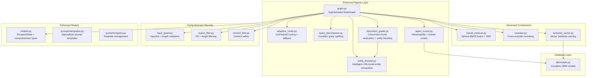

**Diagram sources**
- [graph.py:43-353](file://safe4ai-pilot/app/agents/graph.py#L43-L353)
- [adaptive_router.py:11-65](file://safe4ai-pilot/app/agents/adaptive_router.py#L11-L65)
- [query_decomposer.py:10-41](file://safe4ai-pilot/app/agents/query_decomposer.py#L10-L41)
- [document_grader.py:15-58](file://safe4ai-pilot/app/agents/document_grader.py#L15-L58)
- [entity_booster.py:107-149](file://safe4ai-pilot/app/agents/entity_booster.py#L107-L149)
- [agent_runner.py:14-55](file://safe4ai-pilot/app/services/agent_runner.py#L14-L55)
- [hybrid_retriever.py:15-210](file://safe4ai-pilot/app/components/hybrid_retriever.py#L15-L210)
- [reranker.py:14-50](file://safe4ai-pilot/app/components/reranker.py#L14-L50)
- [semantic_cache.py:16-114](file://safe4ai-pilot/app/services/semantic_cache.py#L16-L114)
- [input_guard.py:24-49](file://safe4ai-pilot/app/security/input_guard.py#L24-L49)
- [output_filter.py:30-60](file://safe4ai-pilot/app/security/output_filter.py#L30-L60)
- [models.py:49-95](file://safe4ai-pilot/app/models.py#L49-L95)
- [templates.py:12-81](file://safe4ai-pilot/app/prompts/templates.py#L12-L81)
- [registry.py:4-14](file://safe4ai-pilot/app/prompts/registry.py#L4-L14)
- [models_db.py:111-210](file://safe4ai-pilot/app/db/models.py#L111-L210)

**Section sources**
- [graph.py:43-353](file://safe4ai-pilot/app/agents/graph.py#L43-L353)
- [models.py:49-95](file://safe4ai-pilot/app/models.py#L49-L95)

## Core Components
The enhanced pipeline introduces several sophisticated components:

**StateGraph Architecture**: The core StateGraph manages a comprehensive state machine with 10 distinct steps: intake, rewrite, retrieve, grade, decompose, generate, output filter, quality gate, respond, and fallback. Each node handles specific aspects of the RAG workflow with detailed error handling and observability.

**Adaptive Routing System**: Features LLM-based decision making with JSON parsing and validation, combined with synchronous fallback rules for safety and resilience. The system uses specialized prompt templates and maintains context awareness throughout the decision process.

**Intelligent Query Decomposition**: Automatically breaks complex questions into 2-4 simpler sub-questions when relevance is low, then re-ranks and grades the combined results for optimal retrieval performance.

**Advanced Document Grading**: Implements concurrent chunk evaluation using semaphores to limit parallel requests while maintaining high throughput. Each chunk receives individual relevance assessment with confidence scoring. **Updated** Now includes intelligent entity boosting that enhances URL and email entity recognition while maintaining strict context constraints.

**Intelligent Entity Boosting**: **New Feature** Specialized component that recognizes URL and email entity patterns in chunks and boosts their scores when the query specifically requests those entities. Uses context-aware matching to prevent unrelated entity boosting while maintaining minimal score increases.

**Enhanced Agent Runner**: Provides comprehensive observability through OpenTelemetry spans, human review integration, and session persistence. The runner manages all database side effects while keeping graph nodes pure.

**Comprehensive Safety Gates**: Multi-layered protection including input validation against prompt injection attacks, output filtering for PII detection, and content safety filtering.

**Semantic Caching**: Advanced vector similarity caching with cosine distance calculations, hit tracking, and automatic invalidation for document updates.

**Type Safety Enhancement**: **Updated** Resolved NameError in agent graph component by adding RankedChunk import to enable proper type annotations for hybrid retrieval and query decomposition functions, ensuring consistent type checking across all pipeline components.

**Section sources**
- [graph.py:43-353](file://safe4ai-pilot/app/agents/graph.py#L43-L353)
- [adaptive_router.py:11-65](file://safe4ai-pilot/app/agents/adaptive_router.py#L11-L65)
- [query_decomposer.py:10-41](file://safe4ai-pilot/app/agents/query_decomposer.py#L10-L41)
- [document_grader.py:15-58](file://safe4ai-pilot/app/agents/document_grader.py#L15-L58)
- [entity_booster.py:107-149](file://safe4ai-pilot/app/agents/entity_booster.py#L107-L149)
- [agent_runner.py:14-55](file://safe4ai-pilot/app/services/agent_runner.py#L14-L55)
- [input_guard.py:24-49](file://safe4ai-pilot/app/security/input_guard.py#L24-L49)
- [output_filter.py:30-60](file://safe4ai-pilot/app/security/output_filter.py#L30-L60)
- [semantic_cache.py:16-114](file://safe4ai-pilot/app/services/semantic_cache.py#L16-L114)

## Architecture Overview
The pipeline implements a sophisticated LangGraph StateGraph with deterministic and conditional edges, featuring self-correction loops and adaptive routing. The architecture emphasizes safety, performance, and extensibility through a well-defined state machine that manages complex decision-making processes.

**Updated** Enhanced document grading now includes intelligent entity boosting that improves fact-extraction query performance while maintaining strict context constraints. **Resolved** NameError in agent graph component through proper RankedChunk type annotations.

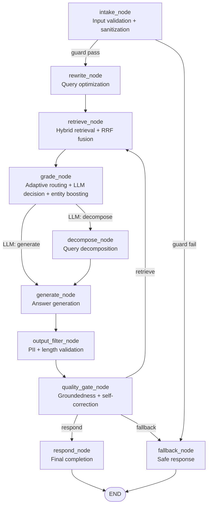

**Diagram sources**
- [graph.py:311-353](file://safe4ai-pilot/app/agents/graph.py#L311-L353)
- [adaptive_router.py:11-22](file://safe4ai-pilot/app/agents/adaptive_router.py#L11-L22)

**Section sources**
- [graph.py:311-353](file://safe4ai-pilot/app/agents/graph.py#L311-L353)
- [models.py:49-95](file://safe4ai-pilot/app/models.py#L49-L95)

## Detailed Component Analysis

### Enhanced StateGraph and State Management
The PrivateAIState model provides comprehensive state tracking with 18 distinct fields covering session management, retrieval metadata, decomposition results, generation context, grounding indicators, observability attributes, and human review flags. The state machine supports complex workflows with self-correction loops and maintains detailed audit trails.

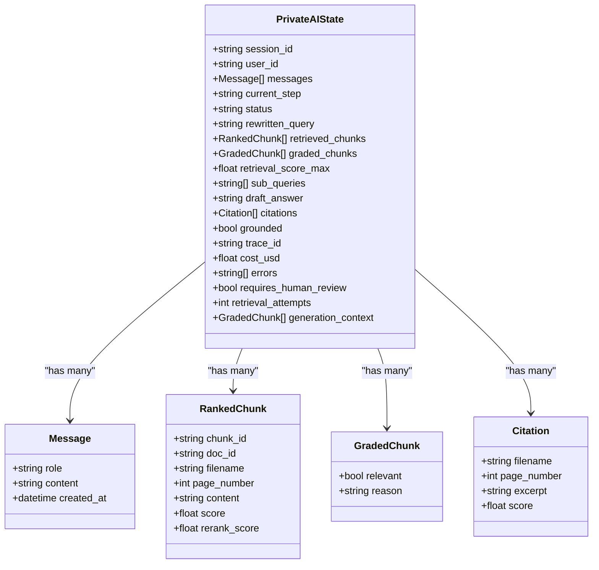

**Diagram sources**
- [models.py:49-95](file://safe4ai-pilot/app/models.py#L49-L95)

**Section sources**
- [models.py:49-95](file://safe4ai-pilot/app/models.py#L49-L95)
- [graph.py:311-353](file://safe4ai-pilot/app/agents/graph.py#L311-L353)

### Adaptive Routing and Decision Logic
The adaptive routing system combines LLM-based decision making with synchronous fallback rules for enhanced reliability. The system uses specialized prompt templates to guide routing decisions while maintaining safety through context-aware fallback mechanisms.

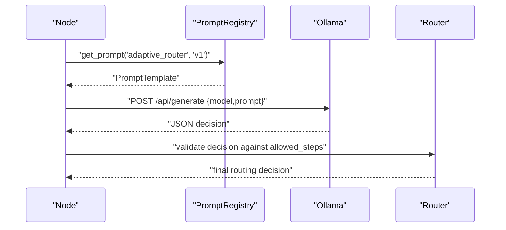

**Diagram sources**
- [adaptive_router.py:25-65](file://safe4ai-pilot/app/agents/adaptive_router.py#L25-L65)
- [templates.py:67-79](file://safe4ai-pilot/app/prompts/templates.py#L67-L79)

**Section sources**
- [adaptive_router.py:11-65](file://safe4ai-pilot/app/agents/adaptive_router.py#L11-L65)
- [graph.py:117-146](file://safe4ai-pilot/app/agents/graph.py#L117-L146)

### Intelligent Query Decomposition Mechanism
The query decomposition system automatically identifies complex questions and splits them into manageable sub-queries. The system maintains context throughout the decomposition process and aggregates results for optimal retrieval performance.

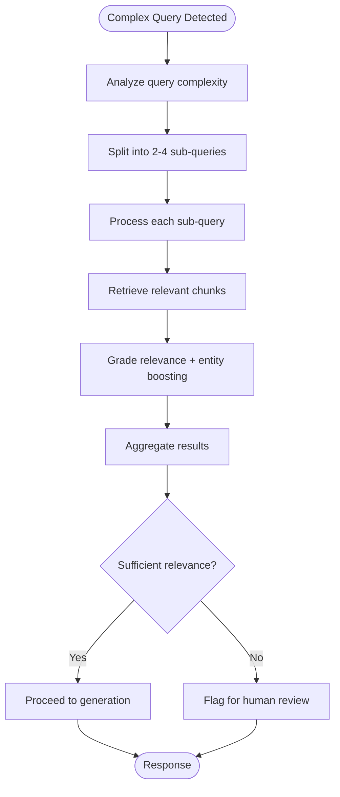

**Diagram sources**
- [query_decomposer.py:10-41](file://safe4ai-pilot/app/agents/query_decomposer.py#L10-L41)
- [graph.py:148-184](file://safe4ai-pilot/app/agents/graph.py#L148-L184)

**Section sources**
- [query_decomposer.py:10-41](file://safe4ai-pilot/app/agents/query_decomposer.py#L10-L41)
- [graph.py:148-184](file://safe4ai-pilot/app/agents/graph.py#L148-L184)

### Advanced Document Grading System
The document grader implements concurrent chunk evaluation using semaphores to control parallel processing while maintaining high throughput. Each chunk receives individual relevance assessment with confidence scoring. **Updated** Now includes intelligent entity boosting that enhances URL and email entity recognition while maintaining strict context constraints.

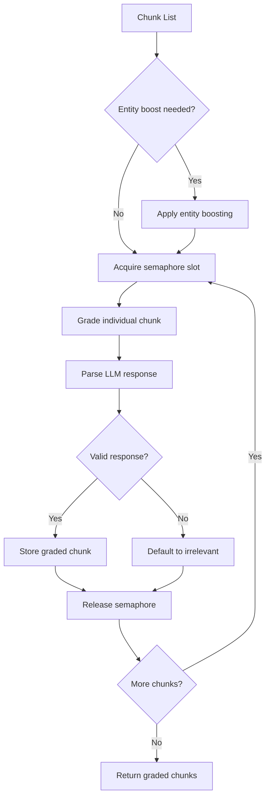

**Diagram sources**
- [document_grader.py:15-58](file://safe4ai-pilot/app/agents/document_grader.py#L15-L58)
- [entity_booster.py:107-149](file://safe4ai-pilot/app/agents/entity_booster.py#L107-L149)

**Section sources**
- [document_grader.py:15-58](file://safe4ai-pilot/app/agents/document_grader.py#L15-L58)
- [entity_booster.py:107-149](file://safe4ai-pilot/app/agents/entity_booster.py#L107-L149)

### Intelligent Entity Boosting System
**New Feature** The entity boosting system recognizes URL and email entity patterns in chunks and boosts their scores when the query specifically requests those entities. Uses sophisticated context-aware matching to prevent unrelated entity boosting while maintaining minimal score increases.

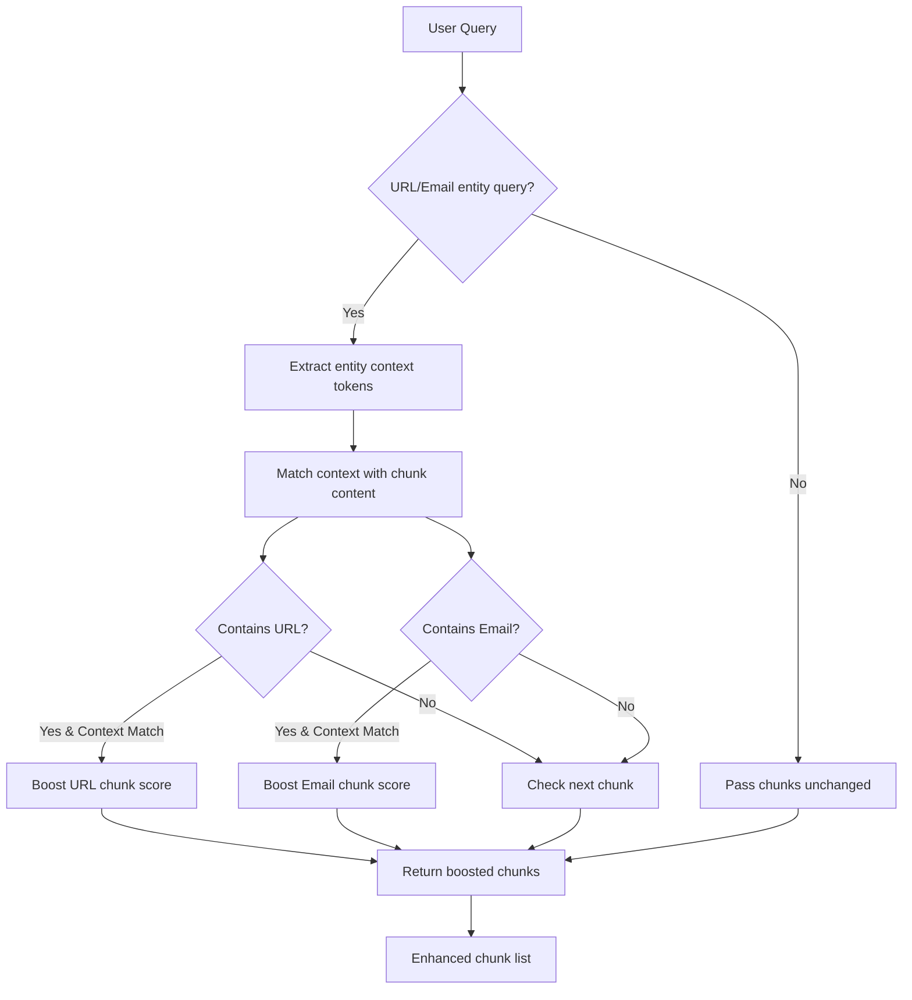

**Diagram sources**
- [entity_booster.py:107-149](file://safe4ai-pilot/app/agents/entity_booster.py#L107-L149)

**Section sources**
- [entity_booster.py:107-149](file://safe4ai-pilot/app/agents/entity_booster.py#L107-L149)

### Enhanced Agent Runner and Observability
The agent runner provides comprehensive observability through OpenTelemetry spans, manages human review integration, and ensures proper session persistence. The runner acts as a coordinator for all pipeline operations while maintaining clean separation of concerns.

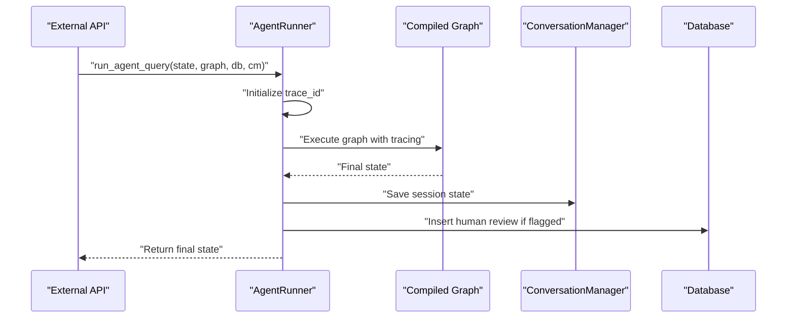

**Diagram sources**
- [agent_runner.py:14-55](file://safe4ai-pilot/app/services/agent_runner.py#L14-L55)
- [models_db.py:189-202](file://safe4ai-pilot/app/db/models.py#L189-L202)

**Section sources**
- [agent_runner.py:14-55](file://safe4ai-pilot/app/services/agent_runner.py#L14-L55)
- [models_db.py:189-202](file://safe4ai-pilot/app/db/models.py#L189-L202)

### Comprehensive Safety Gates and Validation
The pipeline implements multi-layered safety validation including input sanitization against prompt injection attacks, output filtering for PII detection, and content safety measures. Each layer provides detailed logging and error reporting for debugging and monitoring.

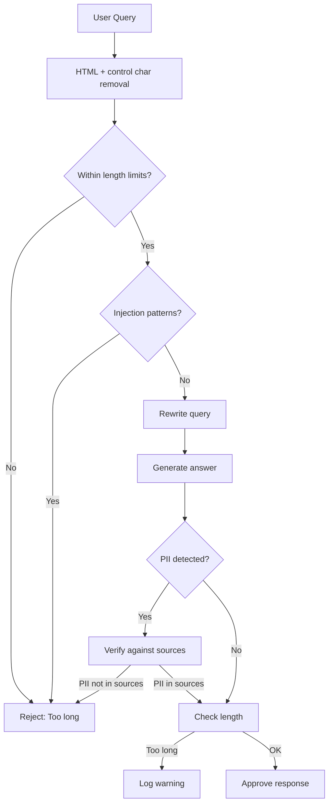

**Diagram sources**
- [input_guard.py:24-49](file://safe4ai-pilot/app/security/input_guard.py#L24-L49)
- [output_filter.py:30-60](file://safe4ai-pilot/app/security/output_filter.py#L30-L60)

**Section sources**
- [input_guard.py:24-49](file://safe4ai-pilot/app/security/input_guard.py#L24-L49)
- [output_filter.py:30-60](file://safe4ai-pilot/app/security/output_filter.py#L30-L60)

### Advanced Semantic Caching Strategy
The semantic cache implements vector similarity matching using cosine distance calculations, hit tracking, and automatic invalidation for document updates. The system optimizes performance by avoiding redundant LLM calls for similar queries.

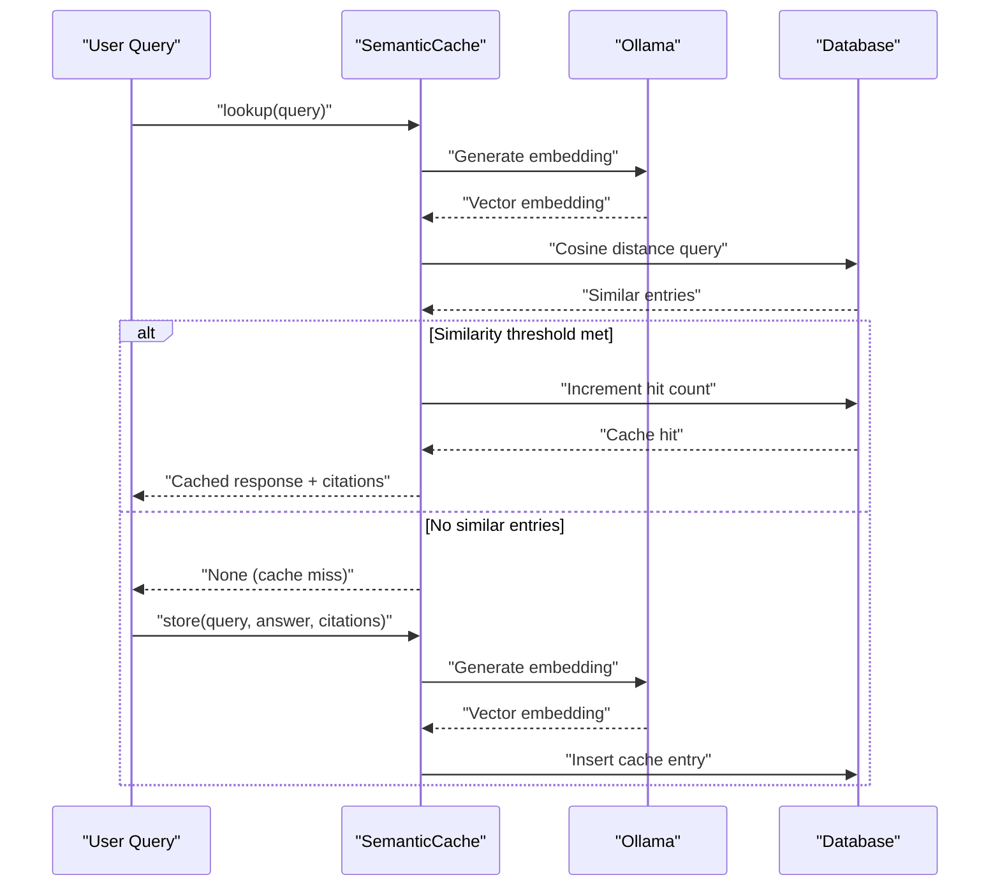

**Diagram sources**
- [semantic_cache.py:43-75](file://safe4ai-pilot/app/services/semantic_cache.py#L43-L75)

**Section sources**
- [semantic_cache.py:16-114](file://safe4ai-pilot/app/services/semantic_cache.py#L16-L114)
- [models_db.py:111-136](file://safe4ai-pilot/app/db/models.py#L111-L136)

### Enhanced Retrieval and Reranking System
The hybrid retrieval system combines dense vector search with sparse BM25 indexing, then applies Reciprocal Rank Fusion (RRF) to balance different retrieval signals. The reranker provides cross-encoder refinement for improved precision.

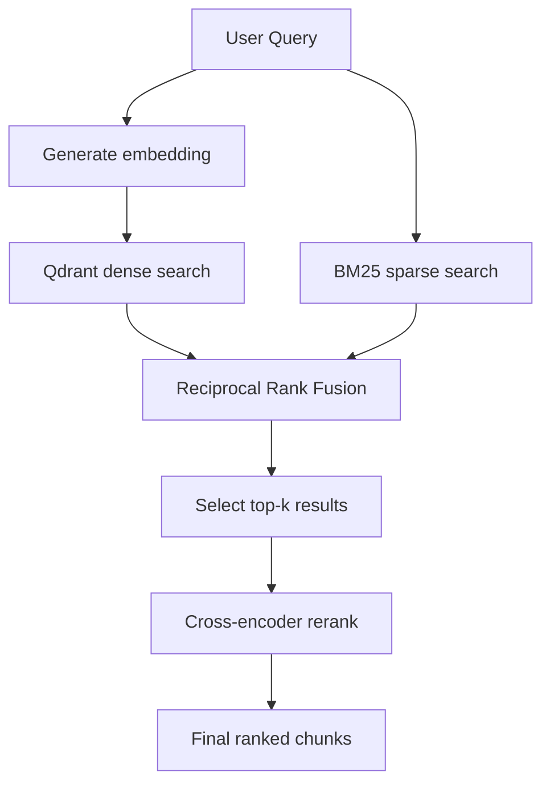

**Diagram sources**
- [hybrid_retriever.py:118-210](file://safe4ai-pilot/app/components/hybrid_retriever.py#L118-L210)
- [reranker.py:25-50](file://safe4ai-pilot/app/components/reranker.py#L25-L50)

**Section sources**
- [hybrid_retriever.py:15-210](file://safe4ai-pilot/app/components/hybrid_retriever.py#L15-L210)
- [reranker.py:14-50](file://safe4ai-pilot/app/components/reranker.py#L14-L50)

## Dependency Analysis
The enhanced pipeline maintains clear separation of concerns with well-defined dependencies:

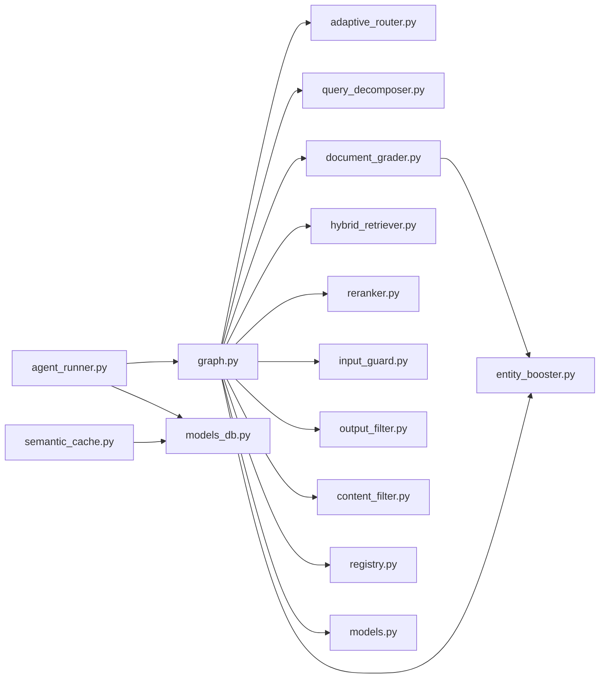

**Diagram sources**
- [graph.py:12-22](file://safe4ai-pilot/app/agents/graph.py#L12-L22)
- [models.py:49-95](file://safe4ai-pilot/app/models.py#L49-L95)
- [semantic_cache.py:16-114](file://safe4ai-pilot/app/services/semantic_cache.py#L16-L114)
- [agent_runner.py:14-55](file://safe4ai-pilot/app/services/agent_runner.py#L14-L55)

**Section sources**
- [graph.py:12-22](file://safe4ai-pilot/app/agents/graph.py#L12-L22)
- [models.py:49-95](file://safe4ai-pilot/app/models.py#L49-L95)

## Performance Considerations
The enhanced pipeline implements several performance optimization strategies:

**Parallel Processing**: Document grader uses semaphores to control concurrency while maximizing throughput for chunk evaluation.

**Batch Operations**: Hybrid retriever and semantic cache operations leverage batch processing where possible to reduce overhead.

**Intelligent Caching**: Semantic cache reduces repeated LLM calls through vector similarity matching with configurable thresholds.

**Self-Correction Guards**: Quality gate prevents infinite loops through retrieval attempt limits and groundedness checks.

**Resource Management**: HTTP clients are properly managed with context managers to prevent resource leaks.

**Monitoring and Metrics**: Comprehensive OpenTelemetry integration provides detailed performance metrics and error tracking.

**Entity Boosting Optimization**: **New Feature** Entity boosting uses efficient pattern matching with minimal computational overhead while significantly improving fact-extraction query performance.

**Type Safety Optimization**: **Updated** Proper RankedChunk type annotations eliminate NameError exceptions and improve IDE support and static analysis across all pipeline components.

**Section sources**
- [document_grader.py:12-12](file://safe4ai-pilot/app/agents/document_grader.py#L12-L12)
- [graph.py:39-40](file://safe4ai-pilot/app/agents/graph.py#L39-L40)
- [graph.py:272-276](file://safe4ai-pilot/app/agents/graph.py#L272-L276)
- [entity_booster.py:107-149](file://safe4ai-pilot/app/agents/entity_booster.py#L107-L149)

## Troubleshooting Guide
Enhanced debugging and monitoring capabilities:

**State Analysis**: Use trace_id correlation to track execution flow across all pipeline stages.

**Error Tracking**: Comprehensive error logging with detailed context for each node failure.

**Performance Bottlenecks**: Monitor chunk_count, relevant_chunks, and routing_decision attributes for optimization opportunities.

**LLM Integration Issues**: Verify Ollama availability, model readiness, and proper JSON parsing in routing decisions.

**Database Connectivity**: Monitor semantic cache and session persistence operations for connection issues.

**Human Review Queue**: Investigate requires_human_review flags with focus on retrieval_score_max and groundedness indicators.

**Entity Boosting Issues**: **New Feature** Monitor entity boost effectiveness through rerank_score improvements and context matching patterns.

**Type Safety Issues**: **Updated** Resolve NameError exceptions by ensuring RankedChunk import is present in all components that use it for type annotations in hybrid retrieval and query decomposition functions.

**Section sources**
- [graph.py:28-36](file://safe4ai-pilot/app/agents/graph.py#L28-L36)
- [graph.py:128-128](file://safe4ai-pilot/app/agents/graph.py#L128-L128)
- [graph.py:293-294](file://safe4ai-pilot/app/agents/graph.py#L293-L294)
- [agent_runner.py:38-52](file://safe4ai-pilot/app/services/agent_runner.py#L38-L52)

## Conclusion
The enhanced LangGraph State Machine provides a robust, scalable, and secure RAG pipeline with sophisticated adaptive routing, intelligent query decomposition, advanced document grading, and comprehensive safety measures. **Updated** The new entity boosting capabilities significantly improve fact-extraction query performance by intelligently recognizing URL and email entity patterns while maintaining strict context constraints. **Resolved** NameError in agent graph component through proper RankedChunk type annotations, enabling seamless integration across hybrid retrieval and query decomposition functions. The modular architecture enables easy extension and customization while maintaining high performance through semantic caching, concurrent processing, and intelligent resource management. The system's observability and human review integration ensure reliability and accountability in production environments.

## Appendices

### Extending the Pipeline
Adding new components follows established patterns:

**New StateGraph Node**: Implement async function with PrivateAIState updates and return next current_step value.

**Custom Routing Logic**: Extend adaptive_router with new decision criteria while maintaining fallback safety.

**Additional Prompt Templates**: Add new templates to TEMPLATES list with proper input validation.

**New Retrieval Components**: Integrate custom retrievers through HybridRetriever interface.

**Entity Boosting Enhancements**: **New Feature** Extend entity_booster with additional entity recognition patterns while maintaining context constraints and minimal score increases.

**Type Safety Extensions**: **Updated** Ensure all new components import RankedChunk for proper type annotations in hybrid retrieval and query decomposition functions.

**Section sources**
- [graph.py:43-353](file://safe4ai-pilot/app/agents/graph.py#L43-L353)
- [templates.py:12-81](file://safe4ai-pilot/app/prompts/templates.py#L12-L81)
- [registry.py:4-14](file://safe4ai-pilot/app/prompts/registry.py#L4-L14)
- [entity_booster.py:107-149](file://safe4ai-pilot/app/agents/entity_booster.py#L107-L149)

### Customizing Agent Behavior
Adjust pipeline parameters and behaviors:

**Routing Sensitivity**: Modify adaptive_router thresholds and decision validation logic.

**Quality Gate Rules**: Adjust groundedness requirements and self-correction loop limits.

**Retrieval Parameters**: Tune top_k values and rerank configurations for domain optimization.

**Safety Thresholds**: Configure input validation and output filtering sensitivity levels.

**Entity Boosting Configuration**: **New Feature** Adjust entity boost thresholds and context matching parameters for domain-specific optimization.

**Type Safety Configuration**: **Updated** Ensure RankedChunk type annotations are maintained consistently across all components for reliable type checking and IDE support.

**Section sources**
- [adaptive_router.py:11-65](file://safe4ai-pilot/app/agents/adaptive_router.py#L11-L65)
- [graph.py:264-295](file://safe4ai-pilot/app/agents/graph.py#L264-L295)
- [entity_booster.py:107-149](file://safe4ai-pilot/app/agents/entity_booster.py#L107-L149)

### Monitoring and Observability
Comprehensive monitoring implementation:

**OpenTelemetry Integration**: Per-node spans with session_id, trace_id, and node attributes.

**Performance Metrics**: Track chunk_count, relevant_chunks, routing_decision, grounded status.

**Error Tracking**: Detailed exception logging with context for debugging and alerting.

**Audit Trails**: Complete session history with all pipeline operations and decisions.

**Entity Boosting Metrics**: **New Feature** Monitor entity boost effectiveness through rerank_score improvements and context matching success rates.

**Type Safety Monitoring**: **Updated** Monitor for NameError exceptions and ensure consistent RankedChunk type annotations across all pipeline components.

**Section sources**
- [graph.py:28-36](file://safe4ai-pilot/app/agents/graph.py#L28-L36)
- [agent_runner.py:26-32](file://safe4ai-pilot/app/services/agent_runner.py#L26-L32)
- [models_db.py:138-151](file://safe4ai-pilot/app/db/models.py#L138-L151)
- [entity_booster.py:107-149](file://safe4ai-pilot/app/agents/entity_booster.py#L107-L149)