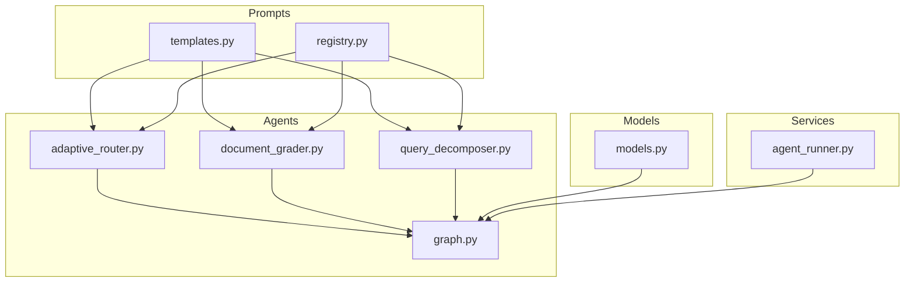
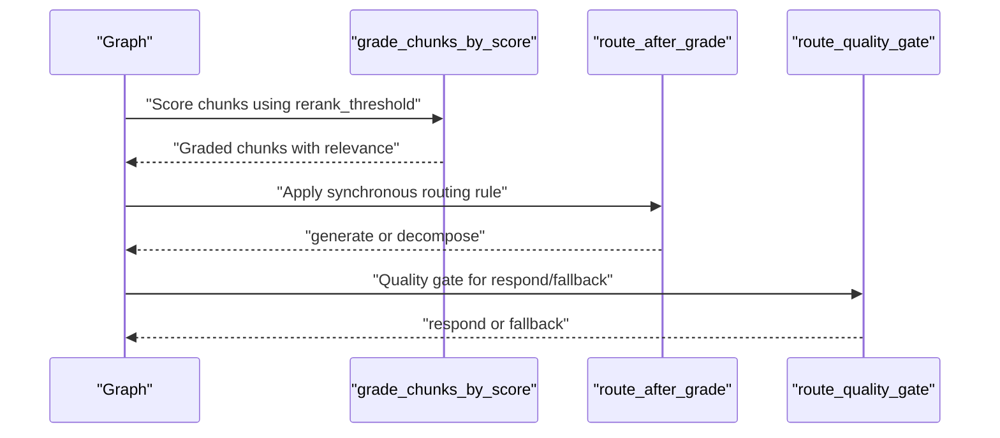
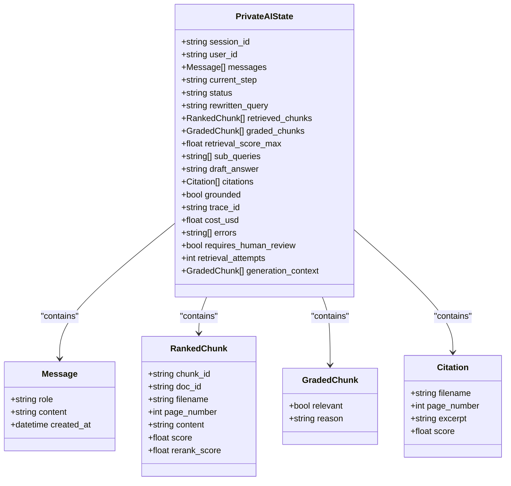
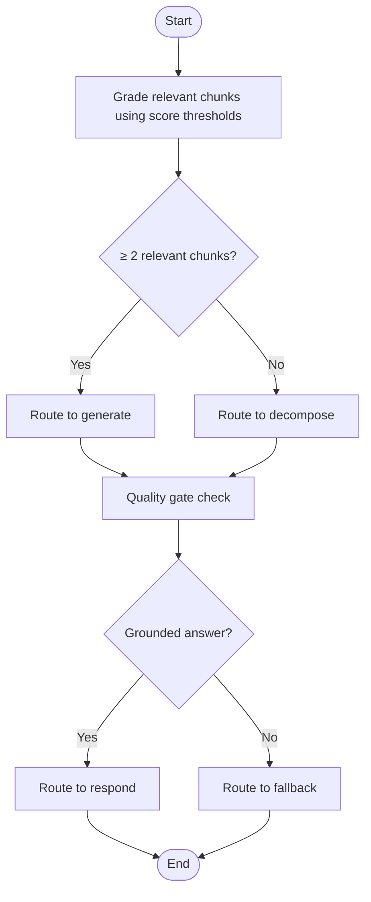
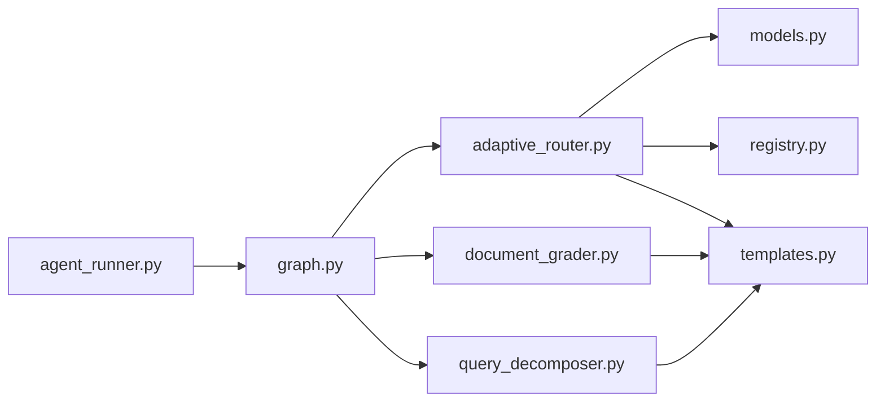

# Adaptive Routing System

<cite>
**Referenced Files in This Document**
- [adaptive_router.py](file://safe4ai-pilot/app/agents/adaptive_router.py)
- [graph.py](file://safe4ai-pilot/app/agents/graph.py)
- [models.py](file://safe4ai-pilot/app/models.py)
- [templates.py](file://safe4ai-pilot/app/prompts/templates.py)
- [registry.py](file://safe4ai-pilot/app/prompts/registry.py)
- [query_decomposer.py](file://safe4ai-pilot/app/agents/query_decomposer.py)
- [document_grader.py](file://safe4ai-pilot/app/agents/document_grader.py)
- [agent_runner.py](file://safe4ai-pilot/app/services/agent_runner.py)
- [test_agents.py](file://safe4ai-pilot/tests/test_agents.py)
</cite>

## Update Summary
**Changes Made**
- Removed all references to LLM-based adaptive routing with decide_next_step function
- Replaced with deterministic score-threshold grading system using grade_chunks_by_score()
- Updated routing logic to use synchronous route_after_grade() and route_quality_gate() functions
- Removed LLM dependencies from routing decisions
- Updated architecture diagrams and explanations to reflect deterministic decision making

## Table of Contents
1. [Introduction](#introduction)
2. [Project Structure](#project-structure)
3. [Core Components](#core-components)
4. [Architecture Overview](#architecture-overview)
5. [Detailed Component Analysis](#detailed-component-analysis)
6. [Dependency Analysis](#dependency-analysis)
7. [Performance Considerations](#performance-considerations)
8. [Troubleshooting Guide](#troubleshooting-guide)
9. [Conclusion](#conclusion)
10. [Appendices](#appendices)

## Introduction
This document explains the adaptive routing system that intelligently steers queries through different processing paths using a deterministic score-threshold grading system. The system has been completely redesigned to eliminate LLM dependencies and replace them with fast, reliable scoring mechanisms. It focuses on:
- The deterministic grade_chunks_by_score() function for score-based decision making
- The route_after_grade() and route_quality_gate() synchronous routing functions
- How the system evaluates query characteristics using rerank scores to choose between generate and decompose paths
- Examples of customizing routing logic with score thresholds and adding new routing criteria
- The routing state model and how it captures query context for decision making
- Performance improvements, routing accuracy metrics, and debugging routing decisions

## Project Structure
The adaptive routing system lives in the agents module and integrates with the LangGraph pipeline. Key files:
- Adaptive router and fallback logic: [adaptive_router.py](file://safe4ai-pilot/app/agents/adaptive_router.py)
- Graph pipeline and routing integration: [graph.py](file://safe4ai-pilot/app/agents/graph.py)
- State model and data structures: [models.py](file://safe4ai-pilot/app/models.py)
- Prompt templates and registry: [templates.py](file://safe4ai-pilot/app/prompts/templates.py), [registry.py](file://safe4ai-pilot/app/prompts/registry.py)
- Supporting components: [query_decomposer.py](file://safe4ai-pilot/app/agents/query_decomposer.py), [document_grader.py](file://safe4ai-pilot/app/agents/document_grader.py)
- Pipeline orchestration and tracing: [agent_runner.py](file://safe4ai-pilot/app/services/agent_runner.py)
- Tests validating safety and correctness: [test_agents.py](file://safe4ai-pilot/tests/test_agents.py)

**Diagram sources**
- [adaptive_router.py](file://safe4ai-pilot/app/agents/adaptive_router.py)
- [graph.py](file://safe4ai-pilot/app/agents/graph.py)
- [models.py](file://safe4ai-pilot/app/models.py)
- [templates.py](file://safe4ai-pilot/app/prompts/templates.py)
- [registry.py](file://safe4ai-pilot/app/prompts/registry.py)
- [query_decomposer.py](file://safe4ai-pilot/app/agents/query_decomposer.py)
- [document_grader.py](file://safe4ai-pilot/app/agents/document_grader.py)
- [agent_runner.py](file://safe4ai-pilot/app/services/agent_runner.py)

**Section sources**
- [adaptive_router.py](file://safe4ai-pilot/app/agents/adaptive_router.py)
- [graph.py](file://safe4ai-pilot/app/agents/graph.py)
- [models.py](file://safe4ai-pilot/app/models.py)
- [templates.py](file://safe4ai-pilot/app/prompts/templates.py)
- [registry.py](file://safe4ai-pilot/app/prompts/registry.py)
- [query_decomposer.py](file://safe4ai-pilot/app/agents/query_decomposer.py)
- [document_grader.py](file://safe4ai-pilot/app/agents/document_grader.py)
- [agent_runner.py](file://safe4ai-pilot/app/services/agent_runner.py)

## Core Components
- Deterministic adaptive router: score-threshold based decision making with fallbacks and safety gates
- Fallback rules: route_after_grade and route_quality_gate
- Routing state model: PrivateAIState encapsulates query context and progress
- Score-based grading: grade_chunks_by_score() for fast, reliable chunk relevance assessment
- Graph pipeline: orchestrates nodes and applies routing decisions

Key responsibilities:
- grade_chunks_by_score(): evaluates chunks using rerank scores without LLM dependencies
- route_after_grade(): synchronous rule that chooses generate if two or more relevant chunks exist; otherwise decompose
- route_quality_gate(): synchronous gate that allows respond only if grounded; otherwise fallback
- PrivateAIState: carries messages, retrieval results, grading outcomes, and pipeline metadata

**Section sources**
- [adaptive_router.py](file://safe4ai-pilot/app/agents/adaptive_router.py)
- [graph.py](file://safe4ai-pilot/app/agents/graph.py)
- [models.py](file://safe4ai-pilot/app/models.py)
- [templates.py](file://safe4ai-pilot/app/prompts/templates.py)
- [registry.py](file://safe4ai-pilot/app/prompts/registry.py)

## Architecture Overview
The adaptive routing system is embedded in a LangGraph pipeline. At key decision points, the system:
- Collects context from PrivateAIState
- Uses deterministic score thresholds to evaluate chunk relevance
- Applies synchronous fallback rules when score-based decisions are insufficient
- Enforces safety gates to prevent unsafe transitions

**Diagram sources**
- [graph.py](file://safe4ai-pilot/app/agents/graph.py)
- [adaptive_router.py](file://safe4ai-pilot/app/agents/adaptive_router.py)
- [document_grader.py](file://safe4ai-pilot/app/agents/document_grader.py)

## Detailed Component Analysis

### Deterministic Adaptive Router: route_after_grade and route_quality_gate
Purpose:
- route_after_grade: synchronous rule that chooses generate if two or more relevant chunks exist; otherwise decompose
- route_quality_gate: synchronous gate that allows respond only if grounded; otherwise fallback

Behavior highlights:
- Both functions operate synchronously without LLM dependencies
- route_after_grade uses the count of relevant chunks from graded_chunks
- route_quality_gate checks the grounded property set during quality_gate_node
- Functions are deterministic and predictable, eliminating LLM variability

Integration points:
- Called from grade_node and quality_gate_node in the graph
- Provide immediate routing decisions without external API calls
- Ensure consistent behavior across different environments

Safety and fallback:
- route_after_grade prevents unsafe "generate" when synchronous rule indicates "decompose"
- route_quality_gate never routes ungrounded answers to "respond"
- Additional safety checks override decisions when necessary

**Section sources**
- [adaptive_router.py](file://safe4ai-pilot/app/agents/adaptive_router.py)
- [graph.py](file://safe4ai-pilot/app/agents/graph.py)

### Score-Based Chunk Grading: grade_chunks_by_score
Purpose:
- Evaluates chunk relevance using rerank scores without LLM dependencies
- Provides fast, deterministic chunk grading for routing decisions

Behavior highlights:
- Uses rerank_threshold parameter to determine relevance
- Returns GradedChunk objects with relevant boolean and reason "rerank"
- Operates independently of LLM calls, improving performance and reliability
- Supports concurrent processing of multiple chunks

Integration points:
- Used by grade_chunks() when rerank_threshold is provided
- Eliminates LLM calls for basic routing decisions
- Maintains compatibility with existing document_grader interface

**Section sources**
- [document_grader.py](file://safe4ai-pilot/app/agents/document_grader.py)

### Fallback Mechanisms: route_after_grade and route_quality_gate
- route_after_grade: synchronous rule that chooses generate if two or more relevant chunks exist; otherwise decompose
- route_quality_gate: synchronous gate that allows respond only if grounded; otherwise fallback

Usage in the pipeline:
- grade_node: applies route_after_grade to determine between generate and decompose
- quality_gate_node: applies route_quality_gate to decide between respond, retrieve, or fallback

These mechanisms ensure robustness and safety without relying on LLM behavior.

**Section sources**
- [adaptive_router.py](file://safe4ai-pilot/app/agents/adaptive_router.py)
- [graph.py](file://safe4ai-pilot/app/agents/graph.py)

### Routing State Model: PrivateAIState
PrivateAIState captures all context needed for routing decisions:
- Lifecycle: session_id, user_id, current_step, status
- Messages: conversation history
- Retrieval: rewritten_query, retrieved_chunks, graded_chunks, retrieval_score_max
- Decomposition: sub_queries
- Output: draft_answer, citations, grounded
- Observability: trace_id, cost_usd, errors, requires_human_review
- Loop guards: retrieval_attempts
- Generation context: generation_context snapshot for output filtering

How it supports routing:
- grade_node uses graded_chunks to inform routing decisions
- quality_gate_node uses grounded and retrieval_attempts to constrain allowed steps and enforce safety

**Diagram sources**
- [models.py](file://safe4ai-pilot/app/models.py)

**Section sources**
- [models.py](file://safe4ai-pilot/app/models.py)

### Prompt Templates and Registry
- Templates define structured prompts for query rewriting, document grading, query decomposition, and RAG answering
- Registry resolves templates by name and version, raising errors if missing or mismatched

Template roles:
- query_rewriter,v1: refines user queries for better retrieval
- document_grader,v1: grades relevance and reasons per chunk (used when LLM grading is enabled)
- query_decomposer,v1: splits complex queries into sub-queries
- rag_answer,v1: generates final answers using retrieved context

**Section sources**
- [templates.py](file://safe4ai-pilot/app/prompts/templates.py)
- [registry.py](file://safe4ai-pilot/app/prompts/registry.py)

### Supporting Components
- Document grader: grades chunks using either LLM-based or score-based methods; returns GradedChunk with relevance and reason
- Query decomposer: splits query into 2–4 sub-queries using query_decomposer,v1 template; falls back to original query on failure

These components supply the context used by adaptive routing decisions.

**Section sources**
- [document_grader.py](file://safe4ai-pilot/app/agents/document_grader.py)
- [query_decomposer.py](file://safe4ai-pilot/app/agents/query_decomposer.py)
- [templates.py](file://safe4ai-pilot/app/prompts/templates.py)

### Graph Integration and Safety Gates
The graph applies adaptive routing at two critical points:
- grade_node: decides between generate and decompose using route_after_grade; applies synchronous rules
- quality_gate_node: decides between respond, retrieve, or fallback; enforces groundedness and retrieval attempts caps

Safety enforcement:
- grade_node: if route_after_grade suggests decompose, choose decompose regardless of LLM behavior
- quality_gate_node: never route ungrounded answers to respond; restrict allowed steps after max retrieval attempts

Self-correction loop:
- quality_gate_node limits retrieval loops to a maximum number of attempts to avoid infinite loops

**Section sources**
- [graph.py](file://safe4ai-pilot/app/agents/graph.py)
- [adaptive_router.py](file://safe4ai-pilot/app/agents/adaptive_router.py)

### Sequence of Adaptive Routing Decisions

**Diagram sources**
- [graph.py](file://safe4ai-pilot/app/agents/graph.py)
- [adaptive_router.py](file://safe4ai-pilot/app/agents/adaptive_router.py)

## Dependency Analysis
- adaptive_router depends on:
  - PrivateAIState for context
  - Directly operates without LLM dependencies
- graph integrates adaptive_router and fallbacks into nodes
- document_grader and query_decomposer feed context into routing decisions
- agent_runner orchestrates the pipeline and tracing

**Diagram sources**
- [adaptive_router.py](file://safe4ai-pilot/app/agents/adaptive_router.py)
- [graph.py](file://safe4ai-pilot/app/agents/graph.py)
- [models.py](file://safe4ai-pilot/app/models.py)
- [templates.py](file://safe4ai-pilot/app/prompts/templates.py)
- [registry.py](file://safe4ai-pilot/app/prompts/registry.py)
- [document_grader.py](file://safe4ai-pilot/app/agents/document_grader.py)
- [query_decomposer.py](file://safe4ai-pilot/app/agents/query_decomposer.py)
- [agent_runner.py](file://safe4ai-pilot/app/services/agent_runner.py)

**Section sources**
- [adaptive_router.py](file://safe4ai-pilot/app/agents/adaptive_router.py)
- [graph.py](file://safe4ai-pilot/app/agents/graph.py)
- [models.py](file://safe4ai-pilot/app/models.py)
- [templates.py](file://safe4ai-pilot/app/prompts/templates.py)
- [registry.py](file://safe4ai-pilot/app/prompts/registry.py)
- [document_grader.py](file://safe4ai-pilot/app/agents/document_grader.py)
- [query_decomposer.py](file://safe4ai-pilot/app/agents/query_decomposer.py)
- [agent_runner.py](file://safe4ai-pilot/app/services/agent_runner.py)

## Performance Considerations
- Eliminated LLM call timeouts: adaptive_router no longer relies on external LLM APIs
- Improved parallelism: document_grader uses concurrent grading for multiple chunks
- Reduced latency: score-based grading eliminates network calls and processing delays
- Lower costs: no LLM token usage for routing decisions
- Predictable performance: deterministic functions provide consistent response times
- Caching and warm-up: service can pre-warm LLM models for generation phase only

Recommendations:
- Monitor rerank_threshold tuning for optimal routing accuracy
- Consider caching frequently accessed prompts for query rewriting
- Track performance improvements from eliminating LLM dependencies

**Section sources**
- [adaptive_router.py](file://safe4ai-pilot/app/agents/adaptive_router.py)
- [document_grader.py](file://safe4ai-pilot/app/agents/document_grader.py)
- [main.py](file://safe4ai-pilot/app/main.py)

## Troubleshooting Guide
Common issues and resolutions:
- Low rerank_threshold causing incorrect routing: adjust rerank_threshold parameter to balance precision and recall
- Uncaught LLM exceptions: exceptions no longer occur in routing as LLM calls are eliminated
- Unsafe routing: safety checks still override decisions when necessary
- Self-correction loop: retrieval_attempts cap prevents infinite loops; after the cap, allowed steps exclude "retrieve"

Debugging tips:
- Inspect PrivateAIState attributes (graded_chunks, grounded, retrieval_attempts) to understand routing context
- Enable tracing to observe node spans and routing decisions
- Validate prompt template correctness via registry resolution
- Monitor rerank scores to understand why chunks are classified as relevant or not

**Section sources**
- [adaptive_router.py](file://safe4ai-pilot/app/agents/adaptive_router.py)
- [graph.py](file://safe4ai-pilot/app/agents/graph.py)
- [models.py](file://safe4ai-pilot/app/models.py)
- [agent_runner.py](file://safe4ai-pilot/app/services/agent_runner.py)
- [test_agents.py](file://safe4ai-pilot/tests/test_agents.py)

## Conclusion
The adaptive routing system now uses a deterministic score-threshold approach that eliminates LLM dependencies while maintaining robust decision-making capabilities. It leverages a rich state model to capture context, integrates tightly with the LangGraph pipeline, and enforces safety constraints to prevent unsafe transitions. The modular design enables customization of routing logic through threshold adjustments, addition of new criteria, and maintains hybrid decision-making capabilities for future enhancements.

## Appendices

### Customizing Routing Logic
- Adjust score thresholds:
  - Modify rerank_threshold parameter in grade_chunks() to control routing sensitivity
  - Tune thresholds based on domain requirements and performance metrics
- Add new routing criteria:
  - Extend PrivateAIState with new fields capturing query characteristics
  - Create new synchronous routing functions similar to route_after_grade
  - Update allowed_steps per node to reflect new options
- Hybrid decision-making:
  - Combine score-based routing with synchronous rules for enhanced accuracy
  - Apply safety overrides to prevent unsafe transitions
- New prompt templates:
  - Define new templates in templates.py and resolve via registry
  - Ensure JSON schema compatibility for parsed outputs

**Section sources**
- [models.py](file://safe4ai-pilot/app/models.py)
- [templates.py](file://safe4ai-pilot/app/prompts/templates.py)
- [registry.py](file://safe4ai-pilot/app/prompts/registry.py)
- [adaptive_router.py](file://safe4ai-pilot/app/agents/adaptive_router.py)
- [graph.py](file://safe4ai-pilot/app/agents/graph.py)

### Routing Accuracy Metrics
- Track groundedness: proportion of "respond" decisions where grounded is true
- Measure retrieval effectiveness: ratio of relevant chunks and max retrieval scores
- Monitor fallback rates: frequency of fallbacks due to insufficient relevance
- Evaluate self-correction: count of retrieval loops and their outcomes
- Assess score threshold performance: correlation between rerank scores and routing accuracy

**Section sources**
- [graph.py](file://safe4ai-pilot/app/agents/graph.py)
- [models.py](file://safe4ai-pilot/app/models.py)