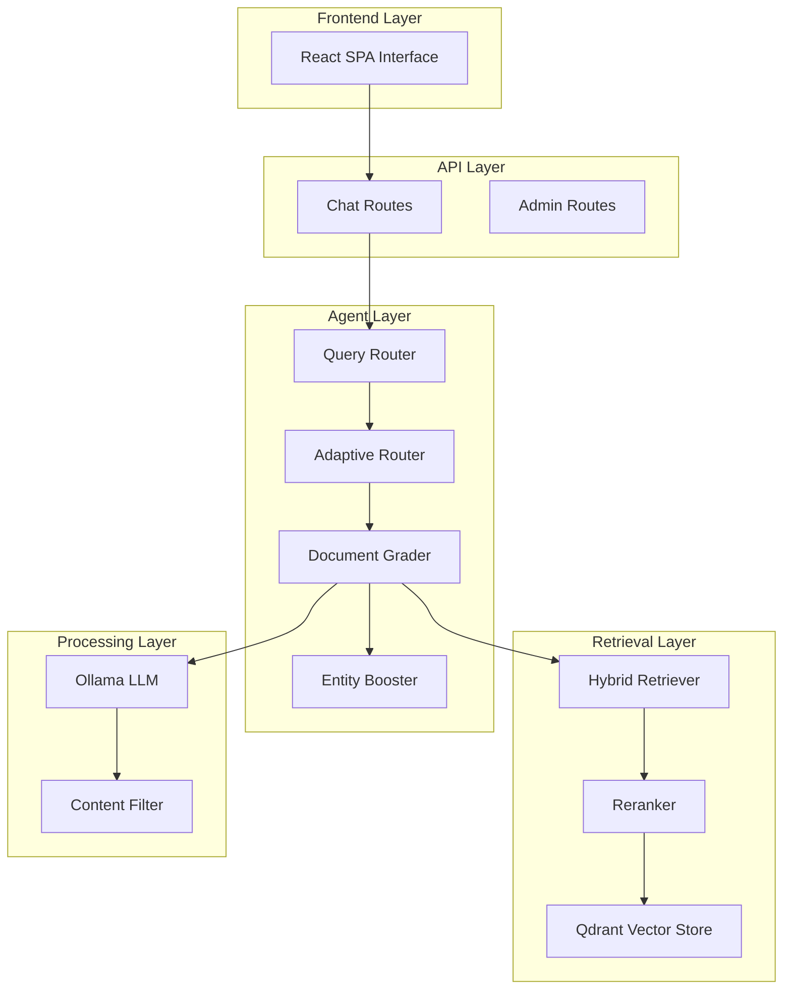
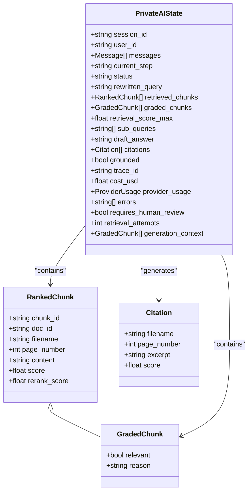
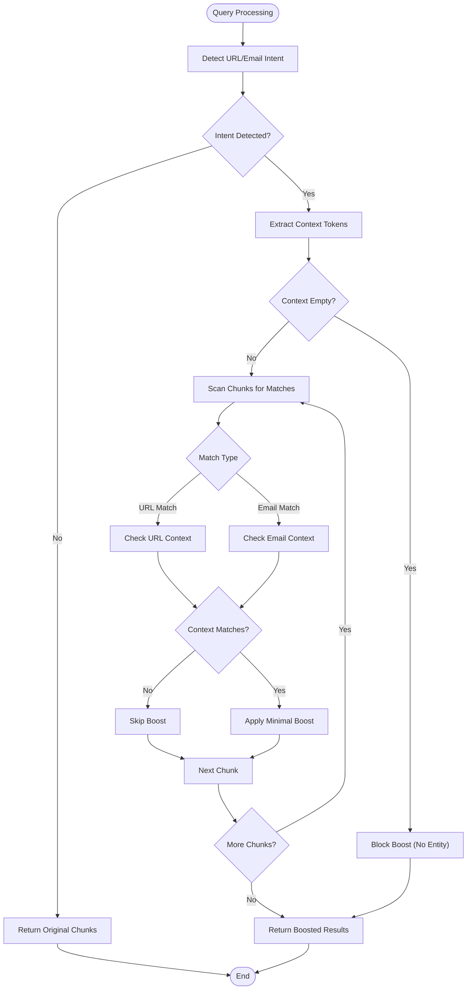
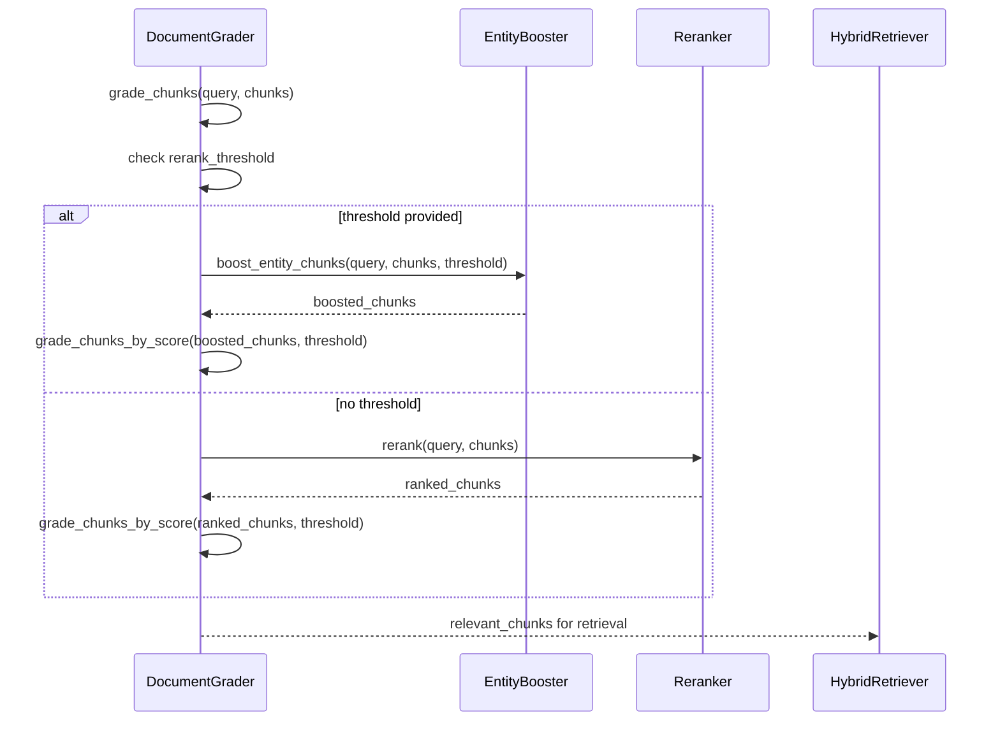
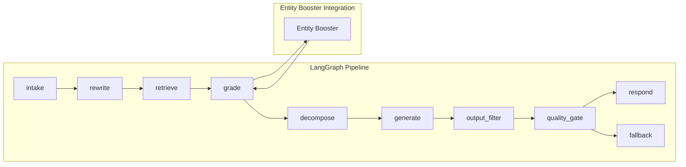

# Entity Booster System

<cite>
**Referenced Files in This Document**
- [entity_booster.py](file://safe4ai-pilot/app/agents/entity_booster.py)
- [document_grader.py](file://safe4ai-pilot/app/agents/document_grader.py)
- [test_entity_booster.py](file://safe4ai-pilot/tests/test_entity_booster.py)
- [models.py](file://safe4ai-pilot/app/models.py)
- [architecture.md](file://safe4ai-pilot/docs/architecture.md)
- [graph.py](file://safe4ai-pilot/app/agents/graph.py)
- [query_router.py](file://safe4ai-pilot/app/services/query_router.py)
- [adaptive_router.py](file://safe4ai-pilot/app/agents/adaptive_router.py)
- [reranker.py](file://safe4ai-pilot/app/components/reranker.py)
- [rag_pipeline.py](file://safe4ai-pilot/app/services/rag_pipeline.py)
</cite>

## Table of Contents
1. [Introduction](#introduction)
2. [System Architecture](#system-architecture)
3. [Core Components](#core-components)
4. [Entity Booster Implementation](#entity-booster-implementation)
5. [Integration Points](#integration-points)
6. [Performance Characteristics](#performance-characteristics)
7. [Testing Strategy](#testing-strategy)
8. [Troubleshooting Guide](#troubleshooting-guide)
9. [Conclusion](#conclusion)

## Introduction

The Entity Booster System is a specialized component within the Private AI chat/RAG (Retrieval-Augmented Generation) application designed to improve the accuracy of fact-extraction queries. Traditional cross-encoder models struggle with queries seeking specific entity information such as URLs, email addresses, or contact details because these chunks often appear as social media posts or general prose rather than structured Q&A answers.

The system addresses this challenge by implementing intelligent boosting mechanisms that temporarily elevate the scores of chunks containing exact-match entities when the query specifically requests that information, while maintaining strict context constraints to prevent irrelevant content from being promoted.

## System Architecture

The Entity Booster operates within the broader LangGraph pipeline architecture of the Private AI system:

**Diagram sources**
- [architecture.md:20-28](file://safe4ai-pilot/docs/architecture.md#L20-L28)
- [graph.py:313-351](file://safe4ai-pilot/app/agents/graph.py#L313-L351)

The Entity Booster sits strategically between the Document Grader and the Hybrid Retriever in the pipeline, acting as a quality filter that ensures entity-focused queries receive appropriate chunk prioritization.

**Section sources**
- [architecture.md:1-45](file://safe4ai-pilot/docs/architecture.md#L1-L45)
- [graph.py:313-351](file://safe4ai-pilot/app/agents/graph.py#L313-L351)

## Core Components

### Data Models

The Entity Booster system relies on several key data models that define the structure of information flowing through the pipeline:

**Diagram sources**
- [models.py:17-102](file://safe4ai-pilot/app/models.py#L17-L102)

**Section sources**
- [models.py:1-102](file://safe4ai-pilot/app/models.py#L1-L102)

## Entity Booster Implementation

### Core Algorithm Design

The Entity Booster implements a sophisticated context-aware scoring mechanism that operates on three fundamental principles:

1. **Intent Detection**: Identifies queries specifically requesting URLs or email addresses
2. **Context Extraction**: Strips entity-type signal words to identify the actual entity being requested
3. **Selective Boosting**: Temporarily elevates scores of relevant chunks while maintaining strict context constraints

**Diagram sources**
- [entity_booster.py:107-149](file://safe4ai-pilot/app/agents/entity_booster.py#L107-L149)

### Pattern Recognition System

The system employs sophisticated regular expression patterns to identify entity-related content:

| Pattern Category | Regular Expression | Purpose |
|------------------|-------------------|---------|
| URL Query Signals | `\b(url|link|website|site|domain|webpage|web\s*address|http|www\.)\b` | Detects queries asking for URLs |
| Email Query Signals | `\b(email|e-mail|contact|reach\s*(out|them|us))\b` | Detects queries asking for email addresses |
| URL Content Detection | `https?://\S+|www\.\S+` | Extracts URLs from chunk content |
| Email Content Detection | `\b[\w.+-]+@[\w-]+\.\w{2,}\b` | Extracts email addresses from chunk content |

### Context Token Processing

The context extraction process involves several sophisticated steps:

1. **Signal Word Removal**: Eliminates entity-type signal words from queries
2. **Token Normalization**: Converts to lowercase and splits by word boundaries
3. **Stop Word Filtering**: Removes common words that don't contribute to entity identification
4. **Length Validation**: Maintains tokens with 2+ characters to preserve acronyms

**Section sources**
- [entity_booster.py:1-150](file://safe4ai-pilot/app/agents/entity_booster.py#L1-L150)

## Integration Points

### Document Grader Integration

The Entity Booster integrates seamlessly with the Document Grader through a clean interface:

**Diagram sources**
- [document_grader.py:28-43](file://safe4ai-pilot/app/agents/document_grader.py#L28-L43)
- [entity_booster.py:107-149](file://safe4ai-pilot/app/agents/entity_booster.py#L107-L149)

### Pipeline Integration

The Entity Booster participates in the broader LangGraph pipeline as follows:

**Diagram sources**
- [graph.py:313-351](file://safe4ai-pilot/app/agents/graph.py#L313-L351)
- [document_grader.py:28-43](file://safe4ai-pilot/app/agents/document_grader.py#L28-L43)

**Section sources**
- [document_grader.py:1-97](file://safe4ai-pilot/app/agents/document_grader.py#L1-L97)
- [graph.py:303-351](file://safe4ai-pilot/app/agents/graph.py#L303-L351)

## Performance Characteristics

### Computational Complexity

The Entity Booster operates with optimal time complexity:

- **Pattern Matching**: O(n) where n is the length of the query/chunk content
- **Context Processing**: O(m) where m is the number of tokens in the query
- **Memory Usage**: O(k) where k is the number of chunks processed

### Score Management

The system maintains score integrity through careful manipulation:

- **Minimal Boost**: Adds exactly 0.05 to the threshold for successful boosts
- **Score Floor Preservation**: Ensures original scores below threshold remain unchanged
- **Threshold Isolation**: Prevents entity boosts from affecting semantic query thresholds

### Throughput Considerations

The Entity Booster is designed for high-throughput scenarios:

- **Batch Processing**: Processes multiple chunks efficiently in a single pass
- **Early Termination**: Quickly identifies non-matching chunks
- **Memory Efficiency**: Uses immutable operations with minimal memory overhead

**Section sources**
- [entity_booster.py:130-149](file://safe4ai-pilot/app/agents/entity_booster.py#L130-L149)

## Testing Strategy

### Comprehensive Test Coverage

The Entity Booster includes extensive test coverage ensuring reliability and correctness:

| Test Category | Test Cases | Purpose |
|---------------|------------|---------|
| URL Boosting | 8 test cases | Verify URL-specific boosting behavior |
| Email Boosting | 6 test cases | Verify email-specific boosting behavior |
| Context Constraints | 6 test cases | Ensure proper context matching |
| Edge Cases | 4 test cases | Handle boundary conditions |
| Integration Tests | 3 test cases | Validate pipeline integration |

### Test Scenarios

The testing suite covers critical scenarios:

1. **Entity-Specific Queries**: Queries that explicitly name the target organization
2. **Context Mismatch**: Unrelated URLs/emails in chunks
3. **Mixed Content**: Multiple chunks with varying relevance
4. **Acronym Handling**: Proper processing of 2-character acronyms
5. **Threshold Management**: Maintaining score boundaries

**Section sources**
- [test_entity_booster.py:1-175](file://safe4ai-pilot/tests/test_entity_booster.py#L1-L175)

## Troubleshooting Guide

### Common Issues and Solutions

| Issue | Symptoms | Solution |
|-------|----------|----------|
| No Boost Applied | Entity queries return no special treatment | Verify query contains URL/email intent signals |
| Over-Boosting | Too many chunks receiving boosts | Check context token extraction and matching logic |
| Under-Boosting | Relevant chunks not boosted | Review pattern matching and stop word filtering |
| Performance Degradation | Slow response times with large chunk sets | Optimize regex patterns and consider chunk batching |

### Debugging Strategies

1. **Query Analysis**: Examine the extracted context tokens to ensure proper entity identification
2. **Pattern Verification**: Test regex patterns independently to confirm matching behavior
3. **Score Tracking**: Monitor score modifications to ensure minimal boost application
4. **Integration Testing**: Validate pipeline integration through end-to-end testing

### Monitoring and Metrics

Key metrics to monitor for Entity Booster effectiveness:

- **Boost Rate**: Percentage of queries receiving entity boosts
- **Relevance Improvement**: Increase in relevant chunk detection accuracy
- **False Positive Rate**: Incidents of unrelated content being boosted
- **Processing Time**: Average time per chunk processing

## Conclusion

The Entity Booster System represents a sophisticated solution to a common problem in RAG applications: the poor performance of cross-encoder models on fact-extraction queries. By implementing intelligent context-aware boosting mechanisms, the system successfully bridges the gap between traditional semantic search and entity-specific information retrieval.

The system's strength lies in its careful balance between effectiveness and safety. It provides targeted assistance for entity queries while maintaining strict context constraints to prevent irrelevant content from being promoted. The modular design ensures seamless integration with existing pipeline components, and the comprehensive testing framework provides confidence in production deployments.

Future enhancements could include machine learning-based context extraction, dynamic threshold adjustment based on query complexity, and expanded support for additional entity types beyond URLs and email addresses.