# LangGraph State Machine

<cite>
**Referenced Files in This Document**
- [graph.py](file://safe4ai-pilot/app/agents/graph.py)
- [models.py](file://safe4ai-pilot/app/models.py)
- [chat_routes.py](file://safe4ai-pilot/app/api/chat_routes.py)
- [adaptive_router.py](file://safe4ai-pilot/app/agents/adaptive_router.py)
- [document_grader.py](file://safe4ai-pilot/app/agents/document_grader.py)
- [query_decomposer.py](file://safe4ai-pilot/app/agents/query_decomposer.py)
- [hybrid_retriever.py](file://safe4ai-pilot/app/components/hybrid_retriever.py)
- [reranker.py](file://safe4ai-pilot/app/components/reranker.py)
- [input_guard.py](file://safe4ai-pilot/app/security/input_guard.py)
- [output_filter.py](file://safe4ai-pilot/app/security/output_filter.py)
- [tracer.py](file://safe4ai-pilot/observability/tracer.py)
- [agent_runner.py](file://safe4ai-pilot/app/services/agent_runner.py)
- [test_chat.py](file://safe4ai-pilot/tests/test_chat.py)
</cite>

## Update Summary
**Changes Made**
- Added comprehensive documentation for streaming LangGraph state management
- Updated PrivateAIState model documentation to reflect enhanced state merging capabilities
- Added new section on streaming implementation and partial state updates
- Enhanced troubleshooting guide with streaming-specific considerations
- Updated architecture diagrams to show streaming flow

## Table of Contents
1. [Introduction](#introduction)
2. [Project Structure](#project-structure)
3. [Core Components](#core-components)
4. [Architecture Overview](#architecture-overview)
5. [Streaming Implementation](#streaming-implementation)
6. [Detailed Component Analysis](#detailed-component-analysis)
7. [Dependency Analysis](#dependency-analysis)
8. [Performance Considerations](#performance-considerations)
9. [Troubleshooting Guide](#troubleshooting-guide)
10. [Conclusion](#conclusion)
11. [Appendices](#appendices)

## Introduction
This document explains the LangGraph State Machine that powers the PrivateAI RAG pipeline. It focuses on the StateGraph architecture, the PrivateAIState model, and the end-to-end flow across pipeline nodes. The implementation now includes enhanced streaming capabilities with improved handling of partial state updates from streaming LangGraph nodes. It also documents state transitions, conditional routing, observability via OpenTelemetry, error handling, and recovery strategies. Practical guidance is included for extending the state machine with new nodes, modifying state variables, and implementing custom routing logic.

## Project Structure
The state machine is implemented in a single module that composes nodes from dedicated components. The orchestration logic lives in the graph builder, while supporting services handle retrieval, reranking, grading, decomposition, guards, and tracing. The system now supports both blocking and streaming execution modes.

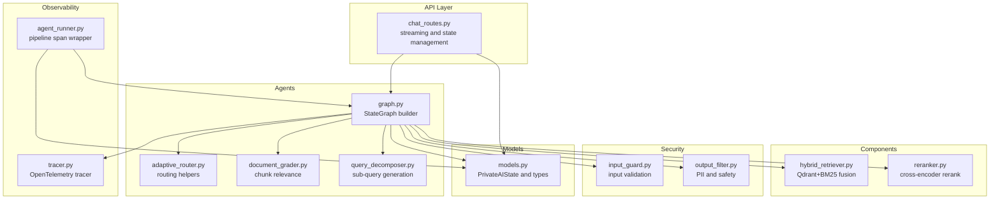

**Diagram sources**
- [graph.py:39-335](file://safe4ai-pilot/app/agents/graph.py#L39-L335)
- [adaptive_router.py:11-65](file://safe4ai-pilot/app/agents/adaptive_router.py#L11-L65)
- [document_grader.py:13-53](file://safe4ai-pilot/app/agents/document_grader.py#L13-L53)
- [query_decomposer.py:10-41](file://safe4ai-pilot/app/agents/query_decomposer.py#L10-L41)
- [hybrid_retriever.py:13-143](file://safe4ai-pilot/app/components/hybrid_retriever.py#L13-L143)
- [reranker.py:11-36](file://safe4ai-pilot/app/components/reranker.py#L11-L36)
- [input_guard.py:24-49](file://safe4ai-pilot/app/security/input_guard.py#L24-L49)
- [output_filter.py:30-60](file://safe4ai-pilot/app/security/output_filter.py#L30-L60)
- [chat_routes.py:160-172](file://safe4ai-pilot/app/api/chat_routes.py#L160-L172)
- [tracer.py:34-75](file://safe4ai-pilot/observability/tracer.py#L34-L75)
- [agent_runner.py:14-55](file://safe4ai-pilot/app/services/agent_runner.py#L14-L55)
- [models.py:49-102](file://safe4ai-pilot/app/models.py#L49-L102)

**Section sources**
- [graph.py:39-335](file://safe4ai-pilot/app/agents/graph.py#L39-L335)
- [models.py:49-102](file://safe4ai-pilot/app/models.py#L49-L102)
- [chat_routes.py:160-172](file://safe4ai-pilot/app/api/chat_routes.py#L160-L172)

## Core Components
- PrivateAIState: Central state container that tracks conversation context, retrieval metadata, grounding, citations, observability attributes, and human review flags. It defines the current execution step and status. Now supports enhanced state merging for streaming operations.
- Node functions: Asynchronous functions representing each stage of the pipeline, returning updates to the state to drive transitions.
- Conditional routing: Uses LLM-based decisions with fallback rules to choose the next node.
- Streaming support: Enhanced with `graph.astream()` for real-time state updates and partial state merging.
- Observability: Per-node spans inherit from a pipeline-level span; spans capture session identifiers, trace IDs, and node-specific attributes.

Key state variables and roles:
- Control flow: messages, current_step, status
- Retrieval: rewritten_query, retrieved_chunks, graded_chunks, retrieval_score_max, retrieval_attempts
- Decomposition: sub_queries
- Generation: draft_answer, citations, generation_context
- Quality and safety: grounded, requires_human_review, errors, trace_id, cost_usd
- Human review: requires_human_review flag triggers manual intervention

**Section sources**
- [models.py:49-102](file://safe4ai-pilot/app/models.py#L49-L102)
- [graph.py:51-335](file://safe4ai-pilot/app/agents/graph.py#L51-L335)

## Architecture Overview
The StateGraph orchestrates a self-correcting RAG pipeline with the following stages:
- Intake: Validates input and decides whether to rewrite or fall back.
- Rewrite: Rewrites the query using a prompt and model.
- Retrieve: Retrieves candidate chunks and reranks them.
- Grade: Grades chunks for relevance and decides between generate or decompose.
- Decompose: Generates sub-queries and re-runs retrieval/grading per sub-query.
- Generate: Builds a grounded answer from relevant chunks.
- Output Filter: Checks for PII hallucinations and suspicious length.
- Quality Gate: Decides whether to respond, retrieve again (self-correction), or fall back.
- Respond/Fallback: Finalization nodes.

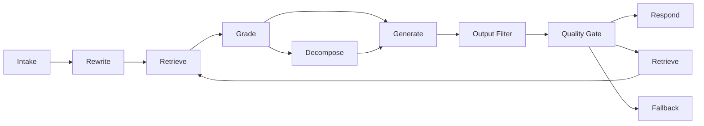

**Diagram sources**
- [graph.py:300-335](file://safe4ai-pilot/app/agents/graph.py#L300-L335)

## Streaming Implementation
The system now supports real-time streaming via LangGraph's `astream()` method, enabling progressive state updates and immediate feedback to clients.

### Streaming Flow
1. **Initialization**: Create run state with `_build_run_state()` and establish trace ID
2. **Streaming**: Use `graph.astream(run_state)` to iterate through node states
3. **State Merging**: Apply `_merge_stream_state()` to combine partial updates
4. **Progressive Updates**: Emit SSE events for step transitions and token streaming
5. **Finalization**: Complete processing and save session state

### State Merging Mechanism
The `_merge_stream_state()` function handles partial state updates from streaming nodes:

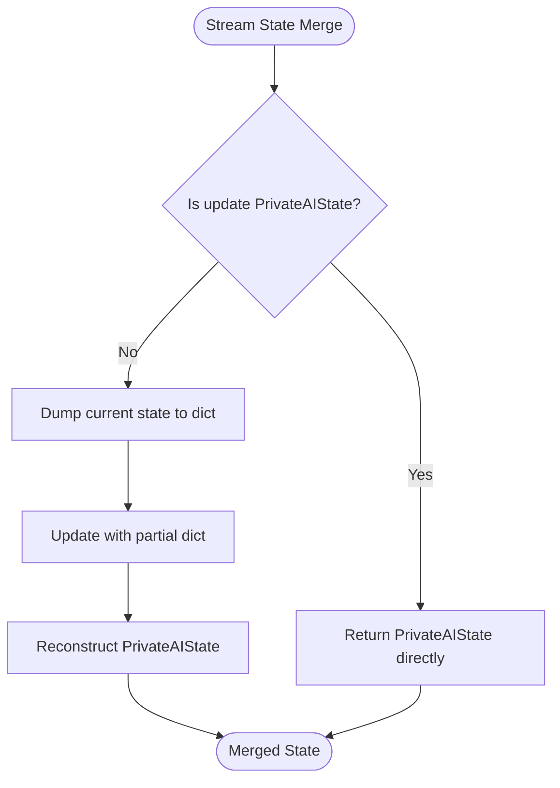

**Diagram sources**
- [chat_routes.py:239-244](file://safe4ai-pilot/app/api/chat_routes.py#L239-L244)

**Section sources**
- [chat_routes.py:370-393](file://safe4ai-pilot/app/api/chat_routes.py#L370-L393)
- [chat_routes.py:239-244](file://safe4ai-pilot/app/api/chat_routes.py#L239-L244)
- [test_chat.py:179-199](file://safe4ai-pilot/tests/test_chat.py#L179-L199)

## Detailed Component Analysis

### PrivateAIState Model
PrivateAIState encapsulates the conversation state and pipeline metadata. It is a Pydantic model that enforces type safety and defaults for optional fields. The model now supports enhanced state merging for streaming operations:

- Conversation history: list of messages with role and content
- Execution control: current_step and status
- Retrieval pipeline: rewritten_query, retrieved_chunks, graded_chunks, retrieval_score_max, retrieval_attempts
- Decomposition: sub_queries
- Generation: draft_answer, citations, generation_context
- Safety and observability: grounded, requires_human_review, errors, trace_id, cost_usd

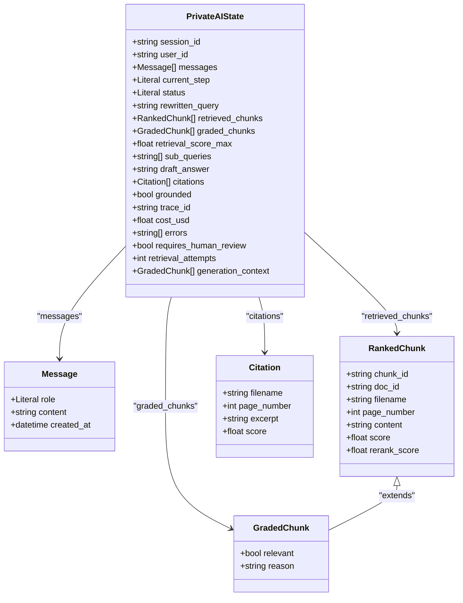

**Diagram sources**
- [models.py:49-102](file://safe4ai-pilot/app/models.py#L49-L102)
- [models.py:7-36](file://safe4ai-pilot/app/models.py#L7-L36)

**Section sources**
- [models.py:49-102](file://safe4ai-pilot/app/models.py#L49-L102)

### Node: intake
Purpose: Validate the latest message and enforce input safety. If invalid, route to fallback; otherwise, move to rewrite.

Behavior:
- If no messages, set current_step to fallback and record an error.
- Apply InputGuard to the query; if disallowed, append reason to errors and route to fallback.
- Otherwise, advance to rewrite.

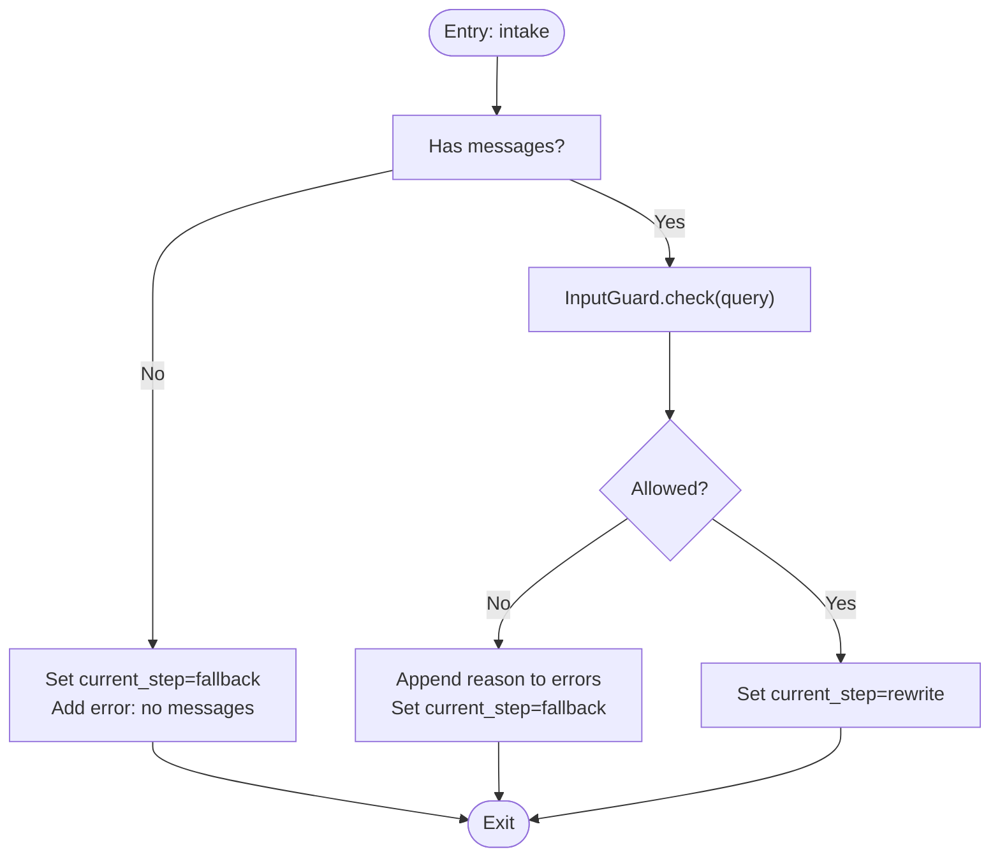

**Diagram sources**
- [graph.py:82-93](file://safe4ai-pilot/app/agents/graph.py#L82-L93)
- [input_guard.py:27-49](file://safe4ai-pilot/app/security/input_guard.py#L27-L49)

**Section sources**
- [graph.py:82-93](file://safe4ai-pilot/app/agents/graph.py#L82-L93)
- [input_guard.py:24-49](file://safe4ai-pilot/app/security/input_guard.py#L24-L49)

### Node: rewrite
Purpose: Produce a rewritten query using a prompt and model.

Behavior:
- Render a rewrite prompt with the latest message content.
- Call Ollama generate endpoint; on success, set rewritten_query and advance to retrieve.
- On failure, preserve original query and still advance to retrieve.

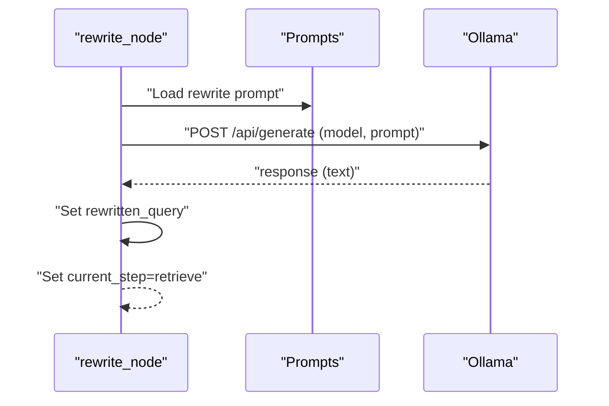

**Diagram sources**
- [graph.py:95-105](file://safe4ai-pilot/app/agents/graph.py#L95-L105)

**Section sources**
- [graph.py:95-105](file://safe4ai-pilot/app/agents/graph.py#L95-L105)

### Node: retrieve
Purpose: Retrieve candidate chunks and rerank them.

Behavior:
- Retrieve chunks via HybridRetriever and rerank via Reranker.
- Record chunk count and max score in span attributes.
- Increment retrieval_attempts and proceed to grade.
- On exceptions, record error and continue to grade.

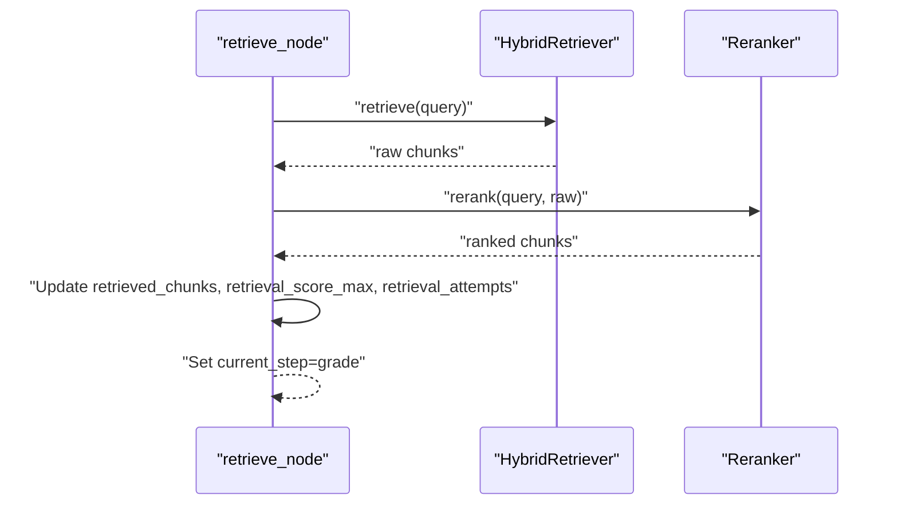

**Diagram sources**
- [graph.py:107-128](file://safe4ai-pilot/app/agents/graph.py#L107-L128)
- [hybrid_retriever.py:56-143](file://safe4ai-pilot/app/components/hybrid_retriever.py#L56-L143)
- [reranker.py:15-36](file://safe4ai-pilot/app/components/reranker.py#L15-L36)

**Section sources**
- [graph.py:107-128](file://safe4ai-pilot/app/agents/graph.py#L107-L128)
- [hybrid_retriever.py:13-143](file://safe4ai-pilot/app/components/hybrid_retriever.py#L13-L143)
- [reranker.py:11-36](file://safe4ai-pilot/app/components/reranker.py#L11-L36)

### Node: grade
Purpose: Determine whether to generate or decompose based on relevance.

Behavior:
- Grade chunks using document_grader and compute relevant_count.
- Use LLM-based routing via decide_next_step with allowed steps ["generate","decompose"].
- Fallback to synchronous rule: ≥2 relevant → generate, else → decompose.
- Enforce safety: if synchronous rule says decompose, override LLM decision to decompose.
- Set current_step accordingly.

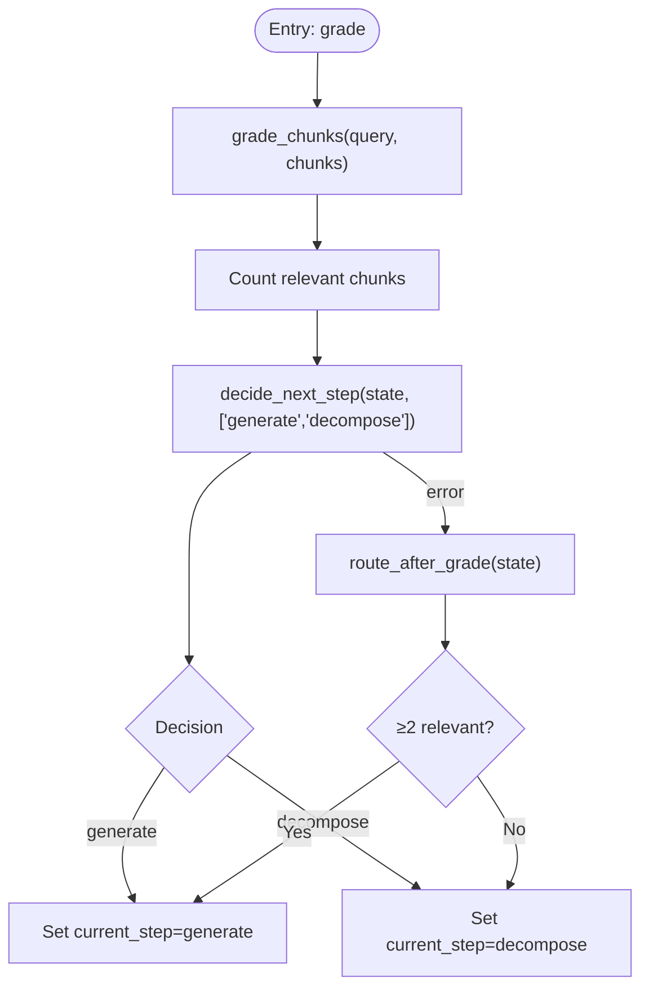

**Diagram sources**
- [graph.py:130-146](file://safe4ai-pilot/app/agents/graph.py#L130-L146)
- [adaptive_router.py:25-65](file://safe4ai-pilot/app/agents/adaptive_router.py#L25-L65)
- [document_grader.py:13-53](file://safe4ai-pilot/app/agents/document_grader.py#L13-L53)

**Section sources**
- [graph.py:130-146](file://safe4ai-pilot/app/agents/graph.py#L130-L146)
- [adaptive_router.py:11-23](file://safe4ai-pilot/app/agents/adaptive_router.py#L11-L23)
- [adaptive_router.py:25-65](file://safe4ai-pilot/app/agents/adaptive_router.py#L25-L65)
- [document_grader.py:13-53](file://safe4ai-pilot/app/agents/document_grader.py#L13-L53)

### Node: decompose
Purpose: Generate sub-queries and re-run retrieval/grading per sub-query.

Behavior:
- Call query_decomposer to produce sub-queries.
- For each sub-query, retrieve, rerank, grade, and accumulate results.
- Compute max score across all graded chunks and set requires_human_review if none relevant.
- Proceed to generate.

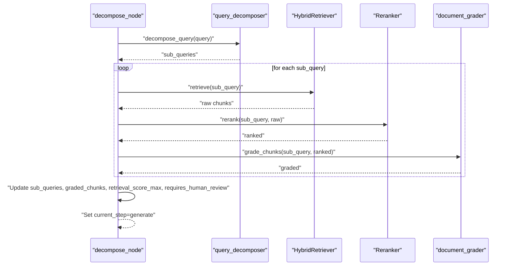

**Diagram sources**
- [graph.py:148-186](file://safe4ai-pilot/app/agents/graph.py#L148-L186)
- [query_decomposer.py:10-41](file://safe4ai-pilot/app/agents/query_decomposer.py#L10-L41)
- [hybrid_retriever.py:56-143](file://safe4ai-pilot/app/components/hybrid_retriever.py#L56-L143)
- [reranker.py:15-36](file://safe4ai-pilot/app/components/reranker.py#L15-L36)
- [document_grader.py:13-53](file://safe4ai-pilot/app/agents/document_grader.py#L13-L53)

**Section sources**
- [graph.py:148-186](file://safe4ai-pilot/app/agents/graph.py#L148-L186)
- [query_decomposer.py:10-41](file://safe4ai-pilot/app/agents/query_decomposer.py#L10-L41)
- [hybrid_retriever.py:13-143](file://safe4ai-pilot/app/components/hybrid_retriever.py#L13-L143)
- [reranker.py:11-36](file://safe4ai-pilot/app/components/reranker.py#L11-L36)
- [document_grader.py:13-53](file://safe4ai-pilot/app/agents/document_grader.py#L13-L53)

### Node: generate
Purpose: Construct a grounded answer from relevant chunks.

Behavior:
- If no relevant chunks, set a safe default answer and skip citations.
- Otherwise, build context from relevant chunks and render a prompt to generate an answer.
- On success, create citations from relevant chunks; on failure, record error and fall back to safe answer.
- Advance to output_filter.

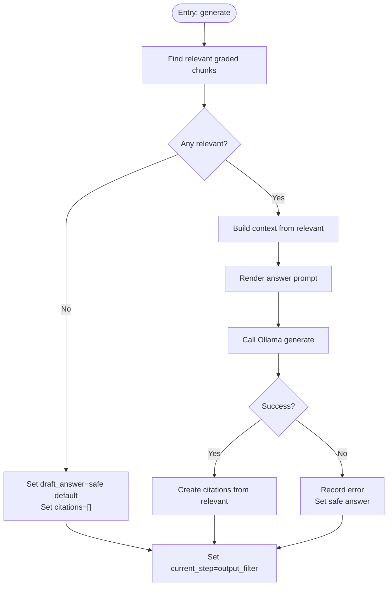

**Diagram sources**
- [graph.py:188-238](file://safe4ai-pilot/app/agents/graph.py#L188-L238)

**Section sources**
- [graph.py:188-238](file://safe4ai-pilot/app/agents/graph.py#L188-L238)

### Node: output_filter
Purpose: Validate the generated answer for safety and PII.

Behavior:
- If no relevant context or empty answer, skip filtering and go to quality_gate.
- Otherwise, check answer against source chunks for PII hallucinations and suspicious length.
- If blocked, set requires_human_review and record reason; otherwise, proceed to quality_gate.

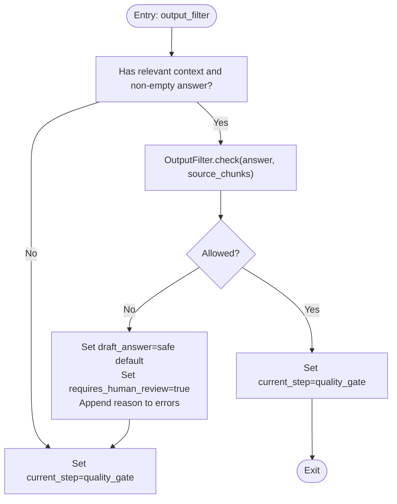

**Diagram sources**
- [graph.py:240-259](file://safe4ai-pilot/app/agents/graph.py#L240-L259)
- [output_filter.py:30-60](file://safe4ai-pilot/app/security/output_filter.py#L30-L60)

**Section sources**
- [graph.py:240-259](file://safe4ai-pilot/app/agents/graph.py#L240-L259)
- [output_filter.py:30-60](file://safe4ai-pilot/app/security/output_filter.py#L30-L60)

### Node: quality_gate
Purpose: Final routing decision with self-correction guard.

Behavior:
- Compute groundedness from draft_answer and presence of relevant chunks.
- Allow ["respond","retrieve","fallback"] unless retrieval attempts exceed a maximum.
- Use LLM-based routing with decide_next_step; fallback to synchronous rule if LLM fails.
- Safety: never route ungrounded state to respond; if LLM selects respond but state is not grounded, select fallback.
- Set grounded and current_step accordingly.

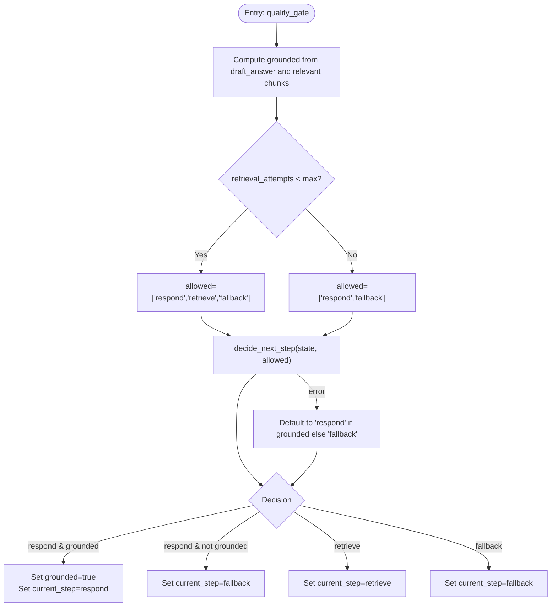

**Diagram sources**
- [graph.py:261-280](file://safe4ai-pilot/app/agents/graph.py#L261-L280)
- [adaptive_router.py:25-65](file://safe4ai-pilot/app/agents/adaptive_router.py#L25-L65)

**Section sources**
- [graph.py:261-280](file://safe4ai-pilot/app/agents/graph.py#L261-L280)
- [adaptive_router.py:18-23](file://safe4ai-pilot/app/agents/adaptive_router.py#L18-L23)
- [adaptive_router.py:25-65](file://safe4ai-pilot/app/agents/adaptive_router.py#L25-L65)

### Node: respond
Purpose: Mark completion and terminate the graph.

Behavior:
- Set status to completed and current_step to respond.

**Section sources**
- [graph.py:282-284](file://safe4ai-pilot/app/agents/graph.py#L282-L284)

### Node: fallback
Purpose: Provide a safe default answer and mark completion.

Behavior:
- Use draft_answer if present; otherwise, use a safe default.
- Set status to completed, current_step to fallback, and requires_human_review if errors or previously flagged.

**Section sources**
- [graph.py:286-294](file://safe4ai-pilot/app/agents/graph.py#L286-L294)

### Routing Logic and Transitions
- Conditional edges:
  - intake → rewrite or fallback based on current_step after intake.
  - grade → generate or decompose based on LLM decision with fallback to synchronous rule.
  - quality_gate → respond, retrieve, or fallback based on groundedness and retrieval attempts.
- Deterministic edges:
  - rewrite → retrieve
  - retrieve → grade
  - decompose → generate
  - generate → output_filter
  - output_filter → quality_gate
  - respond → END
  - fallback → END

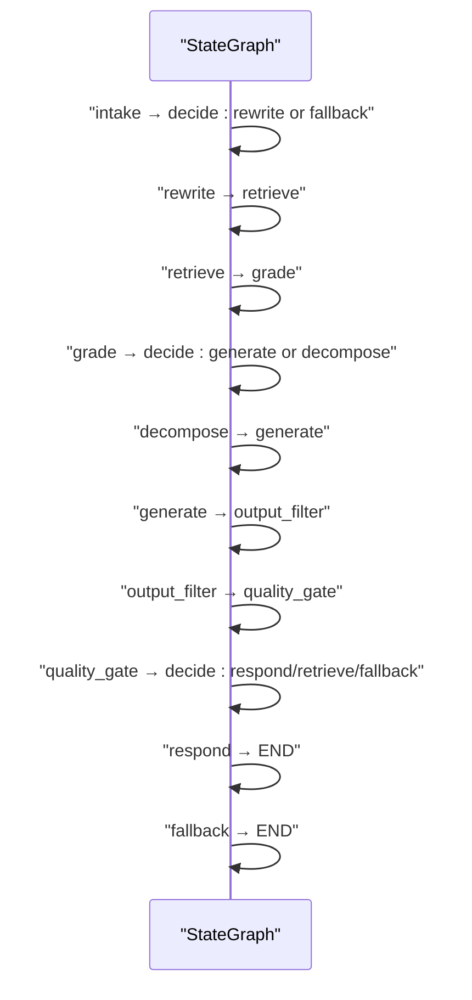

**Diagram sources**
- [graph.py:315-335](file://safe4ai-pilot/app/agents/graph.py#L315-L335)

**Section sources**
- [graph.py:315-335](file://safe4ai-pilot/app/agents/graph.py#L315-L335)

## Dependency Analysis
The graph composes specialized components:
- Retrieval: HybridRetriever depends on Qdrant and Ollama embeddings; Reranker uses a cross-encoder model.
- Grading: Asynchronous per-chunk grading via Ollama.
- Decomposition: Sub-query generation via Ollama.
- Guards: InputGuard and OutputFilter provide safety checks.
- Routing: LLM-based routing with synchronous fallbacks.
- Streaming: Enhanced with state merging for real-time updates.

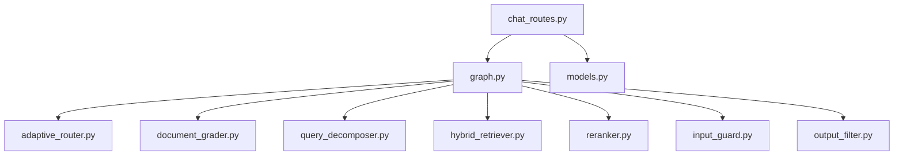

**Diagram sources**
- [graph.py:11-22](file://safe4ai-pilot/app/agents/graph.py#L11-L22)
- [adaptive_router.py:7-10](file://safe4ai-pilot/app/agents/adaptive_router.py#L7-L10)
- [document_grader.py:9-12](file://safe4ai-pilot/app/agents/document_grader.py#L9-L12)
- [query_decomposer.py:7-10](file://safe4ai-pilot/app/agents/query_decomposer.py#L7-L10)
- [hybrid_retriever.py:10](file://safe4ai-pilot/app/components/hybrid_retriever.py#L10)
- [reranker.py:6](file://safe4ai-pilot/app/components/reranker.py#L6)
- [input_guard.py:7](file://safe4ai-pilot/app/security/input_guard.py#L7)
- [output_filter.py:9](file://safe4ai-pilot/app/security/output_filter.py#L9)
- [chat_routes.py:160-172](file://safe4ai-pilot/app/api/chat_routes.py#L160-L172)
- [models.py:7](file://safe4ai-pilot/app/models.py#L7)

**Section sources**
- [graph.py:11-22](file://safe4ai-pilot/app/agents/graph.py#L11-L22)

## Performance Considerations
- Parallelism:
  - Chunk grading uses asynchronous gathering to process multiple chunks concurrently.
  - Decompose runs retrieval/grading per sub-query; consider batching and rate limiting to avoid downstream saturation.
- Latency:
  - Retrieval and reranking are I/O bound; caching or precomputation of rerank scores can help.
  - LLM calls are latency-sensitive; timeouts are configured; consider connection pooling and retries with backoff.
- Cost:
  - PrivateAIState includes a cost accumulator field; integrate cost tracking around LLM calls for visibility.
- Memory:
  - generation_context snapshots ensure output_filter validates against a stable set of chunks; keep this bounded to control memory growth.
- Streaming:
  - State merging overhead is minimal compared to network latency for streaming responses.
  - Token streaming provides immediate feedback while maintaining state consistency.

## Troubleshooting Guide
Common issues and remedies:
- No messages in state:
  - intake_node sets current_step to fallback and records an error; ensure callers populate messages.
- Input rejected by guard:
  - intake_node appends the reason to errors and routes to fallback; sanitize input or adjust guard thresholds.
- LLM failures during rewrite or grading:
  - Nodes fall back to safe defaults and still advance; inspect errors and retry logic.
- Retrieval failures:
  - retrieve_node increments retrieval_attempts and continues to grade; monitor errors and backend health.
- Un-grounded answer:
  - quality_gate prevents responding with ungrounded answers; trigger fallback and human review if needed.
- PII hallucination:
  - output_filter blocks answers containing PII not present in source chunks; refine prompts or reduce hallucinations.
- Streaming issues:
  - State merging failures: verify `_merge_stream_state()` handles both PrivateAIState and dict updates correctly.
  - Partial updates: ensure nodes return consistent state updates that can be merged safely.
  - Client disconnection: streaming gracefully handles disconnections and cleans up resources.

Operational hooks:
- Per-node spans capture session_id, trace_id, and node attributes for debugging.
- Pipeline-level span wraps the entire run for end-to-end tracing.
- Streaming state merging ensures consistent state even with partial updates.

**Section sources**
- [graph.py:82-93](file://safe4ai-pilot/app/agents/graph.py#L82-L93)
- [graph.py:95-105](file://safe4ai-pilot/app/agents/graph.py#L95-L105)
- [graph.py:107-128](file://safe4ai-pilot/app/agents/graph.py#L107-L128)
- [graph.py:130-146](file://safe4ai-pilot/app/agents/graph.py#L130-L146)
- [graph.py:240-259](file://safe4ai-pilot/app/agents/graph.py#L240-L259)
- [graph.py:261-280](file://safe4ai-pilot/app/agents/graph.py#L261-L280)
- [chat_routes.py:239-244](file://safe4ai-pilot/app/api/chat_routes.py#L239-L244)
- [tracer.py:34-75](file://safe4ai-pilot/observability/tracer.py#L34-L75)
- [agent_runner.py:26-32](file://safe4ai-pilot/app/services/agent_runner.py#L26-L32)

## Conclusion
The LangGraph State Machine orchestrates a robust, self-correcting RAG pipeline with strong safety and observability. PrivateAIState centralizes conversation context and execution metadata, enabling clear state transitions and resilient routing. The enhanced streaming capabilities with improved state merging mechanism provide real-time feedback while maintaining state consistency. The design balances LLM-driven adaptivity with synchronous fallbacks, ensuring reliable outcomes under failure conditions. Extensibility is achieved by adding nodes, updating state fields, and integrating custom routing logic with streaming support.

## Appendices

### Extending the State Machine
- Add a new node:
  - Define an async function that takes PrivateAIState and returns a dict of state updates.
  - Register the node with builder.add_node and wire edges (conditional or deterministic).
  - Ensure the node returns state updates compatible with streaming state merging.
- Modify state variables:
  - Extend PrivateAIState with new fields; initialize defaults in the model.
  - Update nodes to read/write the new fields.
  - Verify state merging compatibility for streaming operations.
- Custom routing:
  - Implement a decision function similar to decide_next_step and route_after_grade.
  - Use it in a conditional edge to route to new nodes.
- Streaming compatibility:
  - Ensure all state updates are serializable and mergeable.
  - Test with `_merge_stream_state()` to verify proper state reconstruction.

**Section sources**
- [graph.py:296-335](file://safe4ai-pilot/app/agents/graph.py#L296-L335)
- [models.py:49-102](file://safe4ai-pilot/app/models.py#L49-L102)
- [chat_routes.py:239-244](file://safe4ai-pilot/app/api/chat_routes.py#L239-L244)

### Observability and Tracing
- Per-node spans:
  - Each node starts a child span inheriting from the pipeline span; attributes include session_id, trace_id, and node name.
- Pipeline span:
  - agent_runner.py wraps the entire graph execution in a pipeline span and saves session state afterward.
- Exporter:
  - tracer.py configures OTLP exporter and batch processor; spans are exported to the configured endpoint.

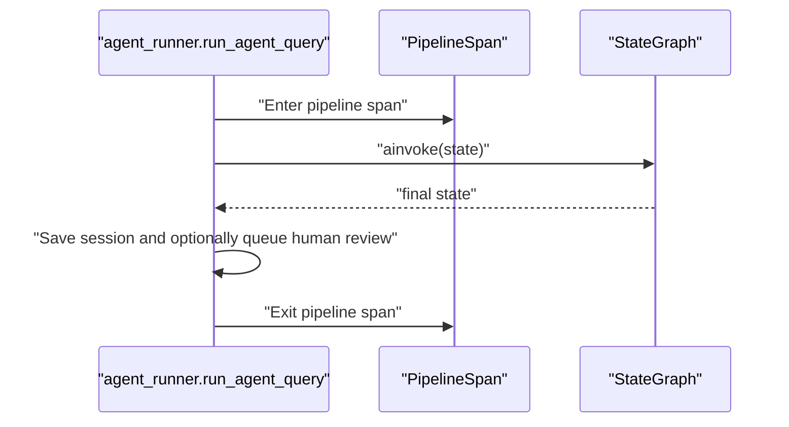

**Diagram sources**
- [agent_runner.py:14-55](file://safe4ai-pilot/app/services/agent_runner.py#L14-L55)
- [tracer.py:34-75](file://safe4ai-pilot/observability/tracer.py#L34-L75)
- [graph.py:24-32](file://safe4ai-pilot/app/agents/graph.py#L24-L32)

**Section sources**
- [agent_runner.py:14-55](file://safe4ai-pilot/app/services/agent_runner.py#L14-L55)
- [tracer.py:27-31](file://safe4ai-pilot/observability/tracer.py#L27-L31)
- [graph.py:24-32](file://safe4ai-pilot/app/agents/graph.py#L24-L32)

### State Persistence and Recovery
- Persistence:
  - After graph completion, agent_runner persists the final state via ConversationManager.save_session.
  - Human review entries are inserted when requires_human_review is true.
- Recovery:
  - retrieval_attempts guard prevents infinite self-correction loops; after exceeding the maximum, routing is restricted to respond or fallback.
  - Fallback ensures a safe default answer is returned when groundedness cannot be established.
- Streaming recovery:
  - State merging mechanism ensures partial updates are safely combined.
  - Streaming gracefully handles client disconnections and maintains state consistency.

**Section sources**
- [agent_runner.py:36-54](file://safe4ai-pilot/app/services/agent_runner.py#L36-L54)
- [graph.py:269-280](file://safe4ai-pilot/app/agents/graph.py#L269-L280)
- [graph.py:286-294](file://safe4ai-pilot/app/agents/graph.py#L286-L294)
- [chat_routes.py:370-393](file://safe4ai-pilot/app/api/chat_routes.py#L370-L393)

### Streaming State Management
The streaming implementation provides real-time state updates with robust merging capabilities:

- **State Merging**: `_merge_stream_state()` handles both PrivateAIState objects and dict updates
- **Streaming Flow**: `graph.astream()` provides node-by-node state updates
- **Progressive Updates**: SSE events deliver step transitions and token streaming
- **Error Handling**: Graceful degradation with fallback to safe defaults
- **Testing**: Comprehensive test coverage for partial state update scenarios

**Section sources**
- [chat_routes.py:239-244](file://safe4ai-pilot/app/api/chat_routes.py#L239-L244)
- [chat_routes.py:370-393](file://safe4ai-pilot/app/api/chat_routes.py#L370-L393)
- [test_chat.py:179-199](file://safe4ai-pilot/tests/test_chat.py#L179-L199)