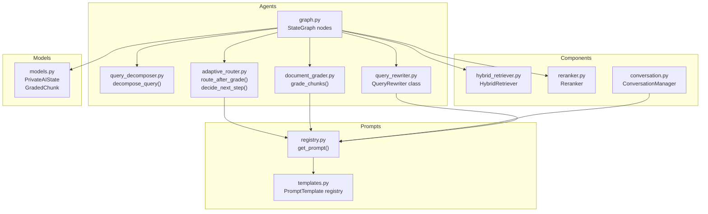
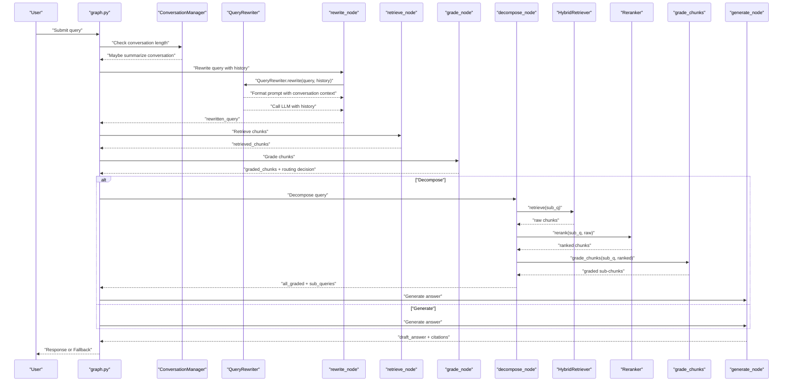
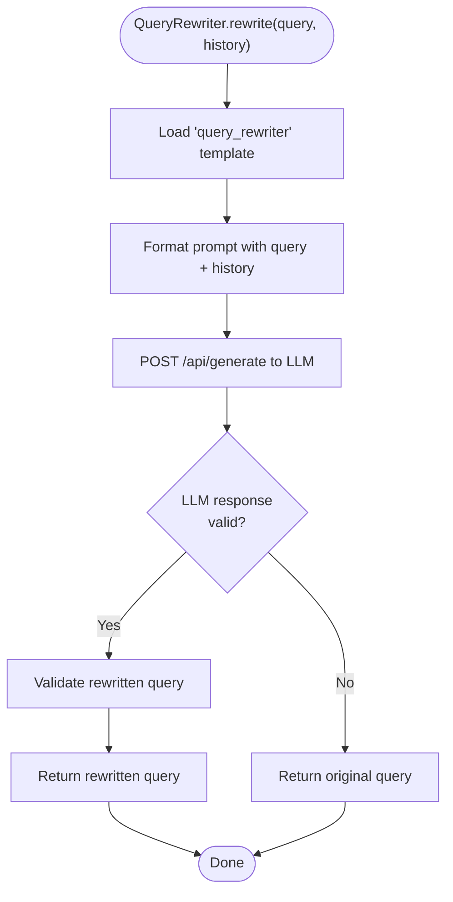
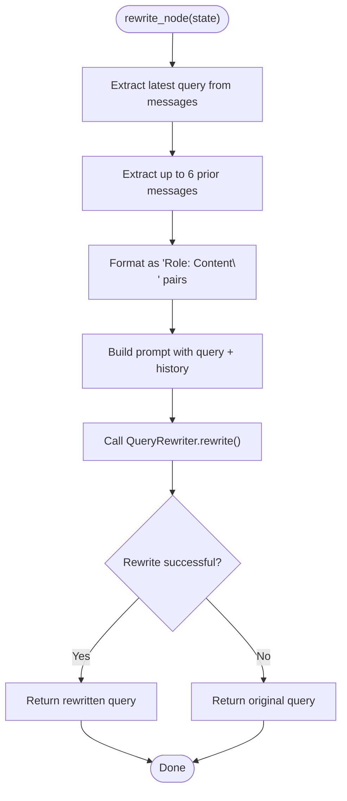
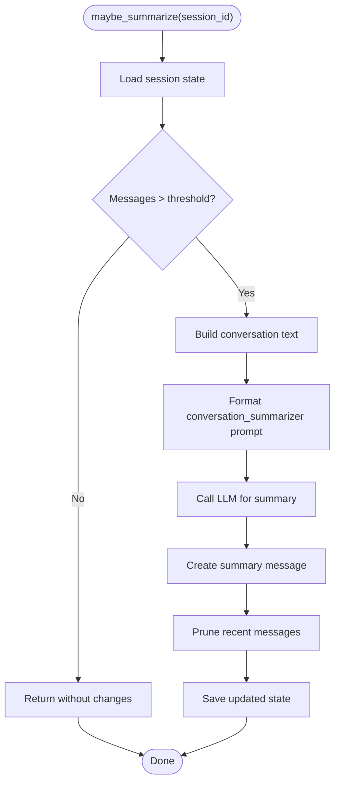
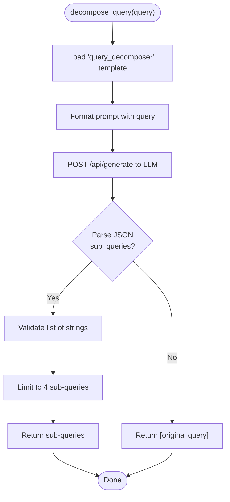
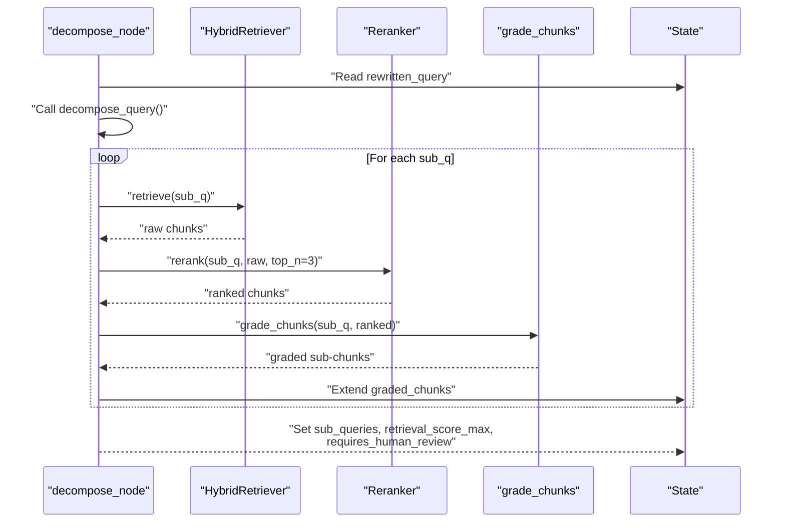
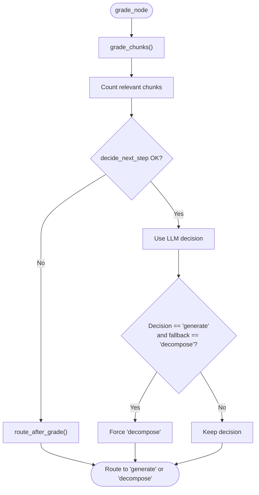
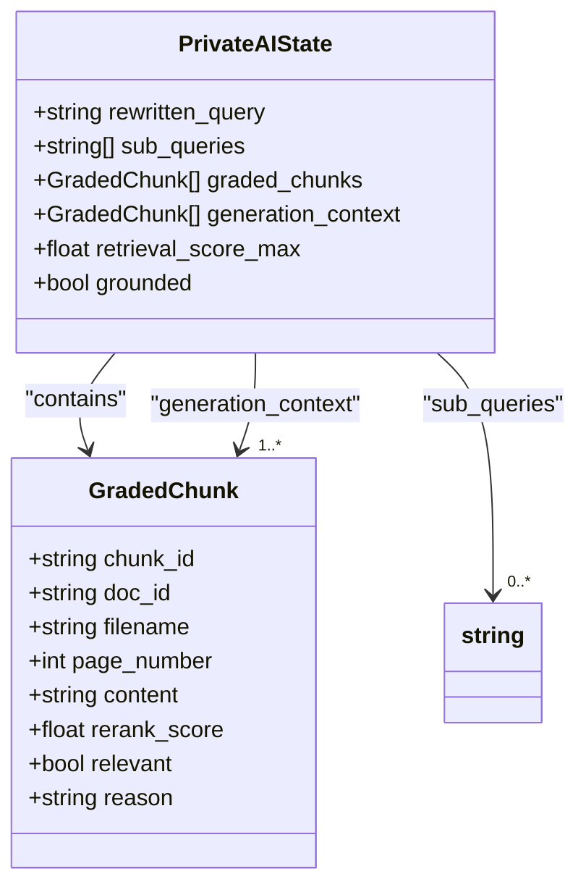
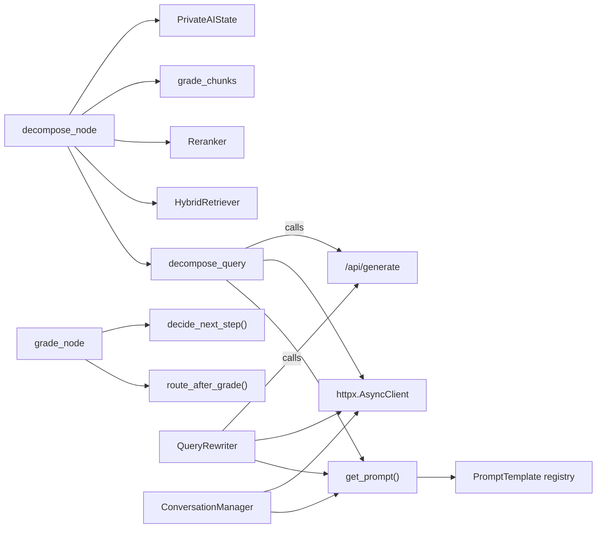

# Query Decomposition

<cite>
**Referenced Files in This Document**
- [query_decomposer.py](file://safe4ai-pilot/app/agents/query_decomposer.py)
- [query_rewriter.py](file://safe4ai-pilot/app/services/query_rewriter.py)
- [graph.py](file://safe4ai-pilot/app/agents/graph.py)
- [graph.py](file://safe4ai-pilot/app/agents/graph.py)
- [templates.py](file://safe4ai-pilot/app/prompts/templates.py)
- [registry.py](file://safe4ai-pilot/app/prompts/registry.py)
- [models.py](file://safe4ai-pilot/app/models.py)
- [document_grader.py](file://safe4ai-pilot/app/agents/document_grader.py)
- [adaptive_router.py](file://safe4ai-pilot/app/agents/adaptive_router.py)
- [hybrid_retriever.py](file://safe4ai-pilot/app/components/hybrid_retriever.py)
- [reranker.py](file://safe4ai-pilot/app/components/reranker.py)
- [rag_pipeline.py](file://safe4ai-pilot/app/services/rag_pipeline.py)
- [conversation.py](file://safe4ai-pilot/app/services/conversation.py)
- [test_agents.py](file://safe4ai-pilot/tests/test_agents.py)
- [test_query_rewriter.py](file://safe4ai-pilot/tests/test_query_rewriter.py)
</cite>

## Update Summary
**Changes Made**
- Enhanced query rewriter service with conversation-aware rewriting capabilities
- Added conversation history context support in rewrite_node
- Integrated QueryRewriter class for external rewriting service
- Added conversation summarization for long sessions
- Updated rewrite_node to include up to 3 prior exchanges (6 messages) for better context resolution

## Table of Contents
1. [Introduction](#introduction)
2. [Project Structure](#project-structure)
3. [Core Components](#core-components)
4. [Architecture Overview](#architecture-overview)
5. [Detailed Component Analysis](#detailed-component-analysis)
6. [Dependency Analysis](#dependency-analysis)
7. [Performance Considerations](#performance-considerations)
8. [Troubleshooting Guide](#troubleshooting-guide)
9. [Conclusion](#conclusion)

## Introduction
This document explains the query decomposition system that transforms complex user questions into manageable sub-queries. The system now features enhanced conversation-aware rewriting capabilities that incorporate historical context from multi-turn conversations. It focuses on the decompose_query function, how it integrates with LLM-based decomposition strategies, and how the broader pipeline decides when decomposition is needed. It also details the sub-query processing workflow (individual retrieval, reranking, and chunk grading), demonstrates how original queries relate to generated sub-queries, and outlines strategies for optimizing accuracy and performance.

## Project Structure
The decomposition capability is part of a larger RAG pipeline orchestrated by a LangGraph StateGraph. The key pieces involved in decomposition and conversation-aware rewriting are:
- The LLM-based decomposition function
- The graph nodes that orchestrate rewriting with conversation history, retrieval, grading, and decomposition
- Supporting components for retrieval, reranking, and chunk grading
- Prompt templates and registry used to construct LLM prompts
- Conversation management system for session history and summarization

**Diagram sources**
- [graph.py:96-114](file://safe4ai-pilot/app/agents/graph.py#L96-L114)
- [query_decomposer.py:10-40](file://safe4ai-pilot/app/agents/query_decomposer.py#L10-L40)
- [query_rewriter.py:8-27](file://safe4ai-pilot/app/services/query_rewriter.py#L8-L27)
- [conversation.py:26-118](file://safe4ai-pilot/app/services/conversation.py#L26-L118)
- [document_grader.py:13-53](file://safe4ai-pilot/app/agents/document_grader.py#L13-L53)
- [adaptive_router.py:11-65](file://safe4ai-pilot/app/agents/adaptive_router.py#L11-L65)
- [hybrid_retriever.py:57-144](file://safe4ai-pilot/app/components/hybrid_retriever.py#L57-L144)
- [reranker.py:15-36](file://safe4ai-pilot/app/components/reranker.py#L15-L36)
- [templates.py:13-25](file://safe4ai-pilot/app/prompts/templates.py#L13-L25)
- [registry.py:4-13](file://safe4ai-pilot/app/prompts/registry.py#L4-L13)
- [models.py:49-95](file://safe4ai-pilot/app/models.py#L49-L95)

**Section sources**
- [graph.py:43-352](file://safe4ai-pilot/app/agents/graph.py#L43-L352)
- [query_decomposer.py:10-40](file://safe4ai-pilot/app/agents/query_decomposer.py#L10-L40)
- [query_rewriter.py:8-27](file://safe4ai-pilot/app/services/query_rewriter.py#L8-L27)
- [conversation.py:26-118](file://safe4ai-pilot/app/services/conversation.py#L26-L118)
- [templates.py:13-25](file://safe4ai-pilot/app/prompts/templates.py#L13-L25)
- [registry.py:4-13](file://safe4ai-pilot/app/prompts/registry.py#L4-L13)
- [models.py:49-95](file://safe4ai-pilot/app/models.py#L49-L95)

## Core Components
- decompose_query: Calls an LLM to produce 2–4 sub-queries from a complex query. Falls back to returning the original query if parsing fails.
- QueryRewriter: New service class that provides conversation-aware query rewriting with history context support.
- Graph nodes:
  - rewrite_node: Rewrites the user query into a more search-friendly form using conversation history context.
  - retrieve_node: Retrieves candidate chunks for the rewritten query.
  - grade_node: Grades chunks to determine relevance and routes to generate or decompose.
  - decompose_node: Executes decomposition, runs retrieval/rerank/grade per sub-query, and aggregates results.
  - generate_node: Synthesizes an answer from relevant chunks and captures generation_context.
- Conversation Management:
  - ConversationManager: Handles session persistence, history management, and automatic summarization for long conversations.
- Retrieval and reranking:
  - HybridRetriever: Performs dense and sparse retrieval and fused ranking.
  - Reranker: Re-ranks candidates using a cross-encoder.
- Chunk grading:
  - grade_chunks: Uses an LLM to judge relevance and confidence for each chunk.
- Adaptive routing:
  - route_after_grade: Threshold-based synchronous fallback rule.
  - decide_next_step: LLM-based adaptive routing for self-correction loops.

**Section sources**
- [query_decomposer.py:10-40](file://safe4ai-pilot/app/agents/query_decomposer.py#L10-L40)
- [query_rewriter.py:8-27](file://safe4ai-pilot/app/services/query_rewriter.py#L8-L27)
- [conversation.py:26-118](file://safe4ai-pilot/app/services/conversation.py#L26-L118)
- [graph.py:96-114](file://safe4ai-pilot/app/agents/graph.py#L96-L114)
- [graph.py:69-183](file://safe4ai-pilot/app/agents/graph.py#L69-L183)
- [hybrid_retriever.py:57-144](file://safe4ai-pilot/app/components/hybrid_retriever.py#L57-L144)
- [reranker.py:15-36](file://safe4ai-pilot/app/components/reranker.py#L15-L36)
- [document_grader.py:13-53](file://safe4ai-pilot/app/agents/document_grader.py#L13-L53)
- [adaptive_router.py:11-65](file://safe4ai-pilot/app/agents/adaptive_router.py#L11-L65)

## Architecture Overview
The decomposition system participates in a multi-step pipeline with enhanced conversation awareness:
1. Intake: Guards input.
2. Rewrite: Optimizes the query for retrieval using conversation history context.
3. Retrieve: Gathers candidate chunks.
4. Grade: Determines relevance and routes to generate or decompose.
5. Decompose: Generates sub-queries and processes each independently.
6. Generate: Synthesizes an answer from relevant chunks.
7. Output Filter and Quality Gate: Validates and decides final routing.
8. Respond/Fallback: Completes the process.

**Diagram sources**
- [graph.py:96-114](file://safe4ai-pilot/app/agents/graph.py#L96-L114)
- [query_rewriter.py:13-27](file://safe4ai-pilot/app/services/query_rewriter.py#L13-L27)
- [conversation.py:75-118](file://safe4ai-pilot/app/services/conversation.py#L75-L118)
- [query_decomposer.py:10-40](file://safe4ai-pilot/app/agents/query_decomposer.py#L10-L40)
- [hybrid_retriever.py:57-144](file://safe4ai-pilot/app/components/hybrid_retriever.py#L57-L144)
- [reranker.py:15-36](file://safe4ai-pilot/app/components/reranker.py#L15-L36)
- [document_grader.py:13-53](file://safe4ai-pilot/app/agents/document_grader.py#L13-L53)

## Detailed Component Analysis

### Enhanced Query Rewriter Service
**Updated** The query rewriter now supports conversation-aware rewriting with history context, significantly improving multi-turn conversation handling capabilities.

Purpose:
- Accepts a query and optional conversation history to produce optimized search queries.
- Provides fallback behavior when LLM calls fail.
- Supports both internal graph rewriting and external service rewriting.

Behavior:
- Loads the query rewriter prompt template with conversation context support.
- Formats the prompt with both the current query and conversation history.
- Sends a synchronous generate request to the LLM endpoint.
- Returns the rewritten query or falls back to the original query on failure.

Integration:
- Used by rewrite_node in the graph for conversation-aware rewriting.
- Can be instantiated externally as a standalone service.
- Supports both internal graph rewriting and external service integration.

**Diagram sources**
- [query_rewriter.py:13-27](file://safe4ai-pilot/app/services/query_rewriter.py#L13-L27)
- [templates.py:13-25](file://safe4ai-pilot/app/prompts/templates.py#L13-L25)
- [registry.py:4-13](file://safe4ai-pilot/app/prompts/registry.py#L4-L13)

**Section sources**
- [query_rewriter.py:8-27](file://safe4ai-pilot/app/services/query_rewriter.py#L8-L27)
- [templates.py:13-25](file://safe4ai-pilot/app/prompts/templates.py#L13-L25)
- [registry.py:4-13](file://safe4ai-pilot/app/prompts/registry.py#L4-L13)

### Conversation-Aware Rewrite Node
**Updated** The rewrite_node now incorporates conversation history context to improve query resolution in multi-turn conversations.

Enhanced Behavior:
- Extracts up to 6 messages (3 user-assistant pairs) from conversation history.
- Formats history as "Role: Content" pairs for better context resolution.
- Passes both query and history to the query rewriter for optimal rewriting.
- Maintains backward compatibility with empty history fallback.

Integration:
- Uses the enhanced query rewriter service with conversation context.
- Integrates seamlessly with existing graph infrastructure.
- Provides robust error handling with fallback to original query.

**Diagram sources**
- [graph.py:96-114](file://safe4ai-pilot/app/agents/graph.py#L96-L114)
- [query_rewriter.py:13-27](file://safe4ai-pilot/app/services/query_rewriter.py#L13-L27)

**Section sources**
- [graph.py:96-114](file://safe4ai-pilot/app/agents/graph.py#L96-L114)
- [query_rewriter.py:13-27](file://safe4ai-pilot/app/services/query_rewriter.py#L13-L27)

### Conversation Management System
**New** The ConversationManager handles session persistence, history management, and automatic summarization for long conversations.

Key Features:
- Automatic conversation summarization when message count exceeds threshold.
- Session state persistence with size limits and control character sanitization.
- Efficient message pruning while preserving conversation context.
- Integration with external LLM for summarization tasks.

**Diagram sources**
- [conversation.py:75-118](file://safe4ai-pilot/app/services/conversation.py#L75-L118)
- [templates.py:48-57](file://safe4ai-pilot/app/prompts/templates.py#L48-L57)

**Section sources**
- [conversation.py:26-118](file://safe4ai-pilot/app/services/conversation.py#L26-L118)
- [templates.py:48-57](file://safe4ai-pilot/app/prompts/templates.py#L48-L57)

### decompose_query Function
Purpose:
- Accepts a complex query and produces 2–4 sub-queries using an LLM.
- Returns the original query if decomposition fails.

Behavior:
- Loads the decomposition prompt template and formats it with the input query.
- Sends a synchronous generate request to the LLM endpoint.
- Parses the returned JSON for a list of sub-queries and limits to four.
- On failure, returns a single-item list containing the original query.

Integration:
- Called by the decompose_node in the graph.
- Uses the shared HTTP client if provided; otherwise creates a local AsyncClient.

**Diagram sources**
- [query_decomposer.py:10-40](file://safe4ai-pilot/app/agents/query_decomposer.py#L10-L40)
- [templates.py:38-47](file://safe4ai-pilot/app/prompts/templates.py#L38-L47)
- [registry.py:4-13](file://safe4ai-pilot/app/prompts/registry.py#L4-L13)

**Section sources**
- [query_decomposer.py:10-40](file://safe4ai-pilot/app/agents/query_decomposer.py#L10-L40)
- [templates.py:38-47](file://safe4ai-pilot/app/prompts/templates.py#L38-L47)
- [registry.py:4-13](file://safe4ai-pilot/app/prompts/registry.py#L4-L13)

### Sub-Query Processing Workflow
The decompose_node orchestrates processing each sub-query:
1. Retrieve: Calls HybridRetriever to fetch candidate chunks.
2. Rerank: Applies Reranker to reorder candidates.
3. Grade: Uses LLM to assess relevance and confidence per chunk.
4. Aggregate: Collects all graded chunks and sets sub_queries and retrieval_score_max.

**Diagram sources**
- [graph.py:158-197](file://safe4ai-pilot/app/agents/graph.py#L158-L197)
- [hybrid_retriever.py:57-144](file://safe4ai-pilot/app/components/hybrid_retriever.py#L57-L144)
- [reranker.py:15-36](file://safe4ai-pilot/app/components/reranker.py#L15-L36)
- [document_grader.py:13-53](file://safe4ai-pilot/app/agents/document_grader.py#L13-L53)

**Section sources**
- [graph.py:158-197](file://safe4ai-pilot/app/agents/graph.py#L158-L197)
- [hybrid_retriever.py:57-144](file://safe4ai-pilot/app/components/hybrid_retriever.py#L57-L144)
- [reranker.py:15-36](file://safe4ai-pilot/app/components/reranker.py#L15-L36)
- [document_grader.py:13-53](file://safe4ai-pilot/app/agents/document_grader.py#L13-L53)

### Routing and Decision Logic
- grade_node grades chunks and computes a routing decision using decide_next_step with allowed steps ["generate","decompose"].
- route_after_grade acts as a synchronous fallback: if fewer than two relevant chunks, route to decompose; otherwise, route to generate.
- A safety check ensures the LLM cannot override the synchronous rule when it indicates decompose.

**Diagram sources**
- [graph.py:139-156](file://safe4ai-pilot/app/agents/graph.py#L139-L156)
- [adaptive_router.py:11-65](file://safe4ai-pilot/app/agents/adaptive_router.py#L11-L65)

**Section sources**
- [graph.py:139-156](file://safe4ai-pilot/app/agents/graph.py#L139-L156)
- [adaptive_router.py:11-65](file://safe4ai-pilot/app/agents/adaptive_router.py#L11-L65)

### Relationship Between Original and Sub-Queries
- The rewritten query is used as the basis for decomposition.
- The decompose_node stores sub_queries in state and aggregates all graded chunks.
- The generate_node synthesizes answers using only relevant chunks captured in generation_context.

**Diagram sources**
- [models.py:49-95](file://safe4ai-pilot/app/models.py#L49-L95)

**Section sources**
- [models.py:49-95](file://safe4ai-pilot/app/models.py#L49-L95)
- [graph.py:199-249](file://safe4ai-pilot/app/agents/graph.py#L199-L249)

### Practical Examples and Customization
- Customizing decomposition rules:
  - Modify the decomposition prompt template to guide the LLM toward desired sub-query granularity or structure.
  - Adjust the number of returned sub-queries by changing the limit in the decompose_query function.
- Enhancing conversation-aware rewriting:
  - Customize the query_rewriter prompt template to better handle specific conversation contexts.
  - Adjust the history window size in rewrite_node for different conversation lengths.
  - Configure conversation summarization thresholds based on session characteristics.
- Handling edge cases:
  - If the LLM response is malformed, decompose_query falls back to the original query.
  - If a sub-query fails during retrieval/rerank/grade, the node logs a warning and continues with remaining sub-queries.
  - QueryRewriter provides robust fallback behavior with original query preservation.
- Optimizing decomposition accuracy:
  - Improve prompt clarity and examples in the decomposition template.
  - Tune rerank top_n per sub-query to balance recall and precision.
  - Use route_after_grade to ensure decomposition is triggered when relevance is low.
  - Leverage conversation history context for better query resolution.

**Section sources**
- [query_decomposer.py:20-35](file://safe4ai-pilot/app/agents/query_decomposer.py#L20-L35)
- [query_rewriter.py:13-27](file://safe4ai-pilot/app/services/query_rewriter.py#L13-L27)
- [graph.py:158-197](file://safe4ai-pilot/app/agents/graph.py#L158-L197)
- [templates.py:13-25](file://safe4ai-pilot/app/prompts/templates.py#L13-L25)
- [conversation.py:75-118](file://safe4ai-pilot/app/services/conversation.py#L75-L118)

## Dependency Analysis
The decomposition system depends on:
- Prompt templates and registry for constructing LLM prompts.
- HTTP client for LLM calls.
- Retrieval and reranking components for per-sub-query processing.
- Chunk grading for relevance assessment.
- Conversation management for session history and summarization.
- QueryRewriter service for external rewriting capabilities.

**Diagram sources**
- [query_decomposer.py:10-40](file://safe4ai-pilot/app/agents/query_decomposer.py#L10-L40)
- [query_rewriter.py:8-27](file://safe4ai-pilot/app/services/query_rewriter.py#L8-L27)
- [conversation.py:26-118](file://safe4ai-pilot/app/services/conversation.py#L26-L118)
- [registry.py:4-13](file://safe4ai-pilot/app/prompts/registry.py#L4-L13)
- [templates.py:13-25](file://safe4ai-pilot/app/prompts/templates.py#L13-L25)
- [graph.py:139-197](file://safe4ai-pilot/app/agents/graph.py#L139-L197)
- [adaptive_router.py:11-65](file://safe4ai-pilot/app/agents/adaptive_router.py#L11-L65)
- [hybrid_retriever.py:57-144](file://safe4ai-pilot/app/components/hybrid_retriever.py#L57-L144)
- [reranker.py:15-36](file://safe4ai-pilot/app/components/reranker.py#L15-L36)
- [document_grader.py:13-53](file://safe4ai-pilot/app/agents/document_grader.py#L13-L53)

**Section sources**
- [query_decomposer.py:10-40](file://safe4ai-pilot/app/agents/query_decomposer.py#L10-L40)
- [query_rewriter.py:8-27](file://safe4ai-pilot/app/services/query_rewriter.py#L8-L27)
- [conversation.py:26-118](file://safe4ai-pilot/app/services/conversation.py#L26-L118)
- [graph.py:139-197](file://safe4ai-pilot/app/agents/graph.py#L139-L197)
- [adaptive_router.py:11-65](file://safe4ai-pilot/app/agents/adaptive_router.py#L11-L65)
- [hybrid_retriever.py:57-144](file://safe4ai-pilot/app/components/hybrid_retriever.py#L57-L144)
- [reranker.py:15-36](file://safe4ai-pilot/app/components/reranker.py#L15-L36)
- [document_grader.py:13-53](file://safe4ai-pilot/app/agents/document_grader.py#L13-L53)

## Performance Considerations
- Decomposition increases latency linearly with the number of sub-queries because each sub-query incurs retrieval, reranking, and grading.
- Conversation-aware rewriting adds minimal overhead for history extraction and formatting.
- To minimize overhead:
  - Limit sub-queries to a small fixed number (default 4).
  - Reduce rerank top_n per sub-query to decrease downstream processing.
  - Reuse a shared httpx.AsyncClient across calls to reduce connection overhead.
  - Apply content filtering early to reduce irrelevant chunk processing.
  - Implement conversation summarization to prevent excessive history growth.
- The pipeline includes a self-correction loop guard to avoid excessive retrieval attempts.
- QueryRewriter provides efficient fallback behavior without additional overhead.

## Troubleshooting Guide
Common issues and mitigations:
- Decomposition fails and returns the original query:
  - Indicates malformed LLM response; verify the decomposition prompt template and model output format.
- Sub-query processing failures:
  - Individual sub-query errors are logged and skipped; inspect logs for warnings and retry conditions.
- Incorrect routing decisions:
  - The synchronous fallback route_after_grade ensures decomposition when relevance is low; confirm that grading is functioning and that the threshold is appropriate.
- Un-grounded answers reaching respond:
  - The quality_gate enforces a strict safety rule: ungrounded answers never reach respond; verify grounded flag and routing logic.
- Conversation history issues:
  - Verify that conversation messages are properly formatted and sanitized.
  - Check that summarization threshold is appropriate for session length.
  - Ensure LLM availability for conversation summarization tasks.
- QueryRewriter failures:
  - Monitor fallback behavior to ensure original queries are preserved.
  - Verify prompt template configuration for conversation-aware rewriting.

**Section sources**
- [query_decomposer.py:20-35](file://safe4ai-pilot/app/agents/query_decomposer.py#L20-L35)
- [query_rewriter.py:13-27](file://safe4ai-pilot/app/services/query_rewriter.py#L13-L27)
- [graph.py:158-197](file://safe4ai-pilot/app/agents/graph.py#L158-L197)
- [adaptive_router.py:11-23](file://safe4ai-pilot/app/agents/adaptive_router.py#L11-L23)
- [conversation.py:75-118](file://safe4ai-pilot/app/services/conversation.py#L75-L118)
- [test_agents.py:296-334](file://safe4ai-pilot/tests/test_agents.py#L296-L334)
- [test_query_rewriter.py:38-52](file://safe4ai-pilot/tests/test_query_rewriter.py#L38-L52)

## Conclusion
The query decomposition system leverages an LLM to break complex questions into focused sub-queries, then processes each sub-query through retrieval, reranking, and grading. The enhanced system now features conversation-aware rewriting capabilities that incorporate historical context from multi-turn conversations, significantly improving query resolution accuracy. The graph's routing logic ensures decomposition is triggered when relevance is low, while safety checks prevent unsafe transitions. The addition of conversation management with automatic summarization helps maintain performance in long sessions. By tuning prompts, controlling sub-query count, reusing clients, and leveraging conversation context, teams can optimize both accuracy and performance in multi-turn conversational scenarios.