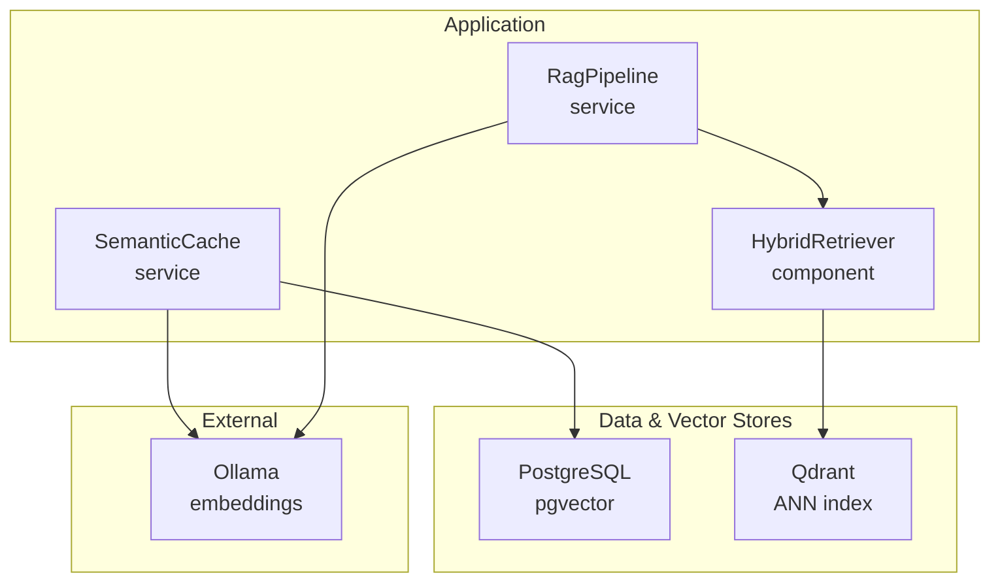
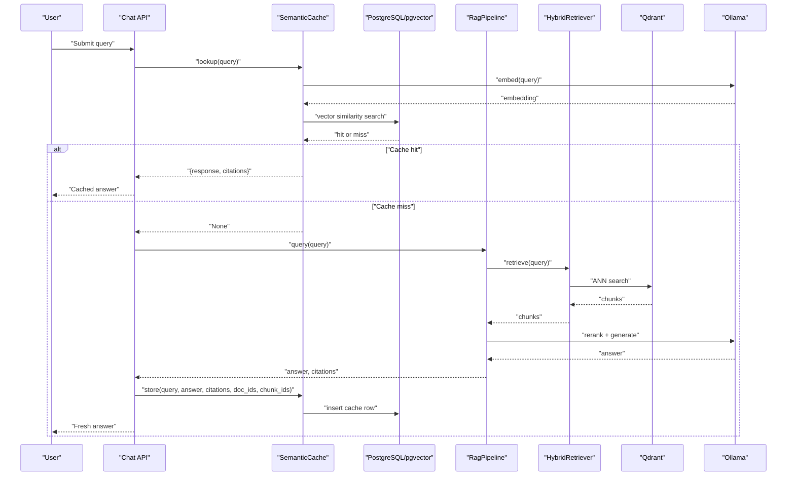
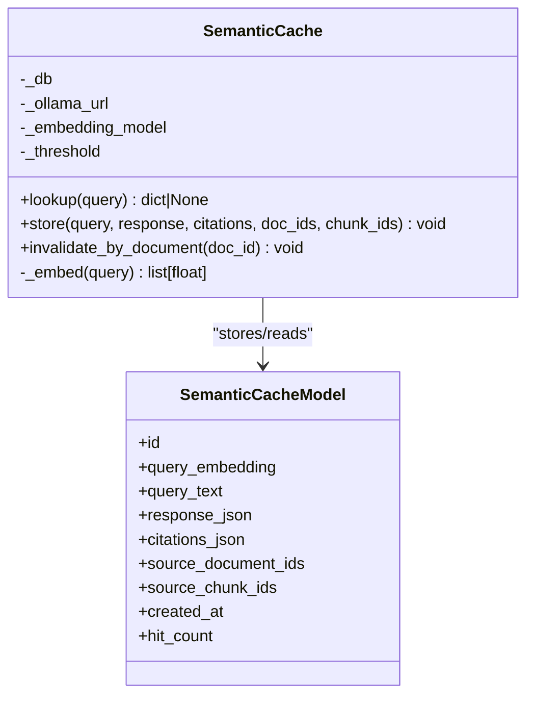
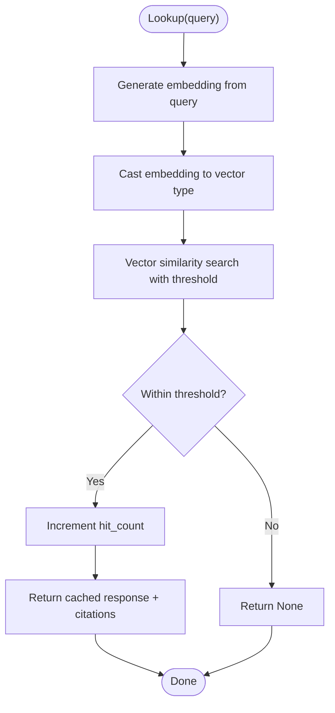
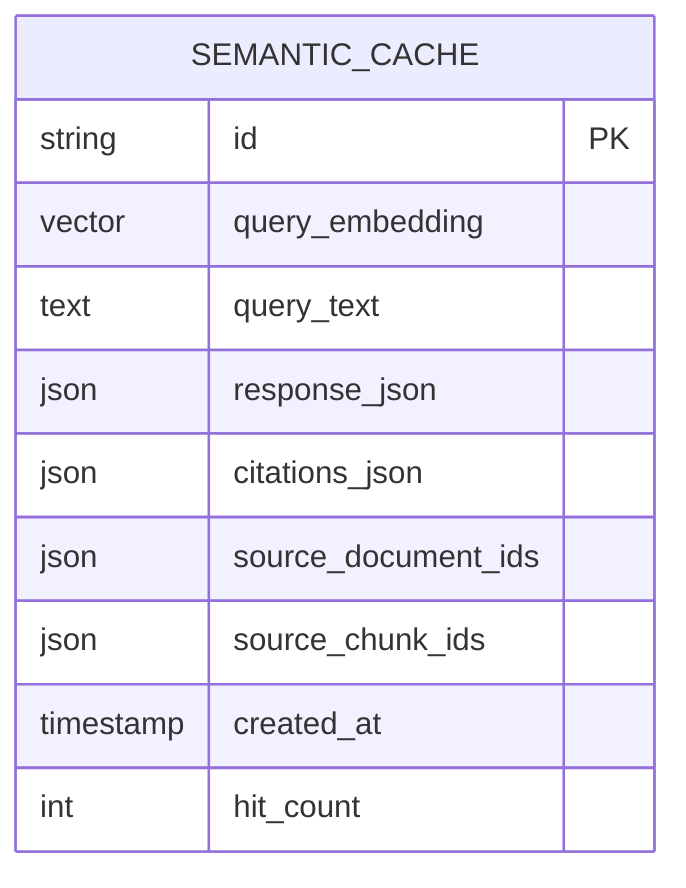
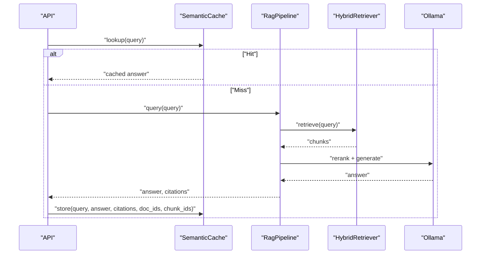
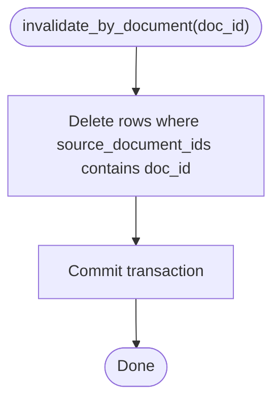
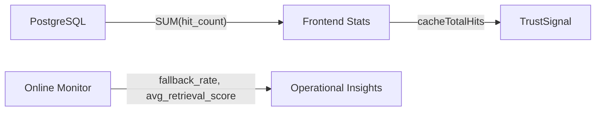
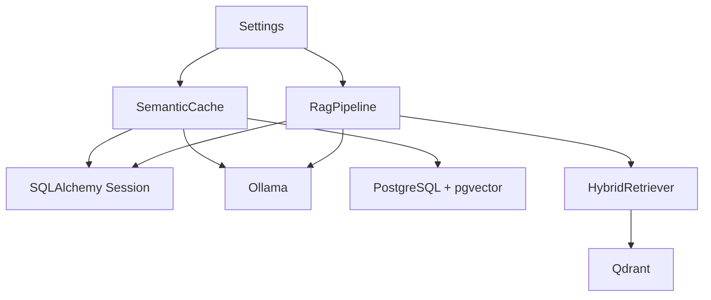

# Semantic Caching Strategy

<cite>
**Referenced Files in This Document**
- [semantic_cache.py](file://safe4ai-pilot/app/services/semantic_cache.py)
- [models.py](file://safe4ai-pilot/app/db/models.py)
- [config.py](file://safe4ai-pilot/app/config.py)
- [rag_pipeline.py](file://safe4ai-pilot/app/services/rag_pipeline.py)
- [hybrid_retriever.py](file://safe4ai-pilot/app/components/hybrid_retriever.py)
- [test_semantic_cache.py](file://safe4ai-pilot/tests/test_semantic_cache.py)
- [stats.ts](file://safe4ai-pilot/frontend/src/api/stats.ts)
- [TrustSignal.tsx](file://safe4ai-pilot/frontend/src/components/chat/TrustSignal.tsx)
- [online_monitor.py](file://safe4ai-pilot/evaluation/online_monitor.py)
- [architecture.md](file://safe4ai-pilot/docs/architecture.md)
- [db-layer.md](file://safe4ai-pilot/docs/db-layer.md)
- [main.py](file://safe4ai-pilot/app/main.py)
</cite>

## Table of Contents
1. [Introduction](#introduction)
2. [Project Structure](#project-structure)
3. [Core Components](#core-components)
4. [Architecture Overview](#architecture-overview)
5. [Detailed Component Analysis](#detailed-component-analysis)
6. [Dependency Analysis](#dependency-analysis)
7. [Performance Considerations](#performance-considerations)
8. [Troubleshooting Guide](#troubleshooting-guide)
9. [Conclusion](#conclusion)
10. [Appendices](#appendices)

## Introduction
This document explains the semantic caching strategy that accelerates the AI pipeline by recognizing semantically similar queries and reusing stored answers. It covers how cache keys are derived from query embeddings, how similarity thresholds govern cache hits, and how cache invalidation aligns with document lifecycle. It also details integration with the retrieval pipeline, prioritization of cached results over fresh processing, configuration of cache parameters, monitoring effectiveness, storage and memory characteristics, and operational procedures such as warming and maintenance.

## Project Structure
The semantic cache is implemented as a service that integrates with the retrieval pipeline and database schema. Key elements:
- Service layer: semantic cache operations (lookup, store, invalidate)
- Database model: persistent cache entries with vector embeddings
- Configuration: cache threshold and related runtime parameters
- Retrieval components: hybrid retriever and RAG pipeline
- Monitoring and UI: statistics and trust signals for cache visibility
- Operational docs: architecture rationale and database cleanup procedures

**Diagram sources**
- [semantic_cache.py:14-103](file://safe4ai-pilot/app/services/semantic_cache.py#L14-L103)
- [models.py:104-116](file://safe4ai-pilot/app/db/models.py#L104-L116)
- [config.py:17-18](file://safe4ai-pilot/app/config.py#L17-L18)
- [rag_pipeline.py:34-56](file://safe4ai-pilot/app/services/rag_pipeline.py#L34-L56)
- [hybrid_retriever.py:14-28](file://safe4ai-pilot/app/components/hybrid_retriever.py#L14-L28)

**Section sources**
- [architecture.md:3-11](file://safe4ai-pilot/docs/architecture.md#L3-L11)

## Core Components
- SemanticCache service
  - Embeds incoming queries and compares against cached embeddings using a configurable similarity threshold
  - Returns cached response and citations when a hit occurs, otherwise proceeds to retrieval
  - Stores new query-response pairs with associated document/chunk provenance
  - Provides document-scoped invalidation to remove stale cache entries
- Database model
  - Stores query embedding (vector), normalized text, response JSON, citations JSON, and source identifiers
  - Tracks hit counts for cache analytics
- Configuration
  - Exposes cache threshold and embedding model selection
- Retrieval pipeline integration
  - Uses HybridRetriever and Reranker to produce context-aware answers when cache misses occur

**Section sources**
- [semantic_cache.py:14-103](file://safe4ai-pilot/app/services/semantic_cache.py#L14-L103)
- [models.py:104-116](file://safe4ai-pilot/app/db/models.py#L104-L116)
- [config.py:17-18](file://safe4ai-pilot/app/config.py#L17-L18)
- [rag_pipeline.py:151-181](file://safe4ai-pilot/app/services/rag_pipeline.py#L151-L181)
- [hybrid_retriever.py:57-144](file://safe4ai-pilot/app/components/hybrid_retriever.py#L57-L144)

## Architecture Overview
The semantic cache sits alongside the retrieval pipeline. Queries first hit the cache; if matched, the cached answer is returned immediately. Otherwise, the pipeline retrieves relevant chunks, reranks them, generates an answer, and optionally stores the result in the cache.

**Diagram sources**
- [semantic_cache.py:41-92](file://safe4ai-pilot/app/services/semantic_cache.py#L41-L92)
- [rag_pipeline.py:151-181](file://safe4ai-pilot/app/services/rag_pipeline.py#L151-L181)
- [hybrid_retriever.py:57-144](file://safe4ai-pilot/app/components/hybrid_retriever.py#L57-L144)

## Detailed Component Analysis

### SemanticCache Service
Responsibilities:
- Embedding generation via Ollama
- Similarity search using vector distance with a configurable threshold
- Cache hit counting and incrementing
- Storing new cache entries with citations and provenance
- Deleting cache entries for a given document ID

Key behaviors:
- Lookup returns response and citations when similarity exceeds threshold; otherwise None
- Store persists query embedding, text, response, citations, and source identifiers
- Invalidate removes all cache rows associated with a document ID

**Diagram sources**
- [semantic_cache.py:14-103](file://safe4ai-pilot/app/services/semantic_cache.py#L14-L103)
- [models.py:104-116](file://safe4ai-pilot/app/db/models.py#L104-L116)

**Section sources**
- [semantic_cache.py:14-103](file://safe4ai-pilot/app/services/semantic_cache.py#L14-L103)
- [test_semantic_cache.py:25-106](file://safe4ai-pilot/tests/test_semantic_cache.py#L25-L106)

### Cache Key Generation and Similarity Threshold
- Cache key concept: the vector embedding of the query text
- Similarity metric: cosine distance computed as vector <-> cast vector comparison
- Threshold: configurable minimum similarity to qualify as a cache hit
- Ranking: closest match selected when multiple candidates exist

**Diagram sources**
- [semantic_cache.py:41-69](file://safe4ai-pilot/app/services/semantic_cache.py#L41-L69)

**Section sources**
- [semantic_cache.py:41-69](file://safe4ai-pilot/app/services/semantic_cache.py#L41-L69)
- [config.py:17-18](file://safe4ai-pilot/app/config.py#L17-L18)

### Cache Storage and Provenance
- Storage fields include query embedding, normalized text, response JSON, citations JSON, and arrays of source document and chunk IDs
- Hit count supports cache analytics and prioritization
- Provenance enables targeted invalidation per document

**Diagram sources**
- [models.py:104-116](file://safe4ai-pilot/app/db/models.py#L104-L116)

**Section sources**
- [models.py:104-116](file://safe4ai-pilot/app/db/models.py#L104-L116)

### Integration with Retrieval Pipeline
- On cache miss, the pipeline performs retrieval and reranking
- The final answer and citations are returned to the caller
- Optionally, the pipeline can store the result in the semantic cache after successful generation

**Diagram sources**
- [semantic_cache.py:41-92](file://safe4ai-pilot/app/services/semantic_cache.py#L41-L92)
- [rag_pipeline.py:151-181](file://safe4ai-pilot/app/services/rag_pipeline.py#L151-L181)
- [hybrid_retriever.py:57-144](file://safe4ai-pilot/app/components/hybrid_retriever.py#L57-L144)

**Section sources**
- [rag_pipeline.py:151-181](file://safe4ai-pilot/app/services/rag_pipeline.py#L151-L181)

### Cache Invalidation Strategies
- Document-scoped invalidation deletes all cache entries whose source document ID list contains the target ID
- Supports cache maintenance when documents change or are removed

**Diagram sources**
- [semantic_cache.py:94-103](file://safe4ai-pilot/app/services/semantic_cache.py#L94-L103)

**Section sources**
- [semantic_cache.py:94-103](file://safe4ai-pilot/app/services/semantic_cache.py#L94-L103)

### Monitoring Cache Effectiveness
- Frontend exposes cache total hits aggregated over a period
- Trust signal UI indicates whether a response came from cache or was freshly generated
- Online monitor evaluates system health using sampled audit logs and agent runs

**Diagram sources**
- [stats.ts:9-28](file://safe4ai-pilot/frontend/src/api/stats.ts#L9-L28)
- [TrustSignal.tsx:18-18](file://safe4ai-pilot/frontend/src/components/chat/TrustSignal.tsx#L18-L18)
- [online_monitor.py:112-178](file://safe4ai-pilot/evaluation/online_monitor.py#L112-L178)
- [db-layer.md:404-405](file://safe4ai-pilot/docs/db-layer.md#L404-L405)

**Section sources**
- [stats.ts:9-28](file://safe4ai-pilot/frontend/src/api/stats.ts#L9-L28)
- [TrustSignal.tsx:18-18](file://safe4ai-pilot/frontend/src/components/chat/TrustSignal.tsx#L18-L18)
- [online_monitor.py:112-178](file://safe4ai-pilot/evaluation/online_monitor.py#L112-L178)
- [db-layer.md:404-405](file://safe4ai-pilot/docs/db-layer.md#L404-L405)

## Dependency Analysis
- SemanticCache depends on:
  - SQLAlchemy session for persistence
  - Ollama for embedding generation
  - Postgres with pgvector extension for vector similarity
- Retrieval pipeline depends on:
  - HybridRetriever for hybrid dense/sparse retrieval
  - Qdrant for ANN search
  - Ollama for reranking and generation
- Configuration ties embedding model and cache threshold to runtime behavior

**Diagram sources**
- [semantic_cache.py:14-25](file://safe4ai-pilot/app/services/semantic_cache.py#L14-L25)
- [rag_pipeline.py:34-56](file://safe4ai-pilot/app/services/rag_pipeline.py#L34-L56)
- [config.py:7-18](file://safe4ai-pilot/app/config.py#L7-L18)

**Section sources**
- [semantic_cache.py:14-25](file://safe4ai-pilot/app/services/semantic_cache.py#L14-L25)
- [rag_pipeline.py:34-56](file://safe4ai-pilot/app/services/rag_pipeline.py#L34-L56)
- [config.py:7-18](file://safe4ai-pilot/app/config.py#L7-L18)

## Performance Considerations
- Embedding cost: Each lookup and store triggers an embedding request to Ollama
- Vector similarity: Uses Postgres vector operator; ensure proper indexing and extension availability
- Hit count increments: Adds a write operation on cache hits to support analytics
- Fresh processing overhead: Retrieval and reranking plus generation when cache misses occur
- Threshold tuning: Higher thresholds reduce false positives but increase misses; lower thresholds increase hits but risk irrelevant matches

[No sources needed since this section provides general guidance]

## Troubleshooting Guide
Common issues and remedies:
- Embedding failures: Validate Ollama availability and model readiness
- Vector extension missing: Ensure Postgres has the vector extension enabled
- Cache miss despite similar queries: Adjust similarity threshold or verify embedding model consistency
- Invalidation not taking effect: Confirm document ID presence in source arrays and transaction commit

**Section sources**
- [semantic_cache.py:27-39](file://safe4ai-pilot/app/services/semantic_cache.py#L27-L39)
- [main.py:35-37](file://safe4ai-pilot/app/main.py#L35-L37)
- [test_semantic_cache.py:96-106](file://safe4ai-pilot/tests/test_semantic_cache.py#L96-L106)

## Conclusion
The semantic cache accelerates the pipeline by recognizing semantically similar queries and reusing previously generated answers. It leverages vector embeddings and a configurable similarity threshold to balance hit rate and relevance. Integration with the retrieval pipeline ensures cached results are prioritized when available, while invalidation and monitoring keep the cache accurate and observable. Proper configuration of thresholds and embedding models, combined with operational practices like cache warming and periodic cleanup, sustains performance and cost benefits.

[No sources needed since this section summarizes without analyzing specific files]

## Appendices

### Configuring Cache Parameters
- Cache similarity threshold: tune to balance precision and recall
- Embedding model: select a model aligned with query characteristics
- Retention policy: manage cache lifetime for cost control

**Section sources**
- [config.py:17-18](file://safe4ai-pilot/app/config.py#L17-L18)
- [db-layer.md:378-379](file://safe4ai-pilot/docs/db-layer.md#L378-L379)

### Implementing Custom Similarity Metrics
- Current implementation uses vector distance with a cosine-based similarity formula
- To customize, modify the SQL similarity expression and adjust threshold accordingly

**Section sources**
- [semantic_cache.py:45-51](file://safe4ai-pilot/app/services/semantic_cache.py#L45-L51)

### Monitoring Cache Effectiveness
- Track total cache hits and average latency
- Observe fallback rate and retrieval score trends
- Use frontend stats and trust signals for user-visible indicators

**Section sources**
- [stats.ts:9-28](file://safe4ai-pilot/frontend/src/api/stats.ts#L9-L28)
- [TrustSignal.tsx:18-18](file://safe4ai-pilot/frontend/src/components/chat/TrustSignal.tsx#L18-L18)
- [online_monitor.py:112-178](file://safe4ai-pilot/evaluation/online_monitor.py#L112-L178)

### Cache Storage Mechanisms and Memory Management
- Storage: JSON fields for response and citations; vector column for embeddings
- Indexing: rely on Postgres vector extension capabilities
- Memory: embeddings are short-lived in-memory vectors during lookups

**Section sources**
- [models.py:104-116](file://safe4ai-pilot/app/db/models.py#L104-L116)
- [main.py:35-37](file://safe4ai-pilot/app/main.py#L35-L37)

### Cache Warming and Maintenance
- Warm Ollama model at startup to avoid cold-start delays
- Periodic cleanup of old cache entries based on retention policy
- Invalidate cache entries when source documents change

**Section sources**
- [main.py:58-59](file://safe4ai-pilot/app/main.py#L58-L59)
- [db-layer.md:378-379](file://safe4ai-pilot/docs/db-layer.md#L378-L379)
- [semantic_cache.py:94-103](file://safe4ai-pilot/app/services/semantic_cache.py#L94-L103)