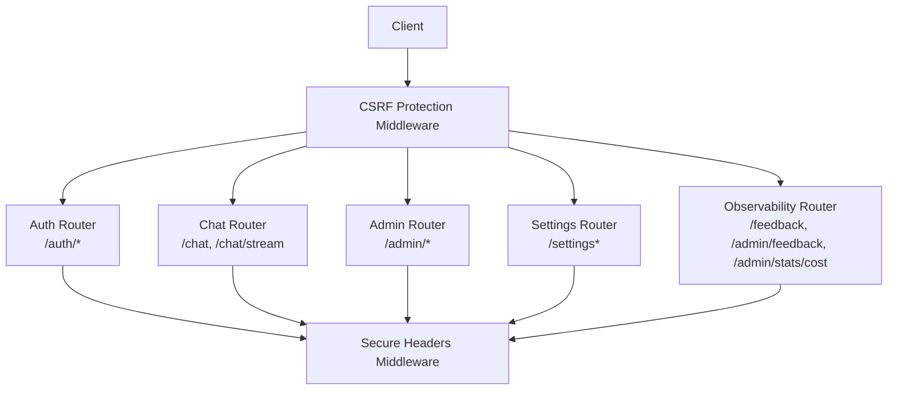
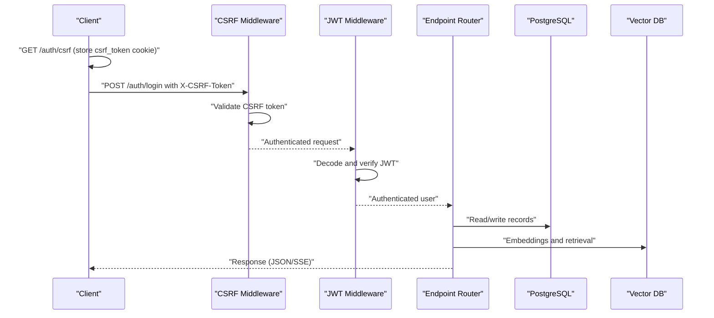
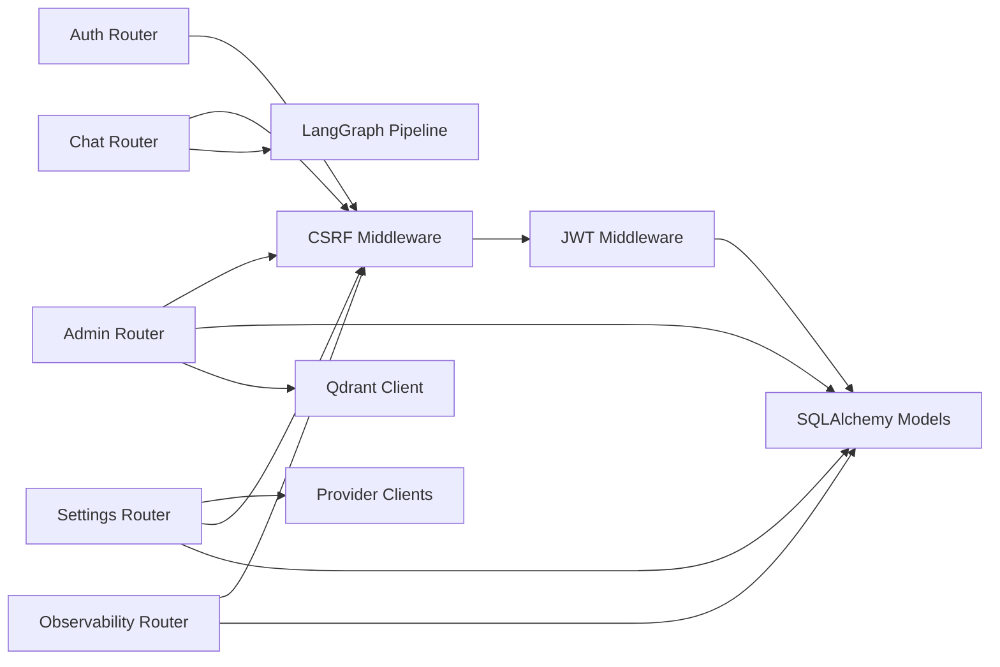

# API Reference

<cite>
**Referenced Files in This Document**
- [main.py](file://safe4ai-pilot/app/main.py)
- [auth.py](file://safe4ai-pilot/app/auth/router.py)
- [middleware.py](file://safe4ai-pilot/app/auth/middleware.py)
- [chat_routes.py](file://safe4ai-pilot/app/api/chat_routes.py)
- [admin_routes.py](file://safe4ai-pilot/app/api/admin_routes.py)
- [observability_routes.py](file://safe4ai-pilot/app/api/observability_routes.py)
- [models.py](file://safe4ai-pilot/app/db/models.py)
- [config.py](file://safe4ai-pilot/app/config.py)
- [auth.ts](file://safe4ai-pilot/frontend/src/api/auth.ts)
- [chat.ts](file://safe4ai-pilot/frontend/src/api/chat.ts)
- [client.ts](file://safe4ai-pilot/frontend/src/api/client.ts)
- [settings.ts](file://safe4ai-pilot/frontend/src/api/settings.ts)
- [test_auth.py](file://safe4ai-pilot/tests/test_auth.py)
- [test_chat.py](file://safe4ai-pilot/tests/test_chat.py)
- [test_admin.py](file://safe4ai-pilot/tests/test_admin.py)
</cite>

## Update Summary
**Changes Made**
- Added new PATCH /settings endpoint for comprehensive provider configuration management
- Added new POST /settings/provider/test endpoint for provider connectivity validation
- Enhanced administrative API with provider management capabilities
- Updated settings schema to include provider configuration fields
- Added provider validation and testing functionality

## Table of Contents
1. [Introduction](#introduction)
2. [Project Structure](#project-structure)
3. [Core Components](#core-components)
4. [Architecture Overview](#architecture-overview)
5. [Detailed Component Analysis](#detailed-component-analysis)
6. [Dependency Analysis](#dependency-analysis)
7. [Performance Considerations](#performance-considerations)
8. [Troubleshooting Guide](#troubleshooting-guide)
9. [Conclusion](#conclusion)
10. [Appendices](#appendices)

## Introduction
This document provides a comprehensive API reference for the Private AI system. It covers authentication with CSRF protection, chat (blocking and streaming), administrative operations (document management, user management, audit logs, stats, human review queue), and observability endpoints (feedback and cost stats). For each endpoint, you will find HTTP methods, URL patterns, request/response schemas, authentication requirements, rate limits, and error handling behavior. Practical usage examples are included using curl and code snippets.

**Updated** Enhanced with comprehensive provider management capabilities including PATCH /settings for granular configuration updates and POST /settings/provider/test for connectivity validation.

## Project Structure
The backend is a FastAPI application with modular routers:
- Authentication router under /auth with CSRF protection
- Chat router under /
- Admin router under /admin
- Observability router under /
- Settings management under /settings for provider configuration

Security middleware enforces JWT cookies, role-based access control, CSRF protection, and global rate limiting. CORS and secure headers are configured at startup.

**Diagram sources**
- [main.py:90-120](file://safe4ai-pilot/app/main.py#L90-L120)
- [auth.py:24](file://safe4ai-pilot/app/auth/router.py#L24)
- [chat_routes.py:28](file://safe4ai-pilot/app/api/chat_routes.py#L28)
- [admin_routes.py:39](file://safe4ai-pilot/app/api/admin_routes.py#L39)
- [observability_routes.py:16](file://safe4ai-pilot/app/api/observability_routes.py#L16)

**Section sources**
- [main.py:90-120](file://safe4ai-pilot/app/main.py#L90-L120)
- [main.py:63-84](file://safe4ai-pilot/app/main.py#L63-L84)

## Core Components
- Authentication and Authorization
  - JWT cookie-based sessions with HS256 signing
  - CSRF protection with double-submit cookie pattern
  - Role-based access control enforced via dependency
  - Global rate limiting via SlowAPI
- Chat
  - Blocking chat endpoint returning structured answer and citations
  - Streaming chat endpoint using Server-Sent Events (SSE)
- Administration
  - Document lifecycle: upload, status polling, reindex, delete
  - User management: list, create, deactivate
  - Audit logs: list and CSV export
  - Stats: query volume, latency, cost, cache hits
  - Human review queue: list, approve, reject items
- Settings Management
  - Comprehensive provider configuration via PATCH /settings
  - Provider connectivity testing via POST /settings/provider/test
  - Real-time settings validation and live model discovery
- Observability
  - Feedback submission and admin listing
  - Cost statistics aggregation

**Updated** Added comprehensive settings management with provider configuration capabilities and connectivity testing.

**Section sources**
- [auth.py:34-105](file://safe4ai-pilot/app/auth/router.py#L34-L105)
- [middleware.py:35-82](file://safe4ai-pilot/app/auth/middleware.py#L35-L82)
- [chat_routes.py:39-244](file://safe4ai-pilot/app/api/chat_routes.py#L39-L244)
- [admin_routes.py:63-539](file://safe4ai-pilot/app/api/admin_routes.py#L63-539)
- [admin_routes.py:995-1380](file://safe4ai-pilot/app/api/admin_routes.py#L995-L1380)
- [observability_routes.py:19-56](file://safe4ai-pilot/app/api/observability_routes.py#L19-56)

## Architecture Overview
High-level flow for authenticated requests with CSRF protection:
- Client requests CSRF token via GET /auth/csrf
- Client stores CSRF cookie and sets X-CSRF-Token header for subsequent requests
- Client authenticates and receives both access_token and csrf_token cookies
- Middleware validates CSRF tokens for unsafe methods and JWT for authentication
- Endpoint-specific logic executes (chat graph invocation, DB operations, file IO)
- Responses are returned with appropriate status codes and headers

**Diagram sources**
- [auth.py:55-67](file://safe4ai-pilot/app/auth/router.py#L55-L67)
- [auth.py:70-148](file://safe4ai-pilot/app/auth/router.py#L70-L148)
- [main.py:90-120](file://safe4ai-pilot/app/main.py#L90-L120)
- [middleware.py:51-71](file://safe4ai-pilot/app/auth/middleware.py#L51-L71)

## Detailed Component Analysis

### Authentication Endpoints with CSRF Protection
- GET /auth/csrf
  - Purpose: Issue a pre-login CSRF token for double-submit protection
  - Response: {csrf_token: string}
  - Cookie: Sets csrf_token cookie (httponly=False, samesite=strict)
  - Security: Used before POST /auth/login to establish CSRF protection
  - Status codes: 200 (success)
  - Example curl:
    - curl -c cookies.txt -X GET https://host/auth/csrf
- POST /auth/login
  - Purpose: Authenticate and set HTTP-only access_token cookie with CSRF protection
  - Rate limit: 10/minute per IP
  - Request body: email, password
  - Headers: X-CSRF-Token (required)
  - Response: JSON success message; sets access_token and csrf_token cookies
  - Security: Enforces CSRF double-submit validation; minimum password length; brute-force lockout after threshold; rejects invalid credentials
  - Status codes: 200 (success), 401 (invalid credentials), 403 (CSRF validation failed), 429 (locked), 413 (request too large)
  - Example curl:
    - curl -c cookies.txt -X POST https://host/auth/csrf (first get CSRF token)
    - curl -b cookies.txt -X POST https://host/auth/login -H "X-CSRF-Token: {{csrf_token}}" -H "Content-Type: application/json" -d '{"email":"user@example.com","password":"SecurePass123!"}'
- POST /auth/logout
  - Purpose: Clear access_token and csrf_token cookies
  - Response: JSON success message
  - Status codes: 200
  - Example curl:
    - curl -b cookies.txt -X POST https://host/auth/logout

Authentication token management:
- Cookie attributes: access_token (HTTP-only, SameSite=Strict, Secure based on settings, 8-hour expiry); csrf_token (SameSite=Strict, Secure based on settings, 8-hour expiry)
- Token payload: subject (user ID), role, issued at, expiry
- Validation: HS256 signature verification; active user lookup; missing/invalid tokens return 401
- CSRF protection: Double-submit cookie pattern with constant-time comparison

**Section sources**
- [auth.py:55-67](file://safe4ai-pilot/app/auth/router.py#L55-L67)
- [auth.py:70-148](file://safe4ai-pilot/app/auth/router.py#L70-L148)
- [auth.py:151-180](file://safe4ai-pilot/app/auth/router.py#L151-L180)
- [main.py:90-120](file://safe4ai-pilot/app/main.py#L90-L120)
- [test_auth.py:279-295](file://safe4ai-pilot/tests/test_auth.py#L279-L295)

### Chat Endpoints
- POST /chat
  - Purpose: Blocking chat response
  - Rate limit: 30/minute per user/IP
  - Request body: question (required), session_id (optional), collection (default "default")
  - Response: answer (string), citations (array), session_id (string), trace_id (string), cache_hit (boolean)
  - Validation: Empty question returns 422
  - Errors: 503 if AI pipeline not ready, 500 on pipeline invocation error
  - Example curl:
    - curl -b cookies.txt -X POST https://host/chat -H "Content-Type: application/json" -d '{"question":"How do I deploy?"}'
- POST /chat/stream
  - Purpose: Streaming chat via SSE
  - Rate limit: 30/minute per user/IP
  - Request body: same as POST /chat
  - Response events:
    - step: {name: "embed"|"retrieve"|"rerank"|"generate", state: "active"|"done", t: number}
    - token: {delta: string} (word tokens emitted with ~20ms spacing)
    - cite: {id: string, file: string, page: number, score: number}
    - done: {traceId: string, latencyMs: number, cache: boolean, model: string, kRetrieved: number, sessionId: string, error?: string}
  - Validation: Empty question returns 422
  - Errors: Emits an error event with traceId on exceptions
  - Example curl (SSE):
    - curl -N -b cookies.txt -X POST https://host/chat/stream -H "Content-Type: application/json" -d '{"question":"Answer?"}'

Frontend consumption:
- The frontend automatically handles CSRF tokens through the apiFetch utility, setting X-CSRF-Token header when csrf_token cookie is present.

**Section sources**
- [chat_routes.py:109-142](file://safe4ai-pilot/app/api/chat_routes.py#L109-142)
- [chat_routes.py:150-244](file://safe4ai-pilot/app/api/chat_routes.py#L150-244)
- [chat.ts:21-75](file://safe4ai-pilot/frontend/src/api/chat.ts#L21-L75)
- [client.ts:31-55](file://safe4ai-pilot/frontend/src/api/client.ts#L31-L55)
- [test_chat.py:75-122](file://safe4ai-pilot/tests/test_chat.py#L75-L122)

### Settings Management Endpoints

**Updated** Added comprehensive settings management with provider configuration capabilities.

- GET /settings
  - Purpose: Retrieve current application settings with provider configuration
  - Rate limit: 100/minute
  - Response: Complete settings object including provider configuration, model availability, and system metrics
  - Response includes provider settings, model lists, security configurations, and cost statistics
  - Example curl:
    - curl -b cookies.txt -X GET https://host/settings
- PATCH /settings
  - Purpose: Update application settings with validation and real-time testing
  - Rate limit: 100/minute
  - Request body: Partial settings object supporting granular updates
  - Supported fields include provider configuration, model settings, security options, and cost controls
  - Validation: Comprehensive field validation with provider-specific constraints
  - Response: Updated settings object with computed values and reindex requirement indicator
  - Validation rules:
    - Provider type must be "ollama" or "openai_compatible"
    - API key required for openai_compatible provider
    - Model identifiers must be valid and available
    - Embedding model dimensions must match vector store configuration
    - Chunk size and overlap must maintain valid relationships
  - Example curl:
    - curl -b cookies.txt -X PATCH https://host/settings -H "Content-Type: application/json" -d '{"providerType":"openai_compatible","providerApiKey":"sk-...","providerBaseUrl":"https://api.openai.com/v1"}'
- POST /settings/provider/test
  - Purpose: Test provider connectivity and configuration validity
  - Rate limit: 100/minute
  - Request body: Provider configuration to test (type, base URL, API key)
  - Response: {status: "ok"} on successful validation
  - Validation: Lightweight connectivity check without persisting changes
  - Error conditions:
    - 422: Invalid provider configuration or missing required fields
    - 503: Provider connectivity issues or authentication failures
  - Example curl:
    - curl -b cookies.txt -X POST https://host/settings/provider/test -H "Content-Type: application/json" -d '{"providerType":"openai_compatible","providerBaseUrl":"https://api.openai.com/v1","providerApiKey":"sk-..."}'

Settings schema and validation:
- Provider configuration includes type, base URL, API key presence indicator, and model specifications
- Model validation ensures compatibility with selected provider and embedding source
- Provider mode expansion supports simplified configuration for local, hybrid, and cloud deployments
- Live model discovery provides real-time availability information for Ollama and external providers

**Section sources**
- [admin_routes.py:1000-1008](file://safe4ai-pilot/app/api/admin_routes.py#L1000-L1008)
- [admin_routes.py:1041-1327](file://safe4ai-pilot/app/api/admin_routes.py#L1041-L1327)
- [admin_routes.py:1330-1380](file://safe4ai-pilot/app/api/admin_routes.py#L1330-L1380)
- [settings.ts:8-88](file://safe4ai-pilot/frontend/src/api/settings.ts#L8-L88)

### Administrative Endpoints
- POST /admin/documents/upload
  - Purpose: Upload a document; triggers background ingestion
  - Rate limit: 10/hour per admin
  - Request: multipart/form-data with file field
  - Response: {doc_id: string, job_id: string}
  - Validation: Content validated by UploadValidator; request body size enforced globally
  - Errors: 400 (validation failure), 413 (too large)
  - Example curl:
    - curl -b cookies.txt -X POST https://host/admin/documents/upload -F "file=@./manual.pdf"
- GET /admin/documents
  - Purpose: List all documents with ingestion status and chunk counts
  - Rate limit: 100/minute
  - Response: Array of document records
- GET /admin/documents/{doc_id}/status
  - Purpose: Poll ingestion progress for a document
  - Response: {doc_id, ingestion_status, job_status, job_error, ingestion_started_at}
  - Errors: 404 if not found
- DELETE /admin/documents/{doc_id}
  - Purpose: Delete document from filesystem, vector store, DB, and semantic cache
  - Response: 204 No Content
  - Errors: 404 if not found
- POST /admin/documents/{doc_id}/reindex
  - Purpose: Re-index an existing document
  - Response: {job_id: string}
  - Errors: 404 if not found, 409 if raw file missing
- GET /admin/users
  - Purpose: List users
  - Rate limit: 100/minute
  - Response: Array of user records
- POST /admin/users
  - Purpose: Create a new user
  - Request: {email, password (min 12 chars), role}
  - Response: {id: string}
  - Errors: 422 (password too short), 409 (duplicate email)
- DELETE /admin/users/{user_id}
  - Purpose: Deactivate a user (cannot deactivate self)
  - Response: 204 No Content
  - Errors: 400 (self-deactivation), 404 (not found)
- GET /admin/audit-logs
  - Purpose: List audit logs with filters and pagination
  - Query params: start (datetime), end (datetime), user_id (string), limit (int, default 100, max 1000), offset (int)
  - Rate limit: 100/minute
  - Response: Array of audit log records
- GET /admin/audit-logs/export.csv
  - Purpose: Export audit logs as CSV
  - Response: text/csv attachment
  - Rate limit: 100/minute
- GET /admin/stats
  - Purpose: Aggregate stats (queries, latency, cost, cache hits)
  - Query params: days (int, default 30)
  - Response: {days, total_queries, avg_latency_ms, total_cost_usd, cache_total_hits}
  - Rate limit: 100/minute
- GET /admin/review-queue
  - Purpose: List items in human review queue
  - Query params: status (enum pending|approved|rejected)
  - Response: Array of review queue items
  - Rate limit: 100/minute
- POST /admin/review-queue/{item_id}/approve
  - Purpose: Approve a review item
  - Response: {"status": "approved"}
  - Errors: 404 (not found), 409 (already reviewed)
- POST /admin/review-queue/{item_id}/reject
  - Purpose: Reject a review item
  - Response: {"status": "rejected"}
  - Errors: 404 (not found), 409 (already reviewed)

**Section sources**
- [admin_routes.py:63-114](file://safe4ai-pilot/app/api/admin_routes.py#L63-114)
- [admin_routes.py:117-148](file://safe4ai-pilot/app/api/admin_routes.py#L117-148)
- [admin_routes.py:151-175](file://safe4ai-pilot/app/api/admin_routes.py#L151-175)
- [admin_routes.py:178-208](file://safe4ai-pilot/app/api/admin_routes.py#L178-208)
- [admin_routes.py:211-243](file://safe4ai-pilot/app/api/admin_routes.py#L211-243)
- [admin_routes.py:284-323](file://safe4ai-pilot/app/api/admin_routes.py#L284-323)
- [admin_routes.py:346-418](file://safe4ai-pilot/app/api/admin_routes.py#L346-418)
- [admin_routes.py:426-458](file://safe4ai-pilot/app/api/admin_routes.py#L426-458)
- [admin_routes.py:466-529](file://safe4ai-pilot/app/api/admin_routes.py#L466-529)
- [test_admin.py:100-157](file://safe4ai-pilot/tests/test_admin.py#L100-L157)
- [test_admin.py:165-214](file://safe4ai-pilot/tests/test_admin.py#L165-L214)

### Observability Endpoints
- POST /feedback
  - Purpose: Submit feedback for a query response
  - Request: {session_id, trace_id, rating (positive|negative), comment (optional)}
  - Response: {id: string}
- GET /admin/feedback
  - Purpose: List recent feedback entries (admin only)
  - Response: Array of feedback records
- GET /admin/stats/cost
  - Purpose: Cost statistics for the past days
  - Query params: days (int, default 30)
  - Response: Aggregated cost stats
  - Rate limit: 100/minute

**Section sources**
- [observability_routes.py:26-56](file://safe4ai-pilot/app/api/observability_routes.py#L26-56)

### Health and Metrics
- GET /health
  - Purpose: Health probe checking database, vector store, and LLM service readiness
  - Response: {status: "ok"|"degraded", checks: map of service statuses}

**Section sources**
- [main.py:118-147](file://safe4ai-pilot/app/main.py#L118-L147)

## Dependency Analysis
Key internal dependencies and relationships:
- Routers depend on middleware for authentication, CSRF validation, and role checks
- CSRF protection middleware validates tokens for all unsafe methods and login endpoint
- Chat endpoints depend on a compiled LangGraph pipeline and conversation manager
- Admin endpoints depend on DB models, upload validator, and vector store client
- Settings endpoints depend on provider clients, model validators, and runtime configuration
- Observability endpoints depend on cost tracker and feedback store

**Diagram sources**
- [auth.py:24](file://safe4ai-pilot/app/auth/router.py#L24)
- [chat_routes.py:28](file://safe4ai-pilot/app/api/chat_routes.py#L28)
- [admin_routes.py:39](file://safe4ai-pilot/app/api/admin_routes.py#L39)
- [admin_routes.py:995](file://safe4ai-pilot/app/api/admin_routes.py#L995)
- [observability_routes.py:16](file://safe4ai-pilot/app/api/observability_routes.py#L16)
- [main.py:90-120](file://safe4ai-pilot/app/main.py#L90-L120)
- [models.py:45-175](file://safe4ai-pilot/app/db/models.py#L45-L175)

**Section sources**
- [main.py:28-60](file://safe4ai-pilot/app/main.py#L28-L60)
- [models.py:45-175](file://safe4ai-pilot/app/db/models.py#L45-L175)

## Performance Considerations
- Rate limiting
  - Auth login: 10/minute per IP (CSRF-enabled)
  - Chat blocking and streaming: 30/minute per user/IP
  - Admin endpoints: 100/minute (varies by endpoint)
  - Settings endpoints: 100/minute (varies by operation)
  - Admin document upload: 10/hour per admin
  - Exceeding limits returns 429 with a standard error response
- Body size enforcement
  - Global max upload size controlled by settings; enforced by middleware
- CSRF overhead
  - Double-submit pattern adds minimal performance overhead
  - CSRF tokens are validated using constant-time comparison to prevent timing attacks
- Streaming
  - SSE emits tokens with small delays to avoid overwhelming clients
- Vector operations
  - Qdrant deletions and retrievals occur during admin operations; failures are logged but do not block deletion
- Settings validation
  - Provider connectivity tests use lightweight HTTP requests to minimize performance impact
  - Live model discovery caches results for improved response times

**Updated** Added performance considerations for settings management operations including provider connectivity testing and live model discovery caching.

**Section sources**
- [auth.py:70](file://safe4ai-pilot/app/auth/router.py#L70)
- [chat_routes.py:110](file://safe4ai-pilot/app/api/chat_routes.py#L110)
- [chat_routes.py:151](file://safe4ai-pilot/app/api/chat_routes.py#L151)
- [admin_routes.py:64](file://safe4ai-pilot/app/api/admin_routes.py#L64)
- [admin_routes.py:118](file://safe4ai-pilot/app/api/admin_routes.py#L118)
- [admin_routes.py:152](file://safe4ai-pilot/app/api/admin_routes.py#L152)
- [admin_routes.py:285](file://safe4ai-pilot/app/api/admin_routes.py#L285)
- [admin_routes.py:347](file://safe4ai-pilot/app/api/admin_routes.py#L347)
- [admin_routes.py:427](file://safe4ai-pilot/app/api/admin_routes.py#L427)
- [admin_routes.py:1001](file://safe4ai-pilot/app/api/admin_routes.py#L1001)
- [admin_routes.py:1046](file://safe4ai-pilot/app/api/admin_routes.py#L1046)
- [admin_routes.py:1335](file://safe4ai-pilot/app/api/admin_routes.py#L1335)
- [main.py:88-95](file://safe4ai-pilot/app/main.py#L88-L95)
- [config.py:18](file://safe4ai-pilot/app/config.py#L18)

## Troubleshooting Guide
Common errors and resolutions:
- Authentication
  - 401 Not authenticated: Missing or invalid access_token cookie; re-login
  - 401 Invalid credentials: Wrong email/password; ensure minimum password length
  - 403 CSRF validation failed: Missing or invalid X-CSRF-Token header; ensure CSRF token is obtained first
  - 429 Locked: Account temporarily blocked after repeated failed attempts; wait
- Chat
  - 422 Empty question: Provide a non-empty question
  - 503 Pipeline not ready: Wait until the AI pipeline initializes
  - 500 Pipeline error: Retry; check backend logs
- Settings Management
  - 403 Forbidden: Insufficient role (requires admin) for settings operations
  - 404 Not found: Unknown document/user ID in related contexts
  - 422 Validation errors: Provider configuration issues, invalid model names, or conflicting settings
  - 503 Provider connectivity: External provider unresponsive or authentication failed
  - 409 Conflict: Item already processed or raw file missing for reindex
  - 413 Too large: Request exceeds max upload size
- Admin
  - 403 Forbidden: Insufficient role (requires admin)
  - 404 Not found: Unknown document/user ID
  - 409 Conflict: Item already processed or raw file missing for reindex
  - 413 Too large: Request exceeds max upload size
- Observability
  - 403 Forbidden: Admin-only endpoints
- Health
  - Degraded status indicates failing service checks; inspect downstream systems

**Updated** Added troubleshooting guidance for settings management operations including provider configuration validation and connectivity testing.

**Section sources**
- [test_auth.py:93-142](file://safe4ai-pilot/tests/test_auth.py#L93-L142)
- [test_auth.py:288-295](file://safe4ai-pilot/tests/test_auth.py#L288-L295)
- [test_chat.py:100-122](file://safe4ai-pilot/tests/test_chat.py#L100-L122)
- [test_admin.py:144-157](file://safe4ai-pilot/tests/test_admin.py#L144-L157)
- [test_admin.py:202-214](file://safe4ai-pilot/tests/test_admin.py#L202-L214)
- [test_admin.py:295-321](file://safe4ai-pilot/tests/test_admin.py#L295-L321)
- [main.py:118-147](file://safe4ai-pilot/app/main.py#L118-L147)

## Conclusion
The Private AI system exposes a cohesive set of REST endpoints for authentication, chat, administration, and observability. Authentication now includes robust CSRF protection with double-submit cookie pattern, enhancing security against cross-site request forgery attacks. The system relies on secure JWT cookies with strict rate limiting and brute-force protections. Chat supports both synchronous and streaming responses with structured citations and tracing. Administrators can manage documents, users, audit logs, and review queues. Settings management provides comprehensive provider configuration capabilities with real-time validation and connectivity testing. Observability endpoints enable feedback and cost analytics. The backend enforces strict validation, rate limits, CSRF protection, and security headers to maintain reliability and safety.

**Updated** Enhanced with comprehensive provider management capabilities allowing administrators to configure and validate external AI providers with real-time connectivity testing and validation.

## Appendices

### Endpoint Catalog
- Authentication
  - GET /auth/csrf
  - POST /auth/login
  - POST /auth/logout
- Chat
  - POST /chat
  - POST /chat/stream
- Settings Management
  - GET /settings
  - PATCH /settings
  - POST /settings/provider/test
- Admin
  - POST /admin/documents/upload
  - GET /admin/documents
  - GET /admin/documents/{doc_id}/status
  - DELETE /admin/documents/{doc_id}
  - POST /admin/documents/{doc_id}/reindex
  - GET /admin/users
  - POST /admin/users
  - DELETE /admin/users/{user_id}
  - GET /admin/audit-logs
  - GET /admin/audit-logs/export.csv
  - GET /admin/stats
  - GET /admin/review-queue
  - POST /admin/review-queue/{item_id}/approve
  - POST /admin/review-queue/{item_id}/reject
  - GET /me
- Observability
  - POST /feedback
  - GET /admin/feedback
  - GET /admin/stats/cost
- System
  - GET /health

**Updated** Added settings management endpoints to the catalog.

### Request/Response Schemas

- GET /auth/csrf
  - Response: {csrf_token: string}
- POST /auth/login
  - Request: {email: string, password: string}
  - Headers: X-CSRF-Token (required)
  - Response: {message: string}
- POST /auth/logout
  - Response: {message: string}
- POST /chat
  - Request: {question: string, session_id?: string, collection?: string}
  - Response: {answer: string, citations: array of {filename: string, page_number: number, score: number}, session_id: string, trace_id: string, cache_hit: boolean}
- POST /chat/stream
  - Request: {question: string, session_id?: string, collection?: string}
  - Response (SSE): events "step", "token", "cite", "done"
- GET /settings
  - Response: Complete settings object including provider configuration, model availability, and system metrics
- PATCH /settings
  - Request: Partial settings object with provider configuration and system settings
  - Response: Updated settings object with validation results and reindex requirement indicator
- POST /settings/provider/test
  - Request: Provider configuration to validate
  - Response: {status: "ok"} on successful validation
- POST /admin/documents/upload
  - Request: multipart/form-data {file: file}
  - Response: {doc_id: string, job_id: string}
- GET /admin/documents
  - Response: array of {id, filename, file_type, ingestion_status, uploaded_at, version, active_version, chunk_count}
- GET /admin/documents/{doc_id}/status
  - Response: {doc_id, ingestion_status, job_status, job_error, ingestion_started_at}
- DELETE /admin/documents/{doc_id}
  - Response: 204 No Content
- POST /admin/documents/{doc_id}/reindex
  - Response: {job_id: string}
- GET /admin/users
  - Response: array of {id, email, role, is_active, created_at}
- POST /admin/users
  - Request: {email: string, password: string, role: "admin"|"pilot_user"}
  - Response: {id: string}
- DELETE /admin/users/{user_id}
  - Response: 204 No Content
- GET /admin/audit-logs
  - Query: start?, end?, user_id?, limit?, offset?
  - Response: array of {id, user_id, session_id, timestamp, action_type, query_text, latency_ms, model_used, trace_id}
- GET /admin/audit-logs/export.csv
  - Response: text/csv attachment
- GET /admin/stats
  - Query: days?
  - Response: {days, total_queries, avg_latency_ms, total_cost_usd, cache_total_hits}
- GET /admin/review-queue
  - Query: status?
  - Response: array of {id, session_id, user_id, query, draft_answer, risk_reason, status, reviewed_by, reviewed_at}
- POST /admin/review-queue/{item_id}/approve
  - Response: {status: "approved"}
- POST /admin/review-queue/{item_id}/reject
  - Response: {status: "rejected"}
- GET /me
  - Response: {id, email, role}
- POST /feedback
  - Request: {session_id: string, trace_id: string, rating: "positive"|"negative", comment?: string}
  - Response: {id: string}
- GET /admin/feedback
  - Response: array of feedback records
- GET /admin/stats/cost
  - Query: days?
  - Response: aggregated cost stats
- GET /health
  - Response: {status, checks}

**Updated** Added request/response schemas for settings management endpoints.

### Authentication and Security
- Cookies: access_token (HTTP-only, SameSite=Strict, Secure based on settings), csrf_token (SameSite=Strict, Secure based on settings)
- CSRF Protection: Double-submit cookie pattern with constant-time comparison
- Roles: admin, pilot_user
- Password hashing: bcrypt
- JWT: HS256, 8-hour expiry
- Brute-force protection: lockout after threshold failures
- CORS: configured origins list; credentials allowed; X-CSRF-Token header permitted
- Secure headers: applied globally

**Section sources**
- [auth.py:91-103](file://safe4ai-pilot/app/auth/router.py#L91-L103)
- [middleware.py:35-82](file://safe4ai-pilot/app/auth/middleware.py#L35-L82)
- [main.py:69-84](file://safe4ai-pilot/app/main.py#L69-L84)
- [main.py:90-120](file://safe4ai-pilot/app/main.py#L90-L120)

### Frontend Usage Examples
- Authentication
  - CSRF token acquisition: [auth.ts:10-11](file://safe4ai-pilot/frontend/src/api/auth.ts#L10-L11)
  - Login flow with CSRF: [auth.ts:13-16](file://safe4ai-pilot/frontend/src/api/auth.ts#L13-L16)
  - Logout: [auth.ts:18-19](file://safe4ai-pilot/frontend/src/api/auth.ts#L18-L19)
  - Get current user: [auth.ts:21](file://safe4ai-pilot/frontend/src/api/auth.ts#L21)
- Chat streaming
  - SSE event parsing: [chat.ts:21-75](file://safe4ai-pilot/frontend/src/api/chat.ts#L21-L75)
- Settings management
  - Settings retrieval and updates: [settings.ts:90-102](file://safe4ai-pilot/frontend/src/api/settings.ts#L90-L102)
- CSRF token handling
  - Automatic CSRF header injection: [client.ts:31-55](file://safe4ai-pilot/frontend/src/api/client.ts#L31-L55)
- Shared client behavior
  - Credentials include; JSON headers: [client.ts:3-15](file://safe4ai-pilot/frontend/src/api/client.ts#L3-L15)

**Updated** Added frontend usage examples for settings management operations.

**Section sources**
- [auth.ts:10-21](file://safe4ai-pilot/frontend/src/api/auth.ts#L10-L21)
- [chat.ts:21-75](file://safe4ai-pilot/frontend/src/api/chat.ts#L21-L75)
- [settings.ts:90-102](file://safe4ai-pilot/frontend/src/api/settings.ts#L90-L102)
- [client.ts:31-55](file://safe4ai-pilot/frontend/src/api/client.ts#L31-L55)
- [client.ts:3-15](file://safe4ai-pilot/frontend/src/api/client.ts#L3-L15)