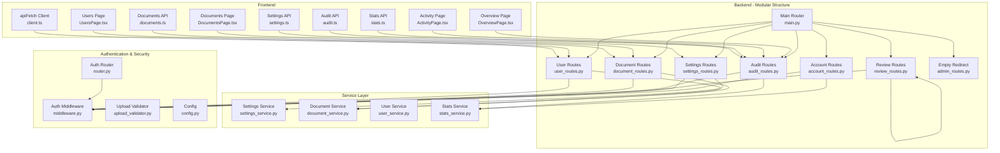
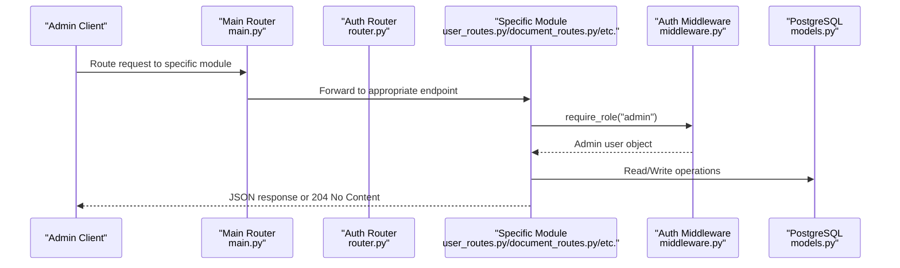
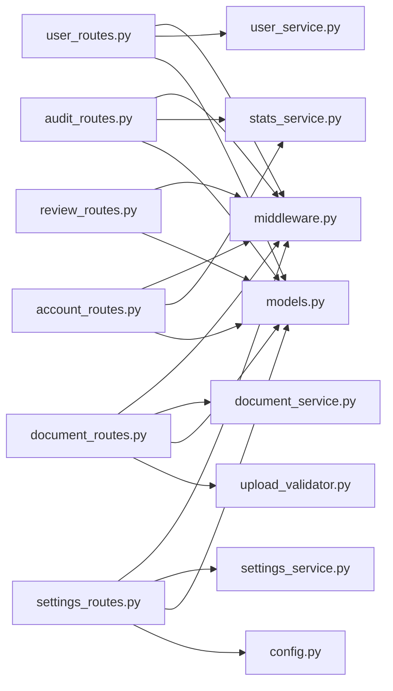

# Administrative API

<cite>
**Referenced Files in This Document**
- [admin_routes.py](file://safe4ai-pilot/app/api/admin_routes.py)
- [user_routes.py](file://safe4ai-pilot/app/api/user_routes.py)
- [document_routes.py](file://safe4ai-pilot/app/api/document_routes.py)
- [audit_routes.py](file://safe4ai-pilot/app/api/audit_routes.py)
- [review_routes.py](file://safe4ai-pilot/app/api/review_routes.py)
- [settings_routes.py](file://safe4ai-pilot/app/api/settings_routes.py)
- [account_routes.py](file://safe4ai-pilot/app/api/account_routes.py)
- [settings_service.py](file://safe4ai-pilot/app/services/settings_service.py)
- [middleware.py](file://safe4ai-pilot/app/auth/middleware.py)
- [router.py](file://safe4ai-pilot/app/auth/router.py)
- [models.py](file://safe4ai-pilot/app/db/models.py)
- [upload_validator.py](file://safe4ai-pilot/app/security/upload_validator.py)
- [config.py](file://safe4ai-pilot/app/config.py)
- [main.py](file://safe4ai-pilot/app/main.py)
- [client.ts](file://safe4ai-pilot/frontend/src/api/client.ts)
- [audit.ts](file://safe4ai-pilot/frontend/src/api/audit.ts)
- [documents.ts](file://safe4ai-pilot/frontend/src/api/documents.ts)
- [stats.ts](file://safe4ai-pilot/frontend/src/api/stats.ts)
- [settings.ts](file://safe4ai-pilot/frontend/src/api/settings.ts)
- [UsersPage.tsx](file://safe4ai-pilot/frontend/src/pages/admin/UsersPage.tsx)
- [DocumentsPage.tsx](file://safe4ai-pilot/frontend/src/pages/admin/DocumentsPage.tsx)
- [ActivityPage.tsx](file://safe4ai-pilot/frontend/src/pages/admin/ActivityPage.tsx)
- [OverviewPage.tsx](file://safe4ai-pilot/frontend/src/pages/admin/OverviewPage.tsx)
</cite>

## Update Summary
**Changes Made**
- **Major Structural Change**: Administrative API transformed from single monolithic admin_routes.py (854 lines) to modular endpoint structure with dedicated route modules
- **New Modular Architecture**: Split into focused modules: user_routes.py, document_routes.py, audit_routes.py, review_routes.py, settings_routes.py, account_routes.py
- **Service Layer Extraction**: Settings management moved to dedicated settings_service.py with three-stage validation pipeline
- **Enhanced Organization**: Each module handles specific administrative domains with clear separation of concerns
- **Maintained Backward Compatibility**: Original admin_routes.py kept empty but serves as redirect for external callers

## Table of Contents
1. [Introduction](#introduction)
2. [Project Structure](#project-structure)
3. [Core Components](#core-components)
4. [Architecture Overview](#architecture-overview)
5. [Detailed Component Analysis](#detailed-component-analysis)
6. [Dependency Analysis](#dependency-analysis)
7. [Performance Considerations](#performance-considerations)
8. [Troubleshooting Guide](#troubleshooting-guide)
9. [Conclusion](#conclusion)
10. [Appendices](#appendices)

## Introduction
This document provides comprehensive API documentation for administrative endpoints focused on user management, document oversight, system monitoring, and application configuration. The system has been restructured from a monolithic admin_routes.py to a modular architecture with dedicated endpoint modules and service layers. It covers HTTP methods, URL patterns, request/response schemas, authorization requirements, and operational workflows for admin-only operations.

## Project Structure
The administrative API is now organized into focused modules with clear separation of concerns. Each module handles specific administrative domains: user management, document lifecycle, audit monitoring, human review workflows, and settings management. Authentication and authorization are handled via JWT cookies and role-check dependencies. Frontend clients consume these endpoints through typed API modules with comprehensive coverage of all administrative functions.



**Diagram sources**
- [user_routes.py:1-106](file://safe4ai-pilot/app/api/user_routes.py#L1-L106)
- [document_routes.py:1-408](file://safe4ai-pilot/app/api/document_routes.py#L1-L408)
- [audit_routes.py:1-169](file://safe4ai-pilot/app/api/audit_routes.py#L1-L169)
- [review_routes.py:1-84](file://safe4ai-pilot/app/api/review_routes.py#L1-L84)
- [settings_routes.py:1-173](file://safe4ai-pilot/app/api/settings_routes.py#L1-L173)
- [account_routes.py:1-134](file://safe4ai-pilot/app/api/account_routes.py#L1-L134)
- [main.py:161-170](file://safe4ai-pilot/app/main.py#L161-L170)
- [admin_routes.py:1-19](file://safe4ai-pilot/app/api/admin_routes.py#L1-L19)

**Section sources**
- [user_routes.py:1-106](file://safe4ai-pilot/app/api/user_routes.py#L1-L106)
- [document_routes.py:1-408](file://safe4ai-pilot/app/api/document_routes.py#L1-L408)
- [audit_routes.py:1-169](file://safe4ai-pilot/app/api/audit_routes.py#L1-L169)
- [review_routes.py:1-84](file://safe4ai-pilot/app/api/review_routes.py#L1-L84)
- [settings_routes.py:1-173](file://safe4ai-pilot/app/api/settings_routes.py#L1-L173)
- [account_routes.py:1-134](file://safe4ai-pilot/app/api/account_routes.py#L1-L134)
- [main.py:161-170](file://safe4ai-pilot/app/main.py#L161-L170)
- [admin_routes.py:1-19](file://safe4ai-pilot/app/api/admin_routes.py#L1-L19)

## Core Components
- **Modular Route Structure**: Administrative functionality split across dedicated modules for better maintainability and scalability
- **User Management Module**: Handles user CRUD operations with password validation and role management
- **Document Management Module**: Manages document lifecycle including upload, ingestion, status tracking, and deletion
- **Audit & Monitoring Module**: Provides comprehensive audit logging with CSV export and system statistics
- **Human Review Module**: Governance workflow for content moderation and risk assessment
- **Settings Management Module**: Dynamic configuration system with three-stage validation pipeline and runtime component refresh
- **Account Management Module**: User profile and settings management for authenticated users
- **Authentication & Authorization**: JWT cookie-based authentication with role-based access control
- **Service Layer**: Dedicated services for business logic separation and reusability

**Section sources**
- [user_routes.py:20-21](file://safe4ai-pilot/app/api/user_routes.py#L20-L21)
- [document_routes.py:32-33](file://safe4ai-pilot/app/api/document_routes.py#L32-L33)
- [audit_routes.py:20-21](file://safe4ai-pilot/app/api/audit_routes.py#L20-L21)
- [review_routes.py:16-17](file://safe4ai-pilot/app/api/review_routes.py#L16-L17)
- [settings_routes.py:27-28](file://safe4ai-pilot/app/api/settings_routes.py#L27-L28)
- [account_routes.py:23-24](file://safe4ai-pilot/app/api/account_routes.py#L23-L24)

## Architecture Overview
The admin API follows a modular architecture pattern with clear separation of concerns. Each endpoint module is self-contained with its own router, validation, and service dependencies. The system maintains backward compatibility through the empty admin_routes.py redirect while providing enhanced maintainability and scalability.



**Diagram sources**
- [main.py:161-170](file://safe4ai-pilot/app/main.py#L161-L170)
- [user_routes.py:40-47](file://safe4ai-pilot/app/api/user_routes.py#L40-L47)
- [middleware.py:51-109](file://safe4ai-pilot/app/auth/middleware.py#L51-L109)

## Detailed Component Analysis

### Authorization and Authentication
- **JWT Cookie Management**: Login sets an HTTP-only cookie named access_token with configurable security flags
- **Role-Based Access Control**: require_role("admin") ensures only admin users can access admin endpoints
- **Rate Limiting**: Each module applies rate limiting at the endpoint level
- **Token Validation**: Includes expiration checking and role synchronization


**Diagram sources**
- [router.py:55-137](file://safe4ai-pilot/app/auth/router.py#L55-L137)
- [middleware.py:51-109](file://safe4ai-pilot/app/auth/middleware.py#L51-L109)

**Section sources**
- [router.py:55-137](file://safe4ai-pilot/app/auth/router.py#L55-L137)
- [middleware.py:51-109](file://safe4ai-pilot/app/auth/middleware.py#L51-L109)

### User Management Endpoints
- **List users**
  - Method: GET
  - URL: /admin/users
  - Auth: admin
  - Response: Array of user records with id, email, role, is_active, created_at
  - Rate limit: 100/minute
- **Create user**
  - Method: POST
  - URL: /admin/users
  - Auth: admin
  - Request body: email, password, role (defaults to pilot_user)
  - Constraints: password minimum length enforced; email uniqueness enforced
  - Response: { id }
  - Rate limit: 100/minute
- **Deactivate user**
  - Method: DELETE
  - URL: /admin/users/{user_id}
  - Auth: admin
  - Constraints: cannot deactivate self; cannot deactivate admin users
  - Response: 204 No Content
  - Rate limit: 100/minute

Example curl:
- Create user:
  ```bash
  curl -b cookies.txt -c cookies.txt -X POST https://host/admin/users -H "Content-Type: application/json" -d '{"email":"admin2@example.com","password":"securepassword123","role":"admin"}'
  ```
- List users:
  ```bash
  curl -b cookies.txt https://host/admin/users
  ```
- Deactivate user:
  ```bash
  curl -b cookies.txt -X DELETE https://host/admin/users/<user_id>
  ```

**Section sources**
- [user_routes.py:40-63](file://safe4ai-pilot/app/api/user_routes.py#L40-L63)
- [user_routes.py:66-88](file://safe4ai-pilot/app/api/user_routes.py#L66-L88)
- [user_routes.py:91-106](file://safe4ai-pilot/app/api/user_routes.py#L91-L106)

### Document Management Endpoints
- **Upload document**
  - Method: POST
  - URL: /admin/documents/upload
  - Auth: admin
  - Request: multipart/form-data with file field
  - Validation: extension, declared and detected MIME type, magic bytes, size limit
  - Response: { doc_id, job_id }
  - Rate limit: 10/hour
- **List documents**
  - Method: GET
  - URL: /admin/documents
  - Auth: admin
  - Response: Array of documents with ingestion status and chunk count
  - Rate limit: 100/minute
- **Get document status**
  - Method: GET
  - URL: /admin/documents/{doc_id}/status
  - Auth: admin
  - Response: { doc_id, ingestion_status, job_status, job_error, ingestion_started_at }
  - Rate limit: 100/minute
- **Delete document**
  - Method: DELETE
  - URL: /admin/documents/{doc_id}
  - Auth: admin
  - Constraints: cannot delete during active ingestion
  - Side effects: removes raw file, vector points, DB records, and semantic cache entries
  - Response: 204 No Content
  - Rate limit: 100/minute
- **Re-index document**
  - Method: POST
  - URL: /admin/documents/{doc_id}/reindex
  - Auth: admin
  - Constraints: raw file must exist
  - Response: { job_id }
  - Rate limit: 100/minute

Example curl:
- Upload:
  ```bash
  curl -b cookies.txt -X POST https://host/admin/documents/upload -F "file=@/path/to/doc.pdf"
  ```
- Status:
  ```bash
  curl -b cookies.txt https://host/admin/documents/<doc_id>/status
  ```
- Delete:
  ```bash
  curl -b cookies.txt -X DELETE https://host/admin/documents/<doc_id>
  ```
- Reindex:
  ```bash
  curl -b cookies.txt -X POST https://host/admin/documents/<doc_id>/reindex
  ```

**Section sources**
- [document_routes.py:136-198](file://safe4ai-pilot/app/api/document_routes.py#L136-L198)
- [document_routes.py:212-248](file://safe4ai-pilot/app/api/document_routes.py#L212-L248)
- [document_routes.py:251-275](file://safe4ai-pilot/app/api/document_routes.py#L251-L275)
- [document_routes.py:278-324](file://safe4ai-pilot/app/api/document_routes.py#L278-L324)
- [document_routes.py:327-407](file://safe4ai-pilot/app/api/document_routes.py#L327-L407)

### Audit Logs and Monitoring
- **List audit logs**
  - Method: GET
  - URL: /admin/audit-logs
  - Auth: admin
  - Query params: start (datetime), end (datetime), user_id (string), limit (int, default 100, max 1000), offset (int, default 0)
  - Response: Array of audit log records
  - Rate limit: 100/minute
- **Export audit logs to CSV**
  - Method: GET
  - URL: /admin/audit-logs/export.csv
  - Auth: admin
  - Query params: start (datetime), end (datetime)
  - Response: CSV file attachment
  - Rate limit: 100/minute
- **Get system statistics**
  - Method: GET
  - URL: /admin/stats
  - Auth: admin
  - Query params: days (int, default 30)
  - Response: { days, total_queries, avg_latency_ms, total_cost_usd, cache_total_hits, unique_users, generated_at }
  - Rate limit: 100/minute

Example curl:
- List:
  ```bash
  curl -b cookies.txt "https://host/admin/audit-logs?limit=100&offset=0"
  ```
- Export:
  ```bash
  curl -b cookies.txt -OJ "https://host/admin/audit-logs/export.csv"
  ```
- Stats:
  ```bash
  curl -b cookies.txt "https://host/admin/stats?days=30"
  ```

**Section sources**
- [audit_routes.py:24-61](file://safe4ai-pilot/app/api/audit_routes.py#L24-L61)
- [audit_routes.py:64-122](file://safe4ai-pilot/app/api/audit_routes.py#L64-L122)
- [audit_routes.py:125-168](file://safe4ai-pilot/app/api/audit_routes.py#L125-L168)

### Human Review Queue
- **List review queue**
  - Method: GET
  - URL: /admin/review-queue
  - Auth: admin
  - Query params: status (enum: pending, approved, rejected)
  - Response: Array of review queue items
  - Rate limit: 100/minute
- **Approve review item**
  - Method: POST
  - URL: /admin/review-queue/{item_id}/approve
  - Auth: admin
  - Response: { status: "approved" }
  - Rate limit: 100/minute
- **Reject review item**
  - Method: POST
  - URL: /admin/review-queue/{item_id}/reject
  - Auth: admin
  - Response: { status: "rejected" }
  - Rate limit: 100/minute

Example curl:
- List:
  ```bash
  curl -b cookies.txt "https://host/admin/review-queue?status=pending"
  ```
- Approve:
  ```bash
  curl -b cookies.txt -X POST https://host/admin/review-queue/<item_id>/approve
  ```
- Reject:
  ```bash
  curl -b cookies.txt -X POST https://host/admin/review-queue/<item_id>/reject
  ```

**Section sources**
- [review_routes.py:20-47](file://safe4ai-pilot/app/api/review_routes.py#L20-L47)
- [review_routes.py:50-65](file://safe4ai-pilot/app/api/review_routes.py#L50-L65)
- [review_routes.py:68-83](file://safe4ai-pilot/app/api/review_routes.py#L68-L83)

### Application Settings Management
- **Get settings**
  - Method: GET
  - URL: /settings
  - Auth: admin
  - Response: Complete application settings including models, retrieval parameters, security, and cost controls
  - Rate limit: 100/minute
- **Patch settings**
  - Method: PATCH
  - URL: /settings
  - Auth: admin
  - Request body: Partial settings object with validation rules
  - Response: Updated settings with runtime component refresh
  - Rate limit: 100/minute
- **Test provider connection**
  - Method: POST
  - URL: /settings/provider/test
  - Auth: admin
  - Request body: Provider configuration for testing
  - Response: Connection status
  - Rate limit: 100/minute

The settings management now uses a sophisticated three-stage validation pipeline:
1. **Normalize**: Expand mode shorthands, snapshot previous state, derive effective values
2. **Probe**: Verify external service connectivity and sanitize model configurations
3. **Collect**: Validate individual fields and build database updates

Example curl:
- Get settings:
  ```bash
  curl -b cookies.txt https://host/settings
  ```
- Patch settings:
  ```bash
  curl -b cookies.txt -X PATCH https://host/settings -H "Content-Type: application/json" -d '{"generationModel":"llama3.2:1b","retrievalK":8,"chunkSize":800}'
  ```
- Test provider:
  ```bash
  curl -b cookies.txt -X POST https://host/settings/provider/test -H "Content-Type: application/json" -d '{"providerType":"ollama","providerBaseUrl":"http://localhost:11434"}'
  ```

**Section sources**
- [settings_routes.py:36-44](file://safe4ai-pilot/app/api/settings_routes.py#L36-L44)
- [settings_routes.py:47-105](file://safe4ai-pilot/app/api/settings_routes.py#L47-L105)
- [settings_routes.py:108-172](file://safe4ai-pilot/app/api/settings_routes.py#L108-L172)

### Account Management Endpoints
- **Get account settings**
  - Method: GET
  - URL: /account/settings
  - Auth: authenticated user
  - Response: User profile, security settings, usage statistics, and knowledge base stats
- **Change password**
  - Method: POST
  - URL: /account/change-password
  - Auth: authenticated user
  - Request body: currentPassword, newPassword
  - Response: Success message with re-authentication requirement
- **Get current user info**
  - Method: GET
  - URL: /me
  - Auth: authenticated user
  - Response: { id, email, role, is_active }

Example curl:
- Account settings:
  ```bash
  curl -b cookies.txt https://host/account/settings
  ```
- Change password:
  ```bash
  curl -b cookies.txt -X POST https://host/account/change-password -H "Content-Type: application/json" -d '{"currentPassword":"oldpass123","newPassword":"newpass456"}'
  ```
- Current user:
  ```bash
  curl -b cookies.txt https://host/me
  ```

**Section sources**
- [account_routes.py:32-103](file://safe4ai-pilot/app/api/account_routes.py#L32-L103)
- [account_routes.py:106-122](file://safe4ai-pilot/app/api/account_routes.py#L106-L122)
- [account_routes.py:125-133](file://safe4ai-pilot/app/api/account_routes.py#L125-L133)

## Dependency Analysis
The modular structure introduces clear dependency boundaries between route modules and their service layers:

- **Route modules depend on**:
  - Auth middleware for JWT extraction and role validation
  - SQLAlchemy models for data persistence
  - Upload validator for file intake
  - Configuration for limits and service URLs
  - Service modules for business logic
  - Rate limiting decorators for performance control

- **Service modules provide**:
  - Business logic encapsulation
  - External service integration
  - Data transformation utilities
  - Validation and sanitization



**Diagram sources**
- [user_routes.py:13-18](file://safe4ai-pilot/app/api/user_routes.py#L13-L18)
- [document_routes.py:13-29](file://safe4ai-pilot/app/api/document_routes.py#L13-L29)
- [audit_routes.py:15-18](file://safe4ai-pilot/app/api/audit_routes.py#L15-L18)
- [review_routes.py:10-14](file://safe4ai-pilot/app/api/review_routes.py#L10-L14)
- [settings_routes.py:10-25](file://safe4ai-pilot/app/api/settings_routes.py#L10-L25)
- [account_routes.py:11-21](file://safe4ai-pilot/app/api/account_routes.py#L11-L21)

**Section sources**
- [user_routes.py:13-18](file://safe4ai-pilot/app/api/user_routes.py#L13-L18)
- [document_routes.py:13-29](file://safe4ai-pilot/app/api/document_routes.py#L13-L29)
- [audit_routes.py:15-18](file://safe4ai-pilot/app/api/audit_routes.py#L15-L18)
- [review_routes.py:10-14](file://safe4ai-pilot/app/api/review_routes.py#L10-L14)
- [settings_routes.py:10-25](file://safe4ai-pilot/app/api/settings_routes.py#L10-L25)
- [account_routes.py:11-21](file://safe4ai-pilot/app/api/account_routes.py#L11-L21)

## Performance Considerations
- **Modular Rate Limiting**: Each endpoint module applies appropriate rate limits based on operation characteristics
- **Background Processing**: Document ingestion runs asynchronously to prevent blocking requests
- **Pagination Controls**: Audit log endpoints support configurable limits with maximum bounds
- **Service Caching**: Settings service implements intelligent caching for live metadata
- **Database Optimization**: Optimized queries with subqueries and joins for document and audit operations
- **Memory Management**: Proper cleanup of ingestion tasks and temporary files

## Troubleshooting Guide
Common errors and resolutions across the modular structure:

- **401 Not authenticated**
  - Cause: Missing or invalid access_token cookie
  - Resolution: Log in via /auth/login and ensure cookies are sent with subsequent requests
- **403 Forbidden**
  - Cause: Non-admin user attempting admin endpoint
  - Resolution: Authenticate as an admin user
- **400 Bad Request (upload)**
  - Cause: Disallowed extension, MIME type mismatch, or size exceeded
  - Resolution: Verify file extension (.pdf, .docx, .xlsx, .txt), declared content type, and size within configured limits
- **404 Not Found**
  - Cause: Document or user not found
  - Resolution: Confirm IDs and existence
- **409 Conflict (document delete/reindex)**
  - Cause: Document is currently being ingested or raw file not found
  - Resolution: Wait until ingestion completes, then retry deletion/reindex
- **413 Payload Too Large**
  - Cause: Request body exceeds configured maximum
  - Resolution: Reduce file size or adjust max_upload_size_mb
- **422 Unprocessable Entity (settings)**
  - Cause: Invalid settings values, model dimensions mismatch, or provider configuration issues
  - Resolution: Check validation rules for model names, numeric ranges, and configuration limits

**Section sources**
- [document_routes.py:286-324](file://safe4ai-pilot/app/api/document_routes.py#L286-L324)
- [document_routes.py:337-343](file://safe4ai-pilot/app/api/document_routes.py#L337-L343)
- [settings_routes.py:72-77](file://safe4ai-pilot/app/api/settings_routes.py#L72-L77)
- [settings_routes.py:124-128](file://safe4ai-pilot/app/api/settings_routes.py#L124-L128)

## Conclusion
The administrative API has been successfully transformed from a monolithic structure to a modular, maintainable architecture. The new structure provides clear separation of concerns with dedicated modules for user management, document lifecycle, audit monitoring, human review workflows, and settings management. Each module maintains comprehensive functionality while benefiting from improved organization, enhanced security through role-based access control, and robust validation pipelines. The service layer extraction enables better testability and code reuse, while the rate limiting and background processing ensure optimal performance for administrative operations.

## Appendices

### API Reference Summary

#### User Management
- GET /admin/users (100/minute)
- POST /admin/users (100/minute)  
- DELETE /admin/users/{user_id} (100/minute)

#### Document Management
- POST /admin/documents/upload (10/hour)
- GET /admin/documents (100/minute)
- GET /admin/documents/{doc_id}/status (100/minute)
- DELETE /admin/documents/{doc_id} (100/minute)
- POST /admin/documents/{doc_id}/reindex (100/minute)

#### Audit and Monitoring
- GET /admin/audit-logs (100/minute)
- GET /admin/audit-logs/export.csv (100/minute)
- GET /admin/stats (100/minute)

#### Human Review
- GET /admin/review-queue (100/minute)
- POST /admin/review-queue/{item_id}/approve (100/minute)
- POST /admin/review-queue/{item_id}/reject (100/minute)

#### Settings Management
- GET /settings (100/minute)
- PATCH /settings (100/minute)
- POST /settings/provider/test (100/minute)

#### Account Management
- GET /account/settings
- POST /account/change-password
- GET /me

**Authorization:**
- Cookies: access_token (HTTP-only)
- Role: admin required for admin endpoints, authenticated for account endpoints

**Rate limits:** Configured per endpoint module with appropriate limits for operation characteristics

**Security:**
- JWT HS256 signed by SECRET_KEY
- HTTPS enforcement configurable
- Upload validation prevents unsafe content
- Token revocation and role synchronization

**Section sources**
- [user_routes.py:40-106](file://safe4ai-pilot/app/api/user_routes.py#L40-L106)
- [document_routes.py:136-407](file://safe4ai-pilot/app/api/document_routes.py#L136-L407)
- [audit_routes.py:24-168](file://safe4ai-pilot/app/api/audit_routes.py#L24-L168)
- [review_routes.py:20-83](file://safe4ai-pilot/app/api/review_routes.py#L20-L83)
- [settings_routes.py:36-172](file://safe4ai-pilot/app/api/settings_routes.py#L36-L172)
- [account_routes.py:32-133](file://safe4ai-pilot/app/api/account_routes.py#L32-L133)

### Frontend Integration Notes
- **Client behavior**:
  - apiFetch sends credentials: include and parses responses, returning undefined for 204
  - CSRF token handling for non-GET requests
- **Audit API**:
  - listAuditLogs supports pagination and optional start filter
  - exportAuditCsv downloads CSV attachments
- **Documents API**:
  - uploadDocument uses FormData with file field
  - getDocumentStatus returns ingestion status
- **Settings API**:
  - getSettings and patchSettings provide typed configuration management
  - testProviderConnection validates external service connectivity
- **Page integration**:
  - UsersPage provides user management UI with invitation and deactivation workflows
  - DocumentsPage offers drag-and-drop upload and document management
  - ActivityPage displays real-time audit stream with filtering and export

**Section sources**
- [client.ts:31-55](file://safe4ai-pilot/frontend/src/api/client.ts#L31-L55)
- [audit.ts:34-53](file://safe4ai-pilot/frontend/src/api/audit.ts#L34-L53)
- [documents.ts:56-81](file://safe4ai-pilot/frontend/src/api/documents.ts#L56-L81)
- [settings.ts:56-62](file://safe4ai-pilot/frontend/src/api/settings.ts#L56-L62)