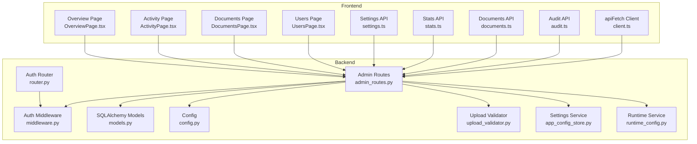
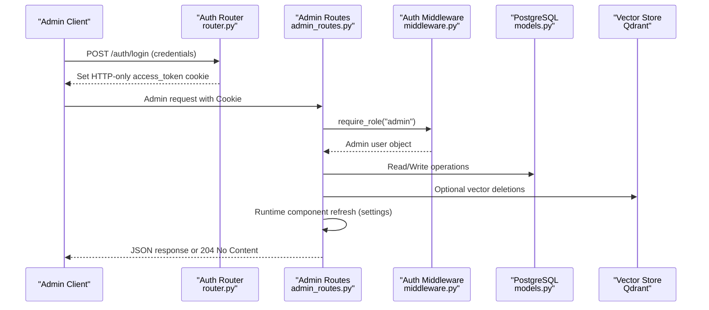
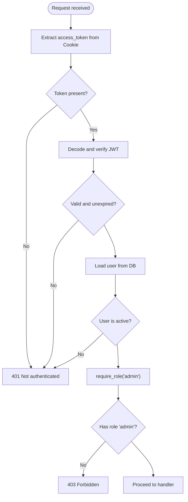
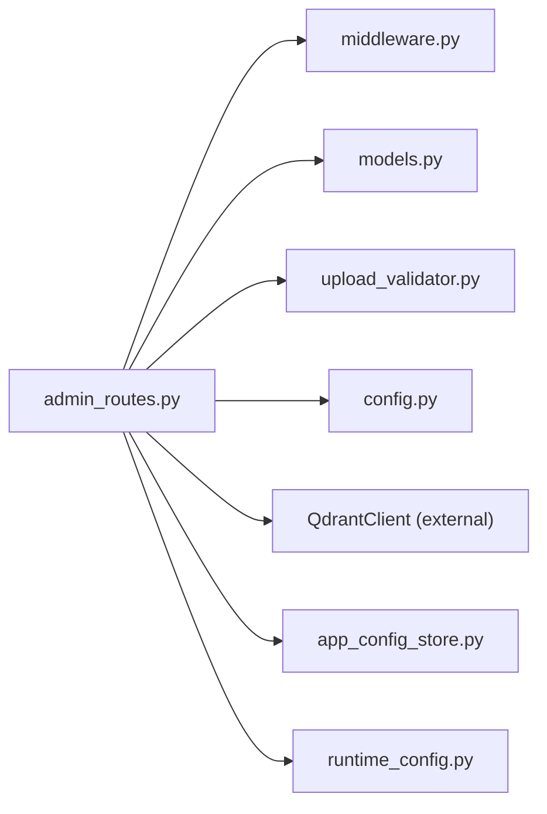

# Administrative API

<cite>
**Referenced Files in This Document**
- [admin_routes.py](file://safe4ai-pilot/app/api/admin_routes.py)
- [middleware.py](file://safe4ai-pilot/app/auth/middleware.py)
- [router.py](file://safe4ai-pilot/app/auth/router.py)
- [models.py](file://safe4ai-pilot/app/db/models.py)
- [upload_validator.py](file://safe4ai-pilot/app/security/upload_validator.py)
- [config.py](file://safe4ai-pilot/app/config.py)
- [client.ts](file://safe4ai-pilot/frontend/src/api/client.ts)
- [audit.ts](file://safe4ai-pilot/frontend/src/api/audit.ts)
- [documents.ts](file://safe4ai-pilot/frontend/src/api/documents.ts)
- [stats.ts](file://safe4ai-pilot/frontend/src/api/stats.ts)
- [settings.ts](file://safe4ai-pilot/frontend/src/api/settings.ts)
- [UsersPage.tsx](file://safe4ai-pilot/frontend/src/pages/admin/UsersPage.tsx)
- [DocumentsPage.tsx](file://safe4ai-pilot/frontend/src/pages/admin/DocumentsPage.tsx)
- [ActivityPage.tsx](file://safe4ai-pilot/frontend/src/pages/admin/ActivityPage.tsx)
- [OverviewPage.tsx](file://safe4ai-pilot/frontend/src/pages/admin/OverviewPage.tsx)
</cite>

## Update Summary
**Changes Made**
- Added comprehensive settings management endpoints for application configuration
- Enhanced human review queue endpoints with approval/rejection workflows
- Expanded audit monitoring capabilities with CSV export functionality
- Updated system statistics with additional metrics and retention period
- Integrated frontend components for settings management and enhanced UI

## Table of Contents
1. [Introduction](#introduction)
2. [Project Structure](#project-structure)
3. [Core Components](#core-components)
4. [Architecture Overview](#architecture-overview)
5. [Detailed Component Analysis](#detailed-component-analysis)
6. [Dependency Analysis](#dependency-analysis)
7. [Performance Considerations](#performance-considerations)
8. [Troubleshooting Guide](#troubleshooting-guide)
9. [Conclusion](#conclusion)
10. [Appendices](#appendices)

## Introduction
This document provides comprehensive API documentation for administrative endpoints focused on user management, document oversight, system monitoring, and application configuration. It covers HTTP methods, URL patterns, request/response schemas, authorization requirements, and operational workflows for admin-only operations. The system includes complete administrative capabilities with user provisioning, document lifecycle management, audit monitoring, human review workflows, and dynamic settings management.

## Project Structure
The administrative API surface is implemented in a FastAPI router module and backed by SQLAlchemy models. Authentication and authorization are handled via JWT cookies and a role-check dependency. Frontend clients consume these endpoints through typed API modules with comprehensive coverage of all administrative functions.

**Diagram sources**
- [admin_routes.py:1-1023](file://safe4ai-pilot/app/api/admin_routes.py#L1-L1023)
- [middleware.py:1-109](file://safe4ai-pilot/app/auth/middleware.py#L1-L109)
- [router.py:1-170](file://safe4ai-pilot/app/auth/router.py#L1-L170)
- [models.py:1-210](file://safe4ai-pilot/app/db/models.py#L1-L210)
- [upload_validator.py:1-73](file://safe4ai-pilot/app/security/upload_validator.py#L1-L73)
- [config.py:1-51](file://safe4ai-pilot/app/config.py#L1-L51)
- [client.ts:1-60](file://safe4ai-pilot/frontend/src/api/client.ts#L1-L60)
- [audit.ts:1-54](file://safe4ai-pilot/frontend/src/api/audit.ts#L1-L54)
- [documents.ts:1-81](file://safe4ai-pilot/frontend/src/api/documents.ts#L1-L81)
- [stats.ts:1-35](file://safe4ai-pilot/frontend/src/api/stats.ts#L1-L35)
- [settings.ts:1-63](file://safe4ai-pilot/frontend/src/api/settings.ts#L1-L63)
- [UsersPage.tsx:1-459](file://safe4ai-pilot/frontend/src/pages/admin/UsersPage.tsx#L1-L459)
- [DocumentsPage.tsx:1-242](file://safe4ai-pilot/frontend/src/pages/admin/DocumentsPage.tsx#L1-L242)
- [ActivityPage.tsx:1-179](file://safe4ai-pilot/frontend/src/pages/admin/ActivityPage.tsx#L1-L179)
- [OverviewPage.tsx:1-213](file://safe4ai-pilot/frontend/src/pages/admin/OverviewPage.tsx#L1-L213)

**Section sources**
- [admin_routes.py:1-1023](file://safe4ai-pilot/app/api/admin_routes.py#L1-L1023)
- [middleware.py:1-109](file://safe4ai-pilot/app/auth/middleware.py#L1-L109)
- [router.py:1-170](file://safe4ai-pilot/app/auth/router.py#L1-L170)
- [models.py:1-210](file://safe4ai-pilot/app/db/models.py#L1-L210)
- [upload_validator.py:1-73](file://safe4ai-pilot/app/security/upload_validator.py#L1-L73)
- [config.py:1-51](file://safe4ai-pilot/app/config.py#L1-L51)
- [client.ts:1-60](file://safe4ai-pilot/frontend/src/api/client.ts#L1-L60)
- [audit.ts:1-54](file://safe4ai-pilot/frontend/src/api/audit.ts#L1-L54)
- [documents.ts:1-81](file://safe4ai-pilot/frontend/src/api/documents.ts#L1-L81)
- [stats.ts:1-35](file://safe4ai-pilot/frontend/src/api/stats.ts#L1-L35)
- [settings.ts:1-63](file://safe4ai-pilot/frontend/src/api/settings.ts#L1-L63)
- [UsersPage.tsx:1-459](file://safe4ai-pilot/frontend/src/pages/admin/UsersPage.tsx#L1-L459)
- [DocumentsPage.tsx:1-242](file://safe4ai-pilot/frontend/src/pages/admin/DocumentsPage.tsx#L1-L242)
- [ActivityPage.tsx:1-179](file://safe4ai-pilot/frontend/src/pages/admin/ActivityPage.tsx#L1-L179)
- [OverviewPage.tsx:1-213](file://safe4ai-pilot/frontend/src/pages/admin/OverviewPage.tsx#L1-L213)

## Core Components
- Admin routes: Centralized under a dedicated router with admin-only tags and strict role enforcement
- Authentication and authorization: JWT cookie-based, with a role-check dependency enforcing admin-only access
- Data models: SQLAlchemy models define enums and entities used by admin endpoints (users, documents, audit logs, ingestion jobs, human review queue)
- Upload validation: Enforces allowed extensions, declared and detected MIME types, and file size limits
- Configuration: Centralized settings including upload size limits, service endpoints, and application configuration
- Settings management: Dynamic configuration system with runtime component refresh
- Human review queue: Governance workflow for content moderation and risk assessment

**Section sources**
- [admin_routes.py:55](file://safe4ai-pilot/app/api/admin_routes.py#L55)
- [middleware.py:98-109](file://safe4ai-pilot/app/auth/middleware.py#L98-L109)
- [models.py:21-50](file://safe4ai-pilot/app/db/models.py#L21-L50)
- [upload_validator.py:13-21](file://safe4ai-pilot/app/security/upload_validator.py#L13-L21)
- [config.py:20](file://safe4ai-pilot/app/config.py#L20)

## Architecture Overview
The admin API is protected by a JWT cookie and enforced via a role-check dependency. Requests flow through FastAPI routers to database-backed handlers, with optional external integrations (vector store deletion, runtime component refresh). The system includes comprehensive audit logging, rate limiting, and security controls.

**Diagram sources**
- [router.py:55-137](file://safe4ai-pilot/app/auth/router.py#L55-L137)
- [middleware.py:51-109](file://safe4ai-pilot/app/auth/middleware.py#L51-L109)
- [admin_routes.py:66-119](file://safe4ai-pilot/app/api/admin_routes.py#L66-L119)
- [models.py:52-210](file://safe4ai-pilot/app/db/models.py#L52-L210)

## Detailed Component Analysis

### Authorization and Authentication
- JWT cookie: Login sets an HTTP-only cookie named access_token with configurable security flags
- Role enforcement: require_role("admin") ensures only admin users can access admin endpoints
- Rate limiting: Admin endpoints are rate-limited at the router level
- Token validation: Includes expiration checking and role synchronization

**Diagram sources**
- [router.py:55-137](file://safe4ai-pilot/app/auth/router.py#L55-L137)
- [middleware.py:51-109](file://safe4ai-pilot/app/auth/middleware.py#L51-L109)

**Section sources**
- [router.py:55-137](file://safe4ai-pilot/app/auth/router.py#L55-L137)
- [middleware.py:51-109](file://safe4ai-pilot/app/auth/middleware.py#L51-L109)

### User Management Endpoints
- List users
  - Method: GET
  - URL: /admin/users
  - Auth: admin
  - Response: Array of user records with id, email, role, is_active, created_at
- Create user
  - Method: POST
  - URL: /admin/users
  - Auth: admin
  - Request body: email, password, role (defaults to pilot_user)
  - Constraints: password minimum length enforced; email uniqueness enforced
  - Response: { id }
- Deactivate user
  - Method: DELETE
  - URL: /admin/users/{user_id}
  - Auth: admin
  - Constraints: cannot deactivate self; cannot deactivate admin users
  - Response: 204 No Content

Example curl:
- Create user:
  curl -b cookies.txt -c cookies.txt -X POST https://host/admin/users -H "Content-Type: application/json" -d '{"email":"admin2@example.com","password":"securepassword123","role":"admin"}'
- List users:
  curl -b cookies.txt https://host/admin/users
- Deactivate user:
  curl -b cookies.txt -X DELETE https://host/admin/users/<user_id>

**Section sources**
- [admin_routes.py:536-619](file://safe4ai-pilot/app/api/admin_routes.py#L536-L619)
- [models.py:52-64](file://safe4ai-pilot/app/db/models.py#L52-L64)

### Document Management Endpoints
- Upload document
  - Method: POST
  - URL: /admin/documents/upload
  - Auth: admin
  - Request: multipart/form-data with file field
  - Validation: extension, declared and detected MIME type, magic bytes, size limit
  - Response: { doc_id, job_id }
- List documents
  - Method: GET
  - URL: /admin/documents
  - Auth: admin
  - Response: Array of documents with ingestion status and chunk count
- Get document status
  - Method: GET
  - URL: /admin/documents/{doc_id}/status
  - Auth: admin
  - Response: { doc_id, ingestion_status, job_status, job_error, ingestion_started_at }
- Delete document
  - Method: DELETE
  - URL: /admin/documents/{doc_id}
  - Auth: admin
  - Constraints: cannot delete during active ingestion
  - Side effects: removes raw file, vector points, DB records, and semantic cache entries
  - Response: 204 No Content
- Re-index document
  - Method: POST
  - URL: /admin/documents/{doc_id}/reindex
  - Auth: admin
  - Constraints: raw file must exist
  - Response: { job_id }

Example curl:
- Upload:
  curl -b cookies.txt -X POST https://host/admin/documents/upload -F "file=@/path/to/doc.pdf"
- Status:
  curl -b cookies.txt https://host/admin/documents/<doc_id>/status
- Delete:
  curl -b cookies.txt -X DELETE https://host/admin/documents/<doc_id>
- Reindex:
  curl -b cookies.txt -X POST https://host/admin/documents/<doc_id>/reindex

**Section sources**
- [admin_routes.py:240-494](file://safe4ai-pilot/app/api/admin_routes.py#L240-L494)
- [upload_validator.py:24-68](file://safe4ai-pilot/app/security/upload_validator.py#L24-L68)
- [config.py:20](file://safe4ai-pilot/app/config.py#L20)

### Audit Logs and Monitoring
- List audit logs
  - Method: GET
  - URL: /admin/audit-logs
  - Auth: admin
  - Query params: start (datetime), end (datetime), user_id (string), limit (int, default 100, max 1000), offset (int, default 0)
  - Response: Array of audit log records
- Export audit logs to CSV
  - Method: GET
  - URL: /admin/audit-logs/export.csv
  - Auth: admin
  - Query params: start (datetime), end (datetime)
  - Response: CSV file attachment

Example curl:
- List:
  curl -b cookies.txt "https://host/admin/audit-logs?limit=100&offset=0"
- Export:
  curl -b cookies.txt -OJ "https://host/admin/audit-logs/export.csv"

**Section sources**
- [admin_routes.py:653-751](file://safe4ai-pilot/app/api/admin_routes.py#L653-L751)
- [models.py:138-151](file://safe4ai-pilot/app/db/models.py#L138-L151)

### System Statistics
- Get stats
  - Method: GET
  - URL: /admin/stats
  - Auth: admin
  - Query params: days (int, default 30)
  - Response: { days, total_queries, avg_latency_ms, total_cost_usd, cache_total_hits, unique_users, generated_at }

Example curl:
- curl -b cookies.txt "https://host/admin/stats?days=30"

**Section sources**
- [admin_routes.py:759-802](file://safe4ai-pilot/app/api/admin_routes.py#L759-L802)

### Human Review Queue
- List review queue
  - Method: GET
  - URL: /admin/review-queue
  - Auth: admin
  - Query params: status (enum: pending, approved, rejected)
  - Response: Array of review queue items
- Approve review item
  - Method: POST
  - URL: /admin/review-queue/{item_id}/approve
  - Auth: admin
  - Response: { status: "approved" }
- Reject review item
  - Method: POST
  - URL: /admin/review-queue/{item_id}/reject
  - Auth: admin
  - Response: { status: "rejected" }

Example curl:
- List:
  curl -b cookies.txt "https://host/admin/review-queue?status=pending"
- Approve:
  curl -b cookies.txt -X POST https://host/admin/review-queue/<item_id>/approve
- Reject:
  curl -b cookies.txt -X POST https://host/admin/review-queue/<item_id>/reject

**Section sources**
- [admin_routes.py:944-1007](file://safe4ai-pilot/app/api/admin_routes.py#L944-L1007)
- [models.py:189-202](file://safe4ai-pilot/app/db/models.py#L189-L202)

### Application Settings Management
- Get settings
  - Method: GET
  - URL: /settings
  - Auth: admin
  - Response: Complete application settings including models, retrieval parameters, security, and cost controls
- Patch settings
  - Method: PATCH
  - URL: /settings
  - Auth: admin
  - Request body: Partial settings object with validation rules
  - Response: Updated settings with runtime component refresh

Example curl:
- Get settings:
  curl -b cookies.txt https://host/settings
- Patch settings:
  curl -b cookies.txt -X PATCH https://host/settings -H "Content-Type: application/json" -d '{"generationModel":"llama3.2:1b","retrievalK":8,"chunkSize":800}'

**Section sources**
- [admin_routes.py:810-936](file://safe4ai-pilot/app/api/admin_routes.py#L810-L936)

### Current User Info
- Get current user
  - Method: GET
  - URL: /me
  - Auth: authenticated user
  - Response: { id, email, role, is_active }

Example curl:
- curl -b cookies.txt https://host/me

**Section sources**
- [admin_routes.py:1015-1022](file://safe4ai-pilot/app/api/admin_routes.py#L1015-L1022)

## Dependency Analysis
- Admin endpoints depend on:
  - Auth middleware for JWT extraction and role validation
  - SQLAlchemy models for data persistence
  - Upload validator for file intake
  - Configuration for limits and service URLs
  - Optional vector store client for document cleanup
  - Application config store for settings management
  - Runtime component builder for dynamic configuration

**Diagram sources**
- [admin_routes.py:26-51](file://safe4ai-pilot/app/api/admin_routes.py#L26-L51)
- [middleware.py:15-17](file://safe4ai-pilot/app/auth/middleware.py#L15-L17)
- [models.py:1-18](file://safe4ai-pilot/app/db/models.py#L1-L18)
- [upload_validator.py:10-11](file://safe4ai-pilot/app/security/upload_validator.py#L10-L11)
- [config.py:8-12](file://safe4ai-pilot/app/config.py#L8-L12)

**Section sources**
- [admin_routes.py:26-51](file://safe4ai-pilot/app/api/admin_routes.py#L26-L51)
- [middleware.py:15-17](file://safe4ai-pilot/app/auth/middleware.py#L15-L17)
- [models.py:1-18](file://safe4ai-pilot/app/db/models.py#L1-L18)
- [upload_validator.py:10-11](file://safe4ai-pilot/app/security/upload_validator.py#L10-L11)
- [config.py:8-12](file://safe4ai-pilot/app/config.py#L8-L12)

## Performance Considerations
- Rate limiting: Admin endpoints are rate-limited to control load and prevent abuse
- Pagination: Audit log listing supports limit and offset with a maximum limit enforced
- Asynchronous ingestion: Document uploads schedule background tasks to avoid blocking requests
- Vector store cleanup: Deletions target specific document IDs to minimize impact
- Background processing: Settings updates trigger runtime component refresh asynchronously
- Database optimization: Subqueries and joins optimized for document and audit log queries

## Troubleshooting Guide
Common errors and resolutions:
- 401 Not authenticated
  - Cause: Missing or invalid access_token cookie
  - Resolution: Log in via /auth/login and ensure cookies are sent with subsequent requests
- 403 Forbidden
  - Cause: Non-admin user attempting admin endpoint
  - Resolution: Authenticate as an admin user
- 400 Bad Request (upload)
  - Cause: Disallowed extension, MIME type mismatch, or size exceeded
  - Resolution: Verify file extension (.pdf, .docx, .xlsx, .txt), declared content type, and size within configured limits
- 404 Not Found
  - Cause: Document or user not found
  - Resolution: Confirm IDs and existence
- 409 Conflict (document delete)
  - Cause: Document is currently being ingested
  - Resolution: Wait until ingestion completes, then retry deletion
- 413 Payload Too Large
  - Cause: Request body exceeds configured maximum
  - Resolution: Reduce file size or adjust max_upload_size_mb
- 422 Unprocessable Entity (settings)
  - Cause: Invalid settings values or constraints
  - Resolution: Check validation rules for model names, numeric ranges, and configuration limits

**Section sources**
- [admin_routes.py:240-262](file://safe4ai-pilot/app/api/admin_routes.py#L240-L262)
- [admin_routes.py:365-417](file://safe4ai-pilot/app/api/admin_routes.py#L365-L417)
- [upload_validator.py:39-68](file://safe4ai-pilot/app/security/upload_validator.py#L39-L68)
- [config.py:20](file://safe4ai-pilot/app/config.py#L20)

## Conclusion
The administrative API provides a secure, rate-limited, and auditable interface for managing users, documents, system metrics, and application configuration. Admin-only endpoints are protected by JWT cookies and role checks, with robust upload validation and background ingestion for documents. Comprehensive audit logging, statistics reporting, human review workflows, and dynamic settings management enable complete system oversight and governance.

## Appendices

### API Reference Summary

- User Management
  - GET /admin/users
  - POST /admin/users
  - DELETE /admin/users/{user_id}

- Document Management
  - POST /admin/documents/upload
  - GET /admin/documents
  - GET /admin/documents/{doc_id}/status
  - DELETE /admin/documents/{doc_id}
  - POST /admin/documents/{doc_id}/reindex

- Audit and Monitoring
  - GET /admin/audit-logs
  - GET /admin/audit-logs/export.csv
  - GET /admin/stats

- Human Review
  - GET /admin/review-queue
  - POST /admin/review-queue/{item_id}/approve
  - POST /admin/review-queue/{item_id}/reject

- Settings Management
  - GET /settings
  - PATCH /settings

- Identity
  - GET /me

Authorization:
- Cookies: access_token (HTTP-only)
- Role: admin required for all admin endpoints

Rate limits:
- Admin endpoints are rate-limited per router configuration

Security:
- JWT HS256 signed by SECRET_KEY
- HTTPS enforcement configurable
- Upload validation prevents unsafe content
- Token revocation and role synchronization

**Section sources**
- [admin_routes.py:240-1022](file://safe4ai-pilot/app/api/admin_routes.py#L240-L1022)
- [router.py:55-137](file://safe4ai-pilot/app/auth/router.py#L55-L137)
- [middleware.py:98-109](file://safe4ai-pilot/app/auth/middleware.py#L98-L109)
- [upload_validator.py:13-21](file://safe4ai-pilot/app/security/upload_validator.py#L13-L21)
- [config.py:20](file://safe4ai-pilot/app/config.py#L20)

### Frontend Integration Notes
- Client behavior:
  - apiFetch sends credentials: include and parses responses, returning undefined for 204
  - CSRF token handling for non-GET requests
- Audit API:
  - listAuditLogs supports pagination and optional start filter
  - exportAuditCsv downloads CSV attachments
- Documents API:
  - uploadDocument uses FormData with file field
  - getDocumentStatus returns ingestion status
- Stats API:
  - getStats maps backend fields to frontend shape
- Settings API:
  - getSettings and patchSettings provide typed configuration management
- Page integration:
  - UsersPage provides user management UI with invitation and deactivation workflows
  - DocumentsPage offers drag-and-drop upload and document management
  - ActivityPage displays real-time audit stream with filtering and export

**Section sources**
- [client.ts:31-55](file://safe4ai-pilot/frontend/src/api/client.ts#L31-L55)
- [audit.ts:34-53](file://safe4ai-pilot/frontend/src/api/audit.ts#L34-L53)
- [documents.ts:56-81](file://safe4ai-pilot/frontend/src/api/documents.ts#L56-L81)
- [stats.ts:23-34](file://safe4ai-pilot/frontend/src/api/stats.ts#L23-L34)
- [settings.ts:56-62](file://safe4ai-pilot/frontend/src/api/settings.ts#L56-L62)
- [UsersPage.tsx:31-39](file://safe4ai-pilot/frontend/src/pages/admin/UsersPage.tsx#L31-L39)
- [DocumentsPage.tsx:17-242](file://safe4ai-pilot/frontend/src/pages/admin/DocumentsPage.tsx#L17-L242)
- [ActivityPage.tsx:36-179](file://safe4ai-pilot/frontend/src/pages/admin/ActivityPage.tsx#L36-L179)