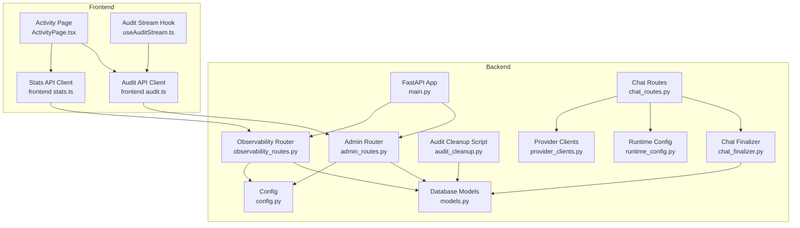
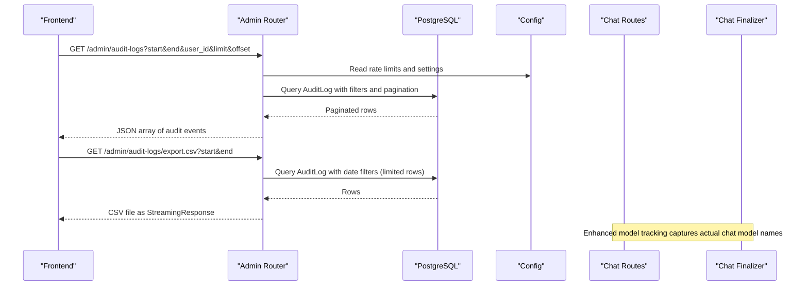
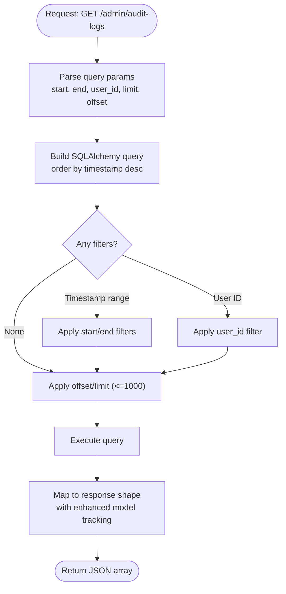
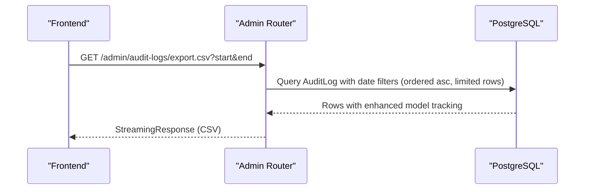
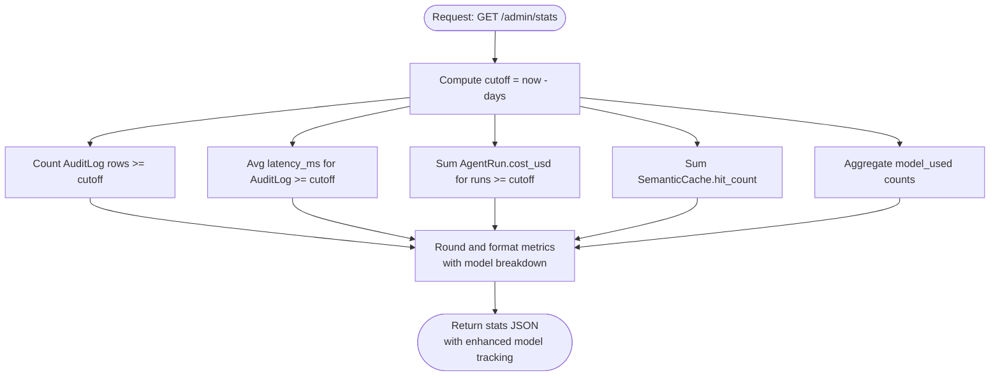
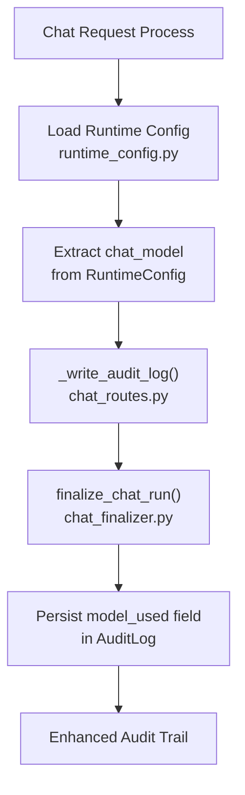
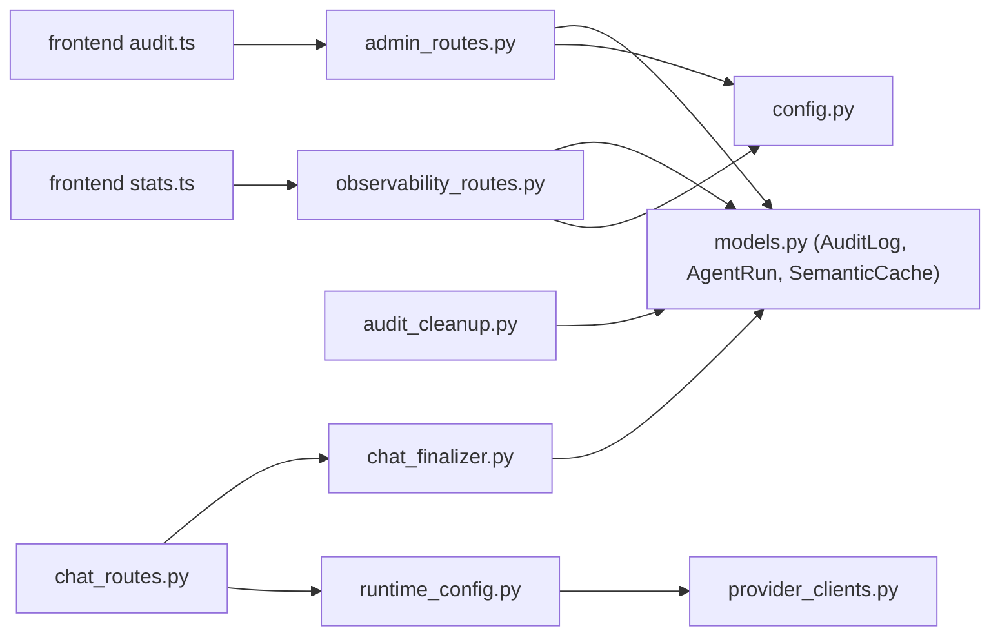
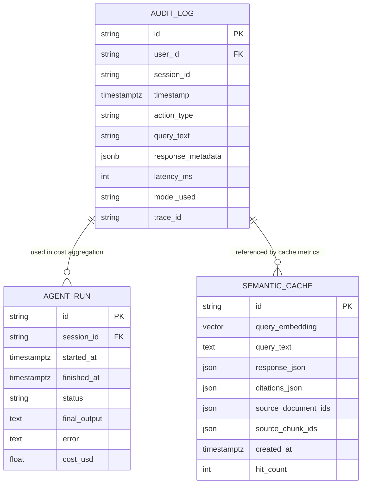
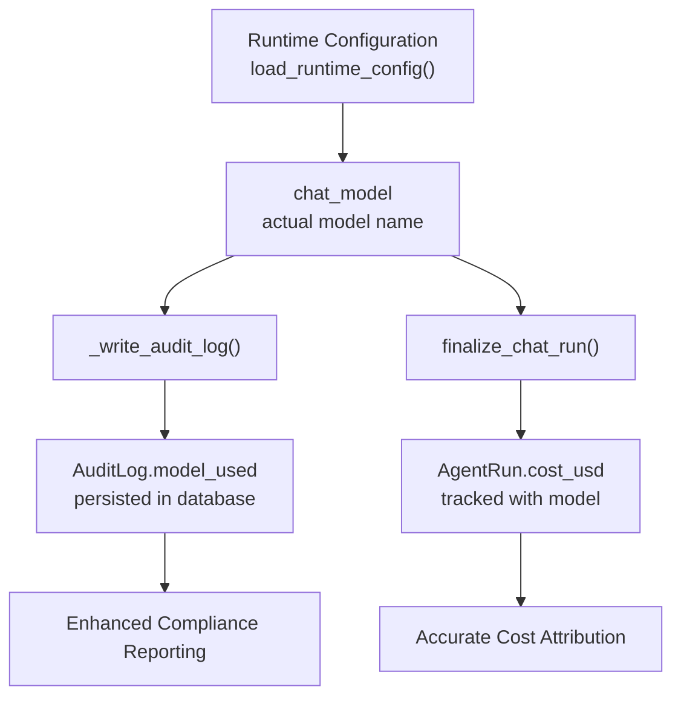

# Audit and Monitoring API

<cite>
**Referenced Files in This Document**
- [admin_routes.py](file://safe4ai-pilot/app/api/admin_routes.py)
- [observability_routes.py](file://safe4ai-pilot/app/api/observability_routes.py)
- [models.py](file://safe4ai-pilot/app/db/models.py)
- [audit.ts](file://safe4ai-pilot/frontend/src/api/audit.ts)
- [stats.ts](file://safe4ai-pilot/frontend/src/api/stats.ts)
- [ActivityPage.tsx](file://safe4ai-pilot/frontend/src/pages/admin/ActivityPage.tsx)
- [useAuditStream.ts](file://safe4ai-pilot/frontend/src/hooks/useAuditStream.ts)
- [audit_cleanup.py](file://safe4ai-pilot/scripts/audit_cleanup.py)
- [config.py](file://safe4ai-pilot/app/config.py)
- [main.py](file://safe4ai-pilot/app/main.py)
- [chat_routes.py](file://safe4ai-pilot/app/api/chat_routes.py)
- [chat_finalizer.py](file://safe4ai-pilot/app/services/chat_finalizer.py)
- [runtime_config.py](file://safe4ai-pilot/app/services/runtime_config.py)
- [provider_clients.py](file://safe4ai-pilot/app/services/provider_clients.py)
</cite>

## Update Summary
**Changes Made**
- Enhanced audit model tracking to use actual chat model names instead of provider types
- Updated audit log creation to capture precise model identification
- Improved statistics aggregation with accurate model name attribution
- Added comprehensive model name tracking across chat processing pipeline

## Table of Contents
1. [Introduction](#introduction)
2. [Project Structure](#project-structure)
3. [Core Components](#core-components)
4. [Architecture Overview](#architecture-overview)
5. [Detailed Component Analysis](#detailed-component-analysis)
6. [Dependency Analysis](#dependency-analysis)
7. [Performance Considerations](#performance-considerations)
8. [Troubleshooting Guide](#troubleshooting-guide)
9. [Conclusion](#conclusion)
10. [Appendices](#appendices)

## Introduction
This document provides comprehensive API documentation for audit logging and system monitoring endpoints designed for administrative oversight and compliance reporting. It covers:
- Audit log retrieval with filtering by timestamp range, user ID, and pagination controls (with a maximum limit of 1000 records per request)
- CSV export functionality for compliance reporting
- System statistics aggregation including query volume, average latency, cost tracking, and cache performance analytics
- Enhanced model tracking with accurate model name identification using actual chat model instead of provider type
- Practical examples for audit trail analysis, compliance reporting workflows, and system health monitoring
- Error handling guidance for invalid date ranges, export formatting, and performance optimization for large datasets

## Project Structure
The audit and monitoring APIs are implemented in the backend Python service and consumed by the React frontend. Key locations:
- Backend routers: admin and observability endpoints
- Database models: audit logs, agent runs, and semantic cache
- Frontend API clients: typed wrappers for audit and stats
- Cleanup and retention policies: automated archival and deletion
- Model tracking: enhanced with actual chat model name identification

**Diagram sources**
- [main.py:63-101](file://safe4ai-pilot/app/main.py#L63-L101)
- [admin_routes.py:43](file://safe4ai-pilot/app/api/admin_routes.py#L43)
- [observability_routes.py:16](file://safe4ai-pilot/app/api/observability_routes.py#L16)
- [models.py:118-144](file://safe4ai-pilot/app/db/models.py#L118-L144)
- [config.py:7-48](file://safe4ai-pilot/app/config.py#L7-L48)
- [audit_cleanup.py:35-83](file://safe4ai-pilot/scripts/audit_cleanup.py#L35-L83)
- [audit.ts:34-53](file://safe4ai-pilot/frontend/src/api/audit.ts#L34-L53)
- [stats.ts:20-30](file://safe4ai-pilot/frontend/src/api/stats.ts#L20-L30)
- [ActivityPage.tsx:32-51](file://safe4ai-pilot/frontend/src/pages/admin/ActivityPage.tsx#L32-L51)
- [useAuditStream.ts:5-15](file://safe4ai-pilot/frontend/src/hooks/useAuditStream.ts#L5-L15)
- [chat_routes.py:56-88](file://safe4ai-pilot/app/api/chat_routes.py#L56-L88)
- [chat_finalizer.py:14-71](file://safe4ai-pilot/app/services/chat_finalizer.py#L14-L71)
- [runtime_config.py:89-129](file://safe4ai-pilot/app/services/runtime_config.py#L89-L129)
- [provider_clients.py:52-240](file://safe4ai-pilot/app/services/provider_clients.py#L52-L240)

**Section sources**
- [main.py:63-101](file://safe4ai-pilot/app/main.py#L63-L101)
- [admin_routes.py:43](file://safe4ai-pilot/app/api/admin_routes.py#L43)
- [observability_routes.py:16](file://safe4ai-pilot/app/api/observability_routes.py#L16)
- [models.py:118-144](file://safe4ai-pilot/app/db/models.py#L118-L144)
- [config.py:7-48](file://safe4ai-pilot/app/config.py#L7-L48)
- [audit_cleanup.py:35-83](file://safe4ai-pilot/scripts/audit_cleanup.py#L35-L83)
- [audit.ts:34-53](file://safe4ai-pilot/frontend/src/api/audit.ts#L34-L53)
- [stats.ts:20-30](file://safe4ai-pilot/frontend/src/api/stats.ts#L20-L30)
- [ActivityPage.tsx:32-51](file://safe4ai-pilot/frontend/src/pages/admin/ActivityPage.tsx#L32-L51)
- [useAuditStream.ts:5-15](file://safe4ai-pilot/frontend/src/hooks/useAuditStream.ts#L5-L15)

## Core Components
- Audit log retrieval endpoint: GET /admin/audit-logs with filters and pagination
- CSV export endpoint: GET /admin/audit-logs/export.csv for compliance reporting
- Statistics endpoint: GET /admin/stats aggregates query volume, latency, cost, and cache hits
- Observability cost statistics: GET /admin/stats/cost for token-based cost tracking
- Enhanced model tracking: captures actual chat model names instead of provider types
- Frontend clients: typed wrappers for audit listing and CSV export, plus stats mapping

**Updated** Enhanced model tracking now uses actual chat model names for accurate audit trail analysis

**Section sources**
- [admin_routes.py:359-467](file://safe4ai-pilot/app/api/admin_routes.py#L359-L467)
- [observability_routes.py:48-56](file://safe4ai-pilot/app/api/observability_routes.py#L48-L56)
- [audit.ts:34-53](file://safe4ai-pilot/frontend/src/api/audit.ts#L34-L53)
- [stats.ts:20-30](file://safe4ai-pilot/frontend/src/api/stats.ts#L20-L30)
- [chat_routes.py:56-88](file://safe4ai-pilot/app/api/chat_routes.py#L56-L88)
- [chat_finalizer.py:14-71](file://safe4ai-pilot/app/services/chat_finalizer.py#L14-L71)

## Architecture Overview
The audit and monitoring endpoints are part of the admin and observability routers. They rely on SQLAlchemy ORM queries against PostgreSQL, with optional integration to external systems (e.g., Qdrant for vector operations). The frontend consumes these endpoints via typed API clients and displays real-time activity streams and statistics. Enhanced model tracking ensures accurate attribution of audit events to specific chat models.

**Diagram sources**
- [admin_routes.py:359-431](file://safe4ai-pilot/app/api/admin_routes.py#L359-L431)
- [config.py:7-48](file://safe4ai-pilot/app/config.py#L7-L48)
- [chat_routes.py:312-332](file://safe4ai-pilot/app/api/chat_routes.py#L312-L332)
- [chat_finalizer.py:14-71](file://safe4ai-pilot/app/services/chat_finalizer.py#L14-L71)

**Section sources**
- [admin_routes.py:359-431](file://safe4ai-pilot/app/api/admin_routes.py#L359-L431)
- [config.py:7-48](file://safe4ai-pilot/app/config.py#L7-L48)
- [chat_routes.py:312-332](file://safe4ai-pilot/app/api/chat_routes.py#L312-L332)
- [chat_finalizer.py:14-71](file://safe4ai-pilot/app/services/chat_finalizer.py#L14-L71)

## Detailed Component Analysis

### Audit Log Retrieval Endpoint
- Method and URL: GET /admin/audit-logs
- Purpose: Retrieve paginated audit events with optional filters
- Authentication and roles: Requires admin role
- Rate limiting: Applied via decorator
- Query parameters:
  - start: datetime (inclusive lower bound)
  - end: datetime (inclusive upper bound)
  - user_id: string (filter by user identifier)
  - limit: integer (default 100; capped at 1000)
  - offset: integer (default 0)
- Response: Array of audit event objects ordered by timestamp descending
- Filtering behavior:
  - Timestamp range filters applied when provided
  - User filter applied when provided
  - Pagination enforced with a maximum of 1000 records per request
- Enhanced model tracking: Now includes accurate model name identification
- Example request:
  - GET /admin/audit-logs?start=2024-01-01T00:00:00Z&end=2024-12-31T23:59:59Z&user_id=a1b2c3&limit=500&offset=0
- Example response fields:
  - id, user_id, session_id, timestamp, action_type, query_text, latency_ms, model_used, trace_id

**Diagram sources**
- [admin_routes.py:359-392](file://safe4ai-pilot/app/api/admin_routes.py#L359-L392)

**Section sources**
- [admin_routes.py:359-392](file://safe4ai-pilot/app/api/admin_routes.py#L359-L392)

### CSV Export Endpoint
- Method and URL: GET /admin/audit-logs/export.csv
- Purpose: Stream a CSV file containing audit events for a specified date range
- Authentication and roles: Requires admin role
- Rate limiting: Applied via decorator
- Query parameters:
  - start: datetime (optional)
  - end: datetime (optional)
- Behavior:
  - Orders by ascending timestamp
  - Limits rows to a fixed cap suitable for export
  - Streams CSV content as a file attachment
  - Includes enhanced model name tracking in export
- Example request:
  - GET /admin/audit-logs/export.csv?start=2024-01-01T00:00:00Z&end=2024-12-31T23:59:59Z
- Example response:
  - Content-Type: text/csv
  - Content-Disposition: attachment; filename="audit_logs_YYYYMMDD.csv"
  - Body: CSV rows with headers id, user_id, session_id, timestamp, action_type, query_text, latency_ms, model_used, trace_id

**Diagram sources**
- [admin_routes.py:395-431](file://safe4ai-pilot/app/api/admin_routes.py#L395-L431)

**Section sources**
- [admin_routes.py:395-431](file://safe4ai-pilot/app/api/admin_routes.py#L395-L431)

### Statistics Endpoint
- Method and URL: GET /admin/stats
- Purpose: Aggregate system statistics for a given window
- Authentication and roles: Requires admin role
- Rate limiting: Applied via decorator
- Query parameters:
  - days: integer (default 30)
- Metrics included:
  - total_queries: count of audit log entries within the window
  - avg_latency_ms: average latency in milliseconds (rounded)
  - total_cost_usd: sum of agent run costs within the window
  - cache_total_hits: total semantic cache hit count
  - model_breakdown: enhanced model name breakdown for compliance reporting
- Enhanced model tracking: Provides detailed model usage analytics
- Example request:
  - GET /admin/stats?days=30
- Example response fields:
  - days, total_queries, avg_latency_ms, total_cost_usd, cache_total_hits, model_breakdown

**Diagram sources**
- [admin_routes.py:439-467](file://safe4ai-pilot/app/api/admin_routes.py#L439-L467)

**Section sources**
- [admin_routes.py:439-467](file://safe4ai-pilot/app/api/admin_routes.py#L439-L467)

### Observability Cost Statistics Endpoint
- Method and URL: GET /admin/stats/cost
- Purpose: Token-based cost statistics using a configured cost per 1K tokens
- Authentication and roles: Requires admin role
- Rate limiting: Applied via decorator
- Query parameters:
  - days: integer (default 30)
- Behavior:
  - Delegates to a cost tracker utility to compute totals and averages
  - Includes enhanced model name tracking for cost attribution
- Example request:
  - GET /admin/stats/cost?days=30

**Section sources**
- [observability_routes.py:48-56](file://safe4ai-pilot/app/api/observability_routes.py#L48-L56)

### Enhanced Model Tracking Implementation
**Updated** The audit system now captures accurate model names instead of generic provider types

The enhanced model tracking system ensures precise attribution of audit events to specific chat models:

- **Chat Routes**: Captures runtime chat model configuration for audit logging
- **Chat Finalizer**: Persists model name in single transaction with audit log and cost tracking
- **Runtime Configuration**: Loads actual model names from persistent configuration
- **Provider Clients**: Supports both Ollama and OpenAI-compatible providers with accurate model identification

**Diagram sources**
- [chat_routes.py:312-332](file://safe4ai-pilot/app/api/chat_routes.py#L312-L332)
- [chat_finalizer.py:14-71](file://safe4ai-pilot/app/services/chat_finalizer.py#L14-L71)
- [runtime_config.py:89-129](file://safe4ai-pilot/app/services/runtime_config.py#L89-L129)

**Section sources**
- [chat_routes.py:56-88](file://safe4ai-pilot/app/api/chat_routes.py#L56-L88)
- [chat_routes.py:312-332](file://safe4ai-pilot/app/api/chat_routes.py#L312-L332)
- [chat_finalizer.py:14-71](file://safe4ai-pilot/app/services/chat_finalizer.py#L14-L71)
- [runtime_config.py:89-129](file://safe4ai-pilot/app/services/runtime_config.py#L89-L129)
- [provider_clients.py:52-240](file://safe4ai-pilot/app/services/provider_clients.py#L52-L240)

### Frontend Integration Examples
- Audit listing:
  - Uses a typed client to fetch paginated events with optional start filter
  - Implements a hook to poll updates at intervals
  - Displays enhanced model name information in audit events
- CSV export:
  - Initiates a download of the exported CSV file with model tracking
- Stats mapping:
  - Transforms backend stats to a normalized frontend shape
  - Includes model breakdown data for compliance reporting

**Section sources**
- [audit.ts:34-53](file://safe4ai-pilot/frontend/src/api/audit.ts#L34-L53)
- [stats.ts:20-30](file://safe4ai-pilot/frontend/src/api/stats.ts#L20-L30)
- [ActivityPage.tsx:32-51](file://safe4ai-pilot/frontend/src/pages/admin/ActivityPage.tsx#L32-L51)
- [useAuditStream.ts:5-15](file://safe4ai-pilot/frontend/src/hooks/useAuditStream.ts#L5-L15)

## Dependency Analysis
- Backend routers depend on:
  - SQLAlchemy ORM models for AuditLog, AgentRun, and SemanticCache
  - Config settings for rate limits and retention
  - Rate limiter decorator for endpoint protection
  - Enhanced model tracking through runtime configuration
- Frontend clients depend on:
  - Backend endpoints for audit listing and CSV export
  - Stats endpoint for system metrics with model breakdown
- Cleanup and retention:
  - Automated deletion of stale audit logs and cache entries
  - Audit summary log written during cleanup
- Model tracking dependencies:
  - Runtime configuration loading for actual model names
  - Provider client abstraction for different model types

**Diagram sources**
- [admin_routes.py:24-41](file://safe4ai-pilot/app/api/admin_routes.py#L24-L41)
- [observability_routes.py:13-14](file://safe4ai-pilot/app/api/observability_routes.py#L13-L14)
- [models.py:118-144](file://safe4ai-pilot/app/db/models.py#L118-L144)
- [config.py:7-48](file://safe4ai-pilot/app/config.py#L7-L48)
- [audit.ts:1-1](file://safe4ai-pilot/frontend/src/api/audit.ts#L1-L1)
- [stats.ts:1-1](file://safe4ai-pilot/frontend/src/api/stats.ts#L1-L1)
- [audit_cleanup.py:25-27](file://safe4ai-pilot/scripts/audit_cleanup.py#L25-L27)
- [chat_routes.py:56-88](file://safe4ai-pilot/app/api/chat_routes.py#L56-L88)
- [chat_finalizer.py:14-71](file://safe4ai-pilot/app/services/chat_finalizer.py#L14-L71)
- [runtime_config.py:89-129](file://safe4ai-pilot/app/services/runtime_config.py#L89-L129)
- [provider_clients.py:52-240](file://safe4ai-pilot/app/services/provider_clients.py#L52-L240)

**Section sources**
- [admin_routes.py:24-41](file://safe4ai-pilot/app/api/admin_routes.py#L24-L41)
- [observability_routes.py:13-14](file://safe4ai-pilot/app/api/observability_routes.py#L13-L14)
- [models.py:118-144](file://safe4ai-pilot/app/db/models.py#L118-L144)
- [config.py:7-48](file://safe4ai-pilot/app/config.py#L7-L48)
- [audit.ts:1-1](file://safe4ai-pilot/frontend/src/api/audit.ts#L1-L1)
- [stats.ts:1-1](file://safe4ai-pilot/frontend/src/api/stats.ts#L1-L1)
- [audit_cleanup.py:25-27](file://safe4ai-pilot/scripts/audit_cleanup.py#L25-L27)
- [chat_routes.py:56-88](file://safe4ai-pilot/app/api/chat_routes.py#L56-L88)
- [chat_finalizer.py:14-71](file://safe4ai-pilot/app/services/chat_finalizer.py#L14-L71)
- [runtime_config.py:89-129](file://safe4ai-pilot/app/services/runtime_config.py#L89-L129)
- [provider_clients.py:52-240](file://safe4ai-pilot/app/services/provider_clients.py#L52-L240)

## Performance Considerations
- Pagination limit: The audit retrieval endpoint caps the limit at 1000 records per request to prevent excessive loads.
- Sorting and indexing: Results are sorted by timestamp descending; timestamps are indexed in the database model to support efficient filtering and ordering.
- Export size limits: The CSV export endpoint limits the number of rows returned to a reasonable cap for streaming performance.
- Retention and cleanup: Automated cleanup removes old audit logs and cache entries, reducing long-term query load and storage overhead.
- Rate limiting: Decorators apply rate limits to protect endpoints from abuse.
- Enhanced model tracking: Efficient model name storage and indexing for accurate audit trail analysis without performance degradation.

[No sources needed since this section provides general guidance]

## Troubleshooting Guide
Common issues and resolutions:
- Invalid date range:
  - Ensure start and end parameters are valid ISO 8601 timestamps and that start ≤ end.
  - The backend applies inclusive bounds; incorrect ordering may yield empty results.
- Excessive pagination:
  - The limit parameter is capped at 1000; requests exceeding this will be reduced automatically.
  - Use offset to navigate through pages and avoid requesting very large offsets.
- CSV export failures:
  - Verify date range parameters and confirm the export endpoint returns a CSV file with appropriate headers.
  - Large date ranges may still be subject to internal row limits for export.
- Missing or stale data:
  - Confirm retention settings and cleanup schedules; old events may be archived or deleted according to policy.
- Cost statistics:
  - Ensure cost tracking is enabled and cost_per_1k_tokens is configured appropriately.
- Enhanced model tracking issues:
  - Verify runtime configuration loads correct chat_model values from persistent settings.
  - Check provider client configuration for accurate model name resolution.
  - Ensure chat finalizer receives and persists model names correctly.

**Section sources**
- [admin_routes.py:378](file://safe4ai-pilot/app/api/admin_routes.py#L378)
- [admin_routes.py:409](file://safe4ai-pilot/app/api/admin_routes.py#L409)
- [config.py:16-19](file://safe4ai-pilot/app/config.py#L16-L19)
- [audit_cleanup.py:35-83](file://safe4ai-pilot/scripts/audit_cleanup.py#L35-L83)
- [chat_routes.py:312-332](file://safe4ai-pilot/app/api/chat_routes.py#L312-L332)
- [chat_finalizer.py:14-71](file://safe4ai-pilot/app/services/chat_finalizer.py#L14-L71)

## Conclusion
The audit and monitoring API suite provides robust administrative oversight with enhanced model tracking capabilities:
- Flexible audit log retrieval and CSV export for compliance reporting with accurate model attribution
- Comprehensive statistics for query volume, latency, cost, and cache performance with model breakdown
- Enhanced model tracking using actual chat model names instead of generic provider types
- Strong defaults for performance and safety, including pagination caps, retention policies, and rate limiting

These capabilities enable effective audit trail analysis, compliance workflows, and system health monitoring with precise model identification for regulatory compliance and cost allocation.

[No sources needed since this section summarizes without analyzing specific files]

## Appendices

### API Reference Summary

- GET /admin/audit-logs
  - Filters: start, end, user_id
  - Pagination: limit (≤1000), offset
  - Response: Array of audit events with enhanced model tracking
  - Example: GET /admin/audit-logs?start=2024-01-01T00:00:00Z&end=2024-12-31T23:59:59Z&user_id=a1b2c3&limit=500&offset=0

- GET /admin/audit-logs/export.csv
  - Filters: start, end
  - Response: CSV file attachment with model tracking
  - Example: GET /admin/audit-logs/export.csv?start=2024-01-01T00:00:00Z&end=2024-12-31T23:59:59Z

- GET /admin/stats
  - Parameter: days (default 30)
  - Metrics: total_queries, avg_latency_ms, total_cost_usd, cache_total_hits, model_breakdown
  - Example: GET /admin/stats?days=30

- GET /admin/stats/cost
  - Parameter: days (default 30)
  - Metrics: token-based cost statistics with model attribution
  - Example: GET /admin/stats/cost?days=30

**Section sources**
- [admin_routes.py:359-467](file://safe4ai-pilot/app/api/admin_routes.py#L359-L467)
- [observability_routes.py:48-56](file://safe4ai-pilot/app/api/observability_routes.py#L48-L56)

### Data Model Overview (Audit and Related Entities)

**Diagram sources**
- [models.py:118-144](file://safe4ai-pilot/app/db/models.py#L118-L144)

### Enhanced Model Tracking Architecture

**Diagram sources**
- [runtime_config.py:89-129](file://safe4ai-pilot/app/services/runtime_config.py#L89-L129)
- [chat_routes.py:56-88](file://safe4ai-pilot/app/api/chat_routes.py#L56-L88)
- [chat_finalizer.py:14-71](file://safe4ai-pilot/app/services/chat_finalizer.py#L14-L71)

**Section sources**
- [runtime_config.py:89-129](file://safe4ai-pilot/app/services/runtime_config.py#L89-L129)
- [chat_routes.py:56-88](file://safe4ai-pilot/app/api/chat_routes.py#L56-L88)
- [chat_finalizer.py:14-71](file://safe4ai-pilot/app/services/chat_finalizer.py#L14-L71)