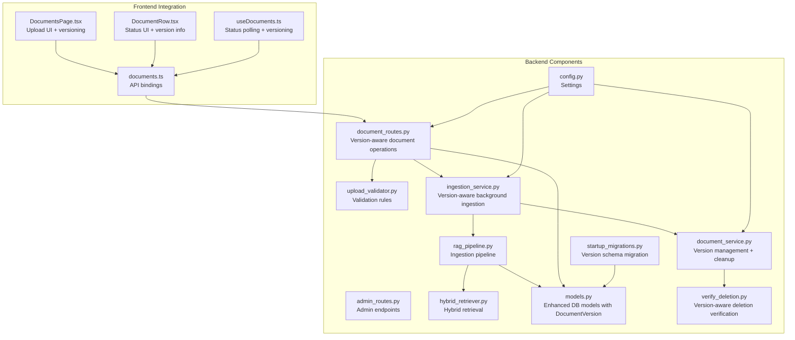
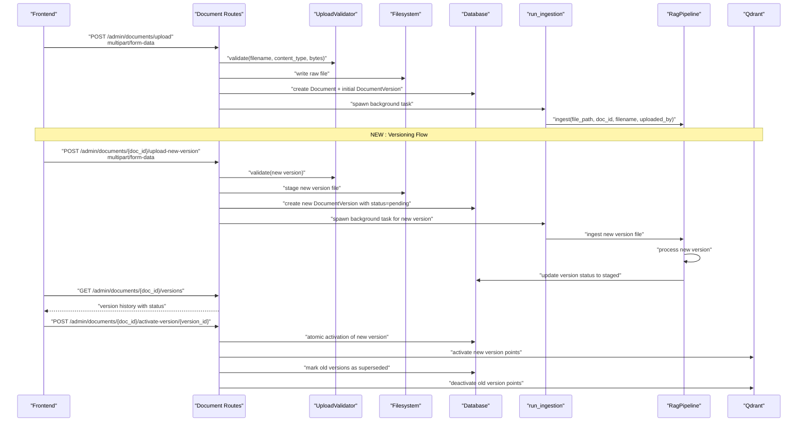
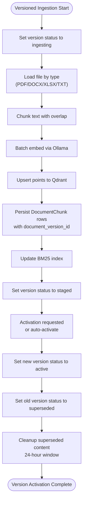
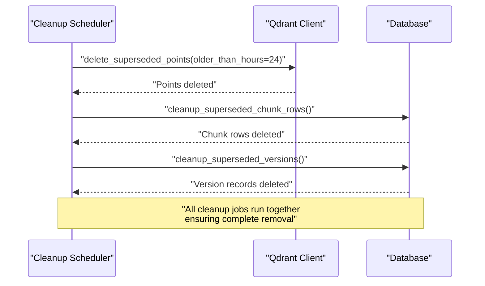
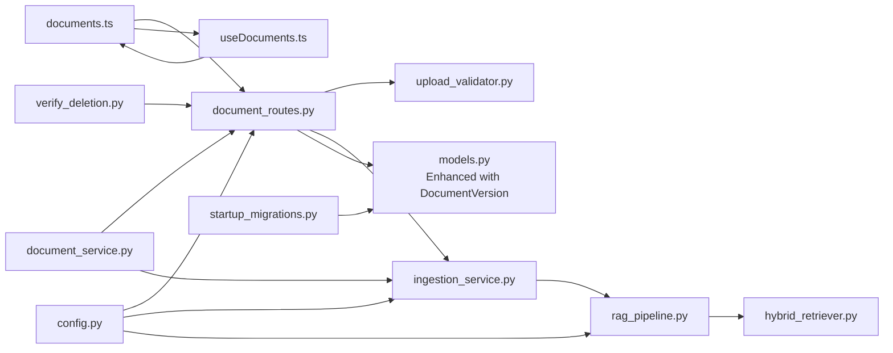

# Document Management API

<cite>
**Referenced Files in This Document**
- [admin_routes.py](file://safe4ai-pilot/app/api/admin_routes.py)
- [document_routes.py](file://safe4ai-pilot/app/api/document_routes.py)
- [upload_validator.py](file://safe4ai-pilot/app/security/upload_validator.py)
- [ingestion_service.py](file://safe4ai-pilot/app/services/ingestion_service.py)
- [rag_pipeline.py](file://safe4ai-pilot/app/services/rag_pipeline.py)
- [hybrid_retriever.py](file://safe4ai-pilot/app/components/hybrid_retriever.py)
- [models.py](file://safe4ai-pilot/app/db/models.py)
- [config.py](file://safe4ai-pilot/app/config.py)
- [documents.ts](file://safe4ai-pilot/frontend/src/api/documents.ts)
- [DocumentsPage.tsx](file://safe4ai-pilot/frontend/src/pages/admin/DocumentsPage.tsx)
- [DocumentRow.tsx](file://safe4ai-pilot/frontend/src/components/admin/DocumentRow.tsx)
- [useDocuments.ts](file://safe4ai-pilot/frontend/src/hooks/useDocuments.ts)
- [test_admin.py](file://safe4ai-pilot/tests/test_admin.py)
- [test_document_versioning.py](file://safe4ai-pilot/tests/test_document_versioning.py)
- [document_service.py](file://safe4ai-pilot/app/services/document_service.py)
- [verify_deletion.py](file://safe4ai-pilot/scripts/verify_deletion.py)
- [audit-log-reference.md](file://safe4ai-pilot/docs/security-pack/audit-log-reference.md)
- [startup_migrations.py](file://safe4ai-pilot/app/startup_migrations.py)
</cite>

## Update Summary
**Changes Made**
- Added comprehensive documentation for the new DocumentVersion model and versioning system
- Updated all document-related endpoints to reflect version-aware operations
- Added detailed coverage of staged replacement capabilities and atomic version switching
- Enhanced deletion verification with version-specific cleanup procedures
- Updated transaction safety documentation to include versioning considerations
- Added new sections covering version metadata management and cleanup processes

## Table of Contents
1. [Introduction](#introduction)
2. [Project Structure](#project-structure)
3. [Core Components](#core-components)
4. [Architecture Overview](#architecture-overview)
5. [Detailed Component Analysis](#detailed-component-analysis)
6. [Document Versioning System](#document-versioning-system)
7. [Staged Replacement and Atomic Activation](#staged-replacement-and-atomic-activation)
8. [Version Metadata Management](#version-metadata-management)
9. [Superseded Version Cleanup](#superseded-version-cleanup)
10. [Transaction Safety with Versioning](#transaction-safety-with-versioning)
11. [Dependency Analysis](#dependency-analysis)
12. [Performance Considerations](#performance-considerations)
13. [Troubleshooting Guide](#troubleshooting-guide)
14. [Conclusion](#conclusion)
15. [Appendices](#appendices)

## Introduction
This document provides comprehensive API documentation for administrative document management operations with advanced versioning capabilities. The system now includes a complete document versioning framework with the DocumentVersion model, staged replacement mechanisms, atomic version switching, and comprehensive cleanup procedures for superseded content. Administrators can manage document lifecycles with zero-downtime updates, 24-hour rollback windows, and automated cleanup processes.

## Project Structure
The document management API has been enhanced with versioning support across all major components:

**Diagram sources**
- [admin_routes.py:67-256](file://safe4ai-pilot/app/api/admin_routes.py#L67-L256)
- [document_routes.py:514-607](file://safe4ai-pilot/app/api/document_routes.py#L514-L607)
- [upload_validator.py:24-73](file://safe4ai-pilot/app/security/upload_validator.py#L24-L73)
- [ingestion_service.py:21-88](file://safe4ai-pilot/app/services/ingestion_service.py#L21-L88)
- [rag_pipeline.py:34-150](file://safe4ai-pilot/app/services/rag_pipeline.py#L34-L150)
- [hybrid_retriever.py:14-145](file://safe4ai-pilot/app/components/hybrid_retriever.py#L14-L145)
- [models.py:75-167](file://safe4ai-pilot/app/db/models.py#L75-L167)
- [config.py:7-48](file://safe4ai-pilot/app/config.py#L7-L48)
- [document_service.py:44-134](file://safe4ai-pilot/app/services/document_service.py#L44-L134)
- [verify_deletion.py:82-119](file://safe4ai-pilot/scripts/verify_deletion.py#L82-L119)
- [startup_migrations.py:43-218](file://safe4ai-pilot/app/startup_migrations.py#L43-L218)
- [documents.ts:43-67](file://safe4ai-pilot/frontend/src/api/documents.ts#L43-L67)
- [DocumentsPage.tsx:17-69](file://safe4ai-pilot/frontend/src/pages/admin/DocumentsPage.tsx#L17-L69)
- [DocumentRow.tsx:30-97](file://safe4ai-pilot/frontend/src/components/admin/DocumentRow.tsx#L30-L97)
- [useDocuments.ts:1-66](file://safe4ai-pilot/frontend/src/hooks/useDocuments.ts#L1-L66)

**Section sources**
- [admin_routes.py:67-256](file://safe4ai-pilot/app/api/admin_routes.py#L67-L256)
- [document_routes.py:514-607](file://safe4ai-pilot/app/api/document_routes.py#L514-L607)
- [config.py:7-48](file://safe4ai-pilot/app/config.py#L7-L48)
- [startup_migrations.py:43-218](file://safe4ai-pilot/app/startup_migrations.py#L43-L218)

## Core Components
The document management system now operates with comprehensive versioning support:

### Enhanced Document Model
- **DocumentVersion model**: New table `document_versions` with unique constraints on (document_id, version_number)
- **Version tracking fields**: active_version, pending_version, version metadata columns
- **Status management**: DocumentVersionStatus enum with pending, ingesting, staged, active, superseded, failed states
- **Cascade relationships**: Proper foreign key constraints with ON DELETE CASCADE for version cleanup

### Version-Aware Endpoints
- **Upload New Version**: POST `/admin/documents/{doc_id}/upload-new-version` with staged replacement
- **Version Status**: GET `/admin/documents/{doc_id}/versions` for version history
- **Version Activation**: POST `/admin/documents/{doc_id}/activate-version/{version_id}` for manual activation
- **Enhanced Deletion**: DELETE `/admin/documents/{doc_id}` with version-aware cleanup
- **Version Verification**: GET `/admin/documents/{doc_id}/verify-deletion` with comprehensive cleanup verification

### Staged Replacement System
- **Non-disruptive uploads**: New versions staged separately from active content
- **Atomic activation**: Zero-downtime version switching with brief overlap window
- **Rollback capability**: 24-hour window for version rollback
- **Cleanup automation**: Automated removal of superseded versions after 24 hours

**Section sources**
- [models.py:132-166](file://safe4ai-pilot/app/db/models.py#L132-L166)
- [document_routes.py:634-650](file://safe4ai-pilot/app/api/document_routes.py#L634-L650)
- [document_service.py:96-134](file://safe4ai-pilot/app/services/document_service.py#L96-L134)
- [startup_migrations.py:43-218](file://safe4ai-pilot/app/startup_migrations.py#L43-L218)

## Architecture Overview
The enhanced document lifecycle now includes sophisticated versioning with staged replacement and atomic activation:

**Diagram sources**
- [admin_routes.py:67-121](file://safe4ai-pilot/app/api/admin_routes.py#L67-L121)
- [document_routes.py:634-650](file://safe4ai-pilot/app/api/document_routes.py#L634-L650)
- [document_routes.py:609-710](file://safe4ai-pilot/app/api/document_routes.py#L609-L710)
- [upload_validator.py:24-73](file://safe4ai-pilot/app/security/upload_validator.py#L24-L73)
- [ingestion_service.py:21-88](file://safe4ai-pilot/app/services/ingestion_service.py#L21-L88)
- [rag_pipeline.py:62-150](file://safe4ai-pilot/app/services/rag_pipeline.py#L62-L150)

## Detailed Component Analysis

### Upload Endpoint
- **Method**: POST
- **URL**: `/admin/documents/upload`
- **Authentication**: Requires admin role
- **Request**: multipart/form-data with field "file"
- **Response**: 201 Created with JSON containing doc_id and job_id
- **Enhanced**: Creates initial DocumentVersion with version_number=1 and status=active
- **Validation**: Same as before with UploadValidator

**Section sources**
- [admin_routes.py:67-121](file://safe4ai-pilot/app/api/admin_routes.py#L67-L121)
- [upload_validator.py:24-73](file://safe4ai-pilot/app/security/upload_validator.py#L24-L73)
- [config.py:20](file://safe4ai-pilot/app/config.py#L20)

### Upload New Version Endpoint
**New**: Staged document versioning with atomic replacement capabilities

- **Method**: POST
- **URL**: `/admin/documents/{doc_id}/upload-new-version`
- **Authentication**: Requires admin role
- **Request**: multipart/form-data with field "file"
- **Response**: 202 Accepted with JSON containing new version information
- **Behavior**:
  - Validates new file against UploadValidator
  - Creates new DocumentVersion with incremented version_number
  - Sets status to DocumentVersionStatus.pending
  - Stages file without affecting active content
  - Returns immediately with staging confirmation
- **Safety**: Prevents new version upload if active ingestion job exists

**Section sources**
- [document_routes.py:634-650](file://safe4ai-pilot/app/api/document_routes.py#L634-L650)
- [test_document_versioning.py:344-396](file://safe4ai-pilot/tests/test_document_versioning.py#L344-L396)

### List Documents Endpoint
- **Method**: GET
- **URL**: `/admin/documents`
- **Response**: Array of document summaries with version information and ingestion_status

**Section sources**
- [admin_routes.py:123-154](file://safe4ai-pilot/app/api/admin_routes.py#L123-L154)

### Get Document Status Endpoint
- **Method**: GET
- **URL**: `/admin/documents/{doc_id}/status`
- **Response**: ingestion_status, job_status, job_error, ingestion_started_at
- **Enhanced**: Includes version information in status response

**Section sources**
- [admin_routes.py:157-181](file://safe4ai-pilot/app/api/admin_routes.py#L157-L181)

### Get Document Versions Endpoint
**New**: Comprehensive version history and status information

- **Method**: GET
- **URL**: `/admin/documents/{doc_id}/versions`
- **Authentication**: Requires admin role
- **Response**: Array of DocumentVersion objects with complete metadata
- **Includes**: version_number, status, filename, storage_filename, file_type, file_size_bytes, checksum
- **Status tracking**: Creation timestamps, ingestion timestamps, activation timestamps

**Section sources**
- [document_routes.py:609-710](file://safe4ai-pilot/app/api/document_routes.py#L609-L710)
- [test_document_versioning.py:312-344](file://safe4ai-pilot/tests/test_document_versioning.py#L312-L344)

### Activate Version Endpoint
**New**: Manual version activation for staged replacements

- **Method**: POST
- **URL**: `/admin/documents/{doc_id}/activate-version/{version_id}`
- **Authentication**: Requires admin role
- **Response**: 200 OK with activation confirmation
- **Process**: 
  - Atomic activation of specified version
  - Marks old versions as superseded
  - Updates active_version reference
  - Triggers cleanup of superseded content

**Section sources**
- [document_routes.py:609-710](file://safe4ai-pilot/app/api/document_routes.py#L609-L710)

### Delete Document Endpoint
**Enhanced**: Version-aware deletion with comprehensive cleanup

- **Method**: DELETE
- **URL**: `/admin/documents/{doc_id}`
- **Enhanced Behavior**:
  - **Active Job Checking**: Verifies active ingestion jobs including pending versions
  - **Version Cleanup**: Removes all DocumentVersion records for the document
  - **Atomic Deletion**: Uses database transaction rollback on errors
  - **Complete Cleanup**: Cancels tasks → invalidates cache → deletes DB records → removes raw files → deletes Qdrant points → prunes BM25 index
  - **Version Safety**: Ensures superseded versions are properly cleaned up

**Section sources**
- [document_routes.py:285-339](file://safe4ai-pilot/app/api/document_routes.py#L285-L339)
- [test_admin.py:293-312](file://safe4ai-pilot/tests/test_admin.py#L293-L312)

### Verify Deletion Endpoint
**Enhanced**: Comprehensive deletion verification with version awareness

- **Method**: GET
- **URL**: `/admin/documents/{doc_id}/verify-deletion`
- **Authentication**: Requires admin role
- **Response**: JSON object with clean flag and counts for each storage layer
- **Enhanced Verification**:
  - Qdrant vectors count (doc_id filter)
  - Database chunk rows count (including versioned chunks)
  - Ingestion jobs count (including version-specific jobs)
  - Semantic cache entries count
  - In-memory BM25 entries count
  - **New**: DocumentVersions count verification

**Section sources**
- [document_routes.py:754-780](file://safe4ai-pilot/app/api/document_routes.py#L754-L780)
- [audit-log-reference.md:81-88](file://safe4ai-pilot/docs/security-pack/audit-log-reference.md#L81-L88)

### Reindex Document Endpoint
- **Method**: POST
- **URL**: `/admin/documents/{doc_id}/reindex`
- **Behavior**:
  - Validates existence of raw file; returns 409 if missing
  - Creates new IngestionJob, resets Document ingestion_status to queued
  - Spawns background ingestion task
- **Enhanced**: Supports reindexing of specific document versions

**Section sources**
- [admin_routes.py:224-256](file://safe4ai-pilot/app/api/admin_routes.py#L224-L256)

### Upload Validation Process
Validation performed by UploadValidator:
- **Allowed extensions**: .pdf, .docx, .xlsx, .txt
- **Allowed MIME types**: application/pdf, application/vnd.openxmlformats-officedocument.wordprocessingml.document, application/vnd.openxmlformats-officedocument.spreadsheetml.sheet, text/plain
- **Magic-byte detection**: python-magic library
- **Size enforcement**: max_upload_size_mb configuration

**Section sources**
- [upload_validator.py:13-21](file://safe4ai-pilot/app/security/upload_validator.py#L13-L21)
- [upload_validator.py:24-73](file://safe4ai-pilot/app/security/upload_validator.py#L24-L73)
- [config.py:20](file://safe4ai-pilot/app/config.py#L20)

### Background Ingestion and Lifecycle
**Enhanced**: Version-aware ingestion with proper status management

- **run_ingestion**: Updates job/document statuses, orchestrates RagPipeline, handles exceptions
- **RagPipeline**: Loads content by type, chunks text, embeds via Ollama, upserts Qdrant, persists chunks, updates BM25 index
- **Version Status Flow**: pending → ingesting → staged → active (or failed)
- **HybridRetriever**: Supports hybrid dense/sparse retrieval and RRF fusion
- **Stuck jobs**: Auto-recovery after threshold window

**Diagram sources**
- [ingestion_service.py:21-88](file://safe4ai-pilot/app/services/ingestion_service.py#L21-L88)
- [rag_pipeline.py:62-150](file://safe4ai-pilot/app/services/rag_pipeline.py#L62-L150)
- [hybrid_retriever.py:30-145](file://safe4ai-pilot/app/components/hybrid_retriever.py#L30-L145)
- [document_service.py:96-134](file://safe4ai-pilot/app/services/document_service.py#L96-L134)

**Section sources**
- [ingestion_service.py:21-88](file://safe4ai-pilot/app/services/ingestion_service.py#L21-L88)
- [rag_pipeline.py:62-150](file://safe4ai-pilot/app/services/rag_pipeline.py#L62-L150)
- [hybrid_retriever.py:30-145](file://safe4ai-pilot/app/components/hybrid_retriever.py#L30-L145)

### Vector Store Synchronization (Qdrant)
**Enhanced**: Version-aware Qdrant integration

- **Collection name**: documents
- **Version tracking**: Points include document_version_id payload field
- **Status filtering**: is_active payload and superseded_at timestamps
- **Deletion**: Removes all points for a doc_id filter (all versions)
- **Retrieval**: Hybrid dense/sparse ranking with RRF fusion
- **Activation**: Atomic switch between active and superseded versions

**Section sources**
- [admin_routes.py:274-290](file://safe4ai-pilot/app/api/admin_routes.py#L274-L290)
- [rag_pipeline.py:109-149](file://safe4ai-pilot/app/services/rag_pipeline.py#L109-L149)
- [hybrid_retriever.py:67-144](file://safe4ai-pilot/app/components/hybrid_retriever.py#L67-L144)

### Administrative Oversight and Bulk Operations
**Enhanced**: Version-aware administrative capabilities

- **Bulk upload**: Supported via frontend multiple-file selection
- **Status polling**: GET `/admin/documents/{doc_id}/status`
- **Reindexing**: POST `/admin/documents/{doc_id}/reindex`
- **Deletion**: DELETE `/admin/documents/{doc_id}`
- **Listing**: GET `/admin/documents`
- **New**: Upload new version: POST `/admin/documents/{doc_id}/upload-new-version`
- **New**: Verify deletion: GET `/admin/documents/{doc_id}/verify-deletion`
- **New**: Get versions: GET `/admin/documents/{doc_id}/versions`
- **New**: Activate version: POST `/admin/documents/{doc_id}/activate-version/{version_id}`

**Section sources**
- [DocumentsPage.tsx:26-31](file://safe4ai-pilot/frontend/src/pages/admin/DocumentsPage.tsx#L26-L31)
- [admin_routes.py:123-181](file://safe4ai-pilot/app/api/admin_routes.py#L123-L181)
- [admin_routes.py:224-256](file://safe4ai-pilot/app/api/admin_routes.py#L224-L256)
- [admin_routes.py:184-222](file://safe4ai-pilot/app/api/admin_routes.py#L184-L222)
- [document_routes.py:634-780](file://safe4ai-pilot/app/api/document_routes.py#L634-L780)

## Document Versioning System
**New Section**: Comprehensive document versioning framework with DocumentVersion model.

### DocumentVersion Model
The DocumentVersion model provides complete version tracking for documents:

- **Primary Key**: id (String) - unique identifier for each version
- **Foreign Key**: document_id (String) - links to parent document with CASCADE delete
- **Version Number**: version_number (Integer) - sequential version numbering with unique constraint
- **Metadata Fields**: filename, storage_filename, file_type, file_size_bytes, checksum
- **Status Tracking**: status (DocumentVersionStatus enum) with complete lifecycle
- **Timestamps**: created_at, ingestion_started_at, ingested_at, activated_at, failed_at
- **Audit Trail**: created_by (User relationship) for version ownership tracking

### Version Status Lifecycle
Document versions progress through distinct states:

1. **pending**: Initial staging after upload-new-version
2. **ingesting**: During background ingestion processing
3. **staged**: Successfully processed but not yet active
4. **active**: Currently serving content (only one active per document)
5. **superseded**: Replaced by newer version (remains accessible for 24 hours)
6. **failed**: Processing failed with error details

### Database Schema Enhancements
The startup_migrations.py script ensures proper schema evolution:

- **Documents table additions**: file_size_bytes, version, active_version, active_version_id, title, pending_version, and pending_* metadata fields
- **Foreign key constraints**: document_chunks_document_version_id_fkey and ingestion_jobs_document_version_id_fkey
- **Unique constraints**: uq_document_versions_document_id_version_number for version uniqueness
- **Cascade relationships**: Proper ON DELETE CASCADE for version cleanup

**Section sources**
- [models.py:132-166](file://safe4ai-pilot/app/db/models.py#L132-L166)
- [models.py:45:45](file://safe4ai-pilot/app/db/models.py#L45-L45)
- [startup_migrations.py:43-218](file://safe4ai-pilot/app/startup_migrations.py#L43-L218)

## Staged Replacement and Atomic Activation
**New Section**: Advanced staged replacement mechanism with atomic version switching.

### Staged Versioning Process
The system implements non-disruptive version replacement:

1. **Staging Phase**: New version uploaded and staged with status=pending
2. **Independent Processing**: Staged version processes independently from active content
3. **Status Isolation**: Staged version doesn't affect active document until activation
4. **Immediate Response**: Upload-new-version returns 202 Accepted immediately after staging

### Atomic Activation Mechanism
When activating a new version, the system performs atomic switching:

1. **Activation Trigger**: POST to activate-version/{version_id} or automatic activation
2. **New Version Activation**: Set is_active=True for new version points
3. **Old Version Superseding**: Set is_active=False and add superseded_at timestamp for old version points
4. **Brief Overlap Window**: Temporary overlap ensures no retrieval gaps during switch
5. **Rollback Capability**: 24-hour window allows restoration of previous version if issues arise

### Version Metadata Management
Each version maintains comprehensive metadata:

- **Version Identification**: version_number, id, document_id
- **File Information**: filename, storage_filename, file_type, file_size_bytes, checksum
- **Processing Status**: status, created_by, created_at, ingestion_started_at, ingested_at, activated_at, failed_at, failed_reason
- **Relationship Tracking**: Proper foreign key relationships with Document and DocumentChunk tables

**Section sources**
- [document_routes.py:634-650](file://safe4ai-pilot/app/api/document_routes.py#L634-L650)
- [document_routes.py:609-710](file://safe4ai-pilot/app/api/document_routes.py#L609-L710)
- [document_service.py:96-134](file://safe4ai-pilot/app/services/document_service.py#L96-L134)
- [test_document_versioning.py:396-436](file://safe4ai-pilot/tests/test_document_versioning.py#L396-L436)

## Version Metadata Management
**New Section**: Comprehensive metadata tracking and management for document versions.

### Metadata Fields and Relationships
Document versions maintain extensive metadata for complete auditability:

- **Identification**: id, document_id, version_number (unique constraint)
- **File Properties**: filename, storage_filename, file_type, file_size_bytes, checksum
- **Processing Timeline**: created_at, ingestion_started_at, ingested_at, activated_at, failed_at
- **Status Information**: status (DocumentVersionStatus), failed_reason
- **Audit Trail**: created_by (User relationship), proper cascade relationships

### Status State Management
The DocumentVersionStatus enum provides complete lifecycle tracking:

- **pending**: Version staged but not yet processed
- **ingesting**: Currently being processed by background ingestion
- **staged**: Successfully processed and ready for activation
- **active**: Currently serving content (exclusive per document)
- **superseded**: Replaced by newer version, remains accessible for 24 hours
- **failed**: Processing failed with error details

### Relationship Constraints
Proper database relationships ensure data integrity:

- **Document-DocumentVersion**: One-to-many with CASCADE delete
- **DocumentVersion-DocumentChunk**: One-to-many with ON DELETE SET NULL for chunk cleanup
- **DocumentVersion-IngestionJob**: One-to-many with ON DELETE SET NULL for job cleanup
- **User-CreatedBy**: Many-to-one relationship for audit trail

**Section sources**
- [models.py:132-166](file://safe4ai-pilot/app/db/models.py#L132-L166)
- [models.py:45:45](file://safe4ai-pilot/app/db/models.py#L45-L45)
- [startup_migrations.py:195:212](file://safe4ai-pilot/app/startup_migrations.py#L195-L212)

## Superseded Version Cleanup
**New Section**: Automated cleanup system for superseded document versions with rollback window.

### Superseded Content Tracking
The system tracks superseded versions with detailed metadata:

- **Activation/Deactivation**: New version activated before old versions are deactivated
- **Timestamp Recording**: superseded_at timestamp captures when version became inactive
- **Version Filtering**: Qdrant filters track is_active status and superseded_at timestamps
- **Rollback Window**: 24-hour period allows restoration of previous version if needed

### Automated Cleanup Mechanisms
Two complementary cleanup processes ensure complete removal:

#### Qdrant Point Cleanup
- **Age-Based Deletion**: Removes points older than 24 hours with is_active=False
- **Filter Conditions**: Matches is_active=False and superseded_at timestamp criteria
- **Scheduled Execution**: Runs via audit_cleanup.py scheduler
- **Version Awareness**: Cleans up points for all superseded versions

#### Database Cleanup Processes
- **Immediate Deletion**: Removes DocumentChunk rows for non-active versions
- **Version Cleanup**: Removes DocumentVersion records after 24 hours
- **Companion Process**: Works alongside Qdrant cleanup
- **Transaction Safety**: Uses database transactions for consistency

### Cleanup Job Coordination

**Diagram sources**
- [scripts/audit_cleanup.py:238-254](file://safe4ai-pilot/scripts/audit_cleanup.py#L238-L254)
- [document_service.py:71-111](file://safe4ai-pilot/app/services/document_service.py#L71-L111)

**Section sources**
- [document_service.py:71-111](file://safe4ai-pilot/app/services/document_service.py#L71-L111)
- [scripts/audit_cleanup.py:238-254](file://safe4ai-pilot/scripts/audit_cleanup.py#L238-L254)
- [test_document_versioning.py:42-111](file://safe4ai-pilot/tests/test_document_versioning.py#L42-L111)

## Transaction Safety with Versioning
**Enhanced**: Comprehensive transaction safety with versioning considerations.

### Active Job Detection
The deletion endpoint performs atomic job status verification using `_lock_query()` before any destructive operations:

- **Multi-Version Checking**: Verifies active ingestion jobs including pending versions
- **Race Condition Prevention**: Uses database locks to prevent concurrent operations
- **Version-Aware Locking**: Prevents deletion during active ingestion of any version
- **Atomic Verification**: Single atomic operation prevents state changes during verification

### Transaction Rollback Mechanism
All deletion operations are wrapped in database transactions with automatic rollback on errors:

- **Comprehensive Transactions**: Database operations grouped within single transaction
- **Automatic Rollback**: Any exception triggers complete rollback
- **Version Safety**: Includes version metadata cleanup in transaction boundaries
- **Consistent State**: Ensures partial deletions never leave system inconsistent

### Resource Cleanup Order
Comprehensive cleanup follows strict order to prevent resource leaks:

1. **Task Cancellation**: Cancel pending ingestion tasks (all versions)
2. **Cache Invalidation**: Remove semantic cache entries
3. **Database Cleanup**: Delete chunks, jobs, and document records (all versions)
4. **Filesystem Cleanup**: Remove raw files
5. **Vector Store Cleanup**: Delete Qdrant points (all versions)
6. **Index Cleanup**: Prune BM25 index
7. **Version Cleanup**: Remove superseded version metadata and content

### Error Isolation
Separate exception handling prevents cascading failures:

- **Qdrant Cleanup**: Failures don't block filesystem cleanup
- **Database Errors**: Trigger rollback but don't prevent other cleanup steps
- **Version Errors**: Isolated from primary deletion operations
- **Logging**: Captures all cleanup attempts and failures

**Section sources**
- [document_routes.py:296-339](file://safe4ai-pilot/app/api/document_routes.py#L296-L339)
- [test_admin.py:293-312](file://safe4ai-pilot/tests/test_admin.py#L293-L312)

## Dependency Analysis
**Enhanced**: Dependencies now include comprehensive versioning support.

Key dependencies and relationships:
- **Document routes**: Depend on UploadValidator, SQLAlchemy models, Qdrant client, background ingestion service
- **Ingestion service**: Depends on RagPipeline, HybridRetriever, Qdrant, DocumentVersionStatus
- **Document service**: Provides versioning and cleanup functionality with DocumentVersion model
- **Startup migrations**: Ensure proper schema evolution with version tracking
- **Verify deletion**: Provides standalone deletion verification with version awareness
- **Frontend API bindings**: Depend on backend endpoints and enhanced model shapes
- **Enhanced deletion**: Includes transaction safety and comprehensive version-aware cleanup logic

**Diagram sources**
- [admin_routes.py:67-256](file://safe4ai-pilot/app/api/admin_routes.py#L67-L256)
- [document_routes.py:634-780](file://safe4ai-pilot/app/api/document_routes.py#L634-L780)
- [upload_validator.py:24-73](file://safe4ai-pilot/app/security/upload_validator.py#L24-L73)
- [ingestion_service.py:21-88](file://safe4ai-pilot/app/services/ingestion_service.py#L21-L88)
- [rag_pipeline.py:34-150](file://safe4ai-pilot/app/services/rag_pipeline.py#L34-L150)
- [hybrid_retriever.py:14-145](file://safe4ai-pilot/app/components/hybrid_retriever.py#L14-L145)
- [models.py:132-166](file://safe4ai-pilot/app/db/models.py#L132-L166)
- [config.py:7-48](file://safe4ai-pilot/app/config.py#L7-L48)
- [documents.ts:43-67](file://safe4ai-pilot/frontend/src/api/documents.ts#L43-L67)
- [useDocuments.ts:1-66](file://safe4ai-pilot/frontend/src/hooks/useDocuments.ts#L1-L66)
- [document_service.py:96-134](file://safe4ai-pilot/app/services/document_service.py#L96-L134)
- [verify_deletion.py:82-119](file://safe4ai-pilot/scripts/verify_deletion.py#L82-L119)
- [startup_migrations.py:43-218](file://safe4ai-pilot/app/startup_migrations.py#L43-L218)

**Section sources**
- [admin_routes.py:67-256](file://safe4ai-pilot/app/api/admin_routes.py#L67-L256)
- [document_routes.py:634-780](file://safe4ai-pilot/app/api/document_routes.py#L634-L780)
- [models.py:132-166](file://safe4ai-pilot/app/db/models.py#L132-L166)
- [startup_migrations.py:43-218](file://safe4ai-pilot/app/startup_migrations.py#L43-L218)

## Performance Considerations
**Enhanced**: Performance optimizations with versioning support.

- **Upload size limit**: Enforced at both validator and route level
- **Batch embedding**: Reduces network overhead
- **Qdrant upsert**: Optimized for version-aware point updates
- **Stuck ingestion jobs**: Auto-recovery prevents indefinite blocking
- **Transaction safety**: Minimal overhead for improved reliability
- **Race condition prevention**: Prevents costly recovery operations
- **Versioning latency**: Minimal latency for staged uploads
- **Atomic activation**: Minimizes downtime during version switches
- **Cleanup efficiency**: Automated cleanup reduces manual intervention overhead

## Troubleshooting Guide
**Enhanced**: Troubleshooting scenarios with versioning considerations.

Common scenarios and resolutions:

### Versioning Issues
- **409 Conflict on upload-new-version**:
  - Active ingestion job exists for document
  - Wait for current ingestion to complete
  - Check `/admin/documents/{doc_id}/versions` for active versions
- **Version activation failures**:
  - Check backend logs for activation errors
  - Verify Qdrant connectivity and permissions
  - Monitor rollback window for potential issues
- **Version status stuck**:
  - Check DocumentVersion status in database
  - Look for failed_at timestamps with error reasons
  - Manually activate or delete problematic versions

### Deletion Issues
- **409 Conflict on delete**:
  - Wait for active ingestion to finish or cancel/retry later
  - Check for pending version ingestion conflicts
  - Use `/admin/documents/{doc_id}/verify-deletion` for cleanup verification
- **Incomplete deletion**:
  - Check backend logs for transaction rollback messages
  - Verify cleanup order completed successfully
  - Monitor Qdrant connectivity for cleanup failures
  - Use verify-deletion endpoint for comprehensive cleanup verification

### General Issues
- **Upload rejected due to validation**:
  - Ensure file extension and MIME type are allowed
  - Confirm file size does not exceed max_upload_size_mb
- **404 Not Found**:
  - Document ID invalid or record deleted
- **Ingestion failures**:
  - Check job_error in status response
  - Review backend logs for ingestion_failed
- **Cleanup job failures**:
  - Check audit_cleanup.py logs for cleanup errors
  - Verify Qdrant access permissions
  - Monitor database connection pool exhaustion

**Section sources**
- [admin_routes.py:83-84](file://safe4ai-pilot/app/api/admin_routes.py#L83-L84)
- [admin_routes.py:167-168](file://safe4ai-pilot/app/api/admin_routes.py#L167-L168)
- [admin_routes.py:203-207](file://safe4ai-pilot/app/api/admin_routes.py#L203-L207)
- [admin_routes.py:237-238](file://safe4ai-pilot/app/api/admin_routes.py#L237-L238)
- [document_routes.py:296-339](file://safe4ai-pilot/app/api/document_routes.py#L296-L339)
- [document_routes.py:634-650](file://safe4ai-pilot/app/api/document_routes.py#L634-L650)
- [ingestion_service.py:72-85](file://safe4ai-pilot/app/services/ingestion_service.py#L72-L85)
- [test_document_versioning.py:269-288](file://safe4ai-pilot/tests/test_document_versioning.py#L269-L288)

## Conclusion
The enhanced document management API provides a robust, secure, and fully version-aware pathway for administrators to manage document lifecycles. The comprehensive DocumentVersion model, staged replacement system, and atomic activation mechanisms enable zero-downtime updates with 24-hour rollback capability. Advanced cleanup procedures automatically remove superseded content, while enhanced transaction safety and race condition prevention guarantee reliable document lifecycle management. The system now supports complete version tracking, comprehensive administrative oversight, and automated cleanup processes for enterprise-grade document management.

## Appendices

### API Reference Summary
**Enhanced**: Complete API reference with versioning support.

- **POST** `/admin/documents/upload`
  - Request: multipart/form-data with "file"
  - Response: 201 Created with {doc_id, job_id}
  - Validation: extension, MIME, magic bytes, size
  - **Enhanced**: Creates initial DocumentVersion with version_number=1

- **POST** `/admin/documents/{doc_id}/upload-new-version`
  - Request: multipart/form-data with "file"
  - Response: 202 Accepted with {version, pending_metadata}
  - Behavior: Stages new version without affecting active content
  - **New**: Creates DocumentVersion with incremented version_number

- **GET** `/admin/documents/{doc_id}/versions`
  - Response: Array of DocumentVersion objects with complete metadata
  - **New**: Comprehensive version history and status information

- **POST** `/admin/documents/{doc_id}/activate-version/{version_id}`
  - Response: 200 OK with activation confirmation
  - **New**: Manual version activation for staged replacements

- **GET** `/admin/documents`
  - Response: Array of document summaries with version information

- **GET** `/admin/documents/{doc_id}/status`
  - Response: {doc_id, ingestion_status, job_status, job_error, ingestion_started_at}
  - **Enhanced**: Includes version information in status response

- **GET** `/admin/documents/{doc_id}/verify-deletion`
  - Response: {clean, counts: {qdrant_points, bm25_entries, db_chunks, cache_entries}}
  - Purpose: Comprehensive deletion verification across all storage layers
  - **Enhanced**: Includes DocumentVersions count verification

- **DELETE** `/admin/documents/{doc_id}`
  - Response: 204 No Content; blocks during active ingestion with enhanced transaction safety
  - **Enhanced**: Atomic job checking, transaction rollback, comprehensive cleanup, version-aware deletion

- **POST** `/admin/documents/{doc_id}/reindex`
  - Response: 202 Accepted with {job_id}; requires raw file present

**Section sources**
- [admin_routes.py:67-256](file://safe4ai-pilot/app/api/admin_routes.py#L67-L256)
- [document_routes.py:634-780](file://safe4ai-pilot/app/api/document_routes.py#L634-L780)
- [document_routes.py:754-780](file://safe4ai-pilot/app/api/document_routes.py#L754-L780)

### Frontend Integration Notes
**Enhanced**: Frontend integration with versioning support.

- **Upload UI**: Supports drag-and-drop and multiple file selection
- **Status polling**: Uses GET `/admin/documents/{doc_id}/status`
- **Reindex and delete actions**: Exposed via the Documents page
- **Enhanced error handling**: Improved 409 conflict handling during deletion
- **New version upload**: Button with version error handling
- **Version management**: Integration with verify-deletion for comprehensive cleanup verification
- **Version display**: Shows version information and status in UI components
- **Activation controls**: Manual version activation interface for staged replacements

**Section sources**
- [DocumentsPage.tsx:17-69](file://safe4ai-pilot/frontend/src/pages/admin/DocumentsPage.tsx#L17-L69)
- [DocumentRow.tsx:30-97](file://safe4ai-pilot/frontend/src/components/admin/DocumentRow.tsx#L30-L97)
- [documents.ts:43-67](file://safe4ai-pilot/frontend/src/api/documents.ts#L43-L67)
- [useDocuments.ts:1-66](file://safe4ai-pilot/frontend/src/hooks/useDocuments.ts#L1-L66)