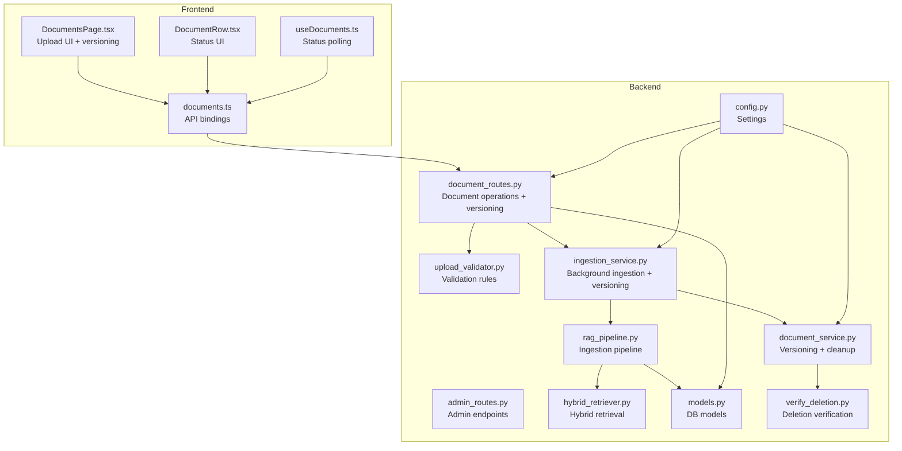
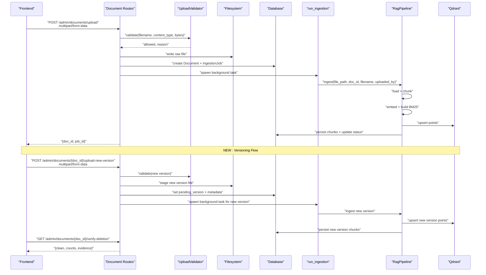
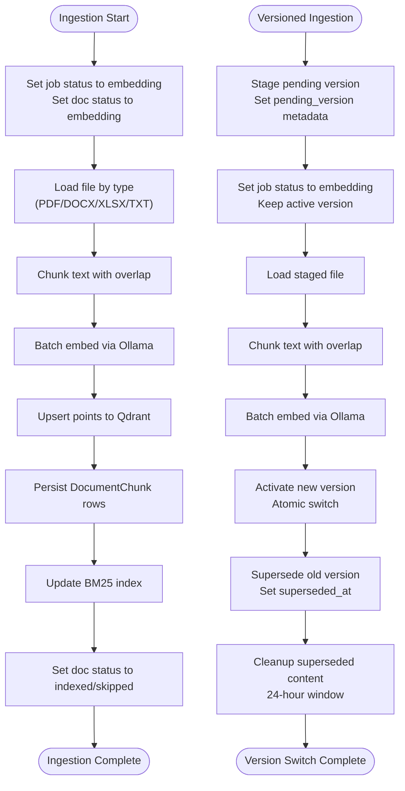
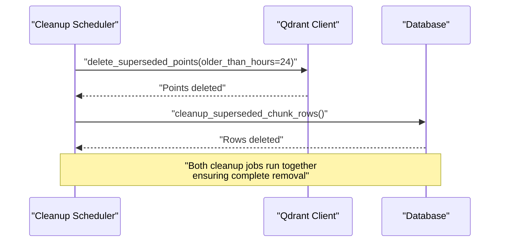
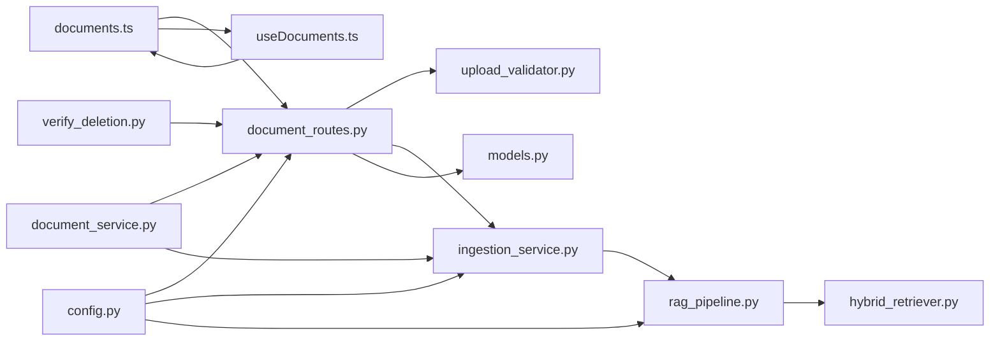

# Document Management API

<cite>
**Referenced Files in This Document**
- [admin_routes.py](file://safe4ai-pilot/app/api/admin_routes.py)
- [document_routes.py](file://safe4ai-pilot/app/api/document_routes.py)
- [upload_validator.py](file://safe4ai-pilot/app/security/upload_validator.py)
- [ingestion_service.py](file://safe4ai-pilot/app/services/ingestion_service.py)
- [rag_pipeline.py](file://safe4ai-pilot/app/services/rag_pipeline.py)
- [hybrid_retriever.py](file://safe4ai-pilot/app/components/hybrid_retriever.py)
- [models.py](file://safe4ai-pilot/app/db/models.py)
- [config.py](file://safe4ai-pilot/app/config.py)
- [documents.ts](file://safe4ai-pilot/frontend/src/api/documents.ts)
- [DocumentsPage.tsx](file://safe4ai-pilot/frontend/src/pages/admin/DocumentsPage.tsx)
- [DocumentRow.tsx](file://safe4ai-pilot/frontend/src/components/admin/DocumentRow.tsx)
- [useDocuments.ts](file://safe4ai-pilot/frontend/src/hooks/useDocuments.ts)
- [test_admin.py](file://safe4ai-pilot/tests/test_admin.py)
- [test_document_versioning.py](file://safe4ai-pilot/tests/test_document_versioning.py)
- [document_service.py](file://safe4ai-pilot/app/services/document_service.py)
- [verify_deletion.py](file://safe4ai-pilot/scripts/verify_deletion.py)
- [audit-log-reference.md](file://safe4ai-pilot/docs/security-pack/audit-log-reference.md)
</cite>

## Update Summary
**Changes Made**
- Added new section on Document Versioning and Atomic Replacement
- Updated Delete Document Endpoint section to include comprehensive deletion verification
- Added new section on Superseded Version Tracking and Cleanup
- Updated Transaction Safety section to include versioning considerations
- Enhanced troubleshooting guide with versioning scenarios
- Updated API reference summary with new endpoints

## Table of Contents
1. [Introduction](#introduction)
2. [Project Structure](#project-structure)
3. [Core Components](#core-components)
4. [Architecture Overview](#architecture-overview)
5. [Detailed Component Analysis](#detailed-component-analysis)
6. [Document Versioning and Atomic Replacement](#document-versioning-and-atomic-replacement)
7. [Superseded Version Tracking and Cleanup](#superseded-version-tracking-and-cleanup)
8. [Transaction Safety and Race Condition Prevention](#transaction-safety-and-race-condition-prevention)
9. [Dependency Analysis](#dependency-analysis)
10. [Performance Considerations](#performance-considerations)
11. [Troubleshooting Guide](#troubleshooting-guide)
12. [Conclusion](#conclusion)
13. [Appendices](#appendices)

## Introduction
This document provides comprehensive API documentation for administrative document management operations. It covers endpoints for uploading, listing, checking status, deleting, and reindexing documents, along with the complete ingestion lifecycle, validation rules, and administrative oversight capabilities. The system now includes advanced document versioning with atomic replacement capabilities, comprehensive deletion verification, and automated cleanup of superseded versions.

## Project Structure
The document management API is implemented in the backend FastAPI application under both admin routes and document routes modules. Supporting components include:
- Upload validation with file type, MIME, magic bytes, and size checks
- Background ingestion orchestration with job tracking and versioning support
- Vector store integration via Qdrant with atomic version switching
- Frontend integration for upload UX and status display
- **New**: Document versioning with staged replacement and rollback capabilities
- **New**: Comprehensive deletion verification across all storage layers

**Diagram sources**
- [admin_routes.py:67-256](file://safe4ai-pilot/app/api/admin_routes.py#L67-L256)
- [document_routes.py:514-607](file://safe4ai-pilot/app/api/document_routes.py#L514-L607)
- [upload_validator.py:24-73](file://safe4ai-pilot/app/security/upload_validator.py#L24-L73)
- [ingestion_service.py:21-88](file://safe4ai-pilot/app/services/ingestion_service.py#L21-L88)
- [rag_pipeline.py:34-150](file://safe4ai-pilot/app/services/rag_pipeline.py#L34-L150)
- [hybrid_retriever.py:14-145](file://safe4ai-pilot/app/components/hybrid_retriever.py#L14-L145)
- [models.py:75-167](file://safe4ai-pilot/app/db/models.py#L75-L167)
- [config.py:7-48](file://safe4ai-pilot/app/config.py#L7-L48)
- [document_service.py:44-134](file://safe4ai-pilot/app/services/document_service.py#L44-L134)
- [verify_deletion.py:82-119](file://safe4ai-pilot/scripts/verify_deletion.py#L82-L119)
- [documents.ts:43-67](file://safe4ai-pilot/frontend/src/api/documents.ts#L43-L67)
- [DocumentsPage.tsx:17-69](file://safe4ai-pilot/frontend/src/pages/admin/DocumentsPage.tsx#L17-L69)
- [DocumentRow.tsx:30-97](file://safe4ai-pilot/frontend/src/components/admin/DocumentRow.tsx#L30-L97)
- [useDocuments.ts:1-66](file://safe4ai-pilot/frontend/src/hooks/useDocuments.ts#L1-L66)

**Section sources**
- [admin_routes.py:67-256](file://safe4ai-pilot/app/api/admin_routes.py#L67-L256)
- [document_routes.py:514-607](file://safe4ai-pilot/app/api/document_routes.py#L514-L607)
- [config.py:7-48](file://safe4ai-pilot/app/config.py#L7-L48)

## Core Components
- Admin document endpoints:
  - Upload document with validation and background ingestion
  - **New**: Upload new document version with staged replacement
  - List documents with chunk counts
  - Poll ingestion status per document
  - Delete document (filesystem, vector store, DB, cache) with enhanced transaction safety
  - **New**: Verify deletion across all storage layers
  - Reindex document (restart ingestion)
- **New**: Document versioning system:
  - Staged versioning with pending_version tracking
  - Atomic replacement with activation/deactivation semantics
  - 24-hour rollback window for superseded versions
  - Automated cleanup of superseded content
- Validation:
  - Allowed extensions and MIME types
  - Magic-byte detection
  - Size enforcement via configuration
- Ingestion pipeline:
  - Chunking, embedding, Qdrant upsert, BM25 index update
  - Job state transitions and error handling
  - **Enhanced**: Support for version-aware ingestion
- Vector store:
  - Qdrant collection for document chunks with version tracking
  - Hybrid retrieval combining dense and sparse signals
  - **Enhanced**: Atomic version switching with activation/deactivation

**Section sources**
- [admin_routes.py:67-256](file://safe4ai-pilot/app/api/admin_routes.py#L67-L256)
- [document_routes.py:514-607](file://safe4ai-pilot/app/api/document_routes.py#L514-L607)
- [upload_validator.py:24-73](file://safe4ai-pilot/app/security/upload_validator.py#L24-L73)
- [ingestion_service.py:21-88](file://safe4ai-pilot/app/services/ingestion_service.py#L21-L88)
- [rag_pipeline.py:62-150](file://safe4ai-pilot/app/services/rag_pipeline.py#L62-L150)
- [models.py:75-167](file://safe4ai-pilot/app/db/models.py#L75-L167)
- [document_service.py:44-134](file://safe4ai-pilot/app/services/document_service.py#L44-L134)

## Architecture Overview
The document lifecycle spans frontend upload, backend validation, filesystem persistence, database records, background ingestion, and vector store synchronization. The new versioning system adds staged replacement with atomic activation.

**Diagram sources**
- [admin_routes.py:67-121](file://safe4ai-pilot/app/api/admin_routes.py#L67-L121)
- [document_routes.py:514-607](file://safe4ai-pilot/app/api/document_routes.py#L514-L607)
- [upload_validator.py:24-73](file://safe4ai-pilot/app/security/upload_validator.py#L24-L73)
- [ingestion_service.py:21-88](file://safe4ai-pilot/app/services/ingestion_service.py#L21-L88)
- [rag_pipeline.py:62-150](file://safe4ai-pilot/app/services/rag_pipeline.py#L62-L150)

## Detailed Component Analysis

### Upload Endpoint
- Method: POST
- URL: /admin/documents/upload
- Authentication: Requires admin role
- Request: multipart/form-data with field "file"
- Response: 201 Created with JSON containing doc_id and job_id
- Validation:
  - Extension must be in allowed set
  - Declared Content-Type must match allowed list
  - Detected MIME via magic bytes must be allowed
  - Size must not exceed max_upload_size_mb
- Storage:
  - Writes raw file to data/raw with a safe, randomized filename
  - Records metadata in Document and creates IngestionJob
- Background:
  - Spawns asynchronous ingestion task with job_id

Practical example (frontend):
- FormData keys: "file" (File), "collection" (optional)
- Fetch call posts to /admin/documents/upload
- On success, use returned doc_id for status polling

**Section sources**
- [admin_routes.py:67-121](file://safe4ai-pilot/app/api/admin_routes.py#L67-L121)
- [upload_validator.py:24-73](file://safe4ai-pilot/app/security/upload_validator.py#L24-L73)
- [config.py:20](file://safe4ai-pilot/app/config.py#L20)
- [documents.ts:49-61](file://safe4ai-pilot/frontend/src/api/documents.ts#L49-L61)

### Upload New Version Endpoint
**New** Staged document versioning with atomic replacement capabilities

- Method: POST
- URL: /admin/documents/{doc_id}/upload-new-version
- Authentication: Requires admin role
- Request: multipart/form-data with field "file"
- Response: 202 Accepted with JSON containing new version information
- Behavior:
  - Validates new file against UploadValidator
  - Stages new version without affecting active content
  - Sets pending_version and pending_* metadata fields
  - Creates new IngestionJob for staging
  - Returns immediately with staging confirmation
- Validation:
  - Same validation rules as initial upload
  - Prevents new version upload if active ingestion job exists
- Safety:
  - Immediate response prevents long-running operations
  - Pending version stored separately from active version
  - Atomic activation occurs during completion

Practical example (frontend):
- FormData keys: "file" (File)
- Call uploadNewVersion(selectedDoc.id, file)
- Monitor staging progress via status endpoint
- Use verify-deletion after activation

**Section sources**
- [document_routes.py:514-560](file://safe4ai-pilot/app/api/document_routes.py#L514-L560)
- [test_document_versioning.py:219-310](file://safe4ai-pilot/tests/test_document_versioning.py#L219-L310)

### List Documents Endpoint
- Method: GET
- URL: /admin/documents
- Response: Array of document summaries with ingestion_status, chunk_count, and metadata

**Section sources**
- [admin_routes.py:123-154](file://safe4ai-pilot/app/api/admin_routes.py#L123-L154)

### Get Document Status Endpoint
- Method: GET
- URL: /admin/documents/{doc_id}/status
- Response: ingestion_status, job_status, job_error, ingestion_started_at
- Behavior: Returns 404 if document not found

**Section sources**
- [admin_routes.py:157-181](file://safe4ai-pilot/app/api/admin_routes.py#L157-L181)

### Delete Document Endpoint
**Updated** Enhanced with improved transaction safety, active job checking, comprehensive deletion verification, and versioning considerations

- Method: DELETE
- URL: /admin/documents/{doc_id}
- Enhanced Behavior:
  - **Active Job Checking**: Performs atomic job status verification before any deletions using `_lock_query()` to prevent race conditions
  - **Transaction Safety**: Uses database transaction rollback on errors to maintain consistency
  - **Resource Cleanup**: Comprehensive cleanup order: cancel pending tasks → invalidate cache → delete DB records → remove raw files → delete Qdrant points → prune BM25 index
  - **Error Handling**: Graceful handling of partial failures with logging and continued cleanup attempts
  - **Versioning Safety**: Ensures superseded versions are properly cleaned up during deletion
- Response: 204 No Content; returns 404 if not found, 409 if active ingestion job detected
- Safety Features:
  - Atomic job status check prevents deletion during active ingestion
  - Task cancellation prevents half-canceled ingestion states
  - Database rollback ensures consistent state on errors
  - Separate exception handling for Qdrant cleanup prevents deletion failures from blocking filesystem cleanup

Practical example (frontend):
- Simple DELETE request to /admin/documents/{doc_id}
- Handle 204 responses for successful deletion
- Handle 409 responses when ingestion is active

**Section sources**
- [document_routes.py:285-339](file://safe4ai-pilot/app/api/document_routes.py#L285-L339)
- [test_admin.py:293-312](file://safe4ai-pilot/tests/test_admin.py#L293-L312)

### Verify Deletion Endpoint
**New** Comprehensive deletion verification across all storage layers

- Method: GET
- URL: /admin/documents/{doc_id}/verify-deletion
- Authentication: Requires admin role
- Response: JSON object with clean flag and counts for each storage layer
- Verification includes:
  - Qdrant vectors count (doc_id filter)
  - Database chunk rows count
  - Ingestion jobs count
  - Semantic cache entries count
  - In-memory BM25 entries count
- Purpose: Audit trail for deletion requests under data protection processes
- Usage: Run after DELETE operation to generate deletion evidence

**Section sources**
- [document_routes.py:607-650](file://safe4ai-pilot/app/api/document_routes.py#L607-L650)
- [audit-log-reference.md:81-88](file://safe4ai-pilot/docs/security-pack/audit-log-reference.md#L81-L88)

### Reindex Document Endpoint
- Method: POST
- URL: /admin/documents/{doc_id}/reindex
- Behavior:
  - Validates existence of raw file; returns 409 if missing
  - Creates new IngestionJob, resets Document ingestion_status to queued
  - Spawns background ingestion task
- Response: 202 Accepted with JSON containing new job_id

**Section sources**
- [admin_routes.py:224-256](file://safe4ai-pilot/app/api/admin_routes.py#L224-L256)

### Upload Validation Process
Validation performed by UploadValidator:
- Allowed extensions: .pdf, .docx, .xlsx, .txt
- Allowed MIME types: application/pdf, application/vnd.openxmlformats-officedocument.wordprocessingml.document, application/vnd.openxmlformats-officedocument.spreadsheetml.sheet, text/plain
- Magic-byte detection via python-magic
- Size enforced via max_upload_size_mb setting

**Section sources**
- [upload_validator.py:13-21](file://safe4ai-pilot/app/security/upload_validator.py#L13-L21)
- [upload_validator.py:24-73](file://safe4ai-pilot/app/security/upload_validator.py#L24-L73)
- [config.py:20](file://safe4ai-pilot/app/config.py#L20)

### Background Ingestion and Lifecycle
- run_ingestion updates job/document statuses, orchestrates RagPipeline, and handles exceptions
- RagPipeline loads content by type, chunks text, embeds via Ollama, upserts Qdrant, persists chunks, and updates BM25 index
- HybridRetriever supports hybrid dense/sparse retrieval and RRF fusion
- Stuck jobs are auto-recovered after a threshold window
- **Enhanced**: Support for version-aware ingestion with pending version staging

**Diagram sources**
- [ingestion_service.py:21-88](file://safe4ai-pilot/app/services/ingestion_service.py#L21-L88)
- [rag_pipeline.py:62-150](file://safe4ai-pilot/app/services/rag_pipeline.py#L62-L150)
- [hybrid_retriever.py:30-145](file://safe4ai-pilot/app/components/hybrid_retriever.py#L30-L145)
- [document_service.py:44-67](file://safe4ai-pilot/app/services/document_service.py#L44-L67)

**Section sources**
- [ingestion_service.py:21-88](file://safe4ai-pilot/app/services/ingestion_service.py#L21-L88)
- [rag_pipeline.py:62-150](file://safe4ai-pilot/app/services/rag_pipeline.py#L62-L150)
- [hybrid_retriever.py:30-145](file://safe4ai-pilot/app/components/hybrid_retriever.py#L30-L145)

### Vector Store Synchronization (Qdrant)
- Collection name: documents
- Points include payload fields: doc_id, filename, page_number, chunk_index, content preview, OCR quality
- Deletion removes all points for a doc_id filter
- Retrieval uses hybrid dense/sparse ranking with RRF fusion
- **Enhanced**: Version tracking with is_active payload and superseded_at timestamps

**Section sources**
- [admin_routes.py:274-290](file://safe4ai-pilot/app/api/admin_routes.py#L274-L290)
- [rag_pipeline.py:109-149](file://safe4ai-pilot/app/services/rag_pipeline.py#L109-L149)
- [hybrid_retriever.py:67-144](file://safe4ai-pilot/app/components/hybrid_retriever.py#L67-L144)

### Administrative Oversight and Bulk Operations
- Bulk upload supported via frontend multiple-file selection
- Status polling via GET /admin/documents/{doc_id}/status
- Reindexing per document via POST /admin/documents/{doc_id}/reindex
- Deletion via DELETE /admin/documents/{doc_id}
- Listing via GET /admin/documents
- **New**: Upload new version via POST /admin/documents/{doc_id}/upload-new-version
- **New**: Verify deletion via GET /admin/documents/{doc_id}/verify-deletion

**Section sources**
- [DocumentsPage.tsx:26-31](file://safe4ai-pilot/frontend/src/pages/admin/DocumentsPage.tsx#L26-L31)
- [admin_routes.py:123-181](file://safe4ai-pilot/app/api/admin_routes.py#L123-L181)
- [admin_routes.py:224-256](file://safe4ai-pilot/app/api/admin_routes.py#L224-L256)
- [admin_routes.py:184-222](file://safe4ai-pilot/app/api/admin_routes.py#L184-L222)
- [document_routes.py:514-607](file://safe4ai-pilot/app/api/document_routes.py#L514-L607)

## Document Versioning and Atomic Replacement
**New Section** Advanced document versioning system with staged replacement and atomic activation.

### Staged Versioning Mechanism
The system supports atomic document replacement through a staged versioning approach:

- **Pending Version Tracking**: New versions are staged with separate metadata fields (pending_version, pending_filename, etc.)
- **Non-Disruptive Upload**: Staged versions don't affect active content until activation
- **Immediate Response**: Upload-new-version returns 202 Accepted immediately after staging
- **Separate Ingestion**: Staged versions undergo independent ingestion process

### Atomic Activation Process
When a new version is ready, the system performs atomic activation:

1. **Activate New Version**: Set is_active=True for new version points
2. **Supersede Old Versions**: Set is_active=False and add superseded_at timestamp for old version points
3. **Brief Overlap Window**: Temporary overlap ensures no retrieval gaps during switch
4. **Rollback Capability**: 24-hour window allows rollback if issues arise

### Version Metadata Fields
- active_version: Currently serving version
- pending_version: Staged replacement version
- pending_*: Metadata fields for staged version (filename, storage_filename, file_type, file_size_bytes)
- superseded_at: Timestamp when version was superseded

**Section sources**
- [document_routes.py:514-560](file://safe4ai-pilot/app/api/document_routes.py#L514-L560)
- [document_service.py:44-67](file://safe4ai-pilot/app/services/document_service.py#L44-L67)
- [test_document_versioning.py:219-310](file://safe4ai-pilot/tests/test_document_versioning.py#L219-L310)

## Superseded Version Tracking and Cleanup
**New Section** Automated cleanup system for superseded document versions with rollback window.

### Superseded Content Tracking
The system tracks superseded versions with detailed metadata:

- **Activation/Deactivation**: New version activated before old versions are deactivated
- **Timestamp Recording**: superseded_at timestamp captures when version became inactive
- **Version Filtering**: Qdrant filters track is_active status and superseded_at timestamps
- **Rollback Window**: 24-hour period allows restoration of previous version if needed

### Automated Cleanup Jobs
Two complementary cleanup mechanisms ensure complete removal:

#### Qdrant Point Cleanup
- **Age-Based Deletion**: Removes points older than 24 hours with is_active=False
- **Filter Conditions**: Must match is_active=False and superseded_at timestamp criteria
- **Scheduled Execution**: Runs via audit_cleanup.py scheduler

#### Database Chunk Row Cleanup
- **Immediate Deletion**: Removes DocumentChunk rows for non-active versions
- **Companion Process**: Works alongside Qdrant cleanup
- **Transaction Safety**: Uses database transactions for consistency

### Cleanup Job Orchestration

**Diagram sources**
- [scripts/audit_cleanup.py:238-254](file://safe4ai-pilot/scripts/audit_cleanup.py#L238-L254)
- [document_service.py:71-111](file://safe4ai-pilot/app/services/document_service.py#L71-L111)

**Section sources**
- [document_service.py:71-111](file://safe4ai-pilot/app/services/document_service.py#L71-L111)
- [scripts/audit_cleanup.py:238-254](file://safe4ai-pilot/scripts/audit_cleanup.py#L238-L254)
- [test_document_versioning.py:42-111](file://safe4ai-pilot/tests/test_document_versioning.py#L42-L111)

## Transaction Safety and Race Condition Prevention
**Updated** Enhanced with versioning considerations and comprehensive deletion verification.

### Active Job Detection
The deletion endpoint performs atomic job status verification using `_lock_query()` before any destructive operations:
- Checks for active ingestion jobs in `embedding` or `pending` states
- Prevents deletion during active ingestion to avoid half-canceled states
- Uses database locks to prevent race conditions between concurrent operations
- **Enhanced**: Considers pending version ingestion during deletion verification

### Transaction Rollback Mechanism
All deletion operations are wrapped in database transactions with automatic rollback on errors:
- Database operations are grouped within single transaction
- Automatic rollback on any exception maintains consistent state
- Ensures partial deletions never leave the system in inconsistent state
- **Enhanced**: Includes version metadata cleanup in transaction boundaries

### Resource Cleanup Order
Comprehensive cleanup follows strict order to prevent resource leaks:
1. **Task Cancellation**: Cancel pending ingestion tasks first
2. **Cache Invalidation**: Remove semantic cache entries
3. **Database Cleanup**: Delete chunks, jobs, and document records
4. **Filesystem Cleanup**: Remove raw files
5. **Vector Store Cleanup**: Delete Qdrant points
6. **Index Cleanup**: Prune BM25 index
7. **Version Cleanup**: Remove superseded version metadata and content

### Error Isolation
Separate exception handling prevents cascading failures:
- Qdrant cleanup failures don't block filesystem cleanup
- Database errors trigger rollback but don't prevent other cleanup steps
- Logging captures all cleanup attempts and failures
- **Enhanced**: Version-specific cleanup errors isolated from primary deletion

**Section sources**
- [document_routes.py:296-339](file://safe4ai-pilot/app/api/document_routes.py#L296-L339)
- [test_admin.py:293-312](file://safe4ai-pilot/tests/test_admin.py#L293-L312)

## Dependency Analysis
Key dependencies and relationships:
- Document routes depend on UploadValidator, SQLAlchemy models, Qdrant client, and background ingestion service
- Ingestion service depends on RagPipeline, HybridRetriever, and Qdrant
- **New**: DocumentService provides versioning and cleanup functionality
- **New**: Verify deletion script provides standalone deletion verification
- Frontend API bindings depend on backend endpoints and model shapes
- Enhanced deletion endpoint includes transaction safety and race condition prevention logic

**Diagram sources**
- [admin_routes.py:67-256](file://safe4ai-pilot/app/api/admin_routes.py#L67-L256)
- [document_routes.py:514-607](file://safe4ai-pilot/app/api/document_routes.py#L514-L607)
- [upload_validator.py:24-73](file://safe4ai-pilot/app/security/upload_validator.py#L24-L73)
- [ingestion_service.py:21-88](file://safe4ai-pilot/app/services/ingestion_service.py#L21-L88)
- [rag_pipeline.py:34-150](file://safe4ai-pilot/app/services/rag_pipeline.py#L34-L150)
- [hybrid_retriever.py:14-145](file://safe4ai-pilot/app/components/hybrid_retriever.py#L14-L145)
- [models.py:75-167](file://safe4ai-pilot/app/db/models.py#L75-L167)
- [config.py:7-48](file://safe4ai-pilot/app/config.py#L7-L48)
- [documents.ts:43-67](file://safe4ai-pilot/frontend/src/api/documents.ts#L43-L67)
- [useDocuments.ts:1-66](file://safe4ai-pilot/frontend/src/hooks/useDocuments.ts#L1-L66)
- [document_service.py:44-134](file://safe4ai-pilot/app/services/document_service.py#L44-L134)
- [verify_deletion.py:82-119](file://safe4ai-pilot/scripts/verify_deletion.py#L82-L119)

**Section sources**
- [admin_routes.py:67-256](file://safe4ai-pilot/app/api/admin_routes.py#L67-L256)
- [document_routes.py:514-607](file://safe4ai-pilot/app/api/document_routes.py#L514-L607)
- [models.py:75-167](file://safe4ai-pilot/app/db/models.py#L75-L167)

## Performance Considerations
- Upload size limit enforced at both validator and route level
- Batch embedding reduces network overhead
- Qdrant upsert and BM25 index updates occur after embedding
- Stuck ingestion jobs are auto-recovered to prevent indefinite blocking
- **Enhanced**: Transaction safety adds minimal overhead for improved reliability
- **Enhanced**: Race condition prevention prevents costly recovery operations
- **New**: Versioning introduces minimal latency for staged uploads
- **New**: Atomic activation minimizes downtime during version switches

## Troubleshooting Guide
Common scenarios and resolutions:
- Upload rejected due to validation:
  - Ensure file extension and MIME type are allowed
  - Confirm file size does not exceed max_upload_size_mb
- 404 Not Found:
  - Document ID invalid or record deleted
- 409 Conflict on delete:
  - Wait for active ingestion to finish or cancel/retry later
  - **Enhanced**: Active job detection prevents deletion during ingestion
  - **New**: Check for pending version ingestion conflicts
- 409 Conflict on reindex:
  - Raw file missing; re-upload before reindex
- **New**: 409 Conflict on upload-new-version:
  - Active ingestion job exists for document
  - Wait for current ingestion to complete
- **New**: Version activation failures:
  - Check backend logs for activation errors
  - Verify Qdrant connectivity and permissions
  - Monitor rollback window for potential issues
- Ingestion failures:
  - Check job_error in status response
  - Review backend logs for ingestion_failed
- **Enhanced**: Deletion failures:
  - Check backend logs for transaction rollback messages
  - Verify cleanup order completed successfully
  - Monitor Qdrant connectivity for cleanup failures
  - **New**: Use verify-deletion endpoint for comprehensive cleanup verification
- **New**: Cleanup job failures:
  - Check audit_cleanup.py logs for cleanup errors
  - Verify Qdrant access permissions
  - Monitor database connection pool exhaustion

**Section sources**
- [admin_routes.py:83-84](file://safe4ai-pilot/app/api/admin_routes.py#L83-L84)
- [admin_routes.py:167-168](file://safe4ai-pilot/app/api/admin_routes.py#L167-L168)
- [admin_routes.py:203-207](file://safe4ai-pilot/app/api/admin_routes.py#L203-L207)
- [admin_routes.py:237-238](file://safe4ai-pilot/app/api/admin_routes.py#L237-L238)
- [document_routes.py:296-339](file://safe4ai-pilot/app/api/document_routes.py#L296-L339)
- [document_routes.py:514-560](file://safe4ai-pilot/app/api/document_routes.py#L514-L560)
- [ingestion_service.py:72-85](file://safe4ai-pilot/app/services/ingestion_service.py#L72-L85)
- [test_document_versioning.py:269-288](file://safe4ai-pilot/tests/test_document_versioning.py#L269-L288)

## Conclusion
The document management API provides a robust, secure, and observable pathway for administrators to upload, monitor, and maintain document indices. Validation ensures safe ingestion, background tasks handle heavy workloads, and Qdrant-backed retrieval enables efficient search. **Enhanced** administrative controls now support comprehensive document versioning with atomic replacement, ensuring zero-downtime updates and 24-hour rollback capability. The system includes automated cleanup of superseded content, comprehensive deletion verification, and improved transaction safety to guarantee reliable document lifecycle management.

## Appendices

### API Reference Summary

- POST /admin/documents/upload
  - Request: multipart/form-data with "file"
  - Response: 201 Created with {doc_id, job_id}
  - Validation: extension, MIME, magic bytes, size
- **New** POST /admin/documents/{doc_id}/upload-new-version
  - Request: multipart/form-data with "file"
  - Response: 202 Accepted with {version, pending_metadata}
  - Behavior: Stages new version without affecting active content
- GET /admin/documents
  - Response: array of document summaries
- GET /admin/documents/{doc_id}/status
  - Response: {doc_id, ingestion_status, job_status, job_error, ingestion_started_at}
- **New** GET /admin/documents/{doc_id}/verify-deletion
  - Response: {clean, counts: {qdrant_points, bm25_entries, db_chunks, cache_entries}}
  - Purpose: Comprehensive deletion verification across all storage layers
- DELETE /admin/documents/{doc_id}
  - Response: 204 No Content; blocks during active ingestion with enhanced transaction safety
  - **Enhanced**: Atomic job checking, transaction rollback, comprehensive cleanup, version-aware deletion
- POST /admin/documents/{doc_id}/reindex
  - Response: 202 Accepted with {job_id}; requires raw file present

**Section sources**
- [admin_routes.py:67-256](file://safe4ai-pilot/app/api/admin_routes.py#L67-L256)
- [document_routes.py:514-607](file://safe4ai-pilot/app/api/document_routes.py#L514-L607)
- [document_routes.py:607-650](file://safe4ai-pilot/app/api/document_routes.py#L607-L650)

### Frontend Integration Notes
- Upload UI supports drag-and-drop and multiple file selection
- Status polling uses GET /admin/documents/{doc_id}/status
- Reindex and delete actions are exposed via the Documents page
- **Enhanced**: Improved error handling for 409 conflicts during deletion
- **New**: New version upload button with version error handling
- **New**: Integration with verify-deletion for comprehensive cleanup verification

**Section sources**
- [DocumentsPage.tsx:17-69](file://safe4ai-pilot/frontend/src/pages/admin/DocumentsPage.tsx#L17-L69)
- [DocumentRow.tsx:30-97](file://safe4ai-pilot/frontend/src/components/admin/DocumentRow.tsx#L30-L97)
- [documents.ts:43-67](file://safe4ai-pilot/frontend/src/api/documents.ts#L43-L67)
- [useDocuments.ts:1-66](file://safe4ai-pilot/frontend/src/hooks/useDocuments.ts#L1-L66)
