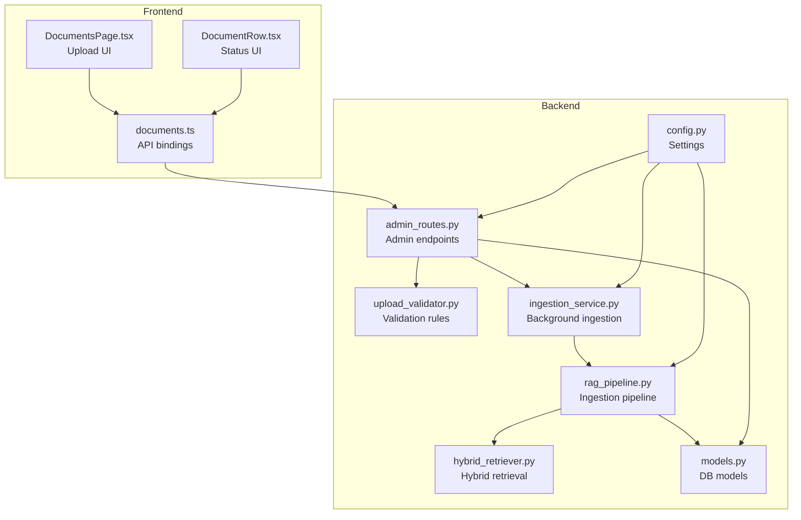
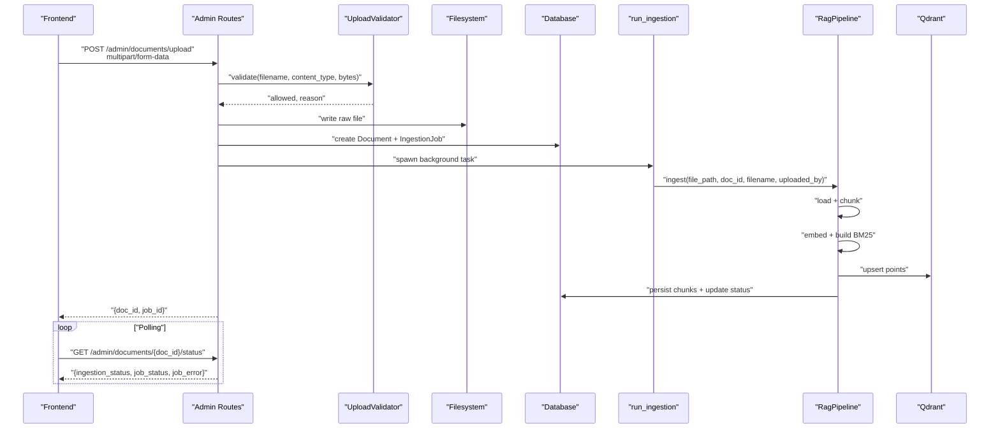
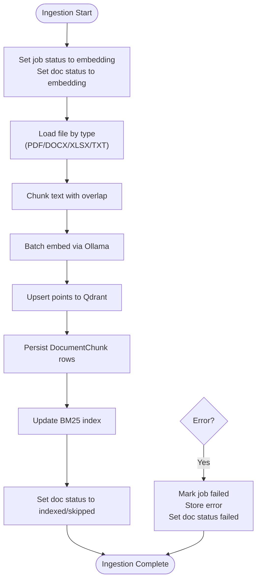
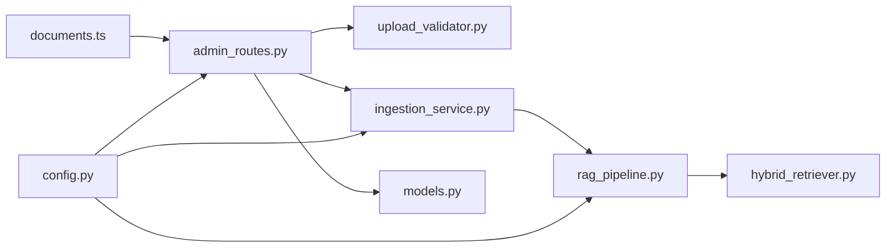

# Document Management API

<cite>
**Referenced Files in This Document**
- [admin_routes.py](file://safe4ai-pilot/app/api/admin_routes.py)
- [upload_validator.py](file://safe4ai-pilot/app/security/upload_validator.py)
- [ingestion_service.py](file://safe4ai-pilot/app/services/ingestion_service.py)
- [rag_pipeline.py](file://safe4ai-pilot/app/services/rag_pipeline.py)
- [hybrid_retriever.py](file://safe4ai-pilot/app/components/hybrid_retriever.py)
- [models.py](file://safe4ai-pilot/app/db/models.py)
- [config.py](file://safe4ai-pilot/app/config.py)
- [documents.ts](file://safe4ai-pilot/frontend/src/api/documents.ts)
- [DocumentsPage.tsx](file://safe4ai-pilot/frontend/src/pages/admin/DocumentsPage.tsx)
- [DocumentRow.tsx](file://safe4ai-pilot/frontend/src/components/admin/DocumentRow.tsx)
- [test_admin.py](file://safe4ai-pilot/tests/test_admin.py)
</cite>

## Table of Contents
1. [Introduction](#introduction)
2. [Project Structure](#project-structure)
3. [Core Components](#core-components)
4. [Architecture Overview](#architecture-overview)
5. [Detailed Component Analysis](#detailed-component-analysis)
6. [Dependency Analysis](#dependency-analysis)
7. [Performance Considerations](#performance-considerations)
8. [Troubleshooting Guide](#troubleshooting-guide)
9. [Conclusion](#conclusion)
10. [Appendices](#appendices)

## Introduction
This document provides comprehensive API documentation for administrative document management operations. It covers endpoints for uploading, listing, checking status, deleting, and reindexing documents, along with the complete ingestion lifecycle, validation rules, and administrative oversight capabilities. It also includes practical examples for multipart uploads, background job creation, status polling, and vector store synchronization with Qdrant.

## Project Structure
The document management API is implemented in the backend FastAPI application under the admin routes module. Supporting components include:
- Upload validation with file type, MIME, magic bytes, and size checks
- Background ingestion orchestration with job tracking
- Vector store integration via Qdrant and hybrid retrieval
- Frontend integration for upload UX and status display

**Diagram sources**
- [admin_routes.py:67-256](file://safe4ai-pilot/app/api/admin_routes.py#L67-L256)
- [upload_validator.py:24-73](file://safe4ai-pilot/app/security/upload_validator.py#L24-L73)
- [ingestion_service.py:21-88](file://safe4ai-pilot/app/services/ingestion_service.py#L21-L88)
- [rag_pipeline.py:34-150](file://safe4ai-pilot/app/services/rag_pipeline.py#L34-L150)
- [hybrid_retriever.py:14-145](file://safe4ai-pilot/app/components/hybrid_retriever.py#L14-L145)
- [models.py:75-167](file://safe4ai-pilot/app/db/models.py#L75-L167)
- [config.py:7-48](file://safe4ai-pilot/app/config.py#L7-L48)
- [documents.ts:43-67](file://safe4ai-pilot/frontend/src/api/documents.ts#L43-L67)
- [DocumentsPage.tsx:17-69](file://safe4ai-pilot/frontend/src/pages/admin/DocumentsPage.tsx#L17-L69)
- [DocumentRow.tsx:30-97](file://safe4ai-pilot/frontend/src/components/admin/DocumentRow.tsx#L30-L97)

**Section sources**
- [admin_routes.py:67-256](file://safe4ai-pilot/app/api/admin_routes.py#L67-L256)
- [config.py:7-48](file://safe4ai-pilot/app/config.py#L7-L48)

## Core Components
- Admin document endpoints:
  - Upload document with validation and background ingestion
  - List documents with chunk counts
  - Poll ingestion status per document
  - Delete document (filesystem, vector store, DB, cache)
  - Reindex document (restart ingestion)
- Validation:
  - Allowed extensions and MIME types
  - Magic-byte detection
  - Size enforcement via configuration
- Ingestion pipeline:
  - Chunking, embedding, Qdrant upsert, BM25 index update
  - Job state transitions and error handling
- Vector store:
  - Qdrant collection for document chunks
  - Hybrid retrieval combining dense and sparse signals

**Section sources**
- [admin_routes.py:67-256](file://safe4ai-pilot/app/api/admin_routes.py#L67-L256)
- [upload_validator.py:24-73](file://safe4ai-pilot/app/security/upload_validator.py#L24-L73)
- [ingestion_service.py:21-88](file://safe4ai-pilot/app/services/ingestion_service.py#L21-L88)
- [rag_pipeline.py:62-150](file://safe4ai-pilot/app/services/rag_pipeline.py#L62-L150)
- [models.py:75-167](file://safe4ai-pilot/app/db/models.py#L75-L167)

## Architecture Overview
The document lifecycle spans frontend upload, backend validation, filesystem persistence, database records, background ingestion, and vector store synchronization.

**Diagram sources**
- [admin_routes.py:67-121](file://safe4ai-pilot/app/api/admin_routes.py#L67-L121)
- [upload_validator.py:24-73](file://safe4ai-pilot/app/security/upload_validator.py#L24-L73)
- [ingestion_service.py:21-88](file://safe4ai-pilot/app/services/ingestion_service.py#L21-L88)
- [rag_pipeline.py:62-150](file://safe4ai-pilot/app/services/rag_pipeline.py#L62-L150)

## Detailed Component Analysis

### Upload Endpoint
- Method: POST
- URL: /admin/documents/upload
- Authentication: Requires admin role
- Request: multipart/form-data with field "file"
- Response: 201 Created with JSON containing doc_id and job_id
- Validation:
  - Extension must be in allowed set
  - Declared Content-Type must match allowed list
  - Detected MIME via magic bytes must be allowed
  - Size must not exceed max_upload_size_mb
- Storage:
  - Writes raw file to data/raw with a safe, randomized filename
  - Records metadata in Document and creates IngestionJob
- Background:
  - Spawns asynchronous ingestion task with job_id

Practical example (frontend):
- FormData keys: "file" (File), "collection" (optional)
- Fetch call posts to /admin/documents/upload
- On success, use returned doc_id for status polling

**Section sources**
- [admin_routes.py:67-121](file://safe4ai-pilot/app/api/admin_routes.py#L67-L121)
- [upload_validator.py:24-73](file://safe4ai-pilot/app/security/upload_validator.py#L24-L73)
- [config.py:20](file://safe4ai-pilot/app/config.py#L20)
- [documents.ts:49-61](file://safe4ai-pilot/frontend/src/api/documents.ts#L49-L61)

### List Documents Endpoint
- Method: GET
- URL: /admin/documents
- Response: Array of document summaries with ingestion_status, chunk_count, and metadata

**Section sources**
- [admin_routes.py:123-154](file://safe4ai-pilot/app/api/admin_routes.py#L123-L154)

### Get Document Status Endpoint
- Method: GET
- URL: /admin/documents/{doc_id}/status
- Response: ingestion_status, job_status, job_error, ingestion_started_at
- Behavior: Returns 404 if document not found

**Section sources**
- [admin_routes.py:157-181](file://safe4ai-pilot/app/api/admin_routes.py#L157-L181)

### Delete Document Endpoint
- Method: DELETE
- URL: /admin/documents/{doc_id}
- Behavior:
  - Blocks deletion if an ingestion job is currently embedding
  - Removes raw file if present
  - Deletes Qdrant points for the document
  - Clears semantic cache entries
  - Removes chunks, jobs, and document record
- Response: 204 No Content; returns 404 if not found, 409 if active ingestion

**Section sources**
- [admin_routes.py:184-222](file://safe4ai-pilot/app/api/admin_routes.py#L184-L222)

### Reindex Document Endpoint
- Method: POST
- URL: /admin/documents/{doc_id}/reindex
- Behavior:
  - Validates existence of raw file; returns 409 if missing
  - Creates new IngestionJob, resets Document ingestion_status to queued
  - Spawns background ingestion task
- Response: 202 Accepted with JSON containing new job_id

**Section sources**
- [admin_routes.py:224-256](file://safe4ai-pilot/app/api/admin_routes.py#L224-L256)

### Upload Validation Process
Validation performed by UploadValidator:
- Allowed extensions: .pdf, .docx, .xlsx, .txt
- Allowed MIME types: application/pdf, application/vnd.openxmlformats-officedocument.wordprocessingml.document, application/vnd.openxmlformats-officedocument.spreadsheetml.sheet, text/plain
- Magic-byte detection via python-magic
- Size enforced via max_upload_size_mb setting

**Section sources**
- [upload_validator.py:13-21](file://safe4ai-pilot/app/security/upload_validator.py#L13-L21)
- [upload_validator.py:24-73](file://safe4ai-pilot/app/security/upload_validator.py#L24-L73)
- [config.py:20](file://safe4ai-pilot/app/config.py#L20)

### Background Ingestion and Lifecycle
- run_ingestion updates job/document statuses, orchestrates RagPipeline, and handles exceptions
- RagPipeline loads content by type, chunks text, embeds via Ollama, upserts Qdrant, persists chunks, and updates BM25 index
- HybridRetriever supports hybrid dense/sparse retrieval and RRF fusion
- Stuck jobs are auto-recovered after a threshold window

**Diagram sources**
- [ingestion_service.py:21-88](file://safe4ai-pilot/app/services/ingestion_service.py#L21-L88)
- [rag_pipeline.py:62-150](file://safe4ai-pilot/app/services/rag_pipeline.py#L62-L150)
- [hybrid_retriever.py:30-145](file://safe4ai-pilot/app/components/hybrid_retriever.py#L30-L145)

**Section sources**
- [ingestion_service.py:21-88](file://safe4ai-pilot/app/services/ingestion_service.py#L21-L88)
- [rag_pipeline.py:62-150](file://safe4ai-pilot/app/services/rag_pipeline.py#L62-L150)
- [hybrid_retriever.py:30-145](file://safe4ai-pilot/app/components/hybrid_retriever.py#L30-L145)

### Vector Store Synchronization (Qdrant)
- Collection name: documents
- Points include payload fields: doc_id, filename, page_number, chunk_index, content preview, OCR quality
- Deletion removes all points for a doc_id filter
- Retrieval uses hybrid dense/sparse ranking with RRF fusion

**Section sources**
- [admin_routes.py:274-290](file://safe4ai-pilot/app/api/admin_routes.py#L274-L290)
- [rag_pipeline.py:109-149](file://safe4ai-pilot/app/services/rag_pipeline.py#L109-L149)
- [hybrid_retriever.py:67-144](file://safe4ai-pilot/app/components/hybrid_retriever.py#L67-L144)

### Administrative Oversight and Bulk Operations
- Bulk upload supported via frontend multiple-file selection
- Status polling via GET /admin/documents/{doc_id}/status
- Reindexing per document via POST /admin/documents/{doc_id}/reindex
- Deletion via DELETE /admin/documents/{doc_id}
- Listing via GET /admin/documents

**Section sources**
- [DocumentsPage.tsx:26-31](file://safe4ai-pilot/frontend/src/pages/admin/DocumentsPage.tsx#L26-L31)
- [admin_routes.py:123-181](file://safe4ai-pilot/app/api/admin_routes.py#L123-L181)
- [admin_routes.py:224-256](file://safe4ai-pilot/app/api/admin_routes.py#L224-L256)
- [admin_routes.py:184-222](file://safe4ai-pilot/app/api/admin_routes.py#L184-L222)

## Dependency Analysis
Key dependencies and relationships:
- Admin routes depend on UploadValidator, SQLAlchemy models, Qdrant client, and background ingestion service
- Ingestion service depends on RagPipeline, HybridRetriever, and Qdrant
- Frontend API bindings depend on backend endpoints and model shapes

**Diagram sources**
- [admin_routes.py:67-256](file://safe4ai-pilot/app/api/admin_routes.py#L67-L256)
- [upload_validator.py:24-73](file://safe4ai-pilot/app/security/upload_validator.py#L24-L73)
- [ingestion_service.py:21-88](file://safe4ai-pilot/app/services/ingestion_service.py#L21-L88)
- [rag_pipeline.py:34-150](file://safe4ai-pilot/app/services/rag_pipeline.py#L34-L150)
- [hybrid_retriever.py:14-145](file://safe4ai-pilot/app/components/hybrid_retriever.py#L14-L145)
- [models.py:75-167](file://safe4ai-pilot/app/db/models.py#L75-L167)
- [config.py:7-48](file://safe4ai-pilot/app/config.py#L7-L48)
- [documents.ts:43-67](file://safe4ai-pilot/frontend/src/api/documents.ts#L43-L67)

**Section sources**
- [admin_routes.py:67-256](file://safe4ai-pilot/app/api/admin_routes.py#L67-L256)
- [models.py:75-167](file://safe4ai-pilot/app/db/models.py#L75-L167)

## Performance Considerations
- Upload size limit enforced at both validator and route level
- Batch embedding reduces network overhead
- Qdrant upsert and BM25 index updates occur after embedding
- Stuck ingestion jobs are auto-recovered to prevent indefinite blocking

[No sources needed since this section provides general guidance]

## Troubleshooting Guide
Common scenarios and resolutions:
- Upload rejected due to validation:
  - Ensure file extension and MIME type are allowed
  - Confirm file size does not exceed max_upload_size_mb
- 404 Not Found:
  - Document ID invalid or record deleted
- 409 Conflict on delete:
  - Wait for active ingestion to finish or cancel/retry later
- 409 Conflict on reindex:
  - Raw file missing; re-upload before reindex
- Ingestion failures:
  - Check job_error in status response
  - Review backend logs for ingestion_failed

**Section sources**
- [admin_routes.py:83-84](file://safe4ai-pilot/app/api/admin_routes.py#L83-L84)
- [admin_routes.py:167-168](file://safe4ai-pilot/app/api/admin_routes.py#L167-L168)
- [admin_routes.py:203-207](file://safe4ai-pilot/app/api/admin_routes.py#L203-L207)
- [admin_routes.py:237-238](file://safe4ai-pilot/app/api/admin_routes.py#L237-L238)
- [ingestion_service.py:72-85](file://safe4ai-pilot/app/services/ingestion_service.py#L72-L85)

## Conclusion
The document management API provides a robust, secure, and observable pathway for administrators to upload, monitor, and maintain document indices. Validation ensures safe ingestion, background tasks handle heavy workloads, and Qdrant-backed retrieval enables efficient search. Administrative controls support quality assurance and operational oversight.

[No sources needed since this section summarizes without analyzing specific files]

## Appendices

### API Reference Summary

- POST /admin/documents/upload
  - Request: multipart/form-data with "file"
  - Response: 201 Created with {doc_id, job_id}
  - Validation: extension, MIME, magic bytes, size
- GET /admin/documents
  - Response: array of document summaries
- GET /admin/documents/{doc_id}/status
  - Response: {doc_id, ingestion_status, job_status, job_error, ingestion_started_at}
- DELETE /admin/documents/{doc_id}
  - Response: 204 No Content; blocks during active ingestion
- POST /admin/documents/{doc_id}/reindex
  - Response: 202 Accepted with {job_id}; requires raw file present

**Section sources**
- [admin_routes.py:67-256](file://safe4ai-pilot/app/api/admin_routes.py#L67-L256)

### Frontend Integration Notes
- Upload UI supports drag-and-drop and multiple file selection
- Status polling uses GET /admin/documents/{doc_id}/status
- Reindex and delete actions are exposed via the Documents page

**Section sources**
- [DocumentsPage.tsx:17-69](file://safe4ai-pilot/frontend/src/pages/admin/DocumentsPage.tsx#L17-L69)
- [DocumentRow.tsx:30-97](file://safe4ai-pilot/frontend/src/components/admin/DocumentRow.tsx#L30-L97)
- [documents.ts:43-67](file://safe4ai-pilot/frontend/src/api/documents.ts#L43-L67)