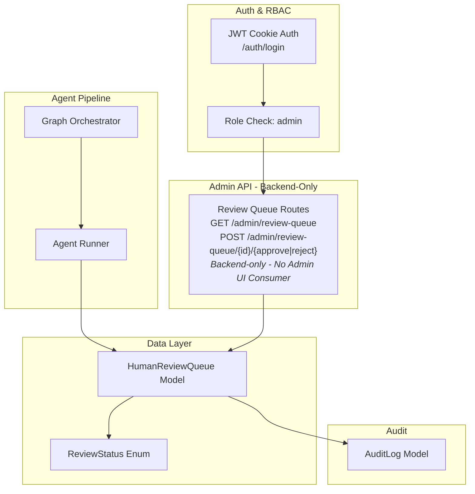
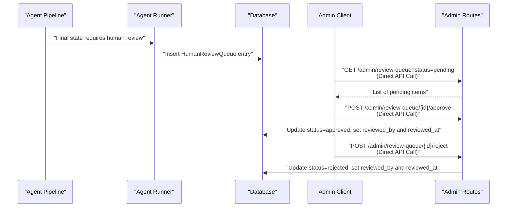
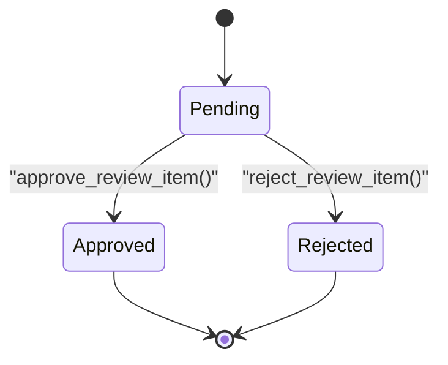
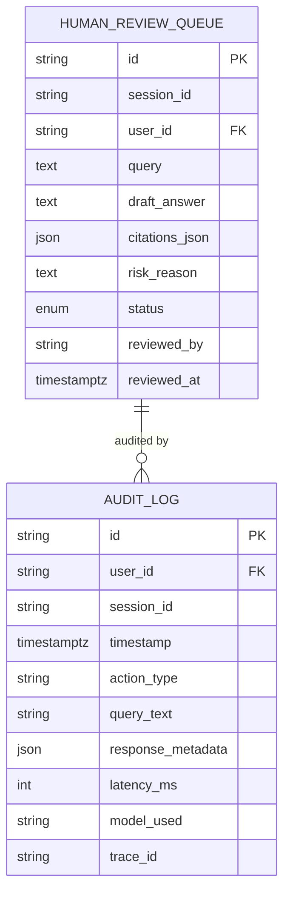
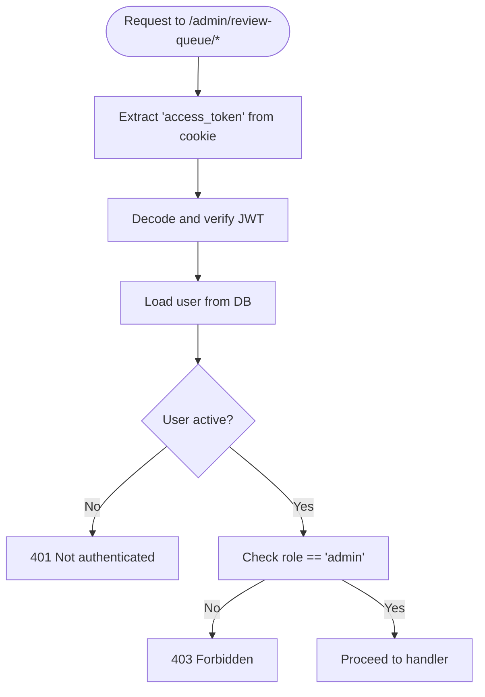
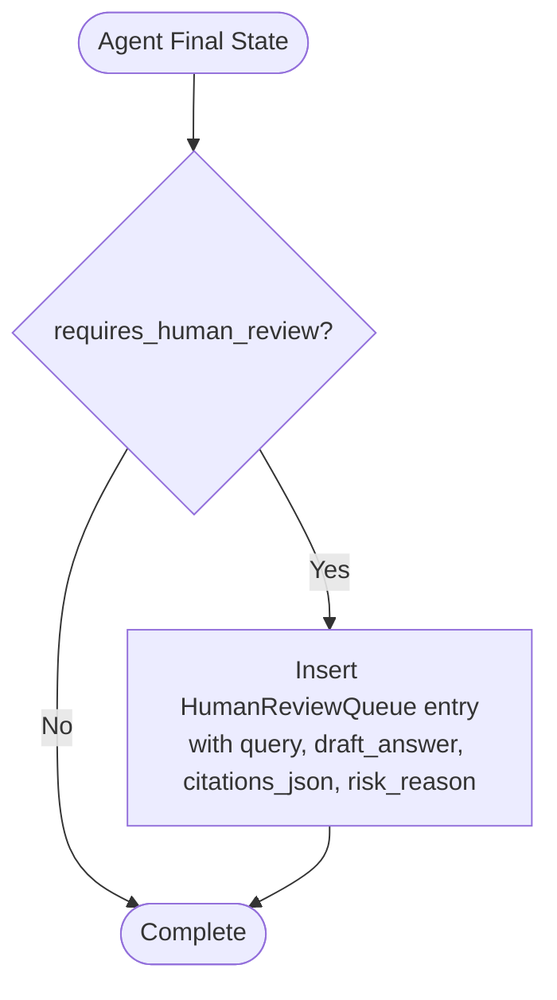
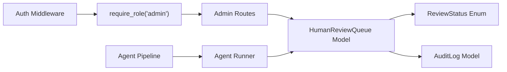

# Human Review Queue API

<cite>
**Referenced Files in This Document**
- [admin_routes.py](file://safe4ai-pilot/app/api/admin_routes.py)
- [models.py](file://safe4ai-pilot/app/db/models.py)
- [middleware.py](file://safe4ai-pilot/app/auth/middleware.py)
- [router.py](file://safe4ai-pilot/app/auth/router.py)
- [agent_runner.py](file://safe4ai-pilot/app/services/agent_runner.py)
- [graph.py](file://safe4ai-pilot/app/agents/graph.py)
- [test_admin.py](file://safe4ai-pilot/tests/test_admin.py)
- [db-layer.md](file://safe4ai-pilot/docs/db-layer.md)
- [codebase-summary.md](file://safe4ai-pilot/docs/codebase-summary.md)
- [AdminLayout.tsx](file://safe4ai-pilot/frontend/src/pages/admin/AdminLayout.tsx)
</cite>

## Update Summary
**Changes Made**
- Updated introduction to reflect that endpoints are backend-only features without admin UI consumer
- Added explicit note about intentional backend-only implementation for future review-queue admin page
- Updated architecture overview to clarify these are "complete backend features ready for future UI implementation"
- Enhanced troubleshooting section to address backend-only operation
- Removed references to admin UI consumer in component analysis

## Table of Contents
1. [Introduction](#introduction)
2. [Project Structure](#project-structure)
3. [Core Components](#core-components)
4. [Architecture Overview](#architecture-overview)
5. [Detailed Component Analysis](#detailed-component-analysis)
6. [Dependency Analysis](#dependency-analysis)
7. [Performance Considerations](#performance-considerations)
8. [Troubleshooting Guide](#troubleshooting-guide)
9. [Conclusion](#conclusion)

## Introduction
This document provides comprehensive API documentation for the human review queue management endpoints used in administrative content moderation and risk assessment workflows. **Updated**: These endpoints are currently backend-only features without an admin UI consumer. They are intentionally kept as complete backend implementations ready for future integration with a review-queue admin page, while remaining fully functional for direct API consumption.

The endpoints support HTTP methods, URL patterns, request and response schemas, workflow states, and integration points with risk assessment and audit systems. They include practical examples, batch processing considerations, escalation procedures for high-risk content, and error handling guidance for administrative governance.

## Project Structure
The human review queue is implemented as part of the admin API routes and backed by SQLAlchemy models. Authentication and authorization are enforced via JWT cookies and role-based access control. Risk assessment and draft answer generation are integrated into the agent orchestration pipeline, which conditionally enqueues items for human review.

**Updated**: The endpoints are complete backend features that can be called directly via API, though they are not currently exposed through the admin UI.

**Diagram sources**
- [admin_routes.py:783-852](file://safe4ai-pilot/app/api/admin_routes.py#L783-L852)
- [models.py:46-50](file://safe4ai-pilot/app/db/models.py#L46-L50)
- [models.py:169-181](file://safe4ai-pilot/app/db/models.py#L169-L181)
- [middleware.py:51-82](file://safe4ai-pilot/app/auth/middleware.py#L51-L82)
- [router.py:39-105](file://safe4ai-pilot/app/auth/router.py#L39-L105)
- [agent_runner.py:36-54](file://safe4ai-pilot/app/services/agent_runner.py#L36-L54)
- [graph.py:175-308](file://safe4ai-pilot/app/agents/graph.py#L175-L308)

**Section sources**
- [admin_routes.py:783-852](file://safe4ai-pilot/app/api/admin_routes.py#L783-L852)
- [models.py:46-50](file://safe4ai-pilot/app/db/models.py#L46-L50)
- [models.py:169-181](file://safe4ai-pilot/app/db/models.py#L169-L181)
- [middleware.py:51-82](file://safe4ai-pilot/app/auth/middleware.py#L51-L82)
- [router.py:39-105](file://safe4ai-pilot/app/auth/router.py#L39-L105)
- [agent_runner.py:36-54](file://safe4ai-pilot/app/services/agent_runner.py#L36-L54)
- [graph.py:175-308](file://safe4ai-pilot/app/agents/graph.py#L175-L308)

## Core Components
- ReviewStatus enum defines three workflow states: pending, approved, rejected.
- HumanReviewQueue model stores review items with optional draft answer, citations, and risk reason, along with reviewer metadata.
- Admin endpoints enforce role-based access and include rate limiting.
- Agent pipeline conditionally enqueues items requiring human review based on quality gates and output filtering.

**Updated**: These components form a complete backend implementation that is intentionally kept ready for future UI integration.

Key implementation references:
- ReviewStatus enum definition: [models.py:46-50](file://safe4ai-pilot/app/db/models.py#L46-L50)
- HumanReviewQueue model: [models.py:169-181](file://safe4ai-pilot/app/db/models.py#L169-L181)
- Admin routes for review queue: [admin_routes.py:789-852](file://safe4ai-pilot/app/api/admin_routes.py#L789-L852)
- Agent runner enqueue logic: [agent_runner.py:36-54](file://safe4ai-pilot/app/services/agent_runner.py#L36-L54)
- Graph quality gate and fallback leading to review: [graph.py:175-308](file://safe4ai-pilot/app/agents/graph.py#L175-L308)

**Section sources**
- [models.py:46-50](file://safe4ai-pilot/app/db/models.py#L46-L50)
- [models.py:169-181](file://safe4ai-pilot/app/db/models.py#L169-L181)
- [admin_routes.py:789-852](file://safe4ai-pilot/app/api/admin_routes.py#L789-L852)
- [agent_runner.py:36-54](file://safe4ai-pilot/app/services/agent_runner.py#L36-L54)
- [graph.py:175-308](file://safe4ai-pilot/app/agents/graph.py#L175-L308)

## Architecture Overview
The human review queue sits at the intersection of the agent pipeline and admin moderation. Items requiring review are inserted into the queue during agent execution when quality or safety gates fail. Administrators authenticate via JWT and use admin endpoints to list, approve, or reject items. All actions update the queue record with reviewer identity and timestamps, and are captured in audit logs.

**Updated**: These endpoints are fully functional backend features that can be consumed directly via API calls, even though they are not currently exposed through the admin interface.

**Diagram sources**
- [agent_runner.py:36-54](file://safe4ai-pilot/app/services/agent_runner.py#L36-L54)
- [admin_routes.py:789-852](file://safe4ai-pilot/app/api/admin_routes.py#L789-L852)
- [models.py:169-181](file://safe4ai-pilot/app/db/models.py#L169-L181)

## Detailed Component Analysis

### ReviewStatus Enum and Workflow States
- Values: pending, approved, rejected
- Initial state: pending
- Transitions:
  - pending → approved
  - pending → rejected
- Validation prevents transitions from non-pending states.

**Diagram sources**
- [models.py:46-50](file://safe4ai-pilot/app/db/models.py#L46-L50)
- [admin_routes.py:820-852](file://safe4ai-pilot/app/api/admin_routes.py#L820-L852)

**Section sources**
- [models.py:46-50](file://safe4ai-pilot/app/db/models.py#L46-L50)
- [admin_routes.py:820-852](file://safe4ai-pilot/app/api/admin_routes.py#L820-L852)

### HumanReviewQueue Data Model
Fields include identifiers, query text, optional draft answer and citations, risk reason, status, and reviewer metadata. The model integrates with the audit log system for governance.

**Diagram sources**
- [models.py:169-181](file://safe4ai-pilot/app/db/models.py#L169-L181)
- [models.py:118-131](file://safe4ai-pilot/app/db/models.py#L118-L131)

**Section sources**
- [models.py:169-181](file://safe4ai-pilot/app/db/models.py#L169-L181)
- [models.py:118-131](file://safe4ai-pilot/app/db/models.py#L118-L131)

### Authentication and Authorization
- Authentication: JWT cookie-based, validated by middleware.
- Authorization: Role enforcement ensures only admin users can access review queue endpoints.
- Rate limiting: Applied at the route level for admin endpoints.

**Diagram sources**
- [middleware.py:51-82](file://safe4ai-pilot/app/auth/middleware.py#L51-L82)
- [router.py:39-105](file://safe4ai-pilot/app/auth/router.py#L39-L105)
- [admin_routes.py:789-852](file://safe4ai-pilot/app/api/admin_routes.py#L789-L852)

**Section sources**
- [middleware.py:51-82](file://safe4ai-pilot/app/auth/middleware.py#L51-L82)
- [router.py:39-105](file://safe4ai-pilot/app/auth/router.py#L39-L105)
- [admin_routes.py:789-852](file://safe4ai-pilot/app/api/admin_routes.py#L789-L852)

### API Endpoints

#### List Review Queue Items
- Method: GET
- URL: /admin/review-queue
- Query parameters:
  - status: ReviewStatus (default: pending)
- Response: Array of review items with keys: id, session_id, user_id, query, draft_answer, risk_reason, status, reviewed_by, reviewed_at
- Access: admin
- Notes: Rate-limited, backend-only feature

Example request:
- GET /admin/review-queue?status=pending

Example response:
- 200 OK with array of items

**Section sources**
- [admin_routes.py:789-816](file://safe4ai-pilot/app/api/admin_routes.py#L789-L816)
- [models.py:169-181](file://safe4ai-pilot/app/db/models.py#L169-L181)

#### Approve a Review Item
- Method: POST
- URL: /admin/review-queue/{item_id}/approve
- Path parameter:
  - item_id: string
- Response: { status: "approved" }
- Access: admin
- Validation:
  - Returns 404 if item not found
  - Returns 409 if item status is not pending
- On success: sets status=approved, records reviewed_by and reviewed_at

Example request:
- POST /admin/review-queue/rq-1/approve

Example response:
- 200 OK with { status: "approved" }

**Section sources**
- [admin_routes.py:819-834](file://safe4ai-pilot/app/api/admin_routes.py#L819-L834)
- [models.py:46-50](file://safe4ai-pilot/app/db/models.py#L46-L50)

#### Reject a Review Item
- Method: POST
- URL: /admin/review-queue/{item_id}/reject
- Path parameter:
  - item_id: string
- Response: { status: "rejected" }
- Access: admin
- Validation:
  - Returns 404 if item not found
  - Returns 409 if item status is not pending
- On success: sets status=rejected, records reviewed_by and reviewed_at

Example request:
- POST /admin/review-queue/rq-1/reject

Example response:
- 200 OK with { status: "rejected" }

**Section sources**
- [admin_routes.py:837-852](file://safe4ai-pilot/app/api/admin_routes.py#L837-L852)
- [models.py:46-50](file://safe4ai-pilot/app/db/models.py#L46-L50)

### Integration with Risk Assessment and Draft Answer Review
- Agent pipeline determines whether an item requires human review based on retrieval quality and output filtering outcomes.
- When review is required, the agent runner inserts a HumanReviewQueue entry with:
  - session_id, user_id
  - query (truncated)
  - draft_answer (if available)
  - citations_json (serialized)
  - risk_reason (automatically populated)
- This mechanism ensures that flagged or low-quality outputs are escalated to administrators for manual review.

**Diagram sources**
- [graph.py:175-308](file://safe4ai-pilot/app/agents/graph.py#L175-L308)
- [agent_runner.py:36-54](file://safe4ai-pilot/app/services/agent_runner.py#L36-L54)
- [models.py:169-181](file://safe4ai-pilot/app/db/models.py#L169-L181)

**Section sources**
- [graph.py:175-308](file://safe4ai-pilot/app/agents/graph.py#L175-L308)
- [agent_runner.py:36-54](file://safe4ai-pilot/app/services/agent_runner.py#L36-L54)
- [models.py:169-181](file://safe4ai-pilot/app/db/models.py#L169-L181)

### Audit Trail Requirements
- All admin actions on the review queue update the HumanReviewQueue record with reviewer identity and timestamps.
- The system maintains an audit log model suitable for capturing governance events.
- Recommendation: Extend audit logging around review actions to capture reviewer identity, timestamps, and outcome metadata for compliance.

Note: The audit log model exists and is used elsewhere in the system; ensure review actions emit audit entries.

**Section sources**
- [models.py:118-131](file://safe4ai-pilot/app/db/models.py#L118-L131)
- [models.py:169-181](file://safe4ai-pilot/app/db/models.py#L169-L181)

### Practical Examples

#### Example 1: Retrieve pending review items
- Endpoint: GET /admin/review-queue?status=pending
- Purpose: Populate moderation dashboard with items awaiting review
- Note: Can be called directly via API even without admin UI
- Response: Array of items with query, draft_answer, risk_reason, status, reviewed_by, reviewed_at

**Section sources**
- [admin_routes.py:789-816](file://safe4ai-pilot/app/api/admin_routes.py#L789-L816)

#### Example 2: Approve a review item
- Endpoint: POST /admin/review-queue/{item_id}/approve
- Steps:
  - Authenticate with admin JWT cookie
  - Call approve endpoint via API
  - Validate response status equals "approved"
- Post-action: Item marked approved with reviewer metadata

**Section sources**
- [admin_routes.py:819-834](file://safe4ai-pilot/app/api/admin_routes.py#L819-L834)

#### Example 3: Reject a review item
- Endpoint: POST /admin/review-queue/{item_id}/reject
- Steps:
  - Authenticate with admin JWT cookie
  - Call reject endpoint via API
  - Validate response status equals "rejected"
- Post-action: Item marked rejected with reviewer metadata

**Section sources**
- [admin_routes.py:837-852](file://safe4ai-pilot/app/api/admin_routes.py#L837-L852)

#### Example 4: Batch processing and escalation
- Batch processing: Use GET /admin/review-queue with status=pending to fetch items, then iterate approvals/rejections via respective endpoints.
- Escalation: For high-risk content, populate risk_reason during queue insertion and prioritize review by status ordering.

Note: The current endpoints operate on single items. For true batch operations, extend endpoints to accept arrays of item IDs.

**Section sources**
- [admin_routes.py:789-852](file://safe4ai-pilot/app/api/admin_routes.py#L789-L852)
- [agent_runner.py:36-54](file://safe4ai-pilot/app/services/agent_runner.py#L36-L54)

### Error Handling
Common errors and their causes:
- 401 Not authenticated: Missing or invalid JWT cookie.
- 403 Forbidden: Non-admin user attempts access.
- 404 Not found: Review item does not exist.
- 409 Conflict: Attempt to modify an already-reviewed item (non-pending status).
- 413 Payload too large: Upload size exceeds configured limit (relevant for related endpoints).

Validation logic:
- Approve/Reject endpoints check item.status == pending before updating.
- Admin endpoints enforce role-based access and rate limits.

**Section sources**
- [admin_routes.py:820-852](file://safe4ai-pilot/app/api/admin_routes.py#L820-L852)
- [middleware.py:51-82](file://safe4ai-pilot/app/auth/middleware.py#L51-L82)
- [router.py:39-105](file://safe4ai-pilot/app/auth/router.py#L39-L105)

## Dependency Analysis
The review queue depends on:
- Authentication and RBAC for access control
- Agent pipeline for enqueueing items
- Database models for persistence
- Audit logging for governance

**Updated**: These dependencies support a complete backend implementation that is intentionally kept ready for future UI integration.

**Diagram sources**
- [admin_routes.py:789-852](file://safe4ai-pilot/app/api/admin_routes.py#L789-L852)
- [models.py:46-50](file://safe4ai-pilot/app/db/models.py#L46-L50)
- [models.py:169-181](file://safe4ai-pilot/app/db/models.py#L169-L181)
- [middleware.py:74-82](file://safe4ai-pilot/app/auth/middleware.py#L74-L82)
- [agent_runner.py:36-54](file://safe4ai-pilot/app/services/agent_runner.py#L36-L54)
- [models.py:118-131](file://safe4ai-pilot/app/db/models.py#L118-L131)

**Section sources**
- [admin_routes.py:789-852](file://safe4ai-pilot/app/api/admin_routes.py#L789-L852)
- [models.py:46-50](file://safe4ai-pilot/app/db/models.py#L46-L50)
- [models.py:169-181](file://safe4ai-pilot/app/db/models.py#L169-L181)
- [middleware.py:74-82](file://safe4ai-pilot/app/auth/middleware.py#L74-L82)
- [agent_runner.py:36-54](file://safe4ai-pilot/app/services/agent_runner.py#L36-L54)
- [models.py:118-131](file://safe4ai-pilot/app/db/models.py#L118-L131)

## Performance Considerations
- Rate limiting: Admin endpoints are rate-limited to control load.
- Pagination and filtering: Use the status query parameter to reduce result sets.
- Indexing: Ensure database indexes exist on HumanReviewQueue.status and related fields for efficient filtering.
- Asynchronous processing: Review actions are synchronous; for high throughput, consider asynchronous workers and queue-backed updates.

## Troubleshooting Guide
- Symptom: 401 Not authenticated on review endpoints
  - Cause: Missing or invalid JWT cookie
  - Resolution: Log in via /auth/login and ensure cookie is present
- Symptom: 403 Forbidden on review endpoints
  - Cause: Non-admin user
  - Resolution: Use an admin account
- Symptom: 404 Not found when approving/rejecting
  - Cause: Item ID does not exist
  - Resolution: Refresh queue list and confirm item exists
- Symptom: 409 Conflict on approve/reject
  - Cause: Item already reviewed
  - Resolution: Fetch latest status and retry only on pending items
- Symptom: Missing audit entries for review actions
  - Cause: Audit logging not implemented for these endpoints
  - Resolution: Add audit log entries upon approve/reject
- Symptom: Review queue not visible in admin UI
  - Cause: Backend-only implementation without admin UI consumer
  - Resolution: Call endpoints directly via API or wait for future UI integration

**Updated**: Added troubleshooting for backend-only operation and future UI integration.

**Section sources**
- [admin_routes.py:820-852](file://safe4ai-pilot/app/api/admin_routes.py#L820-L852)
- [middleware.py:51-82](file://safe4ai-pilot/app/auth/middleware.py#L51-L82)
- [router.py:39-105](file://safe4ai-pilot/app/auth/router.py#L39-L105)
- [AdminLayout.tsx:12-19](file://safe4ai-pilot/frontend/src/pages/admin/AdminLayout.tsx#L12-L19)

## Conclusion
The human review queue API provides a focused, auditable pathway for administrators to moderate content flagged by the agent pipeline. **Updated**: While these endpoints are currently backend-only features without admin UI consumer, they represent a complete implementation that is intentionally kept ready for future integration with a review-queue admin page. By enforcing strict authentication and authorization, validating workflow states, and integrating with risk assessment and audit systems, they support robust governance of high-risk content. Extending batch operations and audit logging would further strengthen operational efficiency and compliance readiness, while the backend-only design ensures these features remain available for direct API consumption even without UI integration.