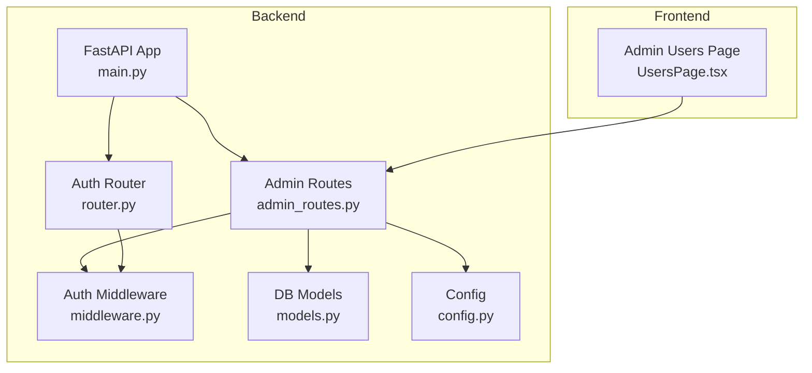
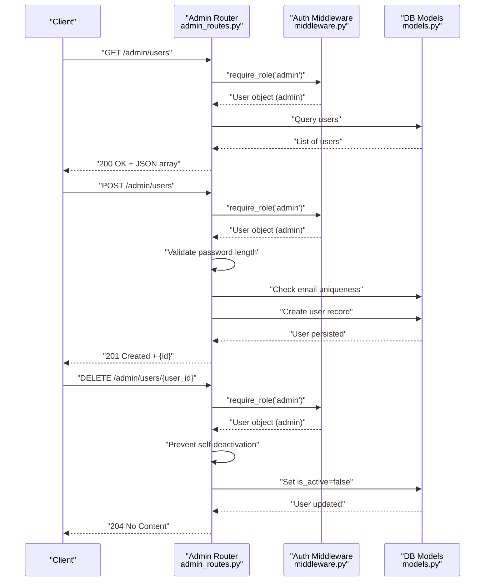
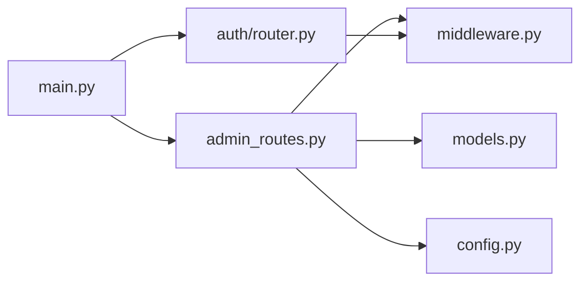

# User Management API

<cite>
**Referenced Files in This Document**
- [admin_routes.py](file://safe4ai-pilot/app/api/admin_routes.py)
- [models.py](file://safe4ai-pilot/app/db/models.py)
- [middleware.py](file://safe4ai-pilot/app/auth/middleware.py)
- [router.py](file://safe4ai-pilot/app/auth/router.py)
- [config.py](file://safe4ai-pilot/app/config.py)
- [main.py](file://safe4ai-pilot/app/main.py)
- [UsersPage.tsx](file://safe4ai-pilot/frontend/src/pages/admin/UsersPage.tsx)
- [test_admin.py](file://safe4ai-pilot/tests/test_admin.py)
</cite>

## Table of Contents
1. [Introduction](#introduction)
2. [Project Structure](#project-structure)
3. [Core Components](#core-components)
4. [Architecture Overview](#architecture-overview)
5. [Detailed Component Analysis](#detailed-component-analysis)
6. [Dependency Analysis](#dependency-analysis)
7. [Performance Considerations](#performance-considerations)
8. [Troubleshooting Guide](#troubleshooting-guide)
9. [Conclusion](#conclusion)
10. [Appendices](#appendices)

## Introduction
This document provides comprehensive API documentation for user management endpoints focused on administrative user provisioning and account lifecycle management. It covers HTTP methods, URL patterns, request/response schemas for user CRUD operations, authentication and authorization requirements, password validation rules, email uniqueness constraints, and error handling scenarios. Practical examples and curl commands are included for common administrative workflows such as user onboarding and deactivation.

## Project Structure
The user management API resides in the admin routes module and integrates with authentication middleware, database models, and configuration settings. The frontend admin page consumes these endpoints to present a user interface for administrators.

**Diagram sources**
- [main.py:63-101](file://safe4ai-pilot/app/main.py#L63-L101)
- [admin_routes.py:43-44](file://safe4ai-pilot/app/api/admin_routes.py#L43-L44)
- [middleware.py:19-82](file://safe4ai-pilot/app/auth/middleware.py#L19-L82)
- [router.py:24-28](file://safe4ai-pilot/app/auth/router.py#L24-L28)
- [models.py:52-62](file://safe4ai-pilot/app/db/models.py#L52-L62)
- [config.py:7-47](file://safe4ai-pilot/app/config.py#L7-L47)
- [UsersPage.tsx:18-20](file://safe4ai-pilot/frontend/src/pages/admin/UsersPage.tsx#L18-L20)

**Section sources**
- [main.py:63-101](file://safe4ai-pilot/app/main.py#L63-L101)
- [admin_routes.py:43-44](file://safe4ai-pilot/app/api/admin_routes.py#L43-L44)

## Core Components
- Admin user management endpoints:
  - List users
  - Create user
  - Deactivate user
- Authentication and authorization:
  - JWT-based authentication with cookie storage
  - Role-based access control enforcing admin privileges
- Data models:
  - User entity with unique email, role, activity status, and timestamps
- Validation and constraints:
  - Password minimum length requirement
  - Email uniqueness enforced at the database level

**Section sources**
- [admin_routes.py:297-351](file://safe4ai-pilot/app/api/admin_routes.py#L297-L351)
- [models.py:52-62](file://safe4ai-pilot/app/db/models.py#L52-L62)
- [middleware.py:51-82](file://safe4ai-pilot/app/auth/middleware.py#L51-L82)

## Architecture Overview
The user management endpoints are part of the admin router and protected by role-based access control. Requests are authenticated via JWT cookies, validated by the auth middleware, and authorized by the role enforcement dependency. Database operations leverage SQLAlchemy models and sessions.

**Diagram sources**
- [admin_routes.py:297-351](file://safe4ai-pilot/app/api/admin_routes.py#L297-L351)
- [middleware.py:74-82](file://safe4ai-pilot/app/auth/middleware.py#L74-L82)
- [models.py:52-62](file://safe4ai-pilot/app/db/models.py#L52-L62)

## Detailed Component Analysis

### Endpoint: List Users
- Method: GET
- URL: /admin/users
- Authentication: Requires JWT cookie with active admin user
- Authorization: Admin role enforced
- Response: Array of user objects with fields: id, email, role, is_active, created_at
- Rate limit: 100/minute

Example request:
- Headers: Cookie: access_token=... (JWT)
- Response: 200 OK with JSON array

Practical example:
- Use the frontend admin users page to list users.

**Section sources**
- [admin_routes.py:297-314](file://safe4ai-pilot/app/api/admin_routes.py#L297-L314)
- [UsersPage.tsx:18-28](file://safe4ai-pilot/frontend/src/pages/admin/UsersPage.tsx#L18-L28)

### Endpoint: Create User
- Method: POST
- URL: /admin/users
- Authentication: Requires JWT cookie with active admin user
- Authorization: Admin role enforced
- Request body schema:
  - email: string (unique)
  - password: string (minimum 12 characters)
  - role: string (enum: admin, pilot_user; default: pilot_user)
- Response: JSON object with id field
- Status codes:
  - 201 Created on success
  - 400 Bad Request for self-deactivation attempts (handled by deactivate endpoint)
  - 409 Conflict if email already registered
  - 422 Unprocessable Entity if password too short
  - 403 Forbidden if not admin
  - 401 Unauthorized if not authenticated

Validation rules:
- Password minimum length: 12 characters
- Email uniqueness enforced by database constraint

Example request:
- Headers: Cookie: access_token=..., Content-Type: application/json
- Body:
  - email: "user@example.com"
  - password: "aVeryLongSecurePassword123!"
  - role: "pilot_user"

Example response:
- 201 Created
- Body: {"id": "generated-user-id"}

curl example:
- curl -X POST https://your-host/admin/users -H "Cookie: access_token=..." -H "Content-Type: application/json" -d '{"email":"user@example.com","password":"aVeryLongSecurePassword123!","role":"pilot_user"}'

**Section sources**
- [admin_routes.py:56-60](file://safe4ai-pilot/app/api/admin_routes.py#L56-L60)
- [admin_routes.py:317-336](file://safe4ai-pilot/app/api/admin_routes.py#L317-L336)
- [models.py:52-62](file://safe4ai-pilot/app/db/models.py#L52-L62)
- [test_admin.py:343-374](file://safe4ai-pilot/tests/test_admin.py#L343-L374)

### Endpoint: Deactivate User
- Method: DELETE
- URL: /admin/users/{user_id}
- Authentication: Requires JWT cookie with active admin user
- Authorization: Admin role enforced
- Restrictions:
  - Cannot deactivate own account
  - Cannot deactivate non-existent user
- Response: 204 No Content on success
- Status codes:
  - 204 No Content on success
  - 400 Bad Request if attempting to deactivate self
  - 404 Not Found if user does not exist
  - 403 Forbidden if not admin
  - 401 Unauthorized if not authenticated

curl example:
- curl -X DELETE https://your-host/admin/users/{user_id} -H "Cookie: access_token=..."

**Section sources**
- [admin_routes.py:339-351](file://safe4ai-pilot/app/api/admin_routes.py#L339-L351)
- [test_admin.py:376-400](file://safe4ai-pilot/tests/test_admin.py#L376-L400)

### Authentication and Authorization
- Authentication:
  - JWT cookie named access_token
  - Cookie attributes: HttpOnly, SameSite=Strict, Secure based on settings
  - Expiration: 8 hours
- Authorization:
  - Role enforcement via require_role("admin")
  - Active user check during authentication
- Password hashing:
  - bcrypt-based hashing for stored passwords

Security considerations:
- Enforce HTTPS for secure cookies when enabled in settings
- Prevent timing attacks by verifying credentials consistently
- Brute-force protection increments failure counters and locks accounts temporarily

**Section sources**
- [router.py:39-105](file://safe4ai-pilot/app/auth/router.py#L39-L105)
- [middleware.py:51-82](file://safe4ai-pilot/app/auth/middleware.py#L51-L82)
- [config.py:7-47](file://safe4ai-pilot/app/config.py#L7-L47)

### Data Model: User
- Fields:
  - id: string (primary key)
  - email: string (unique, not null)
  - password_hash: string (not null)
  - role: enum (admin, pilot_user; default pilot_user)
  - created_at: timestamp (server default)
  - is_active: boolean (default true)
  - failed_login_count: integer (default 0)
  - locked_until: timestamp (nullable)
- Indexes:
  - email is indexed for uniqueness and lookups

**Section sources**
- [models.py:52-62](file://safe4ai-pilot/app/db/models.py#L52-L62)

## Dependency Analysis
The admin user management endpoints depend on:
- Authentication middleware for JWT extraction and validation
- Role enforcement for admin-only access
- Database models for user persistence and uniqueness constraints
- Configuration for cookie security and rate limiting

**Diagram sources**
- [admin_routes.py:20-43](file://safe4ai-pilot/app/api/admin_routes.py#L20-L43)
- [middleware.py:19-82](file://safe4ai-pilot/app/auth/middleware.py#L19-L82)
- [models.py:52-62](file://safe4ai-pilot/app/db/models.py#L52-L62)
- [config.py:7-47](file://safe4ai-pilot/app/config.py#L7-L47)
- [main.py:63-101](file://safe4ai-pilot/app/main.py#L63-L101)

**Section sources**
- [admin_routes.py:20-43](file://safe4ai-pilot/app/api/admin_routes.py#L20-L43)
- [main.py:63-101](file://safe4ai-pilot/app/main.py#L63-L101)

## Performance Considerations
- Rate limiting:
  - Admin endpoints use rate limit decorators to control request frequency
- Database queries:
  - User listing orders by creation time; ensure appropriate indexing on created_at
- Payload size:
  - Body size limit enforced globally via middleware
- Token handling:
  - JWT cookie usage avoids sending tokens in headers for browser clients

[No sources needed since this section provides general guidance]

## Troubleshooting Guide
Common issues and resolutions:
- 401 Unauthorized:
  - Missing or invalid access_token cookie
  - User inactive or not found
- 403 Forbidden:
  - Non-admin user attempting admin endpoint
- 409 Conflict (create user):
  - Email already registered
- 422 Unprocessable Entity (create user):
  - Password shorter than 12 characters
- 400 Bad Request (deactivate user):
  - Attempting to deactivate own account
- 404 Not Found (deactivate user):
  - Target user does not exist

Verification via tests:
- User listing returns 200
- Create user returns 201 with id
- Short password rejected with 422
- Duplicate email rejected with 409
- Self-deactivation rejected with 400
- Unknown user deactivation returns 404

**Section sources**
- [test_admin.py:329-430](file://safe4ai-pilot/tests/test_admin.py#L329-L430)

## Conclusion
The user management API provides secure, admin-only endpoints for listing, creating, and deactivating users. It enforces strict authentication and authorization, validates password strength, and ensures email uniqueness. Administrative restrictions prevent self-deactivation and unauthorized access. The documented workflows and error handling enable reliable operational procedures for user provisioning and lifecycle management.

[No sources needed since this section summarizes without analyzing specific files]

## Appendices

### API Definitions

- List Users
  - Method: GET
  - URL: /admin/users
  - Auth: JWT cookie (admin)
  - Response: 200 OK, array of user objects
  - Example: curl -H "Cookie: access_token=..." https://your-host/admin/users

- Create User
  - Method: POST
  - URL: /admin/users
  - Auth: JWT cookie (admin)
  - Request body:
    - email: string
    - password: string (min 12 chars)
    - role: string (admin or pilot_user)
  - Response: 201 Created, {"id": string}
  - Example: curl -X POST -H "Cookie: access_token=..." -H "Content-Type: application/json" -d '{"email":"user@example.com","password":"aVeryLongSecurePassword123!","role":"pilot_user"}' https://your-host/admin/users

- Deactivate User
  - Method: DELETE
  - URL: /admin/users/{user_id}
  - Auth: JWT cookie (admin)
  - Response: 204 No Content
  - Example: curl -X DELETE -H "Cookie: access_token=..." https://your-host/admin/users/{user_id}

### Request/Response Schemas

- Create User Request
  - email: string
  - password: string (min length 12)
  - role: string (admin or pilot_user)

- Create User Response
  - id: string

- List Users Response
  - Array of objects with:
    - id: string
    - email: string
    - role: string
    - is_active: boolean
    - created_at: timestamp

**Section sources**
- [admin_routes.py:56-60](file://safe4ai-pilot/app/api/admin_routes.py#L56-L60)
- [admin_routes.py:297-314](file://safe4ai-pilot/app/api/admin_routes.py#L297-L314)
- [admin_routes.py:317-336](file://safe4ai-pilot/app/api/admin_routes.py#L317-L336)