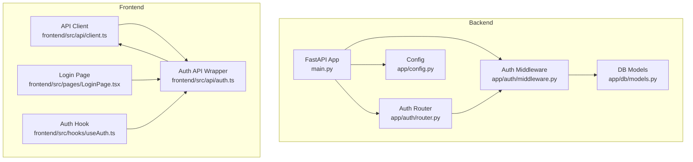
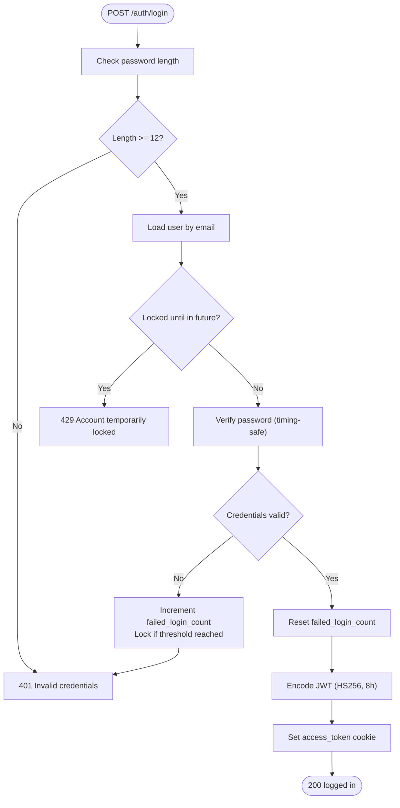
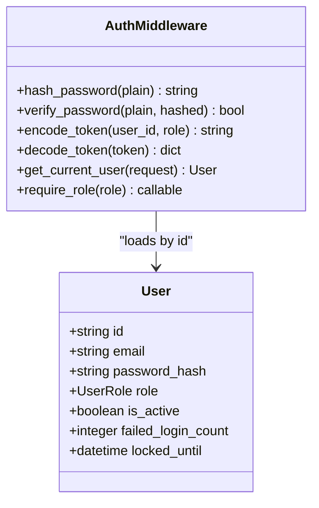
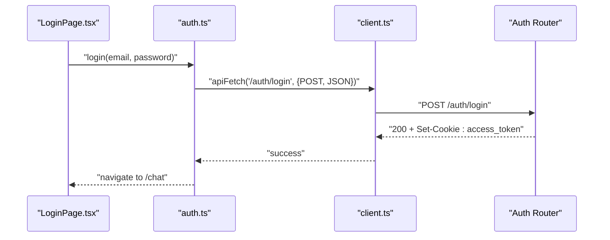
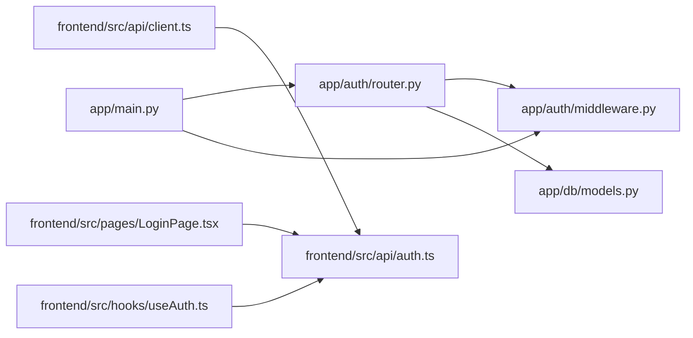

# Authentication API

<cite>
**Referenced Files in This Document**
- [router.py](file://safe4ai-pilot/app/auth/router.py)
- [middleware.py](file://safe4ai-pilot/app/auth/middleware.py)
- [models.py](file://safe4ai-pilot/app/db/models.py)
- [config.py](file://safe4ai-pilot/app/config.py)
- [main.py](file://safe4ai-pilot/app/main.py)
- [auth.ts](file://safe4ai-pilot/frontend/src/api/auth.ts)
- [client.ts](file://safe4ai-pilot/frontend/src/api/client.ts)
- [LoginPage.tsx](file://safe4ai-pilot/frontend/src/pages/LoginPage.tsx)
- [useAuth.ts](file://safe4ai-pilot/frontend/src/hooks/useAuth.ts)
- [test_auth.py](file://safe4ai-pilot/tests/test_auth.py)
- [.env.example](file://safe4ai-pilot/.env.example)
</cite>

## Table of Contents
1. [Introduction](#introduction)
2. [Project Structure](#project-structure)
3. [Core Components](#core-components)
4. [Architecture Overview](#architecture-overview)
5. [Detailed Component Analysis](#detailed-component-analysis)
6. [Dependency Analysis](#dependency-analysis)
7. [Performance Considerations](#performance-considerations)
8. [Troubleshooting Guide](#troubleshooting-guide)
9. [Conclusion](#conclusion)
10. [Appendices](#appendices)

## Introduction
This document provides comprehensive API documentation for authentication endpoints focused on user login, logout, and session management. It covers HTTP methods, URL patterns, request/response schemas, JWT token handling, authentication middleware, rate limiting configuration, and security considerations. Practical examples using curl and code snippets are included, along with error responses and best practices for secure token storage and transmission.

## Project Structure
The authentication system spans backend FastAPI routes and middleware, database models, configuration, and a frontend client that consumes the API. The backend exposes two primary endpoints under the /auth prefix, manages cookies for JWT storage, and enforces rate limits and brute-force protections. The frontend integrates with the backend via a shared fetch client configured for credential inclusion and cookie-based authentication.



**Diagram sources**
- [main.py:63-101](file://safe4ai-pilot/app/main.py#L63-L101)
- [router.py:24-125](file://safe4ai-pilot/app/auth/router.py#L24-L125)
- [middleware.py:1-83](file://safe4ai-pilot/app/auth/middleware.py#L1-L83)
- [models.py:45-56](file://safe4ai-pilot/app/db/models.py#L45-L56)
- [config.py:5-28](file://safe4ai-pilot/app/config.py#L5-L28)
- [client.ts:1-20](file://safe4ai-pilot/frontend/src/api/client.ts#L1-L20)
- [auth.ts:1-17](file://safe4ai-pilot/frontend/src/api/auth.ts#L1-L17)
- [LoginPage.tsx:17-35](file://safe4ai-pilot/frontend/src/pages/LoginPage.tsx#L17-L35)
- [useAuth.ts:5-27](file://safe4ai-pilot/frontend/src/hooks/useAuth.ts#L5-L27)

**Section sources**
- [main.py:63-101](file://safe4ai-pilot/app/main.py#L63-L101)
- [router.py:24-125](file://safe4ai-pilot/app/auth/router.py#L24-L125)
- [middleware.py:1-83](file://safe4ai-pilot/app/auth/middleware.py#L1-L83)
- [models.py:45-56](file://safe4ai-pilot/app/db/models.py#L45-L56)
- [config.py:5-28](file://safe4ai-pilot/app/config.py#L5-L28)
- [client.ts:1-20](file://safe4ai-pilot/frontend/src/api/client.ts#L1-L20)
- [auth.ts:1-17](file://safe4ai-pilot/frontend/src/api/auth.ts#L1-L17)
- [LoginPage.tsx:17-35](file://safe4ai-pilot/frontend/src/pages/LoginPage.tsx#L17-L35)
- [useAuth.ts:5-27](file://safe4ai-pilot/frontend/src/hooks/useAuth.ts#L5-L27)

## Core Components
- Authentication Router (/auth):
  - POST /auth/login: Validates credentials, applies brute-force protection, and sets an HTTP-only JWT cookie.
  - POST /auth/logout: Clears the JWT cookie.
- Authentication Middleware:
  - Password hashing and verification (bcrypt).
  - JWT encoding/decoding with HS256 and 8-hour expiry.
  - Cookie-based authentication extraction and role-based access control.
- Database Models:
  - User entity with role, active status, and login attempt tracking.
- Frontend API:
  - Shared fetch client configured with credentials and JSON headers.
  - Auth wrapper functions for login, logout, and user info retrieval.
- Rate Limiting and Security:
  - SlowAPI rate limiter applied to auth endpoints.
  - Secure cookie attributes (HTTP-only, SameSite=strict, Secure based on settings).
  - Brute-force protection with lock thresholds and lockout duration.

**Section sources**
- [router.py:39-125](file://safe4ai-pilot/app/auth/router.py#L39-L125)
- [middleware.py:25-83](file://safe4ai-pilot/app/auth/middleware.py#L25-L83)
- [models.py:45-56](file://safe4ai-pilot/app/db/models.py#L45-L56)
- [client.ts:3-15](file://safe4ai-pilot/frontend/src/api/client.ts#L3-L15)
- [auth.ts:10-16](file://safe4ai-pilot/frontend/src/api/auth.ts#L10-L16)

## Architecture Overview
The authentication flow integrates frontend, backend, and database layers. The frontend sends credentials to the backend, which validates them, updates login counters, issues a signed JWT in an HTTP-only cookie, and redirects the user. Subsequent requests include the cookie automatically, enabling middleware to authenticate and authorize the user.

```mermaid
sequenceDiagram
participant FE as "Frontend"
participant API as "Auth Router<br/>POST /auth/login"
participant MW as "Auth Middleware<br/>encode_token"
participant DB as "DB Models<br/>User"
FE->>API : "POST /auth/login {email, password}"
API->>DB : "Query user by email"
API->>API : "Verify password (timing-safe)"
API->>DB : "Update failed_login_count / locked_until"
API->>MW : "Encode JWT (HS256, 8h expiry)"
MW-->>API : "JWT string"
API-->>FE : "Set-Cookie : access_token=JWT; HttpOnly; SameSite=Strict; Secure=<enforce_https>"
```

**Diagram sources**
- [router.py:39-105](file://safe4ai-pilot/app/auth/router.py#L39-L105)
- [middleware.py:35-43](file://safe4ai-pilot/app/auth/middleware.py#L35-L43)
- [models.py:45-56](file://safe4ai-pilot/app/db/models.py#L45-L56)

**Section sources**
- [router.py:39-105](file://safe4ai-pilot/app/auth/router.py#L39-L105)
- [middleware.py:35-43](file://safe4ai-pilot/app/auth/middleware.py#L35-L43)
- [models.py:45-56](file://safe4ai-pilot/app/db/models.py#L45-L56)

## Detailed Component Analysis

### Authentication Endpoints

#### POST /auth/login
- Purpose: Authenticate a user and set an HTTP-only JWT cookie.
- Rate Limit: 5 requests per minute (SlowAPI).
- Request Body:
  - email: string (required)
  - password: string (minimum length enforced server-side)
- Response:
  - 200 OK with JSON message on success.
  - Sets a cookie named access_token with:
    - HttpOnly: prevents XSS exposure.
    - SameSite=Strict: mitigates CSRF.
    - Secure=<enforce_https>: transmitted only over HTTPS when enabled.
    - Max-Age=28800 seconds (8 hours).
- Behavior:
  - Enforces minimum password length.
  - Checks account lock status before verifying credentials.
  - On success: resets failed login attempts.
  - On failure: increments failed attempts and may lock the account.



**Diagram sources**
- [router.py:39-105](file://safe4ai-pilot/app/auth/router.py#L39-L105)

**Section sources**
- [router.py:39-105](file://safe4ai-pilot/app/auth/router.py#L39-L105)

#### POST /auth/logout
- Purpose: Clear the JWT cookie to log out the user.
- Response:
  - 200 OK with JSON message.
  - Sets access_token cookie with Max-Age=0 to expire immediately.

**Section sources**
- [router.py:108-125](file://safe4ai-pilot/app/auth/router.py#L108-L125)

### JWT Token Handling and Middleware
- Encoding:
  - Payload includes subject (user ID), role, issued-at, and expiration (8 hours).
  - Signed with HS256 using a secret key from settings.
- Decoding:
  - Verifies signature and extracts claims.
  - Raises on invalid/expired tokens.
- Cookie Extraction:
  - Retrieves access_token from request cookies.
  - Rejects missing or invalid tokens.
- Role-Based Access Control:
  - Provides a dependency to enforce required roles.



**Diagram sources**
- [middleware.py:25-83](file://safe4ai-pilot/app/auth/middleware.py#L25-L83)
- [models.py:45-56](file://safe4ai-pilot/app/db/models.py#L45-L56)

**Section sources**
- [middleware.py:25-83](file://safe4ai-pilot/app/auth/middleware.py#L25-L83)
- [models.py:45-56](file://safe4ai-pilot/app/db/models.py#L45-L56)

### Frontend Integration
- API Client:
  - Fetch wrapper with credentials: include and JSON headers.
- Auth API:
  - login(email, password): posts to /auth/login.
  - logout(): posts to /auth/logout.
  - getMe(): retrieves current user info.
- Login Page:
  - Validates form inputs and handles server errors.
  - On success, invalidates queries and navigates to chat.
- Auth Hook:
  - Provides authentication state and sign-out flow.



**Diagram sources**
- [LoginPage.tsx:26-35](file://safe4ai-pilot/frontend/src/pages/LoginPage.tsx#L26-L35)
- [auth.ts:10-11](file://safe4ai-pilot/frontend/src/api/auth.ts#L10-L11)
- [client.ts:3-15](file://safe4ai-pilot/frontend/src/api/client.ts#L3-L15)
- [router.py:39-105](file://safe4ai-pilot/app/auth/router.py#L39-L105)

**Section sources**
- [client.ts:3-15](file://safe4ai-pilot/frontend/src/api/client.ts#L3-L15)
- [auth.ts:10-16](file://safe4ai-pilot/frontend/src/api/auth.ts#L10-L16)
- [LoginPage.tsx:26-35](file://safe4ai-pilot/frontend/src/pages/LoginPage.tsx#L26-L35)
- [useAuth.ts:14-18](file://safe4ai-pilot/frontend/src/hooks/useAuth.ts#L14-L18)

### Rate Limiting and Security
- Rate Limiting:
  - SlowAPI limiter registered on the app state and applied to /auth/login.
  - Exceeding the limit returns 429 Too Many Requests.
- Security Headers:
  - Secure headers middleware applied globally.
- Cookie Security:
  - HttpOnly, SameSite=Strict, Secure=<enforce_https>.
- Brute Force Protection:
  - Tracks failed attempts and locks accounts temporarily after threshold breaches.

**Section sources**
- [main.py:66-67](file://safe4ai-pilot/app/main.py#L66-L67)
- [router.py:40](file://safe4ai-pilot/app/auth/router.py#L40)
- [router.py:22](file://safe4ai-pilot/app/auth/router.py#L22)
- [router.py:53-65](file://safe4ai-pilot/app/auth/router.py#L53-L65)
- [main.py:78-84](file://safe4ai-pilot/app/main.py#L78-L84)

## Dependency Analysis
The authentication system exhibits clear separation of concerns:
- Backend:
  - Router depends on middleware for token operations and on DB models for user data.
  - App registers the limiter and applies global security headers.
- Frontend:
  - Uses a shared client that enables cookie-based authentication automatically.



**Diagram sources**
- [router.py:14-17](file://safe4ai-pilot/app/auth/router.py#L14-L17)
- [middleware.py:15-17](file://safe4ai-pilot/app/auth/middleware.py#L15-L17)
- [main.py:17-18](file://safe4ai-pilot/app/main.py#L17-L18)
- [client.ts:1-20](file://safe4ai-pilot/frontend/src/api/client.ts#L1-L20)
- [auth.ts:1-17](file://safe4ai-pilot/frontend/src/api/auth.ts#L1-L17)

**Section sources**
- [router.py:14-17](file://safe4ai-pilot/app/auth/router.py#L14-L17)
- [middleware.py:15-17](file://safe4ai-pilot/app/auth/middleware.py#L15-L17)
- [main.py:17-18](file://safe4ai-pilot/app/main.py#L17-L18)
- [client.ts:1-20](file://safe4ai-pilot/frontend/src/api/client.ts#L1-L20)
- [auth.ts:1-17](file://safe4ai-pilot/frontend/src/api/auth.ts#L1-L17)

## Performance Considerations
- Token Expiry: 8-hour expiry reduces long-lived cookie risks; consider sliding sessions if needed.
- Rate Limits: 5/minute for login prevents brute-force attacks; adjust based on deployment needs.
- Database Queries: Single-user lookup per login; ensure indexing on email for performance.
- Cookie Size: Minimal payload in JWT; avoid large claims to reduce cookie overhead.

## Troubleshooting Guide
Common issues and resolutions:
- Invalid Credentials (401):
  - Occurs when password length < 12 or credentials do not match.
  - Verify credentials and ensure minimum password length.
- Account Temporarily Locked (429):
  - Triggered when failed attempts exceed threshold.
  - Wait for lockout period or reset via administrative actions.
- Not Authenticated (401):
  - Missing or invalid access_token cookie.
  - Ensure cookies are enabled and credentials are included in requests.
- Rate Limit Exceeded (429):
  - Exceeded 5 requests per minute on /auth/login.
  - Retry after the reset window.

**Section sources**
- [router.py:48-49](file://safe4ai-pilot/app/auth/router.py#L48-L49)
- [router.py:64-65](file://safe4ai-pilot/app/auth/router.py#L64-L65)
- [middleware.py:56-64](file://safe4ai-pilot/app/auth/middleware.py#L56-L64)
- [test_auth.py:109-111](file://safe4ai-pilot/tests/test_auth.py#L109-L111)
- [test_auth.py:140-141](file://safe4ai-pilot/tests/test_auth.py#L140-L141)

## Conclusion
The authentication system provides robust cookie-based JWT handling with built-in rate limiting and brute-force protection. The frontend integrates seamlessly via a shared fetch client, ensuring secure and consistent authentication behavior across the application.

## Appendices

### API Reference

- POST /auth/login
  - Request: { email: string, password: string }
  - Response: 200 { message: "logged in" }
  - Cookies: access_token (HttpOnly, SameSite=Strict, Secure=<enforce_https>, Max-Age=28800)
  - Notes: Minimum password length enforced server-side; rate limit 5/minute.

- POST /auth/logout
  - Request: none
  - Response: 200 { message: "logged out" }
  - Cookies: access_token cleared (Max-Age=0)

- GET /me
  - Request: requires valid access_token cookie
  - Response: 200 { id, email, role, is_active }

**Section sources**
- [router.py:39-125](file://safe4ai-pilot/app/auth/router.py#L39-L125)
- [auth.ts:16](file://safe4ai-pilot/frontend/src/api/auth.ts#L16)

### Example Usage

- curl login:
  - curl -c cookies.txt -X POST https://<host>/auth/login -H "Content-Type: application/json" -d '{"email":"user@example.com","password":"<min-12-char-password>"}'

- curl logout:
  - curl -b cookies.txt -X POST https://<host>/auth/logout

- Frontend usage (React):
  - Use login(email, password) from frontend/src/api/auth.ts.
  - On success, navigate to chat; on error, display "Invalid credentials".

**Section sources**
- [auth.ts:10-11](file://safe4ai-pilot/frontend/src/api/auth.ts#L10-L11)
- [LoginPage.tsx:26-35](file://safe4ai-pilot/frontend/src/pages/LoginPage.tsx#L26-L35)

### Security Best Practices
- Secret Key Management:
  - Set SECRET_KEY to a strong, random 64-character hex string in .env.
  - Do not deploy with the default "change-me".
- HTTPS Enforcement:
  - Enable ENFORCE_HTTPS in production to set Secure flag on cookies.
- Cookie Attributes:
  - Keep HttpOnly, SameSite=Strict, and Secure enabled.
- Token Storage:
  - Rely on HTTP-only cookies; avoid storing tokens in localStorage or sessionStorage.
- Rate Limiting:
  - Monitor SlowAPI logs and adjust limits as needed.

**Section sources**
- [.env.example:6](file://safe4ai-pilot/.env.example#L6)
- [config.py:11](file://safe4ai-pilot/app/config.py#L11)
- [router.py:96-103](file://safe4ai-pilot/app/auth/router.py#L96-L103)
- [main.py:66-67](file://safe4ai-pilot/app/main.py#L66-L67)