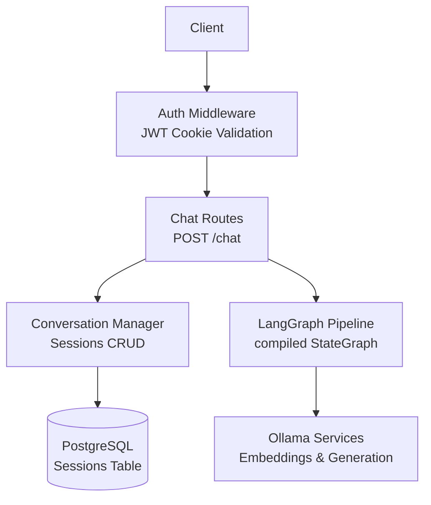
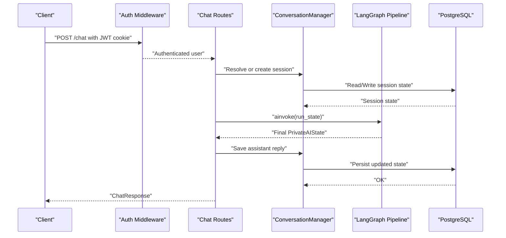
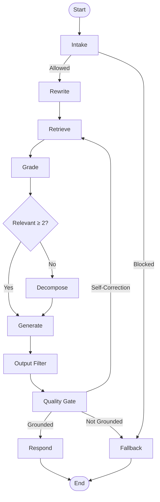
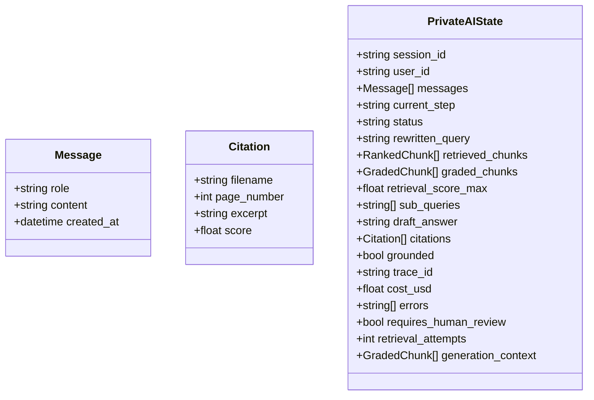
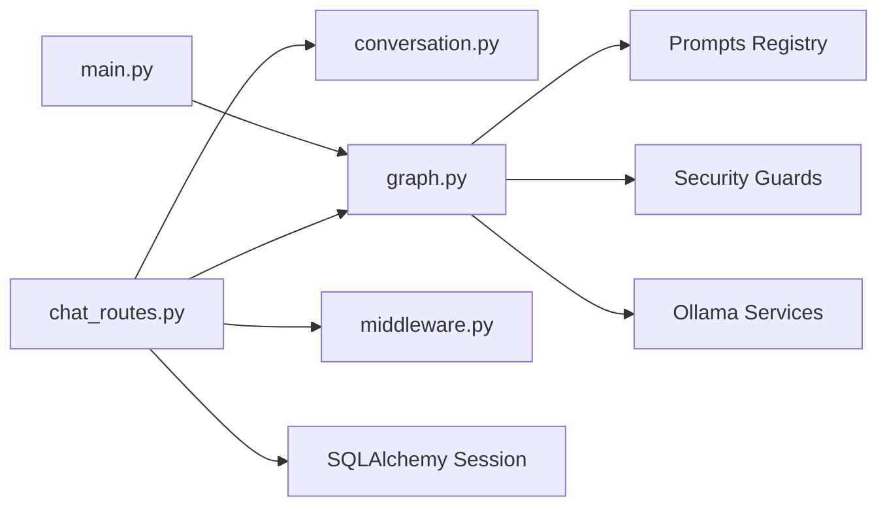

# Blocking Chat Endpoint

<cite>
**Referenced Files in This Document**
- [chat_routes.py](file://safe4ai-pilot/app/api/chat_routes.py)
- [models.py](file://safe4ai-pilot/app/models.py)
- [conversation.py](file://safe4ai-pilot/app/services/conversation.py)
- [graph.py](file://safe4ai-pilot/app/agents/graph.py)
- [main.py](file://safe4ai-pilot/app/main.py)
- [middleware.py](file://safe4ai-pilot/app/auth/middleware.py)
- [router.py](file://safe4ai-pilot/app/auth/router.py)
- [test_chat.py](file://safe4ai-pilot/tests/test_chat.py)
</cite>

## Table of Contents
1. [Introduction](#introduction)
2. [Project Structure](#project-structure)
3. [Core Components](#core-components)
4. [Architecture Overview](#architecture-overview)
5. [Detailed Component Analysis](#detailed-component-analysis)
6. [Dependency Analysis](#dependency-analysis)
7. [Performance Considerations](#performance-considerations)
8. [Troubleshooting Guide](#troubleshooting-guide)
9. [Conclusion](#conclusion)
10. [Appendices](#appendices)

## Introduction
This document provides comprehensive API documentation for the blocking POST /chat endpoint designed for evaluation scripts and automated testing. It explains the endpoint’s purpose, request/response schemas, synchronous execution flow through the LangGraph pipeline, session management, error handling, rate limiting, authentication, and practical usage examples.

## Project Structure
The blocking chat endpoint resides in the FastAPI application under the chat routes module. It integrates with:
- Authentication middleware for JWT-based access
- Conversation manager for session creation/loading/persistence
- LangGraph pipeline for synchronous RAG orchestration
- Application lifecycle initialization that compiles the graph once and reuses it

**Diagram sources**
- [chat_routes.py:115-148](file://safe4ai-pilot/app/api/chat_routes.py#L115-L148)
- [conversation.py:26-70](file://safe4ai-pilot/app/services/conversation.py#L26-L70)
- [graph.py:43-352](file://safe4ai-pilot/app/agents/graph.py#L43-L352)
- [main.py:28-61](file://safe4ai-pilot/app/main.py#L28-L61)

**Section sources**
- [chat_routes.py:115-148](file://safe4ai-pilot/app/api/chat_routes.py#L115-L148)
- [main.py:28-61](file://safe4ai-pilot/app/main.py#L28-L61)

## Core Components
- ChatRequest: Defines the input schema for the endpoint.
- ChatResponse: Defines the output schema returned by the endpoint.
- PrivateAIState: The shared state model driving the LangGraph pipeline.
- ConversationManager: Handles session creation, loading, and persistence.
- LangGraph pipeline: Orchestrates intake, rewriting, retrieval, grading, decomposition, generation, filtering, quality gating, responding, and fallback.

Key endpoint characteristics:
- Purpose: Provide a synchronous, blocking chat response suitable for evaluation and automated tests.
- Rate limit: 30 per minute per client IP.
- Authentication: Requires a valid JWT cookie set by the application.

**Section sources**
- [chat_routes.py:45-57](file://safe4ai-pilot/app/api/chat_routes.py#L45-L57)
- [models.py:49-95](file://safe4ai-pilot/app/models.py#L49-L95)
- [conversation.py:26-70](file://safe4ai-pilot/app/services/conversation.py#L26-L70)
- [graph.py:43-352](file://safe4ai-pilot/app/agents/graph.py#L43-L352)

## Architecture Overview
The synchronous chat flow is as follows:
1. Validate request and authenticate user via JWT cookie.
2. Resolve or create a session and load its state.
3. Construct a run state seeded with the user message.
4. Invoke the compiled LangGraph pipeline synchronously.
5. Save the assistant reply to the session.
6. Return ChatResponse with answer, citations, session_id, and trace_id.

**Diagram sources**
- [chat_routes.py:115-148](file://safe4ai-pilot/app/api/chat_routes.py#L115-L148)
- [conversation.py:26-70](file://safe4ai-pilot/app/services/conversation.py#L26-L70)
- [graph.py:43-352](file://safe4ai-pilot/app/agents/graph.py#L43-L352)
- [main.py:28-61](file://safe4ai-pilot/app/main.py#L28-L61)

## Detailed Component Analysis

### Endpoint Definition and Behavior
- Route: POST /chat
- Authentication: Required via JWT cookie; enforced by dependency.
- Rate Limit: 30 per minute per IP address.
- Behavior: Synchronous invocation of the LangGraph pipeline; returns ChatResponse immediately upon completion.

Request schema (ChatRequest):
- question: string, max length 2048, required
- session_id: string, optional; if absent, a new session is created
- collection: string, default "default"

Response schema (ChatResponse):
- answer: string
- citations: array of Citation objects
- session_id: string
- trace_id: string
- cache_hit: boolean, default false

Processing logic highlights:
- Validates non-empty question.
- Ensures the graph is initialized on the application state.
- Resolves session (load or new) and builds run state.
- Invokes graph.ainvoke synchronously.
- Persists assistant reply to session.
- Returns ChatResponse.

**Section sources**
- [chat_routes.py:45-57](file://safe4ai-pilot/app/api/chat_routes.py#L45-L57)
- [chat_routes.py:115-148](file://safe4ai-pilot/app/api/chat_routes.py#L115-L148)

### Session Management
Session lifecycle:
- Creation: new_session generates a UUID, initializes PrivateAIState, persists to DB.
- Loading: load_session retrieves JSON, deserializes to PrivateAIState; raises KeyError if missing.
- Persistence: save_session writes cleaned state back to DB; enforces a 1 MB limit on state_json.
- Automatic creation: If session_id is not provided or invalid, a new session is created and loaded.

State handling:
- Messages are sanitized to remove control characters before saving.
- Run state is built with the latest user message and reset operational fields.

**Section sources**
- [conversation.py:26-70](file://safe4ai-pilot/app/services/conversation.py#L26-L70)
- [chat_routes.py:59-92](file://safe4ai-pilot/app/api/chat_routes.py#L59-L92)

### LangGraph Pipeline Execution
The pipeline orchestrates the following stages:
- Intake: Validates input and guards against unsafe queries.
- Rewrite: Rewrites the query using a prompt.
- Retrieve: Retrieves candidate chunks and reranks them.
- Grade: Grades relevance of chunks and decides next step.
- Decompose: Optionally decomposes query into subqueries.
- Generate: Builds answer from relevant context.
- Output Filter: Applies output safety checks.
- Quality Gate: Routes based on grounding and thresholds; supports self-correction loops.
- Respond/Fallback: Finalizes or falls back with a safe answer.

The compiled graph is built once during application startup and reused for all requests.

**Diagram sources**
- [graph.py:43-352](file://safe4ai-pilot/app/agents/graph.py#L43-L352)

**Section sources**
- [graph.py:43-352](file://safe4ai-pilot/app/agents/graph.py#L43-L352)
- [main.py:28-61](file://safe4ai-pilot/app/main.py#L28-L61)

### Data Models
Core models used by the endpoint and pipeline:
- Message: role, content, created_at
- Citation: filename, page_number, excerpt, score
- PrivateAIState: comprehensive state for the pipeline including messages, retrieval metadata, generation artifacts, observability fields, and routing controls

**Diagram sources**
- [models.py:7-95](file://safe4ai-pilot/app/models.py#L7-L95)

**Section sources**
- [models.py:7-95](file://safe4ai-pilot/app/models.py#L7-L95)

### Authentication and Rate Limiting
- Authentication: JWT cookie extracted by middleware; invalid or missing tokens return 401.
- Rate Limiting: Endpoint decorated with 30/minute limit using the same limiter instance as auth routes.
- Additional protections: Body size limit middleware and health checks for downstream services.

**Section sources**
- [middleware.py:51-71](file://safe4ai-pilot/app/auth/middleware.py#L51-L71)
- [router.py:21-22](file://safe4ai-pilot/app/auth/router.py#L21-L22)
- [chat_routes.py:115-116](file://safe4ai-pilot/app/api/chat_routes.py#L115-L116)
- [main.py:87-95](file://safe4ai-pilot/app/main.py#L87-L95)

### Error Handling
- Validation errors:
  - Empty question yields 422 Unprocessable Entity.
- Pipeline readiness:
  - If graph is not initialized, returns 503 Service Unavailable.
- Pipeline invocation:
  - Exceptions during graph.ainvoke are logged and surfaced as 500 Internal Server Error.
- Session persistence:
  - save_session warnings are logged; failures during persistence do not abort the response.
- Database/session errors:
  - Missing session raises KeyError; load_session raises ValueError on invalid state.

**Section sources**
- [chat_routes.py:123-139](file://safe4ai-pilot/app/api/chat_routes.py#L123-L139)
- [conversation.py:42-50](file://safe4ai-pilot/app/services/conversation.py#L42-L50)
- [conversation.py:52-69](file://safe4ai-pilot/app/services/conversation.py#L52-L69)

## Dependency Analysis
High-level dependencies:
- Chat routes depend on:
  - Authentication middleware for user identity
  - Conversation manager for session operations
  - LangGraph pipeline for inference
  - SQLAlchemy session for persistence
- LangGraph pipeline depends on:
  - Retrieval and reranking components
  - Prompt registry and security filters
  - Ollama services for embeddings and generation
- Application lifecycle:
  - Builds and stores the compiled graph in app.state for reuse

**Diagram sources**
- [chat_routes.py:115-148](file://safe4ai-pilot/app/api/chat_routes.py#L115-L148)
- [conversation.py:26-70](file://safe4ai-pilot/app/services/conversation.py#L26-L70)
- [graph.py:43-352](file://safe4ai-pilot/app/agents/graph.py#L43-L352)
- [main.py:28-61](file://safe4ai-pilot/app/main.py#L28-L61)

**Section sources**
- [chat_routes.py:115-148](file://safe4ai-pilot/app/api/chat_routes.py#L115-L148)
- [graph.py:43-352](file://safe4ai-pilot/app/agents/graph.py#L43-L352)
- [main.py:28-61](file://safe4ai-pilot/app/main.py#L28-L61)

## Performance Considerations
- Synchronous execution: The endpoint blocks until the pipeline completes; latency depends on retrieval, reranking, and generation steps.
- Graph reuse: Compiled graph is built once and reused, reducing cold-start overhead.
- Session size limit: Enforced 1 MB cap on session state JSON to avoid oversized payloads.
- Pre-warming: Ollama is prewarmed to reduce first-request latency.

[No sources needed since this section provides general guidance]

## Troubleshooting Guide
Common issues and resolutions:
- 401 Not authenticated: Ensure a valid JWT cookie is present.
- 422 Question empty: Provide a non-empty question.
- 503 AI pipeline not ready: Verify service health and that the graph was initialized.
- 500 Pipeline error: Inspect logs for graph invocation failures.
- Session not found: Supply a valid session_id or omit to auto-create.
- Session state invalid: Investigate corrupted state_json and consider truncating messages.

**Section sources**
- [chat_routes.py:123-139](file://safe4ai-pilot/app/api/chat_routes.py#L123-L139)
- [conversation.py:42-50](file://safe4ai-pilot/app/services/conversation.py#L42-L50)
- [main.py:118-147](file://safe4ai-pilot/app/main.py#L118-L147)

## Conclusion
The blocking POST /chat endpoint provides a reliable, synchronous interface for evaluation and automated testing. It integrates robust session management, a production-ready LangGraph pipeline, strict authentication and rate limiting, and comprehensive error handling. Its design emphasizes simplicity for consumers while maintaining strong operational guarantees.

[No sources needed since this section summarizes without analyzing specific files]

## Appendices

### API Reference

Endpoint
- Method: POST
- Path: /chat
- Authentication: Required (JWT cookie)
- Rate Limit: 30 per minute per IP

Request Schema (ChatRequest)
- question: string, required, max length 2048
- session_id: string, optional
- collection: string, default "default"

Response Schema (ChatResponse)
- answer: string
- citations: array of Citation
- session_id: string
- trace_id: string
- cache_hit: boolean, default false

Example: curl
- curl -b "access_token=<JWT>" -X POST "$BASE_URL/chat" -H "Content-Type: application/json" -d '{"question":"What is the capital of France?","session_id":"<optional>"}'

Example: Python requests
- import requests
- s = requests.Session()
- s.cookies.set("access_token", "<JWT>")
- r = s.post(f"{BASE_URL}/chat", json={"question": "What is the capital of France?"})
- print(r.json())

Notes
- The endpoint returns immediately upon pipeline completion.
- For streaming responses, use the SSE endpoint POST /chat/stream.

**Section sources**
- [chat_routes.py:45-57](file://safe4ai-pilot/app/api/chat_routes.py#L45-L57)
- [chat_routes.py:115-148](file://safe4ai-pilot/app/api/chat_routes.py#L115-L148)
- [test_chat.py:75-98](file://safe4ai-pilot/tests/test_chat.py#L75-L98)