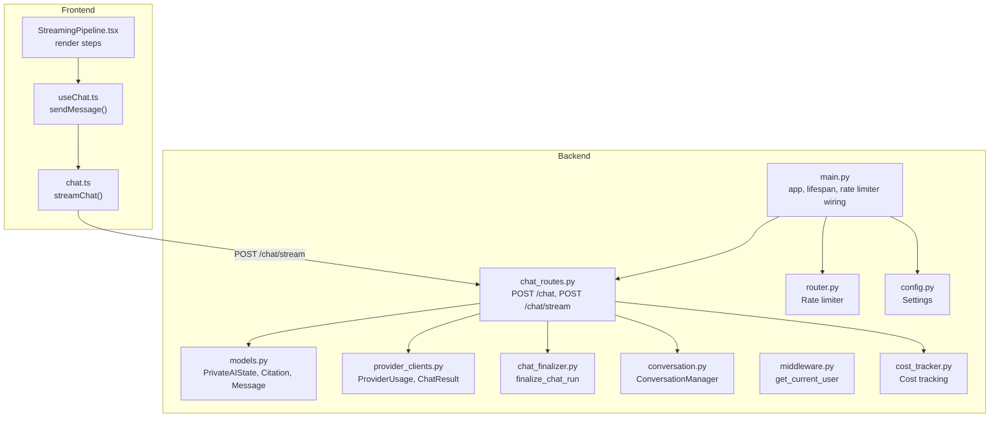
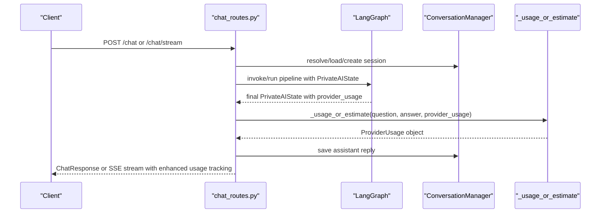
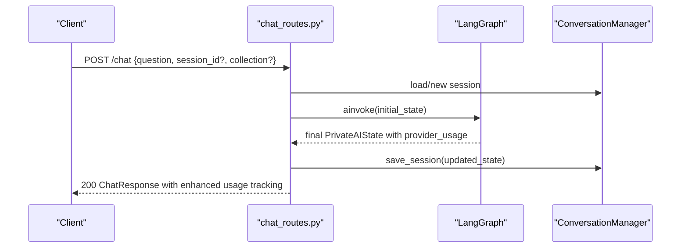
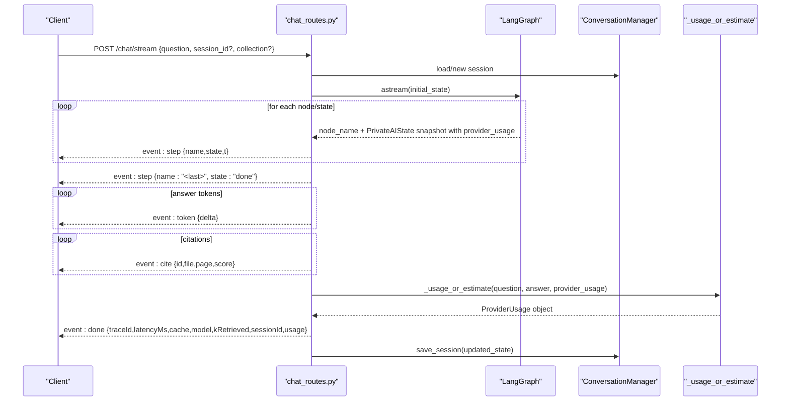
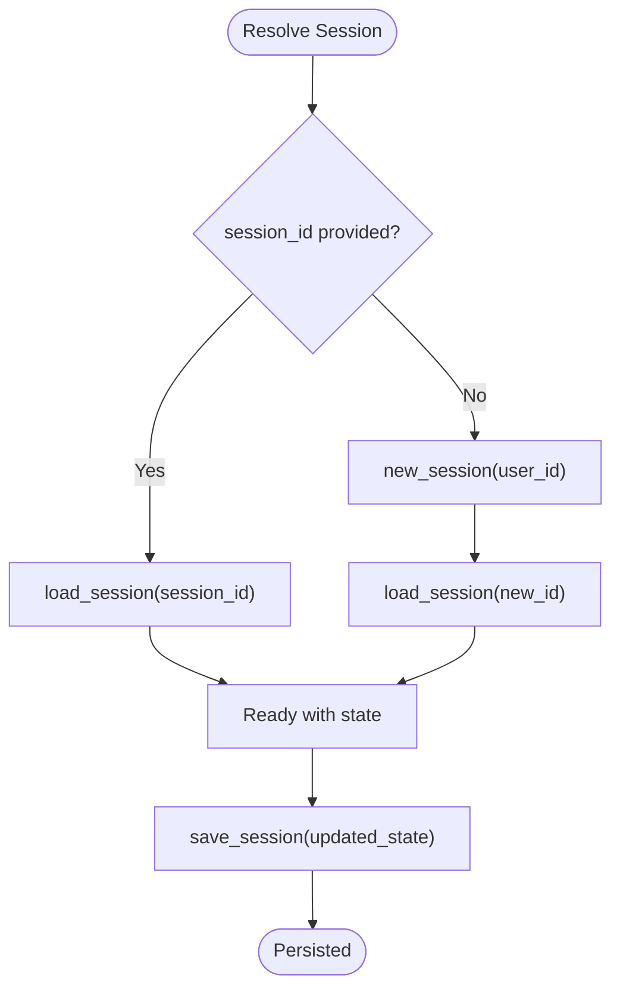
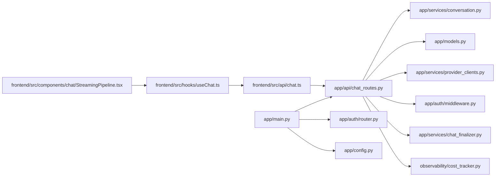

# Chat API

<cite>
**Referenced Files in This Document**
- [chat_routes.py](file://safe4ai-pilot/app/api/chat_routes.py)
- [models.py](file://safe4ai-pilot/app/models.py)
- [provider_clients.py](file://safe4ai-pilot/app/services/provider_clients.py)
- [chat_finalizer.py](file://safe4ai-pilot/app/services/chat_finalizer.py)
- [conversation.py](file://safe4ai-pilot/app/services/conversation.py)
- [middleware.py](file://safe4ai-pilot/app/auth/middleware.py)
- [router.py](file://safe4ai-pilot/app/auth/router.py)
- [main.py](file://safe4ai-pilot/app/main.py)
- [config.py](file://safe4ai-pilot/app/config.py)
- [chat.ts](file://safe4ai-pilot/frontend/src/api/chat.ts)
- [useChat.ts](file://safe4ai-pilot/frontend/src/hooks/useChat.ts)
- [StreamingPipeline.tsx](file://safe4ai-pilot/frontend/src/components/chat/StreamingPipeline.tsx)
- [test_chat.py](file://safe4ai-pilot/tests/test_chat.py)
- [cost_tracker.py](file://safe4ai-pilot/observability/cost_tracker.py)
</cite>

## Update Summary
**Changes Made**
- Updated usage calculation section to reflect enhanced ProviderUsage type handling
- Added documentation for provider_usage field in PrivateAIState
- Updated token usage tracking to use ProviderUsage type instead of deprecated usage attribute
- Enhanced type safety documentation for chat completion workflow

## Table of Contents
1. [Introduction](#introduction)
2. [Project Structure](#project-structure)
3. [Core Components](#core-components)
4. [Architecture Overview](#architecture-overview)
5. [Detailed Component Analysis](#detailed-component-analysis)
6. [Dependency Analysis](#dependency-analysis)
7. [Performance Considerations](#performance-considerations)
8. [Troubleshooting Guide](#troubleshooting-guide)
9. [Conclusion](#conclusion)
10. [Appendices](#appendices)

## Introduction
This document provides comprehensive API documentation for the chat endpoints that power user-AI interactions. It covers:
- Blocking and streaming responses for chat
- HTTP methods and URL patterns
- Request and response schemas
- Streaming event formats (SSE)
- Parameter descriptions for question input, session management, and collection selection
- Real-time interaction patterns
- Practical usage examples (curl and JavaScript fetch)
- Session persistence and conversation history management
- Error handling and rate limiting
- Enhanced token usage tracking with ProviderUsage type safety
- Performance considerations for streaming responses

## Project Structure
The chat API is implemented in the backend Python service and consumed by the React frontend. Key locations:
- Backend routes: safe4ai-pilot/app/api/chat_routes.py
- Data models: safe4ai-pilot/app/models.py
- Provider usage types: safe4ai-pilot/app/services/provider_clients.py
- Conversation persistence: safe4ai-pilot/app/services/conversation.py
- Authentication and rate limiting: safe4ai-pilot/app/auth/*
- Application bootstrap and rate limiting wiring: safe4ai-pilot/app/main.py
- Frontend streaming client: safe4ai-pilot/frontend/src/api/chat.ts
- Frontend integration hook: safe4ai-pilot/frontend/src/hooks/useChat.ts
- Frontend UI component for streaming steps: safe4ai-pilot/frontend/src/components/chat/StreamingPipeline.tsx

**Diagram sources**
- [chat_routes.py:109-244](file://safe4ai-pilot/app/api/chat_routes.py#L109-L244)
- [models.py:49-95](file://safe4ai-pilot/app/models.py#L49-L95)
- [provider_clients.py:10-22](file://safe4ai-pilot/app/services/provider_clients.py#L10-L22)
- [chat_finalizer.py:14-25](file://safe4ai-pilot/app/services/chat_finalizer.py#L14-L25)
- [conversation.py:26-117](file://safe4ai-pilot/app/services/conversation.py#L26-L117)
- [middleware.py:51-71](file://safe4ai-pilot/app/auth/middleware.py#L51-L71)
- [router.py:21-22](file://safe4ai-pilot/app/auth/router.py#L21-L22)
- [main.py:63-101](file://safe4ai-pilot/app/main.py#L63-L101)
- [config.py:5-28](file://safe4ai-pilot/app/config.py#L5-L28)
- [cost_tracker.py:16-26](file://safe4ai-pilot/observability/cost_tracker.py#L16-L26)
- [chat.ts:21-75](file://safe4ai-pilot/frontend/src/api/chat.ts#L21-L75)
- [useChat.ts:28-91](file://safe4ai-pilot/frontend/src/hooks/useChat.ts#L28-L91)
- [StreamingPipeline.tsx:13-29](file://safe4ai-pilot/frontend/src/components/chat/StreamingPipeline.tsx#L13-L29)

**Section sources**
- [chat_routes.py:109-244](file://safe4ai-pilot/app/api/chat_routes.py#L109-L244)
- [models.py:49-95](file://safe4ai-pilot/app/models.py#L49-L95)
- [provider_clients.py:10-22](file://safe4ai-pilot/app/services/provider_clients.py#L10-L22)
- [chat_finalizer.py:14-25](file://safe4ai-pilot/app/services/chat_finalizer.py#L14-L25)
- [conversation.py:26-117](file://safe4ai-pilot/app/services/conversation.py#L26-L117)
- [middleware.py:51-71](file://safe4ai-pilot/app/auth/middleware.py#L51-L71)
- [router.py:21-22](file://safe4ai-pilot/app/auth/router.py#L21-L22)
- [main.py:63-101](file://safe4ai-pilot/app/main.py#L63-L101)
- [config.py:5-28](file://safe4ai-pilot/app/config.py#L5-L28)
- [cost_tracker.py:16-26](file://safe4ai-pilot/observability/cost_tracker.py#L16-L26)
- [chat.ts:21-75](file://safe4ai-pilot/frontend/src/api/chat.ts#L21-L75)
- [useChat.ts:28-91](file://safe4ai-pilot/frontend/src/hooks/useChat.ts#L28-L91)
- [StreamingPipeline.tsx:13-29](file://safe4ai-pilot/frontend/src/components/chat/StreamingPipeline.tsx#L13-L29)

## Core Components
- ChatRequest: Input schema for both /chat and /chat/stream
  - Fields: question (required), session_id (optional), collection (default "default")
- ChatResponse: Blocking response schema for /chat
  - Fields: answer (string), citations (array of Citation), session_id (string), trace_id (string), cache_hit (boolean, default false)
- PrivateAIState: Internal state model used across the pipeline with enhanced usage tracking
  - Includes messages, current_step, status, retrieval artifacts, draft_answer, citations, trace_id, cost_usd, provider_usage (ProviderUsage), errors, and more
- ProviderUsage: Enhanced usage tracking type with token counting
  - Fields: prompt_tokens (integer), completion_tokens (integer), total_tokens (integer), source (string)
- Citation: Source metadata for answers
  - Fields: filename (string), page_number (integer), excerpt (string), score (float)
- ConversationManager: Session persistence and history management
  - Methods: new_session, load_session, save_session, get_recent_messages, maybe_summarize
- Streaming events (SSE):
  - step: indicates pipeline step transitions (name, state, t)
  - token: incremental word tokens emitted during answer generation
  - cite: citation metadata emitted per source
  - done: finalization event with traceId, latencyMs, cache, model, kRetrieved, sessionId, and optional error

**Section sources**
- [chat_routes.py:39-51](file://safe4ai-pilot/app/api/chat_routes.py#L39-L51)
- [models.py:49-95](file://safe4ai-pilot/app/models.py#L49-L95)
- [models.py:31-36](file://safe4ai-pilot/app/models.py#L31-L36)
- [provider_clients.py:10-22](file://safe4ai-pilot/app/services/provider_clients.py#L10-L22)
- [conversation.py:26-117](file://safe4ai-pilot/app/services/conversation.py#L26-L117)
- [chat.ts:6-19](file://safe4ai-pilot/frontend/src/api/chat.ts#L6-L19)

## Architecture Overview
The chat API exposes two endpoints with enhanced usage tracking:
- POST /chat: synchronous, returns the final answer and citations with ProviderUsage tracking
- POST /chat/stream: SSE streaming, emits step transitions, tokens, citations, and completion metadata with enhanced token usage calculation

**Diagram sources**
- [chat_routes.py:109-244](file://safe4ai-pilot/app/api/chat_routes.py#L109-L244)
- [conversation.py:26-117](file://safe4ai-pilot/app/services/conversation.py#L26-L117)
- [chat_routes.py:43-53](file://safe4ai-pilot/app/api/chat_routes.py#L43-L53)

## Detailed Component Analysis

### Endpoint: POST /chat (blocking)
- Method: POST
- Path: /chat
- Authentication: Required (JWT cookie validated by get_current_user)
- Rate limit: 30 per minute per IP
- Request body: ChatRequest
  - question: string (required)
  - session_id: string (optional)
  - collection: string (default "default")
- Response: ChatResponse
  - answer: string
  - citations: array of Citation
  - session_id: string
  - trace_id: string
  - cache_hit: boolean (default false)
- Behavior:
  - Validates non-empty question
  - Ensures LangGraph pipeline is initialized
  - Resolves or creates a session
  - Builds initial PrivateAIState with intake step
  - Executes graph.ainvoke to completion
  - Saves assistant reply to session
  - Calculates usage using ProviderUsage type
  - Returns ChatResponse

**Diagram sources**
- [chat_routes.py:109-142](file://safe4ai-pilot/app/api/chat_routes.py#L109-L142)
- [conversation.py:26-117](file://safe4ai-pilot/app/services/conversation.py#L26-L117)

**Section sources**
- [chat_routes.py:109-142](file://safe4ai-pilot/app/api/chat_routes.py#L109-L142)
- [chat_routes.py:39-51](file://safe4ai-pilot/app/api/chat_routes.py#L39-L51)
- [chat_routes.py:53-64](file://safe4ai-pilot/app/api/chat_routes.py#L53-L64)
- [chat_routes.py:67-86](file://safe4ai-pilot/app/api/chat_routes.py#L67-L86)
- [chat_routes.py:89-102](file://safe4ai-pilot/app/api/chat_routes.py#L89-L102)

### Endpoint: POST /chat/stream (SSE streaming)
- Method: POST
- Path: /chat/stream
- Authentication: Required (JWT cookie)
- Rate limit: 30 per minute per IP
- Request body: ChatRequest
- Streaming events:
  - event: step
    - data: { name: "embed" | "retrieve" | "rerank" | "generate", state: "active" | "done", t: number }
  - event: token
    - data: { delta: string } (word tokens emitted with ~20ms spacing)
  - event: cite
    - data: { id: string, file: string, page: number, score: number }
  - event: done
    - data: { traceId: string, latencyMs: number, cache: boolean, model: string, kRetrieved: number, sessionId: string, error?: string }
- Behavior:
  - Validates non-empty question
  - Ensures LangGraph pipeline is initialized
  - Resolves or creates a session
  - Streams node transitions as step events
  - Emits final answer as token events
  - Emits citations as cite events
  - Uses enhanced _usage_or_estimate function with ProviderUsage type
  - Emits done event with completion metadata and enhanced usage tracking
  - Saves assistant reply after streaming completes

**Diagram sources**
- [chat_routes.py:150-244](file://safe4ai-pilot/app/api/chat_routes.py#L150-L244)
- [conversation.py:26-117](file://safe4ai-pilot/app/services/conversation.py#L26-L117)
- [chat_routes.py:43-53](file://safe4ai-pilot/app/api/chat_routes.py#L43-L53)

**Section sources**
- [chat_routes.py:150-244](file://safe4ai-pilot/app/api/chat_routes.py#L150-L244)
- [chat.ts:21-75](file://safe4ai-pilot/frontend/src/api/chat.ts#L21-L75)

### Enhanced Usage Calculation and Type Safety

**Updated** The system now properly utilizes the ProviderUsage field instead of the deprecated usage attribute, with enhanced type safety across the chat completion workflow.

#### ProviderUsage Type
- ProviderUsage: Enhanced usage tracking with structured token counting
  - prompt_tokens: integer count of input tokens
  - completion_tokens: integer count of output tokens  
  - total_tokens: sum of prompt and completion tokens
  - source: string indicating usage source ("actual" or "estimated")

#### Usage Calculation Functions
- _usage_or_estimate: Enhanced function handling ProviderUsage type
  - If provider_usage is available: returns the actual ProviderUsage object
  - If provider_usage is None: estimates tokens using question and answer text
  - Returns ProviderUsage with source="estimated" when using estimation

#### PrivateAIState Enhancement
- provider_usage: ProviderUsage | None field for enhanced type safety
- Replaces deprecated usage attribute with structured ProviderUsage type
- Enables better type checking and IDE support

#### Token Estimation
- estimate_tokens: Improved token estimation using character-to-token ratio
- Uses 4 characters per token heuristic for approximate counting
- Handles edge cases for empty or whitespace-only text

**Section sources**
- [chat_routes.py:43-53](file://safe4ai-pilot/app/api/chat_routes.py#L43-L53)
- [models.py:90](file://safe4ai-pilot/app/models.py#L90)
- [provider_clients.py:10-22](file://safe4ai-pilot/app/services/provider_clients.py#L10-L22)
- [chat_routes.py:35-41](file://safe4ai-pilot/app/api/chat_routes.py#L35-L41)

### Request and Response Schemas
- ChatRequest
  - question: string (required)
  - session_id: string (optional)
  - collection: string (default "default")
- ChatResponse
  - answer: string
  - citations: array of Citation
  - session_id: string
  - trace_id: string
  - cache_hit: boolean (default false)
- Citation
  - filename: string
  - page_number: integer
  - excerpt: string
  - score: float
- PrivateAIState
  - session_id: string
  - user_id: string
  - messages: array of Message
  - current_step: enum of pipeline steps
  - status: "active" | "completed" | "failed"
  - draft_answer: string
  - citations: array of Citation
  - trace_id: string
  - cost_usd: float
  - provider_usage: ProviderUsage | None (enhanced with type safety)
  - errors: array of string
  - retrieval attempts and related fields for pipeline state

**Section sources**
- [chat_routes.py:39-51](file://safe4ai-pilot/app/api/chat_routes.py#L39-L51)
- [models.py:7-11](file://safe4ai-pilot/app/models.py#L7-L11)
- [models.py:31-36](file://safe4ai-pilot/app/models.py#L31-L36)
- [models.py:49-95](file://safe4ai-pilot/app/models.py#L49-L95)

### Streaming Event Formats
- step
  - name: "embed" | "retrieve" | "rerank" | "generate"
  - state: "active" | "done"
  - t: number (timing placeholder)
- token
  - delta: string (word token)
- cite
  - id: string (sequential index)
  - file: string (filename)
  - page: number (page number)
  - score: number (relevance score)
- done
  - traceId: string
  - latencyMs: number
  - cache: boolean
  - model: string
  - kRetrieved: number
  - sessionId: string
  - error?: string (only present on error)

Frontend parsing and handling:
- streamChat(): fetches /chat/stream, parses SSE, yields typed events
- useChat(): orchestrates sending messages, updating UI with step/token/cite/done events, and persisting session ID

**Section sources**
- [chat_routes.py:170-235](file://safe4ai-pilot/app/api/chat_routes.py#L170-L235)
- [chat.ts:6-19](file://safe4ai-pilot/frontend/src/api/chat.ts#L6-L19)
- [chat.ts:21-75](file://safe4ai-pilot/frontend/src/api/chat.ts#L21-L75)
- [useChat.ts:28-91](file://safe4ai-pilot/frontend/src/hooks/useChat.ts#L28-L91)

### Session Management and Conversation History
- Creating a session:
  - If session_id is provided and valid, loads existing session
  - Otherwise, creates a new session with an initial PrivateAIState
- Loading and saving:
  - load_session deserializes state from database
  - save_session serializes state to JSON, cleans messages, and enforces size limits
- Conversation summarization:
  - maybe_summarize can summarize long histories when exceeding a threshold
- Recent messages:
  - get_recent_messages returns the last N messages for a session

**Diagram sources**
- [chat_routes.py:53-64](file://safe4ai-pilot/app/api/chat_routes.py#L53-L64)
- [conversation.py:30-69](file://safe4ai-pilot/app/services/conversation.py#L30-L69)

**Section sources**
- [chat_routes.py:53-64](file://safe4ai-pilot/app/api/chat_routes.py#L53-L64)
- [conversation.py:26-117](file://safe4ai-pilot/app/services/conversation.py#L26-L117)

### Authentication and Authorization
- Authentication:
  - JWT cookie "access_token" is extracted and verified
  - get_current_user resolves the current user or raises 401
- Authorization:
  - Chat endpoints depend on get_current_user, ensuring authenticated access
- Rate limiting:
  - Both /chat and /chat/stream are decorated with @limiter.limit("30/minute")

**Section sources**
- [middleware.py:51-71](file://safe4ai-pilot/app/auth/middleware.py#L51-L71)
- [chat_routes.py:110](file://safe4ai-pilot/app/api/chat_routes.py#L110)
- [chat_routes.py:151](file://safe4ai-pilot/app/api/chat_routes.py#L151)
- [router.py:21-22](file://safe4ai-pilot/app/auth/router.py#L21-L22)

### Practical Usage Examples

- curl: blocking
  - POST /chat with JSON body containing question, optional session_id, optional collection
  - Example command:
    - curl -i -X POST "$BASE_URL/chat" -H "Content-Type: application/json" --cookie "access_token=..." -d '{"question":"What is the capital of France?","session_id":"<optional>","collection":"default"}'

- curl: streaming
  - POST /chat/stream with the same body
  - Example command:
    - curl -N -X POST "$BASE_URL/chat/stream" -H "Content-Type: application/json" --cookie "access_token=..." -d '{"question":"Explain quantum computing","session_id":"<optional>","collection":"default"}'

- JavaScript (fetch) streaming
  - Use streamChat() to connect to /chat/stream and iterate over events
  - Example usage:
    - const stream = streamChat("Your question", sessionId, "default", abortSignal)
    - for await (const ev of stream) { handleEvent(ev) }

- Frontend integration
  - useChat() manages state, sends messages, updates UI with steps and tokens, persists session ID, and handles errors

**Section sources**
- [chat.ts:27-33](file://safe4ai-pilot/frontend/src/api/chat.ts#L27-L33)
- [chat.ts:21-75](file://safe4ai-pilot/frontend/src/api/chat.ts#L21-L75)
- [useChat.ts:28-91](file://safe4ai-pilot/frontend/src/hooks/useChat.ts#L28-L91)

## Dependency Analysis
- Backend dependencies:
  - chat_routes.py depends on:
    - ConversationManager for session persistence
    - PrivateAIState and Citation models for state and response
    - ProviderUsage type for enhanced usage tracking
    - get_current_user for authentication
    - limiter for rate limiting
    - LangGraph pipeline (attached to app.state)
- Frontend dependencies:
  - chat.ts defines SSE event types and streamChat()
  - useChat.ts integrates streamChat() and updates UI state
  - StreamingPipeline.tsx renders step indicators

**Diagram sources**
- [chat.ts:21-75](file://safe4ai-pilot/frontend/src/api/chat.ts#L21-L75)
- [useChat.ts:28-91](file://safe4ai-pilot/frontend/src/hooks/useChat.ts#L28-L91)
- [StreamingPipeline.tsx:13-29](file://safe4ai-pilot/frontend/src/components/chat/StreamingPipeline.tsx#L13-L29)
- [chat_routes.py:109-244](file://safe4ai-pilot/app/api/chat_routes.py#L109-L244)
- [conversation.py:26-117](file://safe4ai-pilot/app/services/conversation.py#L26-L117)
- [models.py:49-95](file://safe4ai-pilot/app/models.py#L49-L95)
- [provider_clients.py:10-22](file://safe4ai-pilot/app/services/provider_clients.py#L10-L22)
- [middleware.py:51-71](file://safe4ai-pilot/app/auth/middleware.py#L51-L71)
- [chat_finalizer.py:14-25](file://safe4ai-pilot/app/services/chat_finalizer.py#L14-L25)
- [cost_tracker.py:16-26](file://safe4ai-pilot/observability/cost_tracker.py#L16-L26)
- [main.py:63-101](file://safe4ai-pilot/app/main.py#L63-L101)
- [router.py:21-22](file://safe4ai-pilot/app/auth/router.py#L21-L22)
- [config.py:5-28](file://safe4ai-pilot/app/config.py#L5-L28)

**Section sources**
- [chat_routes.py:109-244](file://safe4ai-pilot/app/api/chat_routes.py#L109-L244)
- [conversation.py:26-117](file://safe4ai-pilot/app/services/conversation.py#L26-L117)
- [models.py:49-95](file://safe4ai-pilot/app/models.py#L49-L95)
- [provider_clients.py:10-22](file://safe4ai-pilot/app/services/provider_clients.py#L10-L22)
- [middleware.py:51-71](file://safe4ai-pilot/app/auth/middleware.py#L51-L71)
- [chat_finalizer.py:14-25](file://safe4ai-pilot/app/services/chat_finalizer.py#L14-L25)
- [cost_tracker.py:16-26](file://safe4ai-pilot/observability/cost_tracker.py#L16-L26)
- [main.py:63-101](file://safe4ai-pilot/app/main.py#L63-L101)
- [router.py:21-22](file://safe4ai-pilot/app/auth/router.py#L21-L22)
- [config.py:5-28](file://safe4ai-pilot/app/config.py#L5-L28)
- [chat.ts:21-75](file://safe4ai-pilot/frontend/src/api/chat.ts#L21-L75)
- [useChat.ts:28-91](file://safe4ai-pilot/frontend/src/hooks/useChat.ts#L28-L91)
- [StreamingPipeline.tsx:13-29](file://safe4ai-pilot/frontend/src/components/chat/StreamingPipeline.tsx#L13-L29)

## Performance Considerations
- Streaming token pacing:
  - Tokens are emitted with approximately 20 ms gaps to simulate natural streaming
- Model pre-warming:
  - The backend prewarms the local model to reduce first-query latency
- Body size limits:
  - Requests are rejected if Content-Length exceeds configured maximum
- Rate limiting:
  - Both /chat and /chat/stream are rate-limited to 30 per minute per IP
- Session size limits:
  - Conversation state JSON is capped at 1 MB; oversized states trigger an error
- Enhanced usage calculation:
  - ProviderUsage type provides better memory efficiency and type safety
  - Token estimation uses optimized character-to-token ratio calculations
- Retrieval and generation:
  - Pipeline steps are streamed as step events; final answer is tokenized and streamed

**Section sources**
- [chat_routes.py:209-214](file://safe4ai-pilot/app/api/chat_routes.py#L209-L214)
- [main.py:104-116](file://safe4ai-pilot/app/main.py#L104-L116)
- [main.py:87-95](file://safe4ai-pilot/app/main.py#L87-L95)
- [conversation.py:17-18](file://safe4ai-pilot/app/services/conversation.py#L17-L18)
- [router.py:21-22](file://safe4ai-pilot/app/auth/router.py#L21-L22)
- [chat_routes.py:35-41](file://safe4ai-pilot/app/api/chat_routes.py#L35-L41)

## Troubleshooting Guide
- Authentication failures:
  - Missing or invalid JWT cookie results in 401 Not authenticated
- Empty question:
  - 422 Unprocessable Entity when question is empty or whitespace
- Pipeline not ready:
  - 503 Service Unavailable when LangGraph is not initialized
- Streaming errors:
  - SSE "done" event may include an error field with details
- Session not found:
  - Loading a session by ID that does not exist raises an error
- Session too large:
  - Saving a session exceeding 1 MB limit triggers a validation error
- Usage calculation issues:
  - ProviderUsage type ensures proper token counting and prevents deprecated usage attribute errors
  - _usage_or_estimate function handles both actual and estimated usage scenarios

**Section sources**
- [middleware.py:51-71](file://safe4ai-pilot/app/auth/middleware.py#L51-L71)
- [chat_routes.py:117-118](file://safe4ai-pilot/app/api/chat_routes.py#L117-L118)
- [chat_routes.py:121-123](file://safe4ai-pilot/app/api/chat_routes.py#L121-L123)
- [chat_routes.py:200-207](file://safe4ai-pilot/app/api/chat_routes.py#L200-L207)
- [conversation.py:42-50](file://safe4ai-pilot/app/services/conversation.py#L42-L50)
- [conversation.py:63-67](file://safe4ai-pilot/app/services/conversation.py#L63-L67)
- [chat_routes.py:43-53](file://safe4ai-pilot/app/api/chat_routes.py#L43-L53)
- [test_chat.py:100-122](file://safe4ai-pilot/tests/test_chat.py#L100-L122)

## Conclusion
The chat API provides both synchronous and streaming capabilities for user-AI interactions with enhanced usage tracking and type safety. The system now properly utilizes the ProviderUsage field instead of the deprecated usage attribute, providing better type safety across the chat completion workflow. It emphasizes robust session management, clear streaming semantics, enhanced token usage tracking, and strong operational controls including rate limiting and request size enforcement. The frontend integrates seamlessly with SSE events to deliver a responsive, real-time chat experience with improved type safety.

## Appendices

### API Reference Summary

- POST /chat
  - Authenticated: Yes
  - Rate limit: 30/minute/IP
  - Request: ChatRequest
  - Response: ChatResponse
- POST /chat/stream
  - Authenticated: Yes
  - Rate limit: 30/minute/IP
  - Request: ChatRequest
  - Events: step, token, cite, done

**Section sources**
- [chat_routes.py:109-142](file://safe4ai-pilot/app/api/chat_routes.py#L109-L142)
- [chat_routes.py:150-244](file://safe4ai-pilot/app/api/chat_routes.py#L150-L244)

### Frontend Integration Notes
- streamChat(): fetches /chat/stream, decodes SSE, yields typed events
- useChat(): manages UI state, step rendering, token accumulation, citation chips, and session persistence
- StreamingPipeline.tsx: renders step indicators with visual states

**Section sources**
- [chat.ts:21-75](file://safe4ai-pilot/frontend/src/api/chat.ts#L21-L75)
- [useChat.ts:28-91](file://safe4ai-pilot/frontend/src/hooks/useChat.ts#L28-L91)
- [StreamingPipeline.tsx:13-29](file://safe4ai-pilot/frontend/src/components/chat/StreamingPipeline.tsx#L13-L29)

### Enhanced Usage Tracking Details

**Updated** The system now provides comprehensive usage tracking with enhanced type safety:

- ProviderUsage Type Safety: Structured token counting with compile-time type checking
- Automatic vs Estimated Usage: Seamless fallback from actual provider usage to token estimation
- Cost Calculation: Accurate cost tracking using total tokens and configured cost per 1K tokens
- Audit Logging: Complete usage metadata stored in audit logs for compliance and monitoring
- Performance Optimization: Efficient memory usage with frozen dataclass structure

**Section sources**
- [chat_routes.py:43-53](file://safe4ai-pilot/app/api/chat_routes.py#L43-L53)
- [models.py:90](file://safe4ai-pilot/app/models.py#L90)
- [provider_clients.py:10-22](file://safe4ai-pilot/app/services/provider_clients.py#L10-L22)
- [chat_finalizer.py:28-30](file://safe4ai-pilot/app/services/chat_finalizer.py#L28-L30)
- [cost_tracker.py:22-26](file://safe4ai-pilot/observability/cost_tracker.py#L22-L26)