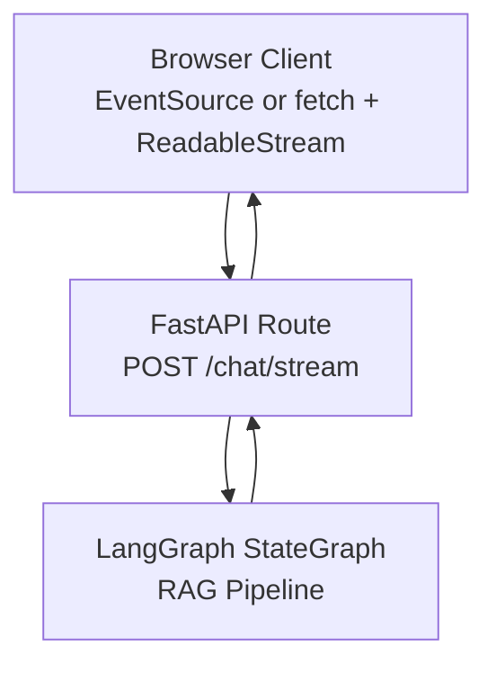
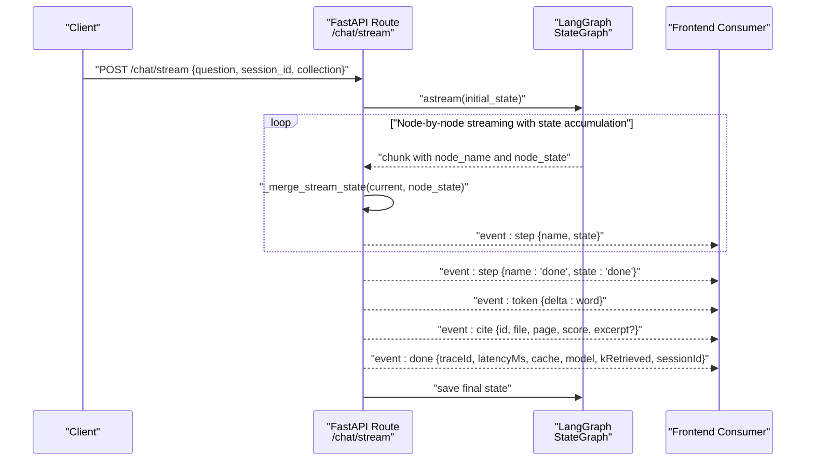
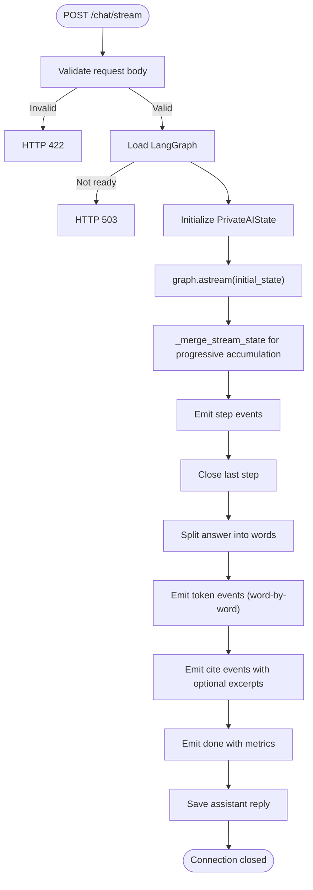
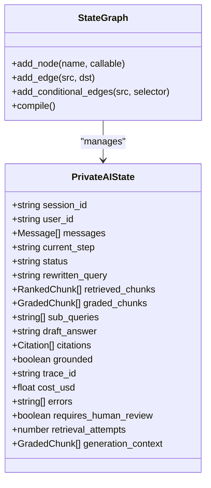
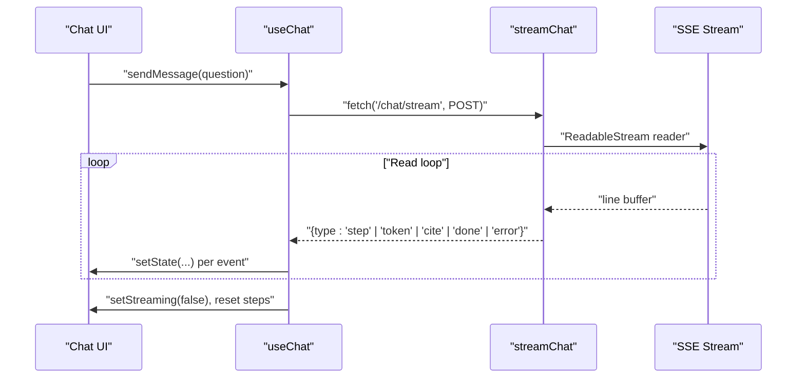
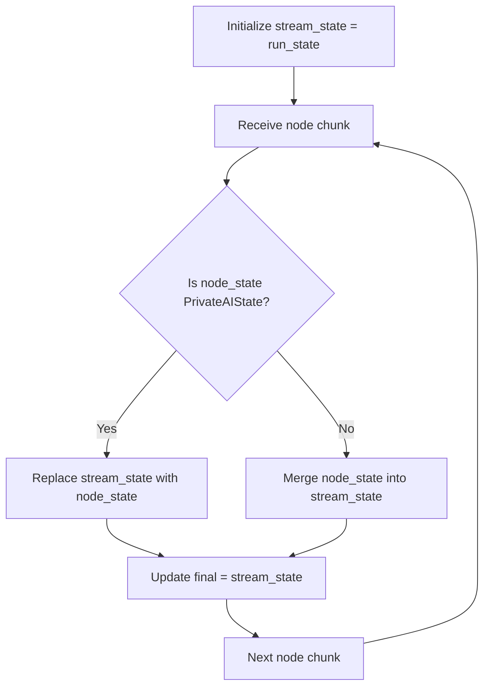
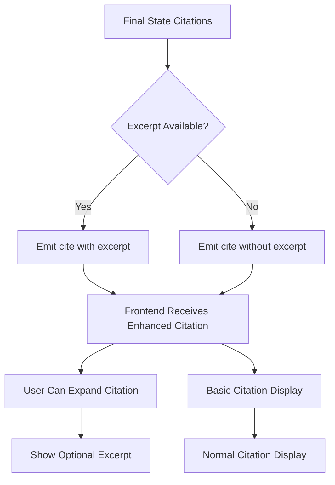
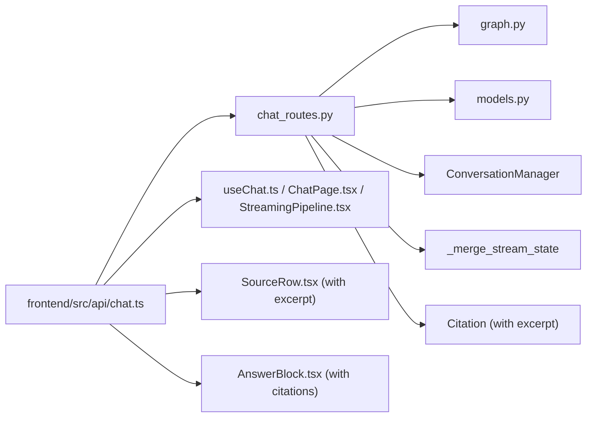

# Streaming Chat Endpoint

<cite>
**Referenced Files in This Document**
- [chat_routes.py](file://safe4ai-pilot/app/api/chat_routes.py)
- [chat.ts](file://safe4ai-pilot/frontend/src/api/chat.ts)
- [useChat.ts](file://safe4ai-pilot/frontend/src/hooks/useChat.ts)
- [ChatPage.tsx](file://safe4ai-pilot/frontend/src/pages/ChatPage.tsx)
- [StreamingPipeline.tsx](file://safe4ai-pilot/frontend/src/components/chat/StreamingPipeline.tsx)
- [models.py](file://safe4ai-pilot/app/models.py)
- [graph.py](file://safe4ai-pilot/app/agents/graph.py)
- [rag_pipeline.py](file://safe4ai-pilot/app/services/rag_pipeline.py)
- [nginx.conf](file://safe4ai-pilot/frontend/nginx.conf)
- [SourceRow.tsx](file://safe4ai-pilot/frontend/src/components/chat/SourceRow.tsx)
- [AnswerBlock.tsx](file://safe4ai-pilot/frontend/src/components/chat/AnswerBlock.tsx)
</cite>

## Update Summary
**Changes Made**
- Enhanced SSE streaming implementation to include optional excerpt data in citation responses
- Updated citation event payload structure to include excerpt field for improved source transparency
- Modified frontend components to handle and display optional excerpt data in streaming citations
- Updated streaming architecture documentation to reflect enhanced citation transparency during real-time conversations

## Table of Contents
1. [Introduction](#introduction)
2. [Project Structure](#project-structure)
3. [Core Components](#core-components)
4. [Architecture Overview](#architecture-overview)
5. [Detailed Component Analysis](#detailed-component-analysis)
6. [Enhanced State Management](#enhanced-state-management)
7. [Enhanced Citation Streaming](#enhanced-citation-streaming)
8. [Dependency Analysis](#dependency-analysis)
9. [Performance Considerations](#performance-considerations)
10. [Troubleshooting Guide](#troubleshooting-guide)
11. [Conclusion](#conclusion)
12. [Appendices](#appendices)

## Introduction
This document provides comprehensive API documentation for the SSE POST /chat/stream endpoint, which delivers real-time streaming responses for a Retrieval-Augmented Generation (RAG) chat pipeline. It explains the Server-Sent Events (SSE) implementation, the event types emitted during streaming, the enhanced LangGraph node-by-node streaming architecture with improved state merging, step state management, and the frontend integration patterns. The implementation now includes optional excerpt data in citation responses, significantly improving source transparency during real-time conversations.

## Project Structure
The streaming pipeline spans backend FastAPI routes, LangGraph state machine, and frontend event consumers. The backend emits structured SSE events with enhanced state accumulation and optional excerpt data; the frontend consumes them via a readable stream and updates UI state accordingly with improved citation transparency.



**Diagram sources**
- [chat_routes.py:338-501](file://safe4ai-pilot/app/api/chat_routes.py#L338-L501)
- [graph.py:43-335](file://safe4ai-pilot/app/agents/graph.py#L43-L335)

**Section sources**
- [chat_routes.py:338-501](file://safe4ai-pilot/app/api/chat_routes.py#L338-L501)
- [graph.py:43-335](file://safe4ai-pilot/app/agents/graph.py#L43-L335)

## Core Components
- Backend route: Implements SSE streaming for /chat/stream, emitting step, token, cite, and done events with enhanced state merging and optional excerpt data.
- LangGraph pipeline: Orchestrates nodes (intake, rewrite, retrieve, grade, decompose, generate, output_filter, quality_gate, respond, fallback) and streams intermediate states with progressive accumulation.
- Frontend consumer: Parses SSE events, renders streaming tokens, tracks step progress, and displays citations with enhanced transparency including optional excerpts.
- Enhanced citation display: Frontend components now handle and present optional excerpt data for improved source context.

Key responsibilities:
- Backend: Streams node-by-node updates with state accumulation, converts final answer into word-delimited tokens, emits citations with optional excerpts, and completion metadata.
- Frontend: Reads the SSE stream, updates UI state per event, manages connection lifecycle, and renders enhanced citation information with optional excerpts.

**Section sources**
- [chat_routes.py:338-501](file://safe4ai-pilot/app/api/chat_routes.py#L338-L501)
- [chat.ts:22-103](file://safe4ai-pilot/frontend/src/api/chat.ts#L22-L103)
- [useChat.ts:38-125](file://safe4ai-pilot/frontend/src/hooks/useChat.ts#L38-L125)

## Architecture Overview
The enhanced streaming architecture integrates FastAPI's StreamingResponse with LangGraph's astream to emit fine-grained progress and content updates with improved state accumulation from multiple processing steps. The architecture now includes optional excerpt data in citation responses for enhanced source transparency.



**Diagram sources**
- [chat_routes.py:360-492](file://safe4ai-pilot/app/api/chat_routes.py#L360-L492)
- [graph.py:43-335](file://safe4ai-pilot/app/agents/graph.py#L43-L335)

## Detailed Component Analysis

### Backend SSE Route: POST /chat/stream
- Purpose: Streams a RAG pipeline execution in real time using Server-Sent Events with enhanced state merging and optional excerpt data.
- Streaming behavior:
  - Emits step events for LangGraph node transitions.
  - Emits token events for the generated answer, delivered word-by-word with a small delay.
  - Emits cite events for each source citation, including optional excerpt data when available.
  - Emits done event with completion metadata and trace/session identifiers.
- Enhanced state management: Uses `_merge_stream_state` function to progressively accumulate state from multiple processing steps.
- Step mapping: LangGraph node names are mapped to higher-level step names for UI presentation.
- Error handling: On exceptions, emits a done event with error details and traceId.



**Diagram sources**
- [chat_routes.py:338-501](file://safe4ai-pilot/app/api/chat_routes.py#L338-L501)
- [chat_routes.py:360-492](file://safe4ai-pilot/app/api/chat_routes.py#L360-L492)

**Section sources**
- [chat_routes.py:338-501](file://safe4ai-pilot/app/api/chat_routes.py#L338-L501)
- [chat_routes.py:360-492](file://safe4ai-pilot/app/api/chat_routes.py#L360-L492)

### LangGraph Pipeline and Node-by-Node Streaming
- Nodes: intake, rewrite, retrieve, grade, decompose, generate, output_filter, quality_gate, respond, fallback.
- Routing: Conditional edges determine next node based on node outcomes and LLM decisions.
- Streaming: The backend iterates over graph.astream(initial_state) and yields step events for each node transition.
- Enhanced state accumulation: The backend progressively merges node states using `_merge_stream_state` to build the final state used to emit tokens, citations with optional excerpts, and done metadata.



**Diagram sources**
- [models.py:53-102](file://safe4ai-pilot/app/models.py#L53-L102)
- [graph.py:43-335](file://safe4ai-pilot/app/agents/graph.py#L43-L335)

**Section sources**
- [graph.py:43-335](file://safe4ai-pilot/app/agents/graph.py#L43-L335)
- [models.py:53-102](file://safe4ai-pilot/app/models.py#L53-L102)

### Frontend SSE Consumer and UI Integration
- Consumer: streamChat performs a POST to /chat/stream and parses the SSE stream into typed events.
- UI updates:
  - step events update the step progress UI.
  - token events append text to the latest assistant message.
  - cite events add source chips to the assistant message with optional excerpt expansion.
  - done events finalize trust metrics, session ID, and trace ID.
- Connection lifecycle: Uses AbortController to support stopping generation.



**Diagram sources**
- [useChat.ts:38-125](file://safe4ai-pilot/frontend/src/hooks/useChat.ts#L38-L125)
- [chat.ts:22-103](file://safe4ai-pilot/frontend/src/api/chat.ts#L22-L103)

**Section sources**
- [chat.ts:22-103](file://safe4ai-pilot/frontend/src/api/chat.ts#L22-L103)
- [useChat.ts:38-125](file://safe4ai-pilot/frontend/src/hooks/useChat.ts#L38-L125)
- [ChatPage.tsx:30-197](file://safe4ai-pilot/frontend/src/pages/ChatPage.tsx#L30-L197)
- [StreamingPipeline.tsx:13-29](file://safe4ai-pilot/frontend/src/components/chat/StreamingPipeline.tsx#L13-L29)

## Enhanced State Management

### State Merging Functionality
The `_merge_stream_state` function provides enhanced state management for progressive updates from multiple LangGraph processing steps.

**Function Purpose:**
- Handles both `PrivateAIState` instances and dictionary updates from LangGraph nodes
- Performs deep merging of state attributes to accumulate partial results
- Maintains data integrity while progressively building the final state

**Implementation Details:**
- If node state is a `PrivateAIState` instance, it replaces the current state entirely
- If node state is a dictionary, it updates the current state with new values
- Uses Pydantic's `model_dump()` and `model_copy()` for safe state manipulation

**State Accumulation Flow:**
1. Initialize with `run_state` (initial conversation state)
2. For each node chunk received from `graph.astream()`:
   - Extract node state from chunk
   - Merge with current stream state using `_merge_stream_state`
   - Store merged state as `final` for later use
3. Continue until pipeline completion



**Diagram sources**
- [chat_routes.py:239-244](file://safe4ai-pilot/app/api/chat_routes.py#L239-L244)
- [chat_routes.py:387-389](file://safe4ai-pilot/app/api/chat_routes.py#L387-L389)

**Section sources**
- [chat_routes.py:239-244](file://safe4ai-pilot/app/api/chat_routes.py#L239-L244)
- [chat_routes.py:387-389](file://safe4ai-pilot/app/api/chat_routes.py#L387-L389)

## Enhanced Citation Streaming

### Citation Event Enhancement
The SSE streaming implementation now includes optional excerpt data in citation responses, significantly improving source transparency during real-time conversations.

**Enhanced Citation Structure:**
- id: string (sequential index)
- file: string (source filename)
- page: number (page number)
- score: number (relevance score)
- excerpt: string | undefined (optional excerpt text)

**Backend Implementation:**
The backend emits citation events with the following structure:
```python
yield _sse("cite", {
    "id": str(idx),
    "file": c.filename,
    "page": c.page_number,
    "score": c.score,
    "excerpt": c.excerpt,  # Optional excerpt data
})
```

**Frontend Handling:**
The frontend handles optional excerpt data through:
- Enhanced SseCite interface with optional excerpt field
- SourceRow component that conditionally displays excerpts
- CitationChip component for basic citation navigation
- AnswerBlock component for integrated citation display

**Optional Excerpt Behavior:**
- When excerpt data is available, users can expand citation sources to view contextual excerpts
- When excerpt data is not available, citations display normally without expansion capability
- The UI gracefully handles both scenarios without breaking functionality



**Diagram sources**
- [chat_routes.py:420-428](file://safe4ai-pilot/app/api/chat_routes.py#L420-L428)
- [chat.ts:9](file://safe4ai-pilot/frontend/src/api/chat.ts#L9)
- [SourceRow.tsx:38-44](file://safe4ai-pilot/frontend/src/components/chat/SourceRow.tsx#L38-L44)

**Section sources**
- [chat_routes.py:420-428](file://safe4ai-pilot/app/api/chat_routes.py#L420-L428)
- [chat.ts:9](file://safe4ai-pilot/frontend/src/api/chat.ts#L9)
- [SourceRow.tsx:38-44](file://safe4ai-pilot/frontend/src/components/chat/SourceRow.tsx#L38-L44)
- [AnswerBlock.tsx:80-99](file://safe4ai-pilot/frontend/src/components/chat/AnswerBlock.tsx#L80-L99)

## Dependency Analysis
- Backend depends on:
  - LangGraph StateGraph for pipeline orchestration.
  - ConversationManager for session persistence.
  - PrivateAIState for state snapshots and final answer/citations.
  - Enhanced state merging utilities for progressive state accumulation.
  - Citation model with optional excerpt field for enhanced transparency.
- Frontend depends on:
  - streamChat for SSE consumption.
  - Enhanced SseCite interface with optional excerpt handling.
  - React components for citation display with optional excerpt expansion.
  - React hooks to manage UI state and lifecycle.



**Diagram sources**
- [chat_routes.py:338-501](file://safe4ai-pilot/app/api/chat_routes.py#L338-L501)
- [graph.py:43-335](file://safe4ai-pilot/app/agents/graph.py#L43-L335)
- [models.py:53-102](file://safe4ai-pilot/app/models.py#L53-L102)
- [chat.ts:22-103](file://safe4ai-pilot/frontend/src/api/chat.ts#L22-L103)
- [useChat.ts:38-125](file://safe4ai-pilot/frontend/src/hooks/useChat.ts#L38-L125)
- [ChatPage.tsx:30-197](file://safe4ai-pilot/frontend/src/pages/ChatPage.tsx#L30-L197)
- [StreamingPipeline.tsx:13-29](file://safe4ai-pilot/frontend/src/components/chat/StreamingPipeline.tsx#L13-L29)
- [SourceRow.tsx:1-48](file://safe4ai-pilot/frontend/src/components/chat/SourceRow.tsx#L1-L48)
- [AnswerBlock.tsx:1-99](file://safe4ai-pilot/frontend/src/components/chat/AnswerBlock.tsx#L1-L99)

**Section sources**
- [chat_routes.py:338-501](file://safe4ai-pilot/app/api/chat_routes.py#L338-L501)
- [graph.py:43-335](file://safe4ai-pilot/app/agents/graph.py#L43-L335)
- [chat.ts:22-103](file://safe4ai-pilot/frontend/src/api/chat.ts#L22-L103)
- [useChat.ts:38-125](file://safe4ai-pilot/frontend/src/hooks/useChat.ts#L38-L125)

## Performance Considerations
- Streaming granularity:
  - Node-by-node streaming provides immediate step transitions for UI responsiveness.
  - Word-delimited token emission balances smoothness and overhead.
- Enhanced state management:
  - Progressive state accumulation reduces memory overhead compared to storing full intermediate states.
  - Efficient merging minimizes computational overhead during streaming.
- Enhanced citation transparency:
  - Optional excerpt data increases payload size but improves user experience.
  - Frontend efficiently handles both scenarios without performance degradation.
- Latency tracking:
  - Backend measures elapsed time and emits latencyMs in the done event.
- Buffering and timeouts:
  - Nginx disables proxy buffering for SSE and sets a long read timeout to keep connections alive.
- Model and retrieval metrics:
  - kRetrieved indicates the number of chunks used; model and cache flags are included in done metadata.

Operational tips:
- Keep SSE headers minimal; avoid unnecessary caching.
- Tune token emission pacing to balance perceived responsiveness and bandwidth.
- Monitor backend resource usage during long-running queries.
- The enhanced state merging reduces memory usage by only keeping the most recent accumulated state.
- Optional excerpt data is only transmitted when available, minimizing bandwidth impact.

**Section sources**
- [chat_routes.py:421-427](file://safe4ai-pilot/app/api/chat_routes.py#L421-L427)
- [nginx.conf:20-24](file://safe4ai-pilot/frontend/nginx.conf#L20-L24)

## Troubleshooting Guide
Common issues and remedies:
- Empty question:
  - Backend returns HTTP 422; ensure the request body contains a non-empty question.
- AI pipeline not ready:
  - Backend returns HTTP 503; verify that the LangGraph instance is initialized in the application state.
- Network interruptions:
  - Frontend should handle read errors and surface an error event; users can retry or reconnect.
- Connection timeouts:
  - Nginx read timeout is configured for SSE; adjust if needed for long sessions.
- Stopping generation:
  - Use the stop action to abort the fetch request and prevent further streaming.
- State merging issues:
  - If streaming state appears inconsistent, verify that `_merge_stream_state` is properly handling both `PrivateAIState` and dictionary updates.
- Citation display issues:
  - If citations appear without excerpts, verify that the backend is properly setting the excerpt field in the Citation model.
  - Frontend gracefully handles missing excerpt data without breaking functionality.

**Section sources**
- [chat_routes.py:346-347](file://safe4ai-pilot/app/api/chat_routes.py#L346-L347)
- [chat.ts:36-43](file://safe4ai-pilot/frontend/src/api/chat.ts#L36-L43)
- [useChat.ts:34-36](file://safe4ai-pilot/frontend/src/hooks/useChat.ts#L34-L36)
- [nginx.conf:23](file://safe4ai-pilot/frontend/nginx.conf#L23)

## Conclusion
The /chat/stream endpoint delivers a robust, real-time streaming experience by combining LangGraph's node-by-node execution with SSE and enhanced state merging capabilities. The recent enhancement to include optional excerpt data in citation responses significantly improves source transparency during real-time conversations. The `_merge_stream_state` function ensures efficient progressive state accumulation from multiple processing steps, reducing memory overhead while maintaining data integrity. The frontend efficiently parses step, token, cite, and done events to render a responsive chat UI with enhanced citation transparency. With careful attention to buffering, timeouts, error handling, and state management, the system provides a smooth user experience across diverse environments.

## Appendices

### API Definition: POST /chat/stream
- Method: POST
- Path: /chat/stream
- Authentication: Required
- Headers:
  - Content-Type: application/json
  - Credentials: include (cookies)
- Request Body:
  - question: string (max length 2048)
  - session_id: string | null
  - collection: string (default "default")
- Response:
  - Media Type: text/event-stream
  - SSE events:
    - step: { name: "embed" | "retrieve" | "rerank" | "generate", state: "active" | "done", t: number }
    - token: { delta: string }
    - cite: { id: string, file: string, page: number, score: number, excerpt?: string }
    - done: { traceId: string, latencyMs: number, cache: boolean, model: string, kRetrieved: number, sessionId: string, error?: string }

**Section sources**
- [chat_routes.py:175-197](file://safe4ai-pilot/app/api/chat_routes.py#L175-L197)
- [chat_routes.py:338-501](file://safe4ai-pilot/app/api/chat_routes.py#L338-L501)

### Event Payload Structures
- step
  - name: "embed" | "retrieve" | "rerank" | "generate"
  - state: "active" | "done"
  - t: number (placeholder)
- token
  - delta: string (word or partial word)
- cite
  - id: string (sequential index)
  - file: string (source filename)
  - page: number (page number)
  - score: number (relevance score)
  - excerpt?: string (optional excerpt text)
- done
  - traceId: string
  - latencyMs: number
  - cache: boolean
  - model: string
  - kRetrieved: number
  - sessionId: string
  - error?: string

**Section sources**
- [chat_routes.py:360-492](file://safe4ai-pilot/app/api/chat_routes.py#L360-L492)
- [chat.ts:7-20](file://safe4ai-pilot/frontend/src/api/chat.ts#L7-L20)

### Frontend Integration Patterns
- JavaScript fetch + ReadableStream:
  - Use fetch with a readable stream body and parse event lines.
  - Yield typed events to the caller.
- EventSource (alternative):
  - Not used in this codebase; the implementation relies on fetch + stream parsing.
- Error recovery:
  - Surface error events to the UI and allow users to retry.
- Connection management:
  - Use AbortController to cancel ongoing requests.
- Enhanced citation handling:
  - Frontend components handle optional excerpt data gracefully.
  - SourceRow component expands to show excerpts when available.
  - CitationChip provides basic citation navigation regardless of excerpt availability.

**Section sources**
- [chat.ts:22-103](file://safe4ai-pilot/frontend/src/api/chat.ts#L22-L103)
- [useChat.ts:34-36](file://safe4ai-pilot/frontend/src/hooks/useChat.ts#L34-L36)
- [SourceRow.tsx:1-48](file://safe4ai-pilot/frontend/src/components/chat/SourceRow.tsx#L1-L48)

### Practical Examples

- curl streaming command:
  - Use curl with a readable stream parser to observe events.
  - Example invocation pattern:
    - POST https://your-host/chat/stream with JSON body containing question, optional session_id, and collection.

- JavaScript fetch implementation:
  - See streamChat for the fetch-based SSE consumer and event parsing logic.

Note: Replace host and port with your deployment endpoint.

**Section sources**
- [chat.ts:28-34](file://safe4ai-pilot/frontend/src/api/chat.ts#L28-L34)

### Browser Compatibility and Operational Notes
- SSE support:
  - Modern browsers support text/event-stream; ensure Content-Type matches.
- Nginx configuration:
  - proxy_buffering off and extended proxy_read_timeout are configured for SSE.
- Connection timeouts:
  - Adjust proxy_read_timeout if users report premature disconnects.
- Graceful degradation:
  - If SSE fails, surface an error and optionally fall back to polling or a non-streaming endpoint.
- Optional excerpt handling:
  - Frontend gracefully handles both scenarios where excerpts are available and unavailable.

**Section sources**
- [nginx.conf:20-24](file://safe4ai-pilot/frontend/nginx.conf#L20-L24)

### Enhanced State Management Details
- State merging algorithm:
  - Handles both `PrivateAIState` instances and dictionary updates
  - Preserves existing state while applying new values
  - Maintains data integrity through Pydantic validation
- Memory efficiency:
  - Progressive accumulation prevents storing multiple intermediate states
  - Reduces peak memory usage during long-running queries
- Data consistency:
  - Ensures all partial updates are properly merged
  - Maintains referential integrity across state transitions

**Section sources**
- [chat_routes.py:239-244](file://safe4ai-pilot/app/api/chat_routes.py#L239-L244)
- [chat_routes.py:387-389](file://safe4ai-pilot/app/api/chat_routes.py#L387-L389)

### Enhanced Citation Transparency Details
- Optional excerpt data:
  - Added to Citation model for enhanced source context
  - Transmitted in SSE cite events when available
  - Handled gracefully by frontend components
- Frontend enhancements:
  - SourceRow component expands to show excerpts when available
  - CitationChip provides basic navigation regardless of excerpt presence
  - AnswerBlock integrates citations with optional excerpt display
- Backward compatibility:
  - Existing clients continue to work without modification
  - New clients receive enhanced citation transparency
  - No breaking changes to the API contract

**Section sources**
- [models.py:35-40](file://safe4ai-pilot/app/models.py#L35-L40)
- [chat_routes.py:420-428](file://safe4ai-pilot/app/api/chat_routes.py#L420-L428)
- [SourceRow.tsx:38-44](file://safe4ai-pilot/frontend/src/components/chat/SourceRow.tsx#L38-L44)
- [AnswerBlock.tsx:80-99](file://safe4ai-pilot/frontend/src/components/chat/AnswerBlock.tsx#L80-L99)