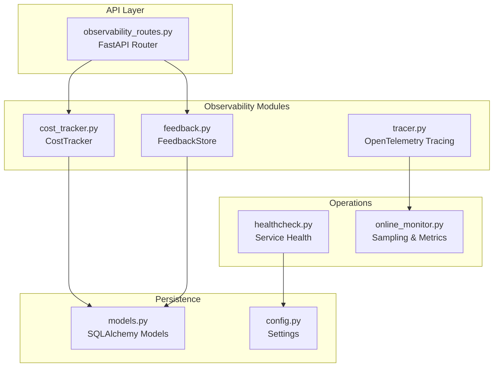
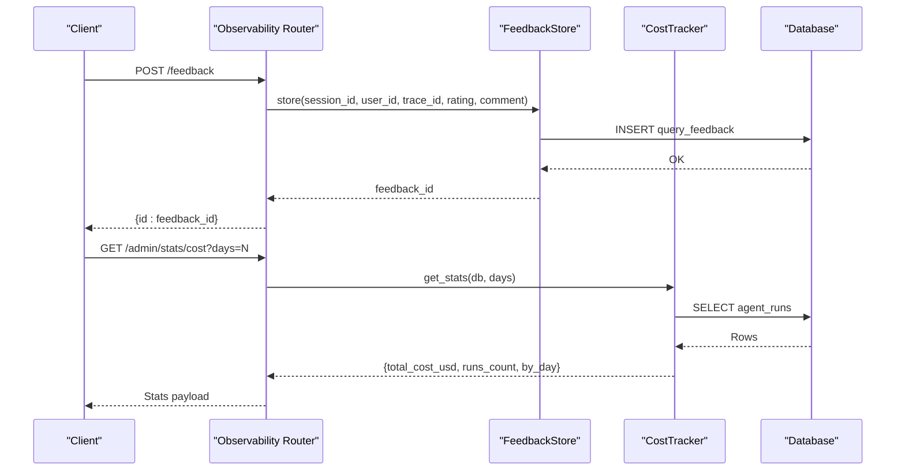
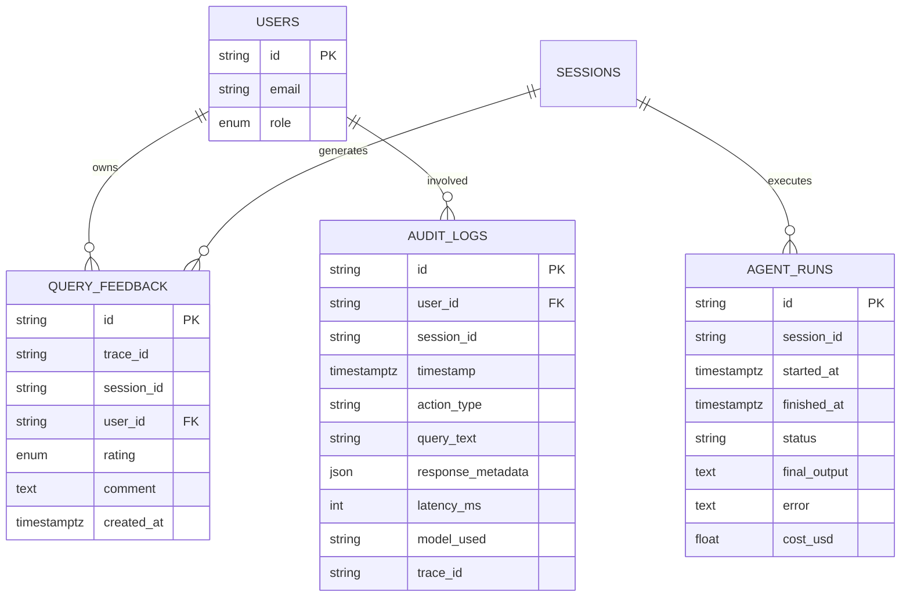
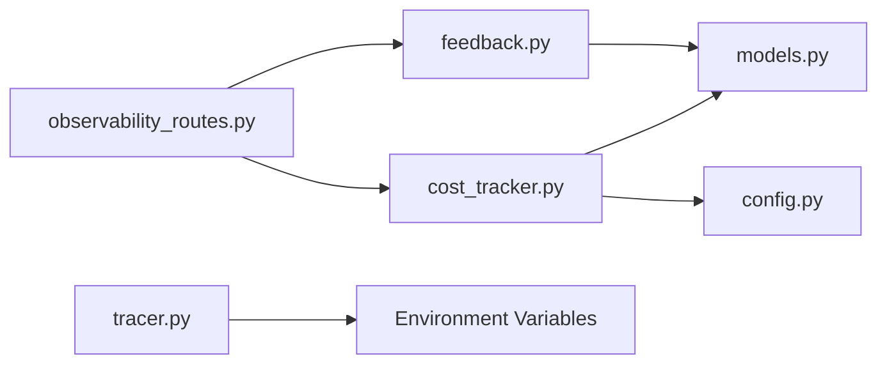

# Observability API

<cite>
**Referenced Files in This Document**
- [observability_routes.py](file://safe4ai-pilot/app/api/observability_routes.py)
- [cost_tracker.py](file://safe4ai-pilot/observability/cost_tracker.py)
- [feedback.py](file://safe4ai-pilot/observability/feedback.py)
- [tracer.py](file://safe4ai-pilot/observability/tracer.py)
- [models.py](file://safe4ai-pilot/app/db/models.py)
- [config.py](file://safe4ai-pilot/app/config.py)
- [healthcheck.py](file://safe4ai-pilot/scripts/healthcheck.py)
- [test_observability_routes.py](file://safe4ai-pilot/tests/test_observability_routes.py)
- [test_cost_tracker.py](file://safe4ai-pilot/tests/test_cost_tracker.py)
- [test_tracer.py](file://safe4ai-pilot/tests/test_tracer.py)
- [feedback.ts](file://safe4ai-pilot/frontend/src/api/feedback.ts)
- [online_monitor.py](file://safe4ai-pilot/evaluation/online_monitor.py)
- [db-layer.md](file://safe4ai-pilot/docs/db-layer.md)
</cite>

## Table of Contents
1. [Introduction](#introduction)
2. [Project Structure](#project-structure)
3. [Core Components](#core-components)
4. [Architecture Overview](#architecture-overview)
5. [Detailed Component Analysis](#detailed-component-analysis)
6. [Dependency Analysis](#dependency-analysis)
7. [Performance Considerations](#performance-considerations)
8. [Troubleshooting Guide](#troubleshooting-guide)
9. [Conclusion](#conclusion)
10. [Appendices](#appendices)

## Introduction
This document provides comprehensive API documentation for the observability endpoints focused on metrics collection, health monitoring, and system telemetry. It covers HTTP methods, URL patterns, request/response schemas, and data formats for feedback submission, administrative feedback listing, and cost statistics. It also documents distributed tracing integration, operational workflows, and practical usage examples with curl commands and code samples. Finally, it outlines data retention policies, metric aggregation methods, alerting integration patterns, and error handling strategies for monitoring failures and performance degradation.

## Project Structure
The observability surface is implemented as FastAPI routes under the observability tag, backed by dedicated modules for feedback persistence, cost tracking, and OpenTelemetry tracing. Data models define the schema for persisted telemetry artifacts such as feedback, agent runs, and audit logs. Health checks integrate with external services to validate connectivity.

**Diagram sources**
- [observability_routes.py:16-56](file://safe4ai-pilot/app/api/observability_routes.py#L16-L56)
- [feedback.py:16-71](file://safe4ai-pilot/observability/feedback.py#L16-L71)
- [cost_tracker.py:16-110](file://safe4ai-pilot/observability/cost_tracker.py#L16-L110)
- [tracer.py:1-76](file://safe4ai-pilot/observability/tracer.py#L1-L76)
- [models.py:118-156](file://safe4ai-pilot/app/db/models.py#L118-L156)
- [config.py:7-48](file://safe4ai-pilot/app/config.py#L7-L48)
- [healthcheck.py:12-58](file://safe4ai-pilot/scripts/healthcheck.py#L12-L58)
- [online_monitor.py:119-144](file://safe4ai-pilot/evaluation/online_monitor.py#L119-L144)

**Section sources**
- [observability_routes.py:16-56](file://safe4ai-pilot/app/api/observability_routes.py#L16-L56)
- [models.py:118-156](file://safe4ai-pilot/app/db/models.py#L118-L156)
- [config.py:7-48](file://safe4ai-pilot/app/config.py#L7-L48)
- [healthcheck.py:12-58](file://safe4ai-pilot/scripts/healthcheck.py#L12-L58)
- [online_monitor.py:119-144](file://safe4ai-pilot/evaluation/online_monitor.py#L119-L144)

## Core Components
- Observability Router: Defines three endpoints:
  - POST /feedback: Submit user feedback for a query response.
  - GET /admin/feedback: Retrieve recent feedback entries (admin-only).
  - GET /admin/stats/cost: Compute aggregate cost statistics for a window of days (admin-only).
- FeedbackStore: Persists feedback entries and admin-facing listing.
- CostTracker: Computes token-based costs and aggregates statistics by day.
- Tracer: Provides OpenTelemetry tracing integration with batch export and stage-scoped spans.
- Data Models: Define schemas for feedback, agent runs, and audit logs used by observability workflows.
- Health Checks: Validate connectivity to PostgreSQL, Qdrant, and Ollama.

**Section sources**
- [observability_routes.py:26-56](file://safe4ai-pilot/app/api/observability_routes.py#L26-L56)
- [feedback.py:16-71](file://safe4ai-pilot/observability/feedback.py#L16-L71)
- [cost_tracker.py:16-110](file://safe4ai-pilot/observability/cost_tracker.py#L16-L110)
- [tracer.py:1-76](file://safe4ai-pilot/observability/tracer.py#L1-L76)
- [models.py:118-156](file://safe4ai-pilot/app/db/models.py#L118-L156)
- [healthcheck.py:12-58](file://safe4ai-pilot/scripts/healthcheck.py#L12-L58)

## Architecture Overview
The observability API integrates with the database layer and external systems to collect telemetry, track costs, and export traces. Administrative endpoints enforce role-based access control to protect sensitive metrics and feedback data.

**Diagram sources**
- [observability_routes.py:26-56](file://safe4ai-pilot/app/api/observability_routes.py#L26-L56)
- [feedback.py:22-49](file://safe4ai-pilot/observability/feedback.py#L22-L49)
- [cost_tracker.py:62-109](file://safe4ai-pilot/observability/cost_tracker.py#L62-L109)
- [models.py:133-156](file://safe4ai-pilot/app/db/models.py#L133-L156)

## Detailed Component Analysis

### Feedback Submission Endpoint
- Method: POST
- Path: /feedback
- Purpose: Allow authenticated users to submit feedback for a query response.
- Request Body Schema:
  - session_id: string
  - trace_id: string
  - rating: "positive" | "negative"
  - comment: string, optional
- Response: { id: string }
- Authentication: Requires a valid user session.
- Authorization: Not role-gated; any authenticated user can submit feedback.
- Notes:
  - Rating values are validated against an enumeration.
  - Comment is optional and stored as-is.

Example usage (curl):
- curl -X POST https://your-host/feedback \
  -H "Content-Type: application/json" \
  -d '{"session_id":"sess-1","trace_id":"trace-a","rating":"positive","comment":"Helpful"}'

Frontend integration example:
- See [feedback.ts:13-18](file://safe4ai-pilot/frontend/src/api/feedback.ts#L13-L18)

**Section sources**
- [observability_routes.py:26-35](file://safe4ai-pilot/app/api/observability_routes.py#L26-L35)
- [feedback.py:22-49](file://safe4ai-pilot/observability/feedback.py#L22-L49)
- [models.py:146-156](file://safe4ai-pilot/app/db/models.py#L146-L156)
- [feedback.ts:13-18](file://safe4ai-pilot/frontend/src/api/feedback.ts#L13-L18)

### Administrative Feedback Listing
- Method: GET
- Path: /admin/feedback
- Purpose: Return the most recent feedback entries for administrative review.
- Query Parameters:
  - limit: integer, default 100
- Response: Array of feedback items with keys:
  - id, user_id, session_id, trace_id, rating, comment, created_at
- Authentication: Required
- Authorization: admin role required

Example usage (curl):
- curl -H "Authorization: Bearer <token>" https://your-host/admin/feedback

**Section sources**
- [observability_routes.py:38-45](file://safe4ai-pilot/app/api/observability_routes.py#L38-L45)
- [feedback.py:51-70](file://safe4ai-pilot/observability/feedback.py#L51-L70)
- [models.py:146-156](file://safe4ai-pilot/app/db/models.py#L146-L156)

### Cost Statistics Endpoint
- Method: GET
- Path: /admin/stats/cost
- Purpose: Return aggregate cost statistics for the given number of past days.
- Query Parameters:
  - days: integer, default 30
- Response Schema:
  - total_cost_usd: number
  - runs_count: integer
  - by_day: array of { date, cost_usd, runs }
- Authentication: Required
- Authorization: admin role required
- Cost Calculation:
  - Uses settings.cost_per_1k_tokens to compute USD cost from prompt_tokens + completion_tokens.
  - Aggregates by calendar date (UTC).

Example usage (curl):
- curl -H "Authorization: Bearer <token>" "https://your-host/admin/stats/cost?days=7"

**Section sources**
- [observability_routes.py:48-56](file://safe4ai-pilot/app/api/observability_routes.py#L48-L56)
- [cost_tracker.py:19-25](file://safe4ai-pilot/observability/cost_tracker.py#L19-L25)
- [cost_tracker.py:62-109](file://safe4ai-pilot/observability/cost_tracker.py#L62-L109)
- [config.py:19](file://safe4ai-pilot/app/config.py#L19)

### Distributed Tracing Integration
- Provider Setup:
  - Initializes OpenTelemetry TracerProvider with a BatchSpanProcessor exporting to an OTLP endpoint.
  - Environment variables:
    - OTEL_EXPORTER_OTLP_ENDPOINT: defaults to http://localhost:4317
    - OTEL_EXPORTER_INSECURE: defaults to true
- Span Lifecycle:
  - PipelineSpan is a context manager for a single pipeline stage.
  - Sets attributes: trace_id, stage.
  - Records exceptions automatically on exit when an exception occurs.
- Valid Stages:
  - pipeline, input_guard, query_rewrite, retrieval, rerank, document_grade, generate, output_filter

Example usage (Python):
- from observability.tracer import PipelineSpan, get_tracer
- tracer = get_tracer("my-pipeline")
- with PipelineSpan(tracer, "retrieval", trace_id="abc") as span:
-   span.set_attribute("latency_ms", 120)
-   span.set_attribute("model", "qwen3.5:9b")

**Section sources**
- [tracer.py:14-32](file://safe4ai-pilot/observability/tracer.py#L14-L32)
- [tracer.py:35-71](file://safe4ai-pilot/observability/tracer.py#L35-L71)

### Data Models for Observability
Key tables used by observability endpoints:
- QueryFeedback: Stores feedback entries with trace_id, session_id, user_id, rating, comment, created_at.
- AgentRun: Stores per-run metadata including cost_usd, session_id, timestamps, status.
- AuditLog: Stores audit events with latency_ms, model_used, trace_id, and timestamps.

**Diagram sources**
- [models.py:52-156](file://safe4ai-pilot/app/db/models.py#L52-L156)

**Section sources**
- [models.py:52-156](file://safe4ai-pilot/app/db/models.py#L52-L156)

### Health Monitoring Procedures
- Service Health Check Script:
  - Validates PostgreSQL connectivity via SQLAlchemy.
  - Validates Qdrant readiness endpoint.
  - Validates Ollama tags endpoint.
- Exit code:
  - Zero if all services reachable; non-zero otherwise.

Example usage (command line):
- python scripts/healthcheck.py

**Section sources**
- [healthcheck.py:12-58](file://safe4ai-pilot/scripts/healthcheck.py#L12-L58)

## Dependency Analysis
The observability endpoints depend on shared modules and configuration. The CostTracker relies on settings for pricing, while FeedbackStore persists to the database. Tracer depends on environment variables for OTLP export configuration.

**Diagram sources**
- [observability_routes.py:9-14](file://safe4ai-pilot/app/api/observability_routes.py#L9-L14)
- [cost_tracker.py:19](file://safe4ai-pilot/observability/cost_tracker.py#L19)
- [config.py:7-48](file://safe4ai-pilot/app/config.py#L7-L48)
- [feedback.py:9](file://safe4ai-pilot/observability/feedback.py#L9)
- [models.py:133-156](file://safe4ai-pilot/app/db/models.py#L133-L156)
- [tracer.py:27-32](file://safe4ai-pilot/observability/tracer.py#L27-L32)

**Section sources**
- [observability_routes.py:9-14](file://safe4ai-pilot/app/api/observability_routes.py#L9-L14)
- [cost_tracker.py:19](file://safe4ai-pilot/observability/cost_tracker.py#L19)
- [feedback.py:9](file://safe4ai-pilot/observability/feedback.py#L9)
- [tracer.py:27-32](file://safe4ai-pilot/observability/tracer.py#L27-L32)

## Performance Considerations
- Cost Computation:
  - Linear-time aggregation over agent runs within the selected window.
  - Grouping by calendar date (UTC) ensures daily rollups.
- Feedback Listing:
  - Admin listing orders by created_at desc with a configurable limit.
- Tracing:
  - BatchSpanProcessor reduces network overhead by batching spans.
  - Ensure OTEL_EXPORTER_OTLP_ENDPOINT and OTEL_EXPORTER_INSECURE are tuned for your environment.
- Database Retention:
  - Audit logs retained for audit_log_retention_days (default 90).
  - Semantic cache retained for cache_retention_days (default 30).
- Sampling and Metrics:
  - Online monitor samples audit logs and computes derived metrics such as fallback rate and average retrieval scores.

**Section sources**
- [cost_tracker.py:62-109](file://safe4ai-pilot/observability/cost_tracker.py#L62-L109)
- [feedback.py:51-70](file://safe4ai-pilot/observability/feedback.py#L51-L70)
- [tracer.py:27-32](file://safe4ai-pilot/observability/tracer.py#L27-L32)
- [config.py:16-17](file://safe4ai-pilot/app/config.py#L16-L17)
- [online_monitor.py:119-144](file://safe4ai-pilot/evaluation/online_monitor.py#L119-L144)

## Troubleshooting Guide
Common issues and resolutions:
- Authentication/Authorization Failures:
  - /admin endpoints require admin role. Ensure the caller has the appropriate role.
- Validation Errors:
  - Feedback rating must be one of the allowed values; missing required fields produce 422 errors.
- Cost Tracking:
  - If cost_per_1k_tokens is zero, computed cost_usd will be zero.
- Tracing Export:
  - Verify OTEL_EXPORTER_OTLP_ENDPOINT and OTEL_EXPORTER_INSECURE environment variables.
  - Confirm the OTLP receiver is reachable.
- Health Checks:
  - If any service fails readiness, the script exits non-zero. Inspect service logs and network connectivity.

Operational checks:
- Use the healthcheck script to validate service connectivity.
- Review audit logs and agent runs for anomalies.

**Section sources**
- [test_observability_routes.py:98-114](file://safe4ai-pilot/tests/test_observability_routes.py#L98-L114)
- [test_observability_routes.py:178-185](file://safe4ai-pilot/tests/test_observability_routes.py#L178-L185)
- [test_cost_tracker.py:23-47](file://safe4ai-pilot/tests/test_cost_tracker.py#L23-L47)
- [tracer.py:27-32](file://safe4ai-pilot/observability/tracer.py#L27-L32)
- [healthcheck.py:12-58](file://safe4ai-pilot/scripts/healthcheck.py#L12-L58)

## Conclusion
The observability API provides essential capabilities for collecting user feedback, aggregating cost metrics, and exporting distributed traces. Administrators can monitor usage trends and system health, while developers can instrument pipeline stages for granular telemetry. The design leverages FastAPI for robust routing, SQLAlchemy for persistence, and OpenTelemetry for standardized tracing. Adhering to the documented schemas, parameters, and operational guidelines ensures reliable observability workflows.

## Appendices

### API Reference Summary
- POST /feedback
  - Request: { session_id, trace_id, rating, comment? }
  - Response: { id }
  - Auth: Required
- GET /admin/feedback
  - Query: limit?
  - Response: Array of feedback items
  - Auth: Required, Role: admin
- GET /admin/stats/cost
  - Query: days?
  - Response: { total_cost_usd, runs_count, by_day[] }
  - Auth: Required, Role: admin

**Section sources**
- [observability_routes.py:26-56](file://safe4ai-pilot/app/api/observability_routes.py#L26-L56)

### Data Retention Policies
- Audit logs: retained for audit_log_retention_days (default 90).
- Semantic cache: retained for cache_retention_days (default 30).
- Cleanup scripts remove stale entries and summarize deletions.

**Section sources**
- [config.py:16-17](file://safe4ai-pilot/app/config.py#L16-L17)
- [db-layer.md:371-406](file://safe4ai-pilot/docs/db-layer.md#L371-L406)

### Metric Aggregation Methods
- Cost aggregation:
  - Sum of cost_usd across runs within the window.
  - Group by calendar date (UTC) and count runs per day.
- Feedback listing:
  - Ordered by created_at desc with a configurable limit.
- Online monitoring:
  - Samples audit logs, computes fallback rate, average retrieval scores, and feedback ratio.

**Section sources**
- [cost_tracker.py:62-109](file://safe4ai-pilot/observability/cost_tracker.py#L62-L109)
- [feedback.py:51-70](file://safe4ai-pilot/observability/feedback.py#L51-L70)
- [online_monitor.py:119-144](file://safe4ai-pilot/evaluation/online_monitor.py#L119-L144)

### Alerting Integration Patterns
- Cost spikes:
  - Monitor total_cost_usd growth over time windows; compare to thresholds.
- Latency and quality signals:
  - Use audit logs latency_ms and derived metrics from online monitor.
- Feedback sentiment:
  - Track proportion of negative ratings over time windows.

[No sources needed since this section provides general guidance]

### Example Workflows
- Submit feedback after a query:
  - Call POST /feedback with session_id, trace_id, rating, optional comment.
- Review recent feedback:
  - Call GET /admin/feedback (admin).
- Analyze cost trends:
  - Call GET /admin/stats/cost with desired days window.
- Instrument a pipeline stage:
  - Use PipelineSpan to wrap stage logic and set attributes.

**Section sources**
- [feedback.ts:13-18](file://safe4ai-pilot/frontend/src/api/feedback.ts#L13-L18)
- [tracer.py:35-71](file://safe4ai-pilot/observability/tracer.py#L35-L71)