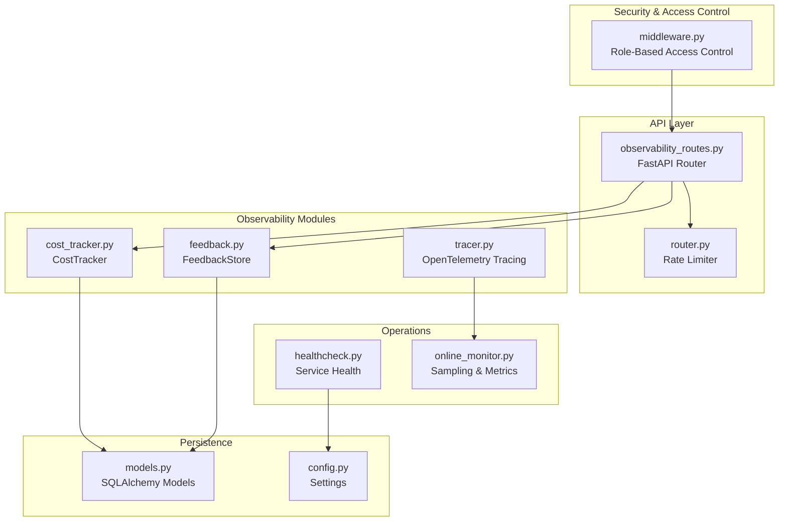
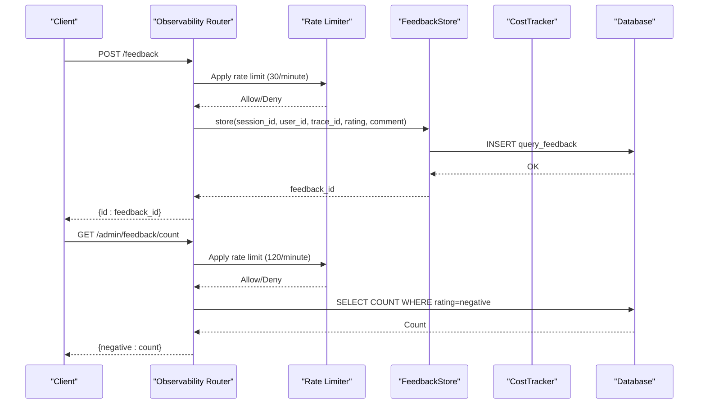
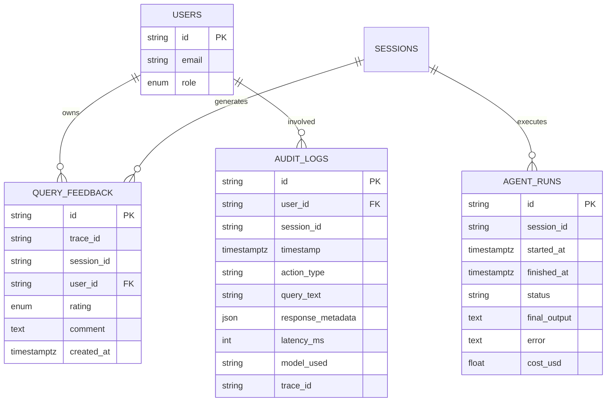
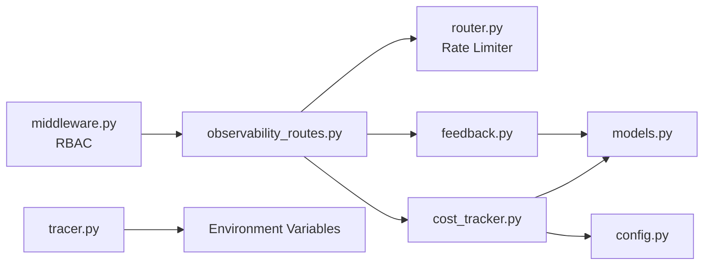

# Observability API

<cite>
**Referenced Files in This Document**
- [observability_routes.py](file://safe4ai-pilot/app/api/observability_routes.py)
- [cost_tracker.py](file://safe4ai-pilot/observability/cost_tracker.py)
- [feedback.py](file://safe4ai-pilot/observability/feedback.py)
- [tracer.py](file://safe4ai-pilot/observability/tracer.py)
- [models.py](file://safe4ai-pilot/app/db/models.py)
- [config.py](file://safe4ai-pilot/app/config.py)
- [healthcheck.py](file://safe4ai-pilot/scripts/healthcheck.py)
- [test_observability_routes.py](file://safe4ai-pilot/tests/test_observability_routes.py)
- [test_cost_tracker.py](file://safe4ai-pilot/tests/test_cost_tracker.py)
- [test_tracer.py](file://safe4ai-pilot/tests/test_tracer.py)
- [feedback.ts](file://safe4ai-pilot/frontend/src/api/feedback.ts)
- [online_monitor.py](file://safe4ai-pilot/evaluation/online_monitor.py)
- [db-layer.md](file://safe4ai-pilot/docs/db-layer.md)
- [middleware.py](file://safe4ai-pilot/app/auth/middleware.py)
- [router.py](file://safe4ai-pilot/app/auth/router.py)
</cite>

## Update Summary
**Changes Made**
- Added new administrative endpoints for feedback management and trace lookup
- Implemented comprehensive rate limiting for all observability endpoints
- Enhanced administrative guard authentication with improved error handling
- Expanded test coverage for new feedback administration functionality
- Updated distributed tracing integration with enhanced validation

## Table of Contents
1. [Introduction](#introduction)
2. [Project Structure](#project-structure)
3. [Core Components](#core-components)
4. [Architecture Overview](#architecture-overview)
5. [Detailed Component Analysis](#detailed-component-analysis)
6. [Dependency Analysis](#dependency-analysis)
7. [Performance Considerations](#performance-considerations)
8. [Troubleshooting Guide](#troubleshooting-guide)
9. [Conclusion](#conclusion)
10. [Appendices](#appendices)

## Introduction
This document provides comprehensive API documentation for the observability endpoints focused on metrics collection, health monitoring, and system telemetry. It covers HTTP methods, URL patterns, request/response schemas, and data formats for feedback submission, administrative feedback listing, cost statistics, and enhanced trace lookup functionality. It also documents distributed tracing integration, administrative guard authentication, rate limiting mechanisms, and operational workflows with practical usage examples using curl commands and code samples. Finally, it outlines data retention policies, metric aggregation methods, alerting integration patterns, and error handling strategies for monitoring failures and performance degradation.

## Project Structure
The observability surface is implemented as FastAPI routes under the observability tag, backed by dedicated modules for feedback persistence, cost tracking, and OpenTelemetry tracing. Data models define the schema for persisted telemetry artifacts such as feedback, agent runs, and audit logs. Health checks integrate with external services to validate connectivity. All endpoints now feature comprehensive rate limiting and enhanced administrative guard authentication.



**Diagram sources**
- [observability_routes.py:17](file://safe4ai-pilot/app/api/observability_routes.py#L17)
- [router.py:25](file://safe4ai-pilot/app/auth/router.py#L25)
- [feedback.py:16](file://safe4ai-pilot/observability/feedback.py#L16)
- [cost_tracker.py:16](file://safe4ai-pilot/observability/cost_tracker.py#L16)
- [tracer.py:1](file://safe4ai-pilot/observability/tracer.py#L1)
- [middleware.py:98](file://safe4ai-pilot/app/auth/middleware.py#L98)
- [models.py:118](file://safe4ai-pilot/app/db/models.py#L118)
- [config.py:7](file://safe4ai-pilot/app/config.py#L7)
- [healthcheck.py:12](file://safe4ai-pilot/scripts/healthcheck.py#L12)
- [online_monitor.py:119](file://safe4ai-pilot/evaluation/online_monitor.py#L119)

**Section sources**
- [observability_routes.py:17](file://safe4ai-pilot/app/api/observability_routes.py#L17)
- [models.py:118](file://safe4ai-pilot/app/db/models.py#L118)
- [config.py:7](file://safe4ai-pilot/app/config.py#L7)
- [healthcheck.py:12](file://safe4ai-pilot/scripts/healthcheck.py#L12)
- [online_monitor.py:119](file://safe4ai-pilot/evaluation/online_monitor.py#L119)

## Core Components
- **Enhanced Observability Router**: Defines four endpoints with comprehensive rate limiting:
  - POST /feedback: Submit user feedback for a query response (30/minute limit)
  - GET /admin/feedback: Retrieve recent feedback entries (admin-only, 100/minute limit)
  - GET /admin/feedback/count: Lightweight negative-feedback count (admin-only, 120/minute limit)
  - GET /admin/feedback/{feedback_id}/trace: Trace lookup for feedback administration (admin-only, 100/minute limit)
  - GET /admin/stats/cost: Compute aggregate cost statistics for a window of days (admin-only, 100/minute limit)
- **FeedbackStore**: Persists feedback entries and admin-facing listing with enhanced user information resolution
- **CostTracker**: Computes token-based costs and aggregates statistics by day
- **Tracer**: Provides OpenTelemetry tracing integration with batch export and stage-scoped spans
- **Administrative Guard Authentication**: Enhanced role-based access control with proper error handling
- **Rate Limiter**: Module-level rate limiting for all observability endpoints
- **Data Models**: Define schemas for feedback, agent runs, and audit logs used by observability workflows
- **Health Checks**: Validate connectivity to PostgreSQL, Qdrant, and Ollama

**Section sources**
- [observability_routes.py:27-120](file://safe4ai-pilot/app/api/observability_routes.py#L27-L120)
- [feedback.py:16-78](file://safe4ai-pilot/observability/feedback.py#L16-L78)
- [cost_tracker.py:16-115](file://safe4ai-pilot/observability/cost_tracker.py#L16-L115)
- [tracer.py:1-76](file://safe4ai-pilot/observability/tracer.py#L1-L76)
- [middleware.py:98-109](file://safe4ai-pilot/app/auth/middleware.py#L98-L109)
- [router.py:25](file://safe4ai-pilot/app/auth/router.py#L25)

## Architecture Overview
The observability API integrates with the database layer and external systems to collect telemetry, track costs, and export traces. Administrative endpoints enforce role-based access control with comprehensive rate limiting to protect sensitive metrics and feedback data. The enhanced architecture now includes sophisticated rate limiting and improved security measures.



**Diagram sources**
- [observability_routes.py:27-120](file://safe4ai-pilot/app/api/observability_routes.py#L27-L120)
- [router.py:25](file://safe4ai-pilot/app/auth/router.py#L25)
- [feedback.py:22-78](file://safe4ai-pilot/observability/feedback.py#L22-L78)
- [cost_tracker.py:62-115](file://safe4ai-pilot/observability/cost_tracker.py#L62-L115)

## Detailed Component Analysis

### Feedback Submission Endpoint
- **Method**: POST
- **Path**: /feedback
- **Purpose**: Allow authenticated users to submit feedback for a query response
- **Rate Limit**: 30 requests per minute
- **Request Body Schema**:
  - session_id: string
  - trace_id: string
  - rating: "positive" | "negative"
  - comment: string, optional
- **Response**: { id: string }
- **Authentication**: Requires a valid user session
- **Authorization**: Not role-gated; any authenticated user can submit feedback
- **Notes**:
  - Rating values are validated against an enumeration
  - Comment is optional and stored as-is
  - Enhanced rate limiting prevents abuse

**Updated** Added comprehensive rate limiting and improved error handling

Example usage (curl):
```bash
curl -X POST https://your-host/feedback \
  -H "Content-Type: application/json" \
  -d '{"session_id":"sess-1","trace_id":"trace-a","rating":"positive","comment":"Helpful"}'
```

Frontend integration example:
- See [feedback.ts:14-19](file://safe4ai-pilot/frontend/src/api/feedback.ts#L14-L19)

**Section sources**
- [observability_routes.py:27-38](file://safe4ai-pilot/app/api/observability_routes.py#L27-L38)
- [feedback.py:22-49](file://safe4ai-pilot/observability/feedback.py#L22-L49)
- [models.py:146-156](file://safe4ai-pilot/app/db/models.py#L146-L156)
- [feedback.ts:14-19](file://safe4ai-pilot/frontend/src/api/feedback.ts#L14-L19)

### Administrative Feedback Listing
- **Method**: GET
- **Path**: /admin/feedback
- **Purpose**: Return the most recent feedback entries for administrative review
- **Rate Limit**: 100 requests per minute
- **Query Parameters**:
  - limit: integer, default 100, max 1000
- **Response**: Array of feedback items with enhanced user information:
  - id, user_id, user_email, session_id, trace_id, rating, comment, created_at
- **Authentication**: Required
- **Authorization**: admin role required
- **Enhancements**: Now includes user email resolution for better administrative visibility

**Updated** Enhanced with user email resolution and improved rate limiting

Example usage (curl):
```bash
curl -H "Authorization: Bearer <token>" https://your-host/admin/feedback
```

**Section sources**
- [observability_routes.py:41-50](file://safe4ai-pilot/app/api/observability_routes.py#L41-L50)
- [feedback.py:51-78](file://safe4ai-pilot/observability/feedback.py#L51-L78)
- [models.py:146-156](file://safe4ai-pilot/app/db/models.py#L146-L156)

### Negative Feedback Count Endpoint
- **Method**: GET
- **Path**: /admin/feedback/count
- **Purpose**: Lightweight negative-feedback count for the sidebar badge
- **Rate Limit**: 120 requests per minute
- **Response**: { negative: integer }
- **Authentication**: Required
- **Authorization**: admin role required
- **Performance**: Optimized database query counting only negative ratings
- **Use Case**: Sidebar badge showing negative feedback volume

**New** Added lightweight endpoint for negative feedback counting

Example usage (curl):
```bash
curl -H "Authorization: Bearer <token>" https://your-host/admin/feedback/count
```

**Section sources**
- [observability_routes.py:53-69](file://safe4ai-pilot/app/api/observability_routes.py#L53-L69)

### Feedback Trace Lookup Endpoint
- **Method**: GET
- **Path**: /admin/feedback/{feedback_id}/trace
- **Purpose**: Return audit log trace data for a specific feedback item
- **Rate Limit**: 100 requests per minute
- **Path Parameters**:
  - feedback_id: string (UUID)
- **Response**: Trace information or not found indicator
  - found: boolean
  - traceId: string
  - latencyMs: number (optional)
  - modelUsed: string (optional)
  - timestamp: ISO string (optional)
  - actionType: string (optional)
  - cacheHit: boolean (optional)
- **Authentication**: Required
- **Authorization**: admin role required
- **Error Handling**: Returns 404 if feedback not found, structured response if not found in audit logs

**New** Added comprehensive trace lookup functionality for feedback administration

Example usage (curl):
```bash
curl -H "Authorization: Bearer <token>" https://your-host/admin/feedback/fb-1/trace
```

**Section sources**
- [observability_routes.py:72-100](file://safe4ai-pilot/app/api/observability_routes.py#L72-L100)

### Cost Statistics Endpoint
- **Method**: GET
- **Path**: /admin/stats/cost
- **Purpose**: Return aggregate cost statistics for the given number of past days
- **Rate Limit**: 100 requests per minute
- **Query Parameters**:
  - days: integer, default 30, min 1, max 366
- **Response Schema**:
  - total_cost_usd: number
  - runs_count: integer
  - by_day: array of { date, cost_usd, runs }
- **Authentication**: Required
- **Authorization**: admin role required
- **Enhanced Validation**: Improved input validation with comprehensive error handling
- **Cost Calculation**:
  - Uses settings.cost_per_1k_tokens to compute USD cost from prompt_tokens + completion_tokens
  - Aggregates by calendar date (UTC)

Example usage (curl):
```bash
curl -H "Authorization: Bearer <token>" "https://your-host/admin/stats/cost?days=7"
```

**Section sources**
- [observability_routes.py:103-120](file://safe4ai-pilot/app/api/observability_routes.py#L103-L120)
- [cost_tracker.py:19-26](file://safe4ai-pilot/observability/cost_tracker.py#L19-L26)
- [cost_tracker.py:62-115](file://safe4ai-pilot/observability/cost_tracker.py#L62-L115)
- [config.py:19](file://safe4ai-pilot/app/config.py#L19)

### Enhanced Administrative Guard Authentication
- **Role-Based Access Control**: Comprehensive role validation for all admin endpoints
- **Error Handling**: Proper HTTP status codes (401 for authentication, 403 for authorization)
- **Security**: Enhanced token validation with role consistency checking
- **Guard Functions**: `require_role()` dependency injection with normalized role comparison

**Updated** Enhanced with improved error handling and comprehensive test coverage

**Section sources**
- [middleware.py:98-109](file://safe4ai-pilot/app/auth/middleware.py#L98-L109)
- [test_observability_routes.py:255-263](file://safe4ai-pilot/tests/test_observability_routes.py#L255-L263)

### Distributed Tracing Integration
- **Provider Setup**:
  - Initializes OpenTelemetry TracerProvider with a BatchSpanProcessor exporting to an OTLP endpoint
  - Environment variables:
    - OTEL_EXPORTER_OTLP_ENDPOINT: defaults to http://localhost:4317
    - OTEL_EXPORTER_INSECURE: defaults to true
- **Span Lifecycle**:
  - PipelineSpan is a context manager for a single pipeline stage
  - Sets attributes: trace_id, stage
  - Records exceptions automatically on exit when an exception occurs
- **Enhanced Validation**:
  - Comprehensive stage validation with explicit error messages
  - All valid stages: pipeline, input_guard, query_rewrite, retrieval, rerank, document_grade, generate, output_filter
- **Performance**: BatchSpanProcessor reduces network overhead by batching spans

**Updated** Enhanced with comprehensive stage validation and improved error handling

Example usage (Python):
```python
from observability.tracer import PipelineSpan, get_tracer
tracer = get_tracer("my-pipeline")
with PipelineSpan(tracer, "retrieval", trace_id="abc") as span:
    span.set_attribute("latency_ms", 120)
    span.set_attribute("model", "qwen3.5:9b")
```

**Section sources**
- [tracer.py:14-32](file://safe4ai-pilot/observability/tracer.py#L14-L32)
- [tracer.py:35-76](file://safe4ai-pilot/observability/tracer.py#L35-L76)

### Data Models for Observability
Key tables used by observability endpoints:
- **QueryFeedback**: Stores feedback entries with trace_id, session_id, user_id, rating, comment, created_at
- **AgentRun**: Stores per-run metadata including cost_usd, session_id, timestamps, status
- **AuditLog**: Stores audit events with latency_ms, model_used, trace_id, and timestamps



**Diagram sources**
- [models.py:52-156](file://safe4ai-pilot/app/db/models.py#L52-L156)

**Section sources**
- [models.py:52-156](file://safe4ai-pilot/app/db/models.py#L52-L156)

### Health Monitoring Procedures
- **Service Health Check Script**:
  - Validates PostgreSQL connectivity via SQLAlchemy
  - Validates Qdrant readiness endpoint
  - Validates Ollama tags endpoint
- **Exit code**:
  - Zero if all services reachable; non-zero otherwise

Example usage (command line):
```bash
python scripts/healthcheck.py
```

**Section sources**
- [healthcheck.py:12-58](file://safe4ai-pilot/scripts/healthcheck.py#L12-L58)

## Dependency Analysis
The observability endpoints depend on shared modules and configuration. The CostTracker relies on settings for pricing, while FeedbackStore persists to the database. Tracer depends on environment variables for OTLP export configuration. All endpoints now feature comprehensive rate limiting and enhanced security measures.



**Diagram sources**
- [observability_routes.py:9-17](file://safe4ai-pilot/app/api/observability_routes.py#L9-L17)
- [router.py:25](file://safe4ai-pilot/app/auth/router.py#L25)
- [cost_tracker.py:19](file://safe4ai-pilot/observability/cost_tracker.py#L19)
- [config.py:7](file://safe4ai-pilot/app/config.py#L7)
- [feedback.py:9](file://safe4ai-pilot/observability/feedback.py#L9)
- [models.py:133-156](file://safe4ai-pilot/app/db/models.py#L133-L156)
- [tracer.py:27-32](file://safe4ai-pilot/observability/tracer.py#L27-L32)
- [middleware.py:98-109](file://safe4ai-pilot/app/auth/middleware.py#L98-L109)

**Section sources**
- [observability_routes.py:9-17](file://safe4ai-pilot/app/api/observability_routes.py#L9-L17)
- [cost_tracker.py:19](file://safe4ai-pilot/observability/cost_tracker.py#L19)
- [feedback.py:9](file://safe4ai-pilot/observability/feedback.py#L9)
- [tracer.py:27-32](file://safe4ai-pilot/observability/tracer.py#L27-L32)

## Performance Considerations
- **Enhanced Rate Limiting**:
  - All observability endpoints now feature comprehensive rate limiting
  - Configured limits: 30/min for feedback, 100/min for admin endpoints, 120/min for count endpoint
  - Prevents abuse while maintaining system stability
- **Cost Computation**:
  - Linear-time aggregation over agent runs within the selected window
  - Grouping by calendar date (UTC) ensures daily rollups
- **Feedback Listing**:
  - Admin listing orders by created_at desc with a configurable limit (max 1000)
  - Enhanced user email resolution with efficient database queries
- **Trace Lookup**:
  - Optimized audit log queries with proper indexing considerations
  - Structured response format for efficient client processing
- **Tracing**:
  - BatchSpanProcessor reduces network overhead by batching spans
  - Enhanced stage validation prevents invalid span creation
  - Ensure OTEL_EXPORTER_OTLP_ENDPOINT and OTEL_EXPORTER_INSECURE are tuned for your environment
- **Database Retention**:
  - Audit logs retained for audit_log_retention_days (default 90)
  - Semantic cache retained for cache_retention_days (default 30)
- **Sampling and Metrics**:
  - Online monitor samples audit logs and computes derived metrics such as fallback rate and average retrieval scores

**Updated** Enhanced with comprehensive rate limiting and improved performance optimizations

**Section sources**
- [observability_routes.py:27-120](file://safe4ai-pilot/app/api/observability_routes.py#L27-L120)
- [router.py:25](file://safe4ai-pilot/app/auth/router.py#L25)
- [cost_tracker.py:62-115](file://safe4ai-pilot/observability/cost_tracker.py#L62-L115)
- [feedback.py:51-78](file://safe4ai-pilot/observability/feedback.py#L51-L78)
- [tracer.py:27-32](file://safe4ai-pilot/observability/tracer.py#L27-L32)
- [config.py:16-17](file://safe4ai-pilot/app/config.py#L16-L17)
- [online_monitor.py:119-144](file://safe4ai-pilot/evaluation/online_monitor.py#L119-L144)

## Troubleshooting Guide
Common issues and resolutions:
- **Enhanced Authentication/Authorization Failures**:
  - /admin endpoints require admin role. Ensure the caller has the appropriate role
  - Rate limiting may trigger 429 responses for excessive requests
  - Token validation errors return 401, role mismatch returns 403
- **Validation Errors**:
  - Feedback rating must be one of the allowed values; missing required fields produce 422 errors
  - Cost endpoint accepts days between 1 and 366
  - Feedback count endpoint returns 404 for invalid feedback IDs
- **Rate Limiting Issues**:
  - Excessive requests to observability endpoints may trigger 429 responses
  - Configure appropriate rate limits based on your deployment needs
- **Cost Tracking**:
  - If cost_per_1k_tokens is zero, computed cost_usd will be zero
- **Tracing Export**:
  - Verify OTEL_EXPORTER_OTLP_ENDPOINT and OTEL_EXPORTER_INSECURE environment variables
  - Confirm the OTLP receiver is reachable
  - Stage validation errors indicate invalid pipeline stage names
- **Health Checks**:
  - If any service fails readiness, the script exits non-zero. Inspect service logs and network connectivity

**Updated** Enhanced with rate limiting and improved error handling guidance

Operational checks:
- Use the healthcheck script to validate service connectivity
- Monitor rate limit responses and adjust limits as needed
- Review audit logs and agent runs for anomalies

**Section sources**
- [test_observability_routes.py:98-114](file://safe4ai-pilot/tests/test_observability_routes.py#L98-L114)
- [test_observability_routes.py:178-185](file://safe4ai-pilot/tests/test_observability_routes.py#L178-L185)
- [test_observability_routes.py:255-263](file://safe4ai-pilot/tests/test_observability_routes.py#L255-L263)
- [test_observability_routes.py:265-392](file://safe4ai-pilot/tests/test_observability_routes.py#L265-L392)
- [test_cost_tracker.py:23-47](file://safe4ai-pilot/tests/test_cost_tracker.py#L23-L47)
- [tracer.py:27-32](file://safe4ai-pilot/observability/tracer.py#L27-L32)
- [healthcheck.py:12-58](file://safe4ai-pilot/scripts/healthcheck.py#L12-L58)

## Conclusion
The observability API provides essential capabilities for collecting user feedback, aggregating cost metrics, and exporting distributed traces. The enhanced architecture now features comprehensive rate limiting, improved administrative guard authentication, and expanded functionality for feedback administration. Administrators can monitor usage trends and system health with enhanced trace lookup capabilities, while developers can instrument pipeline stages for granular telemetry. The design leverages FastAPI for robust routing, SQLAlchemy for persistence, and OpenTelemetry for standardized tracing. Adhering to the documented schemas, parameters, and operational guidelines ensures reliable observability workflows with enhanced security and performance.

## Appendices

### API Reference Summary
- **POST /feedback**
  - Request: { session_id, trace_id, rating, comment? }
  - Response: { id }
  - Auth: Required
  - Rate Limit: 30/minute
- **GET /admin/feedback**
  - Query: limit? (max 1000)
  - Response: Array of feedback items with user emails
  - Auth: Required, Role: admin
  - Rate Limit: 100/minute
- **GET /admin/feedback/count**
  - Response: { negative: count }
  - Auth: Required, Role: admin
  - Rate Limit: 120/minute
- **GET /admin/feedback/{feedback_id}/trace**
  - Response: Trace information or not found indicator
  - Auth: Required, Role: admin
  - Rate Limit: 100/minute
- **GET /admin/stats/cost**
  - Query: days? (1-366)
  - Response: { total_cost_usd, runs_count, by_day[] }
  - Auth: Required, Role: admin
  - Rate Limit: 100/minute

**Updated** Added new endpoints and comprehensive rate limiting information

**Section sources**
- [observability_routes.py:27-120](file://safe4ai-pilot/app/api/observability_routes.py#L27-L120)

### Data Retention Policies
- **Audit logs**: retained for audit_log_retention_days (default 90)
- **Semantic cache**: retained for cache_retention_days (default 30)
- **Cleanup scripts**: remove stale entries and summarize deletions

**Section sources**
- [config.py:16-17](file://safe4ai-pilot/app/config.py#L16-L17)
- [db-layer.md:371-406](file://safe4ai-pilot/docs/db-layer.md#L371-L406)

### Metric Aggregation Methods
- **Cost aggregation**:
  - Sum of cost_usd across runs within the window
  - Group by calendar date (UTC) and count runs per day
- **Feedback listing**:
  - Ordered by created_at desc with a configurable limit (max 1000)
  - Enhanced with user email resolution
- **Negative feedback count**:
  - Optimized database query counting only negative ratings
- **Online monitoring**:
  - Samples audit logs, computes fallback rate, average retrieval scores, and feedback ratio

**Updated** Enhanced with new aggregation methods and performance optimizations

**Section sources**
- [cost_tracker.py:62-115](file://safe4ai-pilot/observability/cost_tracker.py#L62-L115)
- [feedback.py:51-78](file://safe4ai-pilot/observability/feedback.py#L51-L78)
- [online_monitor.py:119-144](file://safe4ai-pilot/evaluation/online_monitor.py#L119-L144)

### Alerting Integration Patterns
- **Cost spikes**:
  - Monitor total_cost_usd growth over time windows; compare to thresholds
  - Enhanced with rate limiting to prevent abuse
- **Latency and quality signals**:
  - Use audit logs latency_ms and derived metrics from online monitor
- **Feedback sentiment**:
  - Track proportion of negative ratings over time windows
  - Utilize the new negative feedback count endpoint for real-time monitoring
- **Rate limiting alerts**:
  - Monitor 429 responses indicating rate limit exhaustion
  - Implement circuit breakers for critical observability endpoints

**Updated** Enhanced with rate limiting and improved alerting patterns

### Example Workflows
- **Submit feedback after a query**:
  - Call POST /feedback with session_id, trace_id, rating, optional comment
  - Rate limited to 30 requests per minute
- **Review recent feedback**:
  - Call GET /admin/feedback (admin) with optional limit parameter
  - Enhanced with user email resolution
- **Monitor negative feedback volume**:
  - Call GET /admin/feedback/count (admin) for real-time dashboard
- **Analyze cost trends**:
  - Call GET /admin/stats/cost with desired days window
- **Trace feedback issues**:
  - Call GET /admin/feedback/{feedback_id}/trace (admin) for detailed analysis
- **Instrument a pipeline stage**:
  - Use PipelineSpan to wrap stage logic and set attributes
  - Enhanced stage validation prevents invalid span creation

**Updated** Added new workflows for enhanced feedback administration and trace lookup

**Section sources**
- [feedback.ts:14-60](file://safe4ai-pilot/frontend/src/api/feedback.ts#L14-L60)
- [tracer.py:35-76](file://safe4ai-pilot/observability/tracer.py#L35-L76)