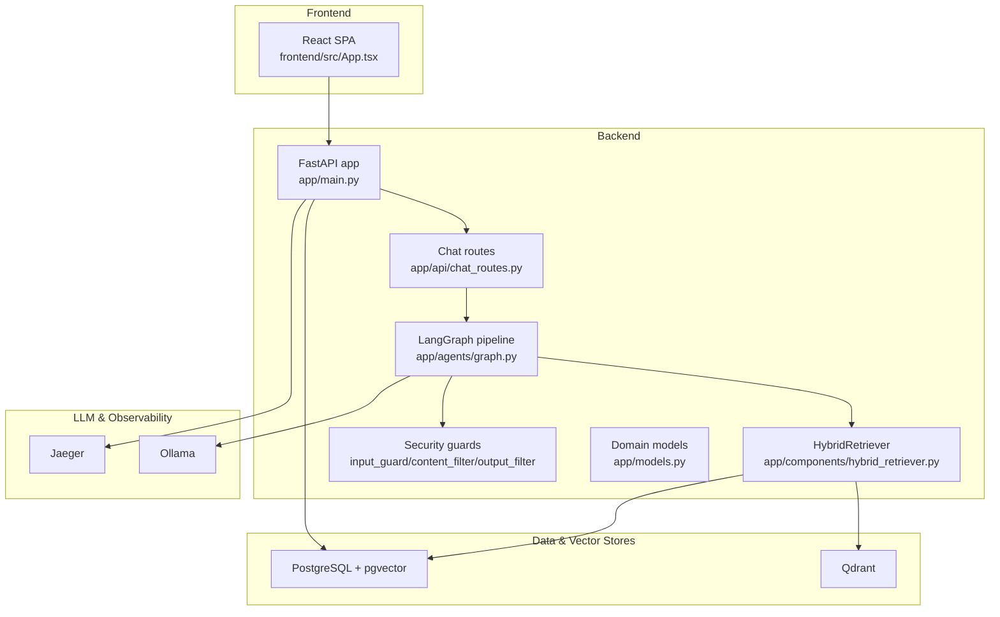
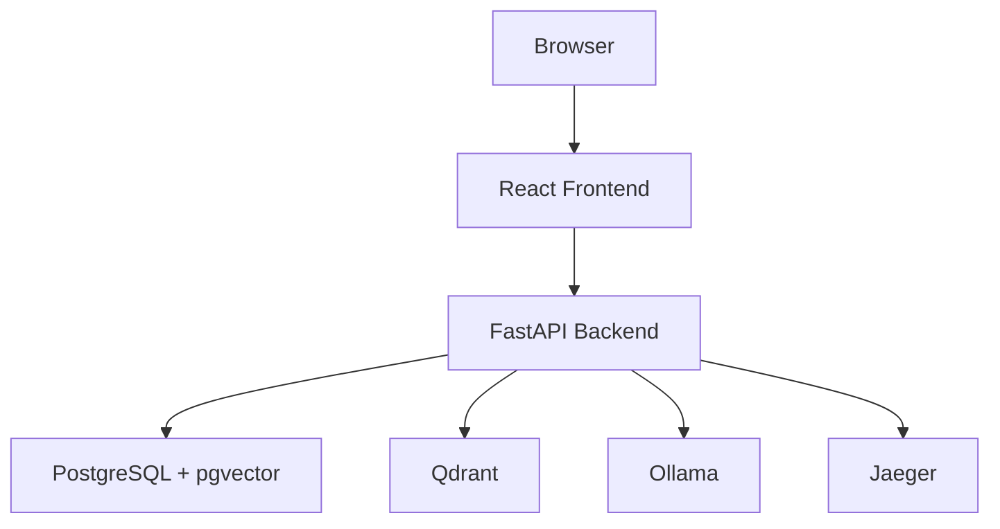
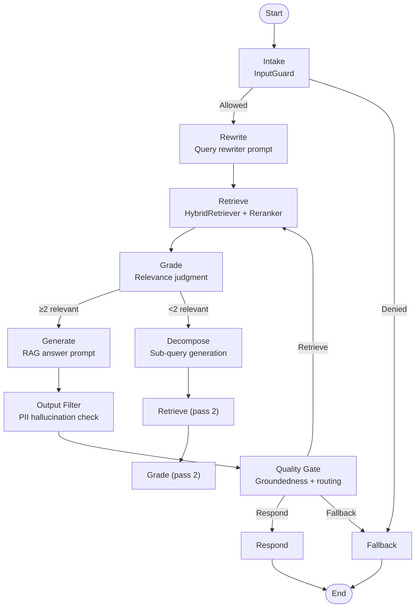
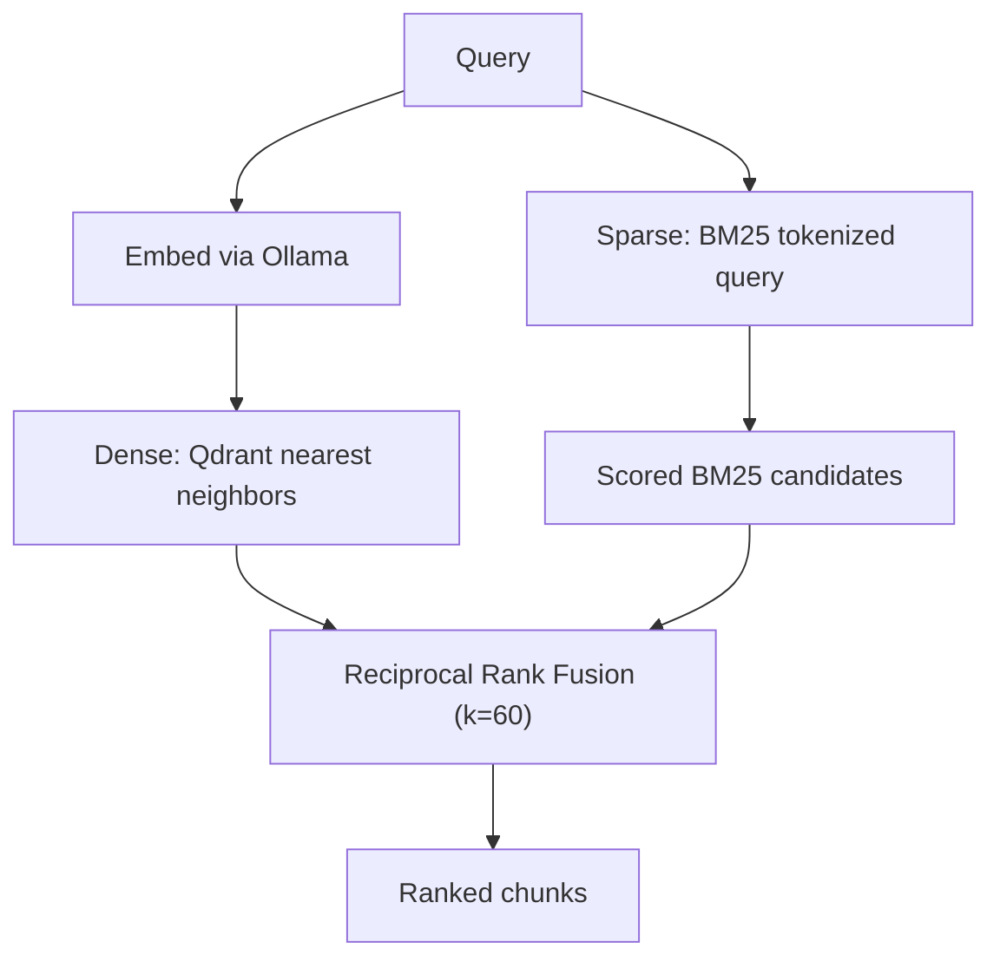
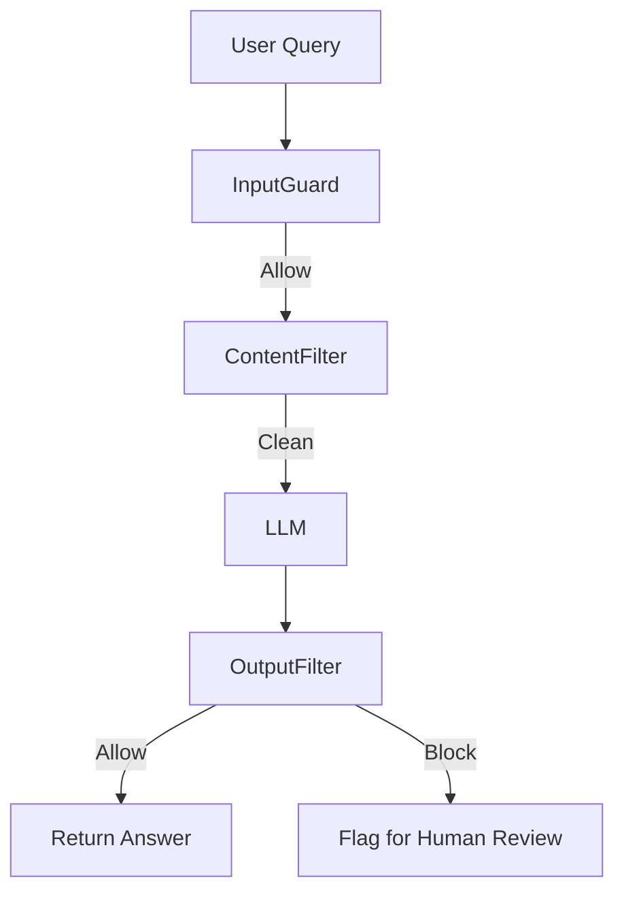
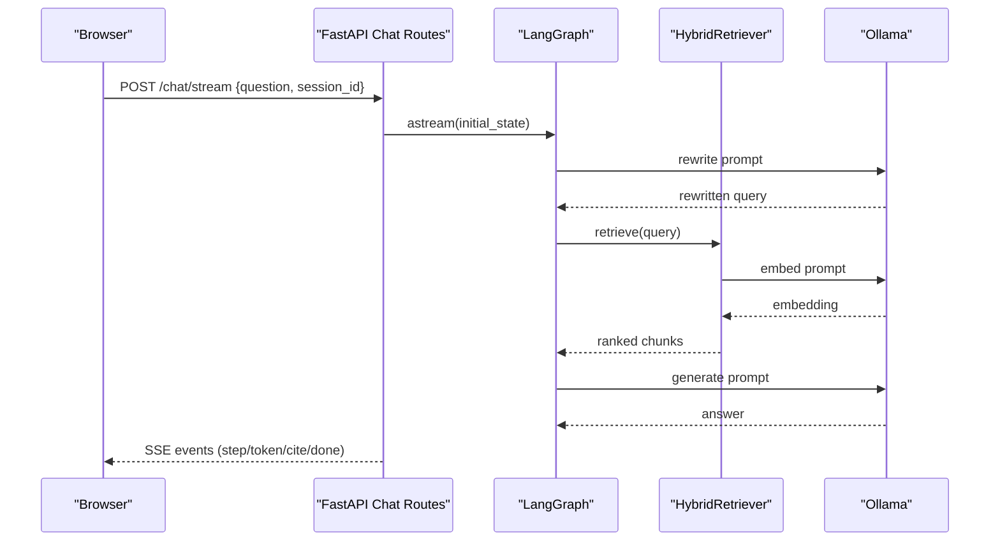
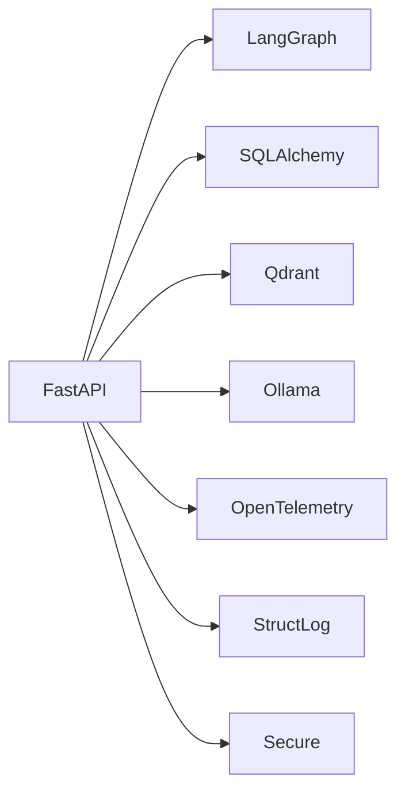

# Architecture and Design

<cite>
**Referenced Files in This Document**
- [README.md](file://safe4ai-pilot/README.md)
- [architecture.md](file://safe4ai-pilot/docs/architecture.md)
- [docker-compose.yml](file://safe4ai-pilot/docker-compose.yml)
- [app/main.py](file://safe4ai-pilot/app/main.py)
- [app/config.py](file://safe4ai-pilot/app/config.py)
- [app/models.py](file://safe4ai-pilot/app/models.py)
- [app/api/chat_routes.py](file://safe4ai-pilot/app/api/chat_routes.py)
- [app/agents/graph.py](file://safe4ai-pilot/app/agents/graph.py)
- [app/components/hybrid_retriever.py](file://safe4ai-pilot/app/components/hybrid_retriever.py)
- [app/security/input_guard.py](file://safe4ai-pilot/app/security/input_guard.py)
- [app/security/content_filter.py](file://safe4ai-pilot/app/security/content_filter.py)
- [app/security/output_filter.py](file://safe4ai-pilot/app/security/output_filter.py)
- [frontend/src/App.tsx](file://safe4ai-pilot/frontend/src/App.tsx)
- [pyproject.toml](file://safe4ai-pilot/pyproject.toml)
</cite>

## Table of Contents
1. [Introduction](#introduction)
2. [Project Structure](#project-structure)
3. [Core Components](#core-components)
4. [Architecture Overview](#architecture-overview)
5. [Detailed Component Analysis](#detailed-component-analysis)
6. [Dependency Analysis](#dependency-analysis)
7. [Performance Considerations](#performance-considerations)
8. [Troubleshooting Guide](#troubleshooting-guide)
9. [Conclusion](#conclusion)
10. [Appendices](#appendices)

## Introduction
This document describes the architecture and design of the Private AI system. It focuses on the layered architecture pattern (presentation, business logic, data access), the microservices topology (FastAPI backend, React frontend, PostgreSQL with pgvector, Qdrant vector store, Ollama LLM, Jaeger observability), the LangGraph State Machine for AI workflows, and the hybrid retrieval architecture combining dense and sparse vector search. It also covers infrastructure requirements, scalability considerations, deployment topology, and cross-cutting concerns such as security, auditability, and compliance.

## Project Structure
The system is organized into:
- Backend: FastAPI application with API routes, agent graph, components, security guards, and services.
- Frontend: React SPA with routing and admin pages.
- Infrastructure: Docker Compose orchestrating PostgreSQL, Qdrant, Ollama, Jaeger, backend, and frontend.
- Documentation and tests: Architecture notes, deployment guidance, and a comprehensive test suite.

**Diagram sources**
- [app/main.py:63-101](file://safe4ai-pilot/app/main.py#L63-L101)
- [app/api/chat_routes.py:28-244](file://safe4ai-pilot/app/api/chat_routes.py#L28-L244)
- [app/agents/graph.py:39-341](file://safe4ai-pilot/app/agents/graph.py#L39-L341)
- [app/components/hybrid_retriever.py:13-142](file://safe4ai-pilot/app/components/hybrid_retriever.py#L13-L142)
- [app/security/input_guard.py:24-48](file://safe4ai-pilot/app/security/input_guard.py#L24-L48)
- [app/security/content_filter.py:24-62](file://safe4ai-pilot/app/security/content_filter.py#L24-L62)
- [app/security/output_filter.py:30-59](file://safe4ai-pilot/app/security/output_filter.py#L30-L59)
- [frontend/src/App.tsx:25-91](file://safe4ai-pilot/frontend/src/App.tsx#L25-L91)

**Section sources**
- [README.md:1-133](file://safe4ai-pilot/README.md#L1-L133)
- [docker-compose.yml:1-119](file://safe4ai-pilot/docker-compose.yml#L1-L119)
- [pyproject.toml:5-46](file://safe4ai-pilot/pyproject.toml#L5-L46)

## Core Components
- Presentation Layer (React): Provides chat UI, admin dashboards, and protected routing.
- Business Logic Layer (FastAPI + LangGraph): Implements the AI workflow, routing, guards, and streaming responses.
- Data Access Layer (SQLAlchemy + pgvector + Qdrant): Manages conversations, audit trails, and retrieval of document chunks.

Key implementation anchors:
- Backend entrypoint and middleware: [app/main.py:63-101](file://safe4ai-pilot/app/main.py#L63-L101)
- Chat API endpoints and streaming: [app/api/chat_routes.py:28-244](file://safe4ai-pilot/app/api/chat_routes.py#L28-L244)
- LangGraph pipeline definition: [app/agents/graph.py:39-341](file://safe4ai-pilot/app/agents/graph.py#L39-L341)
- Hybrid retrieval (dense + sparse fusion): [app/components/hybrid_retriever.py:13-142](file://safe4ai-pilot/app/components/hybrid_retriever.py#L13-L142)
- Security guards: [app/security/input_guard.py:24-48](file://safe4ai-pilot/app/security/input_guard.py#L24-L48), [app/security/content_filter.py:24-62](file://safe4ai-pilot/app/security/content_filter.py#L24-L62), [app/security/output_filter.py:30-59](file://safe4ai-pilot/app/security/output_filter.py#L30-L59)
- Domain models: [app/models.py:49-95](file://safe4ai-pilot/app/models.py#L49-L95)

**Section sources**
- [app/main.py:63-101](file://safe4ai-pilot/app/main.py#L63-L101)
- [app/api/chat_routes.py:28-244](file://safe4ai-pilot/app/api/chat_routes.py#L28-L244)
- [app/agents/graph.py:39-341](file://safe4ai-pilot/app/agents/graph.py#L39-L341)
- [app/components/hybrid_retriever.py:13-142](file://safe4ai-pilot/app/components/hybrid_retriever.py#L13-L142)
- [app/security/input_guard.py:24-48](file://safe4ai-pilot/app/security/input_guard.py#L24-L48)
- [app/security/content_filter.py:24-62](file://safe4ai-pilot/app/security/content_filter.py#L24-L62)
- [app/security/output_filter.py:30-59](file://safe4ai-pilot/app/security/output_filter.py#L30-L59)
- [app/models.py:49-95](file://safe4ai-pilot/app/models.py#L49-L95)

## Architecture Overview
The system follows a layered architecture:
- Presentation: React SPA with protected routes and admin dashboards.
- Business Logic: FastAPI routes orchestrate the LangGraph pipeline, enforce rate limits, and stream responses.
- Data Access: SQLAlchemy ORM with PostgreSQL (pgvector extension) and Qdrant for hybrid retrieval.

Microservices topology:
- Backend: FastAPI app with health checks and middleware.
- Frontend: Vite-built SPA served via Nginx in the provided Dockerfile.
- Data stores: PostgreSQL (audit, sessions, document_chunks) and Qdrant (dense vectors).
- LLM: Ollama for embeddings and generation.
- Observability: Jaeger for tracing.

**Diagram sources**
- [docker-compose.yml:1-119](file://safe4ai-pilot/docker-compose.yml#L1-L119)
- [app/main.py:118-147](file://safe4ai-pilot/app/main.py#L118-L147)

**Section sources**
- [architecture.md:1-45](file://safe4ai-pilot/docs/architecture.md#L1-L45)
- [docker-compose.yml:1-119](file://safe4ai-pilot/docker-compose.yml#L1-L119)
- [app/main.py:118-147](file://safe4ai-pilot/app/main.py#L118-L147)

## Detailed Component Analysis

### LangGraph State Machine Implementation
The AI workflow is modeled as a StateGraph with nodes for intake, rewrite, retrieve, grade, decompose, generate, output_filter, quality_gate, respond, and fallback. Conditional edges route based on LLM decisions and safety rules. The graph is compiled once at startup and reused across requests.

**Diagram sources**
- [app/agents/graph.py:39-341](file://safe4ai-pilot/app/agents/graph.py#L39-L341)

**Section sources**
- [app/agents/graph.py:39-341](file://safe4ai-pilot/app/agents/graph.py#L39-L341)

### Hybrid Retrieval Architecture (Dense + Sparse Fusion)
The HybridRetriever performs:
- Dense retrieval via Qdrant using embeddings produced by Ollama’s embedding model.
- Sparse retrieval via BM25 on chunk payloads.
- Reciprocal Rank Fusion (RRF) to combine scores.

**Diagram sources**
- [app/components/hybrid_retriever.py:42-142](file://safe4ai-pilot/app/components/hybrid_retriever.py#L42-L142)

**Section sources**
- [app/components/hybrid_retriever.py:13-142](file://safe4ai-pilot/app/components/hybrid_retriever.py#L13-L142)

### Security, Auditability, and Compliance
- InputGuard: Sanitization and length checks plus injection pattern detection.
- ContentFilter: Removes chunks containing PII before LLM access.
- OutputFilter: Detects PII hallucinations and logs suspiciously long outputs.
- Audit and sessions: Stored in PostgreSQL; retention governed by settings.
- Compliance: Structured logging, rate limiting, secure headers, and configurable HTTPS enforcement.

**Diagram sources**
- [app/security/input_guard.py:24-48](file://safe4ai-pilot/app/security/input_guard.py#L24-L48)
- [app/security/content_filter.py:24-62](file://safe4ai-pilot/app/security/content_filter.py#L24-L62)
- [app/security/output_filter.py:30-59](file://safe4ai-pilot/app/security/output_filter.py#L30-L59)

**Section sources**
- [app/security/input_guard.py:24-48](file://safe4ai-pilot/app/security/input_guard.py#L24-L48)
- [app/security/content_filter.py:24-62](file://safe4ai-pilot/app/security/content_filter.py#L24-L62)
- [app/security/output_filter.py:30-59](file://safe4ai-pilot/app/security/output_filter.py#L30-L59)
- [app/config.py:5-28](file://safe4ai-pilot/app/config.py#L5-L28)

### Streaming Chat API and Conversation Management
The backend exposes:
- Blocking POST /chat for evaluations and tests.
- Streaming POST /chat/stream for the frontend, emitting step events and answer tokens.

**Diagram sources**
- [app/api/chat_routes.py:150-244](file://safe4ai-pilot/app/api/chat_routes.py#L150-L244)
- [app/agents/graph.py:64-231](file://safe4ai-pilot/app/agents/graph.py#L64-L231)
- [app/components/hybrid_retriever.py:42-142](file://safe4ai-pilot/app/components/hybrid_retriever.py#L42-L142)

**Section sources**
- [app/api/chat_routes.py:28-244](file://safe4ai-pilot/app/api/chat_routes.py#L28-L244)
- [app/agents/graph.py:64-231](file://safe4ai-pilot/app/agents/graph.py#L64-L231)

## Dependency Analysis
The backend relies on:
- FastAPI for routing and ASGI server.
- LangGraph for stateful workflows.
- Qdrant client and pgvector for vector storage.
- Ollama for embeddings and generation.
- OpenTelemetry for tracing.
- SQLAlchemy and Alembic for persistence and migrations.
- Structlog for structured logging and Secure for HTTP headers.

**Diagram sources**
- [pyproject.toml:9-46](file://safe4ai-pilot/pyproject.toml#L9-L46)
- [app/main.py:14-20](file://safe4ai-pilot/app/main.py#L14-L20)

**Section sources**
- [pyproject.toml:5-46](file://safe4ai-pilot/pyproject.toml#L5-L46)
- [app/main.py:14-20](file://safe4ai-pilot/app/main.py#L14-L20)

## Performance Considerations
- Model warm-up: The backend pre-warms Ollama to reduce first-request latency.
- Streaming: SSE streaming improves perceived latency and UX.
- Hybrid retrieval: BM25 reduces embedding calls for broad keyword matching; RRF balances recall and precision.
- Rate limiting: Protects downstream services under load.
- GPU note: Production may require CUDA-enabled PyTorch; see production TODO in README.

**Section sources**
- [app/main.py:104-116](file://safe4ai-pilot/app/main.py#L104-L116)
- [app/api/chat_routes.py:150-244](file://safe4ai-pilot/app/api/chat_routes.py#L150-L244)
- [architecture.md:36-44](file://safe4ai-pilot/docs/architecture.md#L36-L44)
- [README.md:130-133](file://safe4ai-pilot/README.md#L130-L133)

## Troubleshooting Guide
- Health checks: Verify backend, Qdrant, and Ollama availability via /health and service-specific endpoints.
- Logs: Use Docker Compose logs for app and frontend containers.
- Dependencies: Confirm Ollama models are pulled and initialized.
- CORS and body size: The backend enforces allowed origins and maximum request size.

**Section sources**
- [app/main.py:118-147](file://safe4ai-pilot/app/main.py#L118-L147)
- [app/main.py:87-95](file://safe4ai-pilot/app/main.py#L87-L95)
- [README.md:55-129](file://safe4ai-pilot/README.md#L55-L129)

## Conclusion
The Private AI system integrates a React frontend, a FastAPI backend, and a vector-first retrieval pipeline powered by Qdrant and Ollama. LangGraph orchestrates a robust, safety-aware RAG workflow with hybrid retrieval and streaming responses. The architecture emphasizes modularity, observability, and security, with clear separation of concerns across layers and services.

## Appendices

### Deployment Topology and Infrastructure
- Docker Compose provisions PostgreSQL, Qdrant, Ollama, Jaeger, the backend, and the frontend.
- Environment variables configure service URLs and runtime settings.
- Health checks ensure readiness across services.

**Section sources**
- [docker-compose.yml:1-119](file://safe4ai-pilot/docker-compose.yml#L1-L119)
- [app/config.py:5-28](file://safe4ai-pilot/app/config.py#L5-L28)

### Technology Stack Decisions and Rationale
- Local LLM deployment (Ollama): Keeps data on-device, reduces latency, and supports offline scenarios.
- Qdrant + pgvector: Dedicated ANN engine for dense retrieval; pgvector for small semantic cache and audit data.
- LangGraph: Enables explicit state, observability, and deterministic control flow.
- React + FastAPI: Modern, type-safe frontend/backend pairing with strong ecosystems.

**Section sources**
- [architecture.md:3-18](file://safe4ai-pilot/docs/architecture.md#L3-L18)
- [pyproject.toml:9-46](file://safe4ai-pilot/pyproject.toml#L9-L46)