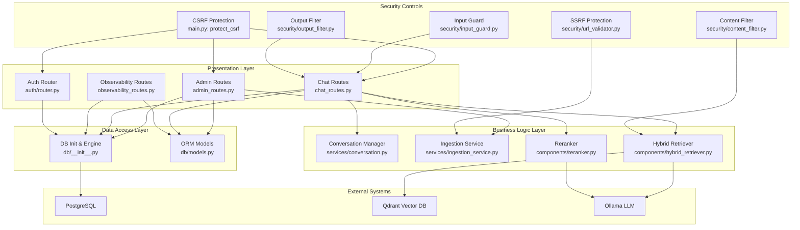
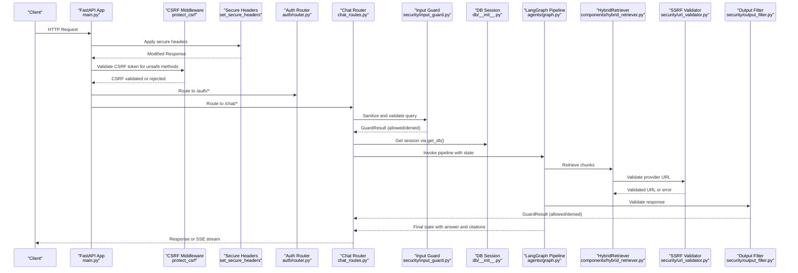
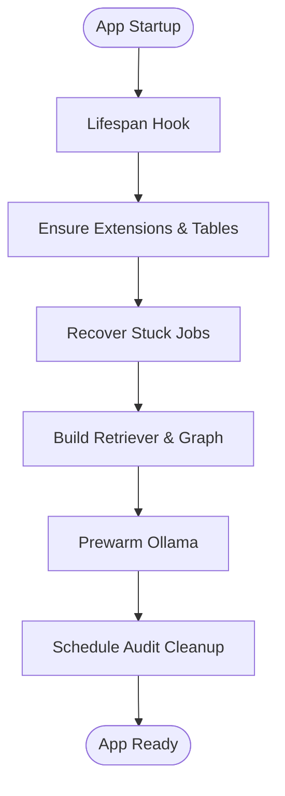
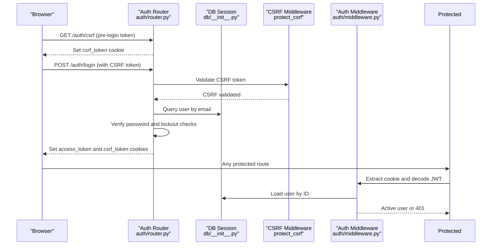
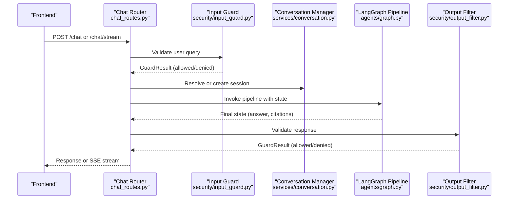
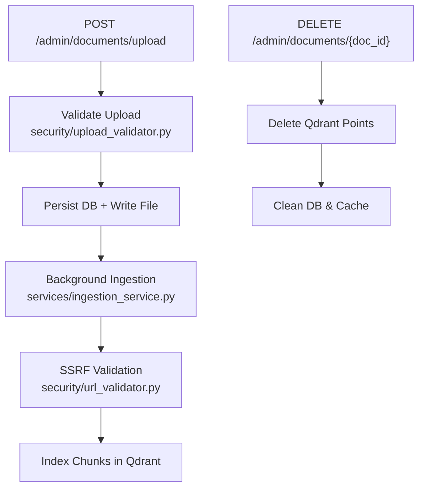
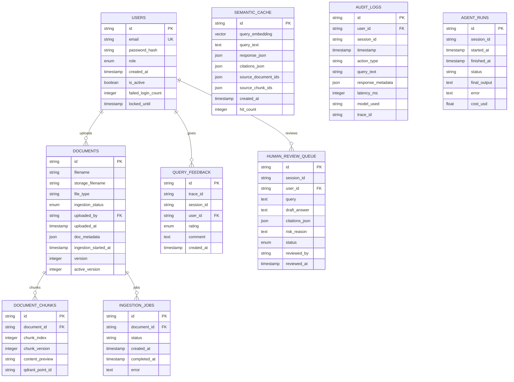
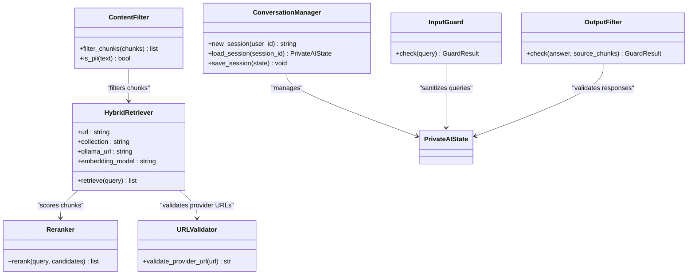
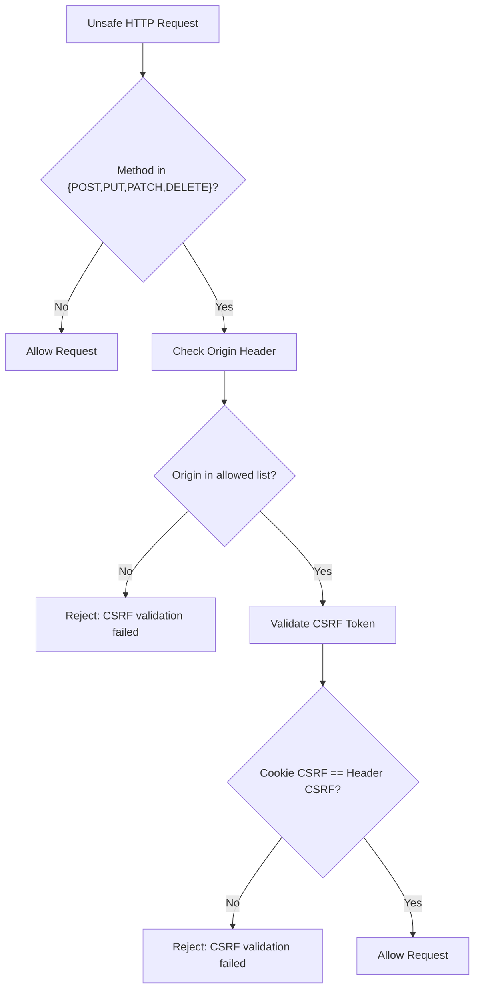
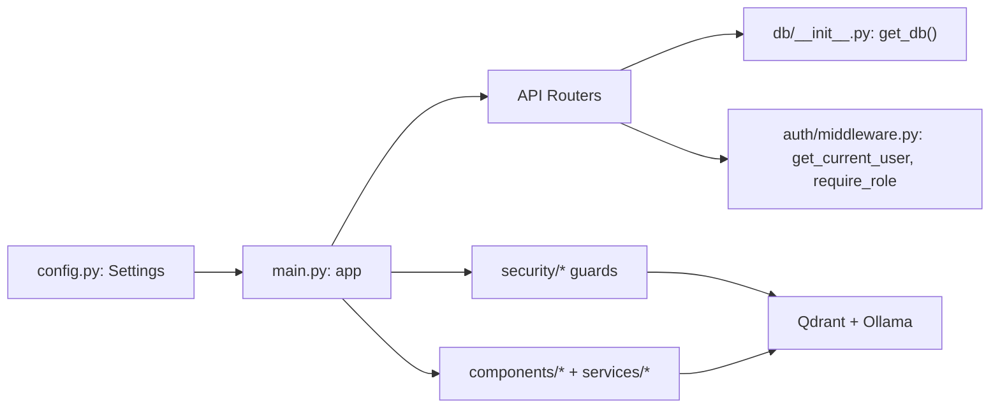

# Backend Architecture

<cite>
**Referenced Files in This Document**
- [main.py](file://safe4ai-pilot/app/main.py)
- [config.py](file://safe4ai-pilot/app/config.py)
- [admin_routes.py](file://safe4ai-pilot/app/api/admin_routes.py)
- [chat_routes.py](file://safe4ai-pilot/app/api/chat_routes.py)
- [middleware.py](file://safe4ai-pilot/app/auth/middleware.py)
- [router.py](file://safe4ai-pilot/app/auth/router.py)
- [models.py](file://safe4ai-pilot/app/db/models.py)
- [db_init.py](file://safe4ai-pilot/app/db/__init__.py)
- [models.py](file://safe4ai-pilot/app/models.py)
- [hybrid_retriever.py](file://safe4ai-pilot/app/components/hybrid_retriever.py)
- [reranker.py](file://safe4ai-pilot/app/components/reranker.py)
- [ingestion_service.py](file://safe4ai-pilot/app/services/ingestion_service.py)
- [conversation.py](file://safe4ai-pilot/app/services/conversation.py)
- [graph.py](file://safe4ai-pilot/app/agents/graph.py)
- [observability_routes.py](file://safe4ai-pilot/app/api/observability_routes.py)
- [upload_validator.py](file://safe4ai-pilot/app/security/upload_validator.py)
- [content_filter.py](file://safe4ai-pilot/app/security/content_filter.py)
- [input_guard.py](file://safe4ai-pilot/app/security/input_guard.py)
- [output_filter.py](file://safe4ai-pilot/app/security/output_filter.py)
- [url_validator.py](file://safe4ai-pilot/app/security/url_validator.py)
- [feedback.py](file://safe4ai-pilot/observability/feedback.py)
- [tracer.py](file://safe4ai-pilot/observability/tracer.py)
- [cost_tracker.py](file://safe4ai-pilot/observability/cost_tracker.py)
- [docker-compose.yml](file://safe4ai-pilot/docker-compose.yml)
</cite>

## Update Summary
**Changes Made**
- Enhanced security middleware documentation to include new CSRF protection system
- Added comprehensive SSRF protection documentation with URL validator implementation
- Documented strengthened input/output filtering with guard components
- Updated architecture diagrams to reflect new security controls
- Added security guard components to the layered architecture model

## Table of Contents
1. [Introduction](#introduction)
2. [Project Structure](#project-structure)
3. [Core Components](#core-components)
4. [Architecture Overview](#architecture-overview)
5. [Detailed Component Analysis](#detailed-component-analysis)
6. [Security Controls](#security-controls)
7. [Dependency Analysis](#dependency-analysis)
8. [Performance Considerations](#performance-considerations)
9. [Troubleshooting Guide](#troubleshooting-guide)
10. [Conclusion](#conclusion)

## Introduction
This document describes the backend architecture of the FastAPI-based Private AI system. The system follows a layered architecture separating presentation (FastAPI routers), business logic (services), and data access (SQLAlchemy ORM). It integrates external systems for vector search (Qdrant) and local LLM inference (Ollama) through a LangGraph pipeline. The backend emphasizes secure authentication, robust middleware, structured logging, and observability with comprehensive security controls including CSRF protection, SSRF prevention, and content filtering.

## Project Structure
The backend is organized into clear layers with enhanced security controls:
- Presentation: FastAPI routers under app/api
- Business Logic: Services under app/services
- Data Access: SQLAlchemy models and session management under app/db
- Authentication: JWT middleware and auth router under app/auth
- AI Components: Retrieval and reranking under app/components
- Application Orchestration: Graph pipeline under app/agents
- Security Guards: Input/output filters, upload validation, and SSRF protection under app/security
- Observability: Tracing, feedback, and cost tracking under observability/

**Diagram sources**
- [main.py:63-101](file://safe4ai-pilot/app/main.py#L63-L101)
- [admin_routes.py:39-38](file://safe4ai-pilot/app/api/admin_routes.py#L39-L38)
- [chat_routes.py:28-26](file://safe4ai-pilot/app/api/chat_routes.py#L28-L26)
- [db_init.py:8-21](file://safe4ai-pilot/app/db/__init__.py#L8-L21)
- [models.py:45-175](file://safe4ai-pilot/app/db/models.py#L45-L175)
- [url_validator.py:26-56](file://safe4ai-pilot/app/security/url_validator.py#L26-L56)
- [input_guard.py:26-48](file://safe4ai-pilot/app/security/input_guard.py#L26-L48)
- [output_filter.py:30-60](file://safe4ai-pilot/app/security/output_filter.py#L30-L60)
- [content_filter.py:24-63](file://safe4ai-pilot/app/security/content_filter.py#L24-L63)

**Section sources**
- [main.py:63-101](file://safe4ai-pilot/app/main.py#L63-L101)
- [config.py:5-27](file://safe4ai-pilot/app/config.py#L5-L27)

## Core Components
- FastAPI Application: Central app with lifecycle management, middleware, CORS, rate limiting, and health checks.
- Configuration Management: Pydantic settings with environment variable loading and computed lists.
- Authentication Middleware: JWT extraction from cookies, role-based access control, and password utilities.
- Security Middleware: Comprehensive CSRF protection, body size limits, and secure headers enforcement.
- API Routers:
  - Admin: Document lifecycle, user management, audit log export, statistics, and human review queue.
  - Chat: Blocking and streaming chat endpoints backed by a LangGraph pipeline with security guards.
  - Observability: Metrics and feedback endpoints.
- Data Access: SQLAlchemy declarative base, engine, session factory, and comprehensive ORM models.
- AI Components: HybridRetriever for Qdrant/Ollama embeddings and retrieval; Reranker for relevance scoring.
- Services: Conversation persistence, ingestion orchestration, and semantic caching support.
- Security Guards: InputGuard for query sanitization, OutputFilter for response validation, ContentFilter for PII detection, and URLValidator for SSRF protection.

**Section sources**
- [main.py:28-60](file://safe4ai-pilot/app/main.py#L28-L60)
- [config.py:5-27](file://safe4ai-pilot/app/config.py#L5-L27)
- [middleware.py:51-71](file://safe4ai-pilot/app/auth/middleware.py#L51-L71)
- [admin_routes.py:39-539](file://safe4ai-pilot/app/api/admin_routes.py#L39-L539)
- [chat_routes.py:28-244](file://safe4ai-pilot/app/api/chat_routes.py#L28-L244)
- [db_init.py:8-21](file://safe4ai-pilot/app/db/__init__.py#L8-L21)
- [models.py:45-175](file://safe4ai-pilot/app/db/models.py#L45-L175)
- [hybrid_retriever.py](file://safe4ai-pilot/app/components/hybrid_retriever.py)
- [reranker.py](file://safe4ai-pilot/app/components/reranker.py)
- [conversation.py](file://safe4ai-pilot/app/services/conversation.py)
- [ingestion_service.py](file://safe4ai-pilot/app/services/ingestion_service.py)
- [input_guard.py:26-48](file://safe4ai-pilot/app/security/input_guard.py#L26-L48)
- [output_filter.py:30-60](file://safe4ai-pilot/app/security/output_filter.py#L30-L60)
- [content_filter.py:24-63](file://safe4ai-pilot/app/security/content_filter.py#L24-L63)
- [url_validator.py:26-56](file://safe4ai-pilot/app/security/url_validator.py#L26-L56)

## Architecture Overview
The system initializes shared resources during app lifespan, including database schema creation, stuck ingestion recovery, and prewarming of the LLM. The LangGraph pipeline is built once and reused across requests. Enhanced middleware enforces CORS, secure headers, comprehensive CSRF protection, body size limits, and rate limiting. Authentication relies on signed JWT cookies with role-based enforcement. Security guards are integrated throughout the pipeline to prevent various attack vectors.

**Diagram sources**
- [main.py:69-95](file://safe4ai-pilot/app/main.py#L69-L95)
- [router.py:39-105](file://safe4ai-pilot/app/auth/router.py#L39-L105)
- [chat_routes.py:109-244](file://safe4ai-pilot/app/api/chat_routes.py#L109-L244)
- [db_init.py:16-21](file://safe4ai-pilot/app/db/__init__.py#L16-L21)
- [graph.py](file://safe4ai-pilot/app/agents/graph.py)
- [hybrid_retriever.py](file://safe4ai-pilot/app/components/hybrid_retriever.py)
- [reranker.py](file://safe4ai-pilot/app/components/reranker.py)
- [input_guard.py:26-48](file://safe4ai-pilot/app/security/input_guard.py#L26-L48)
- [output_filter.py:30-60](file://safe4ai-pilot/app/security/output_filter.py#L30-L60)
- [url_validator.py:26-56](file://safe4ai-pilot/app/security/url_validator.py#L26-L56)

## Detailed Component Analysis

### FastAPI Application and Lifecycle
- Lifespan: Creates vector extension, metadata, recovers stuck jobs, builds HybridRetriever and LangGraph once, prewarms Ollama, schedules cleanup tasks.
- Enhanced Middleware Stack: Includes CORS, secure headers, CSRF protection, body size enforcement, and rate limiting.
- Routers: Includes auth, chat, observability, and admin routers.
- Health Endpoint: Checks Postgres, Qdrant, and Ollama connectivity with security headers.

**Diagram sources**
- [main.py:28-60](file://safe4ai-pilot/app/main.py#L28-L60)
- [main.py:104-116](file://safe4ai-pilot/app/main.py#L104-L116)
- [ingestion_service.py](file://safe4ai-pilot/app/services/ingestion_service.py)

**Section sources**
- [main.py:28-60](file://safe4ai-pilot/app/main.py#L28-L60)
- [main.py:69-95](file://safe4ai-pilot/app/main.py#L69-L95)
- [main.py:118-147](file://safe4ai-pilot/app/main.py#L118-L147)

### Configuration Management
- Settings class defines typed configuration with defaults and environment file binding.
- Computed property converts comma-separated origins into a list.
- Used across app for database URLs, external service endpoints, rate limits, and security flags.

**Section sources**
- [config.py:5-27](file://safe4ai-pilot/app/config.py#L5-L27)

### Authentication and Authorization
- JWT utilities: encode/decode, bcrypt password hashing/verification.
- Middleware dependency extracts cookie token, validates, loads active user.
- Role enforcement via dependency that raises 403 if roles mismatch.
- Auth router provides login/logout with brute-force protection, CSRF token issuance, and rate limiting.

**Diagram sources**
- [router.py:39-105](file://safe4ai-pilot/app/auth/router.py#L39-L105)
- [middleware.py:51-71](file://safe4ai-pilot/app/auth/middleware.py#L51-L71)
- [db_init.py:16-21](file://safe4ai-pilot/app/db/__init__.py#L16-L21)
- [main.py:93-118](file://safe4ai-pilot/app/main.py#L93-L118)

**Section sources**
- [middleware.py:25-48](file://safe4ai-pilot/app/auth/middleware.py#L25-L48)
- [middleware.py:51-71](file://safe4ai-pilot/app/auth/middleware.py#L51-L71)
- [router.py:39-105](file://safe4ai-pilot/app/auth/router.py#L39-L105)

### Chat API and Streaming
- Endpoints:
  - POST /chat: synchronous invocation of the LangGraph pipeline with input validation.
  - POST /chat/stream: SSE stream of pipeline steps, tokens, citations, and completion metadata.
- Session management: ConversationManager persists user sessions and messages.
- Enhanced Security: InputGuard validates queries, OutputFilter checks responses, and rate limiting protects endpoints.
- Error handling: 422 for invalid input, 503 if pipeline not ready, 500 for pipeline errors.

**Diagram sources**
- [chat_routes.py:109-244](file://safe4ai-pilot/app/api/chat_routes.py#L109-L244)
- [conversation.py](file://safe4ai-pilot/app/services/conversation.py)
- [graph.py](file://safe4ai-pilot/app/agents/graph.py)
- [input_guard.py:26-48](file://safe4ai-pilot/app/security/input_guard.py#L26-L48)
- [output_filter.py:30-60](file://safe4ai-pilot/app/security/output_filter.py#L30-L60)

**Section sources**
- [chat_routes.py:109-244](file://safe4ai-pilot/app/api/chat_routes.py#L109-L244)
- [conversation.py](file://safe4ai-pilot/app/services/conversation.py)

### Admin API
- Document Management: Upload, list, poll status, delete, reindex with background ingestion and SSRF protection.
- User Management: List, create, deactivate users with role checks.
- Audit Logs: List and CSV export with filtering.
- Statistics: Aggregated metrics over time windows.
- Human Review Queue: Approve/reject items.
- Upload Validation: Enforces size and content checks before ingestion.
- Qdrant Integration: Deletes points by document ID during deletion.

**Diagram sources**
- [admin_routes.py:63-114](file://safe4ai-pilot/app/api/admin_routes.py#L63-L114)
- [admin_routes.py:178-208](file://safe4ai-pilot/app/api/admin_routes.py#L178-L208)
- [upload_validator.py](file://safe4ai-pilot/app/security/upload_validator.py)
- [ingestion_service.py](file://safe4ai-pilot/app/services/ingestion_service.py)
- [url_validator.py:26-56](file://safe4ai-pilot/app/security/url_validator.py#L26-L56)

**Section sources**
- [admin_routes.py:63-244](file://safe4ai-pilot/app/api/admin_routes.py#L63-L244)
- [admin_routes.py:261-277](file://safe4ai-pilot/app/api/admin_routes.py#L261-L277)
- [upload_validator.py](file://safe4ai-pilot/app/security/upload_validator.py)

### Data Access Layer
- Engine and Session: Configured with connection pooling and pre-ping.
- Declarative Base: Shared across models.
- Models: Users, Sessions, Documents, DocumentChunks, SemanticCache, AuditLogs, AgentRuns, QueryFeedback, IngestionJobs, HumanReviewQueue.
- Relationships: Foreign keys define referential integrity for documents, chunks, jobs, and feedback.

**Diagram sources**
- [db_init.py:8-21](file://safe4ai-pilot/app/db/__init__.py#L8-L21)
- [models.py:45-175](file://safe4ai-pilot/app/db/models.py#L45-L175)

**Section sources**
- [db_init.py:8-21](file://safe4ai-pilot/app/db/__init__.py#L8-L21)
- [models.py:45-175](file://safe4ai-pilot/app/db/models.py#L45-L175)

### AI Components and Pipelines
- HybridRetriever: Integrates Qdrant for vector search and Ollama for embeddings with SSRF protection.
- Reranker: Uses Ollama to improve relevance scores.
- LangGraph Pipeline: Orchestrates rewrite → retrieve → grade → decompose → generate → filter → quality gate → respond/fallback nodes.
- Conversation Manager: Persists session state and messages to the database.

**Diagram sources**
- [hybrid_retriever.py](file://safe4ai-pilot/app/components/hybrid_retriever.py)
- [reranker.py](file://safe4ai-pilot/app/components/reranker.py)
- [conversation.py](file://safe4ai-pilot/app/services/conversation.py)
- [models.py:49-95](file://safe4ai-pilot/app/models.py#L49-L95)
- [url_validator.py:26-56](file://safe4ai-pilot/app/security/url_validator.py#L26-L56)
- [input_guard.py:26-48](file://safe4ai-pilot/app/security/input_guard.py#L26-L48)
- [output_filter.py:30-60](file://safe4ai-pilot/app/security/output_filter.py#L30-L60)
- [content_filter.py:24-63](file://safe4ai-pilot/app/security/content_filter.py#L24-L63)

**Section sources**
- [hybrid_retriever.py](file://safe4ai-pilot/app/components/hybrid_retriever.py)
- [reranker.py](file://safe4ai-pilot/app/components/reranker.py)
- [conversation.py](file://safe4ai-pilot/app/services/conversation.py)
- [models.py:49-95](file://safe4ai-pilot/app/models.py#L49-L95)

### Observability and Security
- Observability Routes: Expose metrics and feedback endpoints.
- Content Filter: Guards against unsafe content during retrieval and generation.
- Feedback and Tracing: Captures user feedback and trace identifiers for debugging.
- Cost Tracking: Tracks monetary costs associated with agent runs.

**Section sources**
- [observability_routes.py](file://safe4ai-pilot/app/api/observability_routes.py)
- [content_filter.py](file://safe4ai-pilot/app/security/content_filter.py)
- [feedback.py](file://safe4ai-pilot/observability/feedback.py)
- [tracer.py](file://safe4ai-pilot/observability/tracer.py)
- [cost_tracker.py](file://safe4ai-pilot/observability/cost_tracker.py)

## Security Controls

### CSRF Protection System
The system implements comprehensive CSRF protection through a dedicated middleware that validates double-submit tokens for all unsafe HTTP methods (POST, PUT, PATCH, DELETE). The protection mechanism includes:

- Double-submit token validation: Requires both CSRF cookie and X-CSRF-Token header to match
- Origin validation: Ensures requests originate from allowed origins
- Special handling for login endpoint: Additional origin requirement for `/auth/login`
- Secure cookie configuration: CSRF tokens use httponly=False for client-side JavaScript access

**Diagram sources**
- [main.py:93-118](file://safe4ai-pilot/app/main.py#L93-L118)
- [router.py:55-67](file://safe4ai-pilot/app/auth/router.py#L55-L67)

**Section sources**
- [main.py:93-118](file://safe4ai-pilot/app/main.py#L93-L118)
- [router.py:55-67](file://safe4ai-pilot/app/auth/router.py#L55-L67)

### SSRF Protection System
The system implements comprehensive SSRF (Server-Side Request Forgery) protection through URL validation that:

- Validates URL schemes (only http/https allowed)
- Resolves hostnames and blocks private/reserved IP ranges
- Blocks RFC1918 private networks, loopback addresses, and link-local addresses
- Supports both IPv4 and IPv6 address validation
- Returns cleaned URLs on successful validation

**Section sources**
- [url_validator.py:26-56](file://safe4ai-pilot/app/security/url_validator.py#L26-L56)

### Input and Output Filtering
The system implements multi-layered filtering to prevent prompt injection and content leakage:

- InputGuard: Sanitizes user queries, removes HTML tags, normalizes Unicode, validates length, and detects injection patterns
- OutputFilter: Validates LLM responses for PII hallucinations and suspicious length thresholds
- ContentFilter: Detects and removes PII from document chunks using regex patterns

**Section sources**
- [input_guard.py:26-48](file://safe4ai-pilot/app/security/input_guard.py#L26-L48)
- [output_filter.py:30-60](file://safe4ai-pilot/app/security/output_filter.py#L30-L60)
- [content_filter.py:24-63](file://safe4ai-pilot/app/security/content_filter.py#L24-L63)

## Dependency Analysis
- App Initialization: main.py wires routers, middleware, and lifespan; reads settings; initializes DB and external clients.
- Router Dependencies: Each router depends on get_db for SQLAlchemy sessions and auth dependencies for user/role checks.
- AI Dependencies: Chat routes depend on HybridRetriever and Reranker initialized in lifespan; ingestion depends on Qdrant and Ollama.
- Security Dependencies: All external URL usage goes through SSRF validator; chat queries pass through InputGuard; responses through OutputFilter.
- Configuration: All components consume settings for endpoints, limits, and security.

**Diagram sources**
- [main.py:19-21](file://safe4ai-pilot/app/main.py#L19-L21)
- [config.py:27-27](file://safe4ai-pilot/app/config.py#L27-L27)
- [db_init.py:16-21](file://safe4ai-pilot/app/db/__init__.py#L16-L21)
- [middleware.py:51-71](file://safe4ai-pilot/app/auth/middleware.py#L51-L71)

**Section sources**
- [main.py:14-21](file://safe4ai-pilot/app/main.py#L14-L21)
- [db_init.py:16-21](file://safe4ai-pilot/app/db/__init__.py#L16-L21)
- [middleware.py:51-71](file://safe4ai-pilot/app/auth/middleware.py#L51-L71)

## Performance Considerations
- Pre-warming: Ollama is warmed up after startup to avoid cold-start latency on first query.
- Singleton Graph: LangGraph pipeline is built once in lifespan and reused across requests.
- Body Size Limits: Requests exceeding configured maximum are rejected early with comprehensive chunked transfer support.
- Rate Limiting: SlowAPI limiter protects sensitive endpoints (auth, admin).
- Database Pooling: Engine configured with pre-ping to maintain healthy connections.
- Streaming Responses: SSE streaming reduces perceived latency and memory footprint for long-running chats.
- Security Overhead: CSRF validation adds minimal overhead with constant-time token comparison.

**Section sources**
- [main.py:58-58](file://safe4ai-pilot/app/main.py#L58-L58)
- [main.py:104-116](file://safe4ai-pilot/app/main.py#L104-L116)
- [chat_routes.py:150-244](file://safe4ai-pilot/app/api/chat_routes.py#L150-L244)
- [router.py:40-40](file://safe4ai-pilot/app/auth/router.py#L40-L40)
- [admin_routes.py:64-114](file://safe4ai-pilot/app/api/admin_routes.py#L64-L114)
- [db_init.py:8-8](file://safe4ai-pilot/app/db/__init__.py#L8-L8)

## Troubleshooting Guide
- Authentication Failures: 401 Not authenticated indicates missing or invalid JWT; verify cookie presence and signature.
- Authorization Denials: 403 Forbidden occurs when roles mismatch; confirm user role assignment.
- CSRF Validation Errors: 403 CSRF validation failed indicates missing or mismatched CSRF token; ensure both cookie and header match.
- Chat Pipeline Errors: 503 indicates pipeline not ready; 500 indicates internal pipeline error; check health endpoints for external dependencies.
- Upload Issues: 413 Request Entity Too Large if body exceeds configured limit; 400 on validation failures; verify content type and size.
- SSRF Protection: 422 URL validation errors indicate blocked private/reserved addresses; use public endpoints only.
- Input/Output Filtering: Queries blocked by InputGuard or OutputFilter will return 422 with specific reasons.
- External Dependencies: Use /health to verify Postgres, Qdrant, and Ollama availability; address timeouts or network misconfigurations.

**Section sources**
- [middleware.py:51-71](file://safe4ai-pilot/app/auth/middleware.py#L51-L71)
- [router.py:39-105](file://safe4ai-pilot/app/auth/router.py#L39-L105)
- [chat_routes.py:109-142](file://safe4ai-pilot/app/api/chat_routes.py#L109-L142)
- [admin_routes.py:246-258](file://safe4ai-pilot/app/api/admin_routes.py#L246-L258)
- [main.py:118-147](file://safe4ai-pilot/app/main.py#L118-L147)
- [main.py:93-118](file://safe4ai-pilot/app/main.py#L93-L118)
- [url_validator.py:26-56](file://safe4ai-pilot/app/security/url_validator.py#L26-L56)
- [input_guard.py:26-48](file://safe4ai-pilot/app/security/input_guard.py#L26-L48)
- [output_filter.py:30-60](file://safe4ai-pilot/app/security/output_filter.py#L30-L60)

## Conclusion
The backend employs a clean layered architecture with FastAPI as the presentation layer, robust authentication and middleware, and a cohesive business logic layer backed by SQLAlchemy. Enhanced security controls include comprehensive CSRF protection, SSRF prevention, input/output filtering, and content protection. AI orchestration is centralized in a reusable LangGraph pipeline that integrates Qdrant and Ollama with security guards throughout the pipeline. Configuration-driven settings enable flexible deployments, while comprehensive middleware, rate limiting, and health checks ensure reliability and security.