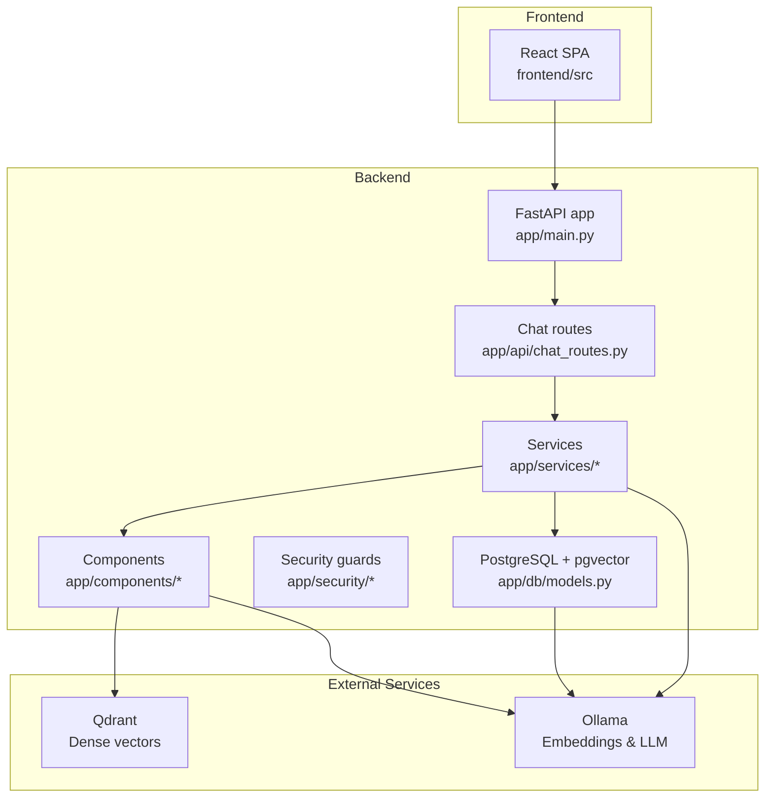
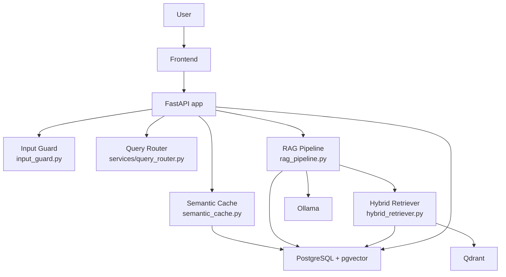
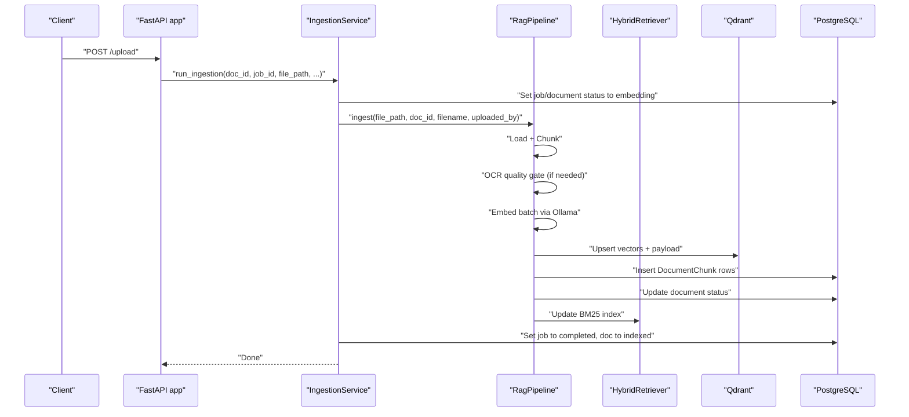
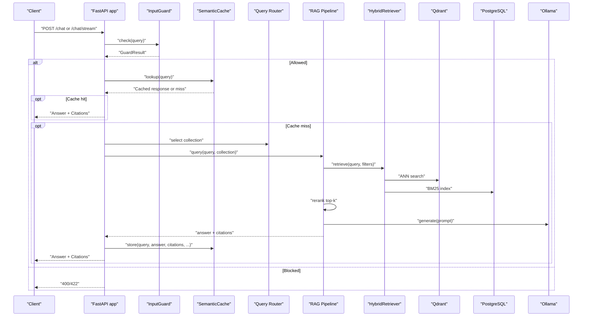
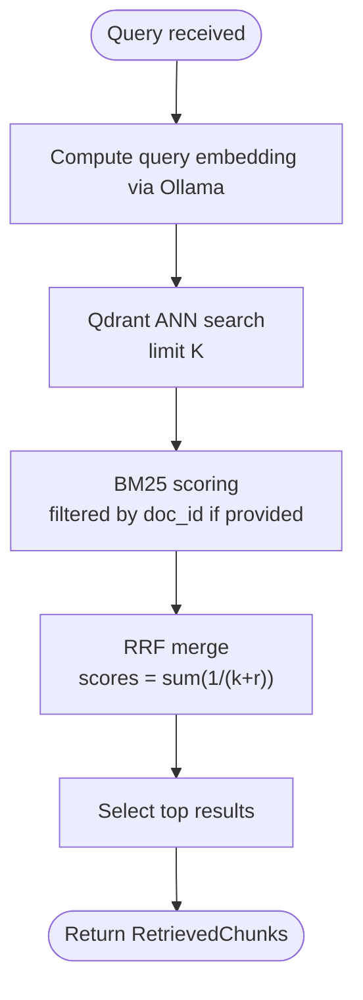
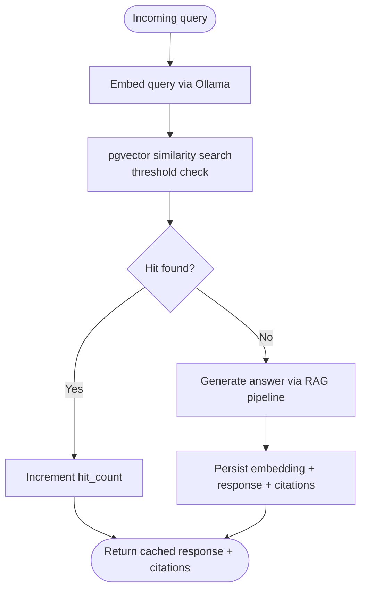
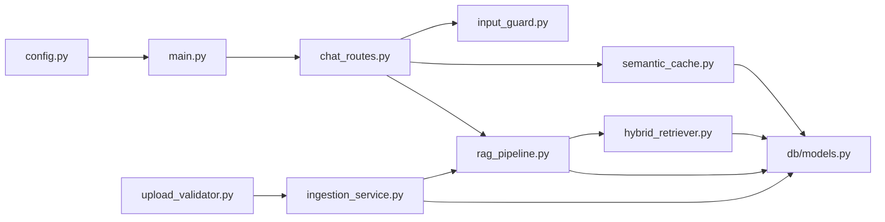
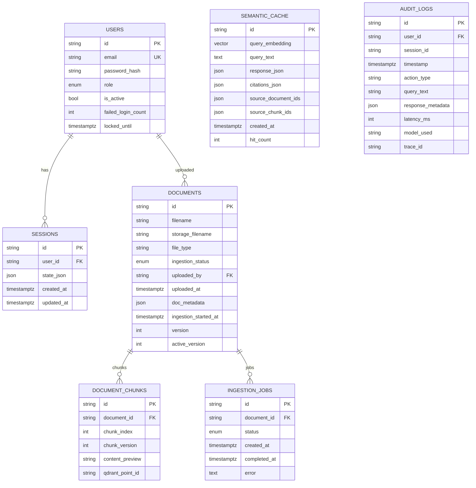

# Data Flow Architecture

<cite>
**Referenced Files in This Document**
- [README.md](file://safe4ai-pilot/README.md)
- [architecture.md](file://safe4ai-pilot/docs/architecture.md)
- [main.py](file://safe4ai-pilot/app/main.py)
- [config.py](file://safe4ai-pilot/app/config.py)
- [ingestion_service.py](file://safe4ai-pilot/app/services/ingestion_service.py)
- [rag_pipeline.py](file://safe4ai-pilot/app/services/rag_pipeline.py)
- [hybrid_retriever.py](file://safe4ai-pilot/app/components/hybrid_retriever.py)
- [semantic_cache.py](file://safe4ai-pilot/app/services/semantic_cache.py)
- [models.py](file://safe4ai-pilot/app/db/models.py)
- [input_guard.py](file://safe4ai-pilot/app/security/input_guard.py)
- [upload_validator.py](file://safe4ai-pilot/app/security/upload_validator.py)
- [chat_routes.py](file://safe4ai-pilot/app/api/chat_routes.py)
</cite>

## Table of Contents
1. [Introduction](#introduction)
2. [Project Structure](#project-structure)
3. [Core Components](#core-components)
4. [Architecture Overview](#architecture-overview)
5. [Detailed Component Analysis](#detailed-component-analysis)
6. [Dependency Analysis](#dependency-analysis)
7. [Performance Considerations](#performance-considerations)
8. [Troubleshooting Guide](#troubleshooting-guide)
9. [Conclusion](#conclusion)
10. [Appendices](#appendices)

## Introduction
This document describes the data flow architecture of the Private AI system with a focus on data movement, transformation, and processing pipelines. It covers:
- Ingestion pipeline from file upload through OCR processing to vector embedding storage
- Query processing flow from user input through security validation to response generation
- Hybrid retrieval architecture combining dense and sparse vector search with Qdrant and pgvector
- Semantic caching mechanism and its role in reducing query latency
- Data validation rules, transformation logic, and error handling
- Data consistency guarantees, transaction boundaries, and audit trail maintenance
- Relationship between data stores and their specific use cases

## Project Structure
The system is organized around a FastAPI backend, a React frontend, and supporting services:
- Backend: FastAPI application with routers, services, components, security guards, and database models
- Vector stores: Qdrant for dense ANN retrieval and pgvector-backed semantic cache
- Embedding and LLM: Ollama for embeddings and text generation
- Observability: Health checks, tracing, and audit logging

**Diagram sources**
- [main.py:63-101](file://safe4ai-pilot/app/main.py#L63-L101)
- [chat_routes.py:115-148](file://safe4ai-pilot/app/api/chat_routes.py#L115-L148)
- [hybrid_retriever.py:14-29](file://safe4ai-pilot/app/components/hybrid_retriever.py#L14-L29)
- [rag_pipeline.py:34-56](file://safe4ai-pilot/app/services/rag_pipeline.py#L34-L56)
- [models.py:104-116](file://safe4ai-pilot/app/db/models.py#L104-L116)

**Section sources**
- [README.md:1-133](file://safe4ai-pilot/README.md#L1-L133)
- [architecture.md:1-45](file://safe4ai-pilot/docs/architecture.md#L1-L45)
- [main.py:63-101](file://safe4ai-pilot/app/main.py#L63-L101)

## Core Components
- Ingestion service orchestrates background ingestion jobs, updates statuses, and coordinates the RAG pipeline
- RAG pipeline performs document loading, chunking, OCR gating, embedding, and persistence
- Hybrid retriever combines dense Qdrant ANN with sparse BM25 indexing for robust retrieval
- Semantic cache leverages pgvector similarity to accelerate repeated queries
- Security guards validate uploads and sanitize queries
- Database models define schemas for documents, chunks, audit logs, sessions, and caches

**Section sources**
- [ingestion_service.py:21-88](file://safe4ai-pilot/app/services/ingestion_service.py#L21-L88)
- [rag_pipeline.py:62-150](file://safe4ai-pilot/app/services/rag_pipeline.py#L62-L150)
- [hybrid_retriever.py:14-145](file://safe4ai-pilot/app/components/hybrid_retriever.py#L14-L145)
- [semantic_cache.py:14-104](file://safe4ai-pilot/app/services/semantic_cache.py#L14-L104)
- [models.py:75-116](file://safe4ai-pilot/app/db/models.py#L75-L116)

## Architecture Overview
The system separates concerns across ingestion and query paths, with explicit security layers and dual vector stores for retrieval and caching.

**Diagram sources**
- [architecture.md:13-28](file://safe4ai-pilot/docs/architecture.md#L13-L28)
- [input_guard.py:24-49](file://safe4ai-pilot/app/security/input_guard.py#L24-L49)
- [semantic_cache.py:14-26](file://safe4ai-pilot/app/services/semantic_cache.py#L14-L26)
- [rag_pipeline.py:34-56](file://safe4ai-pilot/app/services/rag_pipeline.py#L34-L56)
- [hybrid_retriever.py:14-29](file://safe4ai-pilot/app/components/hybrid_retriever.py#L14-L29)

## Detailed Component Analysis

### Ingestion Pipeline: From Upload to Vector Storage
End-to-end ingestion transforms raw files into searchable chunks and embeddings.

Key transformations and validations:
- File loading and chunking with configurable size and overlap
- OCR fallback for scanned PDFs with confidence scoring
- Batch embedding via Ollama with controlled timeouts
- Payload persistence to Qdrant and document chunk records to PostgreSQL
- Status transitions and BM25 index updates

**Diagram sources**
- [ingestion_service.py:21-88](file://safe4ai-pilot/app/services/ingestion_service.py#L21-L88)
- [rag_pipeline.py:62-150](file://safe4ai-pilot/app/services/rag_pipeline.py#L62-L150)
- [hybrid_retriever.py:30-42](file://safe4ai-pilot/app/components/hybrid_retriever.py#L30-L42)

**Section sources**
- [architecture.md:36-44](file://safe4ai-pilot/docs/architecture.md#L36-L44)
- [ingestion_service.py:21-88](file://safe4ai-pilot/app/services/ingestion_service.py#L21-L88)
- [rag_pipeline.py:62-150](file://safe4ai-pilot/app/services/rag_pipeline.py#L62-L150)
- [upload_validator.py:24-73](file://safe4ai-pilot/app/security/upload_validator.py#L24-L73)

### Query Processing Flow: From Input to Response
The query pipeline enforces security, optionally uses semantic cache, retrieves and reranks chunks, and generates a response.

Security and routing:
- InputGuard validates length and injection patterns
- Query Router selects the target Qdrant collection
- SemanticCache reduces latency for similar queries
- HybridRetriever fuses dense and sparse signals
- RAG pipeline composes context and invokes Ollama for generation

**Diagram sources**
- [chat_routes.py:115-148](file://safe4ai-pilot/app/api/chat_routes.py#L115-L148)
- [input_guard.py:24-49](file://safe4ai-pilot/app/security/input_guard.py#L24-L49)
- [semantic_cache.py:41-70](file://safe4ai-pilot/app/services/semantic_cache.py#L41-L70)
- [architecture.md:13-18](file://safe4ai-pilot/docs/architecture.md#L13-L18)
- [rag_pipeline.py:151-182](file://safe4ai-pilot/app/services/rag_pipeline.py#L151-L182)
- [hybrid_retriever.py:57-145](file://safe4ai-pilot/app/components/hybrid_retriever.py#L57-L145)

**Section sources**
- [chat_routes.py:115-251](file://safe4ai-pilot/app/api/chat_routes.py#L115-L251)
- [input_guard.py:24-49](file://safe4ai-pilot/app/security/input_guard.py#L24-L49)
- [semantic_cache.py:14-104](file://safe4ai-pilot/app/services/semantic_cache.py#L14-L104)
- [architecture.md:13-28](file://safe4ai-pilot/docs/architecture.md#L13-L28)

### Hybrid Retrieval: Dense ANN + Sparse BM25 Fusion
HybridRetriever computes dense embeddings and dense ANN search, augments with BM25 sparse ranking, and merges results via Reciprocal Rank Fusion.

- Dense: Qdrant ANN with optional filters on document IDs
- Sparse: BM25 built from chunk contents maintained in-memory
- Fusion: Reciprocal Rank Fusion to combine heterogeneous signals

**Diagram sources**
- [hybrid_retriever.py:57-145](file://safe4ai-pilot/app/components/hybrid_retriever.py#L57-L145)

**Section sources**
- [hybrid_retriever.py:14-145](file://safe4ai-pilot/app/components/hybrid_retriever.py#L14-L145)
- [architecture.md:3-11](file://safe4ai-pilot/docs/architecture.md#L3-L11)

### Semantic Caching Mechanism
SemanticCache stores query embeddings and responses to accelerate repeated queries above a similarity threshold.

- Uses PostgreSQL pgvector with cosine-like distance operator
- Threshold configured via settings
- Maintains hit counts and supports invalidation by document ID

**Diagram sources**
- [semantic_cache.py:41-93](file://safe4ai-pilot/app/services/semantic_cache.py#L41-L93)
- [config.py](file://safe4ai-pilot/app/config.py#L18)

**Section sources**
- [semantic_cache.py:14-104](file://safe4ai-pilot/app/services/semantic_cache.py#L14-L104)
- [config.py](file://safe4ai-pilot/app/config.py#L18)

### Data Validation Rules and Transformation Logic
- Upload validation ensures allowed extensions, declared and magic MIME types, and size limits; generates safe filenames
- InputGuard strips HTML/control characters, enforces length, and blocks injection patterns
- RAG pipeline normalizes text, chunks with overlap, applies OCR quality gating for low-text pages, and batches embeddings
- HybridRetriever maintains BM25 index from chunk contents and payloads

**Section sources**
- [upload_validator.py:24-73](file://safe4ai-pilot/app/security/upload_validator.py#L24-L73)
- [input_guard.py:24-49](file://safe4ai-pilot/app/security/input_guard.py#L24-L49)
- [rag_pipeline.py:62-150](file://safe4ai-pilot/app/services/rag_pipeline.py#L62-L150)
- [hybrid_retriever.py:30-42](file://safe4ai-pilot/app/components/hybrid_retriever.py#L30-L42)

### Error Handling Throughout Pipelines
- IngestionService wraps pipeline execution in a dedicated DB session, sets failure states, and logs errors
- Chat routes handle missing graph state, invocation failures, and stream exceptions; return structured error events
- Health endpoint validates connectivity to PostgreSQL, Qdrant, and Ollama

**Section sources**
- [ingestion_service.py:72-87](file://safe4ai-pilot/app/services/ingestion_service.py#L72-L87)
- [chat_routes.py:126-148](file://safe4ai-pilot/app/api/chat_routes.py#L126-L148)
- [main.py:118-147](file://safe4ai-pilot/app/main.py#L118-L147)

### Data Consistency Guarantees and Transaction Boundaries
- IngestionService opens a fresh SQLAlchemy session per job, commits status updates, and persists chunks atomically
- SemanticCache uses single-row updates and commits after incrementing hit counts
- Audit logs and conversation state are persisted separately; audit retention governed by settings
- HybridRetriever rebuilds BM25 index in-memory from provided chunk IDs and contents

**Section sources**
- [ingestion_service.py:33-87](file://safe4ai-pilot/app/services/ingestion_service.py#L33-L87)
- [semantic_cache.py:59-64](file://safe4ai-pilot/app/services/semantic_cache.py#L59-L64)
- [config.py:16-17](file://safe4ai-pilot/app/config.py#L16-L17)
- [hybrid_retriever.py:30-42](file://safe4ai-pilot/app/components/hybrid_retriever.py#L30-L42)

### Audit Trail Maintenance
- Audit log captures user actions, timestamps, query text, response metadata, latency, model used, and trace IDs
- Retention governed by settings; cleanup scheduled at application startup

**Section sources**
- [models.py:118-131](file://safe4ai-pilot/app/db/models.py#L118-L131)
- [config.py](file://safe4ai-pilot/app/config.py#L16)
- [main.py](file://safe4ai-pilot/app/main.py#L21)

### Data Stores and Their Use Cases
- Qdrant: Dense ANN search for document retrieval; stores vector payloads with metadata
- pgvector: Semantic cache and audit/session tables; leverages vector similarity operator
- PostgreSQL: Core domain entities (documents, chunks, users, sessions, audit logs, ingestion jobs)

**Section sources**
- [architecture.md:3-11](file://safe4ai-pilot/docs/architecture.md#L3-L11)
- [models.py:75-116](file://safe4ai-pilot/app/db/models.py#L75-L116)

## Dependency Analysis
High-level dependencies among major components:

**Diagram sources**
- [config.py:7-48](file://safe4ai-pilot/app/config.py#L7-L48)
- [main.py:14-56](file://safe4ai-pilot/app/main.py#L14-L56)
- [chat_routes.py:115-148](file://safe4ai-pilot/app/api/chat_routes.py#L115-L148)
- [input_guard.py:24-49](file://safe4ai-pilot/app/security/input_guard.py#L24-L49)
- [upload_validator.py:24-73](file://safe4ai-pilot/app/security/upload_validator.py#L24-L73)
- [ingestion_service.py:21-88](file://safe4ai-pilot/app/services/ingestion_service.py#L21-L88)
- [rag_pipeline.py:34-56](file://safe4ai-pilot/app/services/rag_pipeline.py#L34-L56)
- [hybrid_retriever.py:14-29](file://safe4ai-pilot/app/components/hybrid_retriever.py#L14-L29)
- [semantic_cache.py:14-26](file://safe4ai-pilot/app/services/semantic_cache.py#L14-L26)
- [models.py:75-116](file://safe4ai-pilot/app/db/models.py#L75-L116)

**Section sources**
- [main.py:14-56](file://safe4ai-pilot/app/main.py#L14-L56)
- [chat_routes.py:115-148](file://safe4ai-pilot/app/api/chat_routes.py#L115-L148)
- [ingestion_service.py:21-88](file://safe4ai-pilot/app/services/ingestion_service.py#L21-L88)
- [rag_pipeline.py:34-56](file://safe4ai-pilot/app/services/rag_pipeline.py#L34-L56)
- [hybrid_retriever.py:14-29](file://safe4ai-pilot/app/components/hybrid_retriever.py#L14-L29)
- [semantic_cache.py:14-26](file://safe4ai-pilot/app/services/semantic_cache.py#L14-L26)
- [models.py:75-116](file://safe4ai-pilot/app/db/models.py#L75-L116)

## Performance Considerations
- Batch embeddings: RAG pipeline emits embeddings in batches to reduce overhead
- Pre-warming: Ollama model is prewarmed to avoid cold-start latency
- Hybrid fusion: Combines strengths of dense and sparse retrieval to improve recall and precision
- Semantic cache: Reduces latency for repeated queries above a similarity threshold
- BM25 index: Maintained in-memory for fast sparse retrieval during ingestion

[No sources needed since this section provides general guidance]

## Troubleshooting Guide
Common issues and diagnostics:
- Health checks fail: Verify PostgreSQL, Qdrant, and Ollama endpoints
- Model not ready: Confirm Ollama model availability and prewarm completion
- Ingestion stuck: Startup recovery resets jobs older than a threshold back to pending
- Upload blocked: Check allowed extensions, MIME types, and size limits
- Query blocked: InputGuard may reject overly long or suspicious queries

**Section sources**
- [main.py:118-147](file://safe4ai-pilot/app/main.py#L118-L147)
- [main.py:104-116](file://safe4ai-pilot/app/main.py#L104-L116)
- [ingestion_service.py:90-113](file://safe4ai-pilot/app/services/ingestion_service.py#L90-L113)
- [upload_validator.py:24-73](file://safe4ai-pilot/app/security/upload_validator.py#L24-L73)
- [input_guard.py:24-49](file://safe4ai-pilot/app/security/input_guard.py#L24-L49)

## Conclusion
The Private AI system implements a robust data flow architecture:
- Ingestion converts diverse document formats into dense vectors and chunk records, with OCR quality gating and BM25 index updates
- Query processing integrates security validation, optional semantic caching, hybrid retrieval, and LLM generation
- Dual vector stores enable scalable retrieval and efficient caching
- Strong separation of concerns, explicit validation, and audit logging support reliability and compliance

[No sources needed since this section summarizes without analyzing specific files]

## Appendices

### Data Models Overview

**Diagram sources**
- [models.py:52-182](file://safe4ai-pilot/app/db/models.py#L52-L182)