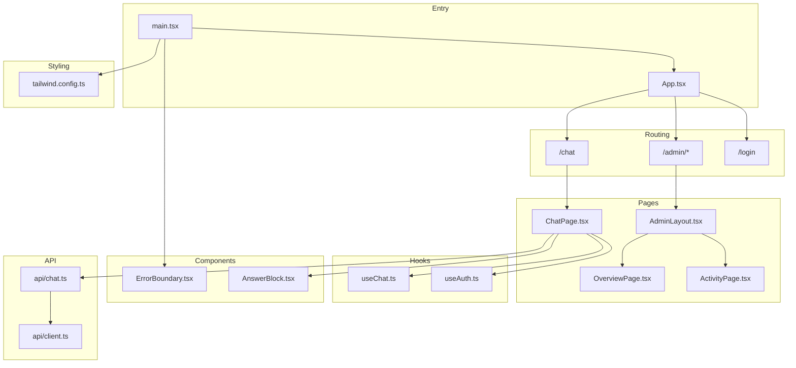
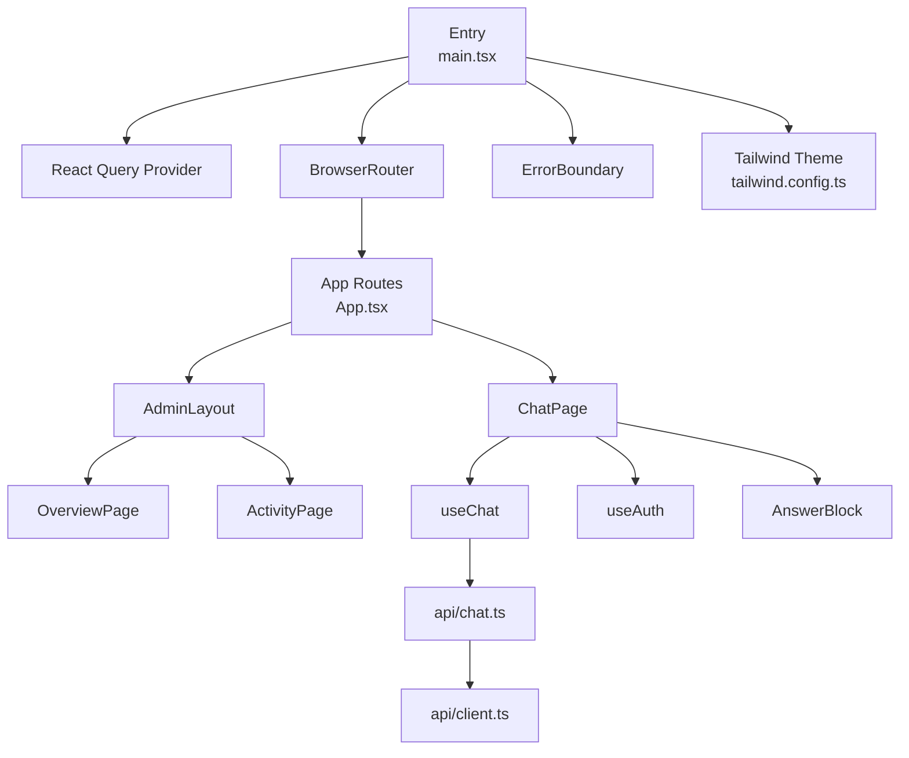
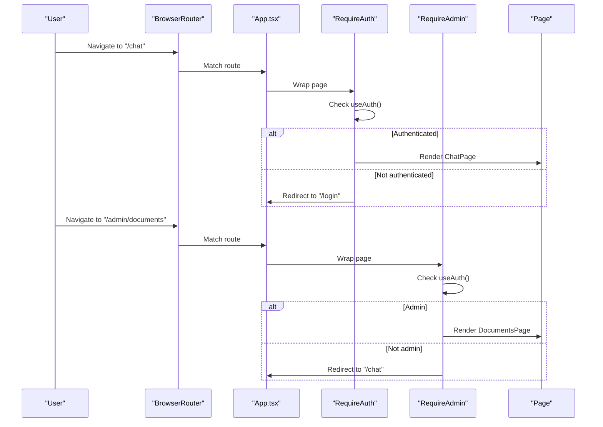
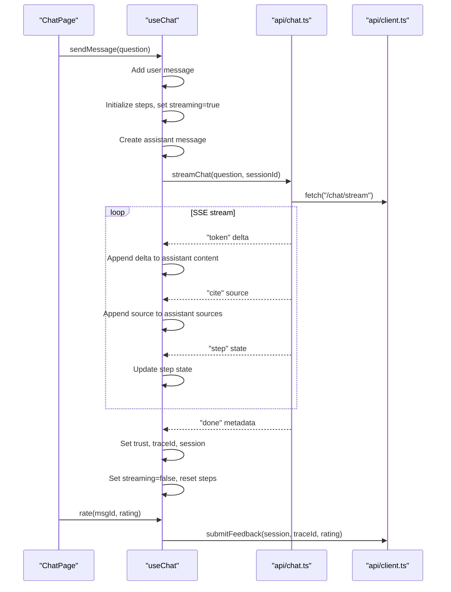
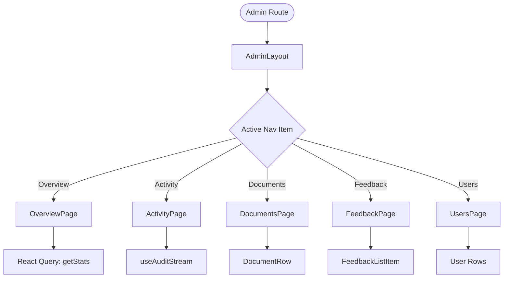
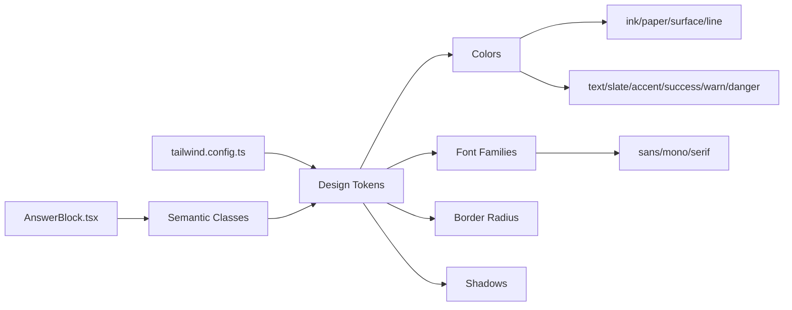
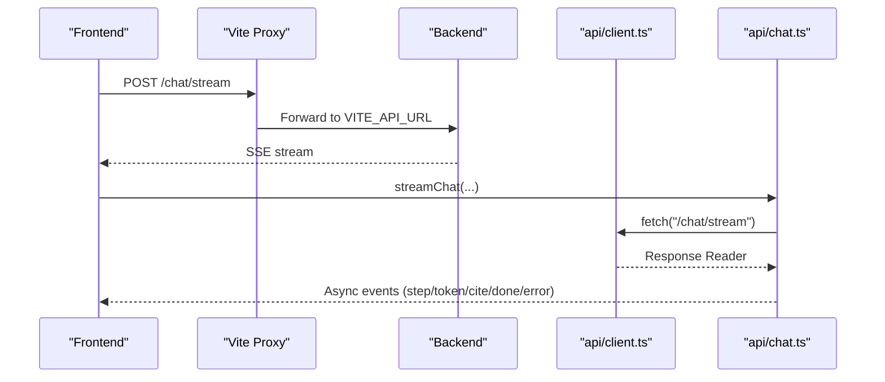
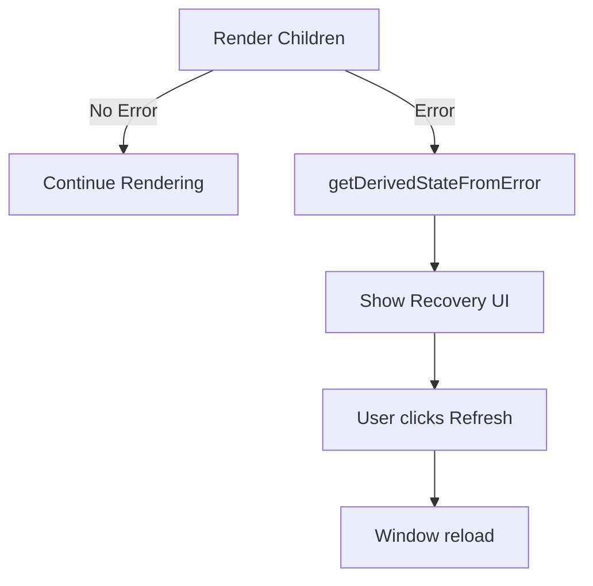
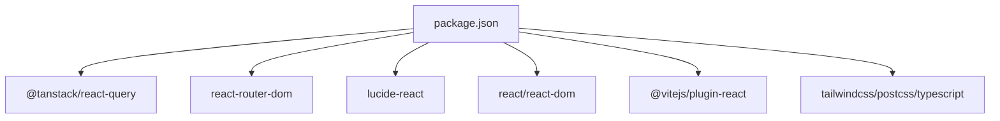
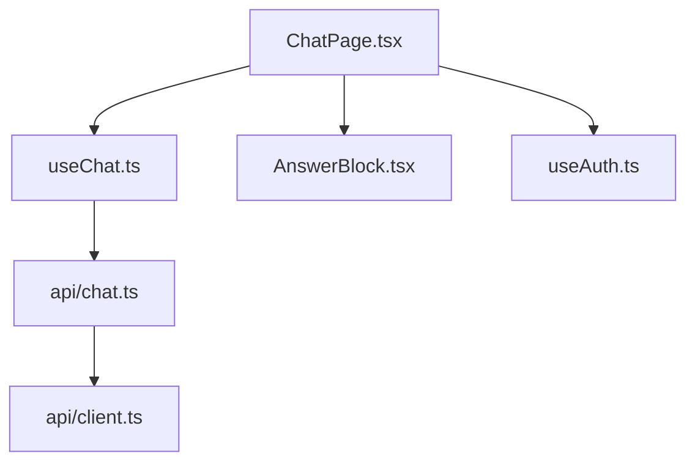

# Frontend Architecture

<cite>
**Referenced Files in This Document**
- [main.tsx](file://safe4ai-pilot/frontend/src/main.tsx)
- [App.tsx](file://safe4ai-pilot/frontend/src/App.tsx)
- [ChatPage.tsx](file://safe4ai-pilot/frontend/src/pages/ChatPage.tsx)
- [AdminLayout.tsx](file://safe4ai-pilot/frontend/src/pages/admin/AdminLayout.tsx)
- [useChat.ts](file://safe4ai-pilot/frontend/src/hooks/useChat.ts)
- [useAuth.ts](file://safe4ai-pilot/frontend/src/hooks/useAuth.ts)
- [ErrorBoundary.tsx](file://safe4ai-pilot/frontend/src/components/ErrorBoundary.tsx)
- [client.ts](file://safe4ai-pilot/frontend/src/api/client.ts)
- [chat.ts](file://safe4ai-pilot/frontend/src/api/chat.ts)
- [tailwind.config.ts](file://safe4ai-pilot/frontend/tailwind.config.ts)
- [package.json](file://safe4ai-pilot/frontend/package.json)
- [vite.config.ts](file://safe4ai-pilot/frontend/vite.config.ts)
- [AnswerBlock.tsx](file://safe4ai-pilot/frontend/src/components/chat/AnswerBlock.tsx)
- [OverviewPage.tsx](file://safe4ai-pilot/frontend/src/pages/admin/OverviewPage.tsx)
- [ActivityPage.tsx](file://safe4ai-pilot/frontend/src/pages/admin/ActivityPage.tsx)
</cite>

## Table of Contents
1. [Introduction](#introduction)
2. [Project Structure](#project-structure)
3. [Core Components](#core-components)
4. [Architecture Overview](#architecture-overview)
5. [Detailed Component Analysis](#detailed-component-analysis)
6. [Dependency Analysis](#dependency-analysis)
7. [Performance Considerations](#performance-considerations)
8. [Troubleshooting Guide](#troubleshooting-guide)
9. [Conclusion](#conclusion)
10. [Appendices](#appendices)

## Introduction
This document describes the frontend architecture of the React-based Private AI interface. It covers component hierarchy, state management with React hooks and React Query, routing with React Router, design system and styling via Tailwind CSS, API integration patterns, error boundaries, real-time chat streaming, admin dashboard layout and pages, responsive design, and the relationship between frontend components and backend endpoints.

## Project Structure
The frontend is a Vite-powered React application with TypeScript. It organizes code by feature and domain:
- Pages: top-level routes and page-level components
- Hooks: reusable state/logic abstractions
- Components: shared UI building blocks
- API: typed client and endpoint modules
- Styles: Tailwind configuration and design tokens

**Diagram sources**
- [main.tsx:1-24](file://safe4ai-pilot/frontend/src/main.tsx#L1-L24)
- [App.tsx:25-92](file://safe4ai-pilot/frontend/src/App.tsx#L25-L92)
- [ChatPage.tsx:29-191](file://safe4ai-pilot/frontend/src/pages/ChatPage.tsx#L29-L191)
- [AdminLayout.tsx:23-97](file://safe4ai-pilot/frontend/src/pages/admin/AdminLayout.tsx#L23-L97)
- [OverviewPage.tsx:43-213](file://safe4ai-pilot/frontend/src/pages/admin/OverviewPage.tsx#L43-L213)
- [ActivityPage.tsx:21-136](file://safe4ai-pilot/frontend/src/pages/admin/ActivityPage.tsx#L21-L136)
- [useChat.ts:17-104](file://safe4ai-pilot/frontend/src/hooks/useChat.ts#L17-L104)
- [useAuth.ts:5-28](file://safe4ai-pilot/frontend/src/hooks/useAuth.ts#L5-L28)
- [ErrorBoundary.tsx:13-43](file://safe4ai-pilot/frontend/src/components/ErrorBoundary.tsx#L13-L43)
- [AnswerBlock.tsx:36-114](file://safe4ai-pilot/frontend/src/components/chat/AnswerBlock.tsx#L36-L114)
- [client.ts:1-20](file://safe4ai-pilot/frontend/src/api/client.ts#L1-L20)
- [chat.ts:21-76](file://safe4ai-pilot/frontend/src/api/chat.ts#L21-L76)
- [tailwind.config.ts:1-44](file://safe4ai-pilot/frontend/tailwind.config.ts#L1-L44)

**Section sources**
- [main.tsx:1-24](file://safe4ai-pilot/frontend/src/main.tsx#L1-L24)
- [App.tsx:1-92](file://safe4ai-pilot/frontend/src/App.tsx#L1-L92)
- [package.json:1-32](file://safe4ai-pilot/frontend/package.json#L1-L32)
- [vite.config.ts:1-17](file://safe4ai-pilot/frontend/vite.config.ts#L1-L17)

## Core Components
- Application bootstrap initializes React Query, routing, and global error boundary.
- Routing enforces authentication and admin-only access via route guards.
- Chat page composes messaging UI, streaming pipeline, and citation drawer.
- Admin layout provides sidebar navigation and content area for admin pages.
- Shared hooks encapsulate chat state and authentication state.
- Design system is driven by Tailwind tokens and consistent component primitives.

**Section sources**
- [main.tsx:9-23](file://safe4ai-pilot/frontend/src/main.tsx#L9-L23)
- [App.tsx:11-23](file://safe4ai-pilot/frontend/src/App.tsx#L11-L23)
- [ChatPage.tsx:29-191](file://safe4ai-pilot/frontend/src/pages/ChatPage.tsx#L29-L191)
- [AdminLayout.tsx:23-97](file://safe4ai-pilot/frontend/src/pages/admin/AdminLayout.tsx#L23-L97)
- [useChat.ts:17-104](file://safe4ai-pilot/frontend/src/hooks/useChat.ts#L17-L104)
- [useAuth.ts:5-28](file://safe4ai-pilot/frontend/src/hooks/useAuth.ts#L5-L28)
- [tailwind.config.ts:3-43](file://safe4ai-pilot/frontend/tailwind.config.ts#L3-L43)

## Architecture Overview
The frontend follows a layered architecture:
- Entry layer: Vite + React + React Router + React Query
- UI layer: Pages, Layouts, and Components
- State layer: Hooks for chat and auth
- API layer: Typed client and SSE streaming
- Styling layer: Tailwind tokens and theme

**Diagram sources**
- [main.tsx:13-23](file://safe4ai-pilot/frontend/src/main.tsx#L13-L23)
- [App.tsx:25-92](file://safe4ai-pilot/frontend/src/App.tsx#L25-L92)
- [ChatPage.tsx:29-191](file://safe4ai-pilot/frontend/src/pages/ChatPage.tsx#L29-L191)
- [AdminLayout.tsx:23-97](file://safe4ai-pilot/frontend/src/pages/admin/AdminLayout.tsx#L23-L97)
- [OverviewPage.tsx:43-213](file://safe4ai-pilot/frontend/src/pages/admin/OverviewPage.tsx#L43-L213)
- [ActivityPage.tsx:21-136](file://safe4ai-pilot/frontend/src/pages/admin/ActivityPage.tsx#L21-L136)
- [useChat.ts:17-104](file://safe4ai-pilot/frontend/src/hooks/useChat.ts#L17-L104)
- [useAuth.ts:5-28](file://safe4ai-pilot/frontend/src/hooks/useAuth.ts#L5-L28)
- [AnswerBlock.tsx:36-114](file://safe4ai-pilot/frontend/src/components/chat/AnswerBlock.tsx#L36-L114)
- [chat.ts:21-76](file://safe4ai-pilot/frontend/src/api/chat.ts#L21-L76)
- [client.ts:1-20](file://safe4ai-pilot/frontend/src/api/client.ts#L1-L20)
- [tailwind.config.ts:1-44](file://safe4ai-pilot/frontend/tailwind.config.ts#L1-L44)

## Detailed Component Analysis

### Routing and Guards
- Authentication guard redirects unauthenticated users to login.
- Admin guard restricts admin routes to admin users.
- Catch-all route navigates to chat.

**Diagram sources**
- [App.tsx:11-23](file://safe4ai-pilot/frontend/src/App.tsx#L11-L23)
- [useAuth.ts:5-28](file://safe4ai-pilot/frontend/src/hooks/useAuth.ts#L5-L28)

**Section sources**
- [App.tsx:11-23](file://safe4ai-pilot/frontend/src/App.tsx#L11-L23)
- [useAuth.ts:5-28](file://safe4ai-pilot/frontend/src/hooks/useAuth.ts#L5-L28)

### Chat State Management and Streaming
- useChat manages messages, streaming steps, and lifecycle.
- sendMessage creates user and assistant messages, streams tokens, citations, and completion metadata.
- stop cancels the current stream via AbortController.
- rate submits feedback asynchronously.

**Diagram sources**
- [ChatPage.tsx:39-46](file://safe4ai-pilot/frontend/src/pages/ChatPage.tsx#L39-L46)
- [useChat.ts:28-91](file://safe4ai-pilot/frontend/src/hooks/useChat.ts#L28-L91)
- [chat.ts:21-76](file://safe4ai-pilot/frontend/src/api/chat.ts#L21-L76)
- [client.ts:1-20](file://safe4ai-pilot/frontend/src/api/client.ts#L1-L20)

**Section sources**
- [useChat.ts:17-104](file://safe4ai-pilot/frontend/src/hooks/useChat.ts#L17-L104)
- [chat.ts:21-76](file://safe4ai-pilot/frontend/src/api/chat.ts#L21-L76)
- [ChatPage.tsx:39-46](file://safe4ai-pilot/frontend/src/pages/ChatPage.tsx#L39-L46)

### Admin Dashboard Layout and Pages
- AdminLayout renders sidebar navigation, active item highlighting, and content area.
- OverviewPage displays statistics, charts, and notable items with periodic refresh.
- ActivityPage shows a live audit stream with filtering and CSV export.

**Diagram sources**
- [AdminLayout.tsx:10-17](file://safe4ai-pilot/frontend/src/pages/admin/AdminLayout.tsx#L10-L17)
- [AdminLayout.tsx:27-53](file://safe4ai-pilot/frontend/src/pages/admin/AdminLayout.tsx#L27-L53)
- [OverviewPage.tsx:43-48](file://safe4ai-pilot/frontend/src/pages/admin/OverviewPage.tsx#L43-L48)
- [ActivityPage.tsx:21-27](file://safe4ai-pilot/frontend/src/pages/admin/ActivityPage.tsx#L21-L27)

**Section sources**
- [AdminLayout.tsx:23-97](file://safe4ai-pilot/frontend/src/pages/admin/AdminLayout.tsx#L23-L97)
- [OverviewPage.tsx:43-213](file://safe4ai-pilot/frontend/src/pages/admin/OverviewPage.tsx#L43-L213)
- [ActivityPage.tsx:21-136](file://safe4ai-pilot/frontend/src/pages/admin/ActivityPage.tsx#L21-L136)

### Design System and Styling
- Tailwind tokens define colors, typography, spacing, shadows, and radii.
- Components use semantic class names and tokens for consistent appearance.
- Responsive layout uses flexbox and grid with constrained widths and scroll regions.

**Diagram sources**
- [tailwind.config.ts:3-43](file://safe4ai-pilot/frontend/tailwind.config.ts#L3-L43)
- [AnswerBlock.tsx:44-112](file://safe4ai-pilot/frontend/src/components/chat/AnswerBlock.tsx#L44-L112)

**Section sources**
- [tailwind.config.ts:1-44](file://safe4ai-pilot/frontend/tailwind.config.ts#L1-L44)
- [AnswerBlock.tsx:36-114](file://safe4ai-pilot/frontend/src/components/chat/AnswerBlock.tsx#L36-L114)

### API Integration Layer
- api/client.ts centralizes fetch with credentials and JSON parsing.
- api/chat.ts implements SSE streaming for chat responses.
- Vite proxy forwards routes to backend host.

**Diagram sources**
- [vite.config.ts:8-14](file://safe4ai-pilot/frontend/vite.config.ts#L8-L14)
- [client.ts:1-20](file://safe4ai-pilot/frontend/src/api/client.ts#L1-L20)
- [chat.ts:21-76](file://safe4ai-pilot/frontend/src/api/chat.ts#L21-L76)

**Section sources**
- [client.ts:1-20](file://safe4ai-pilot/frontend/src/api/client.ts#L1-L20)
- [chat.ts:21-76](file://safe4ai-pilot/frontend/src/api/chat.ts#L21-L76)
- [vite.config.ts:1-17](file://safe4ai-pilot/frontend/vite.config.ts#L1-L17)

### Error Boundary Implementation
- ErrorBoundary catches rendering errors and presents a friendly recovery UI.
- Logs error and stack to console for diagnostics.

**Diagram sources**
- [ErrorBoundary.tsx:13-43](file://safe4ai-pilot/frontend/src/components/ErrorBoundary.tsx#L13-L43)

**Section sources**
- [ErrorBoundary.tsx:13-43](file://safe4ai-pilot/frontend/src/components/ErrorBoundary.tsx#L13-L43)

## Dependency Analysis
- Runtime dependencies include React, React Router, React Query, and UI icons.
- Dev dependencies include Vite, Tailwind, PostCSS, and TypeScript.
- Vite plugin chain enables React fast-refresh and TypeScript support.
- Proxy configuration routes API traffic to backend during development.

**Diagram sources**
- [package.json:11-30](file://safe4ai-pilot/frontend/package.json#L11-L30)

**Section sources**
- [package.json:1-32](file://safe4ai-pilot/frontend/package.json#L1-L32)
- [vite.config.ts:1-17](file://safe4ai-pilot/frontend/vite.config.ts#L1-L17)

## Performance Considerations
- React Query caching: global staleTime configured to reduce redundant requests.
- Streaming rendering: incremental updates to messages and steps improve perceived performance.
- Minimal re-renders: callbacks memoized with useCallback keep components stable.
- Lazy loading: code-splitting via dynamic imports can be introduced for heavy admin pages.
- Image and asset optimization: leverage Vite’s bundling and Tailwind purging.
- Accessibility: ensure focus management, ARIA attributes, and keyboard navigation in interactive components.

[No sources needed since this section provides general guidance]

## Troubleshooting Guide
- Authentication issues: verify cookie credentials and session validity; check sign-out flow clears React Query cache.
- Chat streaming failures: confirm SSE endpoint availability and network connectivity; inspect AbortController usage and error events.
- Admin access denied: ensure user role is admin; route guards redirect unauthorized users.
- Styling inconsistencies: validate Tailwind token usage and CSS order; rebuild after theme changes.
- Build/runtime errors: use ErrorBoundary recovery; inspect console logs for derived error state.

**Section sources**
- [useAuth.ts:14-18](file://safe4ai-pilot/frontend/src/hooks/useAuth.ts#L14-L18)
- [useChat.ts:24-26](file://safe4ai-pilot/frontend/src/hooks/useChat.ts#L24-L26)
- [ErrorBoundary.tsx:20-22](file://safe4ai-pilot/frontend/src/components/ErrorBoundary.tsx#L20-L22)

## Conclusion
The Private AI frontend employs a clean separation of concerns: routing and guards manage access, React Query handles data, hooks encapsulate state, and Tailwind provides a cohesive design system. Real-time chat uses SSE for streaming, while admin pages present dashboards and activity feeds. The architecture supports scalability, maintainability, and a strong UX through thoughtful component composition and performance-conscious patterns.

[No sources needed since this section summarizes without analyzing specific files]

## Appendices

### Component Interaction Diagram: Chat Data Flow

**Diagram sources**
- [ChatPage.tsx:29-191](file://safe4ai-pilot/frontend/src/pages/ChatPage.tsx#L29-L191)
- [useChat.ts:17-104](file://safe4ai-pilot/frontend/src/hooks/useChat.ts#L17-L104)
- [chat.ts:21-76](file://safe4ai-pilot/frontend/src/api/chat.ts#L21-L76)
- [client.ts:1-20](file://safe4ai-pilot/frontend/src/api/client.ts#L1-L20)
- [AnswerBlock.tsx:36-114](file://safe4ai-pilot/frontend/src/components/chat/AnswerBlock.tsx#L36-L114)
- [useAuth.ts:5-28](file://safe4ai-pilot/frontend/src/hooks/useAuth.ts#L5-L28)