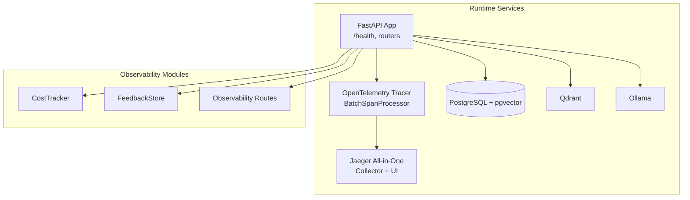
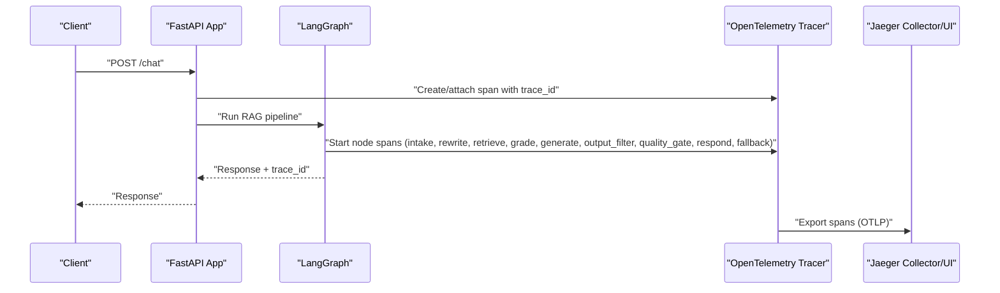
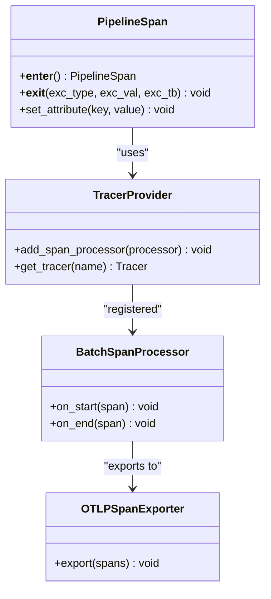
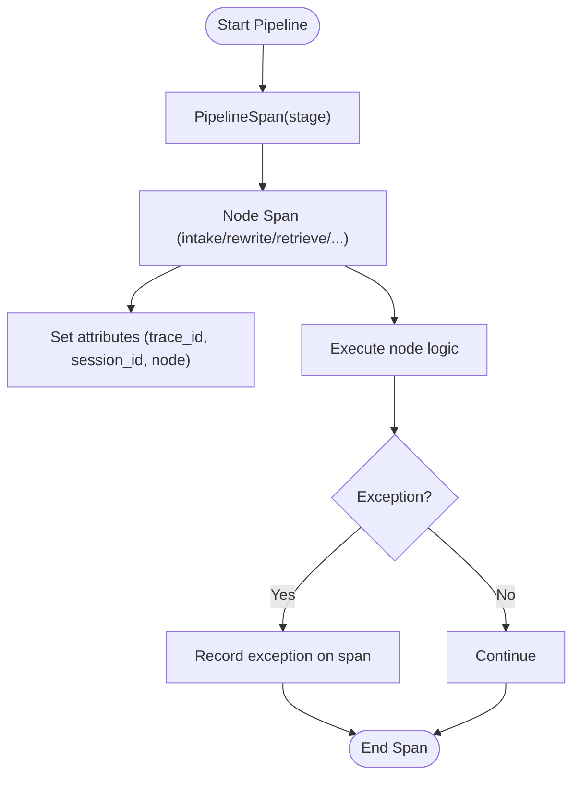
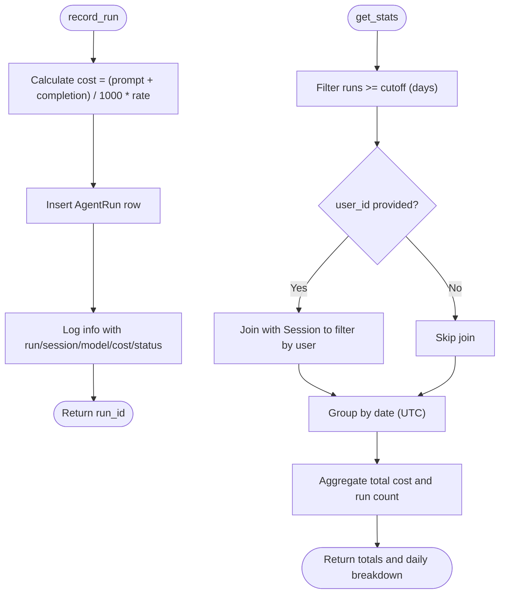
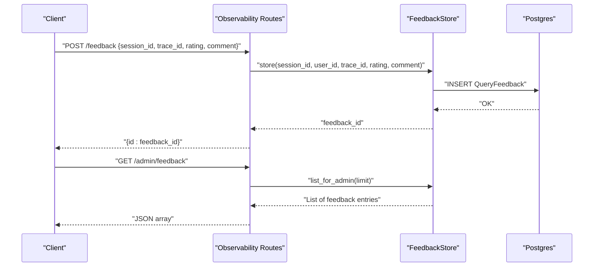
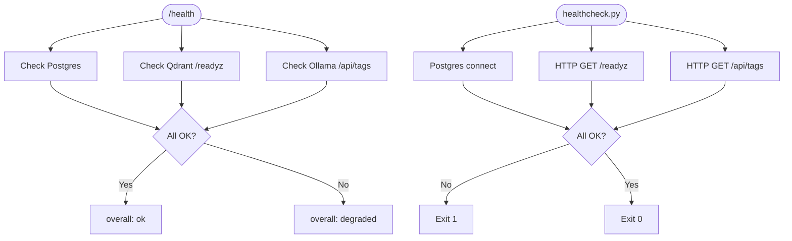
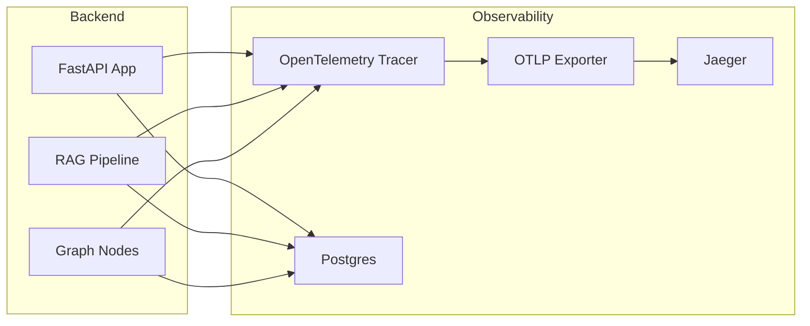
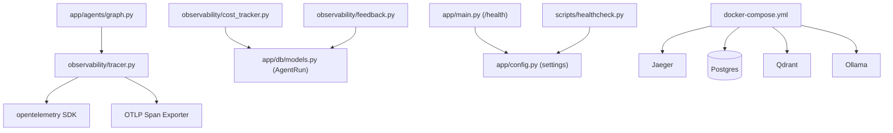

# Observability Architecture

<cite>
**Referenced Files in This Document**
- [docker-compose.yml](file://docker-compose.yml)
- [app/main.py](file://app/main.py)
- [scripts/healthcheck.py](file://scripts/healthcheck.py)
- [app/api/observability_routes.py](file://app/api/observability_routes.py)
- [observability/tracer.py](file://observability/tracer.py)
- [observability/cost_tracker.py](file://observability/cost_tracker.py)
- [observability/feedback.py](file://observability/feedback.py)
- [app/db/models.py](file://app/db/models.py)
- [app/config.py](file://app/config.py)
- [app/agents/graph.py](file://app/agents/graph.py)
- [app/services/rag_pipeline.py](file://app/services/rag_pipeline.py)
- [app/services/conversation.py](file://app/services/conversation.py)
</cite>

## Table of Contents
1. [Introduction](#introduction)
2. [Project Structure](#project-structure)
3. [Core Components](#core-components)
4. [Architecture Overview](#architecture-overview)
5. [Detailed Component Analysis](#detailed-component-analysis)
6. [Dependency Analysis](#dependency-analysis)
7. [Performance Considerations](#performance-considerations)
8. [Troubleshooting Guide](#troubleshooting-guide)
9. [Conclusion](#conclusion)
10. [Appendices](#appendices)

## Introduction
This document describes the observability architecture for the Private AI system, focusing on monitoring, tracing, and performance measurement. It explains how distributed tracing is implemented using OpenTelemetry and Jaeger, how correlation IDs propagate across services, and how spans are created during the RAG pipeline. It also documents the cost tracking system for LLM usage, resource utilization monitoring, and performance metrics collection. Health checks, system status monitoring, and alerting mechanisms are covered, along with integrations between backend services and observability tools, including metric export formats and dashboard configurations. Log aggregation strategies, error tracking, and performance bottleneck identification are addressed, and the relationship between observability data and system reliability, capacity planning, and troubleshooting workflows is explained.

## Project Structure
The observability stack integrates with the backend services through:
- A FastAPI application exposing health and observability endpoints
- OpenTelemetry-based tracing configured for batch export to Jaeger
- A cost tracking module persisting usage metrics to the database
- A feedback store for user sentiment and trace correlation
- Health check utilities validating dependent services

**Diagram sources**
- [docker-compose.yml](file://docker-compose.yml)
- [app/main.py](file://app/main.py)
- [observability/tracer.py](file://observability/tracer.py)
- [observability/cost_tracker.py](file://observability/cost_tracker.py)
- [observability/feedback.py](file://observability/feedback.py)

**Section sources**
- [docker-compose.yml](file://docker-compose.yml)
- [app/main.py](file://app/main.py)

## Core Components
- Distributed tracing with OpenTelemetry and Jaeger exporter
- Pipeline span lifecycle and attributes for stages
- Cost tracking for LLM token usage and compute cost
- Feedback store for user ratings and comments correlated to traces
- Health endpoints and external service health checks
- Data models supporting observability records

Key implementation references:
- Tracing provider and exporter configuration
- Span creation patterns for pipeline stages and graph nodes
- Cost calculation and persistence
- Feedback storage and retrieval
- Health endpoint and external service checks

**Section sources**
- [observability/tracer.py](file://observability/tracer.py)
- [app/agents/graph.py](file://app/agents/graph.py)
- [observability/cost_tracker.py](file://observability/cost_tracker.py)
- [observability/feedback.py](file://observability/feedback.py)
- [app/main.py](file://app/main.py)
- [scripts/healthcheck.py](file://scripts/healthcheck.py)
- [app/db/models.py](file://app/db/models.py)

## Architecture Overview
The observability architecture centers on:
- Tracing: OpenTelemetry spans exported via OTLP to Jaeger
- Correlation: trace_id propagated across services and nodes
- Metrics: cost tracking persisted to Postgres; feedback stored for analysis
- Health: internal /health endpoint plus external service checks
- Data stores: Postgres for structured observability data; Qdrant for retrieval; Ollama for generation and embeddings

**Diagram sources**
- [app/main.py](file://app/main.py)
- [app/agents/graph.py](file://app/agents/graph.py)
- [observability/tracer.py](file://observability/tracer.py)
- [docker-compose.yml](file://docker-compose.yml)

## Detailed Component Analysis

### Distributed Tracing with OpenTelemetry and Jaeger
- Tracer provider and batch processor configured with OTLP gRPC exporter
- Environment variables control endpoint and transport security
- PipelineSpan wrapper enforces valid stage names and sets trace_id and stage attributes
- Graph nodes create child spans inheriting context; spans record exceptions and attach attributes

**Diagram sources**
- [observability/tracer.py](file://observability/tracer.py)

**Section sources**
- [observability/tracer.py](file://observability/tracer.py)
- [app/agents/graph.py](file://app/agents/graph.py)

### Span Creation Patterns in the RAG Pipeline
- PipelineSpan ensures each stage has a dedicated span with attributes for trace_id and stage
- Graph nodes wrap each processing step in a span, setting session_id and node metadata
- Exceptions are recorded on spans for error tracking and diagnosis

**Diagram sources**
- [observability/tracer.py](file://observability/tracer.py)
- [app/agents/graph.py](file://app/agents/graph.py)

**Section sources**
- [observability/tracer.py](file://observability/tracer.py)
- [app/agents/graph.py](file://app/agents/graph.py)

### Cost Tracking System for LLM Usage
- CostTracker calculates USD cost from prompt and completion tokens using a configurable rate per 1K tokens
- Records AgentRun entries with timestamps, status, and cost
- Aggregates daily cost statistics optionally filtered by user via session ownership
- Cost-per-1K tokens is configured via settings

**Diagram sources**
- [observability/cost_tracker.py](file://observability/cost_tracker.py)
- [app/db/models.py](file://app/db/models.py)
- [app/config.py](file://app/config.py)

**Section sources**
- [observability/cost_tracker.py](file://observability/cost_tracker.py)
- [app/db/models.py](file://app/db/models.py)
- [app/config.py](file://app/config.py)

### Feedback Store and User Sentiment Correlation
- FeedbackStore persists QueryFeedback with trace_id, session_id, user_id, rating, and optional comment
- Admin endpoint retrieves recent feedback for moderation and analysis
- Feedback is correlated to traces for targeted diagnostics

**Diagram sources**
- [app/api/observability_routes.py](file://app/api/observability_routes.py)
- [observability/feedback.py](file://observability/feedback.py)
- [app/db/models.py](file://app/db/models.py)

**Section sources**
- [app/api/observability_routes.py](file://app/api/observability_routes.py)
- [observability/feedback.py](file://observability/feedback.py)
- [app/db/models.py](file://app/db/models.py)

### Health Checks and System Status Monitoring
- Internal /health endpoint validates connectivity to Postgres, Qdrant, and Ollama
- External healthcheck script performs the same checks programmatically
- Docker Compose defines healthchecks for each service and the app

**Diagram sources**
- [app/main.py](file://app/main.py)
- [scripts/healthcheck.py](file://scripts/healthcheck.py)
- [docker-compose.yml](file://docker-compose.yml)

**Section sources**
- [app/main.py](file://app/main.py)
- [scripts/healthcheck.py](file://scripts/healthcheck.py)
- [docker-compose.yml](file://docker-compose.yml)

### Integration Between Backend Services and Observability Tools
- OpenTelemetry exporter configured via environment variables for OTLP endpoint and transport security
- Jaeger collector enabled for OTLP over gRPC
- Traces exported in batch mode to Jaeger UI for visualization
- Cost and feedback data persisted to Postgres for dashboards and analytics

**Diagram sources**
- [observability/tracer.py](file://observability/tracer.py)
- [docker-compose.yml](file://docker-compose.yml)
- [app/main.py](file://app/main.py)

**Section sources**
- [observability/tracer.py](file://observability/tracer.py)
- [docker-compose.yml](file://docker-compose.yml)
- [app/main.py](file://app/main.py)

## Dependency Analysis
- Tracing depends on OpenTelemetry SDK and OTLP exporter; configured via environment variables
- Graph nodes depend on the OpenTelemetry tracer for span creation
- Cost tracking depends on SQLAlchemy ORM and the AgentRun model
- Feedback store depends on QueryFeedback model and database session
- Health endpoints depend on external service URLs from settings and network reachability

**Diagram sources**
- [observability/tracer.py](file://observability/tracer.py)
- [app/agents/graph.py](file://app/agents/graph.py)
- [observability/cost_tracker.py](file://observability/cost_tracker.py)
- [observability/feedback.py](file://observability/feedback.py)
- [app/db/models.py](file://app/db/models.py)
- [app/main.py](file://app/main.py)
- [scripts/healthcheck.py](file://scripts/healthcheck.py)
- [app/config.py](file://app/config.py)
- [docker-compose.yml](file://docker-compose.yml)

**Section sources**
- [observability/tracer.py](file://observability/tracer.py)
- [app/agents/graph.py](file://app/agents/graph.py)
- [observability/cost_tracker.py](file://observability/cost_tracker.py)
- [observability/feedback.py](file://observability/feedback.py)
- [app/db/models.py](file://app/db/models.py)
- [app/main.py](file://app/main.py)
- [scripts/healthcheck.py](file://scripts/healthcheck.py)
- [app/config.py](file://app/config.py)
- [docker-compose.yml](file://docker-compose.yml)

## Performance Considerations
- Tracing overhead: BatchSpanProcessor reduces export frequency; ensure appropriate buffer sizes and queue limits
- Token cost calculation: Keep cost_per_1k_tokens accurate to prevent budget overruns
- Database writes: Aggregate feedback and cost records efficiently; consider indexing on trace_id and timestamps
- External service timeouts: Tune HTTP client timeouts for Qdrant and Ollama to balance responsiveness and reliability
- Model warm-up: Pre-warm Ollama to reduce cold-start latency for initial queries

[No sources needed since this section provides general guidance]

## Troubleshooting Guide
Common issues and resolutions:
- Tracing not visible in Jaeger:
  - Verify OTLP endpoint and transport security environment variables
  - Confirm Jaeger collector is healthy and listening on the expected port
- Health endpoint failures:
  - Check Postgres connectivity, Qdrant readiness, and Ollama availability
  - Use the healthcheck script for automated verification
- Cost tracking anomalies:
  - Validate cost_per_1k_tokens setting and token counts
  - Inspect AgentRun entries for missing or incorrect data
- Feedback correlation problems:
  - Ensure trace_id is propagated and stored with feedback entries
  - Confirm QueryFeedback table contains expected records

**Section sources**
- [observability/tracer.py](file://observability/tracer.py)
- [docker-compose.yml](file://docker-compose.yml)
- [app/main.py](file://app/main.py)
- [scripts/healthcheck.py](file://scripts/healthcheck.py)
- [observability/cost_tracker.py](file://observability/cost_tracker.py)
- [observability/feedback.py](file://observability/feedback.py)
- [app/db/models.py](file://app/db/models.py)

## Conclusion
The Private AI observability architecture leverages OpenTelemetry and Jaeger for distributed tracing, enabling correlation across pipeline stages and graph nodes. Cost tracking and feedback persistence provide financial and user sentiment insights, while health endpoints and external checks ensure system reliability. Together, these components support capacity planning, troubleshooting workflows, and continuous improvement of system performance and reliability.

[No sources needed since this section summarizes without analyzing specific files]

## Appendices

### Endpoint Definitions
- POST /feedback
  - Body: { session_id, trace_id, rating, comment }
  - Response: { id }
- GET /admin/feedback
  - Response: List of feedback entries
- GET /admin/stats/cost
  - Query: days (default 30)
  - Response: { total_cost_usd, runs_count, by_day }

**Section sources**
- [app/api/observability_routes.py](file://app/api/observability_routes.py)

### Data Models for Observability
- AgentRun: Tracks session_id, timestamps, status, cost_usd, and related identifiers
- QueryFeedback: Stores trace_id, session_id, user_id, rating, comment, and timestamps

**Section sources**
- [app/db/models.py](file://app/db/models.py)

### Configuration References
- Settings: Includes cost_per_1k_tokens, service URLs (Postgres, Qdrant, Ollama), and other runtime parameters

**Section sources**
- [app/config.py](file://app/config.py)