# Security and Compliance Architecture

<cite>
**Referenced Files in This Document**
- [architecture.md](file://safe4ai-pilot/docs/architecture.md)
- [input_guard.py](file://safe4ai-pilot/app/security/input_guard.py)
- [content_filter.py](file://safe4ai-pilot/app/security/content_filter.py)
- [output_filter.py](file://safe4ai-pilot/app/security/output_filter.py)
- [upload_validator.py](file://safe4ai-pilot/app/security/upload_validator.py)
- [pinned_http.py](file://safe4ai-pilot/app/security/pinned_http.py)
- [url_validator.py](file://safe4ai-pilot/app/security/url_validator.py)
- [models.py](file://safe4ai-pilot/app/models.py)
- [config.py](file://safe4ai-pilot/app/config.py)
- [middleware.py](file://safe4ai-pilot/app/auth/middleware.py)
- [router.py](file://safe4ai-pilot/app/auth/router.py)
- [settings_routes.py](file://safe4ai-pilot/app/api/settings_routes.py)
- [provider_settings.py](file://safe4ai-pilot/app/services/provider_settings.py)
- [settings_service.py](file://safe4ai-pilot/app/services/settings_service.py)
- [oidc.py](file://safe4ai-pilot/app/auth/oidc.py)
- [provider_clients.py](file://safe4ai-pilot/app/services/provider_clients.py)
- [runtime_config.py](file://safe4ai-pilot/app/services/runtime_config.py)
- [AdminAudit.tsx](file://design/components/AdminAudit.tsx)
- [AdminShell.tsx](file://design/components/AdminShell.tsx)
- [chat_routes.py](file://safe4ai-pilot/app/api/chat_routes.py)
- [admin_routes.py](file://safe4ai-pilot/app/api/admin_routes.py)
- [observability_routes.py](file://safe4ai-pilot/app/api/observability_routes.py)
- [tracer.py](file://safe4ai-pilot/observability/tracer.py)
- [cost_tracker.py](file://safe4ai-pilot/observability/cost_tracker.py)
- [feedback.py](file://safe4ai-pilot/observability/feedback.py)
- [audit_cleanup.py](file://safe4ai-pilot/scripts/audit_cleanup.py)
- [backup.py](file://safe4ai-pilot/scripts/backup.py)
- [verify_deletion.py](file://safe4ai-pilot/scripts/verify_deletion.py)
- [test_security_guards.py](file://safe4ai-pilot/tests/test_security_guards.py)
- [test_security_headers.py](file://safe4ai-pilot/tests/test_security_headers.py)
- [seed.py](file://safe4ai-pilot/scripts/seed.py)
- [LoginPage.tsx](file://safe4ai-pilot/frontend/src/pages/LoginPage.tsx)
- [UsersPage.tsx](file://safe4ai-pilot/frontend/src/pages/admin/UsersPage.tsx)
- [2026-06-03-rag-grounded-inference-design.md](file://safe4ai-pilot/docs/superpowers/specs/2026-06-03-rag-grounded-inference-design.md)
</cite>

## Update Summary
**Changes Made**
- Enhanced output validation system with new Rule 3 inference labeling guard implementation
- Added comprehensive coverage of inference language detection and disclaimer requirements
- Updated output validation rules to include citation presence checking as Rule 0
- Improved grounding enforcement for general inference and model knowledge responses
- Added new test coverage for inference labeling guard functionality

## Table of Contents
1. [Introduction](#introduction)
2. [Project Structure](#project-structure)
3. [Core Components](#core-components)
4. [Architecture Overview](#architecture-overview)
5. [Detailed Component Analysis](#detailed-component-analysis)
6. [Dependency Analysis](#dependency-analysis)
7. [Performance Considerations](#performance-considerations)
8. [Troubleshooting Guide](#troubleshooting-guide)
9. [Conclusion](#conclusion)
10. [Appendices](#appendices)

## Introduction
This document describes the security and compliance architecture of the Private AI system. It focuses on the three-tier security architecture: input validation, content filtering, and output validation. It also documents audit logging, compliance reporting, data privacy measures, access control, threat detection, PII detection and masking, content safety filters, human review workflows, regulatory compliance posture, data retention, and incident response capabilities. The system now implements enhanced authentication security measures including 12+ character minimum requirements with mixed case, digits, and special characters, real-time validation feedback, and dynamic admin password generation via SEED_ADMIN_PASSWORD environment variable. **The system has been enhanced with new transport-level security controls that prevent DNS rebinding attacks and provide comprehensive SSRF protection through URL validation and IP address pinning mechanisms.** **A new Rule 3 inference labeling guard has been implemented to ensure proper disclosure of general inference and model knowledge responses, requiring clear disclaimers when inference language is used without supporting documentation.** The goal is to provide a clear, actionable understanding of how the system protects data, ensures responsible AI usage, and remains compliant with applicable regulations.

## Project Structure
The security and compliance features are implemented across backend services, security guards, audit and observability modules, and administrative UI components. The backend pipeline integrates security checks early and often, while the frontend provides administrative dashboards for auditing and compliance oversight. Enhanced authentication security now includes comprehensive password validation at both frontend and backend levels. **The system now includes transport-level security controls that provide additional protection against DNS rebinding attacks and SSRF vulnerabilities through URL validation and IP address pinning.** **The output validation system now includes a comprehensive inference labeling guard that enforces proper disclosure of general inference responses.**

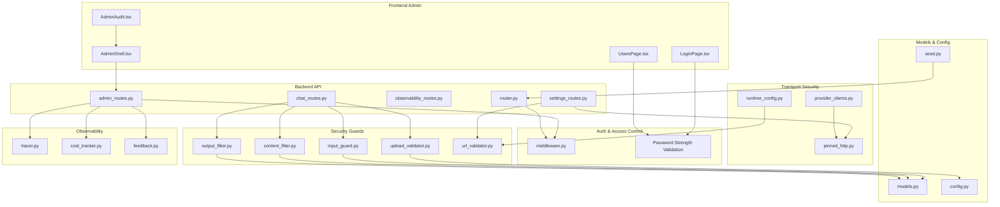

**Diagram sources**
- [input_guard.py:1-49](file://safe4ai-pilot/app/security/input_guard.py#L1-L49)
- [content_filter.py:1-64](file://safe4ai-pilot/app/security/content_filter.py#L1-L64)
- [output_filter.py:1-109](file://safe4ai-pilot/app/security/output_filter.py#L1-L109)
- [upload_validator.py:1-73](file://safe4ai-pilot/app/security/upload_validator.py#L1-L73)
- [url_validator.py:1-75](file://safe4ai-pilot/app/security/url_validator.py#L1-L75)
- [pinned_http.py:1-117](file://safe4ai-pilot/app/security/pinned_http.py#L1-L117)
- [models.py:1-95](file://safe4ai-pilot/app/models.py#L1-L95)
- [config.py:1-48](file://safe4ai-pilot/app/config.py#L1-L48)
- [middleware.py:1-83](file://safe4ai-pilot/app/auth/middleware.py#L1-L83)
- [router.py:1-170](file://safe4ai-pilot/app/auth/router.py#L1-L170)
- [settings_routes.py:16-17](file://safe4ai-pilot/app/api/settings_routes.py#L16-L17)
- [provider_clients.py:8](file://safe4ai-pilot/app/services/provider_clients.py#L8)
- [runtime_config.py:12](file://safe4ai-pilot/app/services/runtime_config.py#L12)
- [admin_audit.tsx:1-200](file://design/components/AdminAudit.tsx#L1-L200)
- [AdminShell.tsx:1-200](file://design/components/AdminShell.tsx#L1-L200)
- [chat_routes.py:1-200](file://safe4ai-pilot/app/api/chat_routes.py#L1-L200)
- [admin_routes.py:103-115](file://safe4ai-pilot/app/api/admin_routes.py#L103-L115)
- [observability_routes.py:1-200](file://safe4ai-pilot/app/api/observability_routes.py#L1-L200)
- [tracer.py:1-200](file://safe4ai-pilot/observability/tracer.py#L1-L200)
- [cost_tracker.py:1-200](file://safe4ai-pilot/observability/cost_tracker.py#L1-L200)
- [feedback.py:1-200](file://safe4ai-pilot/observability/feedback.py#L1-L200)
- [seed.py:134-136](file://safe4ai-pilot/scripts/seed.py#L134-L136)
- [LoginPage.tsx:11-14](file://safe4ai-pilot/frontend/src/pages/LoginPage.tsx#L11-L14)
- [UsersPage.tsx:108-140](file://safe4ai-pilot/frontend/src/pages/admin/UsersPage.tsx#L108-L140)

**Section sources**
- [architecture.md:1-45](file://safe4ai-pilot/docs/architecture.md#L1-L45)

## Core Components
This section outlines the core security and compliance building blocks and their responsibilities.

- Input Validation Layer (InputGuard): Sanitizes and validates user queries to prevent prompt injection and enforce length limits.
- Content Filtering Layer (ContentFilter): Detects and removes sensitive information from retrieved document chunks prior to LLM processing.
- Output Validation Layer (OutputFilter): **Enhanced with Rule 3 inference labeling guard** - ensures generated answers do not contain hallucinated PII, meet length heuristics, and properly label general inference responses with required disclaimers.
- Upload Validation (UploadValidator): Enforces allowed file types, MIME types, magic bytes, and size limits.
- **Enhanced Authentication Security**: Implements comprehensive password strength requirements (12+ characters with mixed case, digits, special characters), real-time validation feedback, and dynamic admin password generation via SEED_ADMIN_PASSWORD environment variable.
- **Transport-Level Security Controls**: Prevents DNS rebinding attacks through IP address pinning and provides SSRF protection via URL validation with private/reserved IP range blocking.
- Access Control (JWT Auth, RBAC): Authenticates users via signed JWT cookies and enforces role-based access.
- Audit Logging and Retention: Logs security-relevant events and retains audit logs per policy.
- Observability and Compliance Reporting: Tracing, cost tracking, and feedback capture support compliance reporting.
- Human Review Workflow: Flags low-confidence outputs for human review.

**Section sources**
- [input_guard.py:24-49](file://safe4ai-pilot/app/security/input_guard.py#L24-L49)
- [content_filter.py:25-64](file://safe4ai-pilot/app/security/content_filter.py#L25-L64)
- [output_filter.py:47-109](file://safe4ai-pilot/app/security/output_filter.py#L47-L109)
- [upload_validator.py:24-73](file://safe4ai-pilot/app/security/upload_validator.py#L24-L73)
- [url_validator.py:11-21](file://safe4ai-pilot/app/security/url_validator.py#L11-L21)
- [pinned_http.py:17-108](file://safe4ai-pilot/app/security/pinned_http.py#L17-L108)
- [router.py:32](file://safe4ai-pilot/app/auth/router.py#L32)
- [admin_routes.py:103-115](file://safe4ai-pilot/app/api/admin_routes.py#L103-L115)
- [middleware.py:25-83](file://safe4ai-pilot/app/auth/middleware.py#L25-L83)
- [router.py:39-125](file://safe4ai-pilot/app/auth/router.py#L39-L125)
- [config.py:16-21](file://safe4ai-pilot/app/config.py#L16-L21)
- [models.py:38-95](file://safe4ai-pilot/app/models.py#L38-L95)
- [architecture.md:30-35](file://safe4ai-pilot/docs/architecture.md#L30-L35)

## Architecture Overview
The system employs a layered security architecture integrated into the RAG pipeline. The three security layers operate as follows:
- Input Guard: Validates and sanitizes queries before rewriting and retrieval.
- Content Filter: Removes PII-containing chunks from the retrieval context.
- Output Filter: **Enhanced with Rule 3 inference labeling guard** - Reviews generated answers for hallucinated PII, suspicious length, citation presence, and proper inference labeling with required disclaimers.
- **Transport Security**: Validates provider URLs and pins resolved IP addresses to prevent DNS rebinding attacks.

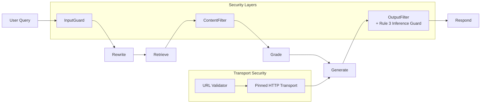

**Diagram sources**
- [architecture.md:20-28](file://safe4ai-pilot/docs/architecture.md#L20-L28)
- [input_guard.py:27-49](file://safe4ai-pilot/app/security/input_guard.py#L27-L49)
- [content_filter.py:29-64](file://safe4ai-pilot/app/security/content_filter.py#L29-L64)
- [output_filter.py:47-109](file://safe4ai-pilot/app/security/output_filter.py#L47-L109)
- [url_validator.py:54-75](file://safe4ai-pilot/app/security/url_validator.py#L54-L75)
- [pinned_http.py:95-117](file://safe4ai-pilot/app/security/pinned_http.py#L95-L117)

## Detailed Component Analysis

### Input Validation Layer
The InputGuard component performs:
- HTML tag stripping and control character filtering to sanitize input.
- Length enforcement to cap query size.
- Pattern matching to detect prompt-injection attempts and jailbreak phrases.

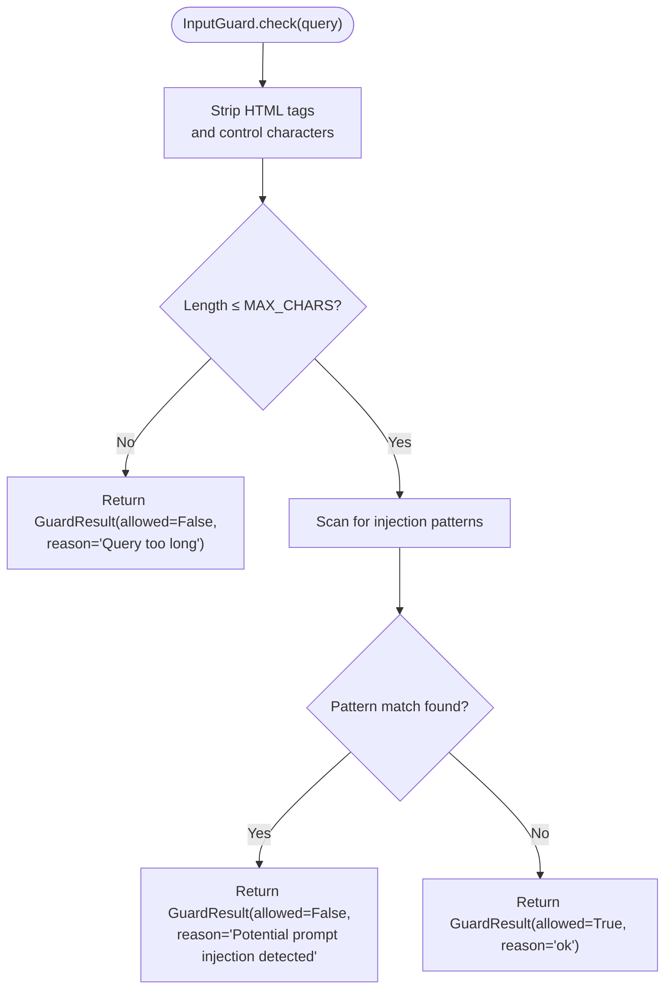

**Diagram sources**
- [input_guard.py:27-49](file://safe4ai-pilot/app/security/input_guard.py#L27-L49)

**Section sources**
- [input_guard.py:24-49](file://safe4ai-pilot/app/security/input_guard.py#L24-L49)

### Content Filtering Layer
The ContentFilter component:
- Detects PII patterns in retrieved chunks and excludes them from the context.
- Supports configurable blocked terms to exclude sensitive topics.
- Logs each exclusion for auditability.

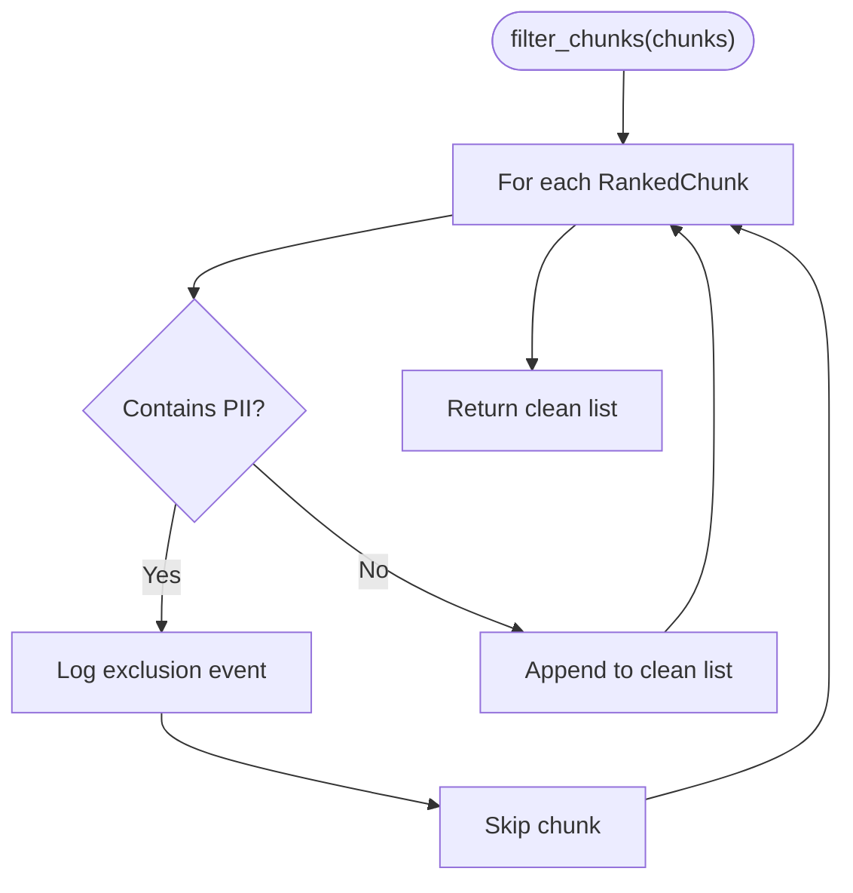

**Diagram sources**
- [content_filter.py:29-64](file://safe4ai-pilot/app/security/content_filter.py#L29-L64)

**Section sources**
- [content_filter.py:25-64](file://safe4ai-pilot/app/security/content_filter.py#L25-L64)

### Enhanced Output Validation Layer
**Updated** The OutputFilter component now implements a comprehensive three-rule validation system:

#### Rule 0: Citation Presence Check
- **New Rule** - When source documents are present, answers must include citations
- Prevents code paths that skip citation population
- Blocks responses with no sources when grounded answers are expected

#### Rule 1: PII Hallucination Detection
- Identifies PII in generated answers and compares against source chunk content
- Excludes hallucinated personal information not present in source documents
- Prevents data leakage of sensitive information

#### Rule 3: Inference Labeling Guard (NEW)
- **New Rule** - Detects general inference and model knowledge language
- Requires clear "not stated in the documents" disclaimers for inference responses
- Prevents misleading presentation of model-generated information as factual
- Only applies when inference language is detected

#### Rule 2: Suspicious Length Heuristic
- Applies 4,000 character threshold for suspiciously long outputs
- Logs warnings for excessive output length while allowing continuation

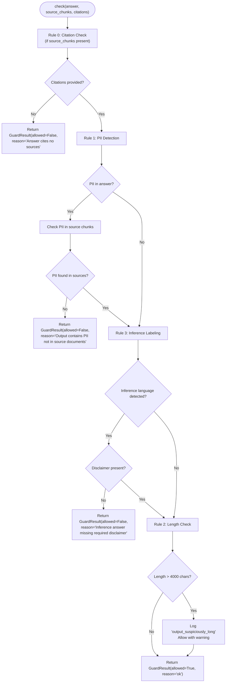

**Diagram sources**
- [output_filter.py:47-109](file://safe4ai-pilot/app/security/output_filter.py#L47-L109)

**Section sources**
- [output_filter.py:47-109](file://safe4ai-pilot/app/security/output_filter.py#L47-L109)

### Upload Validation
The UploadValidator enforces:
- Allowed file extensions and declared MIME types.
- Magic-byte verification for actual MIME type.
- Maximum file size limit derived from configuration.

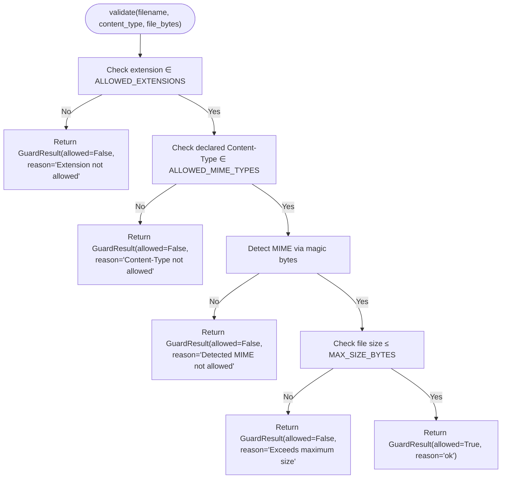

**Diagram sources**
- [upload_validator.py:25-73](file://safe4ai-pilot/app/security/upload_validator.py#L25-L73)

**Section sources**
- [upload_validator.py:24-73](file://safe4ai-pilot/app/security/upload_validator.py#L24-L73)

### Enhanced Authentication Security
The system now implements comprehensive password security measures across multiple layers:

#### Backend Password Validation
- **Minimum Length Requirement**: 12+ characters enforced server-side
- **Complexity Requirements**: Must contain uppercase, lowercase, digit, and special character
- **Real-time Validation**: Immediate feedback on password strength during user creation
- **Consistent Enforcement**: Both frontend and backend validation work together

#### Frontend Password Validation
- **Client-side Zod Schema**: Enforces 12+ character minimum
- **Real-time Feedback**: Visual indicators and error messages for password requirements
- **User Experience**: Clear guidance on password complexity requirements

#### Dynamic Admin Password Generation
- **Environment Variable Support**: SEED_ADMIN_PASSWORD environment variable for custom admin passwords
- **Secure Random Generation**: Automatic generation using secrets.token_urlsafe(18) + Aa!9 suffix
- **Seed Script Integration**: Centralized password generation during system initialization

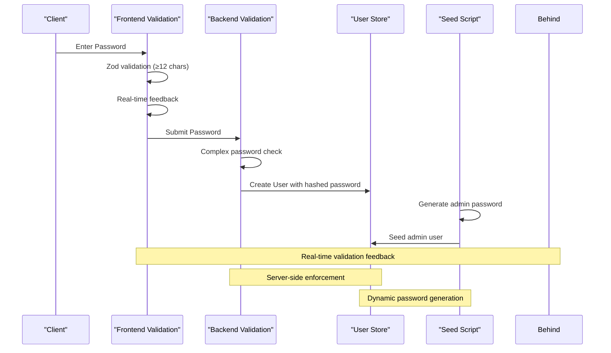

**Diagram sources**
- [router.py:63-65](file://safe4ai-pilot/app/auth/router.py#L63-L65)
- [admin_routes.py:103-115](file://safe4ai-pilot/app/api/admin_routes.py#L103-L115)
- [seed.py:134-136](file://safe4ai-pilot/scripts/seed.py#L134-L136)
- [LoginPage.tsx:11-14](file://safe4ai-pilot/frontend/src/pages/LoginPage.tsx#L11-L14)

**Section sources**
- [router.py:32](file://safe4ai-pilot/app/auth/router.py#L32)
- [router.py:63-65](file://safe4ai-pilot/app/auth/router.py#L63-L65)
- [admin_routes.py:103-115](file://safe4ai-pilot/app/api/admin_routes.py#L103-L115)
- [seed.py:134-136](file://safe4ai-pilot/scripts/seed.py#L134-L136)
- [LoginPage.tsx:11-14](file://safe4ai-pilot/frontend/src/pages/LoginPage.tsx#L11-L14)

### Transport-Level Security Controls
**Updated** The system now includes comprehensive transport-level security controls to prevent DNS rebinding attacks and provide SSRF protection.

#### URL Validator (SSRF Protection)
The URL validator enforces:
- **Scheme Validation**: Only allows http and https schemes
- **Hostname Resolution**: Resolves hostnames to IP addresses
- **Private Network Blocking**: Blocks private/reserved IP ranges including:
  - RFC1918 private networks (10.0.0.0/8, 172.16.0.0/12, 192.168.0.0/16)
  - Loopback addresses (127.0.0.0/8, ::1/128)
  - Link-local addresses (169.254.0.0/16, fe80::/10)
  - Zero addresses (0.0.0.0/8)
  - Unique-local IPv6 addresses (fc00::/7)
- **DNS Rebinding Prevention**: Returns the first resolved IP to prevent DNS rebinding attacks

#### Pinned HTTP Transport System
The pinned HTTP transport system provides:
- **IP Address Pinning**: Binds resolved IP addresses to URLs to prevent DNS rebinding
- **Dual Transport Support**: Provides both synchronous and asynchronous transport classes
- **Network Backend Wrapping**: Wraps underlying network backends to intercept connections
- **Hostname Matching**: Only redirects connections for the original hostname
- **Connection Pool Management**: Uses httpcore ConnectionPool for efficient connection handling

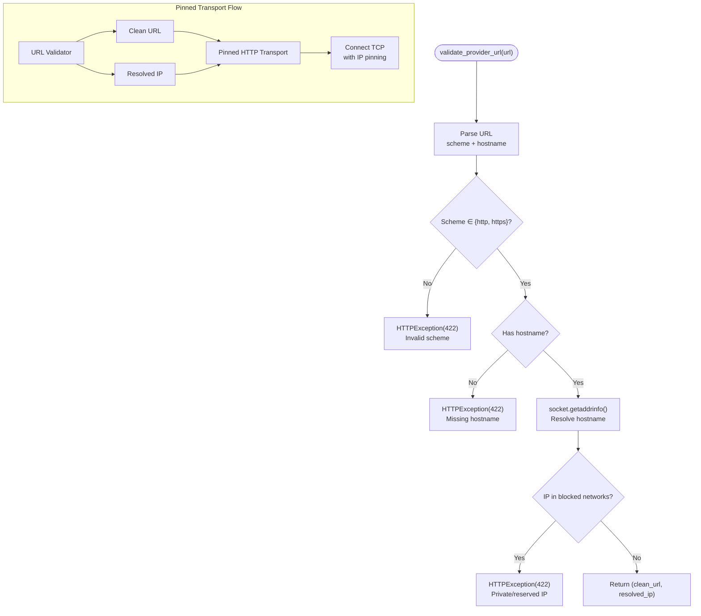

**Diagram sources**
- [url_validator.py:54-75](file://safe4ai-pilot/app/security/url_validator.py#L54-L75)
- [url_validator.py:26-51](file://safe4ai-pilot/app/security/url_validator.py#L26-L51)
- [pinned_http.py:95-117](file://safe4ai-pilot/app/security/pinned_http.py#L95-L117)
- [pinned_http.py:17-108](file://safe4ai-pilot/app/security/pinned_http.py#L17-L108)

**Section sources**
- [url_validator.py:11-21](file://safe4ai-pilot/app/security/url_validator.py#L11-L21)
- [url_validator.py:26-51](file://safe4ai-pilot/app/security/url_validator.py#L26-L51)
- [url_validator.py:54-75](file://safe4ai-pilot/app/security/url_validator.py#L54-L75)
- [pinned_http.py:17-108](file://safe4ai-pilot/app/security/pinned_http.py#L17-L108)
- [pinned_http.py:111-117](file://safe4ai-pilot/app/security/pinned_http.py#L111-L117)

### Access Control and Authentication
Access control is enforced via:
- JWT-based authentication with signed tokens stored in HTTP-only cookies.
- Role-based access control (RBAC) via a role field in the JWT payload.
- Password hashing with bcrypt and secure token encoding/decoding.
- Brute-force protection with rate limiting and account lockout thresholds.
- **Enhanced Password Security**: Comprehensive password validation at multiple levels.

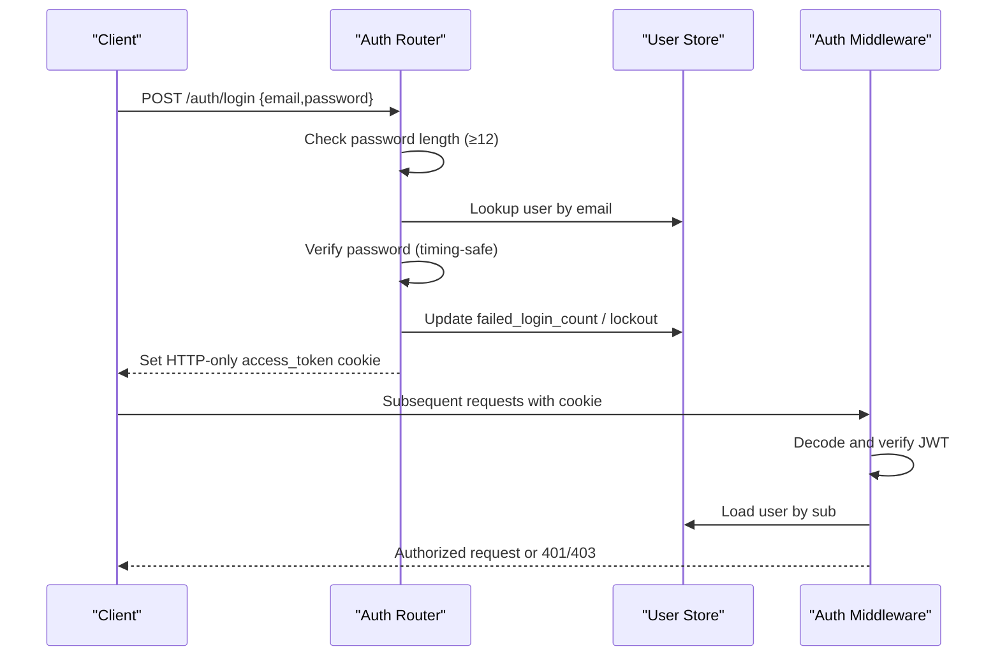

**Diagram sources**
- [router.py:39-105](file://safe4ai-pilot/app/auth/router.py#L39-L105)
- [middleware.py:51-83](file://safe4ai-pilot/app/auth/middleware.py#L51-L83)

**Section sources**
- [router.py:39-125](file://safe4ai-pilot/app/auth/router.py#L39-L125)
- [middleware.py:25-83](file://safe4ai-pilot/app/auth/middleware.py#L25-L83)

### Audit Logging and Compliance Reporting
The system maintains:
- Structured audit logs for security events (e.g., PII exclusions, suspicious outputs, login events).
- Configurable retention periods for audit logs and caches.
- Administrative dashboards for reviewing activity and compliance metrics.

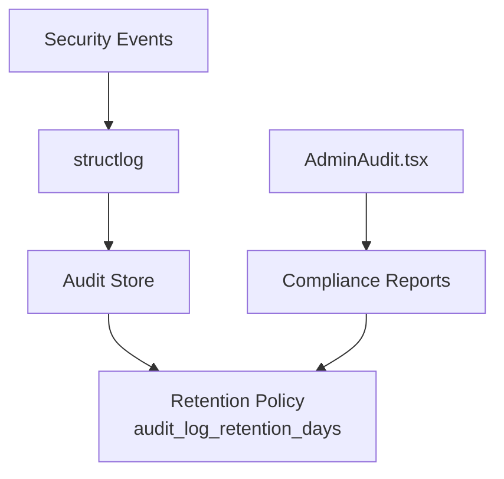

**Diagram sources**
- [content_filter.py:34-38](file://safe4ai-pilot/app/security/content_filter.py#L34-L38)
- [output_filter.py:102-107](file://safe4ai-pilot/app/security/output_filter.py#L102-L107)
- [router.py:104-105](file://safe4ai-pilot/app/auth/router.py#L104-L105)
- [config.py:16](file://safe4ai-pilot/app/config.py#L16)
- [admin_audit.tsx:1-200](file://design/components/AdminAudit.tsx#L1-L200)

**Section sources**
- [content_filter.py:34-38](file://safe4ai-pilot/app/security/content_filter.py#L34-L38)
- [output_filter.py:102-107](file://safe4ai-pilot/app/security/output_filter.py#L102-L107)
- [router.py:104-105](file://safe4ai-pilot/app/auth/router.py#L104-L105)
- [config.py:16](file://safe4ai-pilot/app/config.py#L16)
- [admin_audit.tsx:1-200](file://design/components/AdminAudit.tsx#L1-L200)

### Data Privacy Measures
- PII detection and removal in retrieved chunks and output answers.
- Safe filenames for uploads to avoid malicious filenames.
- Strict cookie attributes (HTTP-only, SameSite, Secure) to mitigate XSS and CSRF risks.
- Password hashing with bcrypt and secure JWT signing.
- **Enhanced Password Security**: Comprehensive password validation and generation mechanisms.
- **Transport Security**: URL validation and IP pinning prevent unauthorized network access and data exfiltration.
- **Inference Labeling Guard**: Prevents misleading presentation of model-generated information as factual documentation.

**Section sources**
- [content_filter.py:13-18](file://safe4ai-pilot/app/security/content_filter.py#L13-L18)
- [output_filter.py:13-18](file://safe4ai-pilot/app/security/output_filter.py#L13-L18)
- [upload_validator.py:70-73](file://safe4ai-pilot/app/security/upload_validator.py#L70-L73)
- [router.py:96-103](file://safe4ai-pilot/app/auth/router.py#L96-L103)
- [middleware.py:25-48](file://safe4ai-pilot/app/auth/middleware.py#L25-L48)
- [url_validator.py:11-21](file://safe4ai-pilot/app/security/url_validator.py#L11-L21)
- [pinned_http.py:17-108](file://safe4ai-pilot/app/security/pinned_http.py#L17-L108)

### Human Review Workflows
Low-confidence or flagged outputs trigger a human review flag in the state machine. Administrators can review flagged items via the admin interface.

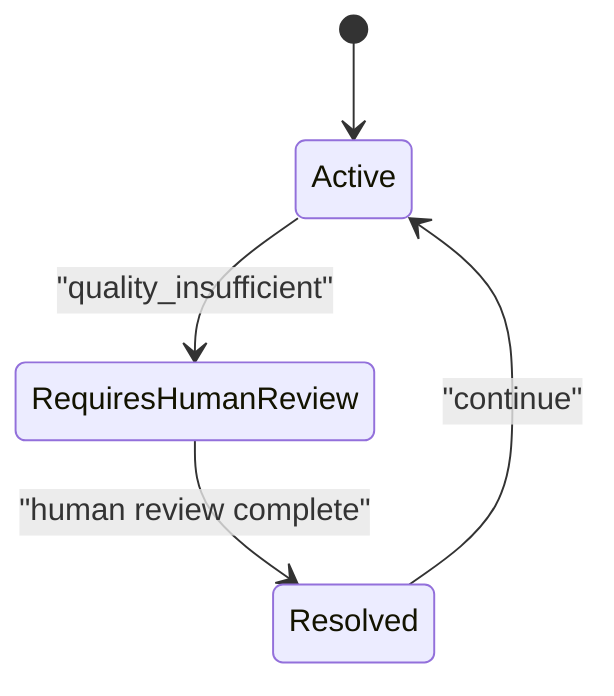

**Diagram sources**
- [models.py:86-87](file://safe4ai-pilot/app/models.py#L86-L87)

**Section sources**
- [models.py:86-87](file://safe4ai-pilot/app/models.py#L86-L87)

### Regulatory Compliance and Data Retention
- Audit log retention days are configurable.
- Upload size limits and allowed formats reduce risk exposure.
- Administrative dashboards enable compliance reporting and oversight.
- **Enhanced Password Security**: Meets regulatory requirements for strong authentication practices.
- **Transport Security**: Provides additional protection against network-based attacks and data exfiltration.
- **Inference Labeling Compliance**: Ensures compliance with regulations requiring transparency in AI-generated information disclosure.

**Section sources**
- [config.py:16-21](file://safe4ai-pilot/app/config.py#L16-L21)
- [upload_validator.py:21](file://safe4ai-pilot/app/security/upload_validator.py#L21)
- [url_validator.py:11-21](file://safe4ai-pilot/app/security/url_validator.py#L11-L21)

### Integration with External Security Tools and Monitoring
- Structured logging supports integration with SIEM and log aggregation platforms.
- Tracing and cost tracking enable observability for compliance reporting.
- Feedback collection supports continuous monitoring of content safety.
- **Enhanced Authentication**: Strong password policies integrate with external identity management systems.
- **Transport Security**: URL validation and IP pinning integrate with network security monitoring systems.
- **Inference Labeling**: Output filtering integrates with content safety monitoring and compliance reporting systems.

**Section sources**
- [tracer.py:1-200](file://safe4ai-pilot/observability/tracer.py#L1-L200)
- [cost_tracker.py:1-200](file://safe4ai-pilot/observability/cost_tracker.py#L1-L200)
- [feedback.py:1-200](file://safe4ai-pilot/observability/feedback.py#L1-L200)

### Security Incident Response and Forensics
- Structured logs capture events for forensic analysis.
- Cleanup and backup scripts support incident remediation and recovery.
- Verification scripts confirm deletion and retention policies.

**Section sources**
- [audit_cleanup.py:1-200](file://safe4ai-pilot/scripts/audit_cleanup.py#L1-L200)
- [backup.py:1-200](file://safe4ai-pilot/scripts/backup.py#L1-L200)
- [verify_deletion.py:1-200](file://safe4ai-pilot/scripts/verify_deletion.py#L1-L200)

## Dependency Analysis
The security guards depend on shared models and configuration, while authentication depends on database-backed user records. Observability integrates with admin routes for reporting. Enhanced password security creates additional dependencies between frontend validation, backend enforcement, and seed script generation. **The transport security components create dependencies across provider configuration, authentication flows, and runtime configuration management.** **The new inference labeling guard introduces dependencies on citation processing and enhanced output validation logic.**

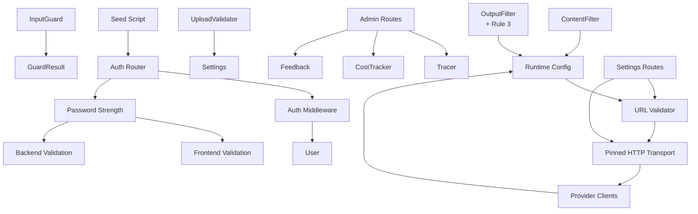

**Diagram sources**
- [input_guard.py:7](file://safe4ai-pilot/app/security/input_guard.py#L7)
- [content_filter.py:9](file://safe4ai-pilot/app/security/content_filter.py#L9)
- [output_filter.py:9](file://safe4ai-pilot/app/security/output_filter.py#L9)
- [upload_validator.py:10](file://safe4ai-pilot/app/security/upload_validator.py#L10)
- [middleware.py:17](file://safe4ai-pilot/app/auth/middleware.py#L17)
- [router.py:14](file://safe4ai-pilot/app/auth/router.py#L14)
- [models.py:38](file://safe4ai-pilot/app/models.py#L38)
- [config.py:7](file://safe4ai-pilot/app/config.py#L7)
- [seed.py:134-136](file://safe4ai-pilot/scripts/seed.py#L134-L136)
- [url_validator.py:12](file://safe4ai-pilot/app/security/url_validator.py#L12)
- [pinned_http.py:6](file://safe4ai-pilot/app/security/pinned_http.py#L6)
- [provider_clients.py:8](file://safe4ai-pilot/app/services/provider_clients.py#L8)
- [runtime_config.py:12](file://safe4ai-pilot/app/services/runtime_config.py#L12)
- [settings_routes.py:16-17](file://safe4ai-pilot/app/api/settings_routes.py#L16-L17)

**Section sources**
- [models.py:38-95](file://safe4ai-pilot/app/models.py#L38-L95)
- [config.py:7-48](file://safe4ai-pilot/app/config.py#L7-L48)
- [url_validator.py:11-21](file://safe4ai-pilot/app/security/url_validator.py#L11-L21)
- [pinned_http.py:17-108](file://safe4ai-pilot/app/security/pinned_http.py#L17-L108)

## Performance Considerations
- Regex-based PII detection scales linearly with text size; keep queries and chunks reasonably sized.
- Content filtering and output filtering iterate over chunks and answers; caching and semantic cache thresholds help reduce redundant processing.
- Rate limiting on authentication mitigates brute-force attacks without impacting legitimate users.
- Cookie attributes improve security with minimal overhead.
- **Enhanced Password Security**: Additional computational overhead for password validation is minimal and occurs only during user creation and authentication.
- **Transport Security**: URL resolution and IP pinning add minimal overhead to provider configuration and authentication flows.
- **SSRF Protection**: URL validation occurs during provider setup and OIDC configuration, with minimal impact on runtime performance.
- **Inference Labeling Guard**: Text processing for inference markers adds minimal overhead to output validation, only when inference language is detected.

## Troubleshooting Guide
Common issues and resolutions:
- Authentication failures: Verify SECRET_KEY strength and HTTPS enforcement. Check failed login counters and lockout windows.
- Upload rejections: Confirm file extension, declared MIME type, magic bytes, and size limits.
- Security guard denials: Review guard reasons and adjust patterns or thresholds if needed.
- Audit gaps: Validate retention settings and scheduled cleanup jobs.
- **Password validation issues**: Ensure passwords meet 12+ character requirement with mixed case, digits, and special characters. Check both frontend and backend validation messages.
- **SSRF validation errors**: Verify provider URLs use allowed schemes (http/https) and resolve to public IP addresses. Check firewall and network configuration.
- **DNS rebinding issues**: Ensure provider URLs resolve to stable IP addresses. Verify DNS configuration and network security policies.
- **Inference labeling failures**: Ensure answers using general inference language include required "not stated in the documents" disclaimers. Check citation presence for grounded answers.
- **Citation-related rejections**: Verify that grounded answers include proper citations when source documents are present.

**Section sources**
- [config.py:22-31](file://safe4ai-pilot/app/config.py#L22-L31)
- [router.py:53-82](file://safe4ai-pilot/app/auth/router.py#L53-L82)
- [upload_validator.py:39-68](file://safe4ai-pilot/app/security/upload_validator.py#L39-L68)
- [test_security_guards.py:286-341](file://safe4ai-pilot/tests/test_security_guards.py#L286-L341)
- [test_security_headers.py:1-200](file://safe4ai-pilot/tests/test_security_headers.py#L1-L200)
- [url_validator.py:26-51](file://safe4ai-pilot/app/security/url_validator.py#L26-L51)

## Conclusion
The Private AI system implements a robust, multi-layered security architecture integrated into the RAG pipeline. Input, content, and output guards protect against prompt injection, PII leakage, and hallucinations. Strong access control, structured audit logging, and configurable retention support compliance reporting. Human review workflows and observability tooling enable continuous monitoring and incident response. **The enhanced authentication security measures now provide comprehensive password validation, real-time feedback, and dynamic password generation capabilities that significantly strengthen the system's overall security posture.** **The new transport-level security controls provide critical protection against DNS rebinding attacks and SSRF vulnerabilities through URL validation and IP address pinning mechanisms, ensuring secure outbound connections to provider services and external APIs.** **The newly implemented Rule 3 inference labeling guard adds a crucial layer of transparency and compliance by requiring clear disclaimers for general inference responses, preventing misleading presentation of model-generated information as factual documentation.** Together, these controls form a comprehensive foundation for responsible AI deployment and regulatory compliance.

## Appendices

### Security Architecture Diagrams

#### Threat Vectors and Mitigations
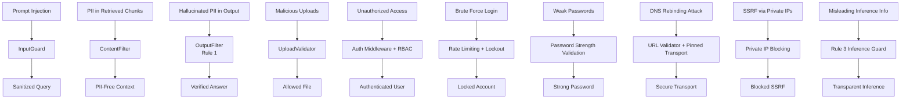

#### Enhanced Password Security Flow
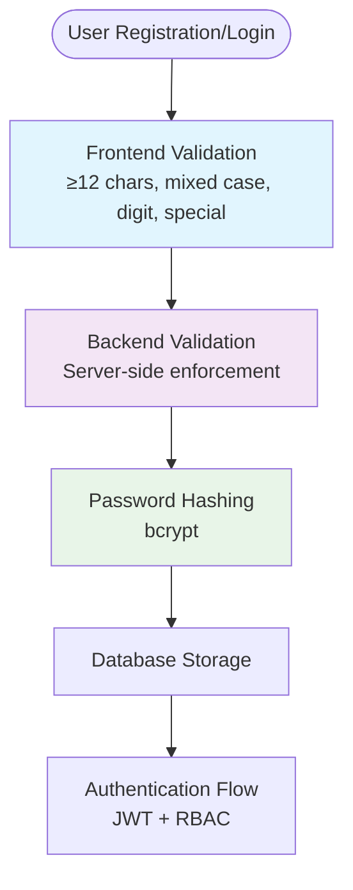

#### Transport Security Flow
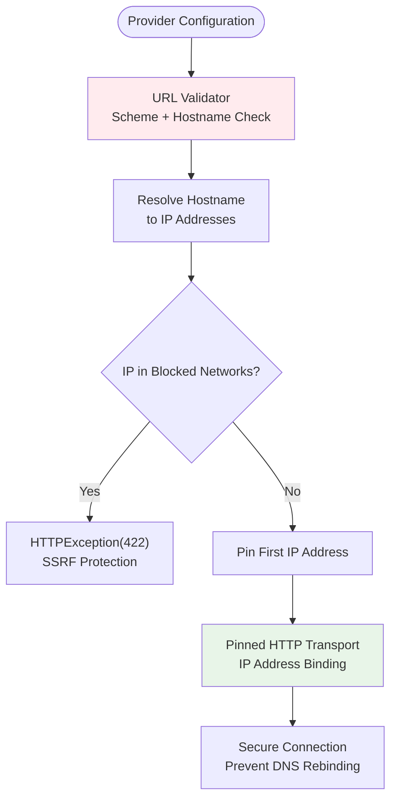

#### Enhanced Output Validation Flow
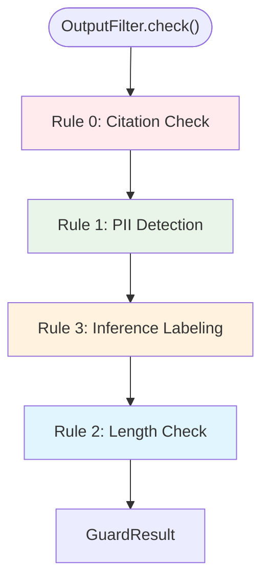

**Diagram sources**
- [router.py:63-65](file://safe4ai-pilot/app/auth/router.py#L63-L65)
- [admin_routes.py:103-115](file://safe4ai-pilot/app/api/admin_routes.py#L103-L115)
- [seed.py:134-136](file://safe4ai-pilot/scripts/seed.py#L134-L136)
- [LoginPage.tsx:11-14](file://safe4ai-pilot/frontend/src/pages/LoginPage.tsx#L11-L14)
- [url_validator.py:54-75](file://safe4ai-pilot/app/security/url_validator.py#L54-L75)
- [pinned_http.py:95-117](file://safe4ai-pilot/app/security/pinned_http.py#L95-L117)
- [output_filter.py:47-109](file://safe4ai-pilot/app/security/output_filter.py#L47-L109)

### Regulatory Compliance Checklist
- Data minimization: Limit query and chunk sizes; retain audit logs per policy.
- Consent and transparency: Admin dashboards and logs support disclosure.
- Integrity and confidentiality: Hashed passwords, signed JWTs, secure cookies.
- Accountability: Structured logs and human review workflows.
- Data subject rights: Deletion and backup scripts support data lifecycle.
- **Enhanced Password Security**: Meets regulatory requirements for strong authentication practices including 12+ character minimum, complexity requirements, and real-time validation feedback.
- **Transport Security**: Provides additional protection against network-based attacks and data exfiltration through URL validation and IP pinning mechanisms.
- **SSRF Protection**: Complies with security standards requiring protection against server-side request forgery attacks targeting internal networks.
- **DNS Rebinding Prevention**: Protects against modern attack vectors that exploit DNS resolution timing to bypass security controls.
- **Inference Transparency**: Ensures compliance with regulations requiring transparency in AI-generated information disclosure, preventing misleading presentation of model knowledge as factual documentation.
- **Grounded Response Enforcement**: Maintains compliance with responsible AI principles by requiring proper citations and disclaimers for inference responses.