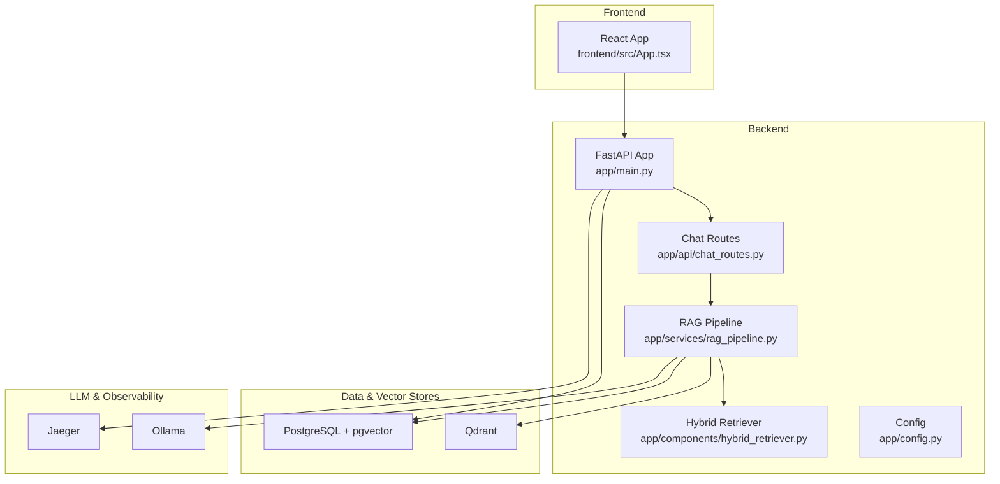
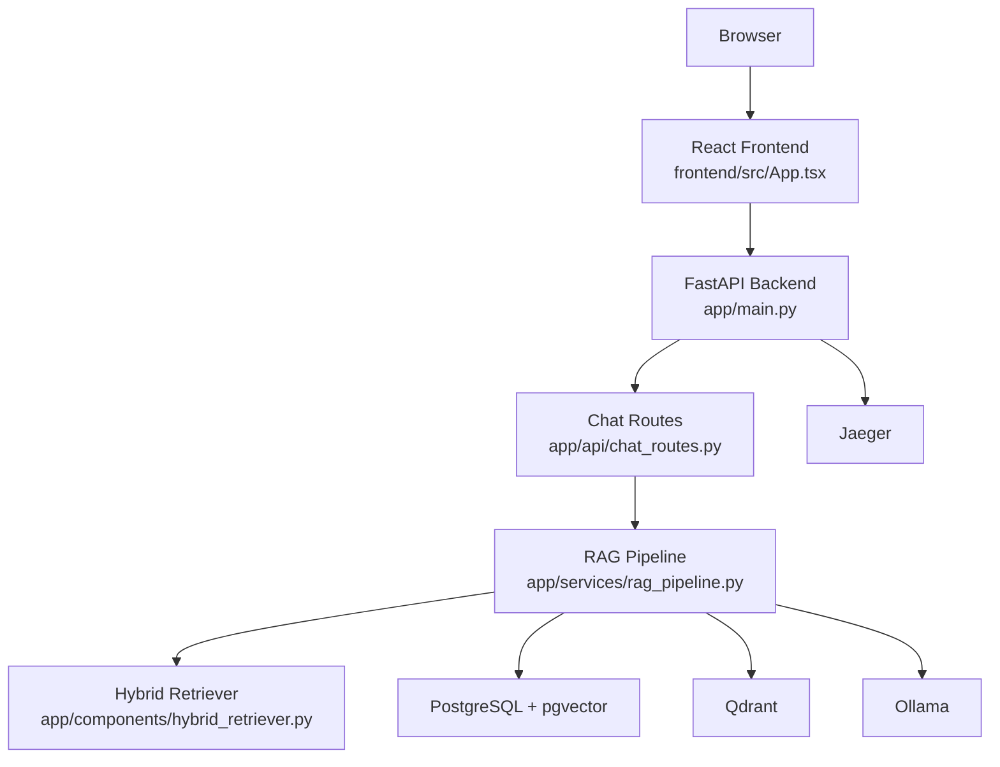
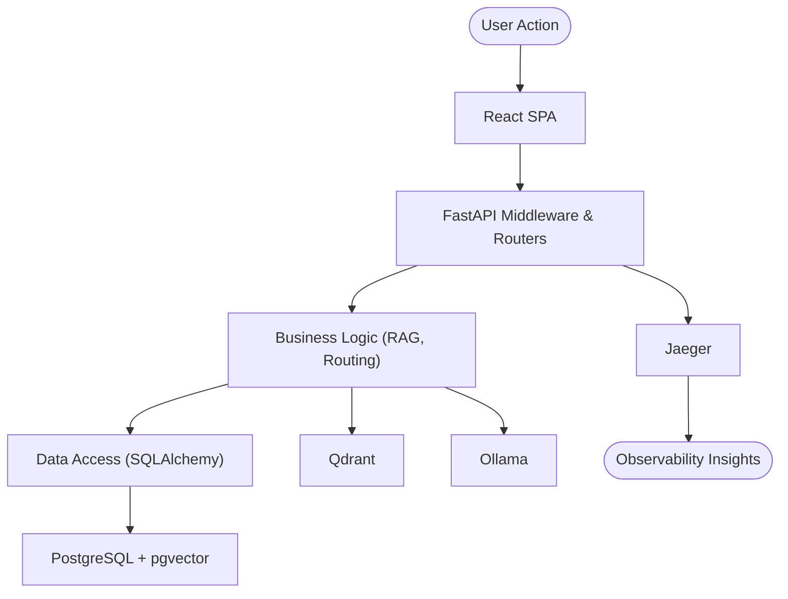
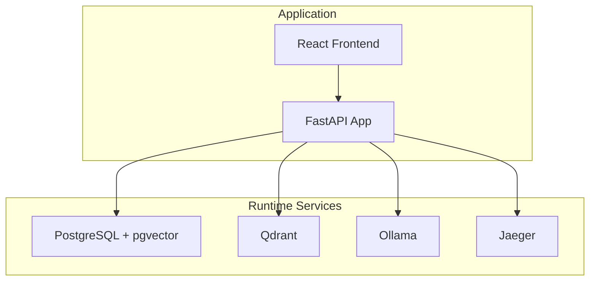
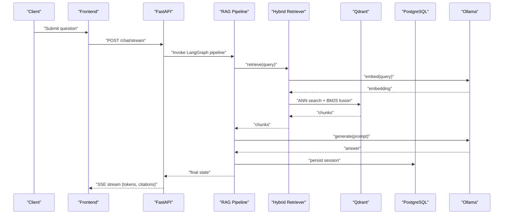
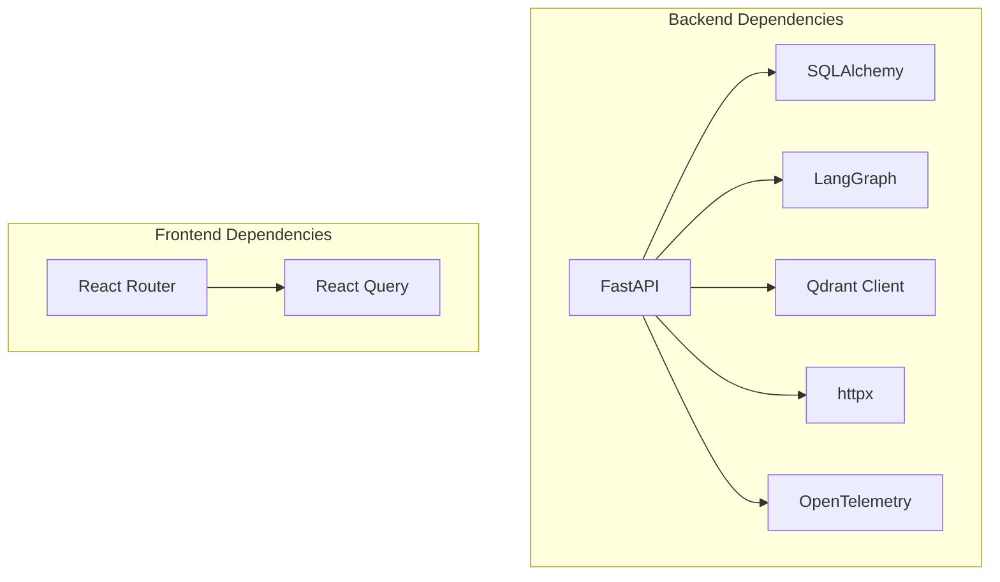

# System Overview

<cite>
**Referenced Files in This Document**
- [README.md](file://safe4ai-pilot/README.md)
- [architecture.md](file://safe4ai-pilot/docs/architecture.md)
- [deployment.md](file://safe4ai-pilot/docs/deployment.md)
- [docker-compose.yml](file://safe4ai-pilot/docker-compose.yml)
- [pyproject.toml](file://safe4ai-pilot/pyproject.toml)
- [app/main.py](file://safe4ai-pilot/app/main.py)
- [app/api/chat_routes.py](file://safe4ai-pilot/app/api/chat_routes.py)
- [app/services/rag_pipeline.py](file://safe4ai-pilot/app/services/rag_pipeline.py)
- [app/components/hybrid_retriever.py](file://safe4ai-pilot/app/components/hybrid_retriever.py)
- [app/security/input_guard.py](file://safe4ai-pilot/app/security/input_guard.py)
- [observability/tracer.py](file://safe4ai-pilot/observability/tracer.py)
- [app/config.py](file://safe4ai-pilot/app/config.py)
- [frontend/src/App.tsx](file://safe4ai-pilot/frontend/src/App.tsx)
- [frontend/package.json](file://safe4ai-pilot/frontend/package.json)
</cite>

## Table of Contents
1. [Introduction](#introduction)
2. [Project Structure](#project-structure)
3. [Core Components](#core-components)
4. [Architecture Overview](#architecture-overview)
5. [Detailed Component Analysis](#detailed-component-analysis)
6. [Dependency Analysis](#dependency-analysis)
7. [Performance Considerations](#performance-considerations)
8. [Troubleshooting Guide](#troubleshooting-guide)
9. [Conclusion](#conclusion)
10. [Appendices](#appendices)

## Introduction
This document presents a comprehensive system overview of the Private AI platform. It explains the layered architecture pattern (presentation, business logic, and data access), the microservices ecosystem (FastAPI backend, React frontend, PostgreSQL with pgvector, Qdrant, Ollama, and Jaeger), and the system’s boundaries, external dependencies, and integration points. It also covers the rationale behind key architectural decisions such as local LLM deployment and vector-based retrieval, along with scalability, performance characteristics, and deployment topology.

## Project Structure
The project is organized into a backend (FastAPI), a frontend (React), shared observability utilities, and supporting documentation and scripts. The backend encapsulates the AI pipeline, retrieval, and API surface. The frontend provides user-facing pages and admin dashboards. Supporting services include PostgreSQL with pgvector, Qdrant, Ollama, and Jaeger.

**Diagram sources**
- [app/main.py:63-101](file://safe4ai-pilot/app/main.py#L63-L101)
- [app/api/chat_routes.py:28-244](file://safe4ai-pilot/app/api/chat_routes.py#L28-L244)
- [app/services/rag_pipeline.py:34-313](file://safe4ai-pilot/app/services/rag_pipeline.py#L34-L313)
- [app/components/hybrid_retriever.py:13-143](file://safe4ai-pilot/app/components/hybrid_retriever.py#L13-L143)
- [docker-compose.yml:1-119](file://safe4ai-pilot/docker-compose.yml#L1-L119)

**Section sources**
- [README.md:1-133](file://safe4ai-pilot/README.md#L1-L133)
- [docker-compose.yml:1-119](file://safe4ai-pilot/docker-compose.yml#L1-L119)

## Core Components
- Presentation Layer (Frontend): React-based UI with routing, protected routes, and admin dashboards. It communicates with the backend via proxied API endpoints.
- Business Logic Layer (Backend): FastAPI application exposing chat and admin endpoints, orchestrating the RAG pipeline, enforcing rate limits, and managing sessions.
- Data Access Layer: SQLAlchemy ORM with PostgreSQL (pgvector extension) for persistent data and audit logs; Qdrant for vector similarity search and hybrid retrieval.

Key implementation anchors:
- Backend entry and lifecycle: [app/main.py:28-60](file://safe4ai-pilot/app/main.py#L28-L60), [app/main.py:63-101](file://safe4ai-pilot/app/main.py#L63-L101)
- Chat endpoints: [app/api/chat_routes.py:28-244](file://safe4ai-pilot/app/api/chat_routes.py#L28-L244)
- RAG pipeline: [app/services/rag_pipeline.py:34-313](file://safe4ai-pilot/app/services/rag_pipeline.py#L34-L313)
- Hybrid retrieval: [app/components/hybrid_retriever.py:13-143](file://safe4ai-pilot/app/components/hybrid_retriever.py#L13-L143)
- Configuration: [app/config.py:5-28](file://safe4ai-pilot/app/config.py#L5-L28)

**Section sources**
- [frontend/src/App.tsx:25-91](file://safe4ai-pilot/frontend/src/App.tsx#L25-L91)
- [app/main.py:28-101](file://safe4ai-pilot/app/main.py#L28-L101)
- [app/api/chat_routes.py:28-244](file://safe4ai-pilot/app/api/chat_routes.py#L28-L244)
- [app/services/rag_pipeline.py:34-313](file://safe4ai-pilot/app/services/rag_pipeline.py#L34-L313)
- [app/components/hybrid_retriever.py:13-143](file://safe4ai-pilot/app/components/hybrid_retriever.py#L13-L143)
- [app/config.py:5-28](file://safe4ai-pilot/app/config.py#L5-L28)

## Architecture Overview
The system follows a layered architecture:
- Presentation: React SPA with protected routes and admin dashboards.
- Business Logic: FastAPI with route handlers, rate limiting, and middleware; integrates LangGraph for streaming pipeline orchestration.
- Data Access: SQLAlchemy ORM with PostgreSQL (pgvector) and Qdrant for vector storage and hybrid retrieval.

Microservices ecosystem:
- FastAPI backend: Orchestrates chat, admin, and observability endpoints.
- React frontend: SPA with routing and admin pages.
- PostgreSQL + pgvector: Persistent relational data and vector embeddings.
- Qdrant: Vector similarity search and hybrid dense/sparse ranking.
- Ollama: Local LLM inference for embeddings, generation, and OCR.
- Jaeger: Distributed tracing for observability.

**Diagram sources**
- [frontend/src/App.tsx:25-91](file://safe4ai-pilot/frontend/src/App.tsx#L25-L91)
- [app/main.py:63-101](file://safe4ai-pilot/app/main.py#L63-L101)
- [app/api/chat_routes.py:28-244](file://safe4ai-pilot/app/api/chat_routes.py#L28-L244)
- [app/services/rag_pipeline.py:34-313](file://safe4ai-pilot/app/services/rag_pipeline.py#L34-L313)
- [app/components/hybrid_retriever.py:13-143](file://safe4ai-pilot/app/components/hybrid_retriever.py#L13-L143)
- [docker-compose.yml:1-119](file://safe4ai-pilot/docker-compose.yml#L1-L119)

## Detailed Component Analysis

### Layered Architecture Pattern
- Presentation Layer: React SPA with route guards and admin dashboards. It consumes backend APIs via proxy endpoints.
- Business Logic Layer: FastAPI app initializes shared components (LangGraph, HybridRetriever, Reranker) at startup, exposes chat and admin endpoints, enforces rate limits, and applies security middleware.
- Data Access Layer: SQLAlchemy models and sessions manage persistent data; pgvector enables vector similarity; Qdrant supports hybrid dense/sparse retrieval.

**Diagram sources**
- [frontend/src/App.tsx:25-91](file://safe4ai-pilot/frontend/src/App.tsx#L25-L91)
- [app/main.py:63-101](file://safe4ai-pilot/app/main.py#L63-L101)
- [app/api/chat_routes.py:28-244](file://safe4ai-pilot/app/api/chat_routes.py#L28-L244)
- [app/services/rag_pipeline.py:34-313](file://safe4ai-pilot/app/services/rag_pipeline.py#L34-L313)
- [app/components/hybrid_retriever.py:13-143](file://safe4ai-pilot/app/components/hybrid_retriever.py#L13-L143)
- [docker-compose.yml:1-119](file://safe4ai-pilot/docker-compose.yml#L1-L119)

**Section sources**
- [frontend/src/App.tsx:25-91](file://safe4ai-pilot/frontend/src/App.tsx#L25-L91)
- [app/main.py:28-101](file://safe4ai-pilot/app/main.py#L28-L101)
- [app/api/chat_routes.py:28-244](file://safe4ai-pilot/app/api/chat_routes.py#L28-L244)

### Microservices Ecosystem and Integrations
- FastAPI backend: Initializes shared components and exposes endpoints for chat, admin, and observability.
- React frontend: SPA with protected routes and admin dashboards; proxies API calls to the backend.
- PostgreSQL + pgvector: Persistent relational data and vector embeddings.
- Qdrant: Vector similarity search and hybrid dense/sparse ranking.
- Ollama: Local LLM for embeddings, generation, and OCR.
- Jaeger: Distributed tracing for end-to-end visibility.

**Diagram sources**
- [docker-compose.yml:1-119](file://safe4ai-pilot/docker-compose.yml#L1-L119)
- [app/main.py:63-101](file://safe4ai-pilot/app/main.py#L63-L101)
- [frontend/package.json:11-31](file://safe4ai-pilot/frontend/package.json#L11-L31)

**Section sources**
- [docker-compose.yml:1-119](file://safe4ai-pilot/docker-compose.yml#L1-L119)
- [README.md:30-36](file://safe4ai-pilot/README.md#L30-L36)

### System Context and Data Flows
- Chat flow: Client sends a question; backend validates, streams pipeline events, retrieves context from Qdrant, reranks, generates an answer via Ollama, and returns streamed tokens and citations.
- Ingestion flow: Files are validated, chunked, embedded via Ollama, upserted into Qdrant, and persisted in PostgreSQL; OCR is applied for scanned PDFs.

**Diagram sources**
- [app/api/chat_routes.py:150-244](file://safe4ai-pilot/app/api/chat_routes.py#L150-L244)
- [app/services/rag_pipeline.py:151-181](file://safe4ai-pilot/app/services/rag_pipeline.py#L151-L181)
- [app/components/hybrid_retriever.py:56-142](file://safe4ai-pilot/app/components/hybrid_retriever.py#L56-L142)

**Section sources**
- [app/api/chat_routes.py:150-244](file://safe4ai-pilot/app/api/chat_routes.py#L150-L244)
- [app/services/rag_pipeline.py:151-181](file://safe4ai-pilot/app/services/rag_pipeline.py#L151-L181)
- [app/components/hybrid_retriever.py:56-142](file://safe4ai-pilot/app/components/hybrid_retriever.py#L56-L142)

### Rationale for Key Architectural Decisions
- Local LLM deployment (Ollama): Ensures data privacy and reduces latency by keeping models close to the application. The system warms models on startup and keeps them resident.
- Vector-based retrieval: Uses Qdrant for high-performance ANN search and pgvector for lightweight caching and audit data. Hybrid dense/sparse ranking improves recall and relevance.
- Streaming pipeline: LangGraph drives a streaming pipeline with SSE to provide immediate feedback and citations.

**Section sources**
- [architecture.md:3-44](file://safe4ai-pilot/docs/architecture.md#L3-L44)
- [app/main.py:104-116](file://safe4ai-pilot/app/main.py#L104-L116)
- [app/components/hybrid_retriever.py:13-143](file://safe4ai-pilot/app/components/hybrid_retriever.py#L13-L143)

## Dependency Analysis
External dependencies and runtime profiles are defined in the backend project configuration and deployment documentation. The frontend defines its own runtime dependencies.

**Diagram sources**
- [pyproject.toml:9-46](file://safe4ai-pilot/pyproject.toml#L9-L46)
- [frontend/package.json:11-31](file://safe4ai-pilot/frontend/package.json#L11-L31)

**Section sources**
- [pyproject.toml:9-46](file://safe4ai-pilot/pyproject.toml#L9-L46)
- [frontend/package.json:11-31](file://safe4ai-pilot/frontend/package.json#L11-L31)

## Performance Considerations
- Model warm-up: Startup prewarming and long-lived model residency reduce cold-start latency.
- Vector search: Qdrant ANN with BM25 fusion balances precision and recall; chunk size and overlap tuned for retrieval quality.
- Streaming: SSE streaming provides responsive UX and early feedback.
- Hardware guidance: GPU vs CPU paths are documented with memory and throughput expectations.

**Section sources**
- [app/main.py:104-116](file://safe4ai-pilot/app/main.py#L104-L116)
- [app/services/rag_pipeline.py:25-31](file://safe4ai-pilot/app/services/rag_pipeline.py#L25-L31)
- [deployment.md:7-27](file://safe4ai-pilot/docs/deployment.md#L7-L27)

## Troubleshooting Guide
- Health checks: Verify backend, Qdrant, and Ollama readiness via health endpoints.
- Logs: Use Docker Compose logs for backend and frontend containers.
- Smoke tests: Run integration and smoke tests to validate real-service behavior.

**Section sources**
- [README.md:104-128](file://safe4ai-pilot/README.md#L104-L128)
- [docker-compose.yml:12-103](file://safe4ai-pilot/docker-compose.yml#L12-L103)

## Conclusion
The Private AI platform employs a layered architecture with a React frontend, FastAPI backend, and integrated data/vector stores and LLM services. Its design emphasizes privacy, performance, and observability through local LLM deployment, vector-based retrieval, and distributed tracing. The documented deployment topology and runtime profiles support both local development and production readiness.

## Appendices

### System Boundaries and External Dependencies
- Internal: Backend, frontend, configuration, and scripts.
- External: PostgreSQL + pgvector, Qdrant, Ollama, Jaeger.
- Integration points: SSE streaming, vector search, embedding generation, and OCR.

**Section sources**
- [docker-compose.yml:1-119](file://safe4ai-pilot/docker-compose.yml#L1-L119)
- [app/config.py:5-28](file://safe4ai-pilot/app/config.py#L5-L28)

### Security and Observability Highlights
- Input guard: Sanitization and injection pattern detection for user queries.
- Observability: OpenTelemetry spans for pipeline stages exported to Jaeger.

**Section sources**
- [app/security/input_guard.py:24-49](file://safe4ai-pilot/app/security/input_guard.py#L24-L49)
- [observability/tracer.py:34-75](file://safe4ai-pilot/observability/tracer.py#L34-L75)