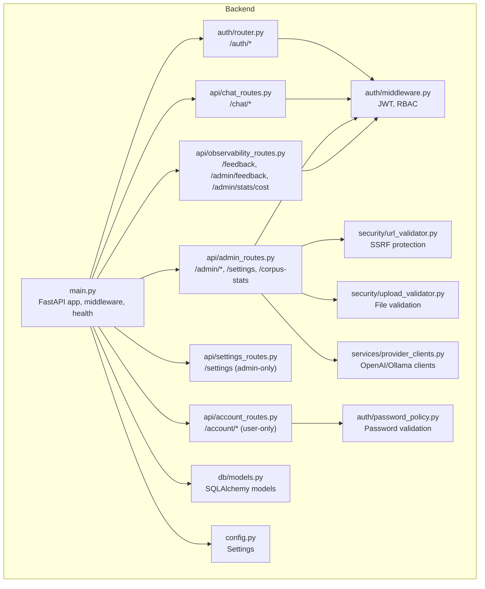
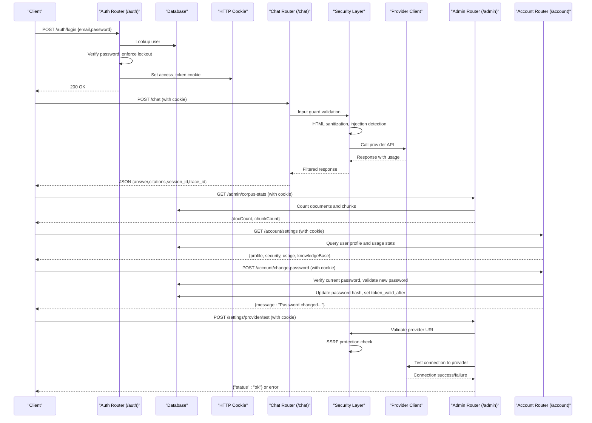
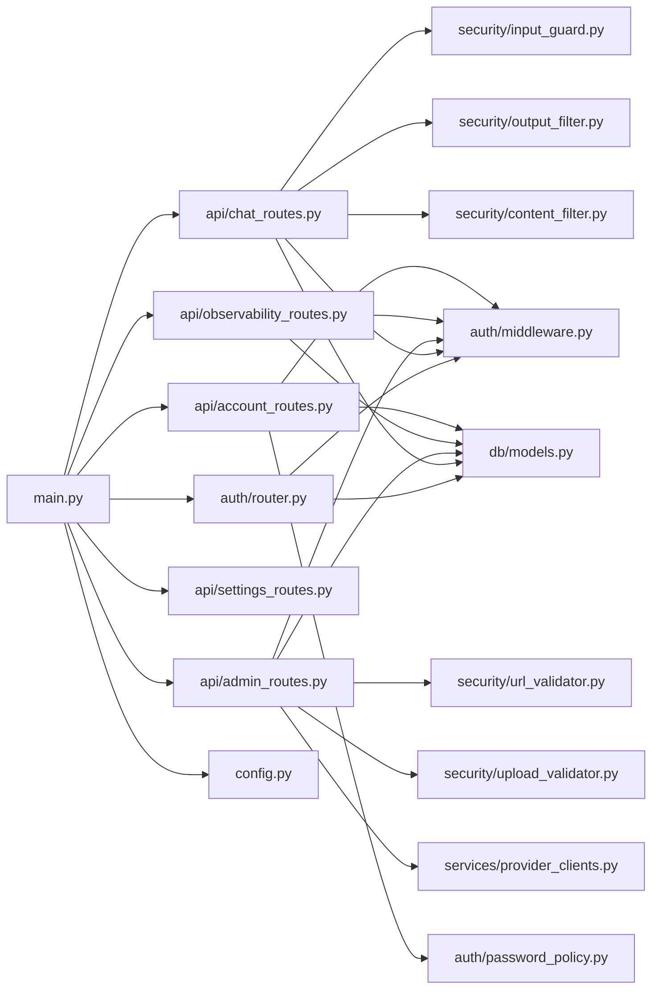

# API Endpoints

<cite>
**Referenced Files in This Document**
- [main.py](file://safe4ai-pilot/app/main.py)
- [auth.py](file://safe4ai-pilot/app/auth/router.py)
- [middleware.py](file://safe4ai-pilot/app/auth/middleware.py)
- [chat_routes.py](file://safe4ai-pilot/app/api/chat_routes.py)
- [admin_routes.py](file://safe4ai-pilot/app/api/admin_routes.py)
- [observability_routes.py](file://safe4ai-pilot/app/api/observability_routes.py)
- [settings_routes.py](file://safe4ai-pilot/app/api/settings_routes.py)
- [account_routes.py](file://safe4ai-pilot/app/api/account_routes.py)
- [models.py](file://safe4ai-pilot/app/models.py)
- [db/models.py](file://safe4ai-pilot/app/db/models.py)
- [config.py](file://safe4ai-pilot/app/config.py)
- [password_policy.py](file://safe4ai-pilot/app/auth/password_policy.py)
- [frontend/auth.ts](file://safe4ai-pilot/frontend/src/api/auth.ts)
- [frontend/chat.ts](file://safe4ai-pilot/frontend/src/api/chat.ts)
- [frontend/client.ts](file://safe4ai-pilot/frontend/src/api/client.ts)
- [frontend/settings.ts](file://safe4ai-pilot/frontend/src/api/settings.ts)
- [frontend/account.ts](file://safe4ai-pilot/frontend/src/api/account.ts)
- [cost_tracker.py](file://safe4ai-pilot/observability/cost_tracker.py)
- [feedback.py](file://safe4ai-pilot/observability/feedback.py)
- [url_validator.py](file://safe4ai-pilot/app/security/url_validator.py)
- [upload_validator.py](file://safe4ai-pilot/app/security/upload_validator.py)
- [input_guard.py](file://safe4ai-pilot/app/security/input_guard.py)
- [output_filter.py](file://safe4ai-pilot/app/security/output_filter.py)
- [content_filter.py](file://safe4ai-pilot/app/security/content_filter.py)
- [provider_clients.py](file://safe4ai-pilot/app/services/provider_clients.py)
- [test_security_audit.py](file://safe4ai-pilot/tests/test_security_audit.py)
- [test_admin.py](file://safe4ai-pilot/tests/test_admin.py)
- [test_account.py](file://safe4ai-pilot/tests/test_account.py)
</cite>

## Update Summary
**Changes Made**
- Added comprehensive user account settings API endpoints including GET /account/settings for retrieving user account information and POST /account/change-password for password modification
- Integrated account router into main application with proper dependency injection
- Updated authentication and authorization documentation to reflect new user-facing functionality
- Enhanced API reference to include comprehensive user account management functionality alongside existing admin-only settings
- Added password policy enforcement and SSO compatibility features
- Separated user account management endpoints from admin settings endpoints with distinct authentication requirements

## Table of Contents
1. [Introduction](#introduction)
2. [Project Structure](#project-structure)
3. [Core Components](#core-components)
4. [Architecture Overview](#architecture-overview)
5. [Detailed Component Analysis](#detailed-component-analysis)
6. [Dependency Analysis](#dependency-analysis)
7. [Performance Considerations](#performance-considerations)
8. [Troubleshooting Guide](#troubleshooting-guide)
9. [Conclusion](#conclusion)
10. [Appendices](#appendices)

## Introduction
This document provides comprehensive API documentation for the FastAPI backend serving the Safe4AI Pilot application. It covers authentication endpoints, chat endpoints (blocking and streaming), administrative endpoints for document and user management, audit and statistics, observability endpoints for feedback and cost tracking, security endpoints for provider configuration and validation, and newly added user account management endpoints for profile management and password changes. It also documents request/response schemas, error handling patterns, status codes, authentication methods, rate limiting, security considerations, and CORS policies. Practical examples and client integration patterns are included for developers building clients against these APIs.

## Project Structure
The API is organized into routers grouped by functional domains:
- Authentication: login, logout, and current user info
- Chat: message submission and streaming responses
- Administration: document management, user management, audit logs, stats, human review queue, settings, and corpus statistics
- Observability: feedback submission and admin feedback listing, plus cost statistics
- Security: provider URL validation, connection testing, and content filtering
- User Account Management: profile settings, password changes, and usage statistics
- Health and security: health check endpoint, CORS, secure headers, and request body size limits

**Diagram sources**
- [main.py:63-101](file://safe4ai-pilot/app/main.py#L63-L101)
- [auth.py:24-124](file://safe4ai-pilot/app/auth/router.py#L24-L124)
- [chat_routes.py:28-244](file://safe4ai-pilot/app/api/chat_routes.py#L28-L244)
- [admin_routes.py:39-539](file://safe4ai-pilot/app/api/admin_routes.py#L39-L539)
- [observability_routes.py:16-56](file://safe4ai-pilot/app/api/observability_routes.py#L16-L56)
- [settings_routes.py](file://safe4ai-pilot/app/api/settings_routes.py)
- [middleware.py:51-82](file://safe4ai-pilot/app/auth/middleware.py#L51-L82)
- [db/models.py:45-175](file://safe4ai-pilot/app/db/models.py#L45-L175)
- [config.py:5-28](file://safe4ai-pilot/app/config.py#L5-L28)
- [url_validator.py:26-56](file://safe4ai-pilot/app/security/url_validator.py#L26-L56)
- [upload_validator.py:24-73](file://safe4ai-pilot/app/security/upload_validator.py#L24-L73)
- [provider_clients.py:52-239](file://safe4ai-pilot/app/services/provider_clients.py#L52-L239)
- [account_routes.py:1-142](file://safe4ai-pilot/app/api/account_routes.py#L1-L142)
- [password_policy.py:1-18](file://safe4ai-pilot/app/auth/password_policy.py#L1-L18)

**Section sources**
- [main.py:63-101](file://safe4ai-pilot/app/main.py#L63-L101)
- [config.py:5-28](file://safe4ai-pilot/app/config.py#L5-L28)

## Core Components
- Authentication endpoints: login, logout, current user
- Chat endpoints: blocking POST /chat and streaming POST /chat/stream
- Administrative endpoints: document lifecycle, user management, audit logs, stats, human review queue, settings, and corpus statistics
- Observability endpoints: feedback submission and admin feedback listing, cost statistics
- Security endpoints: provider URL validation, connection testing, and content filtering
- User Account Management endpoints: profile settings, password changes, and usage statistics
- Health and security: health check, CORS, secure headers, request body size limits

**Section sources**
- [auth.py:39-124](file://safe4ai-pilot/app/auth/router.py#L39-L124)
- [chat_routes.py:109-244](file://safe4ai-pilot/app/api/chat_routes.py#L109-L244)
- [admin_routes.py:63-539](file://safe4ai-pilot/app/api/admin_routes.py#L63-L539)
- [observability_routes.py:26-56](file://safe4ai-pilot/app/api/observability_routes.py#L26-L56)
- [main.py:118-147](file://safe4ai-pilot/app/main.py#L118-L147)

## Architecture Overview
The FastAPI application initializes middleware, builds the AI graph once during startup, and exposes routers for auth, chat, admin, observability, settings, and account management. Authentication relies on cookies carrying signed JWTs. Rate limiting is enforced via SlowAPI. CORS and secure headers are configured globally. The system now includes comprehensive security measures including SSRF protection, input validation, output filtering, and content filtering for document chunks. User account management operates independently from admin settings with separate authentication requirements.

**Diagram sources**
- [auth.py:39-124](file://safe4ai-pilot/app/auth/router.py#L39-L124)
- [chat_routes.py:109-244](file://safe4ai-pilot/app/api/chat_routes.py#L109-L244)
- [admin_routes.py:117-175](file://safe4ai-pilot/app/api/admin_routes.py#L117-L175)
- [url_validator.py:26-56](file://safe4ai-pilot/app/security/url_validator.py#L26-L56)
- [provider_clients.py:52-239](file://safe4ai-pilot/app/services/provider_clients.py#L52-L239)
- [account_routes.py:33-141](file://safe4ai-pilot/app/api/account_routes.py#L33-L141)

## Detailed Component Analysis

### Authentication Endpoints
- Base path: /auth
- Authentication method: HTTP-only cookie named access_token
- Rate limiting: module-level limiter applied to login
- Security: bcrypt password hashing, JWT HS256 with 8-hour expiry, enforced HTTPS for cookie secure flag, CSRF-safe SameSite strict, brute-force lockout threshold

Endpoints:
- POST /auth/login
  - Request: { email, password }
  - Response: 200 OK with JSON { message: "logged in" }, sets access_token cookie
  - Status codes: 200, 401 Unauthorized (invalid credentials), 429 Too Many Requests (locked), 413 Payload Too Large (via global middleware)
  - Notes: Password minimum length enforced server-side; failed attempts increment counters and may lock the account

- POST /auth/logout
  - Response: 200 OK with JSON { message: "logged out" }, clears access_token cookie
  - Status codes: 200

- GET /me
  - Response: { id, email, role, is_active }
  - Status codes: 200, 401 Unauthorized (not authenticated)

Request/response schemas:
- LoginRequest: { email: string, password: string }
- Me: { id: string, email: string, role: "admin" | "pilot_user", is_active: boolean }

Security and rate limiting:
- Login rate limit: 5/minute
- Global body size limit: controlled by settings.max_upload_size_mb
- CORS: configured origins, credentials, and headers
- Secure headers: applied via middleware

**Section sources**
- [auth.py:39-124](file://safe4ai-pilot/app/auth/router.py#L39-L124)
- [middleware.py:51-82](file://safe4ai-pilot/app/auth/middleware.py#L51-L82)
- [main.py:69-95](file://safe4ai-pilot/app/main.py#L69-L95)
- [config.py:18](file://safe4ai-pilot/app/config.py#L18)

### Chat Endpoints
- Base path: /chat
- Authentication: requires access_token cookie
- Rate limiting: 30/minute per endpoint
- Streaming: SSE with step transitions and token streaming

Endpoints:
- POST /chat
  - Request: { question: string, session_id?: string, collection?: string }
  - Response: JSON { answer: string, citations: Citation[], session_id: string, trace_id: string, cache_hit?: boolean }
  - Status codes: 200, 401 Unauthorized, 422 Unprocessable Entity (empty question), 503 Service Unavailable (pipeline not ready), 500 Internal Server Error (pipeline error)
  - Notes: Creates or loads a session, invokes the AI graph with input guard validation, saves assistant reply

- POST /chat/stream
  - Request: { question: string, session_id?: string, collection?: string }
  - Response: text/event-stream with events:
    - step: { name: "embed"|"retrieve"|"rerank"|"generate", state: "active"|"done", t: number }
    - token: { delta: string } (word-by-word tokens)
    - cite: { id: string, file: string, page: number, score: number }
    - done: { traceId: string, latencyMs: number, cache: boolean, model: string, kRetrieved: number, sessionId: string, error?: string }
  - Status codes: 200, 401 Unauthorized, 422 Unprocessable Entity (empty question), 503 Service Unavailable (pipeline not ready), 500 Internal Server Error (pipeline error)
  - Notes: Streams LangGraph node transitions and answer tokens with output filtering; saves assistant reply after completion

Request/response schemas:
- ChatRequest: { question: string, session_id?: string, collection?: string }
- ChatResponse: { answer: string, citations: Citation[], session_id: string, trace_id: string, cache_hit?: boolean }
- Citation: { filename: string, page_number: number, excerpt: string, score: number }

Security enhancements:
- Input validation: HTML entity decoding, Unicode normalization, HTML tag stripping, injection pattern detection
- Output filtering: PII detection, suspicious length warnings, content filtering for hallucinations

Client integration patterns:
- Frontend client uses fetch with credentials: include and Content-Type: application/json
- Streaming client parses SSE events and handles errors gracefully

**Section sources**
- [chat_routes.py:109-244](file://safe4ai-pilot/app/api/chat_routes.py#L109-L244)
- [models.py:49-95](file://safe4ai-pilot/app/models.py#L49-L95)
- [frontend/chat.ts:21-76](file://safe4ai-pilot/frontend/src/api/chat.ts#L21-L76)
- [frontend/client.ts:3-15](file://safe4ai-pilot/frontend/src/api/client.ts#L3-L15)
- [input_guard.py:26-48](file://safe4ai-pilot/app/security/input_guard.py#L26-L48)
- [output_filter.py:30-60](file://safe4ai-pilot/app/security/output_filter.py#L30-L60)

### User Account Management Endpoints
- Base path: /account
- Authentication: requires access_token cookie (get_current_user, not require_role)
- Rate limiting: per endpoint (varies by operation)
- Purpose: Provide user-facing functionality for profile management, password changes, and usage statistics

Endpoints:
- GET /account/settings
  - Response: Comprehensive account settings including profile, security, usage, and knowledge base statistics
  - Status codes: 200, 401 Unauthorized (not authenticated)
  - Notes: Returns only current-user data, filters usage statistics by current user ID, excludes sensitive admin-only information

- POST /account/change-password
  - Request: { currentPassword: string, newPassword: string }
  - Response: { message: "Password changed. Please sign in again with your new password." }
  - Status codes: 200, 401 Unauthorized (incorrect current password), 422 Unprocessable Entity (weak/new password validation), 403 Forbidden (SSO-only mode)
  - Notes: Validates current password, enforces password strength requirements, updates password hash, sets token_valid_after for immediate logout

Request/response schemas:
- ChangePasswordRequest: { currentPassword: string, newPassword: string }
- AccountSettingsResponse: {
  - profile: { id: string, email: string, role: string, isActive: boolean, createdAt: string|null }
  - security: { sessionHours: number, ssoOnly: boolean, passwordChangeAllowed: boolean }
  - usage: { questions7d: number, questions30d: number, lastActivityAt: string|null, feedbackPositive: number, feedbackNegative: number }
  - knowledgeBase: { docCount: number, chunkCount: number, failedCount: number, inProgressCount: number }
}

Security and validation:
- Password strength: minimum 12 characters with uppercase, lowercase, digit, and special character
- SSO compatibility: password changes disabled when SSO-only mode is enabled
- Token invalidation: updates token_valid_after to force immediate re-authentication

**Updated** Added comprehensive user account management functionality with independent authentication from admin settings

**Section sources**
- [account_routes.py:33-141](file://safe4ai-pilot/app/api/account_routes.py#L33-L141)
- [password_policy.py:6-17](file://safe4ai-pilot/app/auth/password_policy.py#L6-L17)
- [test_account.py:87-255](file://safe4ai-pilot/tests/test_account.py#L87-L255)

### Administrative Endpoints
- Base path: /admin
- Authentication: requires admin role via require_role("admin")
- Rate limiting: per endpoint (various limits)
- Document management:
  - POST /admin/documents/upload: uploads file with validation, persists metadata, triggers background ingestion
  - GET /admin/documents: lists documents with chunk counts
  - GET /admin/documents/{doc_id}/status: polls ingestion status
  - DELETE /admin/documents/{doc_id}: deletes document and associated data
  - POST /admin/documents/{doc_id}/reindex: re-triggers ingestion
- User management:
  - GET /admin/users: lists users with pagination
  - POST /admin/users: creates user (min password length, unique email)
  - DELETE /admin/users/{user_id}: deactivates user (cannot deactivate self)
- Audit logs:
  - GET /admin/audit-logs: paginated audit log entries
  - GET /admin/audit-logs/export.csv: CSV export of audit logs
- Stats:
  - GET /admin/stats: aggregate stats over N days
- Human review queue:
  - GET /admin/review-queue: lists items by status
  - POST /admin/review-queue/{item_id}/approve: approves item
  - POST /admin/review-queue/{item_id}/reject: rejects item
- Settings and configuration:
  - GET /settings: returns current application settings with provider configuration
  - PATCH /settings: updates mutable application settings with validation
  - POST /settings/provider/test: validates provider credentials with lightweight connectivity check
- Corpus statistics:
  - GET /admin/corpus-stats: lightweight document and chunk counts for UI

Enhanced security features:
- Provider URL validation: blocks SSRF attempts by rejecting private/reserved IP ranges
- File upload validation: enforces extension, MIME type, magic bytes, and file size limits
- Content filtering: removes PII-containing document chunks from retrieval

Request/response schemas:
- CreateUserRequest: { email: string, password: string, role?: UserRole }
- Document status response includes ingestion status and job info
- Audit log entries include user_id, session_id, timestamp, action_type, query_text, latency_ms, model_used, trace_id
- Review queue items include session_id, user_id, query, draft_answer, risk_reason, status, reviewed_by, reviewed_at
- Settings response includes provider configuration, available models, security settings, and cost controls

Error handling and status codes:
- 401 Unauthorized (not authenticated)
- 403 Forbidden (role requirement)
- 404 Not Found (resource missing)
- 409 Conflict (already exists, or inconsistent state)
- 413 Payload Too Large (global body size limit)
- 422 Unprocessable Entity (validation errors)
- 503 Service Unavailable (background service not ready)

**Section sources**
- [admin_routes.py:63-539](file://safe4ai-pilot/app/api/admin_routes.py#L63-L539)
- [db/models.py:45-175](file://safe4ai-pilot/app/db/models.py#L45-L175)
- [config.py:18](file://safe4ai-pilot/app/config.py#L18)
- [url_validator.py:26-56](file://safe4ai-pilot/app/security/url_validator.py#L26-L56)
- [upload_validator.py:24-73](file://safe4ai-pilot/app/security/upload_validator.py#L24-L73)
- [content_filter.py:24-63](file://safe4ai-pilot/app/security/content_filter.py#L24-L63)

### Security Endpoints
- Base path: /admin (provider validation endpoints)
- Authentication: requires admin role
- Provider URL validation:
  - POST /settings/provider/test: validates provider base URL against SSRF attacks
  - Validates URL scheme (http/https), hostname resolution, and blocks private/reserved IP ranges
  - Returns success for valid configurations or raises HTTPException(422) for invalid URLs
- Provider model listing:
  - Automatic fetching of available models from OpenAI-compatible providers
  - Cached for performance with 15-second TTL
  - Includes both Ollama and provider-specific model lists

Security validation features:
- SSRF protection: blocks private/reserved IP ranges including 10.0.0.0/8, 172.16.0.0/12, 192.168.0.0/16, 127.0.0.0/8, 169.254.0.0/16, 0.0.0.0/8, ::1/128, fc00::/7, fe80::/10
- Input guard: sanitizes user queries, detects injection patterns, validates length limits
- Output filter: checks generated answers for PII hallucinations and suspicious length
- Content filter: removes PII-containing document chunks from retrieval

**Section sources**
- [admin_routes.py:1163-1214](file://safe4ai-pilot/app/api/admin_routes.py#L1163-L1214)
- [url_validator.py:26-56](file://safe4ai-pilot/app/security/url_validator.py#L26-L56)
- [input_guard.py:26-48](file://safe4ai-pilot/app/security/input_guard.py#L26-L48)
- [output_filter.py:30-60](file://safe4ai-pilot/app/security/output_filter.py#L30-L60)
- [content_filter.py:24-63](file://safe4ai-pilot/app/security/content_filter.py#L24-L63)

### Observability Endpoints
- Base path: /feedback and /admin
- Authentication: user endpoints require access_token; admin endpoints require admin role
- Rate limiting: per endpoint

Endpoints:
- POST /feedback
  - Request: { session_id: string, trace_id: string, rating: "positive"|"negative", comment?: string }
  - Response: { id: string }
  - Status codes: 200, 401 Unauthorized, 422 Unprocessable Entity

- GET /admin/feedback
  - Response: list of feedback entries (admin only)
  - Status codes: 200, 401 Unauthorized, 403 Forbidden

- GET /admin/stats/cost
  - Query: days?: number (default 30)
  - Response: { total_cost_usd: number, runs_count: number, by_day: [{ date: string, cost_usd: number, runs: number }] }
  - Status codes: 200, 401 Unauthorized, 403 Forbidden

Request/response schemas:
- FeedbackRequest: { session_id: string, trace_id: string, rating: "positive"|"negative", comment?: string }

Cost tracking and feedback persistence:
- CostTracker calculates cost based on tokens and cost_per_1k_tokens setting
- FeedbackStore persists and retrieves feedback entries

**Section sources**
- [observability_routes.py:26-56](file://safe4ai-pilot/app/api/observability_routes.py#L26-L56)
- [cost_tracker.py:16-110](file://safe4ai-pilot/observability/cost_tracker.py#L16-L110)
- [feedback.py:16-71](file://safe4ai-pilot/observability/feedback.py#L16-L71)

### Health and Security Endpoints
- GET /health
  - Response: { status: "ok"|"degraded", checks: { postgres: string, qdrant: string, ollama: string } }
  - Status codes: 200

- Security and middleware:
  - CORS: allow_origins from settings.allowed_origins_list, credentials, methods, headers
  - Secure headers: applied to all responses
  - Body size limit: enforced via middleware using settings.max_upload_size_mb
  - Rate limiting: SlowAPI middleware registered with app.state.limiter

Security enhancements:
- CL/TE desync protection: rejects requests with both Content-Length and Transfer-Encoding headers
- Chat body size bypass prevention: validates chunked requests to /chat and /chat/stream
- CSRF protection: required for all unsafe methods
- Information masking: health endpoint hides sensitive details

**Section sources**
- [main.py:118-147](file://safe4ai-pilot/app/main.py#L118-L147)
- [main.py:69-95](file://safe4ai-pilot/app/main.py#L69-L95)
- [config.py:20-22](file://safe4ai-pilot/app/config.py#L20-L22)
- [test_security_audit.py:75-200](file://safe4ai-pilot/tests/test_security_audit.py#L75-L200)

## Dependency Analysis
Key dependencies and relationships:
- main.py wires routers, middleware, and settings
- auth router depends on middleware for JWT encoding/decoding and DB for user lookup
- chat routes depend on middleware for authentication and ConversationManager for session persistence
- admin routes depend on middleware for role enforcement, DB models for CRUD operations, and security validators for input validation
- observability routes depend on CostTracker and FeedbackStore for analytics and feedback persistence
- security modules provide URL validation, input guarding, output filtering, and content filtering
- account routes depend on middleware for user authentication and DB for profile/usage queries
- password policy module provides password validation logic
- All endpoints rely on SQLAlchemy sessions and Pydantic models for request/response validation

**Diagram sources**
- [main.py:63-101](file://safe4ai-pilot/app/main.py#L63-L101)
- [auth.py:24-124](file://safe4ai-pilot/app/auth/router.py#L24-L124)
- [chat_routes.py:28-244](file://safe4ai-pilot/app/api/chat_routes.py#L28-L244)
- [admin_routes.py:39-539](file://safe4ai-pilot/app/api/admin_routes.py#L39-L539)
- [observability_routes.py:16-56](file://safe4ai-pilot/app/api/observability_routes.py#L16-L56)
- [settings_routes.py](file://safe4ai-pilot/app/api/settings_routes.py)
- [middleware.py:51-82](file://safe4ai-pilot/app/auth/middleware.py#L51-L82)
- [db/models.py:45-175](file://safe4ai-pilot/app/db/models.py#L45-L175)
- [config.py:5-28](file://safe4ai-pilot/app/config.py#L5-L28)
- [url_validator.py:26-56](file://safe4ai-pilot/app/security/url_validator.py#L26-L56)
- [upload_validator.py:24-73](file://safe4ai-pilot/app/security/upload_validator.py#L24-L73)
- [input_guard.py:26-48](file://safe4ai-pilot/app/security/input_guard.py#L26-L48)
- [output_filter.py:30-60](file://safe4ai-pilot/app/security/output_filter.py#L30-L60)
- [content_filter.py:24-63](file://safe4ai-pilot/app/security/content_filter.py#L24-L63)
- [provider_clients.py:52-239](file://safe4ai-pilot/app/services/provider_clients.py#L52-L239)
- [account_routes.py:1-142](file://safe4ai-pilot/app/api/account_routes.py#L1-L142)
- [password_policy.py:1-18](file://safe4ai-pilot/app/auth/password_policy.py#L1-L18)

**Section sources**
- [main.py:63-101](file://safe4ai-pilot/app/main.py#L63-L101)
- [auth.py:24-124](file://safe4ai-pilot/app/auth/router.py#L24-L124)
- [chat_routes.py:28-244](file://safe4ai-pilot/app/api/chat_routes.py#L28-L244)
- [admin_routes.py:39-539](file://safe4ai-pilot/app/api/admin_routes.py#L39-L539)
- [observability_routes.py:16-56](file://safe4ai-pilot/app/api/observability_routes.py#L16-L56)
- [settings_routes.py](file://safe4ai-pilot/app/api/settings_routes.py)
- [middleware.py:51-82](file://safe4ai-pilot/app/auth/middleware.py#L51-L82)
- [db/models.py:45-175](file://safe4ai-pilot/app/db/models.py#L45-L175)
- [config.py:5-28](file://safe4ai-pilot/app/config.py#L5-L28)

## Performance Considerations
- Rate limiting: endpoints are rate-limited to protect resources; login uses a stricter limit
- Streaming: /chat/stream emits tokens and citations progressively to improve perceived latency
- Background tasks: document ingestion runs asynchronously to keep API responses fast
- Body size limits: enforced globally to prevent oversized payloads
- Pre-warming: Ollama model is warmed up on startup to reduce first-query latency
- Caching: settings live metadata cached for 15 seconds to reduce provider API calls
- Model listing: provider models fetched once and cached to avoid repeated network calls
- Account settings caching: 30-second cache for user profile and usage statistics

## Troubleshooting Guide
Common issues and resolutions:
- Authentication failures:
  - 401 Unauthorized: invalid or missing access_token cookie; ensure login was successful and cookies are sent
  - 429 Too Many Requests: login attempts exceeded lockout threshold; wait for lockout window
- Chat errors:
  - 503 Service Unavailable: AI pipeline not ready; retry after service initialization
  - 500 Internal Server Error: pipeline invocation failed; check backend logs
  - 422 Unprocessable Entity: input validation failed; check query formatting and length limits
- Document ingestion:
  - 404 Not Found: document ID not found; verify ID correctness
  - 409 Conflict: raw file missing for reindex; re-upload the original file
  - 400 Bad Request: file validation failed; check file extension, MIME type, and size limits
- Provider configuration:
  - 422 Unprocessable Entity: invalid provider URL or API key; check SSRF protection and credentials
  - 503 Service Unavailable: provider connection failed; verify network connectivity and endpoint accessibility
- Account management:
  - 403 Forbidden: password changes disabled when SSO-only mode is enabled
  - 422 Unprocessable Entity: new password fails strength validation; minimum 12 characters with mixed case, digit, and special character
  - 401 Unauthorized: incorrect current password; verify credential accuracy
- Rate limiting:
  - Exceeding limits results in 429; reduce request frequency or adjust limits
- CORS and cookies:
  - Ensure frontend sets credentials: include and correct origin matches allowed_origins

**Section sources**
- [auth.py:39-124](file://safe4ai-pilot/app/auth/router.py#L39-L124)
- [chat_routes.py:109-244](file://safe4ai-pilot/app/api/chat_routes.py#L109-L244)
- [admin_routes.py:63-539](file://safe4ai-pilot/app/api/admin_routes.py#L63-L539)
- [test_account.py:153-255](file://safe4ai-pilot/tests/test_account.py#L153-L255)
- [main.py:69-95](file://safe4ai-pilot/app/main.py#L69-L95)

## Conclusion
The API provides a comprehensive set of endpoints for authentication, chat, administration, observability, security, and user account management, with robust security measures including SSRF protection, input validation, output filtering, and content filtering. The enhanced functionality now includes independent user account management endpoints (/account/settings and /account/change-password) that operate separately from admin-only settings. Users can manage their profiles, change passwords with strong validation, and view their usage statistics, while administrators retain full control over system configuration and document management. Clients should integrate with the provided schemas and handle SSE events for streaming chat. The security endpoints ensure safe provider integration while maintaining system integrity across both user-facing and administrative interfaces.

## Appendices

### API Reference Summary

- Authentication
  - POST /auth/login
    - Request: { email, password }
    - Response: 200 OK, sets access_token cookie
    - Status codes: 200, 401, 429, 413
  - POST /auth/logout
    - Response: 200 OK, clears access_token cookie
    - Status codes: 200
  - GET /me
    - Response: { id, email, role, is_active }
    - Status codes: 200, 401

- Chat
  - POST /chat
    - Request: { question, session_id?, collection? }
    - Response: { answer, citations, session_id, trace_id, cache_hit? }
    - Status codes: 200, 401, 422, 503, 500
  - POST /chat/stream
    - Response: SSE events (step, token, cite, done)
    - Status codes: 200, 401, 422, 503, 500

- Account Management
  - GET /account/settings
    - Response: { profile, security, usage, knowledgeBase }
    - Status codes: 200, 401
  - POST /account/change-password
    - Request: { currentPassword, newPassword }
    - Response: { message: "Password changed. Please sign in again with your new password." }
    - Status codes: 200, 401, 422, 403

- Admin
  - POST /admin/documents/upload
    - Request: multipart/form-data (file)
    - Response: { doc_id, job_id }
    - Status codes: 201, 400, 401, 403, 413
  - GET /admin/documents
    - Response: list of documents
    - Status codes: 200, 401, 403
  - GET /admin/documents/{doc_id}/status
    - Response: { doc_id, ingestion_status, job_status, job_error, ingestion_started_at }
    - Status codes: 200, 401, 403, 404
  - DELETE /admin/documents/{doc_id}
    - Response: 204 No Content
    - Status codes: 204, 401, 403, 404
  - POST /admin/documents/{doc_id}/reindex
    - Response: { job_id }
    - Status codes: 202, 401, 403, 404, 409
  - GET /admin/users
    - Response: list of users
    - Status codes: 200, 401, 403
  - POST /admin/users
    - Request: { email, password, role? }
    - Response: { id }
    - Status codes: 201, 400, 401, 403, 409, 422
  - DELETE /admin/users/{user_id}
    - Response: 204 No Content
    - Status codes: 204, 401, 403, 404, 400
  - GET /admin/audit-logs
    - Response: list of audit logs
    - Status codes: 200, 401, 403
  - GET /admin/audit-logs/export.csv
    - Response: CSV file
    - Status codes: 200, 401, 403
  - GET /admin/stats
    - Response: { days, total_queries, avg_latency_ms, total_cost_usd, cache_total_hits, unique_users, generated_at }
    - Status codes: 200, 401, 403
  - GET /admin/review-queue
    - Response: list of review queue items
    - Status codes: 200, 401, 403
  - POST /admin/review-queue/{item_id}/approve
    - Response: { status: "approved" }
    - Status codes: 200, 401, 403, 404, 409
  - POST /admin/review-queue/{item_id}/reject
    - Response: { status: "rejected" }
    - Status codes: 200, 401, 403, 404, 409
  - GET /admin/corpus-stats
    - Response: { docCount: int, chunkCount: int }
    - Status codes: 200, 401

- Settings
  - GET /settings
    - Response: comprehensive settings including provider configuration, available models, security settings
    - Status codes: 200, 401, 403
  - PATCH /settings
    - Request: partial settings update with validation
    - Response: updated settings payload
    - Status codes: 200, 400, 401, 403, 422
  - POST /settings/provider/test
    - Request: provider configuration for validation
    - Response: { status: "ok" } or error
    - Status codes: 200, 401, 403, 422, 503

- Observability
  - POST /feedback
    - Request: { session_id, trace_id, rating, comment? }
    - Response: { id }
    - Status codes: 200, 401, 422
  - GET /admin/feedback
    - Response: list of feedback entries
    - Status codes: 200, 401, 403
  - GET /admin/stats/cost
    - Response: { total_cost_usd, runs_count, by_day }
    - Status codes: 200, 401, 403

- Health and Security
  - GET /health
    - Response: { status, checks }
    - Status codes: 200
  - Security validation endpoints:
    - POST /settings/provider/test: provider URL validation and connectivity test
    - Input guard: query sanitization and injection detection
    - Output filter: PII detection and content filtering
  - CORS: configured via settings.allowed_origins_list
  - Secure headers: applied to all responses
  - Body size limit: enforced via middleware

**Section sources**
- [auth.py:39-124](file://safe4ai-pilot/app/auth/router.py#L39-L124)
- [chat_routes.py:109-244](file://safe4ai-pilot/app/api/chat_routes.py#L109-L244)
- [admin_routes.py:63-539](file://safe4ai-pilot/app/api/admin_routes.py#L63-L539)
- [observability_routes.py:26-56](file://safe4ai-pilot/app/api/observability_routes.py#L26-L56)
- [main.py:118-147](file://safe4ai-pilot/app/main.py#L118-L147)
- [url_validator.py:26-56](file://safe4ai-pilot/app/security/url_validator.py#L26-L56)
- [input_guard.py:26-48](file://safe4ai-pilot/app/security/input_guard.py#L26-L48)
- [output_filter.py:30-60](file://safe4ai-pilot/app/security/output_filter.py#L30-L60)
- [content_filter.py:24-63](file://safe4ai-pilot/app/security/content_filter.py#L24-L63)
- [test_account.py:87-255](file://safe4ai-pilot/tests/test_account.py#L87-L255)

### Client Implementation Guidelines
- Use the provided frontend API modules as references:
  - Authentication: [frontend/auth.ts](file://safe4ai-pilot/frontend/src/api/auth.ts)
  - Chat streaming: [frontend/chat.ts](file://safe4ai-pilot/frontend/src/api/chat.ts)
  - Generic client: [frontend/client.ts](file://safe4ai-pilot/frontend/src/api/client.ts)
  - Account management: [frontend/settings.ts](file://safe4ai-pilot/frontend/src/api/settings.ts)
  - Account endpoints: [frontend/account.ts](file://safe4ai-pilot/frontend/src/api/account.ts)
- Ensure credentials: include and Content-Type: application/json for all authenticated requests
- For streaming, parse SSE events and handle errors gracefully
- Respect rate limits and implement retries with exponential backoff
- Implement security validation for provider configurations before deployment
- Handle corpus statistics for UI optimization and user experience
- For account management, implement proper password validation and error handling

**Section sources**
- [frontend/auth.ts:10-16](file://safe4ai-pilot/frontend/src/api/auth.ts#L10-L16)
- [frontend/chat.ts:21-76](file://safe4ai-pilot/frontend/src/api/chat.ts#L21-L76)
- [frontend/client.ts:3-15](file://safe4ai-pilot/frontend/src/api/client.ts#L3-L15)
- [frontend/settings.ts:90-103](file://safe4ai-pilot/frontend/src/api/settings.ts#L90-L103)
- [frontend/account.ts:36-43](file://safe4ai-pilot/frontend/src/api/account.ts#L36-L43)
- [test_account.py:87-255](file://safe4ai-pilot/tests/test_account.py#L87-L255)

### Security and CORS Policies
- Authentication: JWT in HTTP-only cookie with SameSite strict and secure flag based on settings.enforce_https
- Authorization: Role-based access control enforced via require_role("admin") for admin endpoints, user authentication (get_current_user) for account endpoints
- CORS: Origins from settings.allowed_origins_list, credentials allowed, limited methods and headers
- Secure headers: applied to all responses
- Body size limits: enforced via middleware using settings.max_upload_size_mb
- SSRF protection: provider URLs validated against private/reserved IP ranges
- Input validation: comprehensive sanitization and injection pattern detection
- Output filtering: PII detection and content quality assurance
- Content filtering: automatic removal of PII-containing document chunks
- Password security: minimum 12 characters with mixed case, digit, and special character requirements
- SSO compatibility: password changes disabled when SSO-only mode is enabled

**Section sources**
- [auth.py:96-103](file://safe4ai-pilot/app/auth/router.py#L96-L103)
- [middleware.py:74-82](file://safe4ai-pilot/app/auth/middleware.py#L74-L82)
- [main.py:69-75](file://safe4ai-pilot/app/main.py#L69-L75)
- [main.py:87-95](file://safe4ai-pilot/app/main.py#L87-L95)
- [config.py:20-22](file://safe4ai-pilot/app/config.py#L20-L22)
- [url_validator.py:26-56](file://safe4ai-pilot/app/security/url_validator.py#L26-L56)
- [input_guard.py:26-48](file://safe4ai-pilot/app/security/input_guard.py#L26-L48)
- [output_filter.py:30-60](file://safe4ai-pilot/app/security/output_filter.py#L30-L60)
- [content_filter.py:24-63](file://safe4ai-pilot/app/security/content_filter.py#L24-L63)
- [test_security_audit.py:75-200](file://safe4ai-pilot/tests/test_security_audit.py#L75-L200)
- [test_account.py:153-255](file://safe4ai-pilot/tests/test_account.py#L153-L255)