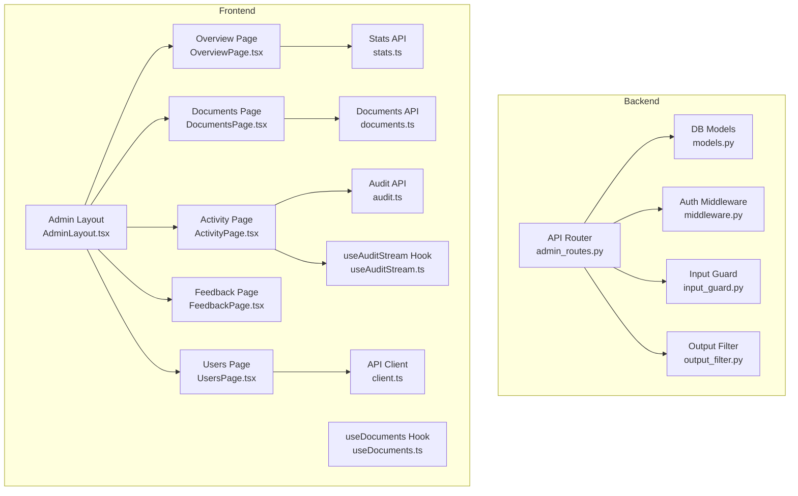
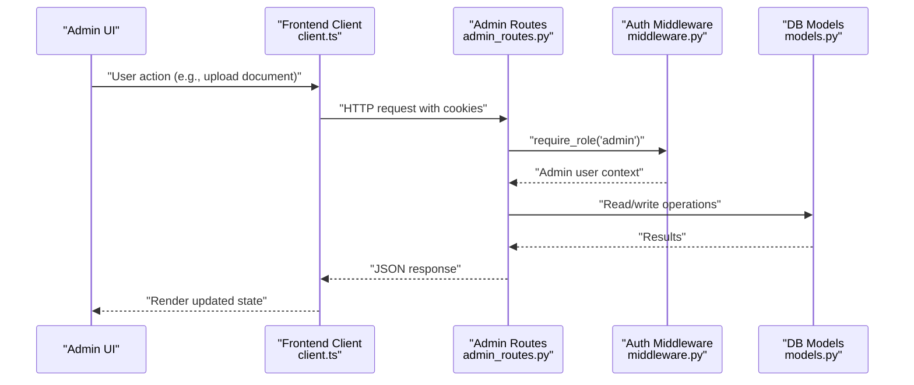
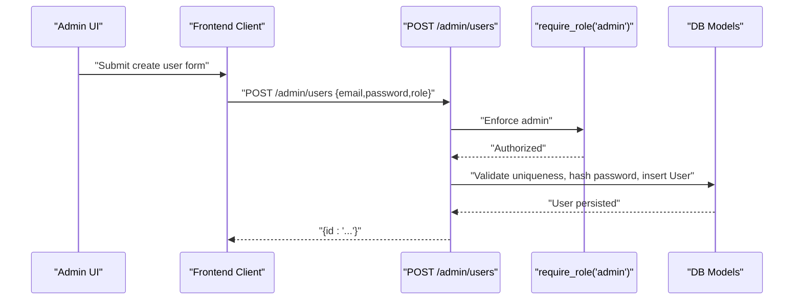
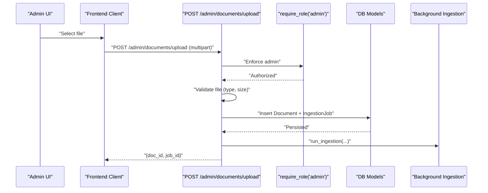
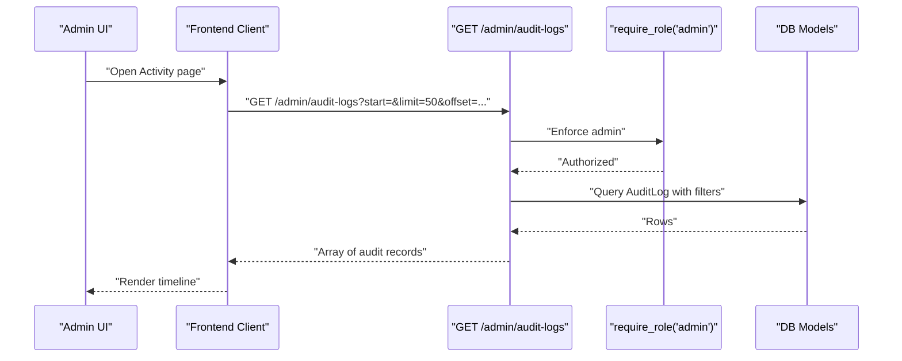
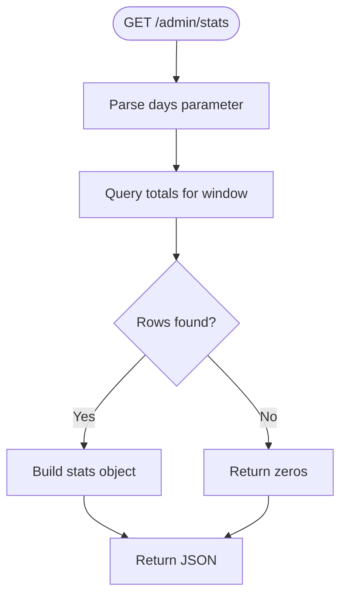
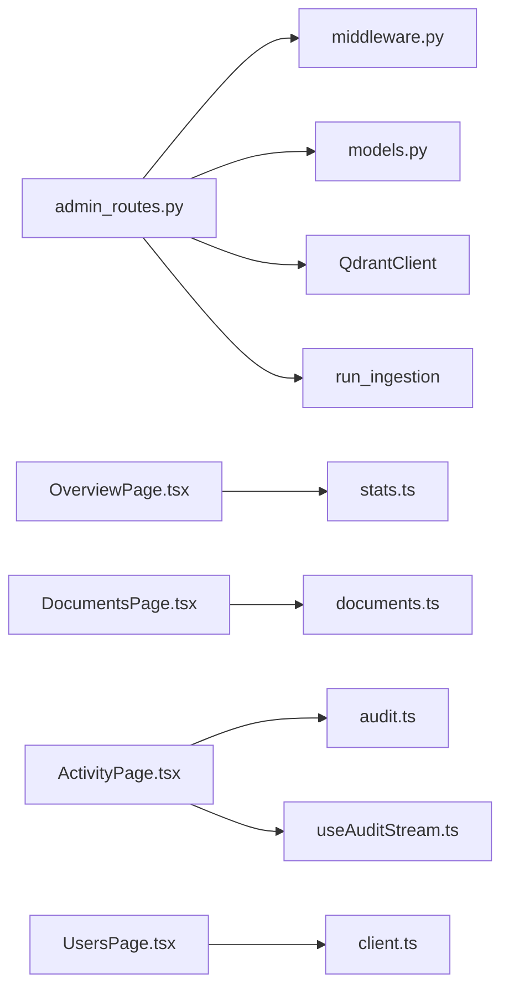
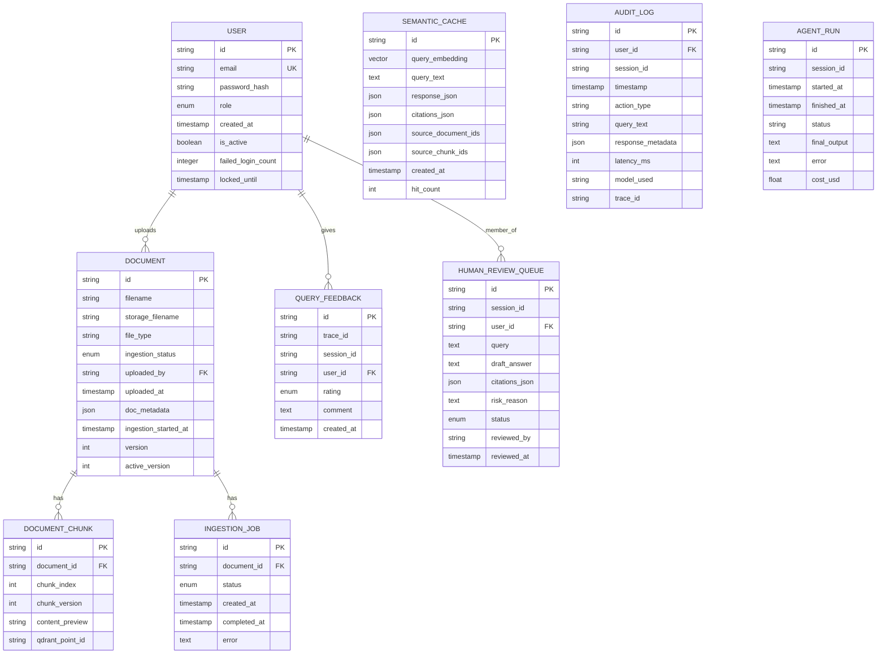

# Admin Endpoints

<cite>
**Referenced Files in This Document**
- [admin_routes.py](file://safe4ai-pilot/app/api/admin_routes.py)
- [models.py](file://safe4ai-pilot/app/db/models.py)
- [middleware.py](file://safe4ai-pilot/app/auth/middleware.py)
- [input_guard.py](file://safe4ai-pilot/app/security/input_guard.py)
- [output_filter.py](file://safe4ai-pilot/app/security/output_filter.py)
- [AdminLayout.tsx](file://safe4ai-pilot/frontend/src/pages/admin/AdminLayout.tsx)
- [OverviewPage.tsx](file://safe4ai-pilot/frontend/src/pages/admin/OverviewPage.tsx)
- [UsersPage.tsx](file://safe4ai-pilot/frontend/src/pages/admin/UsersPage.tsx)
- [DocumentsPage.tsx](file://safe4ai-pilot/frontend/src/pages/admin/DocumentsPage.tsx)
- [ActivityPage.tsx](file://safe4ai-pilot/frontend/src/pages/admin/ActivityPage.tsx)
- [FeedbackPage.tsx](file://safe4ai-pilot/frontend/src/pages/admin/FeedbackPage.tsx)
- [client.ts](file://safe4ai-pilot/frontend/src/api/client.ts)
- [audit.ts](file://safe4ai-pilot/frontend/src/api/audit.ts)
- [stats.ts](file://safe4ai-pilot/frontend/src/api/stats.ts)
- [useAuditStream.ts](file://safe4ai-pilot/frontend/src/hooks/useAuditStream.ts)
- [useDocuments.ts](file://safe4ai-pilot/frontend/src/hooks/useDocuments.ts)
- [documents.ts](file://safe4ai-pilot/frontend/src/api/documents.ts)
</cite>

## Table of Contents
1. [Introduction](#introduction)
2. [Project Structure](#project-structure)
3. [Core Components](#core-components)
4. [Architecture Overview](#architecture-overview)
5. [Detailed Component Analysis](#detailed-component-analysis)
6. [Dependency Analysis](#dependency-analysis)
7. [Performance Considerations](#performance-considerations)
8. [Troubleshooting Guide](#troubleshooting-guide)
9. [Conclusion](#conclusion)
10. [Appendices](#appendices)

## Introduction
This document provides comprehensive API documentation for administrative endpoints focused on user management, document oversight, and system monitoring. It covers admin routes for managing users, viewing audit logs, monitoring system performance, and overseeing document processing. It also details request/response schemas, permission requirements, data validation, administrative interface integration, data export capabilities, and reporting features. Guidance is included for implementing admin clients, performing bulk operations, and maintaining the system securely with audit trails.

## Project Structure
The administrative functionality spans backend routes, database models, authentication and authorization middleware, and a React-based admin UI. The backend exposes FastAPI routes under the “admin” tag. The frontend provides dedicated pages for overview, documents, activity, feedback, users, and settings, integrating with the backend APIs via typed fetch helpers.

**Diagram sources**
- [admin_routes.py:1-549](file://safe4ai-pilot/app/api/admin_routes.py#L1-L549)
- [models.py:1-182](file://safe4ai-pilot/app/db/models.py#L1-L182)
- [middleware.py:1-83](file://safe4ai-pilot/app/auth/middleware.py#L1-L83)
- [input_guard.py:1-49](file://safe4ai-pilot/app/security/input_guard.py#L1-L49)
- [output_filter.py:1-61](file://safe4ai-pilot/app/security/output_filter.py#L1-L61)
- [AdminLayout.tsx:1-106](file://safe4ai-pilot/frontend/src/pages/admin/AdminLayout.tsx#L1-L106)
- [OverviewPage.tsx:1-215](file://safe4ai-pilot/frontend/src/pages/admin/OverviewPage.tsx#L1-L215)
- [DocumentsPage.tsx:1-225](file://safe4ai-pilot/frontend/src/pages/admin/DocumentsPage.tsx#L1-L225)
- [ActivityPage.tsx:1-147](file://safe4ai-pilot/frontend/src/pages/admin/ActivityPage.tsx#L1-L147)
- [FeedbackPage.tsx:1-175](file://safe4ai-pilot/frontend/src/pages/admin/FeedbackPage.tsx#L1-L175)
- [client.ts:1-20](file://safe4ai-pilot/frontend/src/api/client.ts#L1-L20)
- [audit.ts:1-54](file://safe4ai-pilot/frontend/src/api/audit.ts#L1-L54)
- [stats.ts:1-31](file://safe4ai-pilot/frontend/src/api/stats.ts#L1-L31)
- [useAuditStream.ts:1-17](file://safe4ai-pilot/frontend/src/hooks/useAuditStream.ts#L1-L17)
- [useDocuments.ts:1-61](file://safe4ai-pilot/frontend/src/hooks/useDocuments.ts#L1-L61)
- [documents.ts:1-68](file://safe4ai-pilot/frontend/src/api/documents.ts#L1-L68)

**Section sources**
- [admin_routes.py:43-43](file://safe4ai-pilot/app/api/admin_routes.py#L43-L43)
- [client.ts:1-20](file://safe4ai-pilot/frontend/src/api/client.ts#L1-L20)

## Core Components
- Admin API Router: Defines all administrative endpoints grouped under the “admin” tag and protected by role-based access control.
- Database Models: Define entities for users, documents, ingestion jobs, audit logs, agent runs, semantic cache, and human review queue.
- Authentication and Authorization: JWT-based authentication with role checks enforcing admin-only access.
- Security Guards: Input guard for queries and output filter for LLM answers.
- Frontend Admin Pages: Overview dashboard, Documents management, Activity feed, Feedback inspection, Users administration, and Settings.

**Section sources**
- [admin_routes.py:43-549](file://safe4ai-pilot/app/api/admin_routes.py#L43-L549)
- [models.py:52-182](file://safe4ai-pilot/app/db/models.py#L52-L182)
- [middleware.py:74-83](file://safe4ai-pilot/app/auth/middleware.py#L74-L83)
- [input_guard.py:24-49](file://safe4ai-pilot/app/security/input_guard.py#L24-L49)
- [output_filter.py:31-61](file://safe4ai-pilot/app/security/output_filter.py#L31-L61)

## Architecture Overview
Administrative operations are exposed via FastAPI routes with strict permissions enforced by a role-check dependency. Requests are authenticated via cookies containing a signed JWT. Responses are structured consistently, with streaming responses for exports and paginated lists for audit logs. The frontend integrates with these endpoints using typed fetch wrappers and React Query for caching and polling.

**Diagram sources**
- [client.ts:3-15](file://safe4ai-pilot/frontend/src/api/client.ts#L3-L15)
- [admin_routes.py:67-120](file://safe4ai-pilot/app/api/admin_routes.py#L67-L120)
- [middleware.py:74-83](file://safe4ai-pilot/app/auth/middleware.py#L74-L83)
- [models.py:52-182](file://safe4ai-pilot/app/db/models.py#L52-L182)

## Detailed Component Analysis

### User Management Endpoints
- GET /admin/users
  - Purpose: List all users with role, activity status, and creation timestamp.
  - Permissions: admin required.
  - Response: Array of user records.
  - Rate limit: 100/minute.
  - Example request: curl -H "Cookie: access_token=..." https://host/admin/users
  - Example response: [{"id":"...","email":"admin@example.com","role":"admin","is_active":true,"created_at":"2024-01-01T00:00:00Z"}, ...]

- POST /admin/users
  - Purpose: Create a new user.
  - Permissions: admin required.
  - Request body: email, password, role (defaults to pilot_user).
  - Validation: Password minimum length enforced; email uniqueness enforced.
  - Response: {"id": "<user_id>"}
  - Rate limit: 100/minute.

- DELETE /admin/users/{user_id}
  - Purpose: Deactivate a user (cannot deactivate self).
  - Permissions: admin required.
  - Behavior: Sets is_active=false; prevents further access.
  - Response: 204 No Content.
  - Rate limit: 100/minute.

**Diagram sources**
- [admin_routes.py:317-336](file://safe4ai-pilot/app/api/admin_routes.py#L317-L336)
- [middleware.py:74-83](file://safe4ai-pilot/app/auth/middleware.py#L74-L83)
- [models.py:52-62](file://safe4ai-pilot/app/db/models.py#L52-L62)

**Section sources**
- [admin_routes.py:297-352](file://safe4ai-pilot/app/api/admin_routes.py#L297-L352)
- [models.py:52-62](file://safe4ai-pilot/app/db/models.py#L52-L62)

### Document Management Endpoints
- POST /admin/documents/upload
  - Purpose: Upload a document and enqueue ingestion.
  - Permissions: admin required.
  - Request: multipart/form-data with file; validated by UploadValidator and size limits.
  - Response: {"doc_id","job_id"}.
  - Side effects: Persists Document and IngestionJob; triggers background ingestion.

- GET /admin/documents
  - Purpose: List all documents with ingestion status and chunk counts.
  - Permissions: admin required.
  - Response: Array of document records.
  - Rate limit: 100/minute.

- GET /admin/documents/{doc_id}/status
  - Purpose: Poll ingestion progress for a specific document.
  - Permissions: admin required.
  - Response: {"doc_id","ingestion_status","job_status","job_error","ingestion_started_at"}.

- DELETE /admin/documents/{doc_id}
  - Purpose: Delete a document (filesystem, vector store, DB, cache).
  - Permissions: admin required.
  - Constraints: Cannot delete during active ingestion.
  - Side effects: Removes raw file, deletes Qdrant points, invalidates semantic cache entries.

- POST /admin/documents/{doc_id}/reindex
  - Purpose: Re-index an existing document.
  - Permissions: admin required.
  - Constraints: Requires raw file presence.
  - Response: {"job_id"}.

**Diagram sources**
- [admin_routes.py:67-120](file://safe4ai-pilot/app/api/admin_routes.py#L67-L120)
- [admin_routes.py:224-256](file://safe4ai-pilot/app/api/admin_routes.py#L224-L256)
- [models.py:75-101](file://safe4ai-pilot/app/db/models.py#L75-L101)

**Section sources**
- [admin_routes.py:67-256](file://safe4ai-pilot/app/api/admin_routes.py#L67-L256)
- [models.py:75-101](file://safe4ai-pilot/app/db/models.py#L75-L101)

### Audit Logs and Reporting
- GET /admin/audit-logs
  - Purpose: Paginated audit log listing with optional filters (start,end,user_id).
  - Permissions: admin required.
  - Response: Array of audit records with fields: id,user_id,session_id,timestamp,action_type,query_text,latency_ms,model_used,trace_id.
  - Rate limit: 100/minute.

- GET /admin/audit-logs/export.csv
  - Purpose: Export audit logs to CSV.
  - Permissions: admin required.
  - Response: StreamingResponse with CSV content-type and attachment filename.
  - Rate limit: 100/minute.

- Frontend integration:
  - ActivityPage renders a live-like stream using useAuditStream hook.
  - Filters support kind and time range.
  - Export button triggers CSV download.

**Diagram sources**
- [admin_routes.py:359-431](file://safe4ai-pilot/app/api/admin_routes.py#L359-L431)
- [audit.ts:34-50](file://safe4ai-pilot/frontend/src/api/audit.ts#L34-L50)
- [useAuditStream.ts:5-16](file://safe4ai-pilot/frontend/src/hooks/useAuditStream.ts#L5-L16)

**Section sources**
- [admin_routes.py:359-431](file://safe4ai-pilot/app/api/admin_routes.py#L359-L431)
- [audit.ts:1-54](file://safe4ai-pilot/frontend/src/api/audit.ts#L1-L54)
- [ActivityPage.tsx:32-51](file://safe4ai-pilot/frontend/src/pages/admin/ActivityPage.tsx#L32-L51)

### System Statistics and Monitoring
- GET /admin/stats
  - Purpose: Aggregate system metrics over a window (days).
  - Permissions: admin required.
  - Response fields: days,total_queries,avg_latency_ms,total_cost_usd,cache_total_hits.
  - Rate limit: 100/minute.

- Frontend integration:
  - OverviewPage fetches stats and displays charts and summaries.

**Diagram sources**
- [admin_routes.py:439-467](file://safe4ai-pilot/app/api/admin_routes.py#L439-L467)

**Section sources**
- [admin_routes.py:439-467](file://safe4ai-pilot/app/api/admin_routes.py#L439-L467)
- [stats.ts:20-30](file://safe4ai-pilot/frontend/src/api/stats.ts#L20-L30)
- [OverviewPage.tsx:44-67](file://safe4ai-pilot/frontend/src/pages/admin/OverviewPage.tsx#L44-L67)

### Human Review Queue
- GET /admin/review-queue
  - Purpose: List items in the queue by status.
  - Permissions: admin required.
  - Response: Array of review queue items.

- POST /admin/review-queue/{item_id}/approve
  - Purpose: Approve a pending item.
  - Permissions: admin required.
  - Response: {"status":"approved"}

- POST /admin/review-queue/{item_id}/reject
  - Purpose: Reject a pending item.
  - Permissions: admin required.
  - Response: {"status":"rejected"}

**Section sources**
- [admin_routes.py:475-538](file://safe4ai-pilot/app/api/admin_routes.py#L475-L538)
- [models.py:169-182](file://safe4ai-pilot/app/db/models.py#L169-L182)

### Administrative Interface Integration
- AdminLayout provides navigation to Overview, Documents, Activity, Feedback, Users, and Settings.
- OverviewPage displays system stats and notable items.
- DocumentsPage supports drag-and-drop upload, bulk reindex, and deletion with confirmation.
- ActivityPage shows a live-like audit timeline and export to CSV.
- FeedbackPage allows filtering and inspecting feedback items.
- UsersPage lists users and deactivates accounts.

**Section sources**
- [AdminLayout.tsx:12-19](file://safe4ai-pilot/frontend/src/pages/admin/AdminLayout.tsx#L12-L19)
- [OverviewPage.tsx:44-214](file://safe4ai-pilot/frontend/src/pages/admin/OverviewPage.tsx#L44-L214)
- [DocumentsPage.tsx:17-224](file://safe4ai-pilot/frontend/src/pages/admin/DocumentsPage.tsx#L17-L224)
- [ActivityPage.tsx:32-146](file://safe4ai-pilot/frontend/src/pages/admin/ActivityPage.tsx#L32-L146)
- [FeedbackPage.tsx:10-174](file://safe4ai-pilot/frontend/src/pages/admin/FeedbackPage.tsx#L10-L174)
- [UsersPage.tsx:22-120](file://safe4ai-pilot/frontend/src/pages/admin/UsersPage.tsx#L22-L120)

## Dependency Analysis
- Backend dependencies:
  - Router depends on SQLAlchemy models, Qdrant client, and ingestion service.
  - Access control enforced via require_role("admin").
  - Data export uses streaming response for CSV.

- Frontend dependencies:
  - Typed fetch wrapper ensures JSON parsing and error handling.
  - React Query manages caching, polling, and optimistic updates.
  - Hooks encapsulate document and audit workflows.

**Diagram sources**
- [admin_routes.py:11-42](file://safe4ai-pilot/app/api/admin_routes.py#L11-L42)
- [middleware.py:1-20](file://safe4ai-pilot/app/auth/middleware.py#L1-L20)
- [models.py:1-18](file://safe4ai-pilot/app/db/models.py#L1-L18)
- [OverviewPage.tsx:3-4](file://safe4ai-pilot/frontend/src/pages/admin/OverviewPage.tsx#L3-L4)
- [DocumentsPage.tsx:6-7](file://safe4ai-pilot/frontend/src/pages/admin/DocumentsPage.tsx#L6-L7)
- [ActivityPage.tsx:5-7](file://safe4ai-pilot/frontend/src/pages/admin/ActivityPage.tsx#L5-L7)
- [useAuditStream.ts:1-2](file://safe4ai-pilot/frontend/src/hooks/useAuditStream.ts#L1-L2)
- [UsersPage.tsx:7-8](file://safe4ai-pilot/frontend/src/pages/admin/UsersPage.tsx#L7-L8)
- [client.ts:3-7](file://safe4ai-pilot/frontend/src/api/client.ts#L3-L7)

**Section sources**
- [admin_routes.py:11-42](file://safe4ai-pilot/app/api/admin_routes.py#L11-L42)
- [client.ts:1-20](file://safe4ai-pilot/frontend/src/api/client.ts#L1-L20)

## Performance Considerations
- Rate limiting: Endpoints are rate-limited (e.g., 100/minute for listing and exports; 10/hour for uploads).
- Background ingestion: Document processing is offloaded to tasks to avoid blocking requests.
- Streaming responses: CSV export streams data to reduce memory overhead.
- Polling: Frontend polls for document status until completion, with capped retries and intervals.
- Caching: React Query caches responses and invalidates on mutations.

[No sources needed since this section provides general guidance]

## Troubleshooting Guide
- Authentication failures:
  - Symptom: 401 Not authenticated on admin endpoints.
  - Cause: Missing or invalid access_token cookie.
  - Resolution: Ensure login and cookie handling is configured.

- Authorization failures:
  - Symptom: 403 Forbidden on admin endpoints.
  - Cause: Non-admin role.
  - Resolution: Verify user role assignment.

- Upload errors:
  - Symptom: 413 Request body too large or 400 validation errors.
  - Cause: File size or type restrictions.
  - Resolution: Check settings.max_upload_size_mb and supported extensions.

- Deletion conflicts:
  - Symptom: 409 Conflict when deleting a document.
  - Cause: Active ingestion job.
  - Resolution: Wait for ingestion to complete or cancel job externally.

- Audit export limits:
  - Symptom: Truncated export.
  - Cause: Limit applied to exported rows.
  - Resolution: Use filters and download multiple slices.

**Section sources**
- [middleware.py:51-71](file://safe4ai-pilot/app/auth/middleware.py#L51-L71)
- [admin_routes.py:323-324](file://safe4ai-pilot/app/api/admin_routes.py#L323-L324)
- [admin_routes.py:269-269](file://safe4ai-pilot/app/api/admin_routes.py#L269-L269)
- [admin_routes.py:203-207](file://safe4ai-pilot/app/api/admin_routes.py#L203-L207)
- [admin_routes.py:399-409](file://safe4ai-pilot/app/api/admin_routes.py#L399-L409)

## Conclusion
The administrative endpoints provide a secure, auditable, and observable control plane for managing users, documents, and system metrics. Role-based access control, robust validation, and streaming exports enable efficient operations. The frontend pages integrate seamlessly with the backend APIs, offering real-time insights and operational controls suitable for pilot-scale deployments.

[No sources needed since this section summarizes without analyzing specific files]

## Appendices

### Endpoint Reference Summary
- User Management
  - GET /admin/users → 200 OK, array of users
  - POST /admin/users → 201 Created, {"id": "..."}
  - DELETE /admin/users/{user_id} → 204 No Content

- Document Management
  - POST /admin/documents/upload → 201 Created, {"doc_id","job_id"}
  - GET /admin/documents → 200 OK, array of documents
  - GET /admin/documents/{doc_id}/status → 200 OK, status object
  - DELETE /admin/documents/{doc_id} → 204 No Content
  - POST /admin/documents/{doc_id}/reindex → 202 Accepted, {"job_id"}

- Audit Logs
  - GET /admin/audit-logs → 200 OK, array of audit records
  - GET /admin/audit-logs/export.csv → 200 OK, CSV stream

- System Statistics
  - GET /admin/stats → 200 OK, stats object

- Human Review Queue
  - GET /admin/review-queue → 200 OK, array of items
  - POST /admin/review-queue/{item_id}/approve → 200 OK, {"status":"approved"}
  - POST /admin/review-queue/{item_id}/reject → 200 OK, {"status":"rejected"}

**Section sources**
- [admin_routes.py:297-538](file://safe4ai-pilot/app/api/admin_routes.py#L297-L538)

### Data Models Overview

**Diagram sources**
- [models.py:52-182](file://safe4ai-pilot/app/db/models.py#L52-L182)

### Security and Access Controls
- Authentication: JWT stored in a cookie; decoded and verified on each request.
- Authorization: require_role("admin") ensures only admins can access admin endpoints.
- Data validation: UploadValidator and size checks prevent oversized or unsupported files.
- Input guard and output filter: Additional safeguards for queries and answers.

**Section sources**
- [middleware.py:35-83](file://safe4ai-pilot/app/auth/middleware.py#L35-L83)
- [admin_routes.py:77-84](file://safe4ai-pilot/app/api/admin_routes.py#L77-L84)
- [input_guard.py:24-49](file://safe4ai-pilot/app/security/input_guard.py#L24-L49)
- [output_filter.py:31-61](file://safe4ai-pilot/app/security/output_filter.py#L31-L61)

### Frontend Client Utilities
- apiFetch: Unified fetch wrapper handling credentials, JSON parsing, and error propagation.
- apiUrl: Builds absolute URLs using VITE_API_URL.
- Hooks: useDocuments and useAuditStream encapsulate CRUD and polling logic.

**Section sources**
- [client.ts:3-19](file://safe4ai-pilot/frontend/src/api/client.ts#L3-L19)
- [useDocuments.ts:5-60](file://safe4ai-pilot/frontend/src/hooks/useDocuments.ts#L5-L60)
- [useAuditStream.ts:5-16](file://safe4ai-pilot/frontend/src/hooks/useAuditStream.ts#L5-L16)