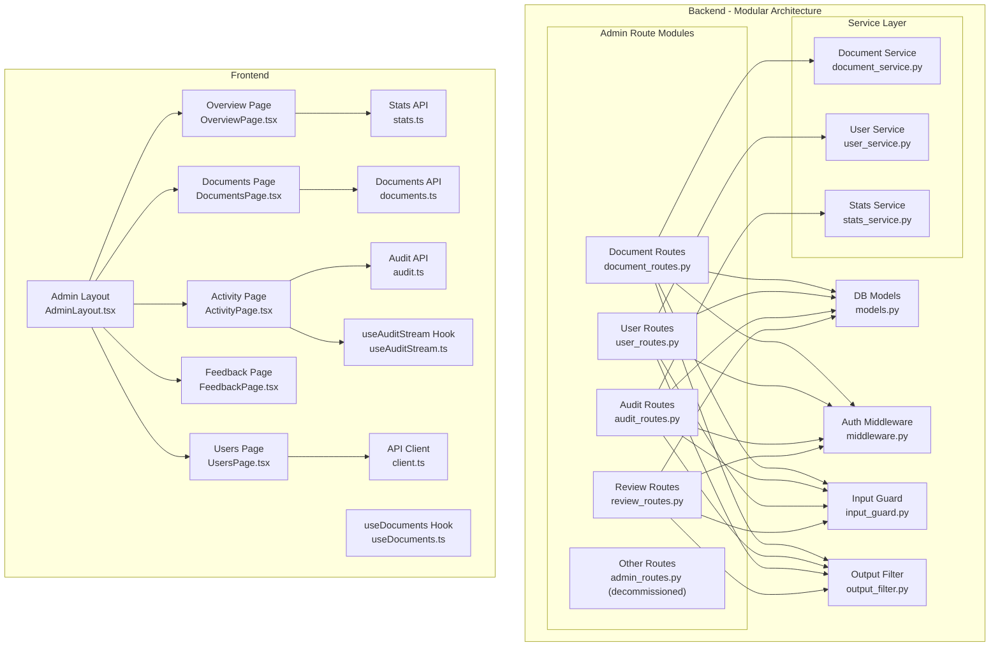
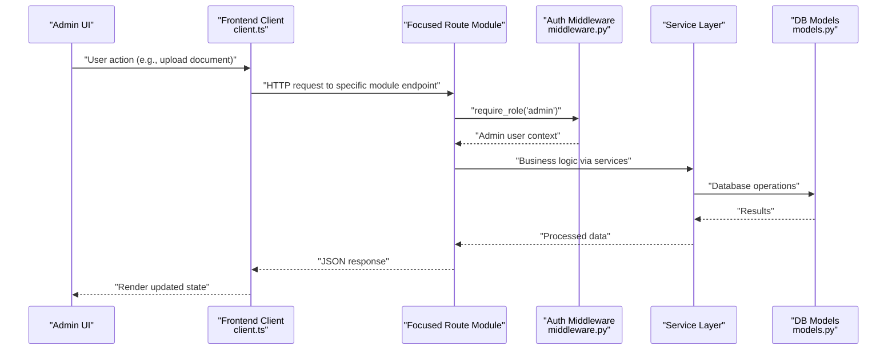
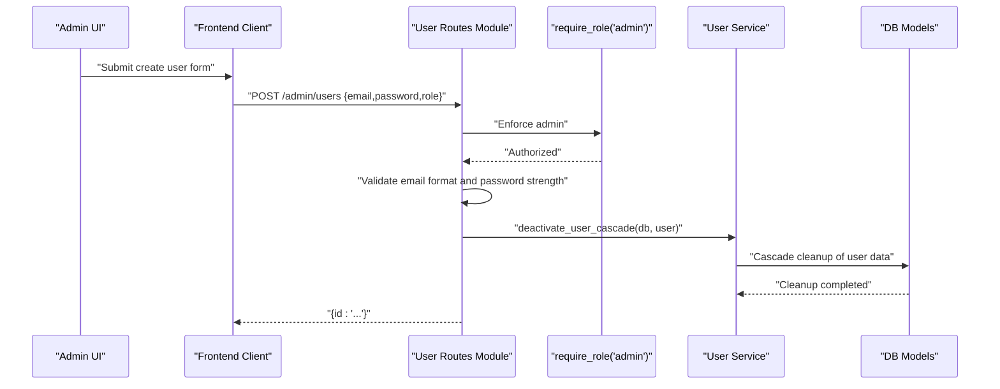
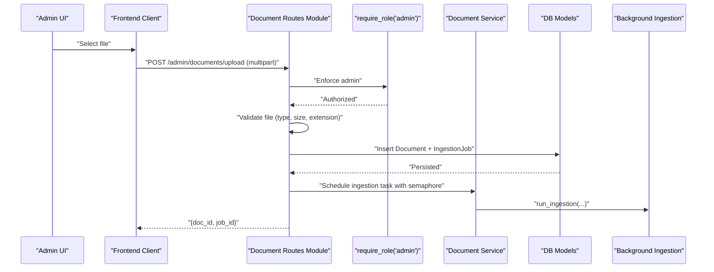
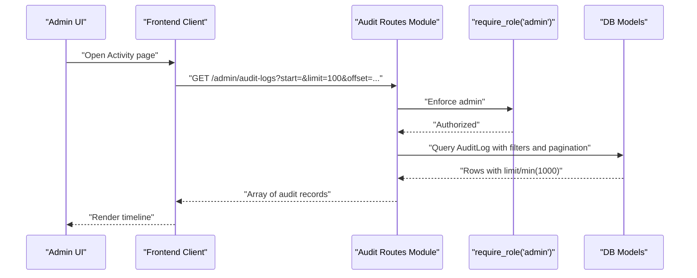
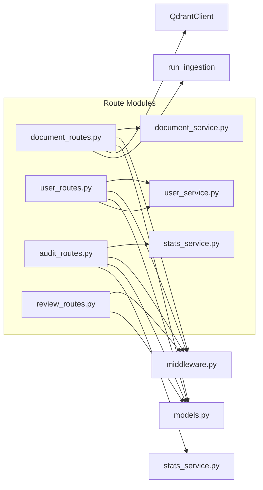
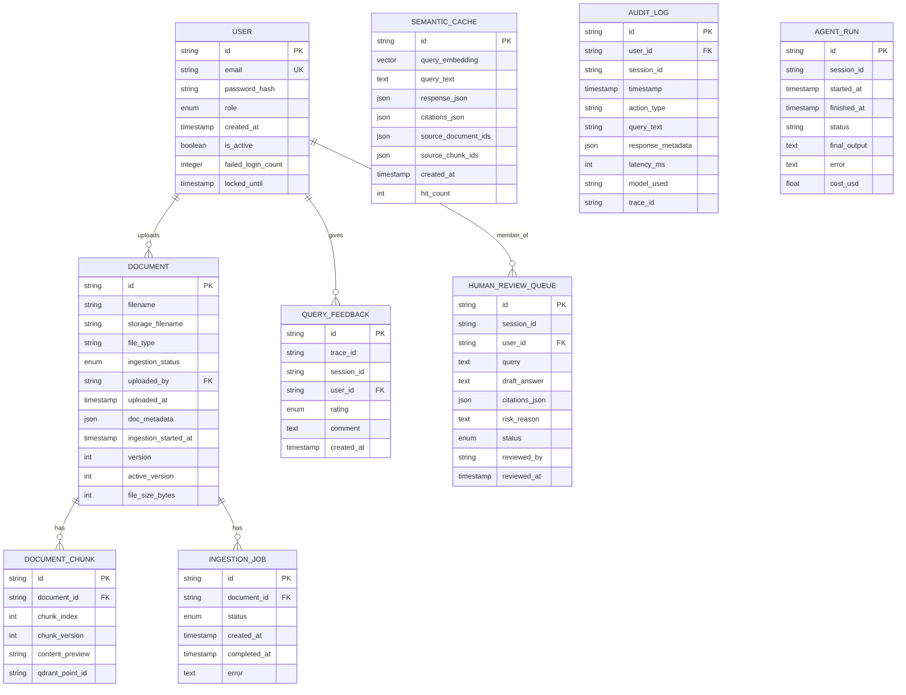

# Admin Endpoints

<cite>
**Referenced Files in This Document**
- [admin_routes.py](file://safe4ai-pilot/app/api/admin_routes.py)
- [document_routes.py](file://safe4ai-pilot/app/api/document_routes.py)
- [user_routes.py](file://safe4ai-pilot/app/api/user_routes.py)
- [audit_routes.py](file://safe4ai-pilot/app/api/audit_routes.py)
- [review_routes.py](file://safe4ai-pilot/app/api/review_routes.py)
- [models.py](file://safe4ai-pilot/app/db/models.py)
- [middleware.py](file://safe4ai-pilot/app/auth/middleware.py)
- [input_guard.py](file://safe4ai-pilot/app/security/input_guard.py)
- [output_filter.py](file://safe4ai-pilot/app/security/output_filter.py)
- [document_service.py](file://safe4ai-pilot/app/services/document_service.py)
- [user_service.py](file://safe4ai-pilot/app/services/user_service.py)
- [stats_service.py](file://safe4ai-pilot/app/services/stats_service.py)
- [AdminLayout.tsx](file://safe4ai-pilot/frontend/src/pages/admin/AdminLayout.tsx)
- [OverviewPage.tsx](file://safe4ai-pilot/frontend/src/pages/admin/OverviewPage.tsx)
- [UsersPage.tsx](file://safe4ai-pilot/frontend/src/pages/admin/UsersPage.tsx)
- [DocumentsPage.tsx](file://safe4ai-pilot/frontend/src/pages/admin/DocumentsPage.tsx)
- [ActivityPage.tsx](file://safe4ai-pilot/frontend/src/pages/admin/ActivityPage.tsx)
- [FeedbackPage.tsx](file://safe4ai-pilot/frontend/src/pages/admin/FeedbackPage.tsx)
- [client.ts](file://safe4ai-pilot/frontend/src/api/client.ts)
- [audit.ts](file://safe4ai-pilot/frontend/src/api/audit.ts)
- [stats.ts](file://safe4ai-pilot/frontend/src/api/stats.ts)
- [useAuditStream.ts](file://safe4ai-pilot/frontend/src/hooks/useAuditStream.ts)
- [useDocuments.ts](file://safe4ai-pilot/frontend/src/hooks/useDocuments.ts)
- [documents.ts](file://safe4ai-pilot/frontend/src/api/documents.ts)
</cite>

## Update Summary
**Changes Made**
- Updated architecture to reflect new modular admin structure with separate route modules
- Added documentation for new focused modules: document_routes.py, user_routes.py, audit_routes.py, review_routes.py
- Updated service layer documentation to include new document_service.py, user_service.py, and stats_service.py
- Revised project structure and dependency analysis to show modular organization
- Updated endpoint references to reflect new module locations

## Table of Contents
1. [Introduction](#introduction)
2. [Project Structure](#project-structure)
3. [Core Components](#core-components)
4. [Architecture Overview](#architecture-overview)
5. [Detailed Component Analysis](#detailed-component-analysis)
6. [Dependency Analysis](#dependency-analysis)
7. [Performance Considerations](#performance-considerations)
8. [Troubleshooting Guide](#troubleshooting-guide)
9. [Conclusion](#conclusion)
10. [Appendices](#appendices)

## Introduction
This document provides comprehensive API documentation for administrative endpoints focused on user management, document oversight, and system monitoring. The administrative interface has been completely restructured from a monolithic admin_routes.py (854 lines) to focused modules for better maintainability and separation of concerns. The new modular architecture splits functionality into document_routes.py, user_routes.py, audit_routes.py, and review_routes.py, each handling specific administrative domains while maintaining the same comprehensive feature set.

## Project Structure
The administrative functionality is now organized into focused modules under the app/api directory, with supporting services in app/services. Each module handles a specific administrative domain while sharing common infrastructure for authentication, authorization, and database access.

**Diagram sources**
- [admin_routes.py:1-19](file://safe4ai-pilot/app/api/admin_routes.py#L1-L19)
- [document_routes.py:1-408](file://safe4ai-pilot/app/api/document_routes.py#L1-L408)
- [user_routes.py:1-106](file://safe4ai-pilot/app/api/user_routes.py#L1-L106)
- [audit_routes.py:1-169](file://safe4ai-pilot/app/api/audit_routes.py#L1-L169)
- [review_routes.py:1-84](file://safe4ai-pilot/app/api/review_routes.py#L1-L84)
- [document_service.py:1-40](file://safe4ai-pilot/app/services/document_service.py#L1-L40)
- [user_service.py:1-91](file://safe4ai-pilot/app/services/user_service.py#L1-L91)
- [stats_service.py:1-38](file://safe4ai-pilot/app/services/stats_service.py#L1-L38)

**Section sources**
- [admin_routes.py:1-19](file://safe4ai-pilot/app/api/admin_routes.py#L1-L19)
- [document_routes.py:1-33](file://safe4ai-pilot/app/api/document_routes.py#L1-L33)
- [user_routes.py:1-21](file://safe4ai-pilot/app/api/user_routes.py#L1-L21)
- [audit_routes.py:1-21](file://safe4ai-pilot/app/api/audit_routes.py#L1-L21)
- [review_routes.py:1-17](file://safe4ai-pilot/app/api/review_routes.py#L1-L17)

## Core Components
- **Modular Admin API Router**: Split into focused modules - document_routes.py for document management, user_routes.py for user administration, audit_routes.py for logging and statistics, and review_routes.py for human review queue management.
- **Database Models**: Define entities for users, documents, ingestion jobs, audit logs, agent runs, semantic cache, and human review queue.
- **Authentication and Authorization**: JWT-based authentication with role checks enforcing admin-only access across all modules.
- **Service Layer**: Dedicated services for document lifecycle management, user deactivation cascading, and shared statistics aggregation.
- **Security Guards**: Input guard for queries and output filter for LLM answers.
- **Frontend Admin Pages**: Overview dashboard, Documents management, Activity feed, Feedback inspection, Users administration, and Settings.

**Section sources**
- [document_routes.py:33](file://safe4ai-pilot/app/api/document_routes.py#L33)
- [user_routes.py:21](file://safe4ai-pilot/app/api/user_routes.py#L21)
- [audit_routes.py:21](file://safe4ai-pilot/app/api/audit_routes.py#L21)
- [review_routes.py:17](file://safe4ai-pilot/app/api/review_routes.py#L17)
- [models.py:52-182](file://safe4ai-pilot/app/db/models.py#L52-L182)
- [middleware.py:74-83](file://safe4ai-pilot/app/auth/middleware.py#L74-L83)

## Architecture Overview
Administrative operations are now exposed via focused FastAPI route modules with strict permissions enforced by a role-check dependency. Each module maintains its own endpoint grouping while sharing common infrastructure. Requests are authenticated via cookies containing a signed JWT. Responses are structured consistently, with streaming responses for exports and paginated lists for audit logs. The frontend integrates with these endpoints using typed fetch wrappers and React Query for caching and polling.

**Diagram sources**
- [client.ts:3-15](file://safe4ai-pilot/frontend/src/api/client.ts#L3-L15)
- [document_routes.py:136-198](file://safe4ai-pilot/app/api/document_routes.py#L136-L198)
- [user_routes.py:66-88](file://safe4ai-pilot/app/api/user_routes.py#L66-L88)
- [audit_routes.py:24-61](file://safe4ai-pilot/app/api/audit_routes.py#L24-L61)
- [review_routes.py:50-65](file://safe4ai-pilot/app/api/review_routes.py#L50-L65)
- [middleware.py:74-83](file://safe4ai-pilot/app/auth/middleware.py#L74-L83)

## Detailed Component Analysis

### User Management Endpoints
**Updated** Now handled by the dedicated user_routes.py module with improved validation and security.

- GET /admin/users
  - Purpose: List all users with role, activity status, and creation timestamp.
  - Permissions: admin required.
  - Response: Array of user records with pagination support (limit: 1-1000, offset: ≥0).
  - Rate limit: 100/minute.
  - Example request: curl -H "Cookie: access_token=..." https://host/admin/users?limit=200&offset=0

- POST /admin/users
  - Purpose: Create a new user with password validation.
  - Permissions: admin required.
  - Request body: email, password (required), role (defaults to pilot_user).
  - Validation: Email format validation, password strength enforcement, unique email constraint.
  - Response: {"id": "<user_id>"}
  - Rate limit: 100/minute.

- DELETE /admin/users/{user_id}
  - Purpose: Deactivate a user with cascade cleanup (cannot deactivate self or admins).
  - Permissions: admin required.
  - Behavior: Cascading cleanup of documents, sessions, feedback, and review queue items.
  - Response: 204 No Content.
  - Rate limit: 100/minute.

**Diagram sources**
- [user_routes.py:66-88](file://safe4ai-pilot/app/api/user_routes.py#L66-L88)
- [user_service.py:57-91](file://safe4ai-pilot/app/services/user_service.py#L57-L91)
- [middleware.py:74-83](file://safe4ai-pilot/app/auth/middleware.py#L74-L83)

**Section sources**
- [user_routes.py:40-106](file://safe4ai-pilot/app/api/user_routes.py#L40-L106)
- [user_service.py:57-91](file://safe4ai-pilot/app/services/user_service.py#L57-L91)
- [models.py:52-62](file://safe4ai-pilot/app/db/models.py#L52-L62)

### Document Management Endpoints
**Updated** Now handled by the dedicated document_routes.py module with enhanced background processing and Qdrant integration.

- POST /admin/documents/upload
  - Purpose: Upload a document and enqueue background ingestion with enhanced validation.
  - Permissions: admin required.
  - Request: multipart/form-data with file; validated by UploadValidator and size limits (10/hour rate limit).
  - Response: {"doc_id","job_id"}.
  - Side effects: Persists Document and IngestionJob; triggers background ingestion with semaphore-controlled concurrency.

- GET /admin/corpus-stats
  - Purpose: Lightweight document and chunk counts for UI empty states.
  - Permissions: authenticated user (not necessarily admin).
  - Response: {"docCount","chunkCount","failedCount","inProgressCount"}.

- GET /admin/documents
  - Purpose: List all documents with ingestion status and chunk counts.
  - Permissions: admin required.
  - Response: Array of document records with uploaded_by email and file metadata.
  - Rate limit: 100/minute.

- GET /admin/documents/{doc_id}/status
  - Purpose: Poll ingestion progress for a specific document.
  - Permissions: admin required.
  - Response: {"doc_id","ingestion_status","job_status","job_error","ingestion_started_at"}.

- DELETE /admin/documents/{doc_id}
  - Purpose: Delete a document with comprehensive cleanup (filesystem, vector store, DB, cache).
  - Permissions: admin required.
  - Constraints: Cannot delete during active ingestion.
  - Side effects: Removes raw file, deletes Qdrant points, invalidates semantic cache entries, prunes BM25 index.

- POST /admin/documents/{doc_id}/reindex
  - Purpose: Re-index an existing document with vector store cleanup.
  - Permissions: admin required.
  - Constraints: Requires raw file presence.
  - Response: {"job_id"}.
  - Side effects: Deletes Qdrant points, prunes BM25 index, invalidates cache, increments version.

**Diagram sources**
- [document_routes.py:136-198](file://safe4ai-pilot/app/api/document_routes.py#L136-L198)
- [document_routes.py:47-104](file://safe4ai-pilot/app/api/document_routes.py#L47-L104)
- [document_service.py:17-40](file://safe4ai-pilot/app/services/document_service.py#L17-L40)
- [models.py:75-101](file://safe4ai-pilot/app/db/models.py#L75-L101)

**Section sources**
- [document_routes.py:136-408](file://safe4ai-pilot/app/api/document_routes.py#L136-L408)
- [document_service.py:17-40](file://safe4ai-pilot/app/services/document_service.py#L17-L40)
- [models.py:75-101](file://safe4ai-pilot/app/db/models.py#L75-L101)

### Audit Logs and Reporting
**Updated** Now handled by the dedicated audit_routes.py module with enhanced CSV streaming and statistics aggregation.

- GET /admin/audit-logs
  - Purpose: Paginated audit log listing with optional filters (start,end,user_id).
  - Permissions: admin required.
  - Response: Array of audit records with fields: id,user_id,session_id,timestamp,action_type,query_text,latency_ms,model_used,trace_id.
  - Pagination: limit (min 1, max 1000), offset (≥0).
  - Rate limit: 100/minute.

- GET /admin/audit-logs/export.csv
  - Purpose: Export audit logs to CSV with streaming response.
  - Permissions: admin required.
  - Response: StreamingResponse with CSV content-type and attachment filename.
  - Rate limit: 100/minute.
  - Streaming: Processes up to 50,000 rows with yield_per(500) for memory efficiency.

- GET /admin/stats
  - Purpose: Aggregate system metrics over a window (days).
  - Permissions: admin required.
  - Response fields: days,total_queries,avg_latency_ms,total_cost_usd,cache_total_hits,unique_users,generated_at.
  - Rate limit: 100/minute.
  - Validation: days must be between 1 and 366.

**Diagram sources**
- [audit_routes.py:24-61](file://safe4ai-pilot/app/api/audit_routes.py#L24-L61)
- [audit_routes.py:64-122](file://safe4ai-pilot/app/api/audit_routes.py#L64-L122)
- [audit_routes.py:125-169](file://safe4ai-pilot/app/api/audit_routes.py#L125-L169)

**Section sources**
- [audit_routes.py:24-169](file://safe4ai-pilot/app/api/audit_routes.py#L24-L169)
- [audit.ts:1-54](file://safe4ai-pilot/frontend/src/api/audit.ts#L1-L54)
- [stats.ts:20-30](file://safe4ai-pilot/frontend/src/api/stats.ts#L20-L30)

### Human Review Queue
**Updated** Now handled by the dedicated review_routes.py module with improved status management.

- GET /admin/review-queue
  - Purpose: List items in the queue filtered by status.
  - Permissions: admin required.
  - Response: Array of review queue items with comprehensive metadata.
  - Rate limit: 100/minute.

- POST /admin/review-queue/{item_id}/approve
  - Purpose: Approve a pending review item.
  - Permissions: admin required.
  - Response: {"status":"approved"}
  - Side effects: Updates status, reviewer, and timestamp.

- POST /admin/review-queue/{item_id}/reject
  - Purpose: Reject a pending review item.
  - Permissions: admin required.
  - Response: {"status":"rejected"}
  - Side effects: Updates status, reviewer, and timestamp.

**Section sources**
- [review_routes.py:20-84](file://safe4ai-pilot/app/api/review_routes.py#L20-L84)
- [models.py:169-182](file://safe4ai-pilot/app/db/models.py#L169-L182)

### Administrative Interface Integration
- AdminLayout provides navigation to Overview, Documents, Activity, Feedback, Users, and Settings.
- OverviewPage displays system stats and notable items using shared stats_service.
- DocumentsPage supports drag-and-drop upload, bulk reindex, and deletion with confirmation.
- ActivityPage shows a live-like audit timeline and export to CSV.
- FeedbackPage allows filtering and inspecting feedback items.
- UsersPage lists users and deactivates accounts with cascade cleanup.

**Section sources**
- [AdminLayout.tsx:12-19](file://safe4ai-pilot/frontend/src/pages/admin/AdminLayout.tsx#L12-L19)
- [OverviewPage.tsx:44-214](file://safe4ai-pilot/frontend/src/pages/admin/OverviewPage.tsx#L44-L214)
- [DocumentsPage.tsx:17-224](file://safe4ai-pilot/frontend/src/pages/admin/DocumentsPage.tsx#L17-L224)
- [ActivityPage.tsx:32-146](file://safe4ai-pilot/frontend/src/pages/admin/ActivityPage.tsx#L32-L146)
- [FeedbackPage.tsx:10-174](file://safe4ai-pilot/frontend/src/pages/admin/FeedbackPage.tsx#L10-L174)
- [UsersPage.tsx:22-120](file://safe4ai-pilot/frontend/src/pages/admin/UsersPage.tsx#L22-L120)

## Dependency Analysis
**Updated** Dependencies now reflect the modular architecture with focused route modules and shared services.

- **Backend dependencies per module**:
  - Document routes depend on SQLAlchemy models, Qdrant client, ingestion service, and document_service for cleanup operations.
  - User routes depend on SQLAlchemy models, password policy, and user_service for cascade cleanup.
  - Audit routes depend on SQLAlchemy models and provide shared stats_service usage.
  - Review routes depend on SQLAlchemy models and human review queue management.
  - All modules enforce access control via require_role("admin").
  - Data export uses streaming response for CSV in audit routes.

- **Service layer dependencies**:
  - document_service: Qdrant client integration for vector cleanup and BM25 pruning.
  - user_service: Comprehensive cascade cleanup for user deactivation.
  - stats_service: Shared SQL queries for corpus statistics across modules.

- **Frontend dependencies**:
  - Typed fetch wrapper ensures JSON parsing and error handling.
  - React Query manages caching, polling, and optimistic updates.
  - Hooks encapsulate document and audit workflows.

**Diagram sources**
- [document_routes.py:26-29](file://safe4ai-pilot/app/api/document_routes.py#L26-L29)
- [user_routes.py:18](file://safe4ai-pilot/app/api/user_routes.py#L18)
- [audit_routes.py:18](file://safe4ai-pilot/app/api/audit_routes.py#L18)
- [document_service.py:7-8](file://safe4ai-pilot/app/services/document_service.py#L7-L8)
- [user_service.py:12-21](file://safe4ai-pilot/app/services/user_service.py#L12-L21)
- [stats_service.py:11](file://safe4ai-pilot/app/services/stats_service.py#L11)

**Section sources**
- [document_routes.py:13-30](file://safe4ai-pilot/app/api/document_routes.py#L13-L30)
- [user_routes.py:13-18](file://safe4ai-pilot/app/api/user_routes.py#L13-L18)
- [audit_routes.py:15-18](file://safe4ai-pilot/app/api/audit_routes.py#L15-L18)
- [review_routes.py:10-14](file://safe4ai-pilot/app/api/review_routes.py#L10-L14)
- [client.ts:1-20](file://safe4ai-pilot/frontend/src/api/client.ts#L1-L20)

## Performance Considerations
**Updated** Performance optimizations now span across the modular architecture.

- **Rate limiting**: Endpoints maintain rate limits (100/minute for listing and exports; 10/hour for uploads).
- **Background processing**: Document ingestion uses semaphore-controlled concurrency (_MAX_BACKGROUND_INGESTION_TASKS = 4) to prevent resource exhaustion.
- **Streaming responses**: CSV export streams data to reduce memory overhead with yield_per(500) batching.
- **Polling optimization**: Frontend polls for document status until completion, with capped retries and intervals.
- **Caching**: React Query caches responses and invalidates on mutations.
- **Database optimization**: Subqueries and coalesce operations optimize document listing queries.
- **Service layer efficiency**: Shared services minimize database round trips and provide centralized business logic.

## Troubleshooting Guide
**Updated** Troubleshooting guidance now addresses module-specific issues.

- **Authentication failures**:
  - Symptom: 401 Not authenticated on admin endpoints.
  - Cause: Missing or invalid access_token cookie.
  - Resolution: Ensure login and cookie handling is configured.

- **Authorization failures**:
  - Symptom: 403 Forbidden on admin endpoints.
  - Cause: Non-admin role.
  - Resolution: Verify user role assignment.

- **Upload errors**:
  - Symptom: 413 Request body too large or 400 validation errors.
  - Cause: File size or type restrictions.
  - Resolution: Check settings.max_upload_size_mb and supported extensions.

- **Deletion conflicts**:
  - Symptom: 409 Conflict when deleting a document.
  - Cause: Active ingestion job.
  - Resolution: Wait for ingestion to complete or cancel job externally.

- **Audit export limits**:
  - Symptom: Truncated export.
  - Cause: Limit applied to exported rows (50,000 row cap).
  - Resolution: Use filters and download multiple slices.

- **Module-specific issues**:
  - Symptom: 404 Not Found on /admin/documents/{doc_id}/status.
  - Cause: Document ID doesn't exist.
  - Resolution: Verify document exists before checking status.

- **Service layer failures**:
  - Symptom: Qdrant cleanup failures during document deletion.
  - Cause: Vector store connectivity issues.
  - Resolution: Check Qdrant service availability and retry operation.

**Section sources**
- [middleware.py:51-71](file://safe4ai-pilot/app/auth/middleware.py#L51-L71)
- [document_routes.py:286-324](file://safe4ai-pilot/app/api/document_routes.py#L286-L324)
- [user_routes.py:91-106](file://safe4ai-pilot/app/api/user_routes.py#L91-L106)
- [audit_routes.py:64-122](file://safe4ai-pilot/app/api/audit_routes.py#L64-L122)

## Conclusion
The administrative endpoints now provide a secure, auditable, and observable control plane organized into focused modules for better maintainability and scalability. The modular architecture separates concerns effectively while maintaining the same comprehensive feature set. Role-based access control, robust validation, streaming exports, and comprehensive service layers enable efficient operations across user management, document oversight, audit logging, and human review processes. The frontend pages integrate seamlessly with the backend APIs, offering real-time insights and operational controls suitable for pilot-scale deployments.

## Appendices

### Endpoint Reference Summary
**Updated** Endpoints now organized by module location.

#### User Management (user_routes.py)
- GET /admin/users → 200 OK, array of users with pagination
- POST /admin/users → 201 Created, {"id": "..."}
- DELETE /admin/users/{user_id} → 204 No Content

#### Document Management (document_routes.py)
- POST /admin/documents/upload → 201 Created, {"doc_id","job_id"}
- GET /admin/corpus-stats → 200 OK, corpus statistics
- GET /admin/documents → 200 OK, array of documents
- GET /admin/documents/{doc_id}/status → 200 OK, status object
- DELETE /admin/documents/{doc_id} → 204 No Content
- POST /admin/documents/{doc_id}/reindex → 202 Accepted, {"job_id"}

#### Audit and Statistics (audit_routes.py)
- GET /admin/audit-logs → 200 OK, array of audit records
- GET /admin/audit-logs/export.csv → 200 OK, CSV stream
- GET /admin/stats → 200 OK, stats object

#### Human Review Queue (review_routes.py)
- GET /admin/review-queue → 200 OK, array of items
- POST /admin/review-queue/{item_id}/approve → 200 OK, {"status":"approved"}
- POST /admin/review-queue/{item_id}/reject → 200 OK, {"status":"rejected"}

**Section sources**
- [user_routes.py:40-106](file://safe4ai-pilot/app/api/user_routes.py#L40-L106)
- [document_routes.py:136-408](file://safe4ai-pilot/app/api/document_routes.py#L136-L408)
- [audit_routes.py:24-169](file://safe4ai-pilot/app/api/audit_routes.py#L24-L169)
- [review_routes.py:20-84](file://safe4ai-pilot/app/api/review_routes.py#L20-L84)

### Data Models Overview

**Diagram sources**
- [models.py:52-182](file://safe4ai-pilot/app/db/models.py#L52-L182)

### Security and Access Controls
**Updated** Security measures now span across all modules with consistent enforcement.

- **Authentication**: JWT stored in a cookie; decoded and verified on each request.
- **Authorization**: require_role("admin") ensures only admins can access admin endpoints across all modules.
- **Data validation**: UploadValidator and size checks prevent oversized or unsupported files in document routes.
- **Input guard and output filter**: Additional safeguards for queries and answers across all modules.
- **Password security**: Strong password validation and hashing in user management.
- **Cascade cleanup**: Comprehensive user deactivation with data reassignment and privacy protection.

**Section sources**
- [middleware.py:35-83](file://safe4ai-pilot/app/auth/middleware.py#L35-L83)
- [document_routes.py:146-153](file://safe4ai-pilot/app/api/document_routes.py#L146-L153)
- [user_routes.py:72-74](file://safe4ai-pilot/app/api/user_routes.py#L72-L74)
- [input_guard.py:24-49](file://safe4ai-pilot/app/security/input_guard.py#L24-L49)
- [output_filter.py:31-61](file://safe4ai-pilot/app/security/output_filter.py#L31-L61)

### Frontend Client Utilities
**Updated** Frontend utilities integrate with the modular backend architecture.

- **apiFetch**: Unified fetch wrapper handling credentials, JSON parsing, and error propagation.
- **apiUrl**: Builds absolute URLs using VITE_API_URL.
- **Hooks**: useDocuments and useAuditStream encapsulate CRUD and polling logic.
- **Module-specific APIs**: Separate API modules for documents, audit, and stats maintain clean interfaces.

**Section sources**
- [client.ts:3-19](file://safe4ai-pilot/frontend/src/api/client.ts#L3-L19)
- [useDocuments.ts:5-60](file://safe4ai-pilot/frontend/src/hooks/useDocuments.ts#L5-L60)
- [useAuditStream.ts:5-16](file://safe4ai-pilot/frontend/src/hooks/useAuditStream.ts#L5-L16)
- [documents.ts:1-68](file://safe4ai-pilot/frontend/src/api/documents.ts#L1-L68)
- [audit.ts:1-54](file://safe4ai-pilot/frontend/src/api/audit.ts#L1-L54)
- [stats.ts:1-31](file://safe4ai-pilot/frontend/src/api/stats.ts#L1-L31)

### Service Layer Architecture
**New** Dedicated service layer provides shared business logic across modules.

- **document_service.py**: Qdrant cleanup, BM25 pruning, and vector store management.
- **user_service.py**: Ghost user creation, cascade cleanup, and user deactivation.
- **stats_service.py**: Shared SQL queries for corpus statistics and metrics aggregation.

**Section sources**
- [document_service.py:1-40](file://safe4ai-pilot/app/services/document_service.py#L1-L40)
- [user_service.py:1-91](file://safe4ai-pilot/app/services/user_service.py#L1-L91)
- [stats_service.py:1-38](file://safe4ai-pilot/app/services/stats_service.py#L1-L38)