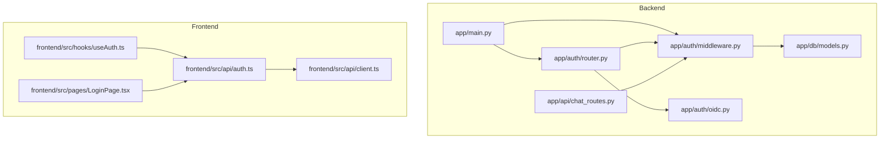
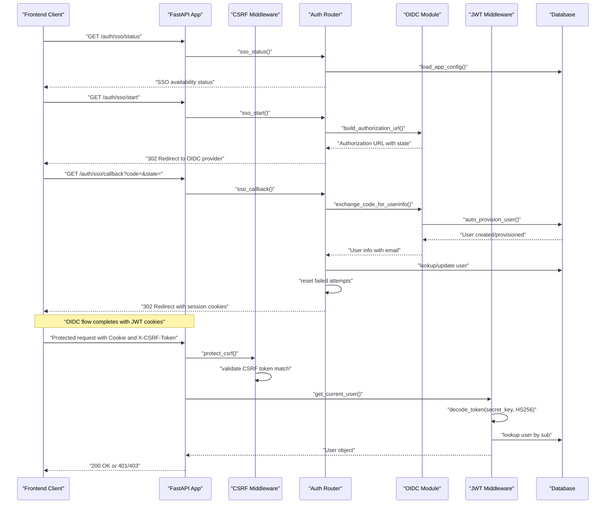
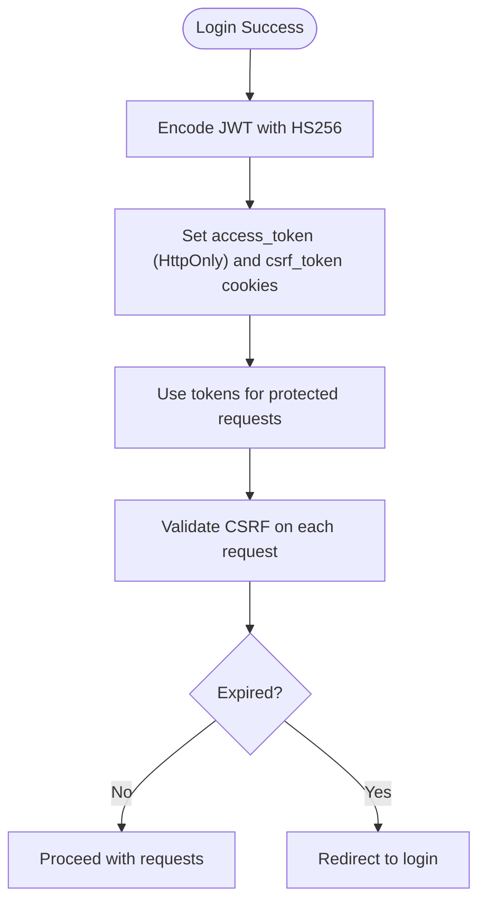
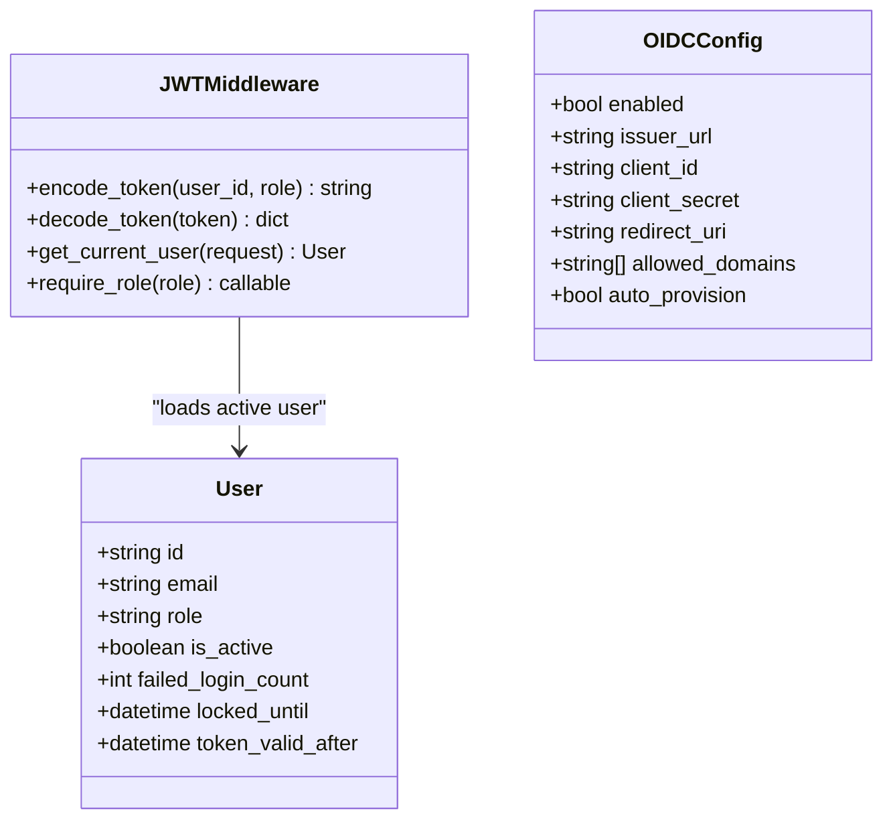
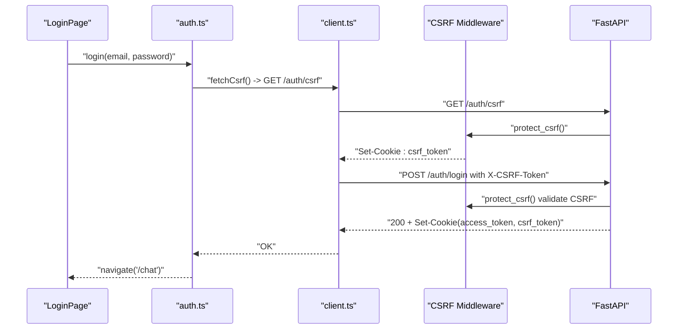
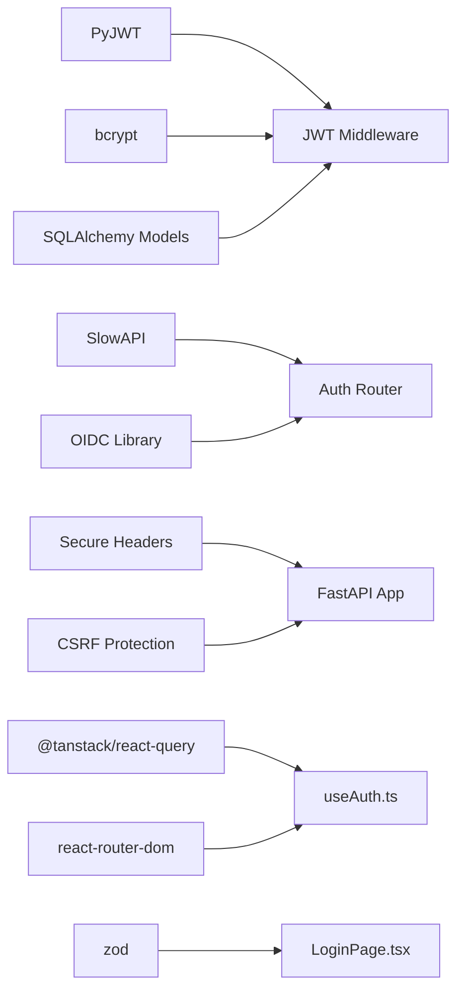

# Authentication Endpoints

<cite>
**Referenced Files in This Document**
- [router.py](file://safe4ai-pilot/app/auth/router.py)
- [middleware.py](file://safe4ai-pilot/app/auth/middleware.py)
- [oidc.py](file://safe4ai-pilot/app/auth/oidc.py)
- [main.py](file://safe4ai-pilot/app/main.py)
- [models.py](file://safe4ai-pilot/app/db/models.py)
- [auth.ts](file://safe4ai-pilot/frontend/src/api/auth.ts)
- [client.ts](file://safe4ai-pilot/frontend/src/api/client.ts)
- [useAuth.ts](file://safe4ai-pilot/frontend/src/hooks/useAuth.ts)
- [LoginPage.tsx](file://safe4ai-pilot/frontend/src/pages/LoginPage.tsx)
- [chat_routes.py](file://safe4ai-pilot/app/api/chat_routes.py)
- [config.py](file://safe4ai-pilot/app/config.py)
- [test_auth.py](file://safe4ai-pilot/tests/test_auth.py)
- [test_oidc.py](file://safe4ai-pilot/tests/test_oidc.py)
- [pyproject.toml](file://safe4ai-pilot/pyproject.toml)
</cite>

## Update Summary
**Changes Made**
- Added comprehensive OIDC Single Sign-On (SSO) authentication system with three new endpoints
- Integrated OIDC client implementation with authorization flow handling and automatic user provisioning
- Enhanced authentication flow to support both traditional password login and OIDC SSO
- Added SSO status checking, authorization initiation, and callback processing endpoints
- Updated frontend integration to support OIDC login options alongside password authentication
- Implemented state parameter validation and CSRF protection for OIDC flows

## Table of Contents
1. [Introduction](#introduction)
2. [Project Structure](#project-structure)
3. [Core Components](#core-components)
4. [Architecture Overview](#architecture-overview)
5. [Detailed Component Analysis](#detailed-component-analysis)
6. [Dependency Analysis](#dependency-analysis)
7. [Performance Considerations](#performance-considerations)
8. [Troubleshooting Guide](#troubleshooting-guide)
9. [Conclusion](#conclusion)
10. [Appendices](#appendices)

## Introduction
This document provides comprehensive API documentation for authentication endpoints focused on user login, logout, token management, and access control. It covers JWT token generation, refresh mechanisms, session handling, middleware for authentication and authorization, CSRF protection, OIDC Single Sign-On (SSO) integration, request/response schemas, authentication flow, security considerations, rate limiting policies, error handling patterns, and practical client-side examples for token storage and renewal. It also documents CORS policies, CSRF protection posture, and security headers applied during authentication.

## Project Structure
Authentication is implemented in the backend FastAPI application under app/auth, with supporting database models and middleware. Frontend client-side integration is implemented in the React SPA under frontend/src/api and frontend/src/hooks. The system now includes comprehensive OIDC SSO support with dedicated configuration and flow handling.

**Diagram sources**
- [main.py](file://safe4ai-pilot/app/main.py)
- [router.py](file://safe4ai-pilot/app/auth/router.py)
- [middleware.py](file://safe4ai-pilot/app/auth/middleware.py)
- [oidc.py](file://safe4ai-pilot/app/auth/oidc.py)
- [models.py](file://safe4ai-pilot/app/db/models.py)
- [chat_routes.py](file://safe4ai-pilot/app/api/chat_routes.py)
- [auth.ts](file://safe4ai-pilot/frontend/src/api/auth.ts)
- [client.ts](file://safe4ai-pilot/frontend/src/api/client.ts)
- [useAuth.ts](file://safe4ai-pilot/frontend/src/hooks/useAuth.ts)
- [LoginPage.tsx](file://safe4ai-pilot/frontend/src/pages/LoginPage.tsx)

**Section sources**
- [main.py](file://safe4ai-pilot/app/main.py)
- [router.py](file://safe4ai-pilot/app/auth/router.py)
- [middleware.py](file://safe4ai-pilot/app/auth/middleware.py)
- [oidc.py](file://safe4ai-pilot/app/auth/oidc.py)
- [models.py](file://safe4ai-pilot/app/db/models.py)
- [chat_routes.py](file://safe4ai-pilot/app/api/chat_routes.py)
- [auth.ts](file://safe4ai-pilot/frontend/src/api/auth.ts)
- [client.ts](file://safe4ai-pilot/frontend/src/api/client.ts)
- [useAuth.ts](file://safe4ai-pilot/frontend/src/hooks/useAuth.ts)
- [LoginPage.tsx](file://safe4ai-pilot/frontend/src/pages/LoginPage.tsx)

## Core Components
- Authentication router: Provides /auth/login, /auth/logout, /auth/csrf, /auth/sso/status, /auth/sso/start, and /auth/sso/callback endpoints with rate limiting and brute-force protections.
- OIDC SSO system: Comprehensive OpenID Connect implementation with authorization flow, token exchange, user provisioning, and session management.
- JWT middleware: Encodes/decodes tokens, verifies passwords, extracts current user, and enforces role-based access control.
- CSRF protection middleware: Implements double-submit token validation for all authenticated requests and login attempts.
- Protected routes: Chat endpoints depend on authenticated users via middleware.
- Frontend auth API: Wraps fetch with credentials and exposes login/logout/me helpers with automatic CSRF token fetching and SSO integration.
- Security headers and CORS: Enforced globally via middleware and configured origins.

**Section sources**
- [router.py](file://safe4ai-pilot/app/auth/router.py)
- [middleware.py](file://safe4ai-pilot/app/auth/middleware.py)
- [oidc.py](file://safe4ai-pilot/app/auth/oidc.py)
- [main.py](file://safe4ai-pilot/app/main.py)
- [chat_routes.py](file://safe4ai-pilot/app/api/chat_routes.py)
- [auth.ts](file://safe4ai-pilot/frontend/src/api/auth.ts)
- [client.ts](file://safe4ai-pilot/frontend/src/api/client.ts)

## Architecture Overview
The authentication flow integrates backend endpoints, middleware, OIDC SSO system, and frontend client with enhanced CSRF protection. Tokens are stored as HTTP-only cookies to mitigate XSS risks. Access to protected resources depends on a valid, non-expired JWT present in the cookie, with CSRF double-submit tokens for additional security. The system now supports both traditional password authentication and OIDC Single Sign-On with automatic user provisioning.

**Diagram sources**
- [router.py](file://safe4ai-pilot/app/auth/router.py)
- [middleware.py](file://safe4ai-pilot/app/auth/middleware.py)
- [oidc.py](file://safe4ai-pilot/app/auth/oidc.py)
- [main.py](file://safe4ai-pilot/app/main.py)
- [models.py](file://safe4ai-pilot/app/db/models.py)

## Detailed Component Analysis

### Authentication Endpoints
- Route: GET /auth/csrf
  - Purpose: Generate and return a pre-login CSRF token for double-submit protection.
  - Response: 200 with JSON containing csrf_token field.
  - Cookie: Sets csrf_token cookie with max age 300 seconds, HttpOnly=false, SameSite=Strict, Secure based on HTTPS enforcement.
  - Usage: Must be called before POST /auth/login to establish CSRF protection.

- Route: POST /auth/login
  - Purpose: Authenticate user and issue HTTP-only JWT and CSRF cookies.
  - Rate limiting: 10 per minute via SlowAPI.
  - CSRF requirement: Requires X-CSRF-Token header matching csrf_token cookie.
  - Password policy: Rejects passwords shorter than 12 characters.
  - Brute-force protection: Tracks failed attempts and locks accounts temporarily.
  - SSO policy: Returns 403 if sso_only is enabled and OIDC is configured.
  - Response: 200 with message; sets access_token and csrf_token cookies with max age, HttpOnly for JWT, SameSite=Strict, and Secure based on HTTPS enforcement.
  - Errors: 401 for invalid credentials; 429 when account locked; 403 for CSRF validation failure or SSO-only policy.

- Route: POST /auth/logout
  - Purpose: Clear JWT and CSRF cookies to log out.
  - CSRF requirement: Requires X-CSRF-Token header matching csrf_token cookie.
  - Response: 200 with message; sets access_token and csrf_token with max-age=0.

- Route: GET /me
  - Purpose: Return authenticated user profile (role, email, activity status).
  - Access: Requires valid access_token cookie and CSRF token.
  - Implementation: Uses get_current_user dependency.

**Updated** Enhanced with SSO policy enforcement and integrated OIDC SSO capabilities.

**Section sources**
- [router.py](file://safe4ai-pilot/app/auth/router.py)
- [auth.ts](file://safe4ai-pilot/frontend/src/api/auth.ts)
- [useAuth.ts](file://safe4ai-pilot/frontend/src/hooks/useAuth.ts)

### OIDC Single Sign-On (SSO) Endpoints
- Route: GET /auth/sso/status
  - Purpose: Return public OIDC login availability without exposing secrets.
  - Response: JSON object with enabled (boolean), configured (boolean), ssoOnly (boolean), and loginUrl (string or null).
  - Implementation: Loads application configuration and OIDC settings to determine SSO availability.

- Route: GET /auth/sso/start
  - Purpose: Start OIDC authorization-code login flow.
  - Rate limiting: 20 per minute via SlowAPI.
  - State management: Generates cryptographically secure state parameter and stores it in HttpOnly cookie.
  - Redirect: Redirects to OIDC provider's authorization endpoint with proper parameters.
  - Validation: Returns 404 if SSO is not configured.
  - Security: Uses Lax SameSite policy for state cookie to work across redirects.

- Route: GET /auth/sso/callback
  - Purpose: Complete OIDC authorization-code login and issue application session cookies.
  - Rate limiting: 20 per minute via SlowAPI.
  - State validation: Verifies state parameter matches the stored state cookie using constant-time comparison.
  - Code exchange: Exchanges authorization code for user information via OIDC provider.
  - User provisioning: Automatically creates or updates user records based on OIDC user info.
  - Session creation: Issues JWT access_token and CSRF cookies upon successful authentication.
  - Error handling: Returns 403 for invalid state, 404 for unconfigured SSO, 502 for provider errors.

**New Section** Added comprehensive OIDC SSO authentication system with three dedicated endpoints.

**Section sources**
- [router.py](file://safe4ai-pilot/app/auth/router.py)
- [oidc.py](file://safe4ai-pilot/app/auth/oidc.py)
- [test_oidc.py](file://safe4ai-pilot/tests/test_oidc.py)

### CSRF Protection System
- Double-submit token pattern: CSRF tokens are stored in both cookies and headers for validation.
- Pre-login token generation: GET /auth/csrf endpoint establishes CSRF protection before login attempts.
- Origin validation: Login requests require valid Origin header matching allowed origins list.
- Middleware enforcement: protect_csrf middleware validates CSRF tokens for all authenticated requests and login attempts.
- Token lifecycle: CSRF tokens are cleared on logout and have shorter expiration (300 seconds) than JWT tokens.
- OIDC state protection: OIDC state parameters are validated using constant-time comparison to prevent timing attacks.

**Diagram sources**
- [router.py](file://safe4ai-pilot/app/auth/router.py)
- [main.py](file://safe4ai-pilot/app/main.py)

**Section sources**
- [router.py](file://safe4ai-pilot/app/auth/router.py)
- [main.py](file://safe4ai-pilot/app/main.py)

### JWT Token Management
- Encoding: HS256-signed JWT with subject (user ID), role, issued-at, and expiration (8 hours).
- Decoding: Validates signature and claims; rejects tampered tokens.
- Storage: Cookies only (not localStorage/sessionStorage) to reduce XSS exposure.
- Expiration: 8 hours; no built-in refresh endpoint; clients should re-authenticate after expiry.
- Dual cookie strategy: Separate access_token (HttpOnly) and csrf_token (non-HttpOnly) cookies for different security properties.
- Session management: OIDC authentication follows the same token storage and validation patterns as password authentication.

**Diagram sources**
- [middleware.py](file://safe4ai-pilot/app/auth/middleware.py)
- [router.py](file://safe4ai-pilot/app/auth/router.py)

**Section sources**
- [middleware.py](file://safe4ai-pilot/app/auth/middleware.py)
- [router.py](file://safe4ai-pilot/app/auth/router.py)

### Access Control and Authorization
- Role enforcement: require_role(role) dependency ensures only users with the specified role can access protected endpoints.
- Current user extraction: get_current_user validates token and ensures the user is active.
- Protected endpoints: Chat routes depend on get_current_user to authorize requests.
- Token revocation: logout endpoint updates user.token_valid_after to invalidate previously issued tokens.
- SSO policy enforcement: When sso_only is enabled, password login is blocked even if credentials are valid.

**Diagram sources**
- [middleware.py](file://safe4ai-pilot/app/auth/middleware.py)
- [models.py](file://safe4ai-pilot/app/db/models.py)
- [oidc.py](file://safe4ai-pilot/app/auth/oidc.py)

**Section sources**
- [middleware.py](file://safe4ai-pilot/app/auth/middleware.py)
- [models.py](file://safe4ai-pilot/app/db/models.py)
- [chat_routes.py](file://safe4ai-pilot/app/api/chat_routes.py)

### Request and Response Schemas
- CSRF Token Request (GET /auth/csrf)
  - Response: {"csrf_token": "string"}
  - Headers/Cookies: Set-Cookie: csrf_token=...; HttpOnly=false; SameSite=Strict; Secure=<enforce_https>

- SSO Status Response (GET /auth/sso/status)
  - Response: {"enabled": boolean, "configured": boolean, "ssoOnly": boolean, "loginUrl": string|null}
  - No cookies set; returns public configuration status.

- SSO Start Response (GET /auth/sso/start)
  - Response: 302 Redirect to OIDC provider authorization URL
  - Cookie: Sets _OIDC_STATE_COOKIE_NAME with state parameter (HttpOnly=true, SameSite=lax)
  - Errors: 404 if SSO is not configured.

- SSO Callback Response (GET /auth/sso/callback)
  - Response: 302 Redirect to frontend with session cookies set
  - Cookies: Sets access_token and csrf_token cookies for successful authentication
  - Errors: 403 for invalid state, 404 for unconfigured SSO, 502 for provider errors.

- LoginRequest (JSON body)
  - Fields: email (string), password (string)
  - Validation: Frontend enforces non-empty fields; backend enforces minimum password length and timing-safe verification.

- Login response (JSON)
  - Body: {"message": "logged in"}
  - Headers/Cookies: Set-Cookie: access_token=...; HttpOnly; SameSite=Strict; Secure=<enforce_https>
  - Additional: Set-Cookie: csrf_token=...; HttpOnly=false; SameSite=Strict; Secure=<enforce_https>

- Logout response (JSON)
  - Body: {"message": "logged out"}
  - Headers: Set-Cookie: access_token=; Max-Age=0, csrf_token=; Max-Age=0

- /me response (JSON)
  - Fields: id (string), email (string), role ("admin"|"pilot_user"), is_active (boolean)

- Protected resource access
  - Header: Cookie: access_token=JWT, csrf_token=token; X-CSRF-Token: token
  - Success: 200 with resource data
  - Errors: 401 Not authenticated, 403 Forbidden (CSRF/validation failure)

**Updated** Added comprehensive OIDC SSO endpoint schemas and enhanced error handling.

**Section sources**
- [router.py](file://safe4ai-pilot/app/auth/router.py)
- [auth.ts](file://safe4ai-pilot/frontend/src/api/auth.ts)
- [models.py](file://safe4ai-pilot/app/db/models.py)
- [oidc.py](file://safe4ai-pilot/app/auth/oidc.py)

### Authentication Flow
- Client-side login flow
  - Automatically fetches CSRF token via GET /auth/csrf before login attempts.
  - Posts to /auth/login with both cookie and X-CSRF-Token header.
  - On success, invalidates local queries and navigates to chat.
  - On failure, displays a user-friendly error.

- OIDC SSO flow
  - Checks SSO availability via GET /auth/sso/status.
  - Initiates SSO by navigating to GET /auth/sso/start.
  - User authenticates with OIDC provider and returns to /auth/sso/callback.
  - Backend validates state parameter and exchanges code for user info.
  - Automatic user provisioning creates or updates user record.
  - Session cookies are set and user is redirected to frontend.

- Protected resource access
  - Frontend fetches /me and protected endpoints with credentials: include.
  - Backend middleware extracts token from cookie, validates CSRF, and authorizes.

**Diagram sources**
- [LoginPage.tsx](file://safe4ai-pilot/frontend/src/pages/LoginPage.tsx)
- [auth.ts](file://safe4ai-pilot/frontend/src/api/auth.ts)
- [client.ts](file://safe4ai-pilot/frontend/src/api/client.ts)
- [router.py](file://safe4ai-pilot/app/auth/router.py)
- [main.py](file://safe4ai-pilot/app/main.py)

**Section sources**
- [LoginPage.tsx](file://safe4ai-pilot/frontend/src/pages/LoginPage.tsx)
- [auth.ts](file://safe4ai-pilot/frontend/src/api/auth.ts)
- [client.ts](file://safe4ai-pilot/frontend/src/api/client.ts)
- [router.py](file://safe4ai-pilot/app/auth/router.py)

### Security Considerations
- Token storage: Cookies only (HttpOnly for JWT, non-HttpOnly for CSRF); SameSite=Strict, Secure when enforced.
- Password hashing: bcrypt for storage; timing-safe verification to prevent timing attacks.
- Brute-force protection: Tracks failed attempts and locks accounts for a fixed period.
- Rate limiting: 10/minute on /auth/login; 20/minute on /auth/sso endpoints; global rate-limit exceeded handler.
- CSRF protection: Double-submit token pattern with middleware validation; pre-login token generation.
- Origin validation: Login requests require valid Origin header matching allowed origins list.
- CORS: Configured origins list; credentials allowed; Content-Type and X-CSRF-Token allowed.
- Security headers: Strict-Transport-Security, X-Frame-Options, X-Content-Type-Options, Referrer-Policy, Permissions-Policy applied via middleware.
- Token revocation: Logout updates token_valid_after to invalidate previously issued tokens.
- OIDC security: State parameter validation using constant-time comparison; provider discovery with SSRF protection; secure cookie handling for state parameters.
- SSO policy enforcement: When sso_only is enabled, password login is completely blocked regardless of credentials.

**Updated** Enhanced with comprehensive OIDC SSO security measures and SSO policy enforcement.

**Section sources**
- [router.py](file://safe4ai-pilot/app/auth/router.py)
- [middleware.py](file://safe4ai-pilot/app/auth/middleware.py)
- [main.py](file://safe4ai-pilot/app/main.py)
- [config.py](file://safe4ai-pilot/app/config.py)
- [oidc.py](file://safe4ai-pilot/app/auth/oidc.py)

### Rate Limiting Policies
- /auth/login: 10 requests per minute per remote address.
- /auth/sso/status: No rate limiting (public endpoint).
- /auth/sso/start: 20 requests per minute per remote address.
- /auth/sso/callback: 20 requests per minute per remote address.
- Chat endpoints: 30 per minute per IP.
- Exceeded limits return 429 with a standardized error handled by the application.

**Updated** Added OIDC SSO endpoints with appropriate rate limiting and removed rate limiting from status endpoint.

**Section sources**
- [router.py](file://safe4ai-pilot/app/auth/router.py)
- [chat_routes.py](file://safe4ai-pilot/app/api/chat_routes.py)
- [main.py](file://safe4ai-pilot/app/main.py)

### Error Handling Patterns
- Invalid credentials: 401 with a generic message; password too short: 401.
- Account locked: 429 with lockout message.
- CSRF validation failure: 403 with "CSRF validation failed" message.
- Missing/invalid/expired token: 401 Not authenticated.
- Role mismatch: 403 Forbidden.
- SSO not configured: 404 for /auth/sso endpoints.
- Invalid SSO state: 403 for state parameter mismatch.
- OIDC provider errors: 502 for authentication failures.
- SSO-only policy violation: 403 when password login attempted with SSO-only enabled.
- Frontend catches errors and surfaces user-friendly messages.

**Updated** Added comprehensive OIDC SSO error handling patterns and SSO policy enforcement errors.

**Section sources**
- [router.py](file://safe4ai-pilot/app/auth/router.py)
- [middleware.py](file://safe4ai-pilot/app/auth/middleware.py)
- [LoginPage.tsx](file://safe4ai-pilot/frontend/src/pages/LoginPage.tsx)
- [test_auth.py](file://safe4ai-pilot/tests/test_auth.py)
- [test_oidc.py](file://safe4ai-pilot/tests/test_oidc.py)

### Practical Client-Side Examples
- Token storage: Dual cookie strategy - cookies only; credentials: include ensures cookies are sent automatically.
- CSRF integration: Automatic CSRF token fetching before login attempts; X-CSRF-Token header management.
- SSO integration: Check /auth/sso/status to determine if OIDC login should be offered; handle redirects for SSO flow.
- Renewal strategy: No automatic refresh; upon 401, redirect to login page and re-authenticate.
- Logout: Call /auth/logout; client clears local cache and navigates to login.
- SSO user experience: Display both password login and OIDC login options based on SSO availability; handle OIDC redirects seamlessly.

**Updated** Enhanced with OIDC SSO integration patterns and dual authentication approach.

**Section sources**
- [client.ts](file://safe4ai-pilot/frontend/src/api/client.ts)
- [auth.ts](file://safe4ai-pilot/frontend/src/api/auth.ts)
- [useAuth.ts](file://safe4ai-pilot/frontend/src/hooks/useAuth.ts)
- [router.py](file://safe4ai-pilot/app/auth/router.py)

## Dependency Analysis
- Backend dependencies
  - PyJWT for encoding/decoding tokens.
  - bcrypt for password hashing.
  - SlowAPI for rate limiting.
  - Secure headers library for HTTP security headers.
  - SQLAlchemy models for user and session persistence.
  - OIDC library for OpenID Connect protocol implementation.
  - HTTP client for OIDC provider communication.

- Frontend dependencies
  - React Query for caching and invalidation.
  - React Router for navigation.
  - Zod for form validation.

**Diagram sources**
- [middleware.py](file://safe4ai-pilot/app/auth/middleware.py)
- [router.py](file://safe4ai-pilot/app/auth/router.py)
- [main.py](file://safe4ai-pilot/app/main.py)
- [models.py](file://safe4ai-pilot/app/db/models.py)
- [oidc.py](file://safe4ai-pilot/app/auth/oidc.py)
- [useAuth.ts](file://safe4ai-pilot/frontend/src/hooks/useAuth.ts)
- [LoginPage.tsx](file://safe4ai-pilot/frontend/src/pages/LoginPage.tsx)
- [pyproject.toml](file://safe4ai-pilot/pyproject.toml)

**Section sources**
- [pyproject.toml](file://safe4ai-pilot/pyproject.toml)
- [middleware.py](file://safe4ai-pilot/app/auth/middleware.py)
- [router.py](file://safe4ai-pilot/app/auth/router.py)
- [main.py](file://safe4ai-pilot/app/main.py)
- [models.py](file://safe4ai-pilot/app/db/models.py)
- [oidc.py](file://safe4ai-pilot/app/auth/oidc.py)
- [useAuth.ts](file://safe4ai-pilot/frontend/src/hooks/useAuth.ts)
- [LoginPage.tsx](file://safe4ai-pilot/frontend/src/pages/LoginPage.tsx)

## Performance Considerations
- Token verification is constant-time and inexpensive; keep payloads minimal.
- Rate limiting prevents abuse but may impact legitimate users under load; tune thresholds as needed.
- Using cookies avoids extra headers and reduces payload sizes for protected requests.
- CSRF validation adds minimal overhead but significantly improves security.
- OIDC provider calls add network latency; consider implementing caching for provider metadata.
- User provisioning adds database overhead; optimize user lookup and creation operations.
- Consider moving to short-lived access tokens plus a separate long-lived refresh mechanism if extended sessions are required.

## Troubleshooting Guide
- 401 Unauthorized on login
  - Cause: Wrong password or insufficient length; backend rejects short passwords.
  - Action: Ensure password meets minimum length; retry login.

- 429 Too Many Requests
  - Cause: Account locked due to repeated failures or exceeded rate limits.
  - Action: Wait for lock window to expire; check rate limit thresholds; avoid repeated attempts.

- 403 CSRF validation failed
  - Cause: Missing or mismatched X-CSRF-Token header; CSRF token cookie not present.
  - Action: Ensure GET /auth/csrf is called before login; verify CSRF token cookie and header match.

- 403 Forbidden on SSO
  - Cause: Invalid state parameter or SSO-only policy violation.
  - Action: Check that state parameter matches stored state cookie; verify SSO configuration and policy settings.

- 404 SSO Not Configured
  - Cause: OIDC provider not properly configured in application settings.
  - Action: Verify OIDC issuer URL, client ID, and client secret are set; check allowed domains configuration.

- 404 Not Found on SSO endpoints
  - Cause: SSO feature not enabled or OIDC configuration missing.
  - Action: Enable SSO in application settings; ensure OIDC provider is reachable.

- 502 OIDC Provider Error
  - Cause: OIDC provider unavailable or authentication failed.
  - Action: Check OIDC provider status; verify network connectivity; review provider logs.

- 401 Not authenticated on protected routes
  - Cause: Missing or expired access_token cookie.
  - Action: Re-login; ensure cookies are enabled and SameSite policy allows cross-site subdomains if applicable.

- 403 Forbidden
  - Cause: Insufficient role for the requested endpoint or SSO policy violation.
  - Action: Verify user role; check SSO-only configuration; contact administrator if incorrect.

- CORS or CSRF issues
  - Cause: Origins mismatch or missing credentials support.
  - Action: Confirm allowed_origins and credentials inclusion; ensure SameSite=Strict is acceptable.

**Updated** Added comprehensive OIDC SSO troubleshooting scenarios and SSO policy enforcement issues.

**Section sources**
- [router.py](file://safe4ai-pilot/app/auth/router.py)
- [middleware.py](file://safe4ai-pilot/app/auth/middleware.py)
- [main.py](file://safe4ai-pilot/app/main.py)
- [test_auth.py](file://safe4ai-pilot/tests/test_auth.py)
- [test_oidc.py](file://safe4ai-pilot/tests/test_oidc.py)

## Conclusion
The authentication system provides robust login/logout flows with JWT cookies, CSRF protection, brute-force protections, role-based access control, and comprehensive OIDC Single Sign-On (SSO) integration. The OIDC SSO system includes full authorization flow handling, automatic user provisioning, state parameter validation, and seamless integration with existing authentication patterns. It leverages FastAPI middleware and rate limiting to maintain security and reliability. Frontend integration uses cookies and React Query for seamless user experience with automatic CSRF token management and dual authentication options (password and SSO). The enhanced CSRF protection through double-submit tokens and OIDC-specific security measures significantly improves defense against cross-site request forgery attacks while maintaining usability and supporting enterprise identity management requirements.

## Appendices

### CORS Policy Summary
- Allowed origins: Derived from configuration; supports multiple origins.
- Credentials: Allowed.
- Methods: GET, POST, PUT, DELETE.
- Headers: Content-Type, X-CSRF-Token.

**Updated** Added X-CSRF-Token to allowed headers for CSRF protection.

**Section sources**
- [main.py](file://safe4ai-pilot/app/main.py)
- [config.py](file://safe4ai-pilot/app/config.py)

### Security Headers Applied
- Strict-Transport-Security, X-Frame-Options, X-Content-Type-Options, Referrer-Policy, Permissions-Policy.
- Enforced via middleware on every request.

**Section sources**
- [main.py](file://safe4ai-pilot/app/main.py)

### CSRF Protection Details
- Double-submit token pattern: CSRF tokens stored in both cookies and headers.
- Pre-login token generation: GET /auth/csrf endpoint establishes CSRF protection.
- Origin validation: Login requests require valid Origin header.
- Middleware enforcement: protect_csrf middleware validates CSRF tokens for all requests.
- Token lifecycle: CSRF tokens cleared on logout with 300-second expiration.
- OIDC state protection: Constant-time state parameter validation prevents timing attacks.

**Updated** Added OIDC state protection and enhanced CSRF validation details.

**Section sources**
- [router.py](file://safe4ai-pilot/app/auth/router.py)
- [main.py](file://safe4ai-pilot/app/main.py)
- [test_auth.py](file://safe4ai-pilot/tests/test_auth.py)
- [oidc.py](file://safe4ai-pilot/app/auth/oidc.py)

### OIDC Configuration Parameters
- enabled: Boolean flag to enable/disable OIDC SSO.
- issuer_url: OpenID Connect provider discovery endpoint URL.
- client_id: Registered application client identifier.
- client_secret: Client secret for OIDC authentication.
- redirect_uri: Application callback URL for OIDC authorization responses.
- allowed_domains: List of email domains permitted for OIDC authentication.
- auto_provision: Boolean flag to automatically create users from OIDC user info.

**Section sources**
- [oidc.py](file://safe4ai-pilot/app/auth/oidc.py)
- [test_oidc.py](file://safe4ai-pilot/tests/test_oidc.py)

### SSO Policy Enforcement
- sso_only: When enabled, password login is completely blocked regardless of credentials.
- Combined with OIDC configuration, this enables enterprise Single Sign-On requirements.
- Frontend should detect SSO-only mode and hide password login options.

**Section sources**
- [router.py](file://safe4ai-pilot/app/auth/router.py)
- [test_auth.py](file://safe4ai-pilot/tests/test_auth.py)