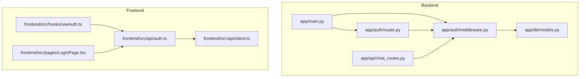
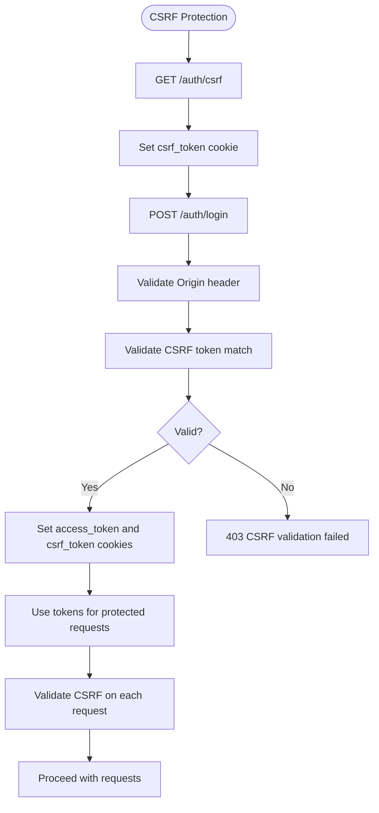
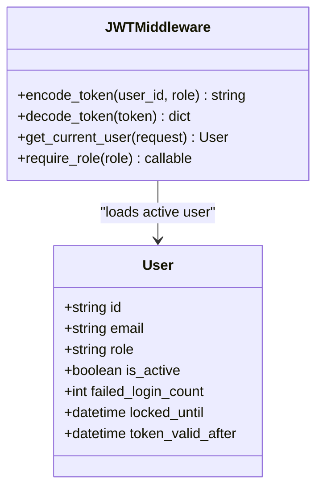
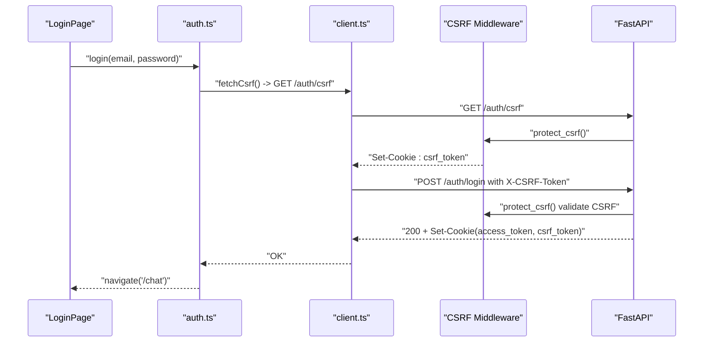
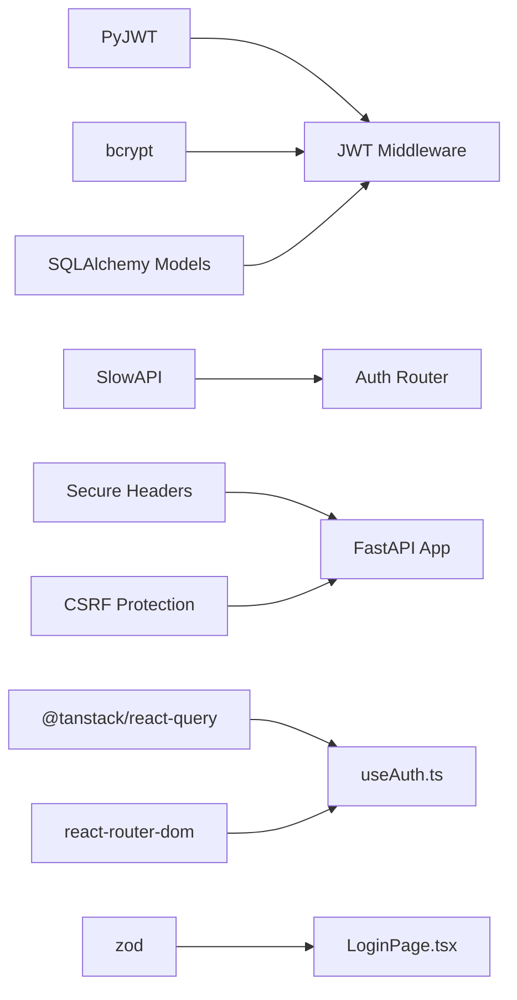

# Authentication Endpoints

<cite>
**Referenced Files in This Document**
- [router.py](file://safe4ai-pilot/app/auth/router.py)
- [middleware.py](file://safe4ai-pilot/app/auth/middleware.py)
- [main.py](file://safe4ai-pilot/app/main.py)
- [models.py](file://safe4ai-pilot/app/db/models.py)
- [auth.ts](file://safe4ai-pilot/frontend/src/api/auth.ts)
- [client.ts](file://safe4ai-pilot/frontend/src/api/client.ts)
- [useAuth.ts](file://safe4ai-pilot/frontend/src/hooks/useAuth.ts)
- [LoginPage.tsx](file://safe4ai-pilot/frontend/src/pages/LoginPage.tsx)
- [chat_routes.py](file://safe4ai-pilot/app/api/chat_routes.py)
- [config.py](file://safe4ai-pilot/app/config.py)
- [test_auth.py](file://safe4ai-pilot/tests/test_auth.py)
- [pyproject.toml](file://safe4ai-pilot/pyproject.toml)
</cite>

## Update Summary
**Changes Made**
- Added new GET /auth/csrf endpoint for CSRF token generation
- Enhanced authentication flow with CSRF token requirements
- Updated frontend integration to automatically fetch CSRF tokens before login attempts
- Added CSRF protection middleware with double-submit token validation
- Updated security considerations to include CSRF protection measures

## Table of Contents
1. [Introduction](#introduction)
2. [Project Structure](#project-structure)
3. [Core Components](#core-components)
4. [Architecture Overview](#architecture-overview)
5. [Detailed Component Analysis](#detailed-component-analysis)
6. [Dependency Analysis](#dependency-analysis)
7. [Performance Considerations](#performance-considerations)
8. [Troubleshooting Guide](#troubleshooting-guide)
9. [Conclusion](#conclusion)
10. [Appendices](#appendices)

## Introduction
This document provides comprehensive API documentation for authentication endpoints focused on user login, logout, token management, and access control. It covers JWT token generation, refresh mechanisms, session handling, middleware for authentication and authorization, CSRF protection, request/response schemas, authentication flow, security considerations, rate limiting policies, error handling patterns, and practical client-side examples for token storage and renewal. It also documents CORS policies, CSRF protection posture, and security headers applied during authentication.

## Project Structure
Authentication is implemented in the backend FastAPI application under app/auth, with supporting database models and middleware. Frontend client-side integration is implemented in the React SPA under frontend/src/api and frontend/src/hooks.



**Diagram sources**
- [main.py](file://safe4ai-pilot/app/main.py)
- [router.py](file://safe4ai-pilot/app/auth/router.py)
- [middleware.py](file://safe4ai-pilot/app/auth/middleware.py)
- [models.py](file://safe4ai-pilot/app/db/models.py)
- [chat_routes.py](file://safe4ai-pilot/app/api/chat_routes.py)
- [auth.ts](file://safe4ai-pilot/frontend/src/api/auth.ts)
- [client.ts](file://safe4ai-pilot/frontend/src/api/client.ts)
- [useAuth.ts](file://safe4ai-pilot/frontend/src/hooks/useAuth.ts)
- [LoginPage.tsx](file://safe4ai-pilot/frontend/src/pages/LoginPage.tsx)

**Section sources**
- [main.py](file://safe4ai-pilot/app/main.py)
- [router.py](file://safe4ai-pilot/app/auth/router.py)
- [middleware.py](file://safe4ai-pilot/app/auth/middleware.py)
- [models.py](file://safe4ai-pilot/app/db/models.py)
- [chat_routes.py](file://safe4ai-pilot/app/api/chat_routes.py)
- [auth.ts](file://safe4ai-pilot/frontend/src/api/auth.ts)
- [client.ts](file://safe4ai-pilot/frontend/src/api/client.ts)
- [useAuth.ts](file://safe4ai-pilot/frontend/src/hooks/useAuth.ts)
- [LoginPage.tsx](file://safe4ai-pilot/frontend/src/pages/LoginPage.tsx)

## Core Components
- Authentication router: Provides /auth/login, /auth/logout, and /auth/csrf endpoints with rate limiting and brute-force protections.
- JWT middleware: Encodes/decodes tokens, verifies passwords, extracts current user, and enforces role-based access control.
- CSRF protection middleware: Implements double-submit token validation for all authenticated requests and login attempts.
- Protected routes: Chat endpoints depend on authenticated users via middleware.
- Frontend auth API: Wraps fetch with credentials and exposes login/logout/me helpers with automatic CSRF token fetching.
- Security headers and CORS: Enforced globally via middleware and configured origins.

**Section sources**
- [router.py](file://safe4ai-pilot/app/auth/router.py)
- [middleware.py](file://safe4ai-pilot/app/auth/middleware.py)
- [main.py](file://safe4ai-pilot/app/main.py)
- [chat_routes.py](file://safe4ai-pilot/app/api/chat_routes.py)
- [auth.ts](file://safe4ai-pilot/frontend/src/api/auth.ts)
- [client.ts](file://safe4ai-pilot/frontend/src/api/client.ts)

## Architecture Overview
The authentication flow integrates backend endpoints, middleware, and frontend client with enhanced CSRF protection. Tokens are stored as HTTP-only cookies to mitigate XSS risks. Access to protected resources depends on a valid, non-expired JWT present in the cookie, with CSRF double-submit tokens for additional security.

```mermaid
sequenceDiagram
participant FE as "Frontend Client"
participant API as "FastAPI App"
participant CSRF as "CSRF Middleware"
participant Auth as "Auth Router"
participant MW as "JWT Middleware"
participant DB as "Database"
FE->>API : "GET /auth/csrf"
API->>CSRF : "protect_csrf()"
CSRF->>Auth : "get_csrf_token()"
Auth-->>FE : "Set-Cookie : csrf_token=token; HttpOnly=false; SameSite=Strict"
FE->>API : "POST /auth/login" with {email,password} and X-CSRF-Token header
API->>CSRF : "protect_csrf()"
CSRF->>CSRF : "validate CSRF token match"
CSRF->>Auth : "login()"
Auth->>DB : "query user by email"
Auth->>Auth : "verify password (timing-safe)"
Auth->>Auth : "update lockout counters if needed"
Auth-->>FE : "Set-Cookie : access_token=JWT; HttpOnly; SameSite=Strict; Secure"
note over FE,API : "Tokens stored in browser cookies"
FE->>API : "Protected request with Cookie and X-CSRF-Token"
API->>CSRF : "protect_csrf()"
CSRF->>CSRF : "validate CSRF token match"
API->>MW : "get_current_user()"
MW->>MW : "decode_token(secret_key, HS256)"
MW->>DB : "lookup user by sub"
MW-->>API : "User object"
API-->>FE : "200 OK or 401/403"
```

**Diagram sources**
- [router.py](file://safe4ai-pilot/app/auth/router.py)
- [middleware.py](file://safe4ai-pilot/app/auth/middleware.py)
- [main.py](file://safe4ai-pilot/app/main.py)
- [models.py](file://safe4ai-pilot/app/db/models.py)

## Detailed Component Analysis

### Authentication Endpoints
- Route: GET /auth/csrf
  - Purpose: Generate and return a pre-login CSRF token for double-submit protection.
  - Response: 200 with JSON containing csrf_token field.
  - Cookie: Sets csrf_token cookie with max age 300 seconds, HttpOnly=false, SameSite=Strict, Secure based on HTTPS enforcement.
  - Usage: Must be called before POST /auth/login to establish CSRF protection.

- Route: POST /auth/login
  - Purpose: Authenticate user and issue HTTP-only JWT and CSRF cookies.
  - Rate limiting: 10 per minute via SlowAPI.
  - CSRF requirement: Requires X-CSRF-Token header matching csrf_token cookie.
  - Password policy: Rejects passwords shorter than 12 characters.
  - Brute-force protection: Tracks failed attempts and locks accounts temporarily.
  - Response: 200 with message; sets access_token and csrf_token cookies with max age, HttpOnly for JWT, SameSite=Strict, and Secure based on HTTPS enforcement.
  - Errors: 401 for invalid credentials; 429 when account locked; 403 for CSRF validation failure.

- Route: POST /auth/logout
  - Purpose: Clear JWT and CSRF cookies to log out.
  - CSRF requirement: Requires X-CSRF-Token header matching csrf_token cookie.
  - Response: 200 with message; sets access_token and csrf_token with max-age=0.

- Route: GET /me
  - Purpose: Return authenticated user profile (role, email, activity status).
  - Access: Requires valid access_token cookie and CSRF token.
  - Implementation: Uses get_current_user dependency.

**Updated** Added CSRF token generation endpoint and enhanced CSRF requirements for all authentication endpoints.

**Section sources**
- [router.py](file://safe4ai-pilot/app/auth/router.py)
- [auth.ts](file://safe4ai-pilot/frontend/src/api/auth.ts)
- [useAuth.ts](file://safe4ai-pilot/frontend/src/hooks/useAuth.ts)

### CSRF Protection System
- Double-submit token pattern: CSRF tokens are stored in both cookies and headers for validation.
- Pre-login token generation: GET /auth/csrf endpoint establishes CSRF protection before login attempts.
- Origin validation: Login requests require valid Origin header matching allowed origins list.
- Middleware enforcement: protect_csrf middleware validates CSRF tokens for all authenticated requests and login attempts.
- Token lifecycle: CSRF tokens are cleared on logout and have shorter expiration (300 seconds) than JWT tokens.



**Diagram sources**
- [router.py](file://safe4ai-pilot/app/auth/router.py)
- [main.py](file://safe4ai-pilot/app/main.py)

**Section sources**
- [router.py](file://safe4ai-pilot/app/auth/router.py)
- [main.py](file://safe4ai-pilot/app/main.py)

### JWT Token Management
- Encoding: HS256-signed JWT with subject (user ID), role, issued-at, and expiration (hours).
- Decoding: Validates signature and claims; rejects tampered tokens.
- Storage: Cookies only (not localStorage/sessionStorage) to reduce XSS exposure.
- Expiration: 8 hours; no built-in refresh endpoint; clients should re-authenticate after expiry.
- Dual cookie strategy: Separate access_token (HttpOnly) and csrf_token (non-HttpOnly) cookies for different security properties.


**Diagram sources**
- [middleware.py](file://safe4ai-pilot/app/auth/middleware.py)
- [router.py](file://safe4ai-pilot/app/auth/router.py)

**Section sources**
- [middleware.py](file://safe4ai-pilot/app/auth/middleware.py)
- [router.py](file://safe4ai-pilot/app/auth/router.py)

### Access Control and Authorization
- Role enforcement: require_role(role) dependency ensures only users with the specified role can access protected endpoints.
- Current user extraction: get_current_user validates token and ensures the user is active.
- Protected endpoints: Chat routes depend on get_current_user to authorize requests.
- Token revocation: logout endpoint updates user.token_valid_after to invalidate previously issued tokens.



**Diagram sources**
- [middleware.py](file://safe4ai-pilot/app/auth/middleware.py)
- [models.py](file://safe4ai-pilot/app/db/models.py)

**Section sources**
- [middleware.py](file://safe4ai-pilot/app/auth/middleware.py)
- [models.py](file://safe4ai-pilot/app/db/models.py)
- [chat_routes.py](file://safe4ai-pilot/app/api/chat_routes.py)

### Request and Response Schemas
- CSRF Token Request (GET /auth/csrf)
  - Response: {"csrf_token": "string"}
  - Headers/Cookies: Set-Cookie: csrf_token=...; HttpOnly=false; SameSite=Strict; Secure=<enforce_https>

- LoginRequest (JSON body)
  - Fields: email (string), password (string)
  - Validation: Frontend enforces non-empty fields; backend enforces minimum password length and timing-safe verification.

- Login response (JSON)
  - Body: {"message": "logged in"}
  - Headers/Cookies: Set-Cookie: access_token=...; HttpOnly; SameSite=Strict; Secure=<enforce_https>
  - Additional: Set-Cookie: csrf_token=...; HttpOnly=false; SameSite=Strict; Secure=<enforce_https>

- Logout response (JSON)
  - Body: {"message": "logged out"}
  - Headers: Set-Cookie: access_token=; Max-Age=0, csrf_token=; Max-Age=0

- /me response (JSON)
  - Fields: id (string), email (string), role ("admin"|"pilot_user"), is_active (boolean)

- Protected resource access
  - Header: Cookie: access_token=JWT, csrf_token=token; X-CSRF-Token: token
  - Success: 200 with resource data
  - Errors: 401 Not authenticated, 403 Forbidden (CSRF/validation failure)

**Updated** Added CSRF token requirements and dual cookie strategy for enhanced security.

**Section sources**
- [router.py](file://safe4ai-pilot/app/auth/router.py)
- [auth.ts](file://safe4ai-pilot/frontend/src/api/auth.ts)
- [models.py](file://safe4ai-pilot/app/db/models.py)

### Authentication Flow
- Client-side login flow
  - Automatically fetches CSRF token via GET /auth/csrf before login attempts.
  - Posts to /auth/login with both cookie and X-CSRF-Token header.
  - On success, invalidates local queries and navigates to chat.
  - On failure, displays a user-friendly error.

- Protected resource access
  - Frontend fetches /me and protected endpoints with credentials: include.
  - Backend middleware extracts token from cookie, validates CSRF, and authorizes.



**Diagram sources**
- [LoginPage.tsx](file://safe4ai-pilot/frontend/src/pages/LoginPage.tsx)
- [auth.ts](file://safe4ai-pilot/frontend/src/api/auth.ts)
- [client.ts](file://safe4ai-pilot/frontend/src/api/client.ts)
- [router.py](file://safe4ai-pilot/app/auth/router.py)
- [main.py](file://safe4ai-pilot/app/main.py)

**Section sources**
- [LoginPage.tsx](file://safe4ai-pilot/frontend/src/pages/LoginPage.tsx)
- [auth.ts](file://safe4ai-pilot/frontend/src/api/auth.ts)
- [client.ts](file://safe4ai-pilot/frontend/src/api/client.ts)
- [router.py](file://safe4ai-pilot/app/auth/router.py)

### Security Considerations
- Token storage: Cookies only (HttpOnly for JWT, non-HttpOnly for CSRF); SameSite=Strict, Secure when enforced.
- Password hashing: bcrypt for storage; timing-safe verification to prevent timing attacks.
- Brute-force protection: Tracks failed attempts and locks accounts for a fixed period.
- Rate limiting: 10/minute on /auth/login; global rate-limit exceeded handler.
- CSRF protection: Double-submit token pattern with middleware validation; pre-login token generation.
- Origin validation: Login requests require valid Origin header matching allowed origins list.
- CORS: Configured origins list; credentials allowed; Content-Type and X-CSRF-Token allowed.
- Security headers: Strict-Transport-Security, X-Frame-Options, X-Content-Type-Options, Referrer-Policy, Permissions-Policy applied via middleware.
- Token revocation: Logout updates token_valid_after to invalidate previously issued tokens.

**Updated** Enhanced with comprehensive CSRF protection measures and dual-cookie strategy.

**Section sources**
- [router.py](file://safe4ai-pilot/app/auth/router.py)
- [middleware.py](file://safe4ai-pilot/app/auth/middleware.py)
- [main.py](file://safe4ai-pilot/app/main.py)
- [config.py](file://safe4ai-pilot/app/config.py)

### Rate Limiting Policies
- /auth/login: 10 requests per minute per remote address.
- Chat endpoints: 30 per minute per IP.
- Exceeded limits return 429 with a standardized error handled by the application.

**Updated** Increased rate limit from 5 to 10 requests per minute for login endpoint.

**Section sources**
- [router.py](file://safe4ai-pilot/app/auth/router.py)
- [chat_routes.py](file://safe4ai-pilot/app/api/chat_routes.py)
- [main.py](file://safe4ai-pilot/app/main.py)

### Error Handling Patterns
- Invalid credentials: 401 with a generic message; password too short: 401.
- Account locked: 429 with lockout message.
- CSRF validation failure: 403 with "CSRF validation failed" message.
- Missing/invalid/expired token: 401 Not authenticated.
- Role mismatch: 403 Forbidden.
- Frontend catches errors and surfaces user-friendly messages.

**Updated** Added CSRF validation failure handling and enhanced error responses.

**Section sources**
- [router.py](file://safe4ai-pilot/app/auth/router.py)
- [middleware.py](file://safe4ai-pilot/app/auth/middleware.py)
- [LoginPage.tsx](file://safe4ai-pilot/frontend/src/pages/LoginPage.tsx)
- [test_auth.py](file://safe4ai-pilot/tests/test_auth.py)

### Practical Client-Side Examples
- Token storage: Dual cookie strategy - cookies only; credentials: include ensures cookies are sent automatically.
- CSRF integration: Automatic CSRF token fetching before login attempts; X-CSRF-Token header management.
- Renewal strategy: No automatic refresh; upon 401, redirect to login page and re-authenticate.
- Logout: Call /auth/logout; client clears local cache and navigates to login.

**Updated** Enhanced with automatic CSRF token fetching and dual-cookie management.

**Section sources**
- [client.ts](file://safe4ai-pilot/frontend/src/api/client.ts)
- [auth.ts](file://safe4ai-pilot/frontend/src/api/auth.ts)
- [useAuth.ts](file://safe4ai-pilot/frontend/src/hooks/useAuth.ts)
- [router.py](file://safe4ai-pilot/app/auth/router.py)

## Dependency Analysis
- Backend dependencies
  - PyJWT for encoding/decoding tokens.
  - bcrypt for password hashing.
  - SlowAPI for rate limiting.
  - Secure headers library for HTTP security headers.
  - SQLAlchemy models for user and session persistence.

- Frontend dependencies
  - React Query for caching and invalidation.
  - React Router for navigation.
  - Zod for form validation.



**Diagram sources**
- [middleware.py](file://safe4ai-pilot/app/auth/middleware.py)
- [router.py](file://safe4ai-pilot/app/auth/router.py)
- [main.py](file://safe4ai-pilot/app/main.py)
- [models.py](file://safe4ai-pilot/app/db/models.py)
- [useAuth.ts](file://safe4ai-pilot/frontend/src/hooks/useAuth.ts)
- [LoginPage.tsx](file://safe4ai-pilot/frontend/src/pages/LoginPage.tsx)
- [pyproject.toml](file://safe4ai-pilot/pyproject.toml)

**Section sources**
- [pyproject.toml](file://safe4ai-pilot/pyproject.toml)
- [middleware.py](file://safe4ai-pilot/app/auth/middleware.py)
- [router.py](file://safe4ai-pilot/app/auth/router.py)
- [main.py](file://safe4ai-pilot/app/main.py)
- [models.py](file://safe4ai-pilot/app/db/models.py)
- [useAuth.ts](file://safe4ai-pilot/frontend/src/hooks/useAuth.ts)
- [LoginPage.tsx](file://safe4ai-pilot/frontend/src/pages/LoginPage.tsx)

## Performance Considerations
- Token verification is constant-time and inexpensive; keep payloads minimal.
- Rate limiting prevents abuse but may impact legitimate users under load; tune thresholds as needed.
- Using cookies avoids extra headers and reduces payload sizes for protected requests.
- CSRF validation adds minimal overhead but significantly improves security.
- Consider moving to short-lived access tokens plus a separate long-lived refresh mechanism if extended sessions are required.

## Troubleshooting Guide
- 401 Unauthorized on login
  - Cause: Wrong password or insufficient length; backend rejects short passwords.
  - Action: Ensure password meets minimum length; retry login.

- 429 Too Many Requests
  - Cause: Account locked due to repeated failures.
  - Action: Wait for lock window to expire; avoid repeated attempts.

- 403 CSRF validation failed
  - Cause: Missing or mismatched X-CSRF-Token header; CSRF token cookie not present.
  - Action: Ensure GET /auth/csrf is called before login; verify CSRF token cookie and header match.

- 401 Not authenticated on protected routes
  - Cause: Missing or expired access_token cookie.
  - Action: Re-login; ensure cookies are enabled and SameSite policy allows cross-site subdomains if applicable.

- 403 Forbidden
  - Cause: Insufficient role for the requested endpoint.
  - Action: Verify user role; contact administrator if incorrect.

- CORS or CSRF issues
  - Cause: Origins mismatch or missing credentials support.
  - Action: Confirm allowed_origins and credentials inclusion; ensure SameSite=Strict is acceptable.

**Updated** Added CSRF validation failure troubleshooting and enhanced error diagnosis.

**Section sources**
- [router.py](file://safe4ai-pilot/app/auth/router.py)
- [middleware.py](file://safe4ai-pilot/app/auth/middleware.py)
- [main.py](file://safe4ai-pilot/app/main.py)
- [test_auth.py](file://safe4ai-pilot/tests/test_auth.py)

## Conclusion
The authentication system provides robust login/logout flows with JWT cookies, CSRF protection, brute-force protections, and role-based access control. It leverages FastAPI middleware and rate limiting to maintain security and reliability. Frontend integration uses cookies and React Query for seamless user experience with automatic CSRF token management. The enhanced CSRF protection through double-submit tokens significantly improves defense against cross-site request forgery attacks while maintaining usability.

## Appendices

### CORS Policy Summary
- Allowed origins: Derived from configuration; supports multiple origins.
- Credentials: Allowed.
- Methods: GET, POST, PUT, DELETE.
- Headers: Content-Type, X-CSRF-Token.

**Updated** Added X-CSRF-Token to allowed headers for CSRF protection.

**Section sources**
- [main.py](file://safe4ai-pilot/app/main.py)
- [config.py](file://safe4ai-pilot/app/config.py)

### Security Headers Applied
- Strict-Transport-Security, X-Frame-Options, X-Content-Type-Options, Referrer-Policy, Permissions-Policy.
- Enforced via middleware on every request.

**Section sources**
- [main.py](file://safe4ai-pilot/app/main.py)

### CSRF Protection Details
- Double-submit token pattern: CSRF tokens stored in both cookies and headers.
- Pre-login token generation: GET /auth/csrf endpoint establishes CSRF protection.
- Origin validation: Login requests require valid Origin header.
- Middleware enforcement: protect_csrf middleware validates CSRF tokens for all requests.
- Token lifecycle: CSRF tokens cleared on logout with 300-second expiration.

**New Section** Added comprehensive CSRF protection documentation.

**Section sources**
- [router.py](file://safe4ai-pilot/app/auth/router.py)
- [main.py](file://safe4ai-pilot/app/main.py)
- [test_auth.py](file://safe4ai-pilot/tests/test_auth.py)