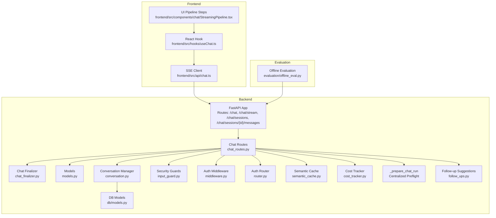
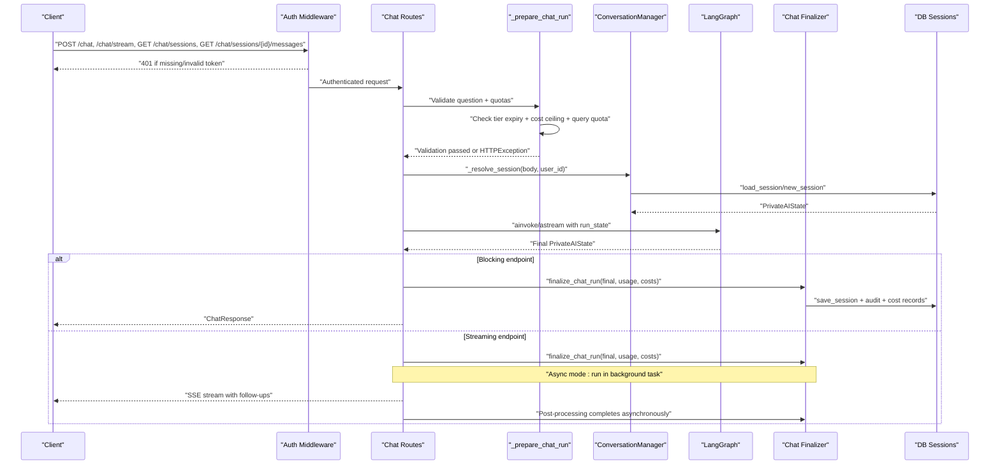
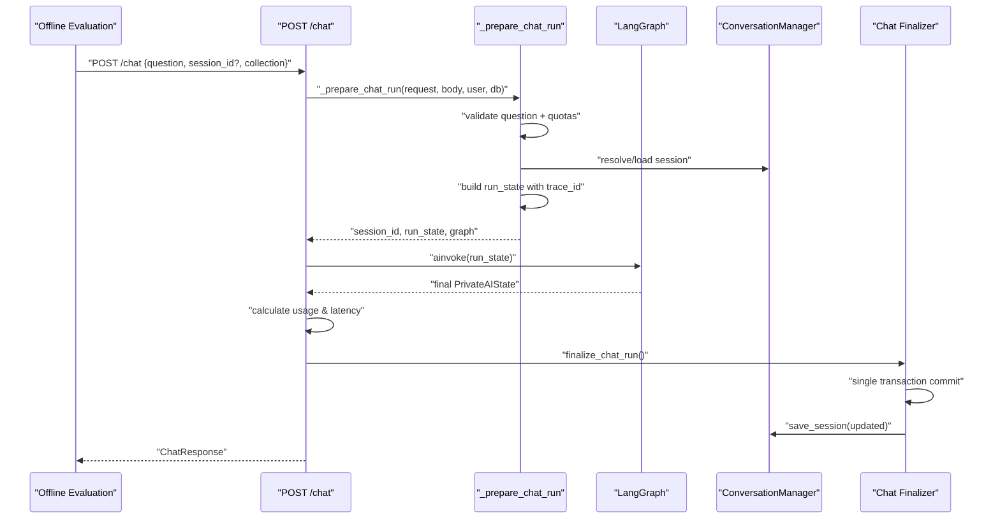
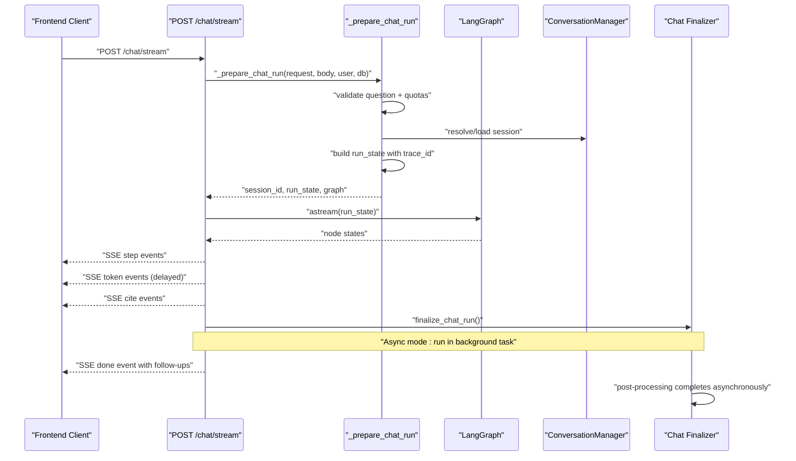
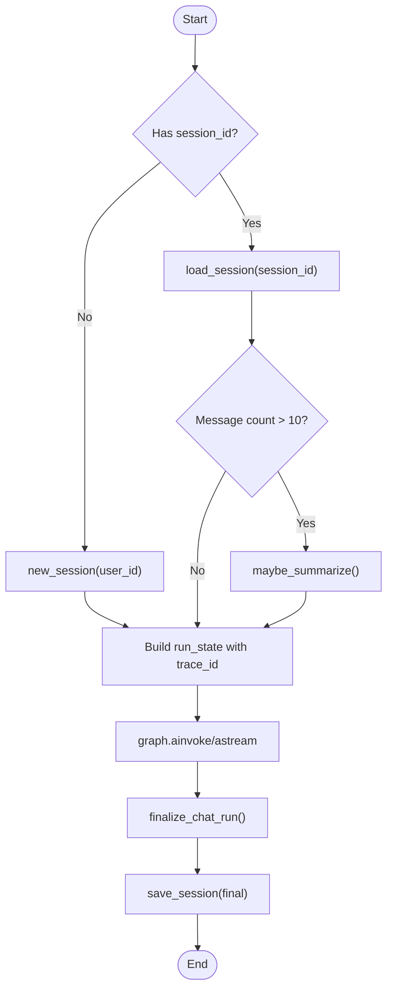
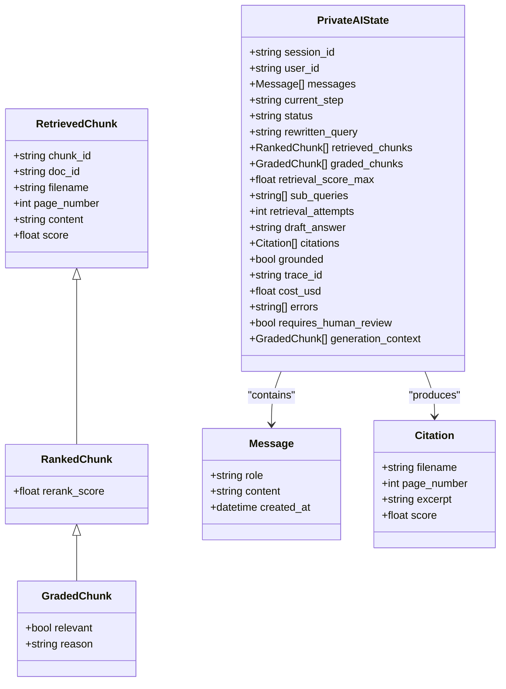
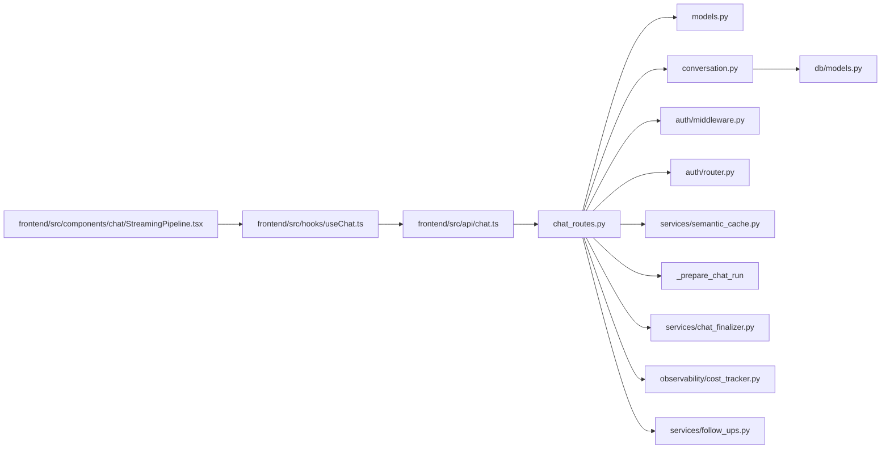

# Chat Endpoints

<cite>
**Referenced Files in This Document**
- [chat_routes.py](file://safe4ai-pilot/app/api/chat_routes.py)
- [chat_finalizer.py](file://safe4ai-pilot/app/services/chat_finalizer.py)
- [models.py](file://safe4ai-pilot/app/models.py)
- [conversation.py](file://safe4ai-pilot/app/services/conversation.py)
- [input_guard.py](file://safe4ai-pilot/app/security/input_guard.py)
- [middleware.py](file://safe4ai-pilot/app/auth/middleware.py)
- [router.py](file://safe4ai-pilot/app/auth/router.py)
- [chat.ts](file://safe4ai-pilot/frontend/src/api/chat.ts)
- [useChat.ts](file://safe4ai-pilot/frontend/src/hooks/useChat.ts)
- [StreamingPipeline.tsx](file://safe4ai-pilot/frontend/src/components/chat/StreamingPipeline.tsx)
- [offline_eval.py](file://safe4ai-pilot/evaluation/offline_eval.py)
- [test_chat.py](file://safe4ai-pilot/tests/test_chat.py)
- [semantic_cache.py](file://safe4ai-pilot/app/services/semantic_cache.py)
- [models.py (db)](file://safe4ai-pilot/app/db/models.py)
- [cost_tracker.py](file://safe4ai-pilot/observability/cost_tracker.py)
- [audit_cleanup.py](file://safe4ai-pilot/scripts/audit_cleanup.py)
- [follow_ups.py](file://safe4ai-pilot/app/services/follow_ups.py)
</cite>

## Update Summary
**Changes Made**
- Added new session management endpoints: GET /chat/sessions and GET /chat/sessions/{id}/messages
- Enhanced SSE done payload with deterministic follow-up suggestions built from citations
- Improved session persistence with automatic summarization when conversation exceeds threshold
- Updated architecture to support conversation history restoration and session listing
- Enhanced error handling for session management operations

## Table of Contents
1. [Introduction](#introduction)
2. [Project Structure](#project-structure)
3. [Core Components](#core-components)
4. [Architecture Overview](#architecture-overview)
5. [Detailed Component Analysis](#detailed-component-analysis)
6. [Dependency Analysis](#dependency-analysis)
7. [Performance Considerations](#performance-considerations)
8. [Troubleshooting Guide](#troubleshooting-guide)
9. [Conclusion](#conclusion)
10. [Appendices](#appendices)

## Introduction
This document provides comprehensive API documentation for the chat endpoints that power both synchronous and streaming interactions. It covers:
- POST /chat: a blocking endpoint designed for evaluation scripts and tests
- POST /chat/stream: a Server-Sent Events (SSE) endpoint for real-time streaming responses
- **New** GET /chat/sessions: lists a user's non-empty sessions with titles and metadata
- **New** GET /chat/sessions/{id}/messages: restores conversation history from session state
- Session management and conversation persistence with automatic summarization
- Deterministic follow-up suggestions in SSE done payload
- Trace ID tracking and observability
- PrivateAIState model, citation handling, and semantic caching
- Rate limiting, input validation, and security measures
- Client-side SSE handling, error recovery, and connection management
- Centralized preflight validation through _prepare_chat_run helper function

## Project Structure
The chat endpoints are implemented in the backend FastAPI application and consumed by the React frontend. The evaluation suite uses the blocking endpoint for automated scoring. All preflight validation operations are now centralized through the _prepare_chat_run helper function. **Updated** Session management now includes dedicated endpoints for browsing and restoring conversation history.

**Diagram sources**
- [chat_routes.py:123-160](file://safe4ai-pilot/app/api/chat_routes.py#L123-L160)
- [chat_finalizer.py:14-71](file://safe4ai-pilot/app/services/chat_finalizer.py#L14-L71)
- [models.py:49-95](file://safe4ai-pilot/app/models.py#L49-L95)
- [conversation.py:26-122](file://safe4ai-pilot/app/services/conversation.py#L26-L122)
- [input_guard.py:24-49](file://safe4ai-pilot/app/security/input_guard.py#L24-L49)
- [middleware.py:51-71](file://safe4ai-pilot/app/auth/middleware.py#L51-L71)
- [router.py:39-105](file://safe4ai-pilot/app/auth/router.py#L39-L105)
- [semantic_cache.py:14-108](file://safe4ai-pilot/app/services/semantic_cache.py#L14-L108)
- [models.py (db):65-73](file://safe4ai-pilot/app/db/models.py#L65-L73)
- [cost_tracker.py:16-115](file://safe4ai-pilot/observability/cost_tracker.py#L16-L115)
- [chat.ts:21-75](file://safe4ai-pilot/frontend/src/api/chat.ts#L21-L75)
- [useChat.ts:30-93](file://safe4ai-pilot/frontend/src/hooks/useChat.ts#L30-L93)
- [StreamingPipeline.tsx:13-29](file://safe4ai-pilot/frontend/src/components/chat/StreamingPipeline.tsx#L13-L29)
- [offline_eval.py:121-134](file://safe4ai-pilot/evaluation/offline_eval.py#L121-L134)
- [follow_ups.py:15-31](file://safe4ai-pilot/app/services/follow_ups.py#L15-L31)

**Section sources**
- [chat_routes.py:1-462](file://safe4ai-pilot/app/api/chat_routes.py#L1-L462)
- [chat_finalizer.py:1-71](file://safe4ai-pilot/app/services/chat_finalizer.py#L1-L71)
- [models.py:1-95](file://safe4ai-pilot/app/models.py#L1-L95)
- [conversation.py:1-122](file://safe4ai-pilot/app/services/conversation.py#L1-L122)
- [input_guard.py:1-49](file://safe4ai-pilot/app/security/input_guard.py#L1-L49)
- [middleware.py:1-83](file://safe4ai-pilot/app/auth/middleware.py#L1-L83)
- [router.py:1-125](file://safe4ai-pilot/app/auth/router.py#L1-L125)
- [semantic_cache.py:1-108](file://safe4ai-pilot/app/services/semantic_cache.py#L1-L108)
- [models.py (db):1-182](file://safe4ai-pilot/app/db/models.py#L1-L182)
- [cost_tracker.py:1-115](file://safe4ai-pilot/observability/cost_tracker.py#L1-L115)
- [chat.ts:1-103](file://safe4ai-pilot/frontend/src/api/chat.ts#L1-L103)
- [useChat.ts:1-131](file://safe4ai-pilot/frontend/src/hooks/useChat.ts#L1-L131)
- [StreamingPipeline.tsx:1-30](file://safe4ai-pilot/frontend/src/components/chat/StreamingPipeline.tsx#L1-L30)
- [offline_eval.py:1-244](file://safe4ai-pilot/evaluation/offline_eval.py#L1-L244)
- [test_chat.py:1-462](file://safe4ai-pilot/tests/test_chat.py#L1-L462)
- [follow_ups.py:1-31](file://safe4ai-pilot/app/services/follow_ups.py#L1-L31)

## Core Components
- ChatRequest and ChatResponse define the shape of requests and synchronous responses.
- PrivateAIState encapsulates conversation state, retrieval metadata, generation context, and observability fields.
- ConversationManager handles session creation, loading, saving, and **Enhanced** automatic summarization of long conversations.
- SSE streaming endpoint emits structured events for step transitions, token deltas, citations, and completion metadata.
- **New** Session management endpoints provide programmatic access to conversation history.
- **New** Deterministic follow-up suggestions are generated from cited documents in the SSE done payload.
- Authentication middleware enforces JWT-based access and role checks.
- Rate limiting is applied via SlowAPI decorators on endpoints.
- InputGuard performs pre-processing and validation of user queries.
- **Updated** _prepare_chat_run provides centralized preflight validation with unified error handling for both endpoints.

**Section sources**
- [chat_routes.py:51-73](file://safe4ai-pilot/app/api/chat_routes.py#L51-L73)
- [chat_routes.py:123-160](file://safe4ai-pilot/app/api/chat_routes.py#L123-L160)
- [models.py:49-95](file://safe4ai-pilot/app/models.py#L49-L95)
- [conversation.py:26-122](file://safe4ai-pilot/app/services/conversation.py#L26-L122)
- [input_guard.py:24-49](file://safe4ai-pilot/app/security/input_guard.py#L24-L49)
- [middleware.py:51-71](file://safe4ai-pilot/app/auth/middleware.py#L51-L71)
- [router.py:21-22](file://safe4ai-pilot/app/auth/router.py#L21-L22)
- [chat_routes.py:407-462](file://safe4ai-pilot/app/api/chat_routes.py#L407-L462)
- [follow_ups.py:15-31](file://safe4ai-pilot/app/services/follow_ups.py#L15-L31)

## Architecture Overview
The chat system orchestrates authentication, centralized preflight validation, session resolution, graph execution, and unified post-processing. The _prepare_chat_run helper function centralizes validation logic, eliminating code duplication between endpoints. The SSE endpoint streams intermediate steps and final tokens, while the blocking endpoint returns a single aggregated response. Both endpoints now share the same preflight validation logic. **Updated** Session management endpoints provide RESTful access to conversation history, enabling users to browse and restore previous conversations.

**Diagram sources**
- [chat_routes.py:123-160](file://safe4ai-pilot/app/api/chat_routes.py#L123-L160)
- [chat_routes.py:170-216](file://safe4ai-pilot/app/api/chat_routes.py#L170-L216)
- [chat_routes.py:224-360](file://safe4ai-pilot/app/api/chat_routes.py#L224-L360)
- [chat_finalizer.py:14-71](file://safe4ai-pilot/app/services/chat_finalizer.py#L14-L71)
- [conversation.py:42-69](file://safe4ai-pilot/app/services/conversation.py#L42-L69)
- [middleware.py:51-71](file://safe4ai-pilot/app/auth/middleware.py#L51-L71)
- [models.py:49-95](file://safe4ai-pilot/app/models.py#L49-L95)

## Detailed Component Analysis

### POST /chat (Blocking)
Purpose: Provides a synchronous response suitable for evaluation scripts and tests.

- Endpoint: POST /chat
- Authentication: Required via JWT cookie
- Rate Limit: 30 per minute
- Request Body (ChatRequest):
  - question: string (max length 2048)
  - session_id: string | null
  - collection: string (default "default")
- Response Body (ChatResponse):
  - answer: string
  - citations: array of Citation
  - session_id: string
  - trace_id: string
  - cache_hit: boolean (default false)
- Error Responses:
  - 401 Not Authenticated (missing/invalid token)
  - 422 Unprocessable Entity (empty question)
  - 503 Service Unavailable (graph not initialized)
  - 500 Internal Server Error (graph invocation failure)

**Updated Processing Logic:**
- **Centralized preflight validation via _prepare_chat_run()**
  - Validates question length and emptiness
  - Enforces tier expiry, cost ceiling, and query quota checks
  - Resolves or creates a session using ConversationManager
  - Builds run state with a fresh trace_id and initial message
- Executes graph.ainvoke to obtain final state
- Calculates usage and latency metrics
- **Centralized post-processing via finalize_chat_run()**
  - Persists assistant reply to session
  - Creates audit log entry
  - Records cost tracking data
  - Commits all changes in a single transaction
- Returns ChatResponse

**Diagram sources**
- [offline_eval.py:121-134](file://safe4ai-pilot/evaluation/offline_eval.py#L121-L134)
- [chat_routes.py:170-216](file://safe4ai-pilot/app/api/chat_routes.py#L170-L216)
- [chat_routes.py:123-160](file://safe4ai-pilot/app/api/chat_routes.py#L123-L160)
- [chat_finalizer.py:14-71](file://safe4ai-pilot/app/services/chat_finalizer.py#L14-L71)
- [conversation.py:42-69](file://safe4ai-pilot/app/services/conversation.py#L42-L69)

**Section sources**
- [chat_routes.py:170-216](file://safe4ai-pilot/app/api/chat_routes.py#L170-L216)
- [test_chat.py:80-122](file://safe4ai-pilot/tests/test_chat.py#L80-L122)
- [offline_eval.py:121-134](file://safe4ai-pilot/evaluation/offline_eval.py#L121-L134)

### POST /chat/stream (SSE Streaming)
Purpose: Streams real-time updates using Server-Sent Events for step transitions, token deltas, citations, and completion metadata.

- Endpoint: POST /chat/stream
- Authentication: Required via JWT cookie
- Rate Limit: 30 per minute
- Request Body (same as blocking endpoint)
- Event Stream (Server-Sent Events):
  - event: step
    - data: { name: "embed"|"retrieve"|"rerank"|"generate", state: "pending"|"active"|"done", t: number }
  - event: token
    - data: { delta: string }
  - event: cite
    - data: { id: string, file: string, page: number, score: number, excerpt: string }
  - event: done
    - data: { traceId: string, latencyMs: number, cache: boolean, model: string, kRetrieved: number, sessionId: string, error?: string, followUps: string[] }

**Updated Client-Side Handling (Frontend):**
- Uses fetch with credentials and SSE parsing
- Maintains step states and accumulates tokens into assistant message
- Updates citations and final trust metrics upon done
- Supports AbortController for cancellation
- **Enhanced error handling for post-processing failures**
- **New** Processes deterministic follow-up suggestions from the done event

**Diagram sources**
- [chat_routes.py:224-360](file://safe4ai-pilot/app/api/chat_routes.py#L224-L360)
- [chat_routes.py:123-160](file://safe4ai-pilot/app/api/chat_routes.py#L123-L160)
- [chat_finalizer.py:14-71](file://safe4ai-pilot/app/services/chat_finalizer.py#L14-L71)
- [chat.ts:21-103](file://safe4ai-pilot/frontend/src/api/chat.ts#L21-L103)
- [useChat.ts:30-131](file://safe4ai-pilot/frontend/src/hooks/useChat.ts#L30-L131)

**Section sources**
- [chat_routes.py:224-360](file://safe4ai-pilot/app/api/chat_routes.py#L224-L360)
- [chat_finalizer.py:14-71](file://safe4ai-pilot/app/services/chat_finalizer.py#L14-L71)
- [chat.ts:1-103](file://safe4ai-pilot/frontend/src/api/chat.ts#L1-L103)
- [useChat.ts:1-131](file://safe4ai-pilot/frontend/src/hooks/useChat.ts#L1-L131)
- [StreamingPipeline.tsx:1-30](file://safe4ai-pilot/frontend/src/components/chat/StreamingPipeline.tsx#L1-L30)

### GET /chat/sessions (Session Listing)
**New Section** - Lists a user's non-empty sessions with titles and metadata for sidebar navigation.

- Endpoint: GET /chat/sessions
- Authentication: Required via JWT cookie
- Rate Limit: 100 per minute
- Query Parameters:
  - limit: integer (default 30, min 1, max 100)
- Response: array of SessionSummary
  - session_id: string
  - title: string (first user message content, truncated to 80 chars)
  - updated_at: datetime | null
  - message_count: integer
- Behavior:
  - Returns only sessions with actual messages (non-empty)
  - Orders by most recently updated first
  - Limits results by the limit parameter

**Section sources**
- [chat_routes.py:407-442](file://safe4ai-pilot/app/api/chat_routes.py#L407-L442)
- [test_chat.py:410-430](file://safe4ai-pilot/tests/test_chat.py#L410-L430)

### GET /chat/sessions/{session_id}/messages (Session Restoration)
**New Section** - Restores conversation history from a specific session for resuming discussions.

- Endpoint: GET /chat/sessions/{session_id}/messages
- Authentication: Required via JWT cookie
- Rate Limit: 100 per minute
- Path Parameters:
  - session_id: string (UUID format)
- Response: SessionMessagesResponse
  - session_id: string
  - messages: array of SessionMessage
    - role: string ("user" | "assistant")
    - content: string
- Behavior:
  - Returns only owned sessions (404 for missing or foreign sessions)
  - Excludes system messages from restored history
  - Filters to user and assistant messages only

**Section sources**
- [chat_routes.py:443-462](file://safe4ai-pilot/app/api/chat_routes.py#L443-L462)
- [test_chat.py:432-462](file://safe4ai-pilot/tests/test_chat.py#L432-L462)

### Centralized Preflight Validation with _prepare_chat_run
**New Section** - The _prepare_chat_run helper function centralizes preflight validation logic for both chat endpoints.

#### Functionality
- **Unified Validation**: Validates question content, enforces tier expiry, cost ceiling, and query quota checks
- **Error Consistency**: Raises HTTPException with standardized error codes for all validation failures
- **Session Resolution**: Handles session loading/creation with proper ownership validation
- **State Preparation**: Builds run state with fresh trace_id and initial message structure
- **Graph Access**: Ensures AI pipeline graph is available before proceeding

#### Validation Flow
1. **Question Validation**: Checks for non-empty questions with proper stripping
2. **Tier Validation**: Verifies user tier is active and not expired
3. **Cost Validation**: Ensures daily/monthly cost ceilings are not exceeded
4. **Quota Validation**: Confirms query quotas are within limits
5. **Graph Availability**: Verifies AI pipeline graph is initialized
6. **Session Management**: Loads existing session or creates new one with proper validation
7. **Trace Generation**: Creates unique trace_id for observability

#### Error Handling
- **422 Unprocessable Entity**: Empty or invalid questions
- **403 Forbidden**: Expired or invalid user tiers
- **429 Too Many Requests**: Cost ceiling or quota exceeded
- **503 Service Unavailable**: AI pipeline not ready
- **404 Not Found**: Session not found or owned by another user

**Section sources**
- [chat_routes.py:123-160](file://safe4ai-pilot/app/api/chat_routes.py#L123-L160)

### Session Management and Conversation Persistence
- Session Creation:
  - new_session generates a UUID and persists an initial PrivateAIState
- Session Loading:
  - load_session retrieves and reconstructs PrivateAIState from stored JSON
- Session Saving:
  - **Updated** Now handled centrally through chat_finalizer during post-processing
  - **Enhanced** Automatic summarization when conversation exceeds threshold
- Optional Summarization:
  - **New** maybe_summarize can automatically summarize long histories using an external model
  - Threshold: 10 messages triggers summarization
  - Preserves recent messages while replacing older conversation with summary
- Frontend Session Tracking:
  - The done event supplies sessionId; the hook stores it for subsequent requests

**Diagram sources**
- [chat_routes.py:75-91](file://safe4ai-pilot/app/api/chat_routes.py#L75-L91)
- [chat_finalizer.py:27-36](file://safe4ai-pilot/app/services/chat_finalizer.py#L27-L36)
- [conversation.py:30-69](file://safe4ai-pilot/app/services/conversation.py#L30-L69)
- [conversation.py:75-122](file://safe4ai-pilot/app/services/conversation.py#L75-L122)

**Section sources**
- [conversation.py:26-122](file://safe4ai-pilot/app/services/conversation.py#L26-L122)
- [models.py (db):65-73](file://safe4ai-pilot/app/db/models.py#L65-L73)
- [useChat.ts:76-82](file://safe4ai-pilot/frontend/src/hooks/useChat.ts#L76-L82)

### Deterministic Follow-Up Suggestions
**New Section** - Generates contextual follow-up questions from cited documents without additional LLM calls.

#### Functionality
- **Template-Based Generation**: Creates suggestions from actual cited documents
- **Deterministic Output**: No hallucinations, always returns valid suggestions
- **Contextual Relevance**: Suggestions reference the specific documents that provided answers
- **Limit Control**: Maximum 3 suggestions per response

#### Generation Logic
1. **Empty Check**: Returns empty array when no citations exist
2. **Unique Document Extraction**: Identifies distinct filenames from citations
3. **Template Application**: Applies predefined templates to document names
4. **Limit Enforcement**: Caps at 3 suggestions maximum

#### SSE Integration
- **Enhanced Done Payload**: Includes "followUps" array in SSE done event
- **Frontend Usage**: Enables contextual suggestion UI in chat interfaces
- **User Experience**: Provides natural conversation continuation options

**Section sources**
- [follow_ups.py:15-31](file://safe4ai-pilot/app/services/follow_ups.py#L15-L31)
- [chat_routes.py:358-366](file://safe4ai-pilot/app/api/chat_routes.py#L358-L366)

### PrivateAIState Model
PrivateAIState captures the conversation state and pipeline metadata. Key fields include:
- Identity: session_id, user_id
- Messages: list of Message with role, content, created_at
- Pipeline state: current_step, status
- Retrieval: rewritten_query, retrieved_chunks, graded_chunks, retrieval_score_max, sub_queries, retrieval_attempts
- Generation: draft_answer, citations, grounded, generation_context
- Observability: trace_id, cost_usd, errors, requires_human_review
- Limits and guards: retrieval_attempts as a self-correction loop guard

**Diagram sources**
- [models.py:7-95](file://safe4ai-pilot/app/models.py#L7-L95)

**Section sources**
- [models.py:49-95](file://safe4ai-pilot/app/models.py#L49-L95)

### Citation Handling
- During streaming, the server emits cite events with id, file, page, and score.
- The frontend accumulates citations into the assistant message.
- The blocking endpoint returns a citations array in ChatResponse.
- **Enhanced** SSE done payload includes deterministic follow-up suggestions derived from citations.

**Section sources**
- [chat_routes.py:287-294](file://safe4ai-pilot/app/api/chat_routes.py#L287-L294)
- [useChat.ts:72-75](file://safe4ai-pilot/frontend/src/hooks/useChat.ts#L72-L75)
- [chat_routes.py:358-366](file://safe4ai-pilot/app/api/chat_routes.py#L358-L366)

### Caching Mechanisms
- Semantic Cache:
  - Embeddings are computed via Ollama and stored with vector similarity indexing
  - Lookup uses pgvector distance operator with a configurable threshold
  - Store persists response, citations, and source identifiers
  - Invalidate by document removes cache entries referencing a document
- Cache Hit Reporting:
  - The blocking response includes cache_hit (default false)
  - The SSE done event includes cache (boolean) and latencyMs

**Section sources**
- [semantic_cache.py:14-108](file://safe4ai-pilot/app/services/semantic_cache.py#L14-L108)
- [chat_routes.py:56](file://safe4ai-pilot/app/api/chat_routes.py#L56)
- [chat_routes.py:344-351](file://safe4ai-pilot/app/api/chat_routes.py#L344-L351)

### Rate Limiting, Input Validation, and Security
- Rate Limiting:
  - POST /chat: 30/minute
  - POST /chat/stream: 30/minute
  - **New** GET /chat/sessions: 100/minute
  - **New** GET /chat/sessions/{id}/messages: 100/minute
- Input Validation:
  - Empty question rejected with 422
  - Max length enforced at 2048 characters
  - HTML tags stripped and control characters removed
  - Injection patterns filtered
- Authentication:
  - JWT cookie required; verified and decoded
  - Active user enforced
- Authorization:
  - Role checks available via middleware dependency
- Security Headers:
  - SSE responses set Cache-Control and X-Accel-Buffering headers

**Section sources**
- [chat_routes.py:170](file://safe4ai-pilot/app/api/chat_routes.py#L170)
- [chat_routes.py:224](file://safe4ai-pilot/app/api/chat_routes.py#L224)
- [chat_routes.py:409](file://safe4ai-pilot/app/api/chat_routes.py#L409)
- [chat_routes.py:445](file://safe4ai-pilot/app/api/chat_routes.py#L445)
- [chat_routes.py:135-136](file://safe4ai-pilot/app/api/chat_routes.py#L135-L136)
- [input_guard.py:27-48](file://safe4ai-pilot/app/security/input_guard.py#L27-L48)
- [middleware.py:51-71](file://safe4ai-pilot/app/auth/middleware.py#L51-L71)
- [router.py:39-105](file://safe4ai-pilot/app/auth/router.py#L39-L105)
- [chat_routes.py:353-360](file://safe4ai-pilot/app/api/chat_routes.py#L353-L360)

### Client-Side SSE Handling, Error Recovery, and Connection Management
- Parsing:
  - Reads server responses line-by-line, decodes UTF-8 chunks, and emits typed events
- Error Handling:
  - On HTTP error, yields an error event with message
  - On exceptions during parsing, logs warnings and continues
  - **Enhanced error handling for post-processing failures**
- Connection Management:
  - Supports AbortController to cancel ongoing streams
  - Maintains step state UI and accumulates tokens into the assistant message
- Trust Metrics:
  - Extracts latencyMs, cache, model, kRetrieved, and sessionId from done event
- **New** Follow-up Suggestions:
  - Processes the followUps array from SSE done event
  - Integrates with chat interface for contextual suggestions

**Section sources**
- [chat.ts:21-103](file://safe4ai-pilot/frontend/src/api/chat.ts#L21-L103)
- [useChat.ts:17-131](file://safe4ai-pilot/frontend/src/hooks/useChat.ts#L17-L131)
- [StreamingPipeline.tsx:13-29](file://safe4ai-pilot/frontend/src/components/chat/StreamingPipeline.tsx#L13-L29)

### Centralized Post-Processing with chat_finalizer
**New Section** - The chat_finalizer service provides unified post-processing for both streaming and blocking chat endpoints.

#### Functionality
- **Single Transaction Commit**: All post-processing operations are wrapped in a single database transaction
- **Audit Logging**: Creates comprehensive audit trail with query metadata and usage statistics
- **Cost Recording**: Calculates and records token usage and associated costs
- **Session Persistence**: Updates conversation state with assistant responses
- **Error Resilience**: Graceful handling of post-processing failures without affecting main pipeline

#### Operation Flow
1. **Assistant Reply Persistence**: Adds assistant message to conversation state
2. **Audit Log Creation**: Records query, response metadata, and performance metrics
3. **Cost Tracking**: Computes usage-based costs and creates AgentRun records
4. **Database Commit**: Ensures atomicity across all operations

#### Streaming Endpoint Modes
- **Strict Mode**: Post-processing runs synchronously within the main request/response cycle
- **Async Mode**: Post-processing runs in a background task to avoid delaying the SSE response

**Section sources**
- [chat_finalizer.py:14-71](file://safe4ai-pilot/app/services/chat_finalizer.py#L14-L71)
- [chat_routes.py:313-360](file://safe4ai-pilot/app/api/chat_routes.py#L313-L360)
- [chat_routes.py:196-216](file://safe4ai-pilot/app/api/chat_routes.py#L196-L216)

## Dependency Analysis
Key dependencies and their roles:
- chat_routes.py depends on:
  - PrivateAIState and Citation models
  - ConversationManager for session persistence
  - Auth middleware for user identity
  - Rate limiter for throttling
  - LangGraph for pipeline execution
  - **Updated** _prepare_chat_run for centralized preflight validation
  - **Updated** chat_finalizer for centralized post-processing
  - **New** follow_ups service for deterministic suggestions
- Frontend depends on:
  - SSE client for streaming
  - React hook for state orchestration
  - UI components for step visualization

**Diagram sources**
- [chat_routes.py:123-160](file://safe4ai-pilot/app/api/chat_routes.py#L123-L160)
- [chat_finalizer.py:14-71](file://safe4ai-pilot/app/services/chat_finalizer.py#L14-L71)
- [models.py:1-95](file://safe4ai-pilot/app/models.py#L1-L95)
- [conversation.py:1-17](file://safe4ai-pilot/app/services/conversation.py#L1-L17)
- [middleware.py:1-22](file://safe4ai-pilot/app/auth/middleware.py#L1-L22)
- [router.py:1-24](file://safe4ai-pilot/app/auth/router.py#L1-L24)
- [semantic_cache.py:1-13](file://safe4ai-pilot/app/services/semantic_cache.py#L1-L13)
- [cost_tracker.py:16-115](file://safe4ai-pilot/observability/cost_tracker.py#L16-L115)
- [models.py (db):1-182](file://safe4ai-pilot/app/db/models.py#L1-L182)
- [chat.ts:1-3](file://safe4ai-pilot/frontend/src/api/chat.ts#L1-L3)
- [useChat.ts:1-4](file://safe4ai-pilot/frontend/src/hooks/useChat.ts#L1-L4)
- [StreamingPipeline.tsx:1-3](file://safe4ai-pilot/frontend/src/components/chat/StreamingPipeline.tsx#L1-L3)
- [follow_ups.py:1-31](file://safe4ai-pilot/app/services/follow_ups.py#L1-L31)

**Section sources**
- [chat_routes.py:1-462](file://safe4ai-pilot/app/api/chat_routes.py#L1-L462)
- [chat_finalizer.py:1-71](file://safe4ai-pilot/app/services/chat_finalizer.py#L1-L71)
- [conversation.py:1-17](file://safe4ai-pilot/app/services/conversation.py#L1-L17)
- [models.py (db):65-73](file://safe4ai-pilot/app/db/models.py#L65-L73)
- [chat.ts:1-3](file://safe4ai-pilot/frontend/src/api/chat.ts#L1-L3)
- [useChat.ts:1-4](file://safe4ai-pilot/frontend/src/hooks/useChat.ts#L1-L4)
- [StreamingPipeline.tsx:1-3](file://safe4ai-pilot/frontend/src/components/chat/StreamingPipeline.tsx#L1-L3)

## Performance Considerations
- SSE Token Streaming:
  - Tokens are emitted with a small delay to simulate streaming and reduce client overload
- Session Size Limits:
  - Hard limit on session state JSON size; consider summarizing long histories
  - **New** Automatic summarization triggers at 10+ messages threshold
- Embedding and Vector Operations:
  - Semantic cache reduces repeated embedding work and improves latency
- Rate Limiting:
  - Prevents abuse; tuned differently for session management endpoints
- **Updated Pre-flight Validation Performance**:
  - **Centralized validation**: Eliminates code duplication and reduces maintenance overhead
  - **Consistent error handling**: Standardized HTTPException responses across endpoints
  - **Early termination**: Validation failures short-circuit expensive graph operations
  - **Async post-processing**: Streaming responses are not delayed by post-processing operations
  - **Strict mode**: Post-processing occurs synchronously, ensuring immediate audit/cost recording
  - **Single transaction**: Reduces database overhead and ensures consistency

## Troubleshooting Guide
Common issues and resolutions:
- 401 Not Authenticated:
  - Ensure a valid JWT cookie is present and not expired
- 422 Unprocessable Entity:
  - Verify question is non-empty and under 2048 characters
  - **Updated**: Check _prepare_chat_run validation for empty questions
  - **New**: Session ID validation for UUID format
- 503 Service Unavailable:
  - Confirm the AI pipeline graph is initialized on the application state
  - **Updated**: Verify _prepare_chat_run graph availability check
- 500 Internal Server Error:
  - Inspect server logs for graph invocation failures
- **Updated Pre-flight Validation Issues**:
  - **Tier expiry failures**: Check load_app_config and check_tier_expiry in _prepare_chat_run
  - **Cost ceiling failures**: Verify CostCeilingExceeded exception handling
  - **Quota failures**: Review check_query_quota and TierExpired exceptions
  - **Session ownership**: Ensure user_id matches session owner
- **Updated Post-Processing Issues**:
  - **Async mode failures**: Check background task execution and database connectivity
  - **Strict mode failures**: Review finalize_chat_run() transaction logs
  - **Audit/Cost recording failures**: Verify database permissions and transaction integrity
- **New Session Management Issues**:
  - **Limit validation**: Ensure limit parameter is between 1 and 100
  - **Foreign session access**: 404 responses for sessions owned by other users
  - **Empty session filtering**: Non-empty sessions only in listing endpoint
- **New Automatic Summarization Issues**:
  - **Threshold trigger**: Summarization activates at 10+ messages
  - **Fallback behavior**: Truncation to recent messages if summarization fails
- SSE Parsing Errors:
  - The client logs malformed events and continues; check network interruptions
- Session Persistence Failures:
  - Large session state may exceed limits; truncate or summarize messages before saving

**Section sources**
- [chat_routes.py:135-136](file://safe4ai-pilot/app/api/chat_routes.py#L135-L136)
- [chat_routes.py:140-150](file://safe4ai-pilot/app/api/chat_routes.py#L140-L150)
- [chat_routes.py:152-154](file://safe4ai-pilot/app/api/chat_routes.py#L152-L154)
- [chat_finalizer.py:379-384](file://safe4ai-pilot/app/services/chat_finalizer.py#L379-L384)
- [chat.ts:64-71](file://safe4ai-pilot/frontend/src/api/chat.ts#L64-L71)
- [conversation.py:63-67](file://safe4ai-pilot/app/services/conversation.py#L63-L67)
- [conversation.py:75-122](file://safe4ai-pilot/app/services/conversation.py#L75-L122)

## Conclusion
The chat endpoints provide a robust foundation for both synchronous evaluation and interactive streaming experiences. They integrate authentication, centralized preflight validation, session persistence, observability, and security measures while offering flexible client-side consumption patterns. The centralized _prepare_chat_run approach ensures consistent validation logic across both streaming and blocking endpoints, with unified error handling and standardized HTTPException responses. The SSE stream enables rich UX with step progress and incremental token delivery, while the blocking endpoint remains ideal for automated workflows. The centralized chat_finalizer approach ensures consistent post-processing across both streaming and blocking endpoints, with unified audit logging, cost recording, and session management.

**New Features**:
- **Session Management**: RESTful endpoints for browsing and restoring conversation history
- **Automatic Summarization**: Intelligent conversation management for long discussions
- **Deterministic Follow-ups**: Contextual suggestions derived from cited documents
- **Enhanced SSE Payload**: Richer done event with actionable suggestions

These enhancements significantly improve the user experience by providing better conversation continuity, intelligent assistance, and streamlined session management capabilities.

## Appendices

### API Reference: POST /chat
- Method: POST
- Path: /chat
- Authentication: Required (JWT cookie)
- Rate Limit: 30 per minute
- Request JSON:
  - question: string (max 2048)
  - session_id: string | null
  - collection: string (default "default")
- Response JSON:
  - answer: string
  - citations: array of Citation
  - session_id: string
  - trace_id: string
  - cache_hit: boolean (default false)
- Status Codes:
  - 200 OK
  - 401 Unauthorized
  - 422 Unprocessable Entity
  - 503 Service Unavailable
  - 500 Internal Server Error

**Section sources**
- [chat_routes.py:170-216](file://safe4ai-pilot/app/api/chat_routes.py#L170-L216)
- [test_chat.py:80-104](file://safe4ai-pilot/tests/test_chat.py#L80-L104)

### API Reference: POST /chat/stream
- Method: POST
- Path: /chat/stream
- Authentication: Required (JWT cookie)
- Rate Limit: 30 per minute
- Request JSON: Same as /chat
- Response:
  - Content-Type: text/event-stream
  - SSE Events:
    - step: { name, state, t }
    - token: { delta }
    - cite: { id, file, page, score, excerpt }
    - done: { traceId, latencyMs, cache, model, kRetrieved, sessionId, error?, followUps: string[] }
- Status Codes:
  - 200 OK (stream)
  - 401 Unauthorized
  - 422 Unprocessable Entity
  - 503 Service Unavailable
  - 500 Internal Server Error

**Section sources**
- [chat_routes.py:224-360](file://safe4ai-pilot/app/api/chat_routes.py#L224-L360)
- [chat.ts:14-19](file://safe4ai-pilot/frontend/src/api/chat.ts#L14-L19)

### API Reference: GET /chat/sessions
- Method: GET
- Path: /chat/sessions
- Authentication: Required (JWT cookie)
- Rate Limit: 100 per minute
- Query Parameters:
  - limit: integer (default 30, min 1, max 100)
- Response: array of SessionSummary
  - session_id: string
  - title: string
  - updated_at: datetime | null
  - message_count: integer
- Status Codes:
  - 200 OK
  - 401 Unauthorized
  - 422 Unprocessable Entity

**Section sources**
- [chat_routes.py:407-442](file://safe4ai-pilot/app/api/chat_routes.py#L407-L442)

### API Reference: GET /chat/sessions/{session_id}/messages
- Method: GET
- Path: /chat/sessions/{session_id}/messages
- Authentication: Required (JWT cookie)
- Rate Limit: 100 per minute
- Path Parameters:
  - session_id: string (UUID format)
- Response: SessionMessagesResponse
  - session_id: string
  - messages: array of SessionMessage
    - role: string ("user" | "assistant")
    - content: string
- Status Codes:
  - 200 OK
  - 401 Unauthorized
  - 404 Not Found

**Section sources**
- [chat_routes.py:443-462](file://safe4ai-pilot/app/api/chat_routes.py#L443-L462)

### Client-Side SSE Handling Checklist
- Initialize fetch with credentials and AbortController
- Parse event lines and handle malformed data
- Update UI for step states, tokens, and citations
- Persist sessionId from done event for subsequent requests
- Handle error events and surface user-friendly messages
- **Monitor post-processing completion in async mode**
- **Process follow-up suggestions from done event**

**Section sources**
- [chat.ts:21-103](file://safe4ai-pilot/frontend/src/api/chat.ts#L21-L103)
- [useChat.ts:30-131](file://safe4ai-pilot/frontend/src/hooks/useChat.ts#L30-L131)

### Centralized Preflight Validation Architecture
**New Section** - Understanding the _prepare_chat_run helper function and its benefits.

#### Benefits
- **Consistency**: Unified validation logic across all chat endpoints
- **Maintainability**: Single source of truth for preflight validation
- **Error Standardization**: Consistent HTTPException responses with proper status codes
- **Performance**: Early termination of requests before expensive graph operations
- **Security**: Centralized enforcement of tier, cost, and quota policies

#### Validation Components
- **Input Validation**: Question length and emptiness checks
- **Tier Validation**: User tier expiry and active status verification
- **Cost Validation**: Daily and monthly cost ceiling enforcement
- **Quota Validation**: Query count and usage-based quota checks
- **Graph Validation**: AI pipeline readiness verification
- **Session Validation**: Ownership and existence checks

#### Error Handling Strategy
- **Early Exit**: Validation failures immediately return HTTPException
- **Standardized Responses**: Consistent error messages and status codes
- **Logging**: Comprehensive error logging for debugging and monitoring
- **Graceful Degradation**: Non-critical failures don't affect main pipeline

**Section sources**
- [chat_routes.py:123-160](file://safe4ai-pilot/app/api/chat_routes.py#L123-L160)
- [chat_routes.py:135-150](file://safe4ai-pilot/app/api/chat_routes.py#L135-L150)

### Centralized Post-Processing Architecture
**New Section** - Understanding the chat_finalizer service and its benefits.

#### Benefits
- **Consistency**: Unified post-processing logic across all chat endpoints
- **Atomicity**: All operations committed in single database transaction
- **Reliability**: Graceful error handling prevents partial updates
- **Maintainability**: Centralized logic reduces code duplication

#### Operation Details
- **Audit Logging**: Comprehensive query tracking with usage metadata
- **Cost Tracking**: Accurate token usage calculation and billing
- **Session Management**: Atomic conversation state updates
- **Error Recovery**: Non-blocking post-processing with logging

**Section sources**
- [chat_finalizer.py:14-71](file://safe4ai-pilot/app/services/chat_finalizer.py#L14-L71)
- [chat_routes.py:313-360](file://safe4ai-pilot/app/api/chat_routes.py#L313-L360)
- [chat_routes.py:196-216](file://safe4ai-pilot/app/api/chat_routes.py#L196-L216)

### Automatic Conversation Summarization
**New Section** - Understanding the automatic summarization feature and its benefits.

#### Benefits
- **Memory Management**: Prevents unbounded session growth
- **Performance Optimization**: Reduces storage and processing overhead
- **User Experience**: Maintains conversational context while managing size
- **Intelligent Preservation**: Keeps recent context while summarizing older history

#### Implementation Details
- **Trigger Threshold**: Activates when message count exceeds 10
- **Summarization Process**: Uses external model to create concise conversation summary
- **Fallback Behavior**: Truncates to recent messages if summarization fails
- **Preservation Strategy**: Maintains recent 9 messages plus summary for context

#### Operation Flow
1. **Count Check**: Evaluate message count in conversation
2. **Threshold Evaluation**: Compare against 10-message threshold
3. **Summarization Attempt**: Generate summary using external model
4. **Fallback Handling**: Truncate to recent messages if needed
5. **State Update**: Replace old conversation with summary plus recent messages

**Section sources**
- [conversation.py:75-122](file://safe4ai-pilot/app/services/conversation.py#L75-L122)
- [conversation.py:17](file://safe4ai-pilot/app/services/conversation.py#L17)

### Deterministic Follow-up Suggestions Architecture
**New Section** - Understanding the follow-up suggestions system and its benefits.

#### Benefits
- **Contextual Relevance**: Suggestions directly reference cited documents
- **No Additional Cost**: Template-based generation avoids extra LLM calls
- **Predictable Output**: Consistent, non-hallucinating suggestions
- **User Guidance**: Natural conversation continuation points

#### Generation Algorithm
- **Citation Analysis**: Extract unique document filenames from citations
- **Template Application**: Apply predefined templates to document names
- **Suggestion Construction**: Create 1-3 contextually relevant questions
- **Quality Control**: Ensure suggestions reference actual cited sources

#### SSE Integration
- **Payload Enhancement**: Adds followUps array to done event
- **Frontend Consumption**: Enables contextual suggestion UI
- **User Experience**: Provides natural conversation flow continuations

**Section sources**
- [follow_ups.py:15-31](file://safe4ai-pilot/app/services/follow_ups.py#L15-L31)
- [chat_routes.py:358-366](file://safe4ai-pilot/app/api/chat_routes.py#L358-L366)