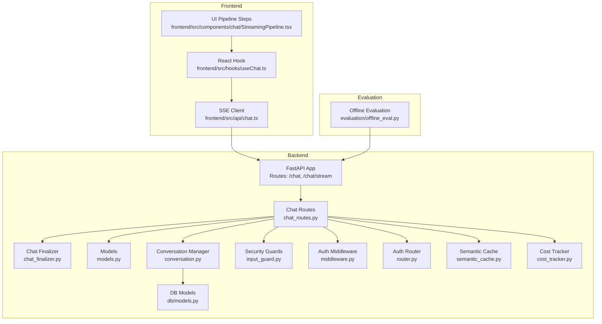
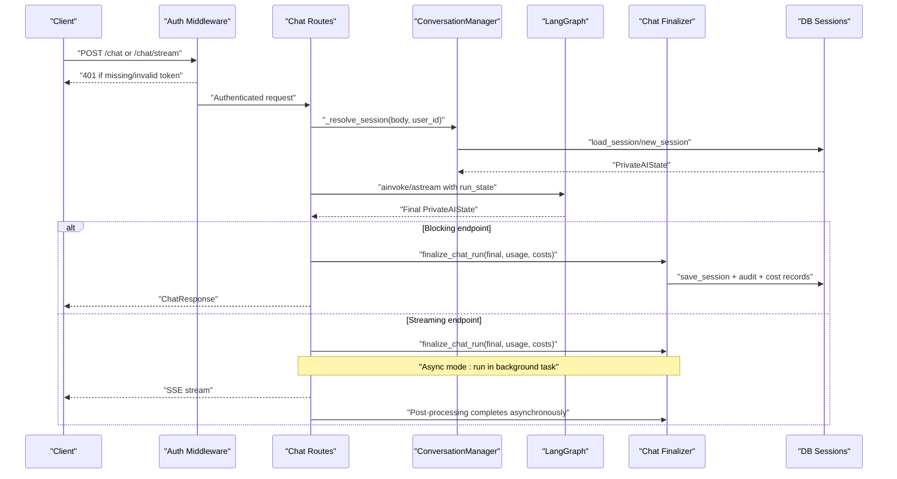
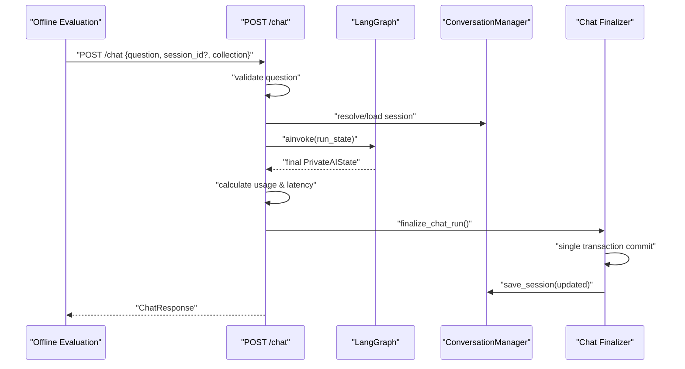
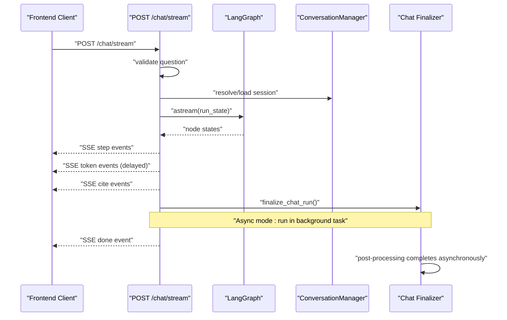
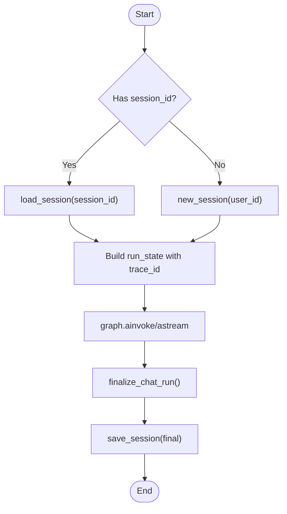
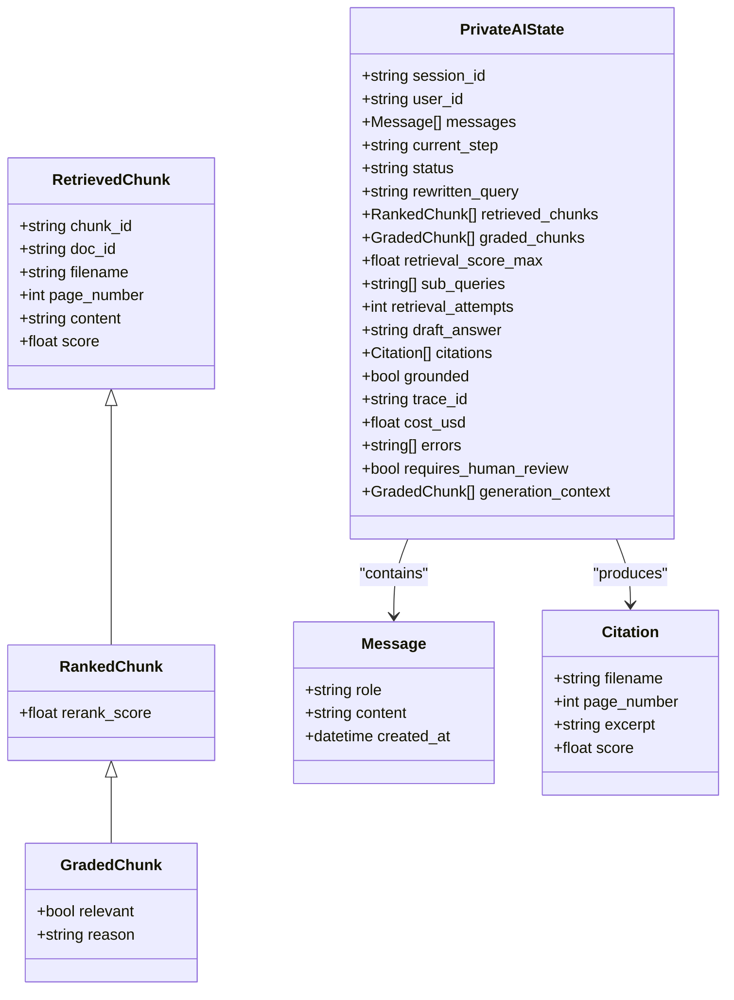
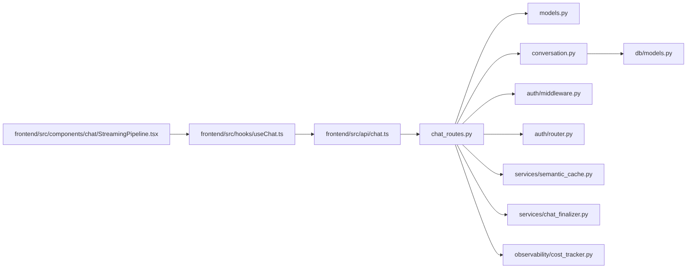

# Chat Endpoints

<cite>
**Referenced Files in This Document**
- [chat_routes.py](file://safe4ai-pilot/app/api/chat_routes.py)
- [chat_finalizer.py](file://safe4ai-pilot/app/services/chat_finalizer.py)
- [models.py](file://safe4ai-pilot/app/models.py)
- [conversation.py](file://safe4ai-pilot/app/services/conversation.py)
- [input_guard.py](file://safe4ai-pilot/app/security/input_guard.py)
- [middleware.py](file://safe4ai-pilot/app/auth/middleware.py)
- [router.py](file://safe4ai-pilot/app/auth/router.py)
- [chat.ts](file://safe4ai-pilot/frontend/src/api/chat.ts)
- [useChat.ts](file://safe4ai-pilot/frontend/src/hooks/useChat.ts)
- [StreamingPipeline.tsx](file://safe4ai-pilot/frontend/src/components/chat/StreamingPipeline.tsx)
- [offline_eval.py](file://safe4ai-pilot/evaluation/offline_eval.py)
- [test_chat.py](file://safe4ai-pilot/tests/test_chat.py)
- [semantic_cache.py](file://safe4ai-pilot/app/services/semantic_cache.py)
- [models.py (db)](file://safe4ai-pilot/app/db/models.py)
- [cost_tracker.py](file://safe4ai-pilot/observability/cost_tracker.py)
- [audit_cleanup.py](file://safe4ai-pilot/scripts/audit_cleanup.py)
</cite>

## Update Summary
**Changes Made**
- Updated architecture overview to reflect centralized chat_finalizer approach
- Revised post-processing flow to show finalize_chat_run() delegation
- Added documentation for unified audit logging, cost recording, and session saving
- Updated streaming endpoint to show async vs strict post-processing modes
- Enhanced error handling documentation for centralized post-processing failures

## Table of Contents
1. [Introduction](#introduction)
2. [Project Structure](#project-structure)
3. [Core Components](#core-components)
4. [Architecture Overview](#architecture-overview)
5. [Detailed Component Analysis](#detailed-component-analysis)
6. [Dependency Analysis](#dependency-analysis)
7. [Performance Considerations](#performance-considerations)
8. [Troubleshooting Guide](#troubleshooting-guide)
9. [Conclusion](#conclusion)
10. [Appendices](#appendices)

## Introduction
This document provides comprehensive API documentation for the chat endpoints that power both synchronous and streaming interactions. It covers:
- POST /chat: a blocking endpoint designed for evaluation scripts and tests
- POST /chat/stream: a Server-Sent Events (SSE) endpoint for real-time streaming responses
- Session management and conversation persistence
- Trace ID tracking and observability
- PrivateAIState model, citation handling, and semantic caching
- Rate limiting, input validation, and security measures
- Client-side SSE handling, error recovery, and connection management
- Centralized chat_finalizer for unified post-processing

## Project Structure
The chat endpoints are implemented in the backend FastAPI application and consumed by the React frontend. The evaluation suite uses the blocking endpoint for automated scoring. All post-processing operations are now centralized through the chat_finalizer service.

**Diagram sources**
- [chat_routes.py:26](file://safe4ai-pilot/app/api/chat_routes.py#L26)
- [chat_finalizer.py:14-71](file://safe4ai-pilot/app/services/chat_finalizer.py#L14-L71)
- [models.py:49-95](file://safe4ai-pilot/app/models.py#L49-L95)
- [conversation.py:26-117](file://safe4ai-pilot/app/services/conversation.py#L26-L117)
- [input_guard.py:24-49](file://safe4ai-pilot/app/security/input_guard.py#L24-L49)
- [middleware.py:51-71](file://safe4ai-pilot/app/auth/middleware.py#L51-L71)
- [router.py:39-105](file://safe4ai-pilot/app/auth/router.py#L39-L105)
- [semantic_cache.py:14-108](file://safe4ai-pilot/app/services/semantic_cache.py#L14-L108)
- [models.py (db):65-73](file://safe4ai-pilot/app/db/models.py#L65-L73)
- [cost_tracker.py:16-115](file://safe4ai-pilot/observability/cost_tracker.py#L16-L115)
- [chat.ts:21-75](file://safe4ai-pilot/frontend/src/api/chat.ts#L21-L75)
- [useChat.ts:30-93](file://safe4ai-pilot/frontend/src/hooks/useChat.ts#L30-L93)
- [StreamingPipeline.tsx:13-29](file://safe4ai-pilot/frontend/src/components/chat/StreamingPipeline.tsx#L13-L29)
- [offline_eval.py:121-134](file://safe4ai-pilot/evaluation/offline_eval.py#L121-L134)

**Section sources**
- [chat_routes.py:1-414](file://safe4ai-pilot/app/api/chat_routes.py#L1-L414)
- [chat_finalizer.py:1-71](file://safe4ai-pilot/app/services/chat_finalizer.py#L1-L71)
- [models.py:1-95](file://safe4ai-pilot/app/models.py#L1-L95)
- [conversation.py:1-117](file://safe4ai-pilot/app/services/conversation.py#L1-L117)
- [input_guard.py:1-49](file://safe4ai-pilot/app/security/input_guard.py#L1-L49)
- [middleware.py:1-83](file://safe4ai-pilot/app/auth/middleware.py#L1-L83)
- [router.py:1-125](file://safe4ai-pilot/app/auth/router.py#L1-L125)
- [semantic_cache.py:1-108](file://safe4ai-pilot/app/services/semantic_cache.py#L1-L108)
- [models.py (db):1-182](file://safe4ai-pilot/app/db/models.py#L1-L182)
- [cost_tracker.py:1-115](file://safe4ai-pilot/observability/cost_tracker.py#L1-L115)
- [chat.ts:1-76](file://safe4ai-pilot/frontend/src/api/chat.ts#L1-L76)
- [useChat.ts:1-106](file://safe4ai-pilot/frontend/src/hooks/useChat.ts#L1-L106)
- [StreamingPipeline.tsx:1-30](file://safe4ai-pilot/frontend/src/components/chat/StreamingPipeline.tsx#L1-L30)
- [offline_eval.py:1-244](file://safe4ai-pilot/evaluation/offline_eval.py#L1-L244)
- [test_chat.py:1-271](file://safe4ai-pilot/tests/test_chat.py#L1-L271)

## Core Components
- ChatRequest and ChatResponse define the shape of requests and synchronous responses.
- PrivateAIState encapsulates conversation state, retrieval metadata, generation context, and observability fields.
- ConversationManager handles session creation, loading, saving, and optional summarization.
- SSE streaming endpoint emits structured events for step transitions, token deltas, citations, and completion metadata.
- Authentication middleware enforces JWT-based access and role checks.
- Rate limiting is applied via SlowAPI decorators on endpoints.
- InputGuard performs pre-processing and validation of user queries.
- **Updated** chat_finalizer provides centralized post-processing with unified audit logging, cost recording, and session saving.

**Section sources**
- [chat_routes.py:26](file://safe4ai-pilot/app/api/chat_routes.py#L26)
- [chat_finalizer.py:14-71](file://safe4ai-pilot/app/services/chat_finalizer.py#L14-L71)
- [models.py:49-95](file://safe4ai-pilot/app/models.py#L49-L95)
- [conversation.py:26-117](file://safe4ai-pilot/app/services/conversation.py#L26-L117)
- [input_guard.py:24-49](file://safe4ai-pilot/app/security/input_guard.py#L24-L49)
- [middleware.py:51-71](file://safe4ai-pilot/app/auth/middleware.py#L51-L71)
- [router.py:21-22](file://safe4ai-pilot/app/auth/router.py#L21-L22)

## Architecture Overview
The chat system orchestrates authentication, session resolution, graph execution, and centralized post-processing through chat_finalizer. The SSE endpoint streams intermediate steps and final tokens, while the blocking endpoint returns a single aggregated response. Both endpoints now delegate all post-processing to the unified finalize_chat_run() function.

**Diagram sources**
- [chat_routes.py:238-257](file://safe4ai-pilot/app/api/chat_routes.py#L238-L257)
- [chat_routes.py:366-404](file://safe4ai-pilot/app/api/chat_routes.py#L366-L404)
- [chat_finalizer.py:14-71](file://safe4ai-pilot/app/services/chat_finalizer.py#L14-L71)
- [conversation.py:42-69](file://safe4ai-pilot/app/services/conversation.py#L42-L69)
- [middleware.py:51-71](file://safe4ai-pilot/app/auth/middleware.py#L51-L71)
- [models.py:49-95](file://safe4ai-pilot/app/models.py#L49-L95)

## Detailed Component Analysis

### POST /chat (Blocking)
Purpose: Provides a synchronous response suitable for evaluation scripts and tests.

- Endpoint: POST /chat
- Authentication: Required via JWT cookie
- Rate Limit: 30 per minute
- Request Body (ChatRequest):
  - question: string (max length 2048)
  - session_id: string | null
  - collection: string (default "default")
- Response Body (ChatResponse):
  - answer: string
  - citations: array of Citation
  - session_id: string
  - trace_id: string
  - cache_hit: boolean (default false)
- Error Responses:
  - 401 Not Authenticated (missing/invalid token)
  - 422 Unprocessable Entity (empty question)
  - 503 Service Unavailable (graph not initialized)
  - 500 Internal Server Error (graph invocation failure)

**Updated Processing Logic:**
- Validates question length and emptiness
- Resolves or creates a session using ConversationManager
- Builds run state with a fresh trace_id and initial message
- Executes graph.ainvoke to obtain final state
- Calculates usage and latency metrics
- **Centralized post-processing via finalize_chat_run()**
  - Persists assistant reply to session
  - Creates audit log entry
  - Records cost tracking data
  - Commits all changes in a single transaction
- Returns ChatResponse

**Diagram sources**
- [offline_eval.py:121-134](file://safe4ai-pilot/evaluation/offline_eval.py#L121-L134)
- [chat_routes.py:201-257](file://safe4ai-pilot/app/api/chat_routes.py#L201-L257)
- [chat_finalizer.py:14-71](file://safe4ai-pilot/app/services/chat_finalizer.py#L14-L71)
- [conversation.py:42-69](file://safe4ai-pilot/app/services/conversation.py#L42-L69)

**Section sources**
- [chat_routes.py:201-257](file://safe4ai-pilot/app/api/chat_routes.py#L201-L257)
- [test_chat.py:80-122](file://safe4ai-pilot/tests/test_chat.py#L80-L122)
- [offline_eval.py:121-134](file://safe4ai-pilot/evaluation/offline_eval.py#L121-L134)

### POST /chat/stream (SSE Streaming)
Purpose: Streams real-time updates using Server-Sent Events for step transitions, token deltas, citations, and completion metadata.

- Endpoint: POST /chat/stream
- Authentication: Required via JWT cookie
- Rate Limit: 30 per minute
- Request Body (same as blocking endpoint)
- Event Stream (Server-Sent Events):
  - event: step
    - data: { name: "embed"|"retrieve"|"rerank"|"generate", state: "pending"|"active"|"done", t: number }
  - event: token
    - data: { delta: string }
  - event: cite
    - data: { id: string, file: string, page: number, score: number, excerpt: string }
  - event: done
    - data: { traceId: string, latencyMs: number, cache: boolean, model: string, kRetrieved: number, sessionId: string, error?: string }

**Updated Client-Side Handling (Frontend):**
- Uses fetch with credentials and SSE parsing
- Maintains step states and accumulates tokens into assistant message
- Updates citations and final trust metrics upon done
- Supports AbortController for cancellation
- **Enhanced error handling for post-processing failures**

**Diagram sources**
- [chat_routes.py:265-414](file://safe4ai-pilot/app/api/chat_routes.py#L265-L414)
- [chat_finalizer.py:14-71](file://safe4ai-pilot/app/services/chat_finalizer.py#L14-L71)
- [chat.ts:21-75](file://safe4ai-pilot/frontend/src/api/chat.ts#L21-L75)
- [useChat.ts:30-93](file://safe4ai-pilot/frontend/src/hooks/useChat.ts#L30-L93)

**Section sources**
- [chat_routes.py:265-414](file://safe4ai-pilot/app/api/chat_routes.py#L265-L414)
- [chat_finalizer.py:14-71](file://safe4ai-pilot/app/services/chat_finalizer.py#L14-L71)
- [chat.ts:1-76](file://safe4ai-pilot/frontend/src/api/chat.ts#L1-L76)
- [useChat.ts:1-106](file://safe4ai-pilot/frontend/src/hooks/useChat.ts#L1-L106)
- [StreamingPipeline.tsx:1-30](file://safe4ai-pilot/frontend/src/components/chat/StreamingPipeline.tsx#L1-L30)

### Session Management and Conversation Persistence
- Session Creation:
  - new_session generates a UUID and persists an initial PrivateAIState
- Session Loading:
  - load_session retrieves and reconstructs PrivateAIState from stored JSON
- Session Saving:
  - **Updated** Now handled centrally through chat_finalizer during post-processing
- Optional Summarization:
  - maybe_summarize can summarize long histories using an external model
- Frontend Session Tracking:
  - The done event supplies sessionId; the hook stores it for subsequent requests

**Diagram sources**
- [chat_routes.py:144-159](file://safe4ai-pilot/app/api/chat_routes.py#L144-L159)
- [chat_finalizer.py:27-36](file://safe4ai-pilot/app/services/chat_finalizer.py#L27-L36)
- [conversation.py:30-69](file://safe4ai-pilot/app/services/conversation.py#L30-L69)

**Section sources**
- [conversation.py:26-117](file://safe4ai-pilot/app/services/conversation.py#L26-L117)
- [models.py (db):65-73](file://safe4ai-pilot/app/db/models.py#L65-L73)
- [useChat.ts:76-82](file://safe4ai-pilot/frontend/src/hooks/useChat.ts#L76-L82)

### PrivateAIState Model
PrivateAIState captures the conversation state and pipeline metadata. Key fields include:
- Identity: session_id, user_id
- Messages: list of Message with role, content, created_at
- Pipeline state: current_step, status
- Retrieval: rewritten_query, retrieved_chunks, graded_chunks, retrieval_score_max, sub_queries, retrieval_attempts
- Generation: draft_answer, citations, grounded, generation_context
- Observability: trace_id, cost_usd, errors, requires_human_review
- Limits and guards: retrieval_attempts as a self-correction loop guard

**Diagram sources**
- [models.py:7-95](file://safe4ai-pilot/app/models.py#L7-L95)

**Section sources**
- [models.py:49-95](file://safe4ai-pilot/app/models.py#L49-L95)

### Citation Handling
- During streaming, the server emits cite events with id, file, page, and score.
- The frontend accumulates citations into the assistant message.
- The blocking endpoint returns a citations array in ChatResponse.

**Section sources**
- [chat_routes.py:340-347](file://safe4ai-pilot/app/api/chat_routes.py#L340-L347)
- [useChat.ts:72-75](file://safe4ai-pilot/frontend/src/hooks/useChat.ts#L72-L75)

### Caching Mechanisms
- Semantic Cache:
  - Embeddings are computed via Ollama and stored with vector similarity indexing
  - Lookup uses pgvector distance operator with a configurable threshold
  - Store persists response, citations, and source identifiers
  - Invalidate by document removes cache entries referencing a document
- Cache Hit Reporting:
  - The blocking response includes cache_hit (default false)
  - The SSE done event includes cache (boolean) and latencyMs

**Section sources**
- [semantic_cache.py:14-108](file://safe4ai-pilot/app/services/semantic_cache.py#L14-L108)
- [chat_routes.py:56](file://safe4ai-pilot/app/api/chat_routes.py#L56)
- [chat_routes.py:400](file://safe4ai-pilot/app/api/chat_routes.py#L400)

### Rate Limiting, Input Validation, and Security
- Rate Limiting:
  - Both endpoints apply 30/minute rate limiting via decorator
- Input Validation:
  - Empty question rejected with 422
  - Max length enforced at 2048 characters
  - HTML tags stripped and control characters removed
  - Injection patterns filtered
- Authentication:
  - JWT cookie required; verified and decoded
  - Active user enforced
- Authorization:
  - Role checks available via middleware dependency
- Security Headers:
  - SSE responses set Cache-Control and X-Accel-Buffering headers

**Section sources**
- [chat_routes.py:200](file://safe4ai-pilot/app/api/chat_routes.py#L200)
- [chat_routes.py:266](file://safe4ai-pilot/app/api/chat_routes.py#L266)
- [chat_routes.py:123-124](file://safe4ai-pilot/app/api/chat_routes.py#L123-L124)
- [input_guard.py:27-48](file://safe4ai-pilot/app/security/input_guard.py#L27-L48)
- [middleware.py:51-71](file://safe4ai-pilot/app/auth/middleware.py#L51-L71)
- [router.py:39-105](file://safe4ai-pilot/app/auth/router.py#L39-L105)
- [chat_routes.py:409-413](file://safe4ai-pilot/app/api/chat_routes.py#L409-L413)

### Client-Side SSE Handling, Error Recovery, and Connection Management
- Parsing:
  - Reads server responses line-by-line, decodes UTF-8 chunks, and emits typed events
- Error Handling:
  - On HTTP error, yields an error event with message
  - On exceptions during parsing, logs warnings and continues
  - **Enhanced error handling for post-processing failures**
- Connection Management:
  - Supports AbortController to cancel ongoing streams
  - Maintains step state UI and accumulates tokens into the assistant message
- Trust Metrics:
  - Extracts latencyMs, cache, model, kRetrieved, and sessionId from done event

**Section sources**
- [chat.ts:21-75](file://safe4ai-pilot/frontend/src/api/chat.ts#L21-L75)
- [useChat.ts:17-106](file://safe4ai-pilot/frontend/src/hooks/useChat.ts#L17-L106)
- [StreamingPipeline.tsx:13-29](file://safe4ai-pilot/frontend/src/components/chat/StreamingPipeline.tsx#L13-L29)

### Centralized Post-Processing with chat_finalizer
**New Section** - The chat_finalizer service provides unified post-processing for both streaming and blocking chat endpoints.

#### Functionality
- **Single Transaction Commit**: All post-processing operations are wrapped in a single database transaction
- **Audit Logging**: Creates comprehensive audit trail with query metadata and usage statistics
- **Cost Recording**: Calculates and records token usage and associated costs
- **Session Persistence**: Updates conversation state with assistant responses
- **Error Resilience**: Graceful handling of post-processing failures without affecting main pipeline

#### Operation Flow
1. **Assistant Reply Persistence**: Adds assistant message to conversation state
2. **Audit Log Creation**: Records query, response metadata, and performance metrics
3. **Cost Tracking**: Computes usage-based costs and creates AgentRun records
4. **Database Commit**: Ensures atomicity across all operations

#### Streaming Endpoint Modes
- **Strict Mode**: Post-processing runs synchronously within the main request/response cycle
- **Async Mode**: Post-processing runs in a background task to avoid delaying the SSE response

**Section sources**
- [chat_finalizer.py:14-71](file://safe4ai-pilot/app/services/chat_finalizer.py#L14-L71)
- [chat_routes.py:366-404](file://safe4ai-pilot/app/api/chat_routes.py#L366-L404)
- [chat_routes.py:238-257](file://safe4ai-pilot/app/api/chat_routes.py#L238-L257)

## Dependency Analysis
Key dependencies and their roles:
- chat_routes.py depends on:
  - PrivateAIState and Citation models
  - ConversationManager for session persistence
  - Auth middleware for user identity
  - Rate limiter for throttling
  - LangGraph for pipeline execution
  - **Updated** chat_finalizer for centralized post-processing
- Frontend depends on:
  - SSE client for streaming
  - React hook for state orchestration
  - UI components for step visualization

**Diagram sources**
- [chat_routes.py:26](file://safe4ai-pilot/app/api/chat_routes.py#L26)
- [chat_finalizer.py:14-71](file://safe4ai-pilot/app/services/chat_finalizer.py#L14-L71)
- [models.py:1-95](file://safe4ai-pilot/app/models.py#L1-L95)
- [conversation.py:1-17](file://safe4ai-pilot/app/services/conversation.py#L1-L17)
- [middleware.py:1-22](file://safe4ai-pilot/app/auth/middleware.py#L1-L22)
- [router.py:1-24](file://safe4ai-pilot/app/auth/router.py#L1-L24)
- [semantic_cache.py:1-13](file://safe4ai-pilot/app/services/semantic_cache.py#L1-L13)
- [cost_tracker.py:16-115](file://safe4ai-pilot/observability/cost_tracker.py#L16-L115)
- [models.py (db):1-182](file://safe4ai-pilot/app/db/models.py#L1-L182)
- [chat.ts:1-3](file://safe4ai-pilot/frontend/src/api/chat.ts#L1-L3)
- [useChat.ts:1-4](file://safe4ai-pilot/frontend/src/hooks/useChat.ts#L1-L4)
- [StreamingPipeline.tsx:1-3](file://safe4ai-pilot/frontend/src/components/chat/StreamingPipeline.tsx#L1-L3)

**Section sources**
- [chat_routes.py:1-414](file://safe4ai-pilot/app/api/chat_routes.py#L1-L414)
- [chat_finalizer.py:1-71](file://safe4ai-pilot/app/services/chat_finalizer.py#L1-L71)
- [conversation.py:1-17](file://safe4ai-pilot/app/services/conversation.py#L1-L17)
- [models.py (db):65-73](file://safe4ai-pilot/app/db/models.py#L65-L73)
- [chat.ts:1-3](file://safe4ai-pilot/frontend/src/api/chat.ts#L1-L3)
- [useChat.ts:1-4](file://safe4ai-pilot/frontend/src/hooks/useChat.ts#L1-L4)
- [StreamingPipeline.tsx:1-3](file://safe4ai-pilot/frontend/src/components/chat/StreamingPipeline.tsx#L1-L3)

## Performance Considerations
- SSE Token Streaming:
  - Tokens are emitted with a small delay to simulate streaming and reduce client overload
- Session Size Limits:
  - Hard limit on session state JSON size; consider summarizing long histories
- Embedding and Vector Operations:
  - Semantic cache reduces repeated embedding work and improves latency
- Rate Limiting:
  - Prevents abuse; tune thresholds according to infrastructure capacity
- **Updated Post-Processing Performance**:
  - **Async mode**: Streaming responses are not delayed by post-processing operations
  - **Strict mode**: Post-processing occurs synchronously, ensuring immediate audit/cost recording
  - **Single transaction**: Reduces database overhead and ensures consistency

## Troubleshooting Guide
Common issues and resolutions:
- 401 Not Authenticated:
  - Ensure a valid JWT cookie is present and not expired
- 422 Unprocessable Entity:
  - Verify question is non-empty and under 2048 characters
- 503 Service Unavailable:
  - Confirm the AI pipeline graph is initialized on the application state
- 500 Internal Server Error:
  - Inspect server logs for graph invocation failures
- **Updated Post-Processing Issues**:
  - **Async mode failures**: Check background task execution and database connectivity
  - **Strict mode failures**: Review finalize_chat_run() transaction logs
  - **Audit/Cost recording failures**: Verify database permissions and transaction integrity
- SSE Parsing Errors:
  - The client logs malformed events and continues; check network interruptions
- Session Persistence Failures:
  - Large session state may exceed limits; truncate or summarize messages before saving

**Section sources**
- [chat_routes.py:123-124](file://safe4ai-pilot/app/api/chat_routes.py#L123-L124)
- [chat_routes.py:127-129](file://safe4ai-pilot/app/api/chat_routes.py#L127-L129)
- [chat_routes.py:137-139](file://safe4ai-pilot/app/api/chat_routes.py#L137-L139)
- [chat_finalizer.py:379-384](file://safe4ai-pilot/app/services/chat_finalizer.py#L379-L384)
- [chat.ts:64-71](file://safe4ai-pilot/frontend/src/api/chat.ts#L64-L71)
- [conversation.py:63-67](file://safe4ai-pilot/app/services/conversation.py#L63-L67)

## Conclusion
The chat endpoints provide a robust foundation for both synchronous evaluation and interactive streaming experiences. They integrate authentication, session persistence, observability, and security measures while offering flexible client-side consumption patterns. The centralized chat_finalizer approach ensures consistent post-processing across both streaming and blocking endpoints, with unified audit logging, cost recording, and session management. The SSE stream enables rich UX with step progress and incremental token delivery, while the blocking endpoint remains ideal for automated workflows.

## Appendices

### API Reference: POST /chat
- Method: POST
- Path: /chat
- Authentication: Required (JWT cookie)
- Rate Limit: 30 per minute
- Request JSON:
  - question: string (max 2048)
  - session_id: string | null
  - collection: string (default "default")
- Response JSON:
  - answer: string
  - citations: array of Citation
  - session_id: string
  - trace_id: string
  - cache_hit: boolean (default false)
- Status Codes:
  - 200 OK
  - 401 Unauthorized
  - 422 Unprocessable Entity
  - 503 Service Unavailable
  - 500 Internal Server Error

**Section sources**
- [chat_routes.py:201-257](file://safe4ai-pilot/app/api/chat_routes.py#L201-L257)
- [test_chat.py:80-104](file://safe4ai-pilot/tests/test_chat.py#L80-L104)

### API Reference: POST /chat/stream
- Method: POST
- Path: /chat/stream
- Authentication: Required (JWT cookie)
- Rate Limit: 30 per minute
- Request JSON: Same as /chat
- Response:
  - Content-Type: text/event-stream
  - SSE Events:
    - step: { name, state, t }
    - token: { delta }
    - cite: { id, file, page, score, excerpt }
    - done: { traceId, latencyMs, cache, model, kRetrieved, sessionId, error? }
- Status Codes:
  - 200 OK (stream)
  - 401 Unauthorized
  - 422 Unprocessable Entity
  - 503 Service Unavailable
  - 500 Internal Server Error

**Section sources**
- [chat_routes.py:265-414](file://safe4ai-pilot/app/api/chat_routes.py#L265-L414)
- [chat.ts:14-19](file://safe4ai-pilot/frontend/src/api/chat.ts#L14-L19)

### Client-Side SSE Handling Checklist
- Initialize fetch with credentials and AbortController
- Parse event lines and handle malformed data
- Update UI for step states, tokens, and citations
- Persist sessionId from done event for subsequent requests
- Handle error events and surface user-friendly messages
- **Monitor post-processing completion in async mode**

**Section sources**
- [chat.ts:21-75](file://safe4ai-pilot/frontend/src/api/chat.ts#L21-L75)
- [useChat.ts:30-93](file://safe4ai-pilot/frontend/src/hooks/useChat.ts#L30-L93)

### Centralized Post-Processing Architecture
**New Section** - Understanding the chat_finalizer service and its benefits.

#### Benefits
- **Consistency**: Unified post-processing logic across all chat endpoints
- **Atomicity**: All operations committed in single database transaction
- **Reliability**: Graceful error handling prevents partial updates
- **Maintainability**: Centralized logic reduces code duplication

#### Operation Details
- **Audit Logging**: Comprehensive query tracking with usage metadata
- **Cost Tracking**: Accurate token usage calculation and billing
- **Session Management**: Atomic conversation state updates
- **Error Recovery**: Non-blocking post-processing with logging

**Section sources**
- [chat_finalizer.py:14-71](file://safe4ai-pilot/app/services/chat_finalizer.py#L14-L71)
- [chat_routes.py:366-404](file://safe4ai-pilot/app/api/chat_routes.py#L366-L404)
- [chat_routes.py:238-257](file://safe4ai-pilot/app/api/chat_routes.py#L238-L257)