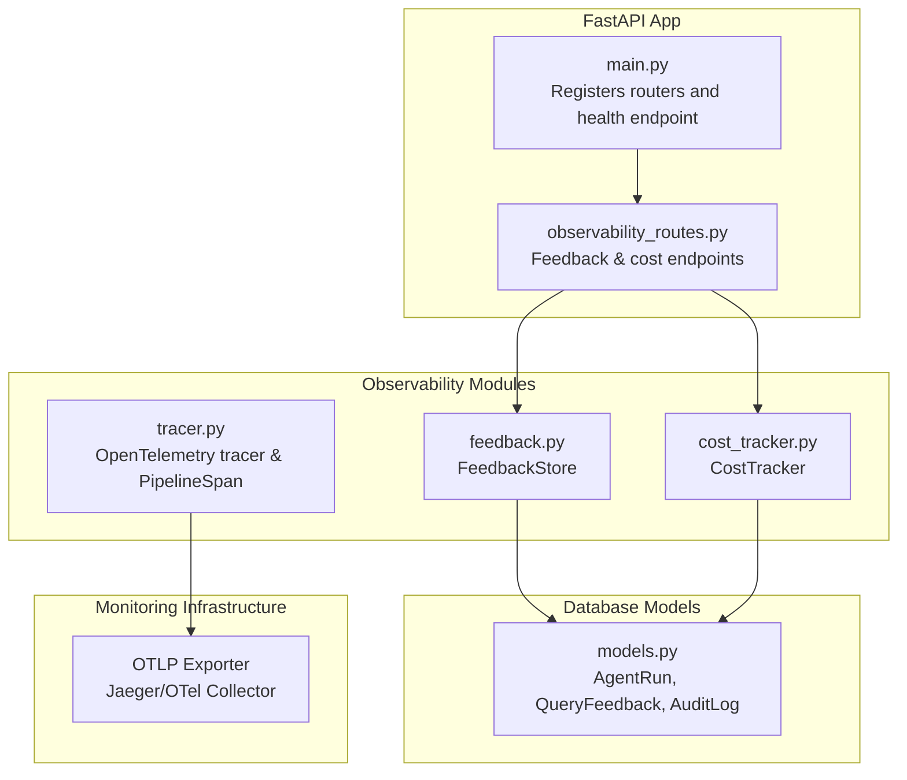
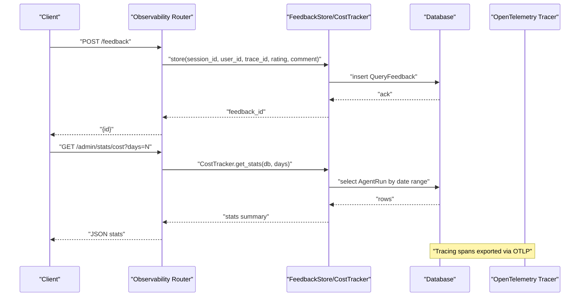
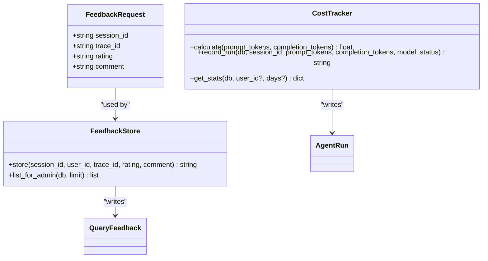
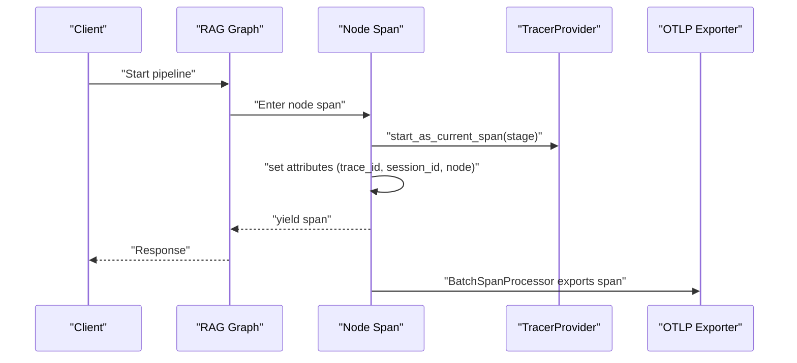
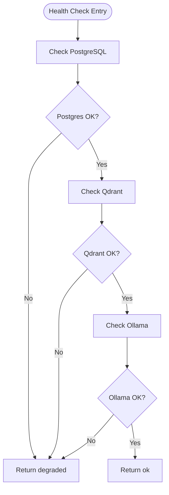
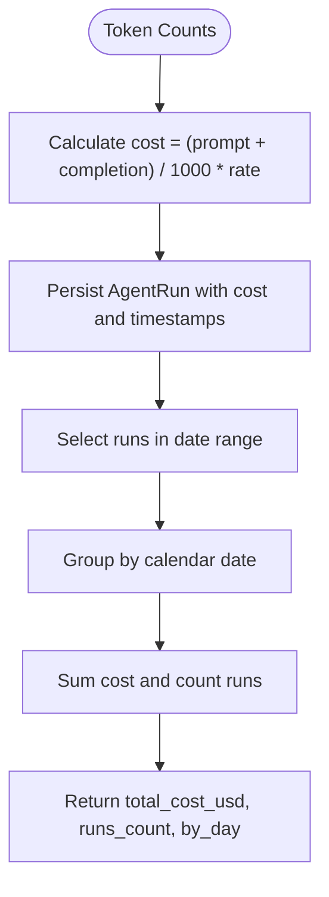
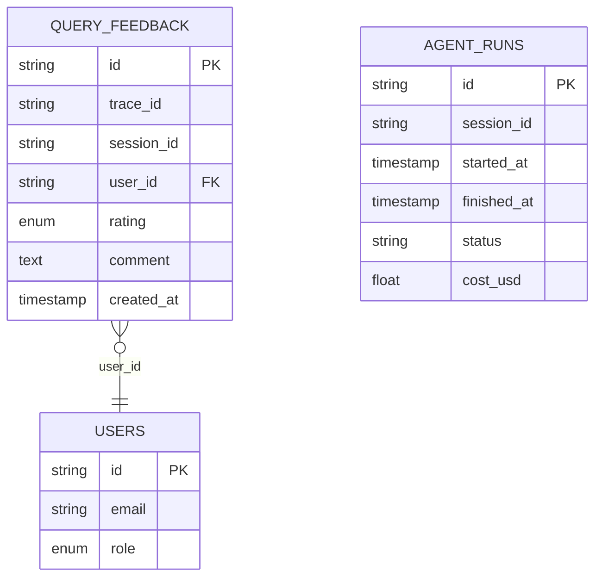
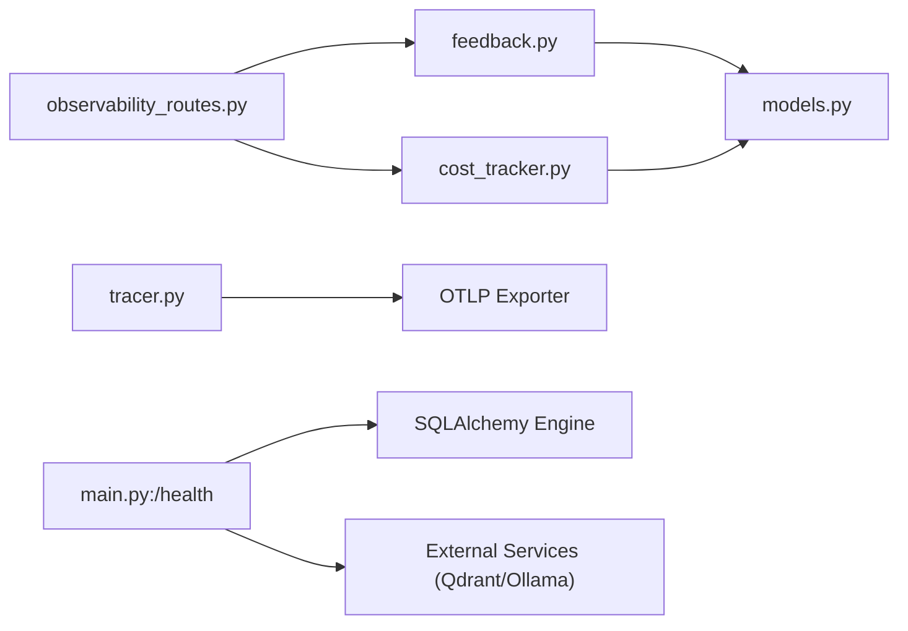

# Observability Endpoints

<cite>
**Referenced Files in This Document**
- [observability_routes.py](file://safe4ai-pilot/app/api/observability_routes.py)
- [cost_tracker.py](file://safe4ai-pilot/observability/cost_tracker.py)
- [feedback.py](file://safe4ai-pilot/observability/feedback.py)
- [tracer.py](file://safe4ai-pilot/observability/tracer.py)
- [models.py](file://safe4ai-pilot/app/db/models.py)
- [main.py](file://safe4ai-pilot/app/main.py)
- [healthcheck.py](file://safe4ai-pilot/scripts/healthcheck.py)
- [graph.py](file://safe4ai-pilot/app/agents/graph.py)
- [config.py](file://safe4ai-pilot/app/config.py)
- [test_observability_routes.py](file://safe4ai-pilot/tests/test_observability_routes.py)
- [test_tracer.py](file://safe4ai-pilot/tests/test_tracer.py)
- [test_agents.py](file://safe4ai-pilot/tests/test_agents.py)
</cite>

## Table of Contents
1. [Introduction](#introduction)
2. [Project Structure](#project-structure)
3. [Core Components](#core-components)
4. [Architecture Overview](#architecture-overview)
5. [Detailed Component Analysis](#detailed-component-analysis)
6. [Dependency Analysis](#dependency-analysis)
7. [Performance Considerations](#performance-considerations)
8. [Troubleshooting Guide](#troubleshooting-guide)
9. [Conclusion](#conclusion)
10. [Appendices](#appendices)

## Introduction
This document describes the observability endpoints and telemetry mechanisms for metrics collection, health checks, and performance monitoring. It covers:
- Observability routes for feedback submission, administrative feedback listing, and cost analytics
- Distributed tracing integration using OpenTelemetry (OTel) and export to an OTLP endpoint
- Health check endpoints and service readiness verification
- Telemetry data collection, trace correlation, and performance indicators
- Example client usage patterns, alerting integration ideas, and system health assessment
- Relationship between observability endpoints and the broader monitoring infrastructure

## Project Structure
The observability surface is implemented as part of the FastAPI application and leverages:
- API routers for observability endpoints
- Dedicated observability modules for feedback and cost tracking
- OpenTelemetry tracing utilities
- Database models for persisted telemetry artifacts
- Application-wide health endpoint and service readiness script

**Diagram sources**
- [main.py:118-147](file://safe4ai-pilot/app/main.py#L118-L147)
- [observability_routes.py:16-56](file://safe4ai-pilot/app/api/observability_routes.py#L16-L56)
- [feedback.py:16-71](file://safe4ai-pilot/observability/feedback.py#L16-L71)
- [cost_tracker.py:16-110](file://safe4ai-pilot/observability/cost_tracker.py#L16-L110)
- [tracer.py:14-76](file://safe4ai-pilot/observability/tracer.py#L14-L76)
- [models.py:133-156](file://safe4ai-pilot/app/db/models.py#L133-L156)

**Section sources**
- [main.py:98-101](file://safe4ai-pilot/app/main.py#L98-L101)
- [main.py:118-147](file://safe4ai-pilot/app/main.py#L118-L147)

## Core Components
- Observability API router: Provides endpoints for feedback submission, administrative feedback listing, and cost statistics.
- Feedback store: Persists user feedback with correlation to sessions and traces.
- Cost tracker: Aggregates token usage and computes costs per agent run; exposes daily rollups.
- Tracing utilities: Provides a tracer and a scoped span context manager for pipeline stages.
- Health checks: Application-level health endpoint and a dedicated readiness script for external systems.

Key implementation references:
- [Observability router:16-56](file://safe4ai-pilot/app/api/observability_routes.py#L16-L56)
- [Feedback store:16-71](file://safe4ai-pilot/observability/feedback.py#L16-L71)
- [Cost tracker:16-110](file://safe4ai-pilot/observability/cost_tracker.py#L16-L110)
- [Tracing utilities:14-76](file://safe4ai-pilot/observability/tracer.py#L14-L76)
- [Health endpoint:118-147](file://safe4ai-pilot/app/main.py#L118-L147)
- [Readiness script:12-53](file://safe4ai-pilot/scripts/healthcheck.py#L12-L53)

**Section sources**
- [observability_routes.py:16-56](file://safe4ai-pilot/app/api/observability_routes.py#L16-L56)
- [feedback.py:16-71](file://safe4ai-pilot/observability/feedback.py#L16-L71)
- [cost_tracker.py:16-110](file://safe4ai-pilot/observability/cost_tracker.py#L16-L110)
- [tracer.py:14-76](file://safe4ai-pilot/observability/tracer.py#L14-L76)
- [main.py:118-147](file://safe4ai-pilot/app/main.py#L118-L147)
- [healthcheck.py:12-53](file://safe4ai-pilot/scripts/healthcheck.py#L12-L53)

## Architecture Overview
The observability architecture integrates:
- API endpoints for feedback and cost analytics
- OpenTelemetry tracing for the RAG pipeline and nodes
- Database persistence for feedback and agent runs
- Application health endpoint and external readiness checks

**Diagram sources**
- [observability_routes.py:26-56](file://safe4ai-pilot/app/api/observability_routes.py#L26-L56)
- [feedback.py:22-49](file://safe4ai-pilot/observability/feedback.py#L22-L49)
- [cost_tracker.py:62-109](file://safe4ai-pilot/observability/cost_tracker.py#L62-L109)
- [tracer.py:27-32](file://safe4ai-pilot/observability/tracer.py#L27-L32)

## Detailed Component Analysis

### Observability Routes
Endpoints:
- POST /feedback
  - Purpose: Submit user feedback for a query response
  - Authentication: Requires a logged-in user
  - Request body: FeedbackRequest (session_id, trace_id, rating, optional comment)
  - Response: JSON with feedback id
  - Permissions: Any authenticated user
  - Implementation reference: [submit_feedback:27-35](file://safe4ai-pilot/app/api/observability_routes.py#L27-L35)

- GET /admin/feedback
  - Purpose: Retrieve recent feedback entries (admin only)
  - Authentication: Admin role required
  - Response: Array of feedback records
  - Implementation reference: [list_feedback:39-45](file://safe4ai-pilot/app/api/observability_routes.py#L39-L45)

- GET /admin/stats/cost
  - Purpose: Return aggregate cost statistics for the past N days
  - Authentication: Admin role required
  - Query parameter: days (default 30)
  - Response: JSON with total_cost_usd, runs_count, and by_day array
  - Implementation reference: [cost_stats:49-56](file://safe4ai-pilot/app/api/observability_routes.py#L49-L56)

Request/Response Schemas:
- FeedbackRequest
  - session_id: string
  - trace_id: string
  - rating: enum "positive" | "negative"
  - comment: string | null
  - Reference: [FeedbackRequest:19-23](file://safe4ai-pilot/app/api/observability_routes.py#L19-L23)

- Cost stats response
  - total_cost_usd: number
  - runs_count: integer
  - by_day: array of objects with keys date, cost_usd, runs
  - Reference: [CostTracker.get_stats:62-109](file://safe4ai-pilot/observability/cost_tracker.py#L62-L109)

- Feedback listing response
  - Array of objects with keys id, user_id, session_id, trace_id, rating, comment, created_at
  - Reference: [FeedbackStore.list_for_admin:51-70](file://safe4ai-pilot/observability/feedback.py#L51-L70)

**Diagram sources**
- [observability_routes.py:19-23](file://safe4ai-pilot/app/api/observability_routes.py#L19-L23)
- [feedback.py:22-49](file://safe4ai-pilot/observability/feedback.py#L22-L49)
- [cost_tracker.py:22-60](file://safe4ai-pilot/observability/cost_tracker.py#L22-L60)
- [models.py:133-156](file://safe4ai-pilot/app/db/models.py#L133-L156)

**Section sources**
- [observability_routes.py:19-56](file://safe4ai-pilot/app/api/observability_routes.py#L19-L56)
- [feedback.py:22-70](file://safe4ai-pilot/observability/feedback.py#L22-L70)
- [cost_tracker.py:22-109](file://safe4ai-pilot/observability/cost_tracker.py#L22-L109)
- [models.py:133-156](file://safe4ai-pilot/app/db/models.py#L133-L156)

### Distributed Tracing (OpenTelemetry)
- Tracer initialization exports spans via OTLP to an endpoint configured by environment variables.
- PipelineSpan wraps a single stage span, setting attributes such as trace_id and stage, and recording exceptions.
- The RAG graph creates child spans per node, inheriting context from the pipeline span.

Key references:
- Tracer provider and exporter: [tracer.py:27-32](file://safe4ai-pilot/observability/tracer.py#L27-L32)
- PipelineSpan lifecycle and attributes: [tracer.py:35-71](file://safe4ai-pilot/observability/tracer.py#L35-L71)
- Node spans in the graph: [_node_span and spans:28-35](file://safe4ai-pilot/app/agents/graph.py#L28-L35)
- Parent-child span relationship test: [test_agents.py:337-369](file://safe4ai-pilot/tests/test_agents.py#L337-L369)

**Diagram sources**
- [graph.py:28-35](file://safe4ai-pilot/app/agents/graph.py#L28-L35)
- [tracer.py:27-32](file://safe4ai-pilot/observability/tracer.py#L27-L32)
- [tracer.py:47-66](file://safe4ai-pilot/observability/tracer.py#L47-L66)

**Section sources**
- [tracer.py:14-76](file://safe4ai-pilot/observability/tracer.py#L14-L76)
- [graph.py:28-35](file://safe4ai-pilot/app/agents/graph.py#L28-L35)
- [test_tracer.py:26-75](file://safe4ai-pilot/tests/test_tracer.py#L26-L75)
- [test_agents.py:337-369](file://safe4ai-pilot/tests/test_agents.py#L337-L369)

### Health Checks and Readiness
- Application health endpoint returns overall status and per-service checks for PostgreSQL, Qdrant, and Ollama.
- A separate readiness script performs the same checks and exits with non-zero status on failure.

References:
- Health endpoint: [main.py:118-147](file://safe4ai-pilot/app/main.py#L118-L147)
- Readiness script: [healthcheck.py:12-53](file://safe4ai-pilot/scripts/healthcheck.py#L12-L53)

**Diagram sources**
- [main.py:118-147](file://safe4ai-pilot/app/main.py#L118-L147)
- [healthcheck.py:12-53](file://safe4ai-pilot/scripts/healthcheck.py#L12-L53)

**Section sources**
- [main.py:118-147](file://safe4ai-pilot/app/main.py#L118-L147)
- [healthcheck.py:12-53](file://safe4ai-pilot/scripts/healthcheck.py#L12-L53)

### Cost Analytics and Token Usage
- CostTracker calculates USD cost from prompt and completion token counts using a configurable rate.
- CostTracker.record_run persists an AgentRun with computed cost and timestamps.
- CostTracker.get_stats aggregates runs by day and returns totals and counts.

References:
- Cost calculation and run recording: [cost_tracker.py:22-60](file://safe4ai-pilot/observability/cost_tracker.py#L22-L60)
- Stats aggregation: [cost_tracker.py:62-109](file://safe4ai-pilot/observability/cost_tracker.py#L62-L109)
- Settings for cost rate: [config.py](file://safe4ai-pilot/app/config.py#L19)

**Diagram sources**
- [cost_tracker.py:22-109](file://safe4ai-pilot/observability/cost_tracker.py#L22-L109)
- [config.py:19](file://safe4ai-pilot/app/config.py#L19)

**Section sources**
- [cost_tracker.py:22-109](file://safe4ai-pilot/observability/cost_tracker.py#L22-L109)
- [config.py:19](file://safe4ai-pilot/app/config.py#L19)

### Feedback Persistence and Administration
- FeedbackStore stores feedback with correlation to session, user, and trace identifiers.
- Administrative listing returns recent feedback entries ordered by creation time.

References:
- Feedback storage: [feedback.py:22-49](file://safe4ai-pilot/observability/feedback.py#L22-L49)
- Admin listing: [feedback.py:51-70](file://safe4ai-pilot/observability/feedback.py#L51-L70)
- Database models: [models.py:146-156](file://safe4ai-pilot/app/db/models.py#L146-L156)

**Diagram sources**
- [models.py:146-156](file://safe4ai-pilot/app/db/models.py#L146-L156)
- [models.py:52-63](file://safe4ai-pilot/app/db/models.py#L52-L63)
- [models.py:133-144](file://safe4ai-pilot/app/db/models.py#L133-L144)

**Section sources**
- [feedback.py:22-70](file://safe4ai-pilot/observability/feedback.py#L22-L70)
- [models.py:146-156](file://safe4ai-pilot/app/db/models.py#L146-L156)

## Dependency Analysis
- Observability router depends on:
  - FeedbackStore for feedback persistence
  - CostTracker for cost analytics
  - Database session for ORM operations
- CostTracker and FeedbackStore depend on SQLAlchemy models and database sessions.
- Tracing utilities depend on OpenTelemetry SDK and environment variables for OTLP configuration.
- Application health endpoint depends on database connectivity and external service URLs from settings.

**Diagram sources**
- [observability_routes.py:13-14](file://safe4ai-pilot/app/api/observability_routes.py#L13-L14)
- [feedback.py:9](file://safe4ai-pilot/observability/feedback.py#L9)
- [cost_tracker.py:11](file://safe4ai-pilot/observability/cost_tracker.py#L11)
- [tracer.py:27-32](file://safe4ai-pilot/observability/tracer.py#L27-L32)
- [main.py:118-147](file://safe4ai-pilot/app/main.py#L118-L147)

**Section sources**
- [observability_routes.py:13-14](file://safe4ai-pilot/app/api/observability_routes.py#L13-L14)
- [feedback.py:9](file://safe4ai-pilot/observability/feedback.py#L9)
- [cost_tracker.py:11](file://safe4ai-pilot/observability/cost_tracker.py#L11)
- [tracer.py:27-32](file://safe4ai-pilot/observability/tracer.py#L27-L32)
- [main.py:118-147](file://safe4ai-pilot/app/main.py#L118-L147)

## Performance Considerations
- Cost calculations are O(1) per run; stats aggregation is O(n) over runs in the selected window.
- Feedback listing is limited by a default limit and ordered by creation time.
- Tracing uses batch processors; ensure exporter endpoint availability to avoid backpressure.
- Health checks use short timeouts for external services to prevent blocking.

[No sources needed since this section provides general guidance]

## Troubleshooting Guide
Common issues and diagnostics:
- Feedback submission fails with validation errors
  - Cause: Missing required fields or invalid rating enum
  - Evidence: Tests demonstrate 422 responses for invalid payload
  - References: [test_observability_routes.py:98-114](file://safe4ai-pilot/tests/test_observability_routes.py#L98-L114)

- Admin-only endpoints return forbidden
  - Cause: Non-admin user attempts access
  - Evidence: Tests show 403 responses for non-admin clients
  - References: [test_observability_routes.py:178-185](file://safe4ai-pilot/tests/test_observability_routes.py#L178-L185)

- Tracing stage validation errors
  - Cause: Using an invalid stage name in PipelineSpan
  - Evidence: Tests expect ValueError for invalid stages
  - References: [test_tracer.py:53-58](file://safe4ai-pilot/tests/test_tracer.py#L53-L58)

- Health endpoint reports degraded
  - Cause: One or more external services unreachable
  - Action: Verify PostgreSQL, Qdrant, and Ollama endpoints; inspect logs
  - References: [main.py:118-147](file://safe4ai-pilot/app/main.py#L118-L147), [healthcheck.py:12-53](file://safe4ai-pilot/scripts/healthcheck.py#L12-L53)

**Section sources**
- [test_observability_routes.py:98-114](file://safe4ai-pilot/tests/test_observability_routes.py#L98-L114)
- [test_observability_routes.py:178-185](file://safe4ai-pilot/tests/test_observability_routes.py#L178-L185)
- [test_tracer.py:53-58](file://safe4ai-pilot/tests/test_tracer.py#L53-L58)
- [main.py:118-147](file://safe4ai-pilot/app/main.py#L118-L147)
- [healthcheck.py:12-53](file://safe4ai-pilot/scripts/healthcheck.py#L12-L53)

## Conclusion
The observability endpoints provide:
- Feedback collection with trace/session correlation
- Administrative dashboards via feedback listing and cost analytics
- Distributed tracing for the RAG pipeline with OTLP export
- Application health and service readiness checks

These components integrate with the broader monitoring infrastructure through OTLP exporters and database-backed analytics, enabling trace correlation, cost tracking, and system health assessment.

[No sources needed since this section summarizes without analyzing specific files]

## Appendices

### API Definitions

- POST /feedback
  - Description: Submit user feedback for a query response
  - Auth: Required
  - Body: FeedbackRequest
  - Responses: 200 OK with feedback id; 422 Unprocessable Entity for invalid payload
  - Reference: [submit_feedback:27-35](file://safe4ai-pilot/app/api/observability_routes.py#L27-L35)

- GET /admin/feedback
  - Description: List recent feedback entries (admin only)
  - Auth: Admin required
  - Responses: 200 OK with array of feedback records; 403 Forbidden for non-admin
  - Reference: [list_feedback:39-45](file://safe4ai-pilot/app/api/observability_routes.py#L39-L45)

- GET /admin/stats/cost
  - Description: Aggregate cost statistics for the past N days
  - Auth: Admin required
  - Query: days (integer, default 30)
  - Responses: 200 OK with stats; 403 Forbidden for non-admin
  - Reference: [cost_stats:49-56](file://safe4ai-pilot/app/api/observability_routes.py#L49-L56)

- GET /health
  - Description: Application health status and service checks
  - Auth: Not required
  - Responses: 200 OK with overall status and per-check results
  - Reference: [main.py:118-147](file://safe4ai-pilot/app/main.py#L118-L147)

### Monitoring Client Implementation Examples
- Feedback submission client
  - Use an HTTP client to POST to /feedback with JSON body containing session_id, trace_id, rating, and optional comment
  - Reference: [FeedbackRequest:19-23](file://safe4ai-pilot/app/api/observability_routes.py#L19-L23)

- Cost analytics client
  - Use an HTTP client to GET /admin/stats/cost with optional days query parameter
  - Reference: [cost_stats:49-56](file://safe4ai-pilot/app/api/observability_routes.py#L49-L56)

- Health monitoring client
  - Poll /health periodically and alert on non-200 responses or degraded status
  - Reference: [main.py:118-147](file://safe4ai-pilot/app/main.py#L118-L147)

### Alerting Integration
- Health endpoint degradation: Trigger alerts when overall status is not ok
- Cost spikes: Compare total_cost_usd deltas over time windows and alert on thresholds
- Tracing failures: Monitor exporter connection and span export errors

[No sources needed since this section provides general guidance]