# Backend Development

<cite>
**Referenced Files in This Document**
- [app/main.py](file://app/main.py)
- [app/config.py](file://app/config.py)
- [app/db/__init__.py](file://app/db/__init__.py)
- [app/db/models.py](file://app/db/models.py)
- [app/db/migrations/env.py](file://app/db/migrations/env.py)
- [alembic.ini](file://alembic.ini)
- [app/auth/router.py](file://app/auth/router.py)
- [app/auth/middleware.py](file://app/auth/middleware.py)
- [app/auth/password_policy.py](file://app/auth/password_policy.py)
- [app/api/chat_routes.py](file://app/api/chat_routes.py)
- [app/api/admin_routes.py](file://app/api/admin_routes.py)
- [app/api/observability_routes.py](file://app/api/observability_routes.py)
- [app/api/account_routes.py](file://app/api/account_routes.py)
- [app/api/settings_routes.py](file://app/api/settings_routes.py)
- [app/services/conversation.py](file://app/services/conversation.py)
- [app/models.py](file://app/models.py)
- [pyproject.toml](file://pyproject.toml)
- [app/services/provider_clients.py](file://app/services/provider_clients.py)
- [app/services/runtime_config.py](file://app/services/runtime_config.py)
- [app/services/rag_pipeline.py](file://app/services/rag_pipeline.py)
- [app/components/embedding_provider.py](file://app/components/embedding_provider.py)
- [app/services/app_config_store.py](file://app/services/app_config_store.py)
- [app/services/settings_service.py](file://app/services/settings_service.py)
- [tests/test_account.py](file://tests/test_account.py)
- [tests/test_provider_clients.py](file://tests/test_provider_clients.py)
- [app/services/ingestion_service.py](file://app/services/ingestion_service.py)
- [tests/test_runtime_config.py](file://tests/test_runtime_config.py)
</cite>

## Update Summary
**Changes Made**
- **Updated** Added comprehensive account management system with dedicated API routes for user account settings and password management
- **Updated** Implemented password policy enforcement with strength validation and security configuration management
- **Updated** Enhanced authentication features with token invalidation upon password changes and SSO integration
- **Updated** Added user-specific analytics aggregation including usage statistics and knowledge base metrics
- **Updated** Integrated account settings functionality with administrative insights and security configuration management
- **Updated** Enhanced provider management capabilities with comprehensive settings API and runtime configuration

## Table of Contents
1. [Introduction](#introduction)
2. [Project Structure](#project-structure)
3. [Core Components](#core-components)
4. [Architecture Overview](#architecture-overview)
5. [Detailed Component Analysis](#detailed-component-analysis)
6. [Account Management System](#account-management-system)
7. [Enhanced Settings Management](#enhanced-settings-management)
8. [Split-Client Provider Architecture](#split-client-provider-architecture)
9. [Enhanced Admin API Endpoints](#enhanced-admin-api-endpoints)
10. [Dependency Analysis](#dependency-analysis)
11. [Performance Considerations](#performance-considerations)
12. [Troubleshooting Guide](#troubleshooting-guide)
13. [Conclusion](#conclusion)
14. [Appendices](#appendices)

## Introduction
This document provides comprehensive backend development guidance for the FastAPI application. It covers application initialization, middleware configuration, routing patterns, modular API structure (authentication, chat, administration, observability, account management), database integration with SQLAlchemy ORM and Alembic migrations, configuration management, security settings, development workflows, performance considerations, error handling strategies, and best practices. The application now features a sophisticated split-client provider architecture supporting multiple AI inference providers with separate builders for chat, embedding, and vision operations, along with comprehensive runtime configuration management, mode-specific routing logic, and a complete account management system with password policy enforcement and user analytics.

## Project Structure
The backend is organized around a FastAPI application with modular routers, a shared configuration layer, SQLAlchemy ORM models, and Alembic-based migrations. Supporting services encapsulate domain logic such as conversation state management, ingestion workflows, and the new split-client provider architecture. The provider architecture enables seamless switching between different AI inference providers while maintaining consistent interfaces and supporting mode-specific routing for optimal performance. The account management system provides dedicated endpoints for user account settings, password management, and analytics aggregation.

```mermaid
graph TB
subgraph "FastAPI Application"
M["app/main.py"]
CFG["app/config.py"]
end
subgraph "Routers"
AUTH["app/auth/router.py"]
CHAT["app/api/chat_routes.py"]
ADMIN["app/api/admin_routes.py"]
OBS["app/api/observability_routes.py"]
ACC["app/api/account_routes.py"]
SETTINGS["app/api/settings_routes.py"]
end
subgraph "Security & Auth"
MW["app/auth/middleware.py"]
PW["app/auth/password_policy.py"]
end
subgraph "Database Layer"
DBI["app/db/__init__.py"]
MODELS["app/db/models.py"]
AENV["app/db/migrations/env.py"]
AINI["alembic.ini"]
end
subgraph "Services"
CONV["app/services/conversation.py"]
PROV["app/services/provider_clients.py"]
RUNTIME["app/services/runtime_config.py"]
RAG["app/services/rag_pipeline.py"]
EMB["app/components/embedding_provider.py"]
INGEST["app/services/ingestion_service.py"]
CONFIG["app/services/app_config_store.py"]
SETTINGS_SVC["app/services/settings_service.py"]
end
M --> AUTH
M --> CHAT
M --> ADMIN
M --> OBS
M --> ACC
M --> SETTINGS
M --> CFG
M --> DBI
AUTH --> MW
AUTH --> PW
CHAT --> CONV
CHAT --> PROV
CHAT --> RUNTIME
CHAT --> RAG
ADMIN --> MODELS
ADMIN --> PROV
ADMIN --> RUNTIME
OBS --> MODELS
ACC --> MODELS
ACC --> CONFIG
ACC --> PW
SETTINGS --> MODELS
SETTINGS --> CONFIG
SETTINGS --> SETTINGS_SVC
DBI --> MODELS
AENV --> MODELS
AINI --> AENV
```

**Diagram sources**
- [app/main.py:18-24](file://app/main.py#L18-L24)
- [app/main.py:158-163](file://app/main.py#L158-L163)
- [app/auth/router.py:24-124](file://app/auth/router.py#L24-L124)
- [app/api/chat_routes.py:28-244](file://app/api/chat_routes.py#L28-L244)
- [app/api/admin_routes.py:39-539](file://app/api/admin_routes.py#L39-L539)
- [app/api/observability_routes.py:16-56](file://app/api/observability_routes.py#L16-L56)
- [app/api/account_routes.py:25-141](file://app/api/account_routes.py#L25-L141)
- [app/api/settings_routes.py:33-353](file://app/api/settings_routes.py#L33-353)
- [app/auth/middleware.py:51-82](file://app/auth/middleware.py#L51-L82)
- [app/auth/password_policy.py:6-18](file://app/auth/password_policy.py#L6-L18)
- [app/db/__init__.py:8-21](file://app/db/__init__.py#L8-L21)
- [app/db/models.py:52-64](file://app/db/models.py#L52-L64)
- [app/db/migrations/env.py:16-50](file://app/db/migrations/env.py#L16-L50)
- [alembic.ini:8-90](file://alembic.ini#L8-L90)
- [app/services/conversation.py:26-117](file://app/services/conversation.py#L26-L117)
- [app/models.py:49-95](file://app/models.py#L49-L95)
- [app/services/provider_clients.py:1-240](file://app/services/provider_clients.py#L1-L240)
- [app/services/runtime_config.py:1-221](file://app/services/runtime_config.py#L1-L221)
- [app/services/rag_pipeline.py:1-414](file://app/services/rag_pipeline.py#L1-L414)
- [app/components/embedding_provider.py:1-9](file://app/components/embedding_provider.py#L1-L9)
- [app/services/ingestion_service.py:1-167](file://app/services/ingestion_service.py#L1-L167)
- [app/services/app_config_store.py:84-118](file://app/services/app_config_store.py#L84-L118)
- [app/services/settings_service.py:1-415](file://app/services/settings_service.py#L1-L415)

**Section sources**
- [app/main.py:18-24](file://app/main.py#L18-L24)
- [app/main.py:158-163](file://app/main.py#L158-L163)
- [app/config.py:5-24](file://app/config.py#L5-L24)
- [app/db/__init__.py:8-21](file://app/db/__init__.py#L8-L21)
- [app/db/models.py:52-64](file://app/db/models.py#L52-L64)
- [app/db/migrations/env.py:16-50](file://app/db/migrations/env.py#L16-L50)
- [alembic.ini:8-90](file://alembic.ini#L8-L90)

## Core Components
- Application initialization and lifecycle: The application sets up middleware, registers routers, initializes vector extension, creates tables, pre-warms external services, and schedules cleanup tasks.
- Middleware stack: CORS, secure headers, request body size enforcement, and rate limiting via SlowAPI.
- Routing pattern: Modular routers grouped by domain (auth, chat, admin, observability, account, settings) with per-route rate limits and role-based access control.
- Database integration: SQLAlchemy declarative base, engine/session factory, and ORM models with vector types and enums.
- Configuration management: Pydantic settings with environment variable loading and computed lists.
- Security: JWT-based authentication, bcrypt password hashing, role-based access control, and secure cookie settings.
- **Updated** Account management system: Dedicated endpoints for user account settings, password management, analytics aggregation, and security configuration.
- **Updated** Password policy enforcement: Comprehensive validation with minimum length, character type requirements, and SSO integration.
- **Updated** Split-client provider architecture: Separate provider builders for chat, embedding, and vision operations with mode-specific routing logic supporting local, hybrid, and cloud configurations.

**Section sources**
- [app/main.py:28-116](file://app/main.py#L28-L116)
- [app/main.py:69-95](file://app/main.py#L69-L95)
- [app/auth/router.py:24-124](file://app/auth/router.py#L24-L124)
- [app/api/chat_routes.py:28-244](file://app/api/chat_routes.py#L28-L244)
- [app/api/admin_routes.py:39-539](file://app/api/admin_routes.py#L39-L539)
- [app/api/observability_routes.py:16-56](file://app/api/observability_routes.py#L16-L56)
- [app/api/account_routes.py:25-141](file://app/api/account_routes.py#L25-L141)
- [app/api/settings_routes.py:33-353](file://app/api/settings_routes.py#L33-353)
- [app/db/__init__.py:8-21](file://app/db/__init__.py#L8-L21)
- [app/db/models.py:52-64](file://app/db/models.py#L52-L64)
- [app/config.py:5-24](file://app/config.py#L5-L24)
- [app/auth/middleware.py:25-82](file://app/auth/middleware.py#L25-L82)
- [app/auth/password_policy.py:6-18](file://app/auth/password_policy.py#L6-L18)
- [app/services/provider_clients.py:1-240](file://app/services/provider_clients.py#L1-L240)

## Architecture Overview
The backend follows a layered architecture with enhanced split-client provider management capabilities and comprehensive account management system:
- Entry point initializes the app, middleware, and routers including new account and settings routers.
- Routers depend on shared dependencies (database session, current user, rate limiter).
- Services encapsulate domain logic (conversation state, ingestion, provider management, configuration store).
- Database layer uses SQLAlchemy ORM with Alembic migrations.
- External integrations include vector database (Qdrant), multiple AI providers (Ollama, OpenAI-compatible), and OpenTelemetry.
- **Updated** Account management system provides user-specific analytics, password policy enforcement, and security configuration management.
- **Updated** Split-client provider system enables runtime switching between different AI inference providers through separate builders for chat, embedding, and vision operations with mode-specific routing logic.

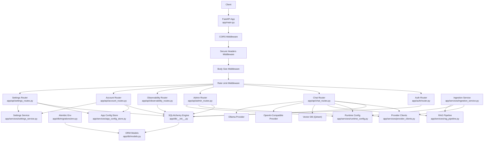

**Diagram sources**
- [app/main.py:63-163](file://app/main.py#L63-L163)
- [app/auth/router.py:24-124](file://app/auth/router.py#L24-L124)
- [app/api/chat_routes.py:28-244](file://app/api/chat_routes.py#L28-L244)
- [app/api/admin_routes.py:39-539](file://app/api/admin_routes.py#L39-L539)
- [app/api/observability_routes.py:16-56](file://app/api/observability_routes.py#L16-L56)
- [app/api/account_routes.py:25-141](file://app/api/account_routes.py#L25-L141)
- [app/api/settings_routes.py:33-353](file://app/api/settings_routes.py#L33-353)
- [app/db/__init__.py:8-21](file://app/db/__init__.py#L8-L21)
- [app/db/models.py:52-64](file://app/db/models.py#L52-L64)
- [app/db/migrations/env.py:16-50](file://app/db/migrations/env.py#L16-L50)
- [app/services/provider_clients.py:1-240](file://app/services/provider_clients.py#L1-L240)
- [app/services/runtime_config.py:1-221](file://app/services/runtime_config.py#L1-L221)
- [app/services/rag_pipeline.py:1-414](file://app/services/rag_pipeline.py#L1-L414)
- [app/services/ingestion_service.py:1-167](file://app/services/ingestion_service.py#L1-L167)
- [app/services/app_config_store.py:84-118](file://app/services/app_config_store.py#L84-L118)
- [app/services/settings_service.py:1-415](file://app/services/settings_service.py#L1-L415)

## Detailed Component Analysis

### Application Initialization and Lifecycle
- Lifespan manager performs startup tasks: ensures vector extension, creates tables, recovers stuck jobs, builds reusable components (HybridRetriever, Reranker, compiled LangGraph), pre-warms provider, and schedules audit cleanup.
- Health endpoint checks connectivity to PostgreSQL, Qdrant, and configured provider.
- Uvicorn runner configured for local development.
- **Updated** Account and settings routers are registered during application startup.

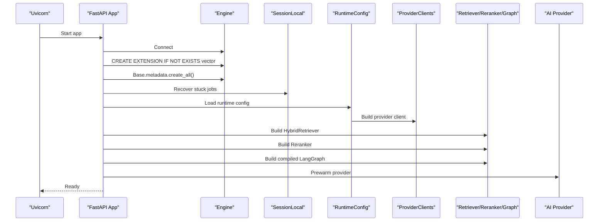

**Diagram sources**
- [app/main.py:28-61](file://app/main.py#L28-L61)
- [app/main.py:104-116](file://app/main.py#L104-L116)
- [app/services/runtime_config.py:89-172](file://app/services/runtime_config.py#L89-L172)

**Section sources**
- [app/main.py:28-61](file://app/main.py#L28-L61)
- [app/main.py:118-147](file://app/main.py#L118-L147)
- [app/main.py:150-154](file://app/main.py#L150-L154)

### Middleware Configuration
- CORS: Controlled by allowed origins list from settings.
- Secure headers: Applied via a custom middleware that updates response headers.
- Body size enforcement: Validates Content-Length against a configurable maximum.
- Rate limiting: SlowAPI middleware bound to a shared limiter instance.

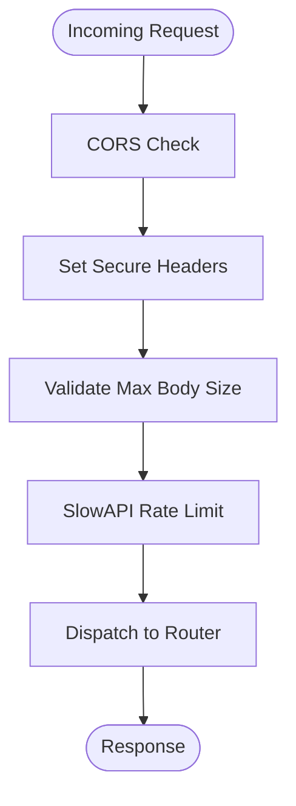

**Diagram sources**
- [app/main.py:69-95](file://app/main.py#L69-L95)
- [app/main.py:67-67](file://app/main.py#L67-L67)

**Section sources**
- [app/main.py:69-95](file://app/main.py#L69-L95)
- [app/config.py:20-22](file://app/config.py#L20-L22)

### Authentication Router and Middleware
- Authentication endpoints: login (with brute-force protection and rate limit) and logout (clears cookie).
- Password hashing and verification: bcrypt utilities.
- JWT encoding/decoding: HS256 with expiry.
- Role-based access control: dependency that enforces roles.
- Cookie security: HttpOnly, SameSite strict, optional Secure based on settings.
- **Updated** Password policy enforcement: comprehensive validation with strength requirements.

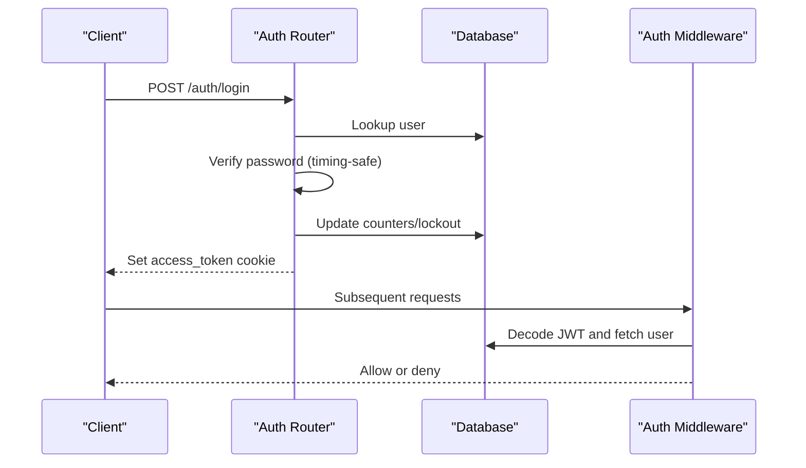

**Diagram sources**
- [app/auth/router.py:39-105](file://app/auth/router.py#L39-L105)
- [app/auth/middleware.py:51-82](file://app/auth/middleware.py#L51-L82)

**Section sources**
- [app/auth/router.py:24-124](file://app/auth/router.py#L24-L124)
- [app/auth/middleware.py:25-82](file://app/auth/middleware.py#L25-L82)

### Account Management System

#### Account Settings Endpoint
The account management system provides comprehensive user account functionality with dedicated endpoints for profile management, analytics aggregation, and security configuration.

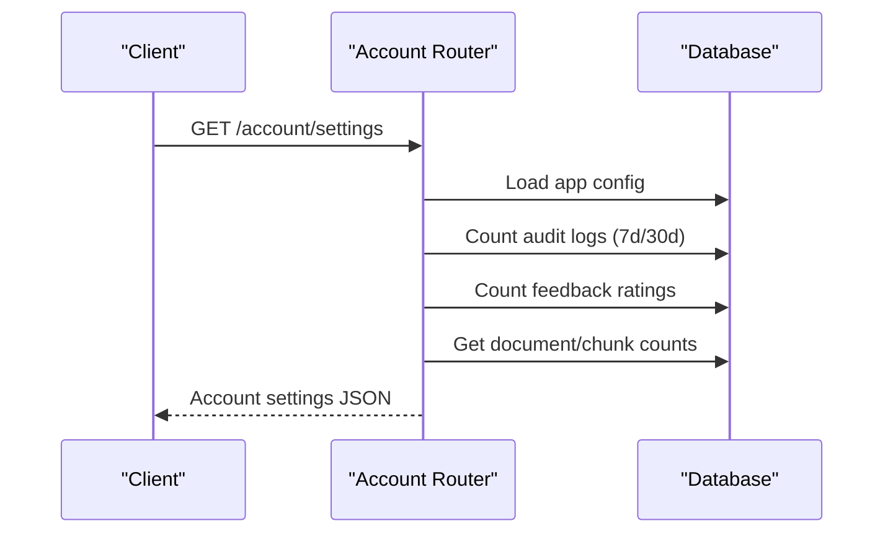

**Diagram sources**
- [app/api/account_routes.py:33-122](file://app/api/account_routes.py#L33-L122)

#### Password Management with Policy Enforcement
The system implements comprehensive password policy enforcement with strength validation and security configuration management.

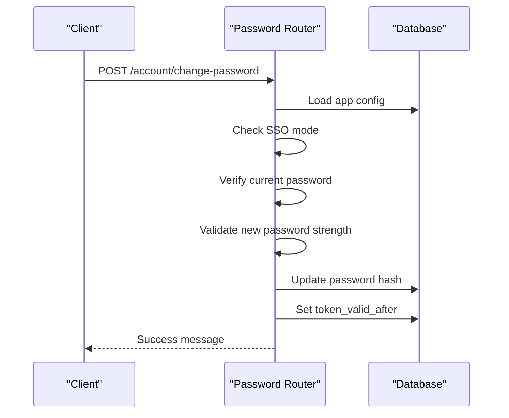

**Diagram sources**
- [app/api/account_routes.py:125-141](file://app/api/account_routes.py#L125-L141)
- [app/auth/password_policy.py:6-18](file://app/auth/password_policy.py#L6-L18)

**Section sources**
- [app/api/account_routes.py:25-141](file://app/api/account_routes.py#L25-L141)
- [app/auth/password_policy.py:6-18](file://app/auth/password_policy.py#L6-L18)

### Chat API: Endpoints and Streaming
- Blocking chat: POST /chat returns answer and citations synchronously.
- Streaming chat: POST /chat/stream emits SSE events for steps, tokens, citations, and completion metadata.
- Rate limiting applied to both endpoints.
- Uses a shared LangGraph instance stored in app state and ConversationManager for session persistence.
- **Updated** Integrated with split-client provider system for flexible AI inference backend selection with separate builders for chat, embedding, and vision operations.

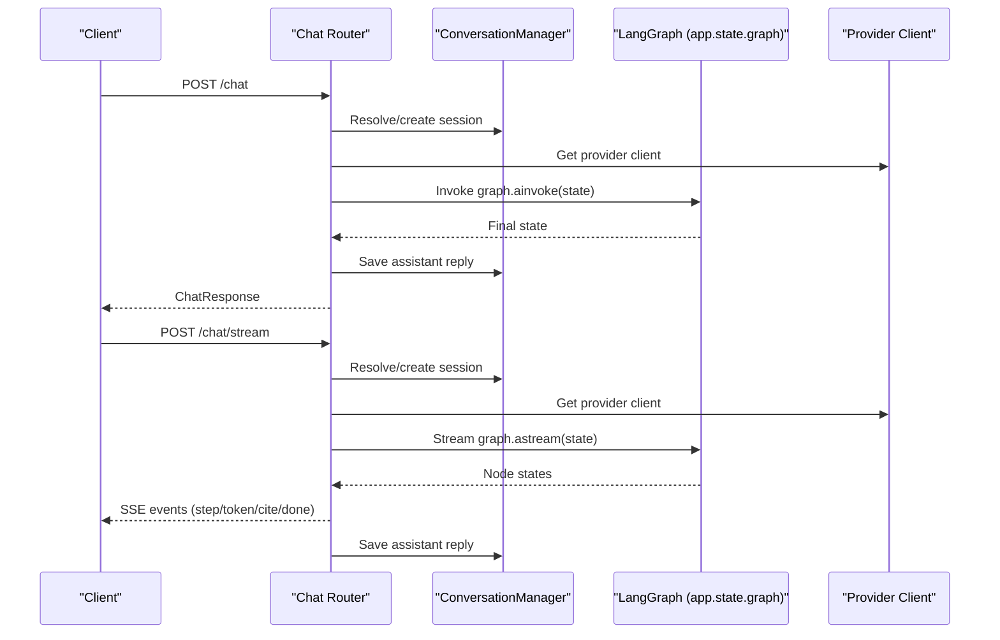

**Diagram sources**
- [app/api/chat_routes.py:109-142](file://app/api/chat_routes.py#L109-L142)
- [app/api/chat_routes.py:150-244](file://app/api/chat_routes.py#L150-L244)
- [app/services/conversation.py:26-69](file://app/services/conversation.py#L26-L69)
- [app/services/provider_clients.py:1-240](file://app/services/provider_clients.py#L1-L240)

**Section sources**
- [app/api/chat_routes.py:28-244](file://app/api/chat_routes.py#L28-L244)
- [app/services/conversation.py:26-117](file://app/services/conversation.py#L26-L117)

### Observability Endpoints
- Feedback submission and admin listing.
- Cost statistics aggregation.

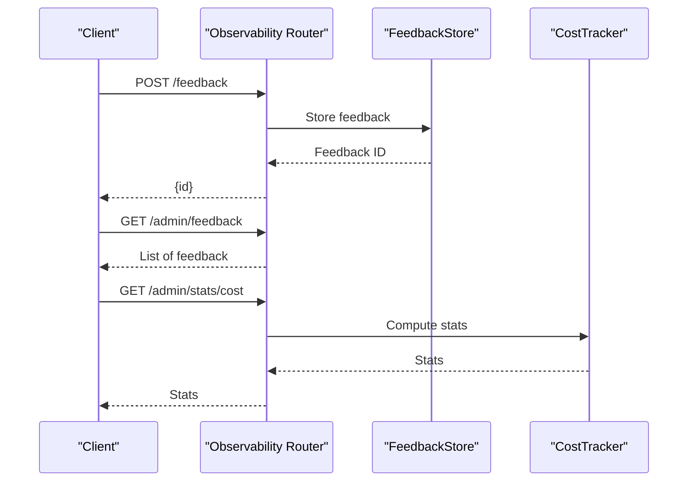

**Diagram sources**
- [app/api/observability_routes.py:26-56](file://app/api/observability_routes.py#L26-L56)

**Section sources**
- [app/api/observability_routes.py:16-56](file://app/api/observability_routes.py#L16-L56)

### Database Integration and Migrations
- Engine and session factory configured with settings.
- Declarative base and models define entities and relationships.
- Vector column type used for embeddings.
- Alembic env loads models for autogenerate and runs migrations against configured URL.
- **Updated** Enhanced User model with token_valid_after field for password-based token invalidation.

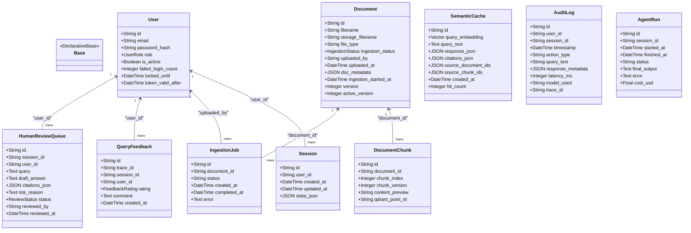

**Diagram sources**
- [app/db/models.py:52-64](file://app/db/models.py#L52-L64)

**Section sources**
- [app/db/__init__.py:8-21](file://app/db/__init__.py#L8-L21)
- [app/db/models.py:52-64](file://app/db/models.py#L52-L64)
- [app/db/migrations/env.py:16-50](file://app/db/migrations/env.py#L16-L50)
- [alembic.ini:8-90](file://alembic.ini#L8-L90)

### Configuration Management and Security Settings
- Settings include database URL, external service endpoints, secrets, CORS origins, enforcement flags, retention policies, thresholds, and size limits.
- Computed property provides parsed origin list.
- Security headers middleware applies hardened defaults.
- Cookie security toggled by HTTPS enforcement setting.
- **Updated** Application configuration store with encryption for sensitive keys and type coercion.

**Section sources**
- [app/config.py:5-24](file://app/config.py#L5-L24)
- [app/main.py:25-25](file://app/main.py#L25-L25)
- [app/main.py:100-100](file://app/main.py#L100-L100)
- [app/services/app_config_store.py:84-118](file://app/services/app_config_store.py#L84-L118)

## Account Management System

### Account Settings API
The account management system provides comprehensive user account functionality with dedicated endpoints for profile management, analytics aggregation, and security configuration.

#### Profile Information
- User identification, email, role, and activation status
- Account creation date and last activity timestamp
- Real-time security configuration including session hours and SSO status

#### Usage Analytics
- Question volume tracking for 7-day and 30-day periods
- Feedback sentiment analysis with positive and negative ratings
- Last activity timestamp for engagement monitoring

#### Knowledge Base Metrics
- Document count and chunk count for content inventory
- Failed ingestion attempts and in-progress operations
- Real-time synchronization with document processing status

#### Security Configuration
- Session duration settings with configurable hours (default 24)
- Single Sign-On (SSO) integration status
- Password change capability based on SSO configuration

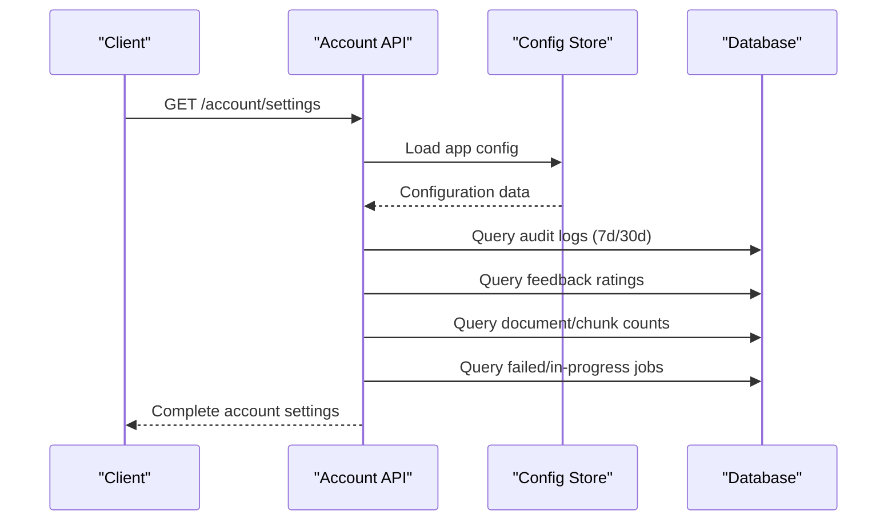

**Diagram sources**
- [app/api/account_routes.py:33-122](file://app/api/account_routes.py#L33-L122)

**Section sources**
- [app/api/account_routes.py:33-122](file://app/api/account_routes.py#L33-L122)

### Password Management with Policy Enforcement
The system implements comprehensive password policy enforcement with strength validation and security configuration management.

#### Password Strength Requirements
- Minimum 12 characters length
- Must contain uppercase letters (A-Z)
- Must contain lowercase letters (a-z)
- Must contain digits (0-9)
- Must contain special characters (!@#$%^&*)

#### Security Features
- Current password verification before changes
- Token invalidation upon password change
- SSO integration that disables password changes
- Real-time validation with immediate feedback

#### Token Management
- Automatic token invalidation when password changes
- New tokens required after password reset
- Timestamp-based token validation for security

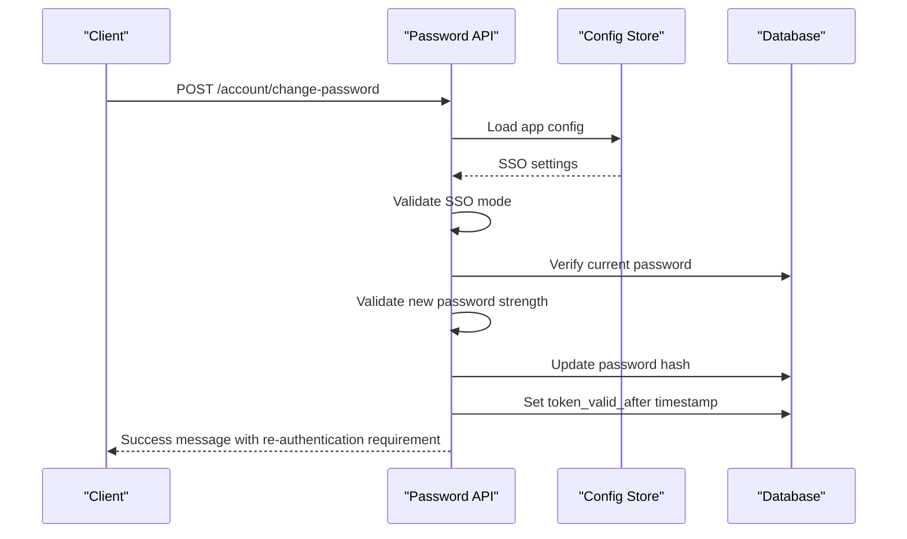

**Diagram sources**
- [app/api/account_routes.py:125-141](file://app/api/account_routes.py#L125-L141)
- [app/auth/password_policy.py:6-18](file://app/auth/password_policy.py#L6-L18)

**Section sources**
- [app/api/account_routes.py:125-141](file://app/api/account_routes.py#L125-L141)
- [app/auth/password_policy.py:6-18](file://app/auth/password_policy.py#L6-L18)

## Enhanced Settings Management

### Comprehensive Settings API
The settings management system provides extensive configuration capabilities with mode-specific routing and runtime configuration.

#### Settings Serialization
- Combines environment variables with database overrides
- Provides live metadata including cost statistics and model availability
- Supports real-time model discovery for both local and cloud providers

#### Provider Configuration
- Three provider modes: local, hybrid, cloud
- Dynamic model discovery and validation
- Runtime component rebuilding with automatic refresh

#### Security Controls
- Session duration management (1-720 hours)
- Audit log retention policies (30-3650 days)
- Privacy controls including PII redaction
- Cost monitoring with daily and monthly ceilings

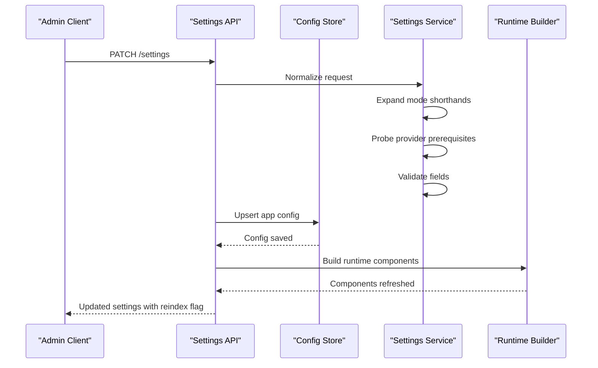

**Diagram sources**
- [app/api/settings_routes.py:227-286](file://app/api/settings_routes.py#L227-L286)
- [app/services/settings_service.py:138-164](file://app/services/settings_service.py#L138-L164)

**Section sources**
- [app/api/settings_routes.py:106-208](file://app/api/settings_routes.py#L106-L208)
- [app/api/settings_routes.py:227-286](file://app/api/settings_routes.py#L227-L286)
- [app/services/settings_service.py:138-164](file://app/services/settings_service.py#L138-L164)

### Provider Management Capabilities
The admin API has been significantly enhanced with comprehensive provider management capabilities including mode-specific routing and runtime configuration:

#### Settings Management Endpoints
- **GET /settings**: Returns current configuration including provider settings and derived mode information
- **PATCH /settings**: Updates configuration with validation and runtime refresh
- **POST /settings/provider/test**: Validates provider connectivity without persisting changes

#### Provider Configuration Fields
The settings API now supports extensive provider configuration with mode-specific fields:

- **providerType**: Switch between "ollama" and "openai_compatible"
- **providerBaseUrl**: Base URL for the selected provider
- **providerApiKey**: API key for OpenAI-compatible providers
- **providerChatModel**: Model for text generation
- **providerEmbeddingModel**: Model for embeddings
- **providerVisionModel**: Model for vision processing
- **embeddingSource**: "ollama" | "provider" for mode selection
- **providerMode**: "local" | "hybrid" | "cloud" for simplified configuration

#### Mode-Specific Validation and Routing
The system provides intelligent validation and routing based on provider mode:

**Local Mode Validation**:
- Requires local Ollama availability for all operations
- No API key required for providerBaseUrl
- Automatically sets embeddingSource to "ollama"

**Hybrid Mode Validation**:
- Validates local Ollama availability for embeddings
- Validates cloud provider for chat operations
- Requires embedding model availability in local Ollama
- Automatically sets providerBaseUrl to trusted local address

**Cloud Mode Validation**:
- Validates cloud provider embedding endpoint accessibility
- Requires API key for OpenAI-compatible providers
- Validates embedding model support in cloud provider

#### Enhanced Error Handling and Granular Responses
Enhanced Error Handling for Provider Connections
The test_provider_connection endpoint now provides granular error responses that distinguish between different types of provider errors:

- **Invalid Credentials (401/403)**: Returns "Invalid credentials — check your API key" with 503 status code
- **Other Provider Errors**: Returns "Provider returned an error" with 503 status code  
- **Connection Failures**: Returns "Connection failed: [error]" with 503 status code
- **Missing API Key**: Returns "providerApiKey is required for openai_compatible" with 422 status code

**Section sources**
- [app/api/admin_routes.py:1045-1093](file://app/api/admin_routes.py#L1045-L1093)
- [app/services/runtime_config.py:152-172](file://app/services/runtime_config.py#L152-L172)

## Split-Client Provider Architecture

### Provider Architecture Overview
The application now features a sophisticated split-client provider architecture that enables separate management of chat, embedding, and vision operations through dedicated provider builders. This architecture supports three distinct modes: local (Ollama only), hybrid (cloud chat + local embeddings), and cloud (cloud providers for all operations) with mode-specific routing logic.

```mermaid
graph TB
subgraph "Split-Client Architecture"
BUILD["build_provider()<br/>Chat Operations"]
EMB_BUILD["build_embedding_provider()<br/>Embedding Operations"]
VIS_BUILD["build_vision_provider()<br/>Vision Operations"]
MODE["Mode Detection<br/>provider_mode"]
END
subgraph "Provider Builders"
BUILD --> OA_CHAT["OpenAICompatibleProvider<br/>Chat"]
BUILD --> OL_CHAT["OllamaProvider<br/>Chat"]
EMB_BUILD --> OA_EMB["OpenAICompatibleProvider<br/>Embeddings"]
EMB_BUILD --> OL_EMB["OllamaProvider<br/>Embeddings"]
VIS_BUILD --> OA_VISION["OpenAICompatibleProvider<br/>Vision"]
VIS_BUILD --> OL_VISION["OllamaProvider<br/>Vision"]
END
subgraph "Mode Logic"
MODE --> LOCAL["Local Mode<br/>provider_type='ollama'"]
MODE --> HYBRID["Hybrid Mode<br/>provider_type='openai_compatible'<br/>embedding_source='ollama'"]
MODE --> CLOUD["Cloud Mode<br/>provider_type='openai_compatible'<br/>embedding_source='provider'"]
END
BUILD --> MODE
EMB_BUILD --> MODE
VIS_BUILD --> MODE
```

**Diagram sources**
- [app/services/runtime_config.py:147-196](file://app/services/runtime_config.py#L147-L196)
- [app/services/runtime_config.py:57-61](file://app/services/runtime_config.py#L57-L61)

### Provider Client Protocols
The split-client architecture maintains clear protocol interfaces that ensure consistent behavior across different AI providers:

- **ChatClient Protocol**: Defines asynchronous chat interface with system and user prompts
- **EmbeddingClient Protocol**: Provides query and document embedding capabilities
- **VisionClient Protocol**: Handles image description and vision processing
- **ProviderUsage Dataclass**: Standardizes token usage reporting across providers

### Provider Builders and Mode-Specific Routing
The architecture introduces three specialized provider builders with intelligent mode detection:

**build_provider()** - Primary chat operations builder
- Returns OpenAICompatibleProvider for cloud chat operations
- Returns OllamaProvider for local chat operations
- Used for text generation and conversation management

**build_embedding_provider()** - Embedding operations builder  
- Returns OllamaProvider for hybrid mode (cloud chat + local embeddings)
- Returns OpenAICompatibleProvider for cloud mode (all operations cloud)
- Always returns OllamaProvider for local mode regardless of embedding_source
- Used for document indexing and similarity search

**build_vision_provider()** - Vision operations builder
- Returns OllamaProvider for hybrid mode (vision always local)
- Returns OpenAICompatibleProvider for cloud mode
- Always returns OllamaProvider for local mode (qwen2.5vl:7b is local)
- Used for OCR and image description capabilities

### Mode Detection Logic
The system determines provider mode through the `provider_mode` property:

- **Local Mode**: `provider_type='ollama'` → Uses Ollama for all operations
- **Hybrid Mode**: `provider_type='openai_compatible'` AND `embedding_source='ollama'` → Cloud chat + local embeddings
- **Cloud Mode**: `provider_type='openai_compatible'` AND `embedding_source='provider'` → All operations cloud

### Streamlined Embedding Provider System
**Updated** The embedding provider system has been streamlined by removing the unused `OllamaEmbeddingProvider` class. The current implementation uses a protocol-based approach that allows any provider implementing the `EmbeddingClient` protocol to handle embedding operations. This reduces code complexity while maintaining the same interface contract.

The RAG pipeline's `_embed_batch` method now uses the generic `EmbeddingClient` protocol instead of a dedicated `OllamaEmbeddingProvider`, enabling seamless integration with both OpenAI-compatible and Ollama providers for embedding operations.

**Section sources**
- [app/services/provider_clients.py:1-240](file://app/services/provider_clients.py#L1-L240)
- [app/services/runtime_config.py:1-221](file://app/services/runtime_config.py#L1-L221)
- [app/services/rag_pipeline.py:1-414](file://app/services/rag_pipeline.py#L1-L414)
- [app/components/embedding_provider.py:1-9](file://app/components/embedding_provider.py#L1-L9)
- [tests/test_runtime_config.py:149-237](file://tests/test_runtime_config.py#L149-L237)

## Enhanced Admin API Endpoints

### Provider Management Capabilities
The admin API has been significantly enhanced with comprehensive provider management capabilities including mode-specific routing and runtime configuration:

#### Settings Management Endpoints
- **GET /settings**: Returns current configuration including provider settings and derived mode information
- **PATCH /settings**: Updates configuration with validation and runtime refresh
- **POST /settings/provider/test**: Validates provider connectivity without persisting changes

#### Provider Configuration Fields
The settings API now supports extensive provider configuration with mode-specific fields:

- **providerType**: Switch between "ollama" and "openai_compatible"
- **providerBaseUrl**: Base URL for the selected provider
- **providerApiKey**: API key for OpenAI-compatible providers
- **providerChatModel**: Model for text generation
- **providerEmbeddingModel**: Model for embeddings
- **providerVisionModel**: Model for vision processing
- **embeddingSource**: "ollama" | "provider" for mode selection
- **providerMode**: "local" | "hybrid" | "cloud" for simplified configuration

#### Mode-Specific Validation and Routing
The system provides intelligent validation and routing based on provider mode:

**Local Mode Validation**:
- Requires local Ollama availability for all operations
- No API key required for providerBaseUrl
- Automatically sets embeddingSource to "ollama"

**Hybrid Mode Validation**:
- Validates local Ollama availability for embeddings
- Validates cloud provider for chat operations
- Requires embedding model availability in local Ollama
- Automatically sets providerBaseUrl to trusted local address

**Cloud Mode Validation**:
- Validates cloud provider embedding endpoint accessibility
- Requires API key for OpenAI-compatible providers
- Validates embedding model support in cloud provider

#### Enhanced Error Handling and Granular Responses
Enhanced Error Handling for Provider Connections
The test_provider_connection endpoint now provides granular error responses that distinguish between different types of provider errors:

- **Invalid Credentials (401/403)**: Returns "Invalid credentials — check your API key" with 503 status code
- **Other Provider Errors**: Returns "Provider returned an error" with 503 status code  
- **Connection Failures**: Returns "Connection failed: [error]" with 503 status code
- **Missing API Key**: Returns "providerApiKey is required for openai_compatible" with 422 status code

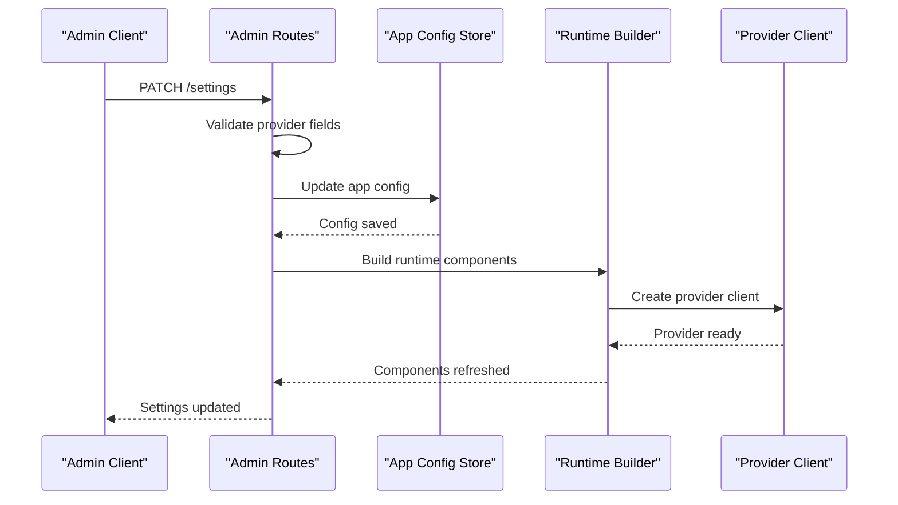

**Diagram sources**
- [app/api/admin_routes.py:1045-1093](file://app/api/admin_routes.py#L1045-L1093)
- [app/services/runtime_config.py:152-172](file://app/services/runtime_config.py#L152-L172)

### Administrative Operations Enhancement
- Document management: upload, list, poll status, delete, reindex
- User management: list, create, deactivate
- Audit logs: list and CSV export
- Statistics: aggregate queries, latency, cost, cache hits
- Human review queue: list, approve, reject items
- **Updated** Provider management: configuration validation, connection testing, runtime refresh with mode-specific routing
- **Updated** Account management: user analytics, password policy enforcement, security configuration
- Rate limits and role enforcement applied consistently

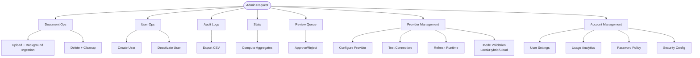

**Diagram sources**
- [app/api/admin_routes.py:63-243](file://app/api/admin_routes.py#L63-L243)
- [app/api/admin_routes.py:284-339](file://app/api/admin_routes.py#L284-L339)
- [app/api/admin_routes.py:346-418](file://app/api/admin_routes.py#L346-L418)
- [app/api/admin_routes.py:426-458](file://app/api/admin_routes.py#L426-L458)
- [app/api/admin_routes.py:466-529](file://app/api/admin_routes.py#L466-L529)
- [app/api/admin_routes.py:1095-1137](file://app/api/admin_routes.py#L1095-L1137)
- [app/api/account_routes.py:33-141](file://app/api/account_routes.py#L33-L141)

**Section sources**
- [app/api/admin_routes.py:39-539](file://app/api/admin_routes.py#L39-L539)
- [app/api/admin_routes.py:1045-1137](file://app/api/admin_routes.py#L1045-L1137)
- [app/api/account_routes.py:33-141](file://app/api/account_routes.py#L33-L141)

## Dependency Analysis
The application exhibits clear separation of concerns with enhanced split-client provider management and comprehensive account management system:
- Routers depend on shared dependencies (database session, current user, rate limiter).
- Services encapsulate domain logic and interact with external systems.
- Database layer is decoupled from routers via SQLAlchemy ORM.
- External services are integrated via settings and app state.
- **Updated** Account management system adds dedicated endpoints for user analytics and security configuration.
- **Updated** Password policy enforcement integrates with authentication middleware and configuration store.
- **Updated** Split-client provider system adds protocol-based abstraction layer for AI inference backends with separate builders for chat, embedding, and vision operations.
- **Updated** Mode-specific routing logic enables intelligent provider selection based on configuration.

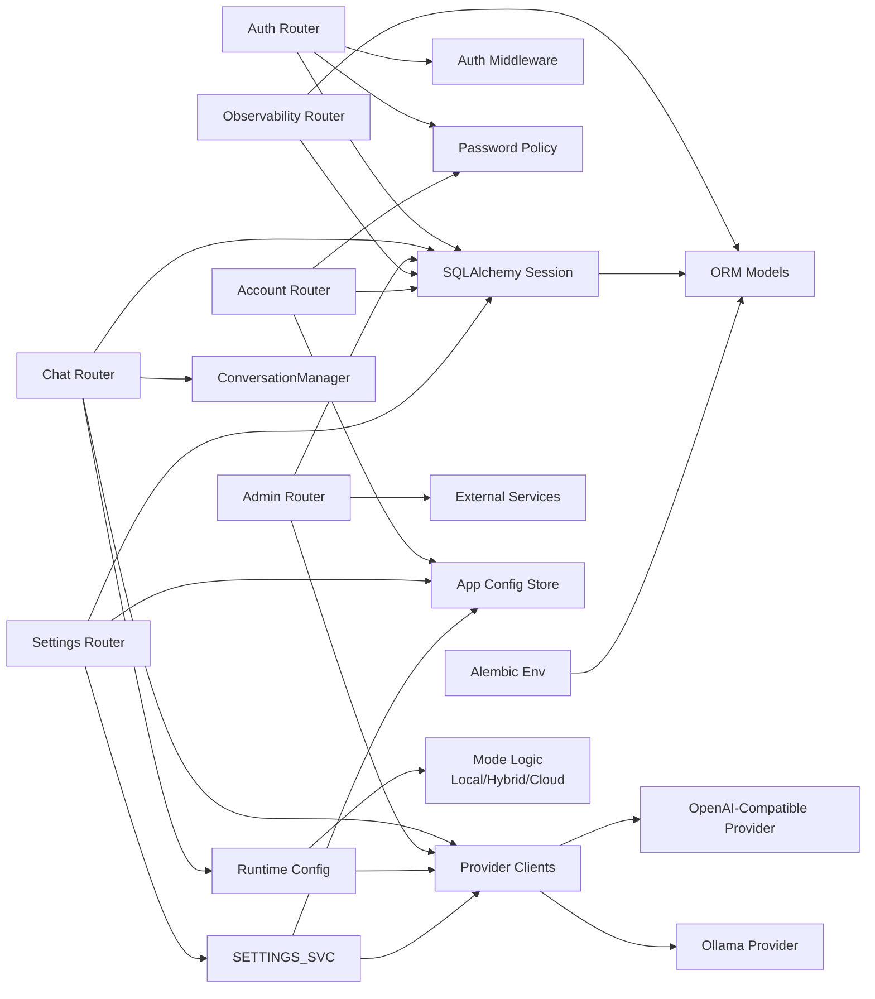

**Diagram sources**
- [app/auth/router.py:14-17](file://app/auth/router.py#L14-L17)
- [app/api/chat_routes.py:21-24](file://app/api/chat_routes.py#L21-L24)
- [app/api/admin_routes.py:23-36](file://app/api/admin_routes.py#L23-L36)
- [app/api/observability_routes.py:13-14](file://app/api/observability_routes.py#L13-L14)
- [app/api/account_routes.py:12-23](file://app/api/account_routes.py#L12-L23)
- [app/api/settings_routes.py:18-29](file://app/api/settings_routes.py#L18-L29)
- [app/db/__init__.py:8-21](file://app/db/__init__.py#L8-L21)
- [app/db/migrations/env.py:16-18](file://app/db/migrations/env.py#L16-L18)
- [app/services/provider_clients.py:1-240](file://app/services/provider_clients.py#L1-L240)
- [app/services/runtime_config.py:1-221](file://app/services/runtime_config.py#L1-L221)
- [app/services/app_config_store.py:84-118](file://app/services/app_config_store.py#L84-L118)
- [app/services/settings_service.py:1-415](file://app/services/settings_service.py#L1-L415)

**Section sources**
- [pyproject.toml:9-46](file://pyproject.toml#L9-L46)

## Performance Considerations
- Pre-warming external services: Ollama model is warmed up asynchronously at startup to reduce first-query latency.
- Vector extension: Ensures pgvector is available for similarity search.
- Session state size limit: Prevents oversized state_json to maintain DB performance.
- Streaming responses: SSE streaming reduces memory overhead and improves perceived latency.
- Rate limiting: Protects downstream services and prevents abuse.
- Connection pooling: Engine configured with pre-ping to handle stale connections.
- **Updated** Account management system optimizes database queries with selective filtering by user_id.
- **Updated** Password policy enforcement validates new passwords efficiently without external dependencies.
- **Updated** Split-client architecture: Separate provider builders enable optimized resource allocation for different operation types.
- **Updated** Mode-specific routing: Intelligent provider selection minimizes cross-service calls and maximizes performance.
- **Updated** Provider caching: Runtime configuration cached to minimize repeated provider initialization overhead.
- **Updated** Connection testing: Lightweight connectivity checks prevent wasted API calls with invalid configurations.
- **Updated** Streamlined embedding operations: Removed redundant OllamaEmbeddingProvider class reduces code complexity and improves maintainability.

**Section sources**
- [app/main.py:104-116](file://app/main.py#L104-L116)
- [app/main.py:35-37](file://app/main.py#L35-L37)
- [app/services/conversation.py:18-18](file://app/services/conversation.py#L18-L18)
- [app/api/chat_routes.py:237-244](file://app/api/chat_routes.py#L237-L244)
- [app/db/__init__.py:8-8](file://app/db/__init__.py#L8-L8)
- [app/services/runtime_config.py:152-172](file://app/services/runtime_config.py#L152-L172)
- [app/api/account_routes.py:43-93](file://app/api/account_routes.py#L43-L93)

## Troubleshooting Guide
- Health endpoint diagnostics: Inspect PostgreSQL, Qdrant, and configured provider readiness for quick triage.
- Authentication failures: Check brute-force lockouts, password length requirements, and JWT decoding errors.
- Chat pipeline errors: Validate LangGraph availability in app state and session resolution.
- Admin operations: Confirm role-based access and upload size limits.
- Database migrations: Ensure Alembic env loads models and connects to the configured URL.
- **Updated** Account management issues: Verify user authentication and configuration loading for account settings endpoint.
- **Updated** Password policy violations: Check minimum length requirements and character type validation for new passwords.
- **Updated** Provider issues: Use `/settings/provider/test` endpoint to validate provider connectivity and configuration with granular error responses.
- **Updated** Enhanced error handling: The provider test endpoint now distinguishes between invalid credentials (401/403 with "Invalid credentials — check your API key") and other provider errors ("Provider returned an error").
- **Updated** Runtime refresh failures: Check provider type validation and required API keys for OpenAI-compatible providers.
- **Updated** Embedding dimension mismatches: Verify embedding model dimensions match configured expectations.
- **Updated** Mode-specific routing issues: Validate provider mode configuration and ensure required services are available for the selected mode.
- **Updated** Split-client architecture problems: Verify that separate provider builders are correctly instantiated for chat, embedding, and vision operations.
- **Updated** Streamlined embedding system: If encountering embedding-related issues, verify that the provider implements the EmbeddingClient protocol correctly.
- **Updated** Token invalidation issues: Check that password changes trigger token_valid_after updates and require re-authentication.

**Section sources**
- [app/main.py:118-147](file://app/main.py#L118-L147)
- [app/auth/router.py:53-82](file://app/auth/router.py#L53-L82)
- [app/api/chat_routes.py:120-122](file://app/api/chat_routes.py#L120-L122)
- [app/api/admin_routes.py:63-114](file://app/api/admin_routes.py#L63-L114)
- [app/db/migrations/env.py:20-20](file://app/db/migrations/env.py#L20-L20)
- [app/api/admin_routes.py:1095-1137](file://app/api/admin_routes.py#L1095-L1137)
- [app/api/account_routes.py:125-141](file://app/api/account_routes.py#L125-L141)

## Conclusion
The backend is structured for modularity, scalability, and safety with enhanced split-client provider management capabilities and comprehensive account management system. FastAPI's dependency injection, SQLAlchemy ORM, and Alembic migrations provide a robust foundation. The middleware stack and rate limiting protect resources, while JWT-based authentication and role checks enforce security. The new split-client provider architecture enables flexible AI inference backend selection with separate builders for chat, embedding, and vision operations, along with comprehensive runtime management and mode-specific routing logic. The account management system provides user-specific analytics, password policy enforcement, and security configuration management. The chat pipeline leverages streaming and external services for responsive user experiences. Following the patterns documented here enables safe and efficient extension of the API with provider flexibility, enhanced administrative capabilities, comprehensive user management, and optimized performance through intelligent mode detection and routing.

## Appendices

### Practical Examples

- Add a new API endpoint
  - Define a new router under app/api/ with appropriate tags and dependencies.
  - Apply rate limiting and authentication/authorization decorators as needed.
  - Register the router in app/main.py include_router calls.

- Implement custom middleware
  - Add a new async middleware function in app/main.py with proper ordering relative to existing middleware.
  - Use settings for configuration and ensure it updates responses or short-circuits requests appropriately.

- Integrate with external services
  - Configure endpoints and credentials in app/config.py.
  - Access settings in routers/services and propagate errors gracefully.
  - Use app.state to share long-lived clients or compiled components.

- Extend database models
  - Add new models in app/db/models.py inheriting from Base.
  - Run alembic revision and upgrade to apply schema changes.
  - Update app/db/migrations/env.py if autogenerate requires explicit imports.

- **Updated** Implement new provider client with split-client architecture
  - Define a new protocol in app/services/provider_clients.py following existing patterns.
  - Implement the provider class with proper error handling and validation.
  - Update build_provider(), build_embedding_provider(), and build_vision_provider() functions to handle the new provider type.
  - Add connection testing and validation logic for all three operation types.
  - Update admin settings endpoints to support new provider configuration with mode-specific routing.

- **Updated** Extend admin API with provider mode management
  - Add new admin endpoints for provider configuration and testing.
  - Implement validation logic for provider-specific fields with mode-specific constraints.
  - Add runtime refresh capabilities for seamless provider switching with intelligent mode detection.
  - Include comprehensive error handling and user feedback with granular error responses.
  - Implement mode-specific routing logic supporting local, hybrid, and cloud configurations.

- **Updated** Streamline embedding provider system
  - Remove unused OllamaEmbeddingProvider class to reduce code complexity.
  - Ensure all providers implement the EmbeddingClient protocol for consistent embedding operations.
  - Update RAG pipeline to use generic EmbeddingClient protocol instead of provider-specific classes.
  - Test embedding functionality across all supported providers with mode-specific routing.

- **Updated** Implement split-client architecture in ingestion service
  - Modify run_ingestion() to use separate provider builders for chat, embedding, and vision operations.
  - Implement mode-specific routing logic for optimal resource allocation.
  - Update provider instantiation to support hybrid mode with different providers for different operations.
  - Test ingestion pipeline with various provider configurations and modes.

- **Updated** Implement comprehensive account management system
  - Add new account routes for settings and password management.
  - Implement password policy enforcement with strength validation.
  - Create user-specific analytics aggregation with database queries.
  - Integrate with security configuration management and SSO integration.
  - Add token invalidation upon password changes for enhanced security.

- **Updated** Extend settings API with comprehensive configuration management
  - Add new settings endpoints for provider configuration and testing.
  - Implement validation logic for provider-specific fields with mode-specific constraints.
  - Add runtime refresh capabilities for seamless provider switching with intelligent mode detection.
  - Include comprehensive error handling and user feedback with granular error responses.
  - Implement mode-specific routing logic supporting local, hybrid, and cloud configurations.

- Development workflow
  - Use pytest for unit/integration tests with asyncio support.
  - Leverage ruff and mypy for linting and type checking.
  - Use uvicorn with reload for local development.
  - Manage environment variables via .env and settings model.

**Section sources**
- [app/main.py:98-101](file://app/main.py#L98-L101)
- [app/config.py:5-24](file://app/config.py#L5-L24)
- [app/db/models.py:52-64](file://app/db/models.py#L52-L64)
- [app/db/migrations/env.py:16-18](file://app/db/migrations/env.py#L16-L18)
- [pyproject.toml:84-97](file://pyproject.toml#L84-L97)
- [app/services/provider_clients.py:1-240](file://app/services/provider_clients.py#L1-L240)
- [app/api/admin_routes.py:1045-1137](file://app/api/admin_routes.py#L1045-L1137)
- [app/api/account_routes.py:25-141](file://app/api/account_routes.py#L25-L141)
- [app/auth/password_policy.py:6-18](file://app/auth/password_policy.py#L6-L18)
- [tests/test_account.py:121-246](file://tests/test_account.py#L121-L246)
- [tests/test_provider_clients.py:1-80](file://tests/test_provider_clients.py#L1-L80)
- [app/services/ingestion_service.py:1-167](file://app/services/ingestion_service.py#L1-L167)
- [tests/test_runtime_config.py:149-237](file://tests/test_runtime_config.py#L149-L237)
- [app/services/app_config_store.py:84-118](file://app/services/app_config_store.py#L84-L118)
- [app/services/settings_service.py:138-164](file://app/services/settings_service.py#L138-L164)