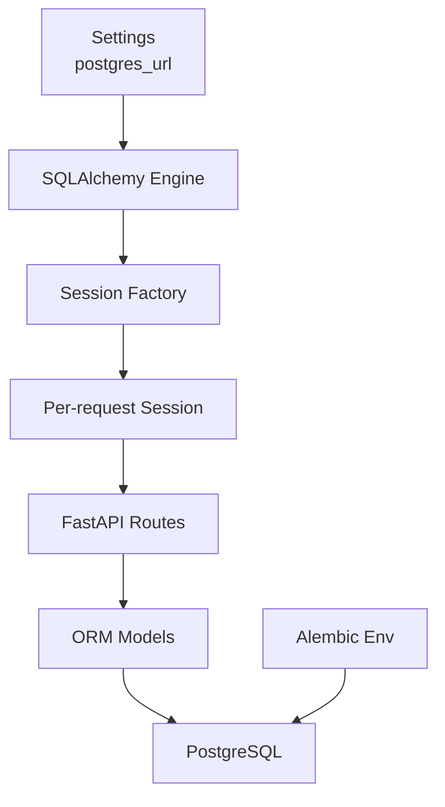
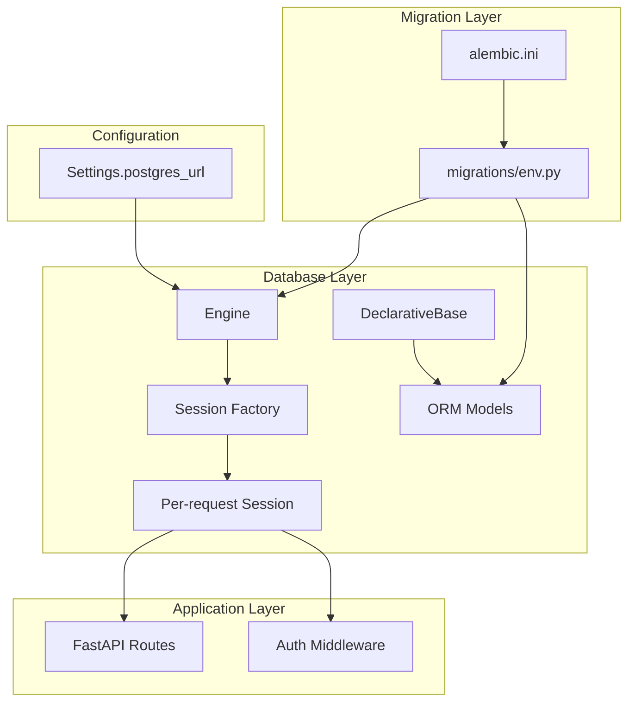
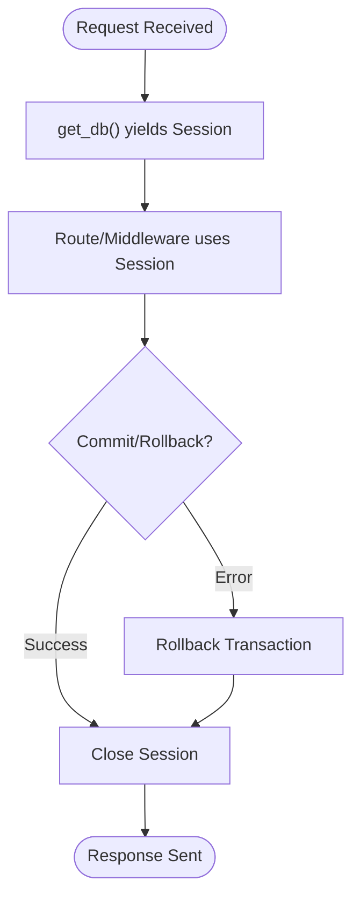
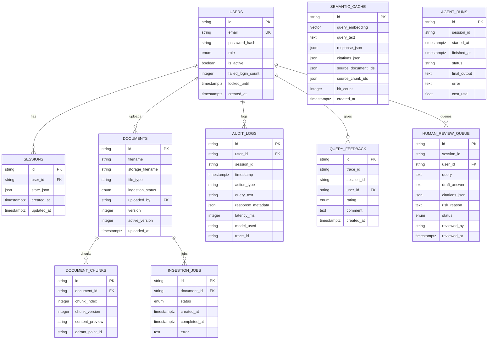
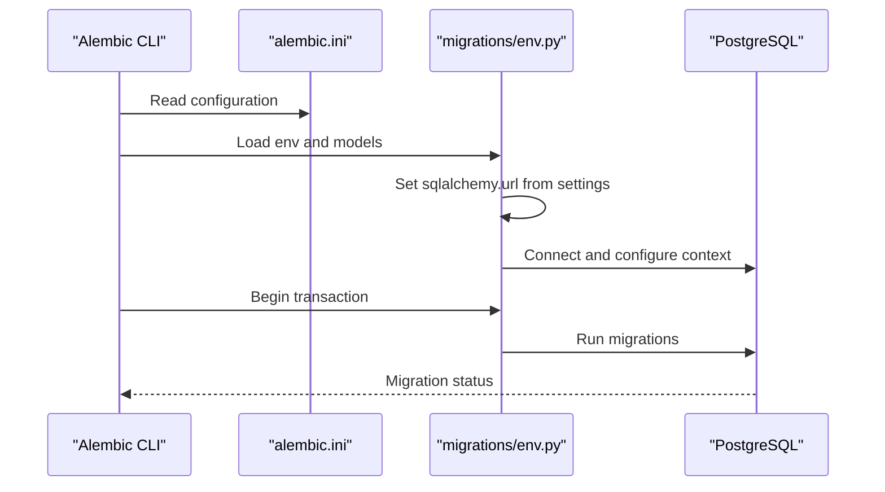
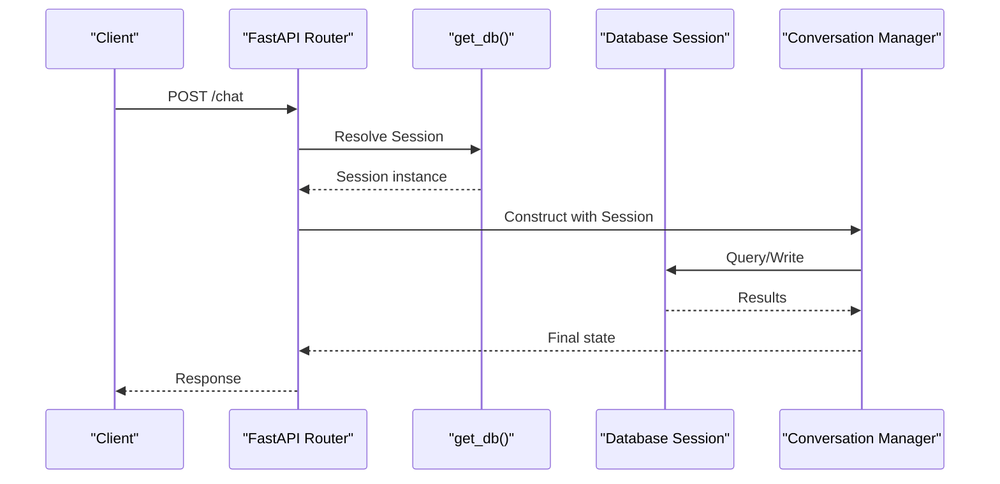
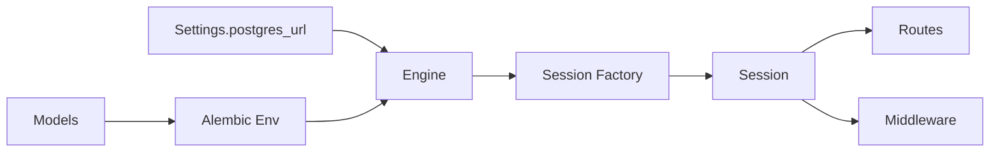

# Database Integration

<cite>
**Referenced Files in This Document**
- [app/db/__init__.py](file://safe4ai-pilot/app/db/__init__.py)
- [app/db/models.py](file://safe4ai-pilot/app/db/models.py)
- [app/config.py](file://safe4ai-pilot/app/config.py)
- [app/db/migrations/env.py](file://safe4ai-pilot/app/db/migrations/env.py)
- [alembic.ini](file://safe4ai-pilot/alembic.ini)
- [app/api/chat_routes.py](file://safe4ai-pilot/app/api/chat_routes.py)
- [app/auth/middleware.py](file://safe4ai-pilot/app/auth/middleware.py)
</cite>

## Table of Contents
1. [Introduction](#introduction)
2. [Project Structure](#project-structure)
3. [Core Components](#core-components)
4. [Architecture Overview](#architecture-overview)
5. [Detailed Component Analysis](#detailed-component-analysis)
6. [Dependency Analysis](#dependency-analysis)
7. [Performance Considerations](#performance-considerations)
8. [Troubleshooting Guide](#troubleshooting-guide)
9. [Conclusion](#conclusion)
10. [Appendices](#appendices)

## Introduction
This document explains the database integration built with SQLAlchemy ORM in the project. It covers engine and session configuration, declarative model definitions, and the Alembic migration system. It also documents how database connections are established and used across FastAPI endpoints, how vector extensions are integrated, and how to manage migrations safely. Practical guidance is included for querying, relationship handling, transactions, performance tuning, indexing, and maintenance.

## Project Structure
The database integration is centered around a small set of modules:
- Engine and session factory are defined in the database package initializer.
- Declarative models define the schema and relationships.
- Alembic configuration and environment script orchestrate migrations.
- Application routes and middleware depend on the shared database session provider.
- Global settings supply the database URL.

**Diagram sources**
- [app/db/__init__.py:1-22](file://safe4ai-pilot/app/db/__init__.py#L1-L22)
- [app/config.py:1-48](file://safe4ai-pilot/app/config.py#L1-L48)
- [app/db/migrations/env.py:1-51](file://safe4ai-pilot/app/db/migrations/env.py#L1-L51)

**Section sources**
- [app/db/__init__.py:1-22](file://safe4ai-pilot/app/db/__init__.py#L1-L22)
- [app/db/models.py:1-182](file://safe4ai-pilot/app/db/models.py#L1-L182)
- [app/config.py:1-48](file://safe4ai-pilot/app/config.py#L1-L48)
- [app/db/migrations/env.py:1-51](file://safe4ai-pilot/app/db/migrations/env.py#L1-L51)
- [alembic.ini:1-150](file://safe4ai-pilot/alembic.ini#L1-L150)

## Core Components
- Engine and Session Factory
  - The engine is created from the configured PostgreSQL URL with pre-ping enabled for robust connection health checks.
  - A sessionmaker binds the engine and configures autocommit and autoflush to manual modes for explicit transaction control.
  - A dependency generator yields a per-request session and ensures it is closed afterward.

- Declarative Base and Models
  - A shared DeclarativeBase subclass is used across all models.
  - Models include core entities such as User, Session, Document, DocumentChunk, SemanticCache, AuditLog, AgentRun, QueryFeedback, IngestionJob, and HumanReviewQueue.
  - Enums encapsulate domain statuses and roles.
  - Vector columns are supported via the pgvector extension for semantic caching.

- Alembic Migration System
  - Alembic is configured to load migrations from the app’s migrations directory.
  - The environment script sets the SQLAlchemy URL from settings and wires target metadata from the shared Base.
  - Migration scripts are generated and executed against the configured database.

- Application Integration
  - Routes and middleware depend on the shared database session provider to perform queries and mutations.
  - Authentication middleware resolves the current user from the database using the session.

**Section sources**
- [app/db/__init__.py:1-22](file://safe4ai-pilot/app/db/__init__.py#L1-L22)
- [app/db/models.py:1-182](file://safe4ai-pilot/app/db/models.py#L1-L182)
- [app/db/migrations/env.py:1-51](file://safe4ai-pilot/app/db/migrations/env.py#L1-L51)
- [alembic.ini:1-150](file://safe4ai-pilot/alembic.ini#L1-L150)
- [app/api/chat_routes.py:115-148](file://safe4ai-pilot/app/api/chat_routes.py#L115-L148)
- [app/auth/middleware.py:51-71](file://safe4ai-pilot/app/auth/middleware.py#L51-L71)

## Architecture Overview
The runtime database architecture ties together configuration, engine/session management, ORM models, and migration orchestration.

**Diagram sources**
- [app/config.py:1-48](file://safe4ai-pilot/app/config.py#L1-L48)
- [app/db/__init__.py:1-22](file://safe4ai-pilot/app/db/__init__.py#L1-L22)
- [app/db/models.py:1-182](file://safe4ai-pilot/app/db/models.py#L1-L182)
- [app/db/migrations/env.py:1-51](file://safe4ai-pilot/app/db/migrations/env.py#L1-L51)
- [alembic.ini:1-150](file://safe4ai-pilot/alembic.ini#L1-L150)

## Detailed Component Analysis

### Engine and Session Management
- Engine creation
  - Uses the PostgreSQL URL from settings.
  - Enables pre-ping to validate connections before use.
- Session factory
  - Manual autocommit and autoflush for explicit control.
  - Binds to the engine.
- Dependency generator
  - Yields a session per request and closes it in a finally block.

**Diagram sources**
- [app/db/__init__.py:16-22](file://safe4ai-pilot/app/db/__init__.py#L16-L22)

**Section sources**
- [app/db/__init__.py:1-22](file://safe4ai-pilot/app/db/__init__.py#L1-L22)

### ORM Model Definitions and Relationships
Key entities and their relationships:
- User
  - Primary key: id (string).
  - Unique email with index.
  - Role enum with default.
  - Additional attributes for authentication and lifecycle.
- Session
  - Foreign key to User with cascade delete.
  - JSON state storage.
- Document
  - Foreign key to User (uploaded_by).
  - Versioning fields for active and current versions.
- DocumentChunk
  - Foreign key to Document with cascade delete.
  - Index on document_id.
- SemanticCache
  - Vector column for embeddings (pgvector).
  - JSON fields for query/response and citations.
- AuditLog
  - Optional user_id FK, optional session_id, indexed timestamp.
- AgentRun
  - Indexed session_id.
- QueryFeedback
  - Foreign key to User with cascade delete.
  - Indexed trace_id.
- IngestionJob
  - Foreign key to Document with cascade delete.
  - Status enum.
- HumanReviewQueue
  - Foreign key to User with cascade delete.
  - Status enum.

**Diagram sources**
- [app/db/models.py:52-182](file://safe4ai-pilot/app/db/models.py#L52-L182)

**Section sources**
- [app/db/models.py:1-182](file://safe4ai-pilot/app/db/models.py#L1-L182)

### Migration System with Alembic
- Configuration
  - Alembic script location points to the app’s migrations directory.
  - Logging levels are configured for SQLAlchemy and Alembic.
- Environment
  - The env script loads models to enable autogenerate detection.
  - Sets the SQLAlchemy URL from settings.
  - Configures target metadata from the shared Base.
  - Supports offline and online migration modes.

**Diagram sources**
- [alembic.ini:1-150](file://safe4ai-pilot/alembic.ini#L1-L150)
- [app/db/migrations/env.py:1-51](file://safe4ai-pilot/app/db/migrations/env.py#L1-L51)

**Section sources**
- [alembic.ini:1-150](file://safe4ai-pilot/alembic.ini#L1-L150)
- [app/db/migrations/env.py:1-51](file://safe4ai-pilot/app/db/migrations/env.py#L1-L51)

### Application Integration Patterns
- Route-level usage
  - Routes accept a Session dependency and pass it to service layers.
  - Example: chat endpoint uses the session to coordinate conversation state and persistence.
- Middleware usage
  - Authentication middleware retrieves the current user from the database using the session.

**Diagram sources**
- [app/api/chat_routes.py:115-148](file://safe4ai-pilot/app/api/chat_routes.py#L115-L148)
- [app/db/__init__.py:16-22](file://safe4ai-pilot/app/db/__init__.py#L16-L22)

**Section sources**
- [app/api/chat_routes.py:115-148](file://safe4ai-pilot/app/api/chat_routes.py#L115-L148)
- [app/auth/middleware.py:51-71](file://safe4ai-pilot/app/auth/middleware.py#L51-L71)

## Dependency Analysis
- Configuration-to-engine
  - Settings provide the database URL used to create the engine.
- Engine-to-session
  - Engine is bound to the session factory.
- Session-to-application
  - Routes and middleware depend on the session provider for database operations.
- Migrations-to-models
  - Alembic env imports models to detect schema changes for autogenerate.

**Diagram sources**
- [app/config.py:1-48](file://safe4ai-pilot/app/config.py#L1-L48)
- [app/db/__init__.py:1-22](file://safe4ai-pilot/app/db/__init__.py#L1-L22)
- [app/db/migrations/env.py:1-51](file://safe4ai-pilot/app/db/migrations/env.py#L1-L51)
- [app/db/models.py:1-182](file://safe4ai-pilot/app/db/models.py#L1-L182)

**Section sources**
- [app/config.py:1-48](file://safe4ai-pilot/app/config.py#L1-L48)
- [app/db/__init__.py:1-22](file://safe4ai-pilot/app/db/__init__.py#L1-L22)
- [app/db/migrations/env.py:1-51](file://safe4ai-pilot/app/db/migrations/env.py#L1-L51)
- [app/db/models.py:1-182](file://safe4ai-pilot/app/db/models.py#L1-L182)

## Performance Considerations
- Connection pooling and health checks
  - Pre-ping is enabled on the engine to detect stale connections and avoid failures under load.
- Indexing strategy
  - Frequently filtered or joined columns are indexed (e.g., user_id, document_id, session_id, trace_id, timestamp).
- Query patterns
  - Prefer filtering by indexed columns and limit projections to required fields.
  - Use bulk operations for batch updates where appropriate.
- Vector operations
  - Leverage vector indexes via pgvector for similarity searches in semantic cache.
- Transactions
  - Keep transactions short; commit or rollback promptly after the operation.
- Caching
  - Use semantic cache judiciously to reduce repeated expensive computations.

[No sources needed since this section provides general guidance]

## Troubleshooting Guide
- Connection issues
  - Verify the PostgreSQL URL in settings and network connectivity.
  - Confirm pre-ping behavior and that the database is reachable.
- Migration errors
  - Ensure models are imported in the Alembic env so autogenerate can detect changes.
  - Run migrations in online mode to connect to the configured database.
- Session lifecycle
  - Ensure sessions are closed after use; the dependency generator handles this automatically.
- Authentication failures
  - Confirm JWT decoding uses the correct secret key and that the user exists and is active.

**Section sources**
- [app/config.py:1-48](file://safe4ai-pilot/app/config.py#L1-L48)
- [app/db/migrations/env.py:1-51](file://safe4ai-pilot/app/db/migrations/env.py#L1-L51)
- [app/db/__init__.py:16-22](file://safe4ai-pilot/app/db/__init__.py#L16-L22)
- [app/auth/middleware.py:51-71](file://safe4ai-pilot/app/auth/middleware.py#L51-L71)

## Conclusion
The database integration leverages a clean separation of concerns: a shared engine and session factory, a unified declarative base, and a straightforward migration system. Routes and middleware integrate seamlessly with the session provider, while vector capabilities are enabled via pgvector. Following the recommended patterns for migrations, transactions, and indexing will help maintain a reliable and performant system.

[No sources needed since this section summarizes without analyzing specific files]

## Appendices

### Practical Examples and Patterns
- Establishing a database session
  - Use the dependency provider to obtain a session in route handlers or middleware.
  - Reference: [app/db/__init__.py:16-22](file://safe4ai-pilot/app/db/__init__.py#L16-L22)
- Performing a read operation
  - Retrieve a user by ID using the session and handle absence gracefully.
  - Reference: [app/auth/middleware.py:67-71](file://safe4ai-pilot/app/auth/middleware.py#L67-L71)
- Performing a write operation
  - Persist a new document or update an existing record within a transaction.
  - Reference: [app/api/chat_routes.py:130](file://safe4ai-pilot/app/api/chat_routes.py#L130)
- Relationship handling
  - Access related records via foreign keys; ensure indexes exist for efficient joins.
  - Reference: [app/db/models.py:65-91](file://safe4ai-pilot/app/db/models.py#L65-L91)
- Transaction management
  - Keep operations within a single session; commit or rollback explicitly as needed.
  - Reference: [app/db/__init__.py:16-22](file://safe4ai-pilot/app/db/__init__.py#L16-L22)
- Migration lifecycle
  - Create, review, and run migrations using Alembic; confirm target metadata alignment.
  - Reference: [app/db/migrations/env.py:18](file://safe4ai-pilot/app/db/migrations/env.py#L18), [alembic.ini:8](file://safe4ai-pilot/alembic.ini#L8)