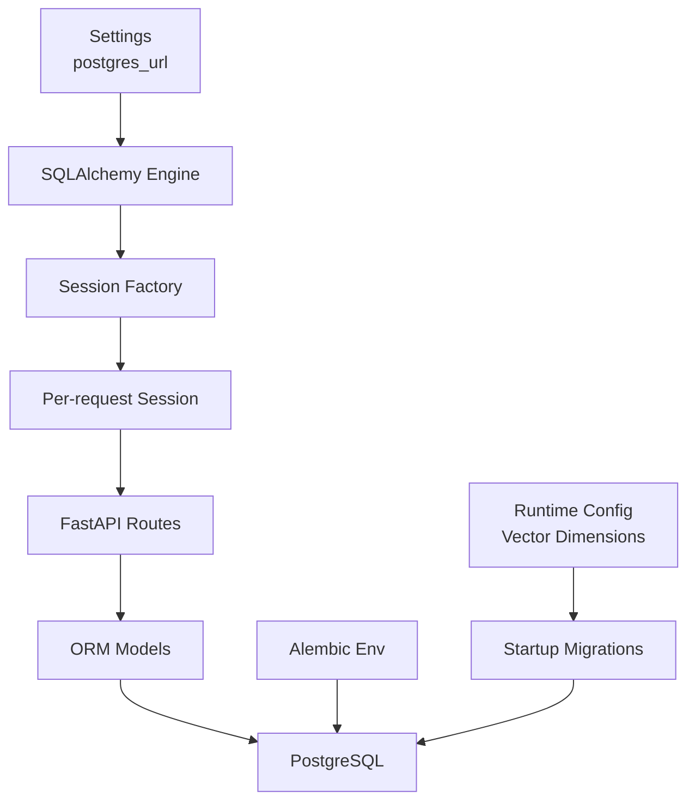
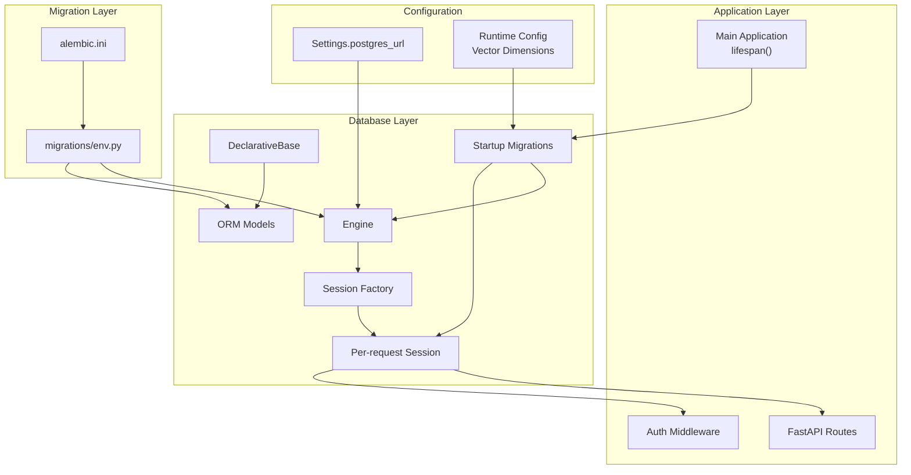
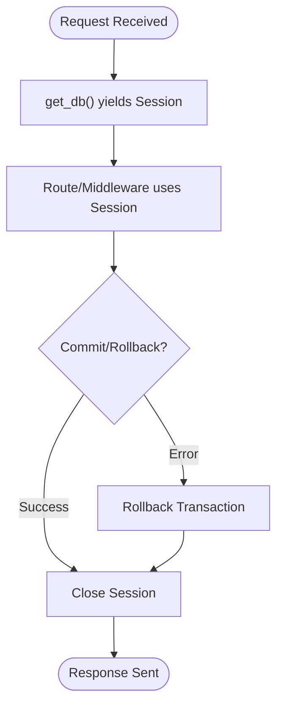
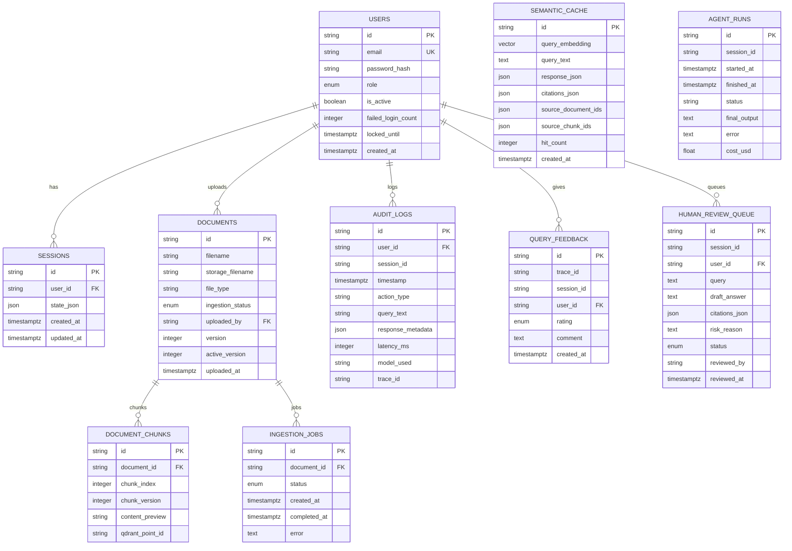
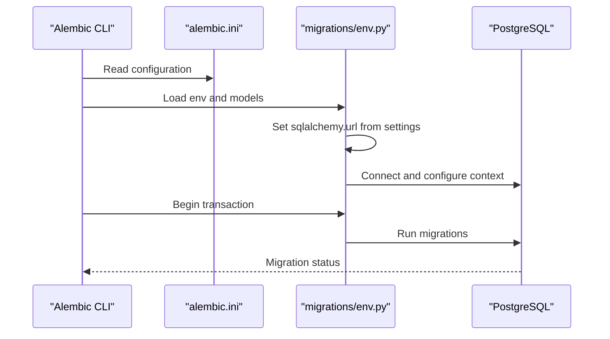
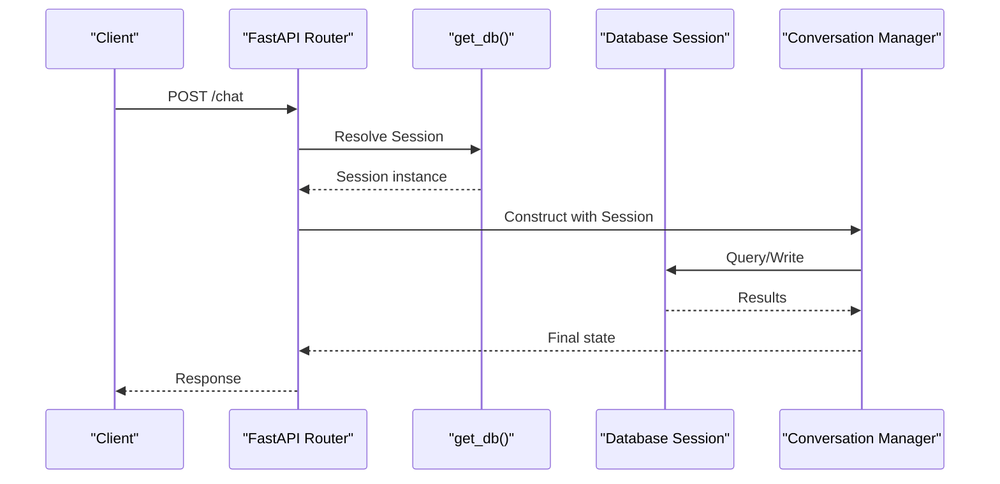
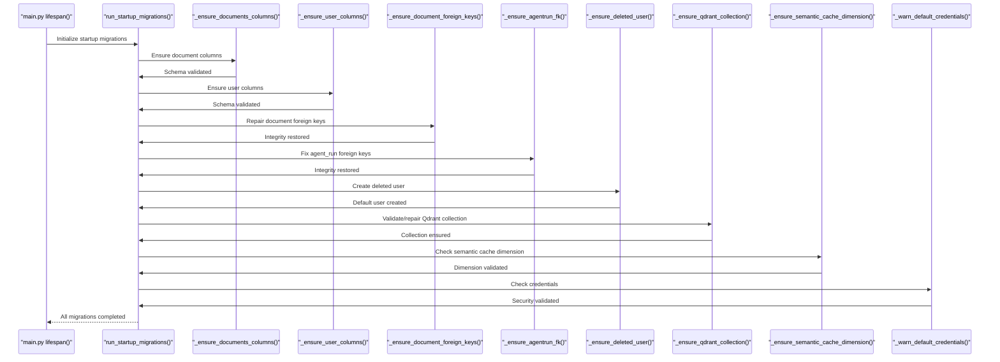
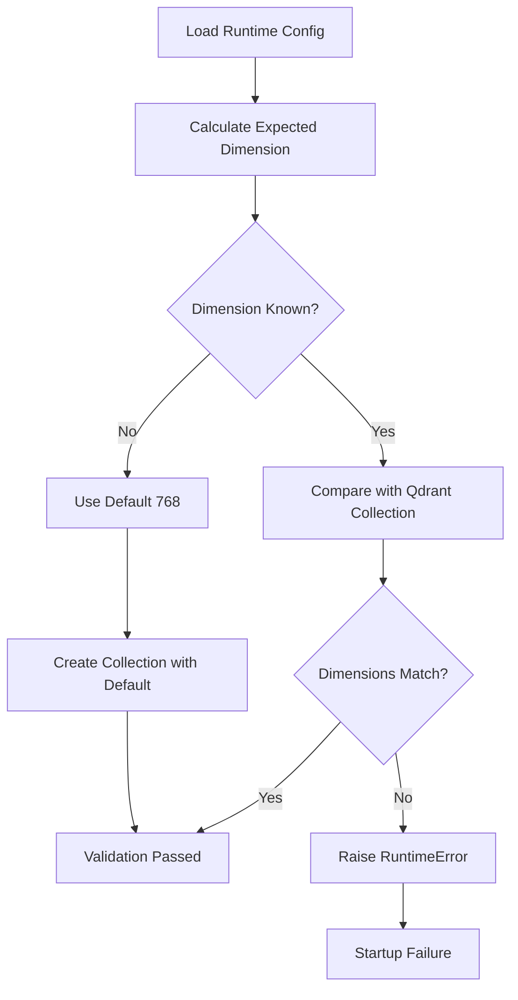
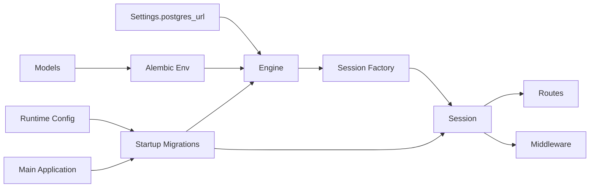

# Database Integration

<cite>
**Referenced Files in This Document**
- [app/db/__init__.py](file://safe4ai-pilot/app/db/__init__.py)
- [app/db/models.py](file://safe4ai-pilot/app/db/models.py)
- [app/config.py](file://safe4ai-pilot/app/config.py)
- [app/db/migrations/env.py](file://safe4ai-pilot/app/db/migrations/env.py)
- [alembic.ini](file://safe4ai-pilot/alembic.ini)
- [app/api/chat_routes.py](file://safe4ai-pilot/app/api/chat_routes.py)
- [app/auth/middleware.py](file://safe4ai-pilot/app/auth/middleware.py)
- [app/startup_migrations.py](file://safe4ai-pilot/app/startup_migrations.py)
- [app/main.py](file://safe4ai-pilot/app/main.py)
- [app/services/runtime_config.py](file://safe4ai-pilot/app/services/runtime_config.py)
- [tests/test_startup_schema.py](file://safe4ai-pilot/tests/test_startup_schema.py)
</cite>

## Update Summary
**Changes Made**
- Added comprehensive documentation for the new startup migrations system
- Updated architecture overview to include boot-time schema validation
- Added vector dimension management documentation
- Enhanced migration system coverage with startup-time validations
- Updated troubleshooting guide with startup migration scenarios

## Table of Contents
1. [Introduction](#introduction)
2. [Project Structure](#project-structure)
3. [Core Components](#core-components)
4. [Architecture Overview](#architecture-overview)
5. [Detailed Component Analysis](#detailed-component-analysis)
6. [Startup Migrations System](#startup-migrations-system)
7. [Vector Dimension Management](#vector-dimension-management)
8. [Dependency Analysis](#dependency-analysis)
9. [Performance Considerations](#performance-considerations)
10. [Troubleshooting Guide](#troubleshooting-guide)
11. [Conclusion](#conclusion)
12. [Appendices](#appendices)

## Introduction
This document explains the database integration built with SQLAlchemy ORM in the project. It covers engine and session configuration, declarative model definitions, the Alembic migration system, and the new startup migrations system for schema validation and vector dimension management. It also documents how database connections are established and used across FastAPI endpoints, how vector extensions are integrated, and how to manage migrations safely. Practical guidance is included for querying, relationship handling, transactions, performance tuning, indexing, and maintenance.

## Project Structure
The database integration is centered around a small set of modules with enhanced startup validation:
- Engine and session factory are defined in the database package initializer.
- Declarative models define the schema and relationships.
- Alembic configuration and environment script orchestrate migrations.
- Startup migrations system validates and repairs schema on application startup.
- Runtime configuration manages vector dimensions for embedding models.
- Application routes and middleware depend on the shared database session provider.
- Global settings supply the database URL and configuration parameters.

**Diagram sources**
- [app/db/__init__.py:1-22](file://safe4ai-pilot/app/db/__init__.py#L1-L22)
- [app/config.py:1-48](file://safe4ai-pilot/app/config.py#L1-L48)
- [app/db/migrations/env.py:1-51](file://safe4ai-pilot/app/db/migrations/env.py#L1-L51)
- [app/startup_migrations.py:1-224](file://safe4ai-pilot/app/startup_migrations.py#L1-L224)
- [app/services/runtime_config.py:22-34](file://safe4ai-pilot/app/services/runtime_config.py#L22-L34)

**Section sources**
- [app/db/__init__.py:1-22](file://safe4ai-pilot/app/db/__init__.py#L1-L22)
- [app/db/models.py:1-182](file://safe4ai-pilot/app/db/models.py#L1-L182)
- [app/config.py:1-48](file://safe4ai-pilot/app/config.py#L1-L48)
- [app/db/migrations/env.py:1-51](file://safe4ai-pilot/app/db/migrations/env.py#L1-L51)
- [app/startup_migrations.py:1-224](file://safe4ai-pilot/app/startup_migrations.py#L1-L224)
- [app/services/runtime_config.py:22-34](file://safe4ai-pilot/app/services/runtime_config.py#L22-L34)

## Core Components
- Engine and Session Factory
  - The engine is created from the configured PostgreSQL URL with pre-ping enabled for robust connection health checks.
  - A sessionmaker binds the engine and configures autocommit and autoflush to manual modes for explicit transaction control.
  - A dependency generator yields a per-request session and ensures it is closed afterward.

- Declarative Base and Models
  - A shared DeclarativeBase subclass is used across all models.
  - Models include core entities such as User, Session, Document, DocumentChunk, SemanticCache, AuditLog, AgentRun, QueryFeedback, IngestionJob, and HumanReviewQueue.
  - Enums encapsulate domain statuses and roles.
  - Vector columns are supported via the pgvector extension for semantic caching.

- Alembic Migration System
  - Alembic is configured to load migrations from the app's migrations directory.
  - The environment script sets the SQLAlchemy URL from settings and wires target metadata from the shared Base.
  - Migration scripts are generated and executed against the configured database.

- Startup Migrations System
  - Validates and repairs schema on every application startup.
  - Handles additive DDL statements and data validations without full Alembic migrations.
  - Manages vector dimension consistency between PostgreSQL and Qdrant collections.
  - Creates default user records and ensures referential integrity.

- Runtime Configuration and Vector Dimensions
  - Maintains known embedding model dimensions for vector consistency.
  - Provides dimension validation for semantic cache and Qdrant collections.
  - Supports dynamic vector size configuration based on embedding models.

- Application Integration
  - Routes and middleware depend on the shared database session provider to perform queries and mutations.
  - Authentication middleware resolves the current user from the database using the session.

**Section sources**
- [app/db/__init__.py:1-22](file://safe4ai-pilot/app/db/__init__.py#L1-L22)
- [app/db/models.py:1-182](file://safe4ai-pilot/app/db/models.py#L1-L182)
- [app/db/migrations/env.py:1-51](file://safe4ai-pilot/app/db/migrations/env.py#L1-L51)
- [alembic.ini:1-150](file://safe4ai-pilot/alembic.ini#L1-L150)
- [app/api/chat_routes.py:115-148](file://safe4ai-pilot/app/api/chat_routes.py#L115-L148)
- [app/auth/middleware.py:51-71](file://safe4ai-pilot/app/auth/middleware.py#L51-L71)
- [app/startup_migrations.py:27-36](file://safe4ai-pilot/app/startup_migrations.py#L27-L36)
- [app/services/runtime_config.py:22-34](file://safe4ai-pilot/app/services/runtime_config.py#L22-L34)

## Architecture Overview
The runtime database architecture ties together configuration, engine/session management, ORM models, migration orchestration, and startup validation systems.

**Diagram sources**
- [app/config.py:1-48](file://safe4ai-pilot/app/config.py#L1-L48)
- [app/db/__init__.py:1-22](file://safe4ai-pilot/app/db/__init__.py#L1-L22)
- [app/db/models.py:1-182](file://safe4ai-pilot/app/db/models.py#L1-L182)
- [app/db/migrations/env.py:1-51](file://safe4ai-pilot/app/db/migrations/env.py#L1-L51)
- [app/startup_migrations.py:27-36](file://safe4ai-pilot/app/startup_migrations.py#L27-L36)
- [app/services/runtime_config.py:22-34](file://safe4ai-pilot/app/services/runtime_config.py#L22-L34)
- [app/main.py:35-54](file://safe4ai-pilot/app/main.py#L35-L54)

## Detailed Component Analysis

### Engine and Session Management
- Engine creation
  - Uses the PostgreSQL URL from settings.
  - Enables pre-ping to validate connections before use.
- Session factory
  - Manual autocommit and autoflush for explicit control.
  - Binds to the engine.
- Dependency generator
  - Yields a session per request and closes it in a finally block.

**Diagram sources**
- [app/db/__init__.py:16-22](file://safe4ai-pilot/app/db/__init__.py#L16-L22)

**Section sources**
- [app/db/__init__.py:1-22](file://safe4ai-pilot/app/db/__init__.py#L1-L22)

### ORM Model Definitions and Relationships
Key entities and their relationships:
- User
  - Primary key: id (string).
  - Unique email with index.
  - Role enum with default.
  - Additional attributes for authentication and lifecycle.
- Session
  - Foreign key to User with cascade delete.
  - JSON state storage.
- Document
  - Foreign key to User (uploaded_by).
  - Versioning fields for active and current versions.
- DocumentChunk
  - Foreign key to Document with cascade delete.
  - Index on document_id.
- SemanticCache
  - Vector column for embeddings (pgvector).
  - JSON fields for query/response and citations.
- AuditLog
  - Optional user_id FK, optional session_id, indexed timestamp.
- AgentRun
  - Indexed session_id.
- QueryFeedback
  - Foreign key to User with cascade delete.
  - Indexed trace_id.
- IngestionJob
  - Foreign key to Document with cascade delete.
  - Status enum.
- HumanReviewQueue
  - Foreign key to User with cascade delete.
  - Status enum.

**Diagram sources**
- [app/db/models.py:52-182](file://safe4ai-pilot/app/db/models.py#L52-L182)

**Section sources**
- [app/db/models.py:1-182](file://safe4ai-pilot/app/db/models.py#L1-L182)

### Migration System with Alembic
- Configuration
  - Alembic script location points to the app's migrations directory.
  - Logging levels are configured for SQLAlchemy and Alembic.
- Environment
  - The env script loads models to enable autogenerate detection.
  - Sets the SQLAlchemy URL from settings.
  - Configures target metadata from the shared Base.
  - Supports offline and online migration modes.

**Diagram sources**
- [alembic.ini:1-150](file://safe4ai-pilot/alembic.ini#L1-L150)
- [app/db/migrations/env.py:1-51](file://safe4ai-pilot/app/db/migrations/env.py#L1-L51)

**Section sources**
- [alembic.ini:1-150](file://safe4ai-pilot/alembic.ini#L1-L150)
- [app/db/migrations/env.py:1-51](file://safe4ai-pilot/app/db/migrations/env.py#L1-L51)

### Application Integration Patterns
- Route-level usage
  - Routes accept a Session dependency and pass it to service layers.
  - Example: chat endpoint uses the session to coordinate conversation state and persistence.
- Middleware usage
  - Authentication middleware retrieves the current user from the database using the session.

**Diagram sources**
- [app/api/chat_routes.py:115-148](file://safe4ai-pilot/app/api/chat_routes.py#L115-L148)
- [app/db/__init__.py:16-22](file://safe4ai-pilot/app/db/__init__.py#L16-L22)

**Section sources**
- [app/api/chat_routes.py:115-148](file://safe4ai-pilot/app/api/chat_routes.py#L115-L148)
- [app/auth/middleware.py:51-71](file://safe4ai-pilot/app/auth/middleware.py#L51-L71)

## Startup Migrations System

### Overview
The startup migrations system provides boot-time schema validation and repair capabilities that complement the traditional Alembic migration system. It runs on every application startup to ensure database consistency and handle rolling schema upgrades without requiring full migration files.

### Key Features
- **Schema Validation**: Ensures database schema integrity and consistency.
- **Rolling Upgrades**: Handles additive DDL statements and data validations.
- **Vector Dimension Management**: Validates and manages vector dimensions across PostgreSQL and Qdrant.
- **Foreign Key Repair**: Fixes referential integrity issues in existing data.
- **Default Data Creation**: Creates essential default records (e.g., deleted user account).
- **Security Checks**: Warns about default credentials and security vulnerabilities.

### Startup Sequence
The startup migrations run in a specific order during application initialization:

**Diagram sources**
- [app/main.py:35-54](file://safe4ai-pilot/app/main.py#L35-L54)
- [app/startup_migrations.py:27-36](file://safe4ai-pilot/app/startup_migrations.py#L27-L36)

### Migration Functions
The system consists of several specialized migration functions:

#### Document Schema Enhancements
- Adds `file_size_bytes`, `version`, and `active_version` columns to the documents table.
- Handles schema evolution without disrupting existing data.

#### User Schema Updates
- Adds `token_valid_after` column for enhanced authentication security.
- Supports token rotation and validation improvements.

#### Foreign Key Integrity
- Repairs document foreign key constraints with proper default values.
- Fixes agent_run foreign key relationships with cascade deletes.
- Ensures referential integrity across related tables.

#### Default User Management
- Creates a system-deleted user account with unique identifiers.
- Prevents orphaned records and maintains referential integrity.
- Uses hashed passwords for security.

#### Qdrant Collection Management
- Validates Qdrant collection existence and dimensions.
- Creates collections with appropriate vector sizes based on embedding models.
- Prevents dimension mismatches between PostgreSQL and Qdrant.

#### Semantic Cache Dimension Validation
- Checks vector dimension consistency for semantic cache queries.
- Warns about potential similarity search failures.
- Provides migration guidance for dimension changes.

#### Security Credential Validation
- Detects and warns about default secret keys and database credentials.
- Enforces security policies in production environments.
- Prevents accidental exposure of default credentials.

**Section sources**
- [app/startup_migrations.py:27-224](file://safe4ai-pilot/app/startup_migrations.py#L27-L224)
- [app/main.py:35-54](file://safe4ai-pilot/app/main.py#L35-L54)

## Vector Dimension Management

### Overview
The vector dimension management system ensures consistency between PostgreSQL vector columns and Qdrant vector collections. It prevents costly dimension mismatches that could lead to failed similarity searches and data corruption.

### Embedding Model Dimensions
The system maintains a registry of known embedding model dimensions:

| Model Name | Dimension Size |
|------------|----------------|
| nomic-embed-text | 768 |
| mxbai-embed-large | 1024 |
| text-embedding-3-small | 1536 |
| text-embedding-3-large | 3072 |
| text-embedding-ada-002 | 1536 |

### Dimension Validation Process
The system performs dimension validation in several stages:

**Diagram sources**
- [app/startup_migrations.py:124-175](file://safe4ai-pilot/app/startup_migrations.py#L124-L175)
- [app/services/runtime_config.py:22-34](file://safe4ai-pilot/app/services/runtime_config.py#L22-L34)

### Qdrant Collection Management
The system manages Qdrant collections with proper vector configurations:

- **First Boot**: Creates collections with dimensions based on the configured embedding model.
- **Existing Collections**: Validates dimensions match the expected model configuration.
- **Dimension Mismatch**: Raises runtime errors to prevent silent failures.
- **Collection Parameters**: Uses cosine distance for similarity searches.

### Semantic Cache Dimension Handling
The semantic cache maintains a fixed 768-dimensional vector column. The system warns about dimension mismatches and provides migration guidance when embedding models change.

**Section sources**
- [app/startup_migrations.py:124-194](file://safe4ai-pilot/app/startup_migrations.py#L124-L194)
- [app/services/runtime_config.py:22-34](file://safe4ai-pilot/app/services/runtime_config.py#L22-L34)
- [tests/test_startup_schema.py:32-115](file://safe4ai-pilot/tests/test_startup_schema.py#L32-L115)

## Dependency Analysis
- Configuration-to-engine
  - Settings provide the database URL used to create the engine.
- Engine-to-session
  - Engine is bound to the session factory.
- Session-to-application
  - Routes and middleware depend on the session provider for database operations.
- Migrations-to-models
  - Alembic env imports models to detect schema changes for autogenerate.
- Startup migrations-to-runtime
  - Startup migrations depend on runtime configuration for vector dimensions.
- Main application-to-startup
  - Main application orchestrates startup migrations during initialization.

**Diagram sources**
- [app/config.py:1-48](file://safe4ai-pilot/app/config.py#L1-L48)
- [app/db/__init__.py:1-22](file://safe4ai-pilot/app/db/__init__.py#L1-L22)
- [app/db/migrations/env.py:1-51](file://safe4ai-pilot/app/db/migrations/env.py#L1-L51)
- [app/db/models.py:1-182](file://safe4ai-pilot/app/db/models.py#L1-L182)
- [app/startup_migrations.py:16-17](file://safe4ai-pilot/app/startup_migrations.py#L16-L17)
- [app/main.py:27](file://safe4ai-pilot/app/main.py#L27)

**Section sources**
- [app/config.py:1-48](file://safe4ai-pilot/app/config.py#L1-L48)
- [app/db/__init__.py:1-22](file://safe4ai-pilot/app/db/__init__.py#L1-L22)
- [app/db/migrations/env.py:1-51](file://safe4ai-pilot/app/db/migrations/env.py#L1-L51)
- [app/db/models.py:1-182](file://safe4ai-pilot/app/db/models.py#L1-L182)
- [app/startup_migrations.py:16-17](file://safe4ai-pilot/app/startup_migrations.py#L16-L17)
- [app/main.py:27](file://safe4ai-pilot/app/main.py#L27)

## Performance Considerations
- Connection pooling and health checks
  - Pre-ping is enabled on the engine to detect stale connections and avoid failures under load.
- Indexing strategy
  - Frequently filtered or joined columns are indexed (e.g., user_id, document_id, session_id, trace_id, timestamp).
- Query patterns
  - Prefer filtering by indexed columns and limit projections to required fields.
  - Use bulk operations for batch updates where appropriate.
- Vector operations
  - Leverage vector indexes via pgvector for similarity searches in semantic cache.
  - Ensure Qdrant collections use appropriate vector dimensions for optimal performance.
- Transactions
  - Keep transactions short; commit or rollback promptly after the operation.
- Caching
  - Use semantic cache judiciously to reduce repeated expensive computations.
- Startup performance
  - Startup migrations are designed to be idempotent and fast.
  - Schema validation occurs only during application startup, not on every request.

## Troubleshooting Guide
- Connection issues
  - Verify the PostgreSQL URL in settings and network connectivity.
  - Confirm pre-ping behavior and that the database is reachable.
- Migration errors
  - Ensure models are imported in the Alembic env so autogenerate can detect changes.
  - Run migrations in online mode to connect to the configured database.
- Session lifecycle
  - Ensure sessions are closed after use; the dependency generator handles this automatically.
- Authentication failures
  - Confirm JWT decoding uses the correct secret key and that the user exists and is active.
- Startup migration failures
  - Check logs for specific migration failure messages.
  - Verify database permissions for schema modifications.
  - Ensure Qdrant service is accessible for collection validation.
- Vector dimension errors
  - Review embedding model configuration in runtime settings.
  - Check Qdrant collection dimensions match expected values.
  - Consider dropping and recreating Qdrant collections when changing embedding models.
- Security credential warnings
  - Rotate default secret keys immediately.
  - Change default PostgreSQL credentials in production environments.
  - Enable HTTPS enforcement for production deployments.

**Section sources**
- [app/config.py:1-48](file://safe4ai-pilot/app/config.py#L1-L48)
- [app/db/migrations/env.py:1-51](file://safe4ai-pilot/app/db/migrations/env.py#L1-L51)
- [app/db/__init__.py:16-22](file://safe4ai-pilot/app/db/__init__.py#L16-L22)
- [app/auth/middleware.py:51-71](file://safe4ai-pilot/app/auth/middleware.py#L51-L71)
- [app/startup_migrations.py:197-224](file://safe4ai-pilot/app/startup_migrations.py#L197-L224)

## Conclusion
The database integration leverages a clean separation of concerns with enhanced startup validation: a shared engine and session factory, a unified declarative base, a straightforward migration system, and a comprehensive startup migrations system. The new startup migrations system provides critical schema validation and repair capabilities, while vector dimension management ensures consistency between PostgreSQL and Qdrant. Routes and middleware integrate seamlessly with the session provider, while vector capabilities are enabled via pgvector. Following the recommended patterns for migrations, transactions, indexing, and startup validation will help maintain a reliable, secure, and performant system.

## Appendices

### Practical Examples and Patterns
- Establishing a database session
  - Use the dependency provider to obtain a session in route handlers or middleware.
  - Reference: [app/db/__init__.py:16-22](file://safe4ai-pilot/app/db/__init__.py#L16-L22)
- Performing a read operation
  - Retrieve a user by ID using the session and handle absence gracefully.
  - Reference: [app/auth/middleware.py:67-71](file://safe4ai-pilot/app/auth/middleware.py#L67-L71)
- Performing a write operation
  - Persist a new document or update an existing record within a transaction.
  - Reference: [app/api/chat_routes.py:130](file://safe4ai-pilot/app/api/chat_routes.py#L130)
- Relationship handling
  - Access related records via foreign keys; ensure indexes exist for efficient joins.
  - Reference: [app/db/models.py:65-91](file://safe4ai-pilot/app/db/models.py#L65-L91)
- Transaction management
  - Keep operations within a single session; commit or rollback explicitly as needed.
  - Reference: [app/db/__init__.py:16-22](file://safe4ai-pilot/app/db/__init__.py#L16-L22)
- Migration lifecycle
  - Create, review, and run migrations using Alembic; confirm target metadata alignment.
  - Reference: [app/db/migrations/env.py:18](file://safe4ai-pilot/app/db/migrations/env.py#L18), [alembic.ini:8](file://safe4ai-pilot/alembic.ini#L8)
- Startup migration execution
  - Startup migrations run automatically during application initialization.
  - Reference: [app/main.py:42](file://safe4ai-pilot/app/main.py#L42), [app/startup_migrations.py:27](file://safe4ai-pilot/app/startup_migrations.py#L27)
- Vector dimension validation
  - Ensure embedding model dimensions match Qdrant collection configuration.
  - Reference: [app/startup_migrations.py:124](file://safe4ai-pilot/app/startup_migrations.py#L124), [app/services/runtime_config.py:32](file://safe4ai-pilot/app/services/runtime_config.py#L32)