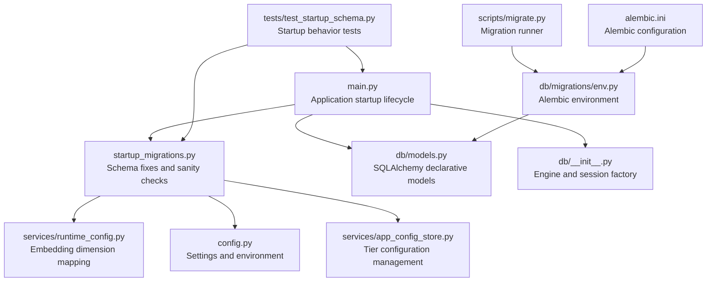
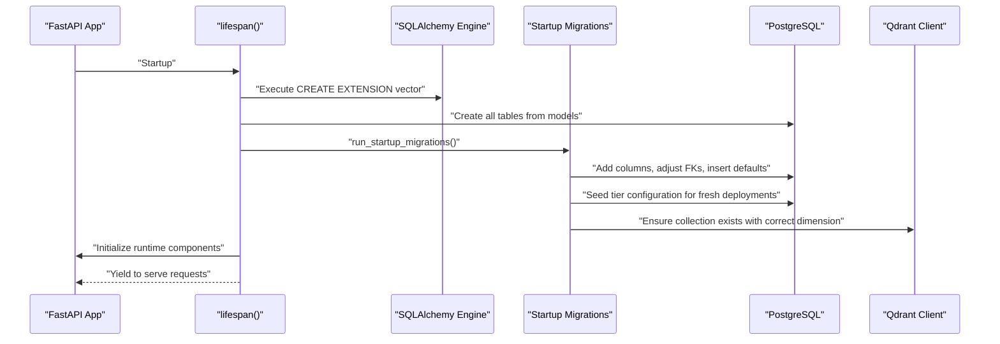
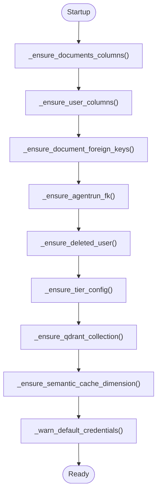
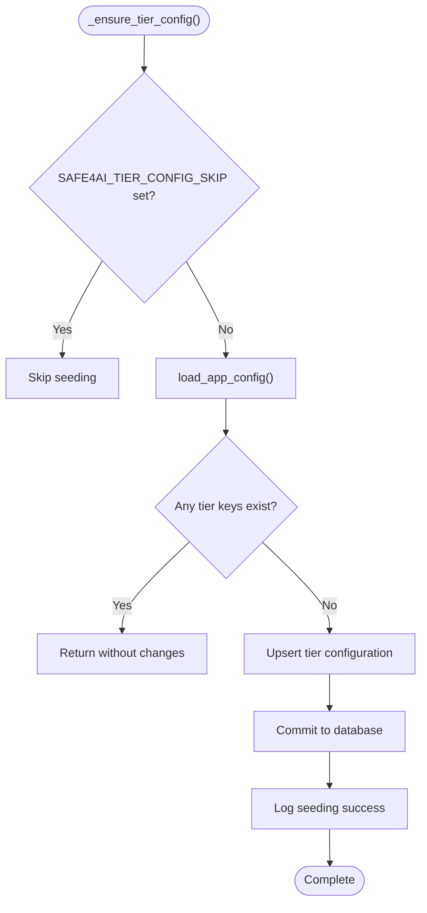
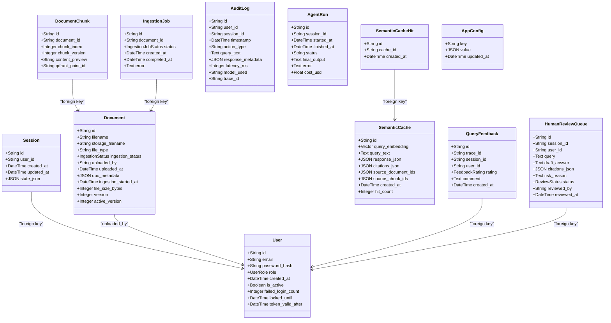
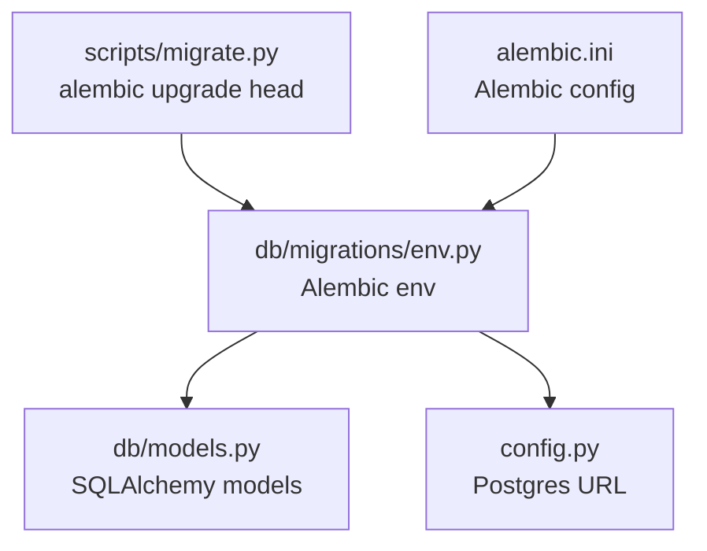
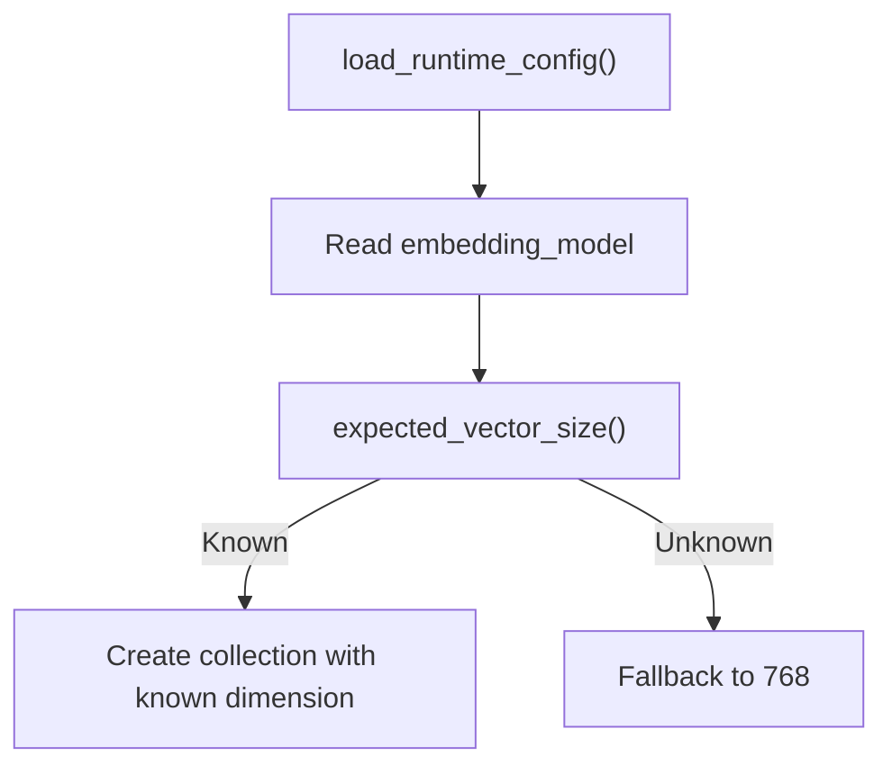
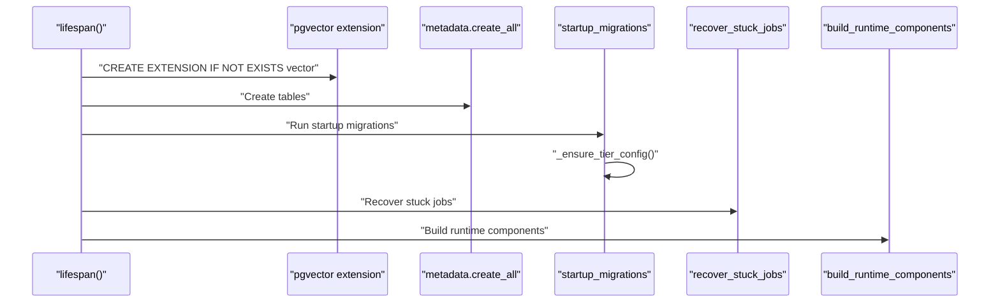
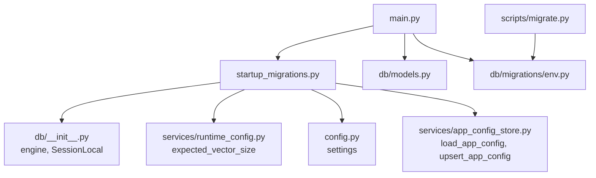

# Startup Schema Management

<cite>
**Referenced Files in This Document**
- [startup_migrations.py](file://safe4ai-pilot/app/startup_migrations.py)
- [main.py](file://safe4ai-pilot/app/main.py)
- [models.py](file://safe4ai-pilot/app/db/models.py)
- [env.py](file://safe4ai-pilot/app/db/migrations/env.py)
- [config.py](file://safe4ai-pilot/app/config.py)
- [__init__.py](file://safe4ai-pilot/app/db/__init__.py)
- [runtime_config.py](file://safe4ai-pilot/app/services/runtime_config.py)
- [app_config_store.py](file://safe4ai-pilot/app/services/app_config_store.py)
- [migrate.py](file://safe4ai-pilot/scripts/migrate.py)
- [alembic.ini](file://safe4ai-pilot/alembic.ini)
- [test_startup_schema.py](file://safe4ai-pilot/tests/test_startup_schema.py)
</cite>

## Update Summary
**Changes Made**
- Added documentation for the new `_ensure_tier_config()` function that provides automatic tier configuration seeding
- Updated the startup migration flow to include tier configuration management
- Enhanced troubleshooting guidance with tier configuration scenarios
- Added new section covering tier configuration safety rules and environment variable controls

## Table of Contents
1. [Introduction](#introduction)
2. [Project Structure](#project-structure)
3. [Core Components](#core-components)
4. [Architecture Overview](#architecture-overview)
5. [Detailed Component Analysis](#detailed-component-analysis)
6. [Dependency Analysis](#dependency-analysis)
7. [Performance Considerations](#performance-considerations)
8. [Troubleshooting Guide](#troubleshooting-guide)
9. [Conclusion](#conclusion)

## Introduction
This document explains the Startup Schema Management system in the Safe4AI Private AI pilot application. It covers how the application ensures database schema integrity and readiness at startup, including PostgreSQL schema creation, vector extension activation, Qdrant collection provisioning, foreign key adjustments, security checks, and enhanced startup configuration management with automatic tier configuration seeding for fresh deployments. The system now includes intelligent tier configuration management that automatically sets evaluation tier defaults while avoiding conflicts with existing configurations.

## Project Structure
The schema management spans several modules:
- Application startup orchestration
- Database models and SQLAlchemy base
- Alembic migration environment
- Runtime configuration for embedding dimensions
- Application configuration store with tier management
- Tests validating startup behavior

**Diagram sources**
- [main.py:35-55](file://safe4ai-pilot/app/main.py#L35-L55)
- [startup_migrations.py:27-37](file://safe4ai-pilot/app/startup_migrations.py#L27-L37)
- [models.py:1-210](file://safe4ai-pilot/app/db/models.py#L1-L210)
- [__init__.py:1-22](file://safe4ai-pilot/app/db/__init__.py#L1-L22)
- [runtime_config.py:22-35](file://safe4ai-pilot/app/services/runtime_config.py#L22-L35)
- [app_config_store.py:15-32](file://safe4ai-pilot/app/services/app_config_store.py#L15-L32)
- [config.py:7-51](file://safe4ai-pilot/app/config.py#L7-L51)
- [env.py:1-51](file://safe4ai-pilot/app/db/migrations/env.py#L1-L51)
- [migrate.py:7-12](file://safe4ai-pilot/scripts/migrate.py#L7-L12)
- [alembic.ini:1-150](file://safe4ai-pilot/alembic.ini#L1-L150)
- [test_startup_schema.py:10-26](file://safe4ai-pilot/tests/test_startup_schema.py#L10-L26)

**Section sources**
- [main.py:35-55](file://safe4ai-pilot/app/main.py#L35-L55)
- [startup_migrations.py:27-37](file://safe4ai-pilot/app/startup_migrations.py#L27-L37)
- [models.py:1-210](file://safe4ai-pilot/app/db/models.py#L1-L210)
- [__init__.py:1-22](file://safe4ai-pilot/app/db/__init__.py#L1-L22)
- [runtime_config.py:22-35](file://safe4ai-pilot/app/services/runtime_config.py#L22-L35)
- [app_config_store.py:15-32](file://safe4ai-pilot/app/services/app_config_store.py#L15-L32)
- [config.py:7-51](file://safe4ai-pilot/app/config.py#L7-L51)
- [env.py:1-51](file://safe4ai-pilot/app/db/migrations/env.py#L1-L51)
- [migrate.py:7-12](file://safe4ai-pilot/scripts/migrate.py#L7-L12)
- [alembic.ini:1-150](file://safe4ai-pilot/alembic.ini#L1-L150)
- [test_startup_schema.py:10-26](file://safe4ai-pilot/tests/test_startup_schema.py#L10-L26)

## Core Components
- Startup migrations orchestrator: Executes additive DDL and data validations on every boot to handle rolling upgrades without full Alembic migrations, including automatic tier configuration seeding.
- Database models: Define tables, columns, enums, and relationships used by SQLAlchemy.
- Alembic environment: Configures migration targets and database connectivity.
- Runtime configuration: Provides embedding model dimension mapping for vector collections.
- Application configuration store: Manages tier configuration keys (tier, max_seats, monthly_query_limit, tier_expires_at) with encryption and type coercion.
- Application lifecycle: Ensures PostgreSQL vector extension, creates schema, runs startup migrations, initializes runtime components, and manages tier configuration.

**Section sources**
- [startup_migrations.py:27-37](file://safe4ai-pilot/app/startup_migrations.py#L27-L37)
- [models.py:52-210](file://safe4ai-pilot/app/db/models.py#L52-L210)
- [env.py:16-18](file://safe4ai-pilot/app/db/migrations/env.py#L16-L18)
- [runtime_config.py:22-35](file://safe4ai-pilot/app/services/runtime_config.py#L22-L35)
- [app_config_store.py:15-32](file://safe4ai-pilot/app/services/app_config_store.py#L15-L32)
- [main.py:35-55](file://safe4ai-pilot/app/main.py#L35-L55)

## Architecture Overview
The startup process follows a strict order to guarantee schema readiness, operational safety, and proper tier configuration:
1. Activate PostgreSQL vector extension
2. Create all tables defined by SQLAlchemy models
3. Run startup migrations for additive schema fixes and data integrity
4. Initialize runtime components (retriever, reranker, graph)
5. Schedule cleanup tasks and warm providers

**Diagram sources**
- [main.py:35-55](file://safe4ai-pilot/app/main.py#L35-L55)
- [startup_migrations.py:27-37](file://safe4ai-pilot/app/startup_migrations.py#L27-L37)
- [startup_migrations.py:124-175](file://safe4ai-pilot/app/startup_migrations.py#L124-L175)

## Detailed Component Analysis

### Enhanced Startup Migrations Orchestrator
Responsibilities:
- Add missing columns to existing tables
- Adjust foreign keys and defaults for referential integrity
- Ensure a sentinel deleted user record exists
- Provision Qdrant collection with correct vector dimension
- **Seed tier configuration for fresh deployments while avoiding conflicts**
- Warn or fail on default credentials depending on HTTPS enforcement
- Validate semantic cache dimension compatibility

Key behaviors:
- Runs additive DDL statements safely even if columns exist
- Uses transactional connections to ensure atomicity per statement group
- Logs warnings instead of failing for non-critical issues
- Enforces strict failure when vector dimension mismatches existing collection
- **Intelligently seeds evaluation tier defaults only for completely fresh deployments**

**Diagram sources**
- [startup_migrations.py:27-37](file://safe4ai-pilot/app/startup_migrations.py#L27-L37)
- [startup_migrations.py:39-62](file://safe4ai-pilot/app/startup_migrations.py#L39-L62)
- [startup_migrations.py:65-80](file://safe4ai-pilot/app/startup_migrations.py#L65-L80)
- [startup_migrations.py:107-122](file://safe4ai-pilot/app/startup_migrations.py#L107-L122)
- [startup_migrations.py:82-105](file://safe4ai-pilot/app/startup_migrations.py#L82-L105)
- [startup_migrations.py:127-165](file://safe4ai-pilot/app/startup_migrations.py#L127-L165)
- [startup_migrations.py:168-219](file://safe4ai-pilot/app/startup_migrations.py#L168-L219)
- [startup_migrations.py:221-238](file://safe4ai-pilot/app/startup_migrations.py#L221-L238)
- [startup_migrations.py:241-268](file://safe4ai-pilot/app/startup_migrations.py#L241-L268)

**Section sources**
- [startup_migrations.py:27-37](file://safe4ai-pilot/app/startup_migrations.py#L27-L37)
- [startup_migrations.py:39-62](file://safe4ai-pilot/app/startup_migrations.py#L39-L62)
- [startup_migrations.py:65-80](file://safe4ai-pilot/app/startup_migrations.py#L65-L80)
- [startup_migrations.py:82-105](file://safe4ai-pilot/app/startup_migrations.py#L82-L105)
- [startup_migrations.py:107-122](file://safe4ai-pilot/app/startup_migrations.py#L107-L122)
- [startup_migrations.py:127-165](file://safe4ai-pilot/app/startup_migrations.py#L127-L165)
- [startup_migrations.py:168-219](file://safe4ai-pilot/app/startup_migrations.py#L168-L219)
- [startup_migrations.py:221-238](file://safe4ai-pilot/app/startup_migrations.py#L221-L238)
- [startup_migrations.py:241-268](file://safe4ai-pilot/app/startup_migrations.py#L241-L268)

### Tier Configuration Management System
The `_ensure_tier_config()` function provides intelligent tier configuration seeding for fresh deployments:

**Safety Rules:**
- **Never overwrites existing tier configuration** - Checks for any existing tier keys before seeding
- **Environment variable control** - Supports `SAFE4AI_TIER_CONFIG_SKIP=1` to disable seeding for development
- **Comprehensive key coverage** - Seeds all four tier-related keys: tier, max_seats, monthly_query_limit, tier_expires_at

**Seeded Values (Evaluation tier):**
- `tier=evaluation` - Sets evaluation tier as default
- `max_seats=5` - Maximum 5 seats for evaluation
- `monthly_query_limit=5000` - 5,000 queries per month
- `tier_expires_at` - Not seeded (no expiry by default)

**Implementation Details:**
- Uses `load_app_config()` to detect existing configuration
- Prevents conflicts with deployments that already have more than 5 users
- Commits configuration changes atomically
- Logs detailed information about seeding actions

**Diagram sources**
- [startup_migrations.py:127-165](file://safe4ai-pilot/app/startup_migrations.py#L127-L165)
- [app_config_store.py:82-102](file://safe4ai-pilot/app/services/app_config_store.py#L82-L102)
- [app_config_store.py:105-124](file://safe4ai-pilot/app/services/app_config_store.py#L105-L124)

**Section sources**
- [startup_migrations.py:127-165](file://safe4ai-pilot/app/startup_migrations.py#L127-L165)
- [app_config_store.py:15-32](file://safe4ai-pilot/app/services/app_config_store.py#L15-L32)
- [app_config_store.py:82-102](file://safe4ai-pilot/app/services/app_config_store.py#L82-L102)
- [app_config_store.py:105-124](file://safe4ai-pilot/app/services/app_config_store.py#L105-L124)

### Database Models and Relationships
The SQLAlchemy models define the canonical schema. Notable elements:
- Users table with roles and token validity timestamp
- Sessions linked to users with cascade delete
- Documents with metadata, versioning, and uploaded-by foreign key defaulting to a sentinel user
- Document chunks linked to documents with cascade delete
- Semantic cache with fixed 768-dimension vector column
- Agent runs linked to sessions with cascade delete
- Audit logs, ingestion jobs, human review queue, and application config
- **Tier configuration keys (tier, max_seats, monthly_query_limit, tier_expires_at)** stored in AppConfig table

**Diagram sources**
- [models.py:52-210](file://safe4ai-pilot/app/db/models.py#L52-L210)

**Section sources**
- [models.py:52-210](file://safe4ai-pilot/app/db/models.py#L52-L210)

### Alembic Migration Environment and Scripts
- Alembic environment imports models to enable autogenerate detection and sets the database URL from settings.
- The migration runner script invokes Alembic to upgrade to the latest revision.
- Alembic configuration file defines script locations, logging, and path separators.

**Diagram sources**
- [env.py:6-18](file://safe4ai-pilot/app/db/migrations/env.py#L6-L18)
- [env.py:20](file://safe4ai-pilot/app/db/migrations/env.py#L20)
- [migrate.py:7-12](file://safe4ai-pilot/scripts/migrate.py#L7-L12)
- [alembic.ini:8](file://safe4ai-pilot/alembic.ini#L8)

**Section sources**
- [env.py:6-18](file://safe4ai-pilot/app/db/migrations/env.py#L6-L18)
- [env.py:20](file://safe4ai-pilot/app/db/migrations/env.py#L20)
- [migrate.py:7-12](file://safe4ai-pilot/scripts/migrate.py#L7-L12)
- [alembic.ini:8](file://safe4ai-pilot/alembic.ini#L8)

### Runtime Configuration and Vector Dimensions
The runtime configuration module maintains a mapping of known embedding model dimensions. This is used during startup to ensure Qdrant collections are created with the correct vector size, preventing silent failures due to dimension mismatches.

**Diagram sources**
- [runtime_config.py:96-152](file://safe4ai-pilot/app/services/runtime_config.py#L96-L152)
- [runtime_config.py:32-34](file://safe4ai-pilot/app/services/runtime_config.py#L32-L34)
- [startup_migrations.py:177-219](file://safe4ai-pilot/app/startup_migrations.py#L177-L219)

**Section sources**
- [runtime_config.py:22-35](file://safe4ai-pilot/app/services/runtime_config.py#L22-L35)
- [runtime_config.py:96-152](file://safe4ai-pilot/app/services/runtime_config.py#L96-L152)
- [startup_migrations.py:177-219](file://safe4ai-pilot/app/startup_migrations.py#L177-L219)

### Application Lifecycle and Startup Order
The FastAPI lifespan manager enforces a deterministic startup sequence:
1. Create the vector extension in PostgreSQL
2. Create all tables defined by SQLAlchemy models
3. Run startup migrations for additive fixes (including tier configuration seeding)
4. Recover stuck ingestion jobs
5. Build runtime components (retriever, reranker, graph)
6. Warm provider and schedule cleanup

Tests verify the ordering of critical steps to prevent schema or runtime initialization issues.

**Diagram sources**
- [main.py:35-55](file://safe4ai-pilot/app/main.py#L35-L55)
- [test_startup_schema.py:10-26](file://safe4ai-pilot/tests/test_startup_schema.py#L10-L26)

**Section sources**
- [main.py:35-55](file://safe4ai-pilot/app/main.py#L35-L55)
- [test_startup_schema.py:10-26](file://safe4ai-pilot/tests/test_startup_schema.py#L10-L26)

## Dependency Analysis
- Startup migrations depend on:
  - SQLAlchemy engine and session factory for DDL execution
  - Qdrant client for collection provisioning
  - Runtime configuration for embedding dimension resolution
  - Application settings for service URLs and enforcement flags
  - **Application configuration store for tier configuration management**
- Application startup depends on:
  - Database models for schema creation
  - Alembic environment for migration management
  - Runtime configuration for vector dimension mapping
  - **App configuration store for tier configuration persistence**

**Diagram sources**
- [startup_migrations.py:16-19](file://safe4ai-pilot/app/startup_migrations.py#L16-L19)
- [__init__.py:8-9](file://safe4ai-pilot/app/db/__init__.py#L8-L9)
- [runtime_config.py:32-34](file://safe4ai-pilot/app/services/runtime_config.py#L32-L34)
- [config.py:7-51](file://safe4ai-pilot/app/config.py#L7-L51)
- [app_config_store.py:82-124](file://safe4ai-pilot/app/services/app_config_store.py#L82-L124)
- [main.py:25-27](file://safe4ai-pilot/app/main.py#L25-L27)
- [models.py:18](file://safe4ai-pilot/app/db/models.py#L18)
- [env.py:6-18](file://safe4ai-pilot/app/db/migrations/env.py#L6-L18)
- [migrate.py:7-12](file://safe4ai-pilot/scripts/migrate.py#L7-L12)

**Section sources**
- [startup_migrations.py:16-19](file://safe4ai-pilot/app/startup_migrations.py#L16-L19)
- [__init__.py:8-9](file://safe4ai-pilot/app/db/__init__.py#L8-L9)
- [runtime_config.py:32-34](file://safe4ai-pilot/app/services/runtime_config.py#L32-L34)
- [config.py:7-51](file://safe4ai-pilot/app/config.py#L7-L51)
- [app_config_store.py:82-124](file://safe4ai-pilot/app/services/app_config_store.py#L82-L124)
- [main.py:25-27](file://safe4ai-pilot/app/main.py#L25-L27)
- [models.py:18](file://safe4ai-pilot/app/db/models.py#L18)
- [env.py:6-18](file://safe4ai-pilot/app/db/migrations/env.py#L6-L18)
- [migrate.py:7-12](file://safe4ai-pilot/scripts/migrate.py#L7-L12)

## Performance Considerations
- Startup migrations execute additive DDL statements; batching within transactions minimizes overhead.
- Qdrant collection creation is conditional and dimension-aware, avoiding unnecessary re-creations.
- Runtime configuration caches known dimensions to avoid repeated lookups during startup.
- **Tier configuration seeding is performed only once per fresh deployment and uses efficient database queries.**
- Health checks for PostgreSQL and Qdrant are lightweight and avoid exposing sensitive details.

## Troubleshooting Guide
Common issues and resolutions:
- Vector extension missing: The startup sequence ensures the vector extension is created before schema creation.
- Dimension mismatch for Qdrant collection: Startup migrations validate existing collections and raise a clear error if sizes differ from the expected embedding model dimension.
- Default credentials in use: Startup warns on default secrets; with HTTPS enforcement enabled, startup fails to prevent insecure operation.
- Foreign key inconsistencies: Startup migrations normalize foreign keys and defaults to maintain referential integrity.
- Semantic cache dimension mismatch: Startup migrations log a warning when the configured embedding model differs from the cache column dimension.
- **Tier configuration conflicts: If any tier key already exists in app_config, seeding is skipped to avoid overwriting existing configurations.**
- **Development environment seeding: Set `SAFE4AI_TIER_CONFIG_SKIP=1` to disable automatic seeding for development deployments.**
- **Fresh deployment detection: Tier configuration is only seeded when no existing tier keys are found in the configuration store.**

**Section sources**
- [startup_migrations.py:127-165](file://safe4ai-pilot/app/startup_migrations.py#L127-L165)
- [startup_migrations.py:168-219](file://safe4ai-pilot/app/startup_migrations.py#L168-L219)
- [startup_migrations.py:241-268](file://safe4ai-pilot/app/startup_migrations.py#L241-L268)
- [startup_migrations.py:65-80](file://safe4ai-pilot/app/startup_migrations.py#L65-L80)
- [startup_migrations.py:107-122](file://safe4ai-pilot/app/startup_migrations.py#L107-L122)

## Conclusion
The Startup Schema Management system combines SQLAlchemy model creation, PostgreSQL vector extension activation, targeted runtime migrations, and intelligent tier configuration management to ensure schema readiness and integrity at every startup. The enhanced system now includes automatic tier configuration seeding for fresh deployments while maintaining strict safety rules to avoid conflicts with existing configurations. By separating additive fixes from formal Alembic migrations and enforcing strict dimension checks for vector stores, the system remains robust across evolving configurations and deployment modes. The addition of environment variable controls allows for flexible deployment strategies, supporting both automated production deployments and manual development setups. Tests validate the startup order and critical behaviors, supporting reliable operations in development and production environments.