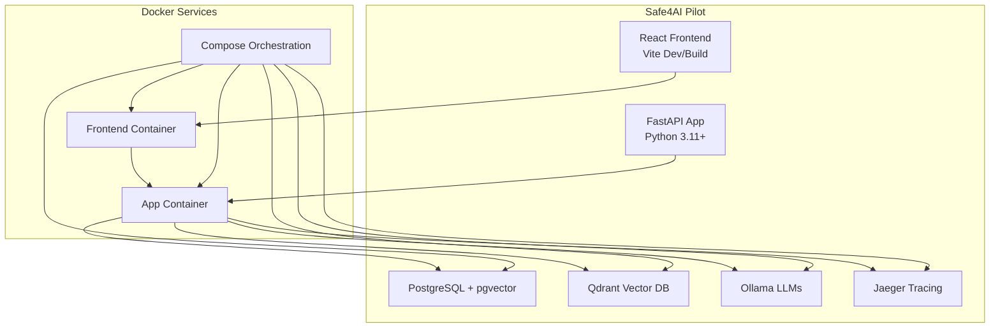
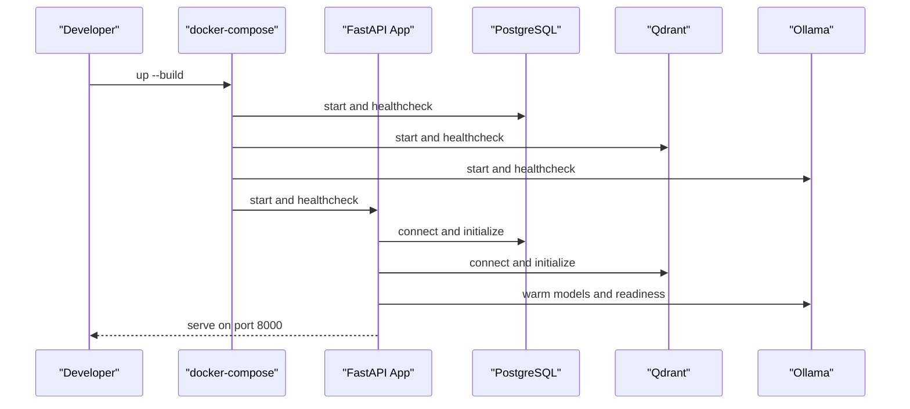
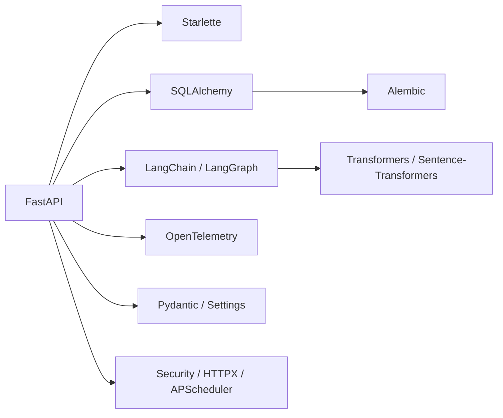

# Development Workflow

<cite>
**Referenced Files in This Document**
- [README.md](file://safe4ai-pilot/README.md)
- [pyproject.toml](file://safe4ai-pilot/pyproject.toml)
- [.pre-commit-config.yaml](file://safe4ai-pilot/.pre-commit-config.yaml)
- [docker-compose.yml](file://safe4ai-pilot/docker-compose.yml)
- [ci.yml](file://.github/workflows/ci.yml)
- [conftest.py](file://safe4ai-pilot/tests/conftest.py)
- [Dockerfile (app)](file://safe4ai-pilot/app/Dockerfile)
- [Dockerfile (frontend)](file://safe4ai-pilot/frontend/Dockerfile)
- [deployment.md](file://safe4ai-pilot/docs/deployment.md)
- [seed.py](file://safe4ai-pilot/scripts/seed.py)
- [healthcheck.py](file://safe4ai-pilot/scripts/healthcheck.py)
- [uv.lock](file://safe4ai-pilot/uv.lock)
</cite>

## Table of Contents
1. [Introduction](#introduction)
2. [Project Structure](#project-structure)
3. [Core Components](#core-components)
4. [Architecture Overview](#architecture-overview)
5. [Detailed Component Analysis](#detailed-component-analysis)
6. [Dependency Analysis](#dependency-analysis)
7. [Performance Considerations](#performance-considerations)
8. [Troubleshooting Guide](#troubleshooting-guide)
9. [Conclusion](#conclusion)
10. [Appendices](#appendices)

## Introduction
This document describes the complete development workflow for the Safe4AI Pilot project, covering environment setup, dependency management, code quality and security tooling, testing, and Docker-based local and production deployment. It consolidates best practices for local development, debugging, CI/CD, and operational checks to ensure a smooth contributor experience and reliable releases.

## Project Structure
The repository is organized around a FastAPI backend, a React admin/chat frontend, and supporting services orchestrated via Docker Compose. The backend is packaged as a Python application with Poetry-managed dependencies and pinned lockfile for reproducibility. The frontend is built and served via Nginx in a separate container.

**Diagram sources**
- [docker-compose.yml:1-119](file://safe4ai-pilot/docker-compose.yml#L1-L119)
- [Dockerfile (app):1-23](file://safe4ai-pilot/app/Dockerfile#L1-L23)
- [Dockerfile (frontend):1-14](file://safe4ai-pilot/frontend/Dockerfile#L1-L14)

**Section sources**
- [README.md:1-133](file://safe4ai-pilot/README.md#L1-L133)
- [docker-compose.yml:1-119](file://safe4ai-pilot/docker-compose.yml#L1-L119)

## Core Components
- Backend: FastAPI application with SQLAlchemy ORM, Alembic migrations, LangGraph/LangChain integrations, and OpenTelemetry tracing.
- Frontend: React SPA built with Vite and served via Nginx in Docker.
- Data and AI stack: PostgreSQL with pgvector, Qdrant vector database, and Ollama for local LLM inference.
- Observability: Jaeger for distributed tracing.
- Testing: PyTest with fixtures for mocking Ollama and integration containers for Postgres/Qdrant.

Key configuration highlights:
- Python version constrained to 3.11–3.13.
- Optional dev dependencies for linting, type checking, testing, and security scanning.
- Ruff configured for linting and formatting.
- MyPy strict mode enabled.
- Coverage exclusion for tests, scripts, and evaluation directories.

**Section sources**
- [pyproject.toml:5-101](file://safe4ai-pilot/pyproject.toml#L5-L101)
- [README.md:1-133](file://safe4ai-pilot/README.md#L1-L133)

## Architecture Overview
The system runs as a multi-container Docker Compose stack. The backend exposes a FastAPI server, the frontend proxies API routes to the backend, and persistent volumes store Postgres, Qdrant, and Ollama data. Health checks ensure dependent services are ready before the app starts.

**Diagram sources**
- [docker-compose.yml:1-119](file://safe4ai-pilot/docker-compose.yml#L1-L119)
- [deployment.md:29-94](file://safe4ai-pilot/docs/deployment.md#L29-L94)

**Section sources**
- [docker-compose.yml:1-119](file://safe4ai-pilot/docker-compose.yml#L1-L119)
- [deployment.md:1-122](file://safe4ai-pilot/docs/deployment.md#L1-L122)

## Detailed Component Analysis

### Environment Setup and Virtual Environments
- Local development supports two modes:
  - Full Docker Compose stack for backend and frontend with dependency containers.
  - Local backend with hot reload while reusing Dockerized dependencies.
- Python virtual environment creation and installation of editable dev dependencies are documented in the project’s quick start guide.

Practical steps:
- Copy environment file, bring up Compose, and seed an admin user if needed.
- For local backend development, create a virtual environment, install editable dev dependencies, and run Uvicorn with hot reload.

**Section sources**
- [README.md:72-127](file://safe4ai-pilot/README.md#L72-L127)

### Dependency Management with Poetry and Lockfile
- The project uses a Poetry-style configuration with a lockfile for deterministic installs.
- The lockfile pins precise versions across platforms and Python versions, ensuring reproducible environments.

Best practices:
- Prefer installing from the lockfile for CI and production parity.
- Keep dependencies updated and regenerate the lockfile when changing pyproject.toml.

**Section sources**
- [pyproject.toml:1-101](file://safe4ai-pilot/pyproject.toml#L1-L101)
- [uv.lock:1-489](file://safe4ai-pilot/uv.lock#L1-L489)

### Code Quality, Formatting, and Security Scanning
- Pre-commit hooks enforce:
  - Ruff linting and auto-fix formatting.
  - Detect-secrets scanning against a baseline.
  - Large file detection.
- CI mirrors these checks to gate contributions.

Recommended workflow:
- Install pre-commit hooks locally to run checks on commit.
- Address lint/formatting issues before pushing.

**Section sources**
- [.pre-commit-config.yaml:1-20](file://safe4ai-pilot/.pre-commit-config.yaml#L1-L20)
- [ci.yml:23-40](file://.github/workflows/ci.yml#L23-L40)

### Type Checking and Static Analysis
- MyPy is configured in strict mode to catch type-related issues early.
- CI runs MyPy against the backend application directory.

Recommendations:
- Fix type errors locally before committing.
- Keep stubs and type hints consistent across modules.

**Section sources**
- [pyproject.toml:79-83](file://safe4ai-pilot/pyproject.toml#L79-L83)
- [ci.yml:29-30](file://.github/workflows/ci.yml#L29-L30)

### Testing Framework and Patterns
- PyTest configuration:
  - Async mode and fixture loop scope configured.
  - Test paths set to the tests directory.
  - Coverage exclusions defined.
  - Custom markers for integration and smoke tests.
- Fixtures:
  - Mock Ollama transport to avoid real model calls in unit tests.
  - Test client fixture for FastAPI endpoints.
  - Integration fixtures for Postgres and Qdrant using Testcontainers.

Integration and smoke testing:
- Integration tests require Docker availability and are marked accordingly.
- Smoke tests require the Compose stack to be running and are opt-in.

**Section sources**
- [pyproject.toml:84-98](file://safe4ai-pilot/pyproject.toml#L84-L98)
- [conftest.py:1-88](file://safe4ai-pilot/tests/conftest.py#L1-L88)
- [deployment.md:76-94](file://safe4ai-pilot/docs/deployment.md#L76-L94)

### Docker-Based Development and Packaging
- Backend Dockerfile:
  - Installs CPU-only PyTorch to avoid heavy CUDA dependencies during local development.
  - Pre-bakes a cross-encoder model to speed up cold starts.
  - Runs Uvicorn on port 8000.
- Frontend Dockerfile:
  - Builds assets with npm and serves via Nginx.
- Compose orchestration:
  - Starts Postgres, Qdrant, Ollama, Jaeger, the app, and the frontend.
  - Health checks ensure readiness before marking services healthy.
  - Persistent volumes for data durability.

**Section sources**
- [Dockerfile (app):1-23](file://safe4ai-pilot/app/Dockerfile#L1-L23)
- [Dockerfile (frontend):1-14](file://safe4ai-pilot/frontend/Dockerfile#L1-L14)
- [docker-compose.yml:1-119](file://safe4ai-pilot/docker-compose.yml#L1-L119)

### CI/CD Pipeline Configuration
- GitHub Actions job:
  - Sets up Python 3.11 and caches pip.
  - Installs editable dev dependencies.
  - Runs Ruff lint and format checks.
  - Runs MyPy.
  - Executes PyTest with coverage and a minimum threshold.
  - Performs dependency CVE scan with pip-audit.
  - Scans for secrets using detect-secrets with the baseline.

Operational notes:
- Coverage failure threshold is enforced in CI.
- Secrets scanning uses the project’s baseline.

**Section sources**
- [ci.yml:1-40](file://.github/workflows/ci.yml#L1-L40)

### Operational Scripts and Health Checks
- Seed script:
  - Creates admin user and sample documents for initial testing.
- Health check script:
  - Verifies connectivity to Postgres, Qdrant, and Ollama.
  - Returns non-zero exit code on failures.

Usage:
- After bringing up the Compose stack, run the health check to validate service readiness.

**Section sources**
- [seed.py:1-47](file://safe4ai-pilot/scripts/seed.py#L1-L47)
- [healthcheck.py:1-58](file://safe4ai-pilot/scripts/healthcheck.py#L1-L58)
- [deployment.md:49-75](file://safe4ai-pilot/docs/deployment.md#L49-L75)

## Dependency Analysis
The backend relies on a cohesive set of libraries for web, data, AI, and observability. Dependencies are declared in pyproject.toml and locked in uv.lock for reproducibility.

**Diagram sources**
- [pyproject.toml:9-46](file://safe4ai-pilot/pyproject.toml#L9-L46)
- [uv.lock:1-489](file://safe4ai-pilot/uv.lock#L1-L489)

**Section sources**
- [pyproject.toml:5-101](file://safe4ai-pilot/pyproject.toml#L5-L101)
- [uv.lock:1-489](file://safe4ai-pilot/uv.lock#L1-L489)

## Performance Considerations
- Model warm-up:
  - Ollama is kept warm via environment variable and pre-warming on startup to reduce latency.
- GPU vs CPU:
  - The app Dockerfile installs CPU-only PyTorch by default to avoid large CUDA packages during development. For production on GPU hardware, adjust the base image or install CUDA-enabled builds.
- Resource profiles:
  - The deployment guide outlines memory and VRAM requirements for various models and components.

**Section sources**
- [deployment.md:17-27](file://safe4ai-pilot/docs/deployment.md#L17-L27)
- [Dockerfile (app):16-20](file://safe4ai-pilot/app/Dockerfile#L16-L20)

## Troubleshooting Guide
Common issues and remedies:
- Services not ready:
  - Use the health check script to verify Postgres, Qdrant, and Ollama endpoints.
- Docker integration tests failing:
  - Ensure Docker is available; tests are skipped when Docker is not present.
- Coverage or type check failures:
  - Address lint/formatting issues and type errors locally before pushing.
- Secret scanning alerts:
  - Review detect-secrets findings and update the baseline as appropriate.

**Section sources**
- [healthcheck.py:1-58](file://safe4ai-pilot/scripts/healthcheck.py#L1-L58)
- [conftest.py:10-18](file://safe4ai-pilot/tests/conftest.py#L10-L18)
- [ci.yml:32-40](file://.github/workflows/ci.yml#L32-L40)

## Conclusion
This workflow integrates a robust local development environment, strong code quality gates, comprehensive testing, and a repeatable Docker-based deployment pipeline. Contributors should follow the documented setup, pre-commit hooks, and CI checks to maintain code quality and reliability. Operators should leverage the Compose stack for local development and the deployment guide for production readiness.

## Appendices

### Practical Examples

- Local development with Docker Compose:
  - Prepare environment, start services, and verify health endpoints.
  - Seed an admin user and log in to the frontend.

- Local backend development:
  - Create a virtual environment, install editable dev dependencies, and run Uvicorn with hot reload.

- Running tests:
  - Unit tests: pytest tests/
  - Integration tests: pytest tests/ -m integration
  - Smoke tests: RUN_REAL_SMOKE=1 pytest tests/ -m smoke

- CI-style local suite:
  - ruff check .; ruff format --check .; mypy app/; pytest tests/ --cov=app --cov-report=xml --cov-fail-under=80; detect-secrets scan --baseline .secrets.baseline

**Section sources**
- [README.md:55-127](file://safe4ai-pilot/README.md#L55-L127)
- [deployment.md:76-103](file://safe4ai-pilot/docs/deployment.md#L76-L103)
- [ci.yml:32-40](file://.github/workflows/ci.yml#L32-L40)