# FastAPI Application Structure

<cite>
**Referenced Files in This Document**
- [main.py](file://safe4ai-pilot/app/main.py)
- [config.py](file://safe4ai-pilot/app/config.py)
- [pyproject.toml](file://safe4ai-pilot/pyproject.toml)
- [admin_routes.py](file://safe4ai-pilot/app/api/admin_routes.py)
- [chat_routes.py](file://safe4ai-pilot/app/api/chat_routes.py)
- [observability_routes.py](file://safe4ai-pilot/app/api/observability_routes.py)
- [router.py](file://safe4ai-pilot/app/auth/router.py)
- [middleware.py](file://safe4ai-pilot/app/auth/middleware.py)
- [__init__.py](file://safe4ai-pilot/app/db/__init__.py)
- [models.py](file://safe4ai-pilot/app/db/models.py)
- [docker-compose.yml](file://safe4ai-pilot/docker-compose.yml)
</cite>

## Table of Contents
1. [Introduction](#introduction)
2. [Project Structure](#project-structure)
3. [Core Components](#core-components)
4. [Architecture Overview](#architecture-overview)
5. [Detailed Component Analysis](#detailed-component-analysis)
6. [Dependency Analysis](#dependency-analysis)
7. [Performance Considerations](#performance-considerations)
8. [Troubleshooting Guide](#troubleshooting-guide)
9. [Conclusion](#conclusion)
10. [Appendices](#appendices)

## Introduction
This document explains the FastAPI application structure for the Safe4AI Pilot backend. It focuses on application initialization, lifespan management, middleware configuration, routing patterns, configuration management, and operational deployment. It also provides practical guidance for extending the application with new middleware, custom exception handlers, and performance optimizations.

## Project Structure
The backend is organized around a FastAPI application with modular routers, shared configuration, database integration, and authentication utilities. The main application entry point initializes the lifespan, registers middleware, and mounts API routers. Configuration is managed centrally via Pydantic settings, and environment variables are supported. The project includes Docker Compose services for local development and production-like orchestration.

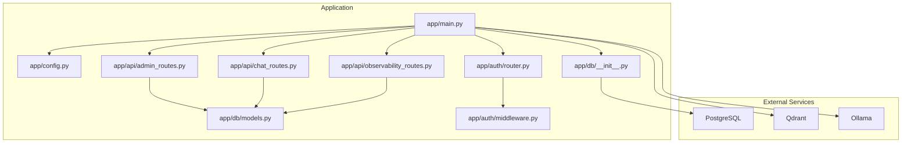

**Diagram sources**
- [main.py:63-101](file://safe4ai-pilot/app/main.py#L63-L101)
- [config.py:5-24](file://safe4ai-pilot/app/config.py#L5-L24)
- [__init__.py:8-21](file://safe4ai-pilot/app/db/__init__.py#L8-L21)
- [models.py:45-175](file://safe4ai-pilot/app/db/models.py#L45-L175)
- [router.py:24-24](file://safe4ai-pilot/app/auth/router.py#L24-L24)
- [middleware.py:51-71](file://safe4ai-pilot/app/auth/middleware.py#L51-L71)
- [admin_routes.py:39-39](file://safe4ai-pilot/app/api/admin_routes.py#L39-L39)
- [chat_routes.py:28-28](file://safe4ai-pilot/app/api/chat_routes.py#L28-L28)
- [observability_routes.py:16-16](file://safe4ai-pilot/app/api/observability_routes.py#L16-L16)

**Section sources**
- [main.py:63-101](file://safe4ai-pilot/app/main.py#L63-L101)
- [config.py:5-24](file://safe4ai-pilot/app/config.py#L5-L24)
- [pyproject.toml:9-46](file://safe4ai-pilot/pyproject.toml#L9-L46)

## Core Components
- Application entry point and lifespan: Initializes database extensions, creates tables, recovers stuck jobs, builds reusable components (HybridRetriever, Reranker, LangGraph), pre-warms Ollama, schedules cleanup, and registers exception handlers and middleware.
- Middleware stack: CORS, security headers, request size limiting, and custom HTTP middleware.
- Router registration: Mounts authentication, chat, observability, and admin routers.
- Configuration management: Centralized settings via Pydantic settings with environment variable support.
- Database integration: SQLAlchemy engine/session factory and declarative base with ORM models.

**Section sources**
- [main.py:28-67](file://safe4ai-pilot/app/main.py#L28-L67)
- [main.py:69-96](file://safe4ai-pilot/app/main.py#L69-L96)
- [main.py:98-101](file://safe4ai-pilot/app/main.py#L98-L101)
- [config.py:5-24](file://safe4ai-pilot/app/config.py#L5-L24)
- [__init__.py:8-21](file://safe4ai-pilot/app/db/__init__.py#L8-L21)
- [models.py:45-175](file://safe4ai-pilot/app/db/models.py#L45-L175)

## Architecture Overview
The application initializes long-lived resources during startup and exposes modular API endpoints grouped by feature. Authentication is handled via JWT cookies with role-based access control. The chat endpoints integrate a LangGraph pipeline and support both synchronous and streaming responses. Administrative endpoints manage documents, users, audit logs, and statistics. Observability endpoints collect feedback and compute cost statistics.

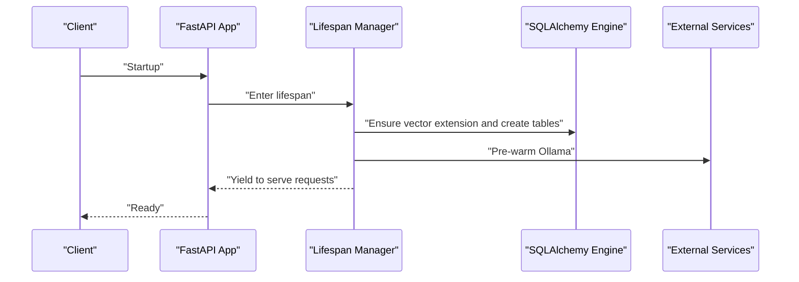

**Diagram sources**
- [main.py:28-60](file://safe4ai-pilot/app/main.py#L28-L60)

## Detailed Component Analysis

### Application Initialization and Lifespan Management
- Lifespan performs:
  - Ensures the Postgres vector extension is available.
  - Creates all database tables.
  - Recovers stuck ingestion jobs.
  - Builds reusable components (HybridRetriever, Reranker) and stores them in app.state for reuse.
  - Pre-warms Ollama to reduce first-query latency.
  - Schedules periodic cleanup tasks.
- Startup and shutdown:
  - Startup: database bootstrapping, component initialization, pre-warming, scheduling.
  - Shutdown: implicit via lifespan context manager; no explicit teardown shown.
- Health endpoint:
  - Validates connectivity to Postgres, Qdrant, and Ollama.

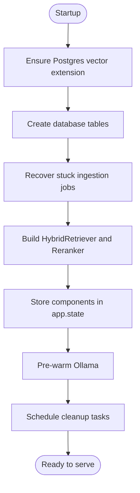

**Diagram sources**
- [main.py:35-60](file://safe4ai-pilot/app/main.py#L35-L60)

**Section sources**
- [main.py:28-67](file://safe4ai-pilot/app/main.py#L28-L67)
- [main.py:118-147](file://safe4ai-pilot/app/main.py#L118-L147)

### Middleware Stack
- CORS: Configured with origins parsed from settings, allowing credentials and common HTTP methods.
- Security headers: Adds secure headers to every response via a custom HTTP middleware.
- Request size limit: Enforces a maximum upload size based on settings.
- Rate limiting: SlowAPI limiter is attached to the app state and used by route decorators across modules.

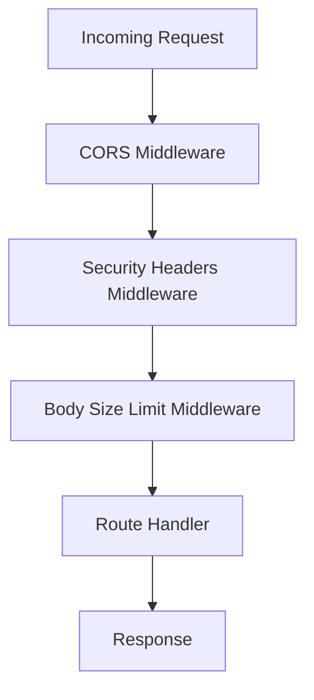

**Diagram sources**
- [main.py:69-96](file://safe4ai-pilot/app/main.py#L69-L96)

**Section sources**
- [main.py:69-96](file://safe4ai-pilot/app/main.py#L69-L96)
- [router.py:21-22](file://safe4ai-pilot/app/auth/router.py#L21-L22)

### Router Registration Pattern
- Routers are included in the main application with no prefix, and each router defines its own tags for grouping.
- Routes are decorated with rate limiting where applicable and depend on shared dependencies (database sessions, current user).

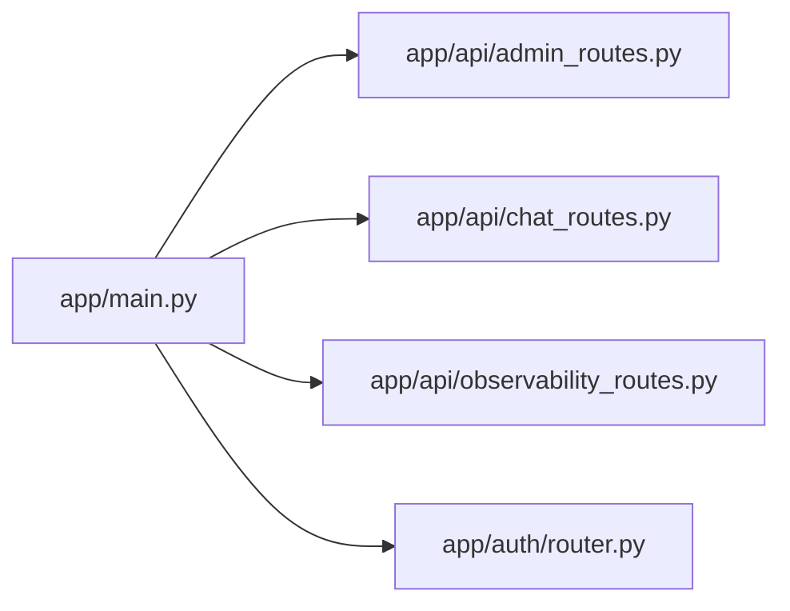

**Diagram sources**
- [main.py:98-101](file://safe4ai-pilot/app/main.py#L98-L101)
- [admin_routes.py:39-39](file://safe4ai-pilot/app/api/admin_routes.py#L39-L39)
- [chat_routes.py:28-28](file://safe4ai-pilot/app/api/chat_routes.py#L28-L28)
- [observability_routes.py:16-16](file://safe4ai-pilot/app/api/observability_routes.py#L16-L16)
- [router.py:24-24](file://safe4ai-pilot/app/auth/router.py#L24-L24)

**Section sources**
- [main.py:98-101](file://safe4ai-pilot/app/main.py#L98-L101)
- [admin_routes.py:63-114](file://safe4ai-pilot/app/api/admin_routes.py#L63-L114)
- [chat_routes.py:109-142](file://safe4ai-pilot/app/api/chat_routes.py#L109-L142)
- [observability_routes.py:26-35](file://safe4ai-pilot/app/api/observability_routes.py#L26-L35)
- [router.py:39-105](file://safe4ai-pilot/app/auth/router.py#L39-L105)

### Authentication and Authorization
- JWT-based authentication with HTTP-only cookies and role-based access control.
- Password hashing and verification utilities.
- Login enforces minimum password length, brute-force protection, and sets a signed cookie.
- Logout clears the cookie.

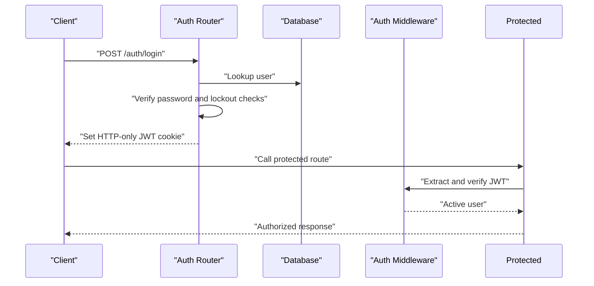

**Diagram sources**
- [router.py:39-105](file://safe4ai-pilot/app/auth/router.py#L39-L105)
- [middleware.py:51-71](file://safe4ai-pilot/app/auth/middleware.py#L51-L71)

**Section sources**
- [router.py:39-105](file://safe4ai-pilot/app/auth/router.py#L39-L105)
- [middleware.py:25-48](file://safe4ai-pilot/app/auth/middleware.py#L25-L48)
- [middleware.py:51-82](file://safe4ai-pilot/app/auth/middleware.py#L51-L82)

### Chat Pipeline and Streaming
- Blocking chat endpoint returns structured results.
- Streaming chat endpoint emits Server-Sent Events with steps and tokens.
- Uses app.state.graph built during lifespan.

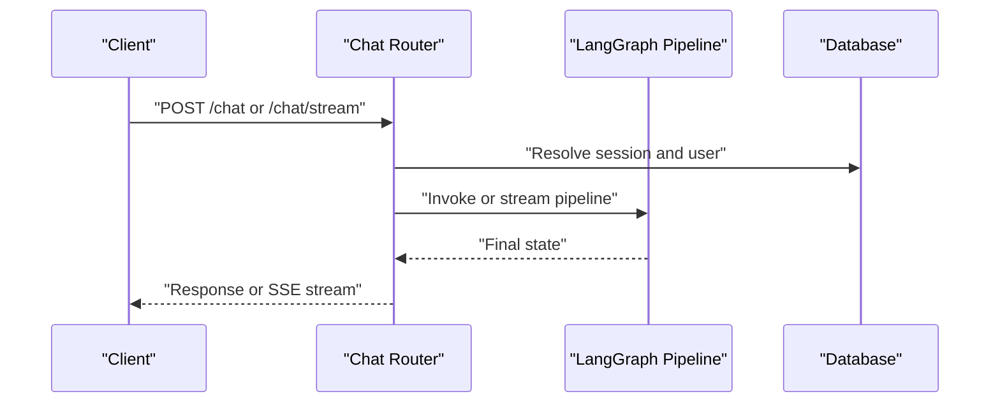

**Diagram sources**
- [chat_routes.py:109-142](file://safe4ai-pilot/app/api/chat_routes.py#L109-L142)
- [chat_routes.py:150-244](file://safe4ai-pilot/app/api/chat_routes.py#L150-L244)

**Section sources**
- [chat_routes.py:109-142](file://safe4ai-pilot/app/api/chat_routes.py#L109-L142)
- [chat_routes.py:150-244](file://safe4ai-pilot/app/api/chat_routes.py#L150-L244)

### Admin and Observability Endpoints
- Admin endpoints manage documents (upload, list, status, delete, reindex), users, audit logs, stats, human review queue, and expose current user info.
- Observability endpoints handle feedback submission and admin feedback listing, plus cost statistics.

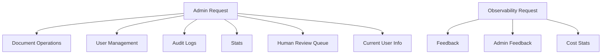

**Diagram sources**
- [admin_routes.py:63-114](file://safe4ai-pilot/app/api/admin_routes.py#L63-L114)
- [admin_routes.py:117-148](file://safe4ai-pilot/app/api/admin_routes.py#L117-L148)
- [admin_routes.py:346-418](file://safe4ai-pilot/app/api/admin_routes.py#L346-L418)
- [admin_routes.py:426-458](file://safe4ai-pilot/app/api/admin_routes.py#L426-L458)
- [admin_routes.py:466-529](file://safe4ai-pilot/app/api/admin_routes.py#L466-L529)
- [admin_routes.py:537-539](file://safe4ai-pilot/app/api/admin_routes.py#L537-L539)
- [observability_routes.py:26-35](file://safe4ai-pilot/app/api/observability_routes.py#L26-L35)
- [observability_routes.py:38-45](file://safe4ai-pilot/app/api/observability_routes.py#L38-L45)
- [observability_routes.py:48-56](file://safe4ai-pilot/app/api/observability_routes.py#L48-L56)

**Section sources**
- [admin_routes.py:63-114](file://safe4ai-pilot/app/api/admin_routes.py#L63-L114)
- [admin_routes.py:117-175](file://safe4ai-pilot/app/api/admin_routes.py#L117-L175)
- [admin_routes.py:178-243](file://safe4ai-pilot/app/api/admin_routes.py#L178-L243)
- [admin_routes.py:346-418](file://safe4ai-pilot/app/api/admin_routes.py#L346-L418)
- [admin_routes.py:426-458](file://safe4ai-pilot/app/api/admin_routes.py#L426-L458)
- [admin_routes.py:466-529](file://safe4ai-pilot/app/api/admin_routes.py#L466-L529)
- [admin_routes.py:537-539](file://safe4ai-pilot/app/api/admin_routes.py#L537-L539)
- [observability_routes.py:26-35](file://safe4ai-pilot/app/api/observability_routes.py#L26-L35)
- [observability_routes.py:38-45](file://safe4ai-pilot/app/api/observability_routes.py#L38-L45)
- [observability_routes.py:48-56](file://safe4ai-pilot/app/api/observability_routes.py#L48-L56)

### Configuration Management
- Settings class encapsulates environment-driven configuration with defaults and computed properties.
- Environment file support is configured via model_config.
- Settings consumed across the app include database URLs, external service endpoints, security keys, rate-limiting thresholds, and upload size limits.

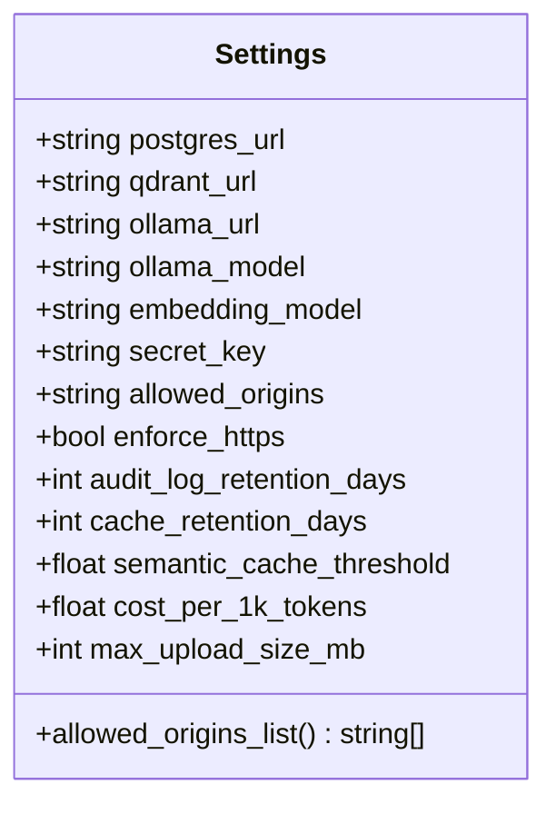

**Diagram sources**
- [config.py:5-24](file://safe4ai-pilot/app/config.py#L5-L24)

**Section sources**
- [config.py:5-24](file://safe4ai-pilot/app/config.py#L5-L24)

### Database Integration
- SQLAlchemy engine and session factory are configured with connection pooling and pre-ping.
- Declarative base is extended by domain models representing users, sessions, documents, chunks, audit logs, agent runs, feedback, ingestion jobs, and human review queue.

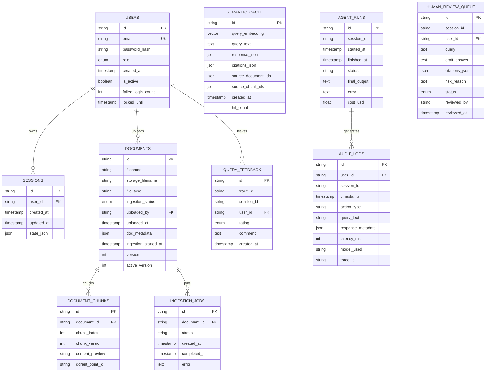

**Diagram sources**
- [models.py:45-175](file://safe4ai-pilot/app/db/models.py#L45-L175)

**Section sources**
- [__init__.py:8-21](file://safe4ai-pilot/app/db/__init__.py#L8-L21)
- [models.py:45-175](file://safe4ai-pilot/app/db/models.py#L45-L175)

## Dependency Analysis
- External dependencies include FastAPI, Uvicorn, SQLAlchemy, Pydantic, Alembic, Qdrant client, Ollama integrations, OpenTelemetry, SlowAPI, Secure headers, structlog, APScheduler, and others.
- Internal dependencies:
  - main.py depends on routers, auth middleware, config, database, and scripts.
  - Routers depend on auth middleware, database sessions, and models.
  - Auth router depends on auth middleware and settings.

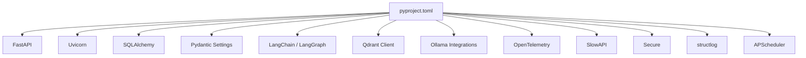

**Diagram sources**
- [pyproject.toml:9-46](file://safe4ai-pilot/pyproject.toml#L9-L46)

**Section sources**
- [pyproject.toml:9-46](file://safe4ai-pilot/pyproject.toml#L9-L46)
- [main.py:14-21](file://safe4ai-pilot/app/main.py#L14-L21)
- [router.py:14-17](file://safe4ai-pilot/app/auth/router.py#L14-L17)

## Performance Considerations
- Reuse expensive components: The lifespan builds HybridRetriever, Reranker, and the compiled LangGraph once and stores them in app.state for reuse across requests.
- Pre-warm external models: A background task pre-warms Ollama to avoid cold-start latency on first queries.
- Database optimization: Connection pooling and pre-ping are enabled; vector extension is ensured at startup.
- Rate limiting: Route decorators apply per-endpoint limits to protect downstream services.
- Streaming responses: SSE streaming reduces memory overhead and improves perceived latency for chat.

**Section sources**
- [main.py:43-58](file://safe4ai-pilot/app/main.py#L43-L58)
- [main.py:104-115](file://safe4ai-pilot/app/main.py#L104-L115)
- [__init__.py:8-9](file://safe4ai-pilot/app/db/__init__.py#L8-L9)
- [chat_routes.py:150-244](file://safe4ai-pilot/app/api/chat_routes.py#L150-L244)

## Troubleshooting Guide
- Health endpoint diagnostics:
  - Checks Postgres readiness, Qdrant readiness, and Ollama tags endpoint.
  - Aggregates statuses and returns overall status.
- CORS errors:
  - Verify allowed origins list matches frontend origin.
- Rate limit exceeded:
  - The application registers a global exception handler for RateLimitExceeded.
- Large uploads:
  - Body size middleware enforces max upload size; adjust settings if needed.
- Authentication failures:
  - Ensure cookies are sent with SameSite and Secure flags as configured.
- Database connectivity:
  - Confirm engine URL and pool settings; enable pre-ping for robustness.

**Section sources**
- [main.py:118-147](file://safe4ai-pilot/app/main.py#L118-L147)
- [main.py:69-96](file://safe4ai-pilot/app/main.py#L69-L96)
- [main.py:67-67](file://safe4ai-pilot/app/main.py#L67-L67)
- [config.py:18-18](file://safe4ai-pilot/app/config.py#L18-L18)
- [router.py:96-103](file://safe4ai-pilot/app/auth/router.py#L96-L103)

## Conclusion
The application follows a clean FastAPI structure with centralized configuration, robust middleware, modular routers, and lifecycle management for long-lived resources. It integrates authentication, rate limiting, security headers, and streaming responses, while leveraging external services for vector search and local LLM inference. The design supports easy extension with new middleware, exception handlers, and performance optimizations.

## Appendices

### Development Server Setup
- Run the application locally using Uvicorn with hot reload from the main module.

**Section sources**
- [main.py:150-153](file://safe4ai-pilot/app/main.py#L150-L153)

### Production Deployment Considerations
- Use Docker Compose to orchestrate Postgres, Qdrant, Ollama, Jaeger, and the application service.
- Configure environment variables via the app service’s env_file and environment overrides.
- Expose health checks and ensure dependent services are healthy before starting the app.
- Persist volumes for databases and model storage.

**Section sources**
- [docker-compose.yml:81-86](file://safe4ai-pilot/docker-compose.yml#L81-L86)
- [docker-compose.yml:98-103](file://safe4ai-pilot/docker-compose.yml#L98-L103)