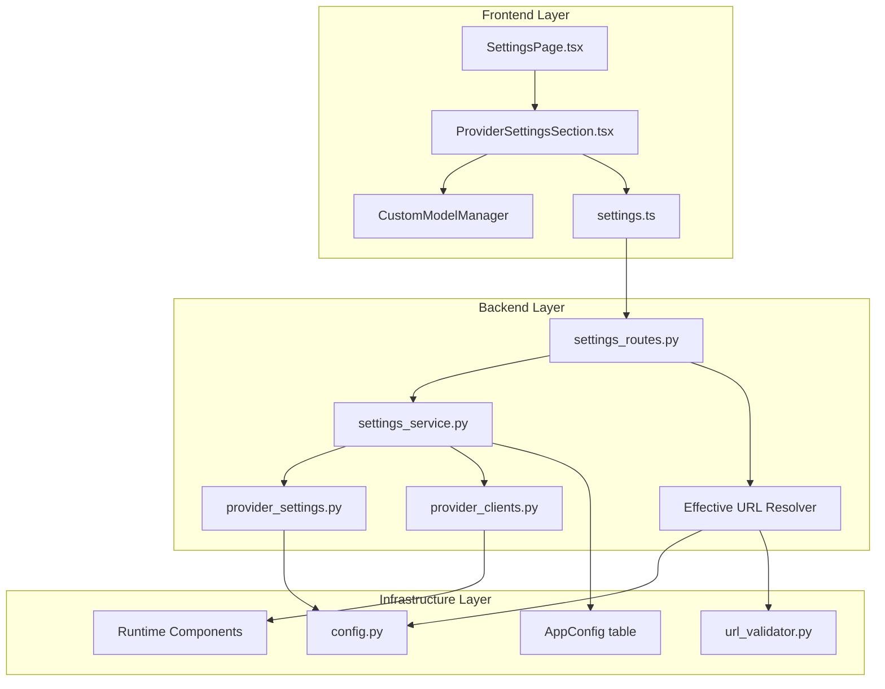
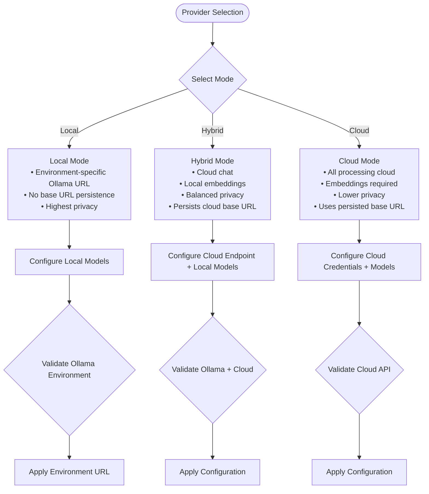
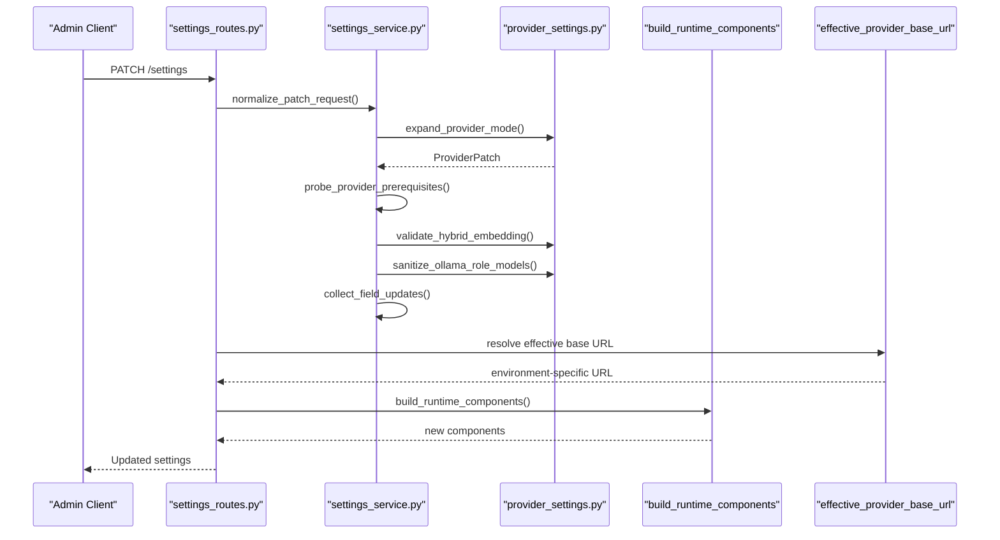
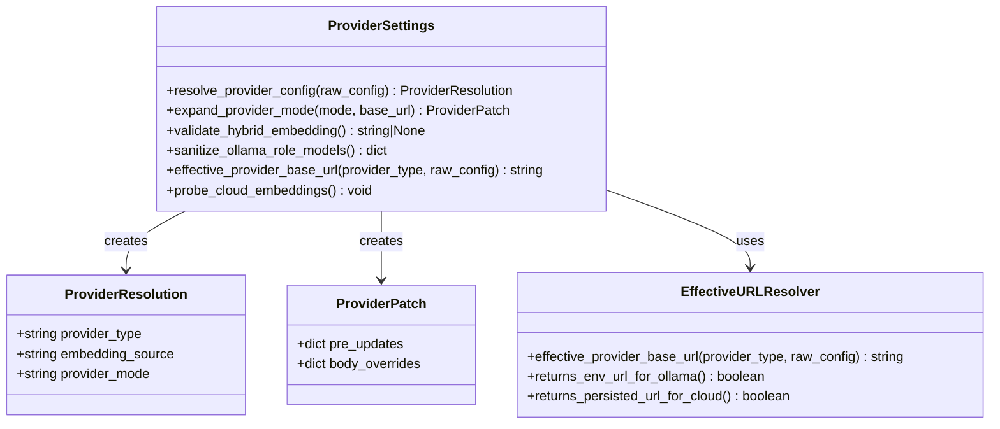
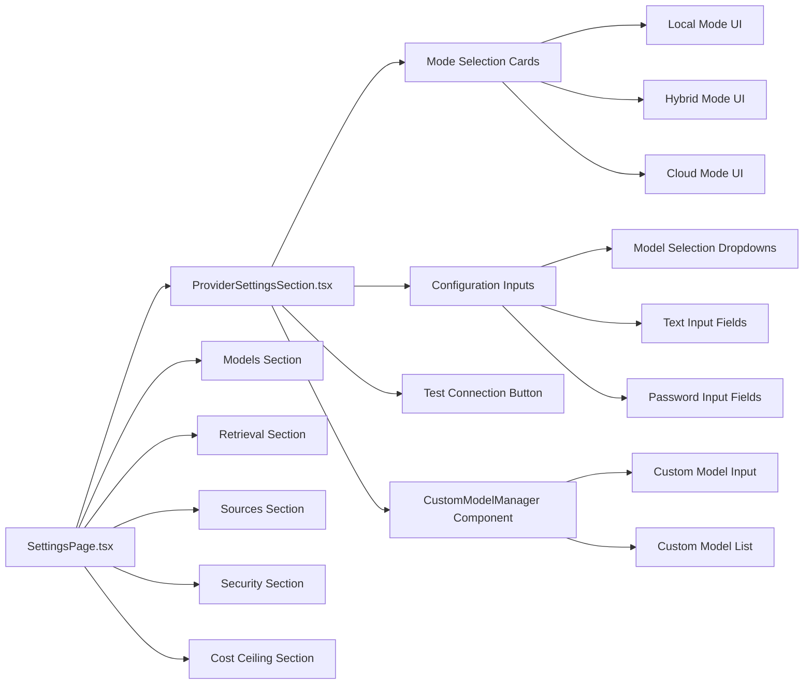
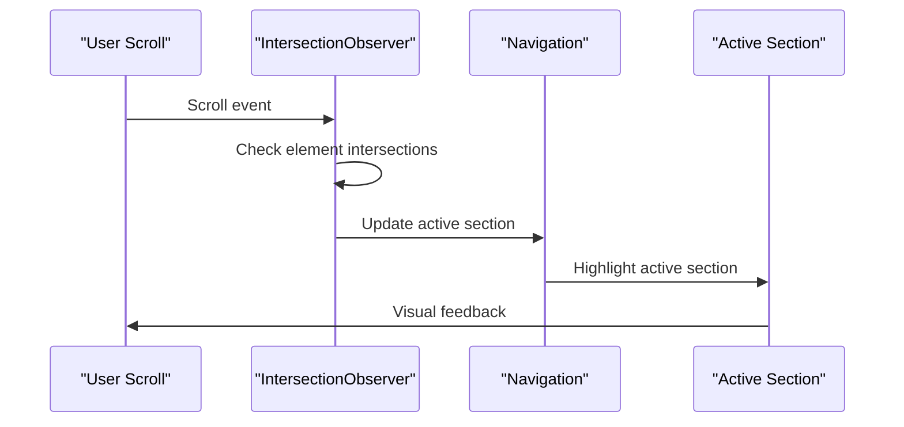
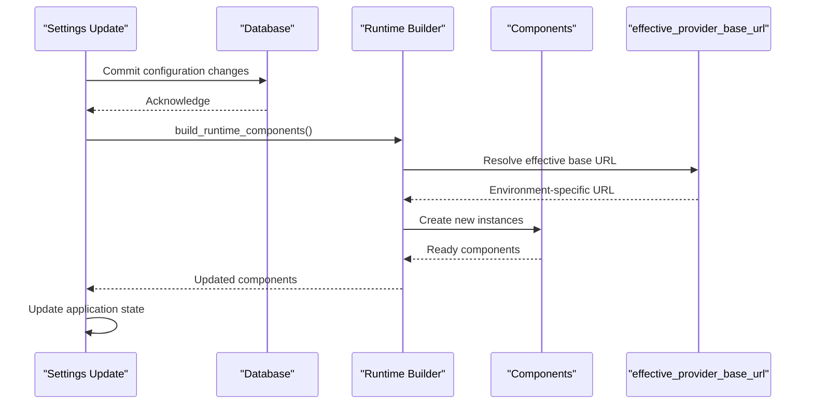
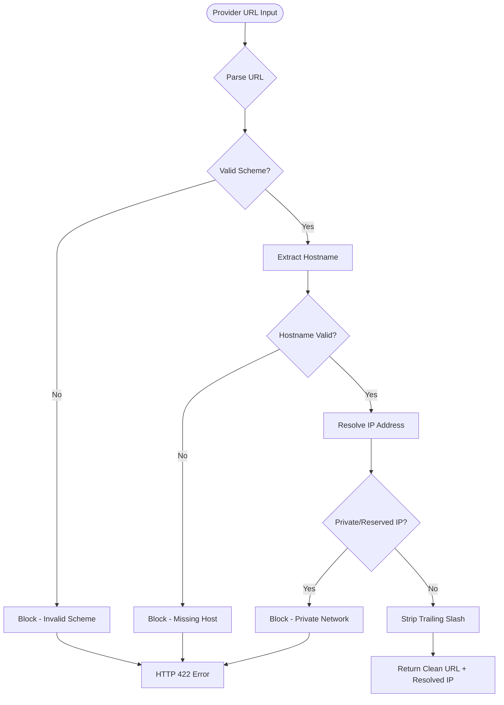
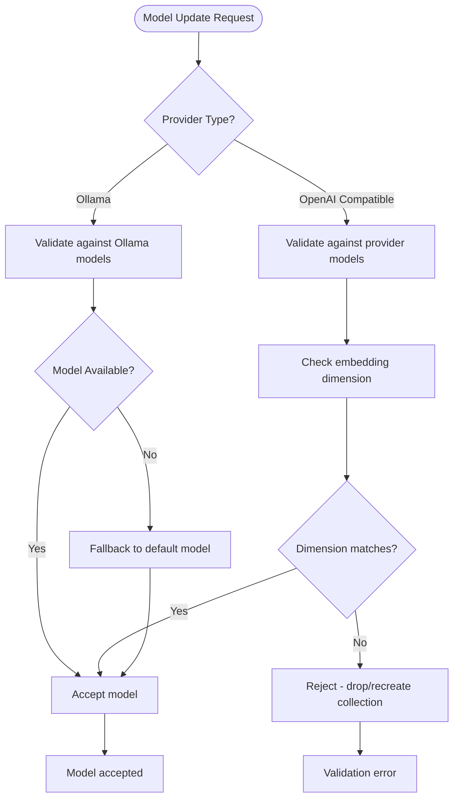

# Provider Settings Management

<cite>
**Referenced Files in This Document**
- [settings_routes.py](file://safe4ai-pilot/app/api/settings_routes.py)
- [settings_service.py](file://safe4ai-pilot/app/services/settings_service.py)
- [provider_settings.py](file://safe4ai-pilot/app/services/provider_settings.py)
- [provider_clients.py](file://safe4ai-pilot/app/services/provider_clients.py)
- [embedding_provider.py](file://safe4ai-pilot/app/components/embedding_provider.py)
- [SettingsPage.tsx](file://safe4ai-pilot/frontend/src/pages/admin/SettingsPage.tsx)
- [ProviderSettingsSection.tsx](file://safe4ai-pilot/frontend/src/components/admin/ProviderSettingsSection.tsx)
- [settings.ts](file://safe4ai-pilot/frontend/src/api/settings.ts)
- [models.py](file://safe4ai-pilot/app/db/models.py)
- [config.py](file://safe4ai-pilot/app/config.py)
- [runtime_config.py](file://safe4ai-pilot/app/services/runtime_config.py)
- [url_validator.py](file://safe4ai-pilot/app/security/url_validator.py)
</cite>

## Update Summary
**Changes Made**
- Updated Backend Implementation section to reflect new effective_provider_base_url() helper function
- Enhanced Provider Settings Resolution section with environment-specific URL handling
- Updated Runtime Integration section to show effective URL resolution in runtime components
- Added Security Mechanisms section documenting URL validation and SSRF protection
- Updated Troubleshooting Guide with environment-specific URL issues

## Table of Contents
1. [Introduction](#introduction)
2. [System Architecture](#system-architecture)
3. [Provider Modes and Configuration](#provider-modes-and-configuration)
4. [Backend Implementation](#backend-implementation)
5. [Frontend Implementation](#frontend-implementation)
6. [Runtime Integration](#runtime-integration)
7. [Security Mechanisms](#security-mechanisms)
8. [Validation and Safety Mechanisms](#validation-and-safety-mechanisms)
9. [Error Handling and Diagnostics](#error-handling-and-diagnostics)
10. [Best Practices and Guidelines](#best-practices-and-guidelines)
11. [Troubleshooting Guide](#troubleshooting-guide)

## Introduction

Provider Settings Management is a critical component of the private-ai system that controls how inference providers are configured and managed. This system enables administrators to select between different provider modes (Local, Hybrid, Cloud), configure API endpoints, manage authentication credentials, and control model selection for various AI capabilities including chat, embeddings, and vision processing.

The system provides three distinct operational modes to balance performance, privacy, and cost considerations while maintaining robust validation and safety mechanisms to prevent misconfiguration that could impact system stability or data privacy.

**Updated** Enhanced with streamlined provider settings system featuring environment-specific URL resolution for local Ollama deployments across different runtime environments.

## System Architecture

The Provider Settings Management system follows a layered architecture with clear separation of concerns between frontend presentation, backend validation, and runtime integration.

**Diagram sources**
- [settings_routes.py:1-354](file://safe4ai-pilot/app/api/settings_routes.py#L1-L354)
- [settings_service.py:1-415](file://safe4ai-pilot/app/services/settings_service.py#L1-L415)
- [provider_settings.py:1-224](file://safe4ai-pilot/app/services/provider_settings.py#L1-L224)
- [runtime_config.py:130-256](file://safe4ai-pilot/app/services/runtime_config.py#L130-L256)
- [url_validator.py:54-74](file://safe4ai-pilot/app/security/url_validator.py#L54-L74)

## Provider Modes and Configuration

The system supports three distinct provider modes, each with specific characteristics and use cases:

### Local Mode
- **Description**: Chat and document search run entirely on local Ollama server
- **Privacy**: Maximum privacy - no data leaves the local server
- **Requirements**: Ollama must be running locally
- **Capabilities**: Full local processing for chat, embeddings, and vision
- **Environment Handling**: Uses environment-specific Ollama URL (host vs Docker)

### Hybrid Mode
- **Description**: Cloud LLM for answers, Ollama for document search
- **Privacy**: Balanced privacy - documents stay local, queries go to cloud
- **Requirements**: Working cloud provider connection and local Ollama
- **Capabilities**: Cloud chat with local embeddings
- **Base URL**: Persists cloud provider base URL for future sessions

### Cloud Mode
- **Description**: Chat and document search both via cloud API
- **Privacy**: Lower privacy - all data goes to cloud provider
- **Requirements**: Working cloud provider connection with embeddings support
- **Capabilities**: Full cloud processing for all AI tasks
- **Base URL**: Uses persisted cloud provider base URL

**Diagram sources**
- [settings_routes.py:227-286](file://safe4ai-pilot/app/api/settings_routes.py#L227-L286)
- [settings_service.py:138-164](file://safe4ai-pilot/app/services/settings_service.py#L138-L164)
- [provider_settings.py:29-41](file://safe4ai-pilot/app/services/provider_settings.py#L29-L41)

**Section sources**
- [settings_routes.py:17-354](file://safe4ai-pilot/app/api/settings_routes.py#L17-L354)
- [settings_service.py:38-66](file://safe4ai-pilot/app/services/settings_service.py#L38-L66)
- [provider_settings.py:29-41](file://safe4ai-pilot/app/services/provider_settings.py#L29-L41)

## Backend Implementation

The backend implementation consists of three main layers: API routes, service logic, and provider-specific utilities.

### API Routes Layer

The settings routes handle HTTP requests and coordinate between different service layers:

**Diagram sources**
- [settings_routes.py:227-286](file://safe4ai-pilot/app/api/settings_routes.py#L227-L286)
- [settings_service.py:138-415](file://safe4ai-pilot/app/services/settings_service.py#L138-L415)
- [provider_settings.py:29-41](file://safe4ai-pilot/app/services/provider_settings.py#L29-L41)

### Service Layer Logic

The service layer implements a three-stage pipeline for processing settings updates:

1. **Normalize Stage**: Expands mode shorthands and derives effective values
2. **Probe Stage**: Validates external dependencies and sanitizes stale configurations
3. **Collect Stage**: Validates individual fields and builds database updates

### Provider Settings Resolution

The provider settings module handles the core logic for provider mode resolution and validation, including the new effective_provider_base_url() helper function:

**Diagram sources**
- [provider_settings.py:18-62](file://safe4ai-pilot/app/services/provider_settings.py#L18-L62)
- [provider_settings.py:27-33](file://safe4ai-pilot/app/services/provider_settings.py#L27-L33)
- [provider_settings.py:29-41](file://safe4ai-pilot/app/services/provider_settings.py#L29-L41)

**Section sources**
- [settings_routes.py:227-286](file://safe4ai-pilot/app/api/settings_routes.py#L227-L286)
- [settings_service.py:138-415](file://safe4ai-pilot/app/services/settings_service.py#L138-L415)
- [provider_settings.py:35-224](file://safe4ai-pilot/app/services/provider_settings.py#L35-L224)

## Frontend Implementation

The frontend provides an intuitive administrative interface for managing provider settings with real-time validation and feedback, enhanced with improved user experience features.

### Settings Page Architecture

**Diagram sources**
- [SettingsPage.tsx:92-547](file://safe4ai-pilot/frontend/src/pages/admin/SettingsPage.tsx#L92-L547)
- [ProviderSettingsSection.tsx:33-294](file://safe4ai-pilot/frontend/src/components/admin/ProviderSettingsSection.tsx#L33-L294)

### Enhanced User Experience Features

**Updated** The frontend now includes several enhanced user experience features:

#### Intersection Observer-Based Navigation Synchronization
The SettingsPage implements an intersection observer that automatically synchronizes the active navigation section with the user's scroll position:

**Diagram sources**
- [SettingsPage.tsx:269-290](file://safe4ai-pilot/frontend/src/pages/admin/SettingsPage.tsx#L269-L290)

#### Custom Model Manager Component Refactoring
The CustomModelManager component has been refactored into a separate, reusable component within ProviderSettingsSection:

- **Custom Model Input**: Allows adding custom model names not present in the dropdown
- **Model List Management**: Provides visual chips for managing custom models
- **Real-time Validation**: Prevents duplicate model entries
- **Integration with Provider Settings**: Seamlessly integrated into provider configuration flows

#### SSE Completion Mode Relocation
The SSE completion mode setting has been moved from the Provider section to the Retrieval section for better logical grouping:

- **Location**: Now appears in the Retrieval section alongside other retrieval parameters
- **Functionality**: Controls streaming completion behavior (strict vs async)
- **Performance Impact**: Strict mode waits for persistence before sending completion, async mode prioritizes lower latency

### Real-time Validation and Feedback

The frontend implements sophisticated validation and user experience features:

- **Auto-save mechanism**: Changes are automatically saved with optimistic updates
- **Real-time validation**: Immediate feedback on configuration errors
- **Connection testing**: Built-in cloud provider connectivity verification
- **Model availability**: Dynamic model lists based on provider capabilities
- **Custom model management**: Enhanced model configuration with custom model support

**Section sources**
- [SettingsPage.tsx:92-547](file://safe4ai-pilot/frontend/src/pages/admin/SettingsPage.tsx#L92-L547)
- [ProviderSettingsSection.tsx:33-294](file://safe4ai-pilot/frontend/src/components/admin/ProviderSettingsSection.tsx#L33-L294)
- [settings.ts:8-103](file://safe4ai-pilot/frontend/src/api/settings.ts#L8-L103)

## Runtime Integration

The system integrates seamlessly with the runtime components to ensure configuration changes take effect immediately without requiring service restarts.

### Runtime Component Building

**Diagram sources**
- [settings_routes.py:267-277](file://safe4ai-pilot/app/api/settings_routes.py#L267-L277)
- [runtime_config.py:138-159](file://safe4ai-pilot/app/services/runtime_config.py#L138-159)
- [provider_settings.py:29-41](file://safe4ai-pilot/app/services/provider_settings.py#L29-L41)

### Configuration Persistence

The system uses a dedicated configuration table for storing application settings with automatic timestamping and update tracking.

**Updated** The runtime now uses the effective_provider_base_url() helper function to resolve the actual base URL used by the runtime, ensuring environment-specific URLs are properly handled:

- **Local Ollama**: Always uses environment-specific URL (host vs Docker)
- **Cloud Providers**: Uses persisted base URL from configuration
- **Hybrid Mode**: Uses environment-specific Ollama URL for embeddings, cloud URL for chat

**Section sources**
- [settings_routes.py:265-286](file://safe4ai-pilot/app/api/settings_routes.py#L265-L286)
- [models.py:204-210](file://safe4ai-pilot/app/db/models.py#L204-L210)
- [runtime_config.py:138-159](file://safe4ai-pilot/app/services/runtime_config.py#L138-L159)

## Security Mechanisms

The system implements comprehensive security measures to prevent SSRF attacks and ensure secure provider URL handling.

### URL Validation and SSRF Protection

**Updated** The system now includes robust URL validation and SSRF protection mechanisms:

**Diagram sources**
- [url_validator.py:54-74](file://safe4ai-pilot/app/security/url_validator.py#L54-L74)

### Effective URL Resolution Security

The effective_provider_base_url() function ensures secure URL resolution:

- **Local Ollama**: Always uses environment-specific URL, never persisted value
- **Cloud Providers**: Uses persisted base URL with validation
- **SSRF Prevention**: All URLs are validated against private/reserved networks
- **DNS Rebinding Protection**: Resolved IPs are used as connection targets

**Section sources**
- [url_validator.py:54-74](file://safe4ai-pilot/app/security/url_validator.py#L54-L74)
- [provider_settings.py:29-41](file://safe4ai-pilot/app/services/provider_settings.py#L29-L41)

## Validation and Safety Mechanisms

The system implements comprehensive validation and safety mechanisms to prevent misconfiguration and maintain system stability.

### Model Validation

**Diagram sources**
- [settings_service.py:258-310](file://safe4ai-pilot/app/services/settings_service.py#L258-L310)
- [settings_service.py:99-103](file://safe4ai-pilot/app/services/settings_service.py#L99-L103)

### Safety Checks

The system performs several critical safety validations:

1. **Provider Reachability**: Ensures cloud providers are accessible before configuration
2. **Model Availability**: Verifies requested models exist in target systems
3. **Dimension Compatibility**: Confirms embedding model dimensions match existing collections
4. **Mode Invariants**: Maintains logical consistency between provider type and embedding source
5. **URL Security**: Validates provider URLs against SSRF attacks and private networks

**Section sources**
- [settings_service.py:171-251](file://safe4ai-pilot/app/services/settings_service.py#L171-L251)
- [provider_settings.py:99-224](file://safe4ai-pilot/app/services/provider_settings.py#L99-L224)

## Error Handling and Diagnostics

The system provides comprehensive error handling with clear diagnostic information for troubleshooting configuration issues.

### Error Categories

| Error Type | HTTP Status | Description | Recovery Action |
|------------|-------------|-------------|-----------------|
| Validation Error | 422 | Invalid configuration values | Fix input according to validation rules |
| Provider Unreachable | 503 | External service not accessible | Check network connectivity and credentials |
| Model Not Found | 422 | Requested model unavailable | Select available model or install missing model |
| Dimension Mismatch | 409 | Embedding dimension mismatch | Drop and recreate collection or change model |
| URL Validation Error | 422 | Invalid or insecure URL | Use valid public URL without private/reserved addresses |

### Diagnostic Features

- **Connection Testing**: Built-in cloud provider connectivity verification
- **Live Metadata**: Real-time statistics including cost tracking and model availability
- **Error Messages**: Specific, actionable error messages for each failure type
- **Audit Logging**: All configuration changes are logged for compliance tracking

**Section sources**
- [settings_routes.py:289-354](file://safe4ai-pilot/app/api/settings_routes.py#L289-L354)
- [settings_service.py:171-251](file://safe4ai-pilot/app/services/settings_service.py#L171-L251)

## Best Practices and Guidelines

### Provider Mode Selection

**Choose Local Mode When:**
- Maximum privacy requirements
- Limited or unreliable internet connectivity
- Compliance requirements mandate data stays on-premises
- Resource constraints limit cloud usage
- Deploying in containerized environments where Ollama URL differs from host

**Choose Hybrid Mode When:**
- Need cloud-quality LLMs with local document processing
- Balance between performance and privacy
- Existing Ollama infrastructure available
- Mixed workloads with varying privacy requirements

**Choose Cloud Mode When:**
- Cloud provider offers superior LLM capabilities
- Document privacy is not a primary concern
- Centralized management preferred
- Budget allows for cloud compute costs

### Configuration Management

1. **Always test connections** before committing to new provider configurations
2. **Backup current settings** before major changes
3. **Monitor cost implications** when switching to cloud providers
4. **Validate model availability** in target environments
5. **Consider reindexing requirements** when changing embedding models
6. **Understand environment-specific URLs** for local Ollama deployments

### Security Considerations

- Store API keys securely using environment variables
- Regularly rotate API keys for cloud providers
- Monitor provider access logs and usage patterns
- Limit administrative access to settings management
- Audit all configuration changes for compliance
- Ensure provider URLs resolve to public, non-private IP addresses

## Troubleshooting Guide

### Common Issues and Solutions

**Issue**: "Hybrid mode requires local Ollama but Ollama is not reachable"
- **Cause**: Local Ollama service not running or accessible
- **Solution**: Start Ollama service and verify connectivity on port 11434

**Issue**: "Provider does not appear to support embeddings"
- **Cause**: Cloud provider lacks `/embeddings` endpoint support
- **Solution**: Switch to Hybrid mode or choose a different provider

**Issue**: "Embedding model is not available in Ollama"
- **Cause**: Requested model not pulled to local Ollama
- **Solution**: Run `ollama pull <model-name>` and retry

**Issue**: "Embedding model requires vector size X but collection has size Y"
- **Cause**: Changing embedding models requires collection recreation
- **Solution**: Drop and recreate Qdrant collection or revert model change

**Issue**: "Provider URL resolves to a private/reserved IP address"
- **Cause**: URL points to private network or localhost
- **Solution**: Use public URL or configure proper network routing

**Issue**: "Local Ollama URL differs between host and Docker deployments"
- **Cause**: Environment-specific URL resolution
- **Solution**: System automatically uses correct URL for current environment

### Debugging Steps

1. **Verify provider connectivity** using the built-in test function
2. **Check model availability** in both Ollama and cloud provider
3. **Review configuration logs** for detailed error messages
4. **Validate network connectivity** to external services
5. **Confirm resource availability** (CPU, memory, disk space)
6. **Test URL resolution** using the effective_provider_base_url() function

### Performance Optimization

- **Local Mode**: Optimal for privacy, moderate performance
- **Hybrid Mode**: Best balance of performance and privacy
- **Cloud Mode**: Highest performance, lowest privacy
- **Model Selection**: Choose models appropriate for workload requirements
- **Resource Allocation**: Ensure adequate resources for selected provider mode

**Section sources**
- [settings_routes.py:289-354](file://safe4ai-pilot/app/api/settings_routes.py#L289-L354)
- [settings_service.py:171-251](file://safe4ai-pilot/app/services/settings_service.py#L171-L251)
- [url_validator.py:54-74](file://safe4ai-pilot/app/security/url_validator.py#L54-L74)