# Runtime Configuration System

<cite>
**Referenced Files in This Document**
- [runtime_config.py](file://safe4ai-pilot/app/services/runtime_config.py)
- [app_config_store.py](file://safe4ai-pilot/app/services/app_config_store.py)
- [config.py](file://safe4ai-pilot/app/config.py)
- [main.py](file://safe4ai-pilot/app/main.py)
- [models.py](file://safe4ai-pilot/app/db/models.py)
- [admin_routes.py](file://safe4ai-pilot/app/api/admin_routes.py)
- [SettingsPage.tsx](file://safe4ai-pilot/frontend/src/pages/admin/SettingsPage.tsx)
- [provider_clients.py](file://safe4ai-pilot/app/services/provider_clients.py)
- [embedding_provider.py](file://safe4ai-pilot/app/components/embedding_provider.py)
- [hybrid_retriever.py](file://safe4ai-pilot/app/components/hybrid_retriever.py)
- [reranker.py](file://safe4ai-pilot/app/components/reranker.py)
- [graph.py](file://safe4ai-pilot/app/agents/graph.py)
- [document_grader.py](file://safe4ai-pilot/app/agents/document_grader.py)
- [adaptive_router.py](file://safe4ai-pilot/app/agents/adaptive_router.py)
- [test_admin.py](file://safe4ai-pilot/tests/test_admin.py)
- [settings.ts](file://safe4ai-pilot/frontend/src/api/settings.ts)
- [provider_settings.py](file://safe4ai-pilot/app/services/provider_settings.py)
- [settings_service.py](file://safe4ai-pilot/app/services/settings_service.py)
- [offline_eval.py](file://safe4ai-pilot/evaluation/offline_eval.py)
- [verify_airgap_package.py](file://safe4ai-pilot/scripts/verify_airgap_package.py)
- [conftest.py](file://safe4ai-pilot/tests/conftest.py)
- [test_chat.py](file://safe4ai-pilot/tests/test_chat.py)
- [test_rag_pipeline.py](file://safe4ai-pilot/tests/test_rag_pipeline.py)
- [codebase-summary.md](file://safe4ai-pilot/docs/codebase-summary.md)
- [deployment.md](file://safe4ai-pilot/docs/deployment.md)
- [2026-05-15-provider-runtime-hardening.md](file://safe4ai-pilot/docs/superpowers/plans/2026-05-15-provider-runtime-hardening.md)
</cite>

## Update Summary
**Changes Made**
- Updated to reflect Applied Changes: Added extra='ignore' configuration to resolve environment variable conflicts between application and Docker Compose, improving development environment stability and preventing import failures
- Enhanced environment variable handling to prevent startup failures when Docker Compose defines variables not used by the application
- Improved development environment stability by allowing the application to ignore extraneous environment variables

## Table of Contents
1. [Introduction](#introduction)
2. [System Architecture](#system-architecture)
3. [Core Components](#core-components)
4. [Three-Mode Provider System](#three-mode-provider-system)
5. [Configuration Loading Pipeline](#configuration-loading-pipeline)
6. [Runtime Component Building](#runtime-component-building)
7. [Admin Configuration Management](#admin-configuration-management)
8. [Frontend Configuration Interface](#frontend-configuration-interface)
9. [Data Persistence Layer](#data-persistence-layer)
10. [Scoring and Routing System](#scoring-and-routing-system)
11. [Error Handling and Validation](#error-handling-and-validation)
12. [Performance Considerations](#performance-considerations)
13. [Troubleshooting Guide](#troubleshooting-guide)
14. [Conclusion](#conclusion)

## Introduction

The Runtime Configuration System is a centralized mechanism that manages application-wide settings and parameters that can be dynamically adjusted without requiring application restarts. This system enables administrators to modify AI model configurations, retrieval parameters, and operational settings in real-time, affecting all users immediately.

**Updated** The system now features enhanced environment variable handling with the addition of extra='ignore' configuration in Pydantic Settings. This change resolves conflicts between application settings and Docker Compose environment variables, improving development environment stability and preventing import failures that could occur when Docker Compose defines variables not used by the application.

The system operates on a hierarchical configuration model where environment variables serve as defaults, database-stored overrides provide persistent settings, and runtime components are rebuilt automatically when changes occur. This architecture supports dynamic scaling, A/B testing capabilities, and operational flexibility for AI-powered applications.

**Enhanced** The system now includes comprehensive rollback functionality that automatically handles database transaction rollback when runtime component rebuilding fails, ensuring configuration consistency and preventing partial updates.

## System Architecture

The Runtime Configuration System follows a layered architecture with clear separation of concerns and three-mode provider support:

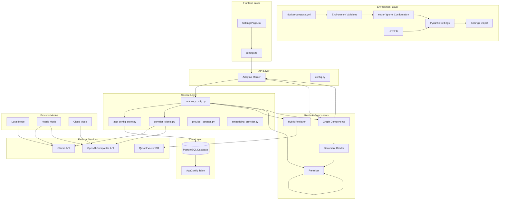

**Diagram sources**
- [config.py:45-52](file://safe4ai-pilot/app/config.py#L45-L52)
- [SettingsPage.tsx:517-559](file://safe4ai-pilot/frontend/src/pages/admin/SettingsPage.tsx#L517-L559)
- [settings.ts:4-7](file://safe4ai-pilot/frontend/src/api/settings.ts#L4-L7)
- [admin_routes.py:958-1157](file://safe4ai-pilot/app/api/admin_routes.py#L958-L1157)
- [runtime_config.py:132-172](file://safe4ai-pilot/app/services/runtime_config.py#L132-L172)
- [app_config_store.py:40-75](file://safe4ai-pilot/app/services/app_config_store.py#L40-L75)
- [provider_clients.py:52-200](file://safe4ai-pilot/app/services/provider_clients.py#L52-L200)

## Core Components

### Runtime Configuration Data Structure

The system defines a comprehensive configuration data structure that encapsulates all runtime parameters including the new three-mode provider system:

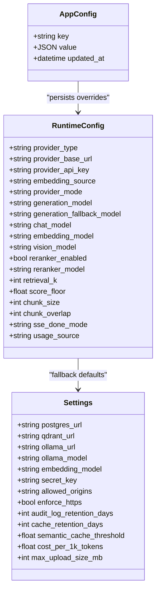

**Diagram sources**
- [runtime_config.py:37-61](file://safe4ai-pilot/app/services/runtime_config.py#L37-L61)
- [config.py:7-51](file://safe4ai-pilot/app/config.py#L7-L51)
- [models.py:204-210](file://safe4ai-pilot/app/db/models.py#L204-L210)

**Section sources**
- [runtime_config.py:37-61](file://safe4ai-pilot/app/services/runtime_config.py#L37-L61)
- [config.py:7-51](file://safe4ai-pilot/app/config.py#L7-L51)
- [models.py:204-210](file://safe4ai-pilot/app/db/models.py#L204-L210)

## Three-Mode Provider System

**New** The system now implements a revolutionary three-mode provider architecture that provides unprecedented operational flexibility:

### Provider Mode Determination

The provider_mode property automatically determines the operational mode based on provider_type and embedding_source:

```mermaid
flowchart TD
Start[Configuration Load] --> CheckProvider{provider_type == "ollama"?}
CheckProvider --> |Yes| Local[Set mode = "local"]
CheckProvider --> |No| CheckEmbedding{embedding_source == "ollama"?}
CheckEmbedding --> |Yes| Hybrid[Set mode = "hybrid"]
CheckEmbedding --> |No| Cloud[Set mode = "cloud"]
Local --> Result[Local Mode Active]
Hybrid --> Result
Cloud --> Result
```

**Diagram sources**
- [runtime_config.py:57-61](file://safe4ai-pilot/app/services/runtime_config.py#L57-L61)
- [admin_routes.py:179-182](file://safe4ai-pilot/app/api/admin_routes.py#L179-L182)

### Mode-Specific Provider Selection

Each mode uses different provider configurations:

#### Local Mode (`provider_mode = "local"`)
- **All services**: Run on local Ollama instance
- **Embeddings**: Generated by local Ollama embedding models
- **Chat**: Uses local Ollama chat models
- **Vision**: Uses local Ollama vision models (qwen3.5:9b)
- **Security**: Maximum privacy - no external data transfer

#### Hybrid Mode (`provider_mode = "hybrid"`)
- **Chat**: Cloud provider (OpenAI-compatible API)
- **Embeddings**: Local Ollama embedding models
- **Vision**: Local Ollama vision models (qwen3.5:9b)
- **Privacy**: Documents stay local, best quality chat
- **Requirements**: Local Ollama must be available for embeddings

#### Cloud Mode (`provider_mode = "cloud"`)
- **All services**: Run on cloud provider
- **Embeddings**: Generated by cloud provider embedding API
- **Chat**: Uses cloud provider chat models
- **Vision**: Uses cloud provider vision models (qwen3.5:9b)
- **Requirements**: Cloud provider must support embeddings API

**Section sources**
- [runtime_config.py:57-61](file://safe4ai-pilot/app/services/runtime_config.py#L57-L61)
- [runtime_config.py:167-196](file://safe4ai-pilot/app/services/runtime_config.py#L167-L196)
- [admin_routes.py:179-182](file://safe4ai-pilot/app/api/admin_routes.py#L179-L182)

## Configuration Loading Pipeline

The configuration loading process follows a hierarchical precedence model with three-mode provider support:

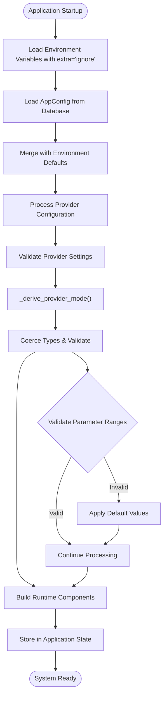

**Diagram sources**
- [config.py:45-52](file://safe4ai-pilot/app/config.py#L45-L52)
- [runtime_config.py:96-144](file://safe4ai-pilot/app/services/runtime_config.py#L96-L144)
- [admin_routes.py:179-182](file://safe4ai-pilot/app/api/admin_routes.py#L179-L182)
- [main.py:52-58](file://safe4ai-pilot/app/main.py#L52-L58)

The pipeline ensures robust configuration management through multiple validation layers and graceful fallback mechanisms, now supporting three distinct provider modes and enhanced environment variable handling.

**Section sources**
- [config.py:45-52](file://safe4ai-pilot/app/config.py#L45-L52)
- [runtime_config.py:96-144](file://safe4ai-pilot/app/services/runtime_config.py#L96-L144)
- [admin_routes.py:179-182](file://safe4ai-pilot/app/api/admin_routes.py#L179-L182)
- [main.py:52-58](file://safe4ai-pilot/app/main.py#L52-L58)

## Runtime Component Building

The system builds runtime components dynamically based on configuration with three-mode awareness:

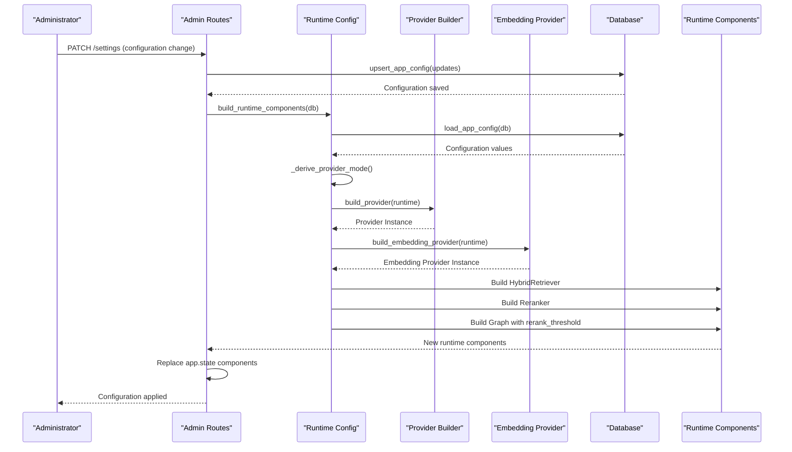

**Diagram sources**
- [admin_routes.py:1084-1092](file://safe4ai-pilot/app/api/admin_routes.py#L1084-L1092)
- [runtime_config.py:199-221](file://safe4ai-pilot/app/services/runtime_config.py#L199-L221)
- [runtime_config.py:167-196](file://safe4ai-pilot/app/services/runtime_config.py#L167-L196)

**Section sources**
- [admin_routes.py:1084-1092](file://safe4ai-pilot/app/api/admin_routes.py#L1084-L1092)
- [runtime_config.py:199-221](file://safe4ai-pilot/app/services/runtime_config.py#L199-L221)
- [runtime_config.py:167-196](file://safe4ai-pilot/app/services/runtime_config.py#L167-L196)

## Admin Configuration Management

The administration interface provides comprehensive configuration management capabilities with three-mode support:

### Configuration Categories

The system organizes settings into logical categories with three-mode considerations:

| Category | Parameters | Purpose |
|----------|------------|---------|
| **Provider** | provider_type, provider_base_url, provider_api_key, embedding_source, provider_mode, provider_chat_model, provider_embedding_model, provider_vision_model, sse_done_mode | Three-mode provider selection and configuration |
| **Models** | generation_model, generation_fallback_model, embedding_model, vision_model | AI model selection and fallback strategies |
| **Retrieval** | retrieval_k, score_floor, chunk_size, chunk_overlap | Document retrieval and processing parameters |
| **Reranking** | reranker_enabled, reranker_model | Re-ranking algorithm configuration |
| **Security** | sso_only, session_hours, audit_retention_days, redact_pii | Security and compliance settings |
| **Cost Control** | daily_ceiling_usd, monthly_ceiling_usd | Financial limits and monitoring |

### Three-Mode Provider Configuration Management

**Updated** The system now supports three distinct provider modes with specific configuration requirements:

#### Local Mode (`provider_mode = "local"`)
- **Mode**: `local`
- **Base URL**: Uses local Ollama URL from settings
- **API Key**: Not required
- **Models**: All models from local Ollama (qwen3.5:9b for vision)
- **Usage Tracking**: Estimated token counts
- **Privacy**: Maximum privacy - no external data transfer

#### Hybrid Mode (`provider_mode = "hybrid"`)
- **Mode**: `hybrid`
- **Base URL**: Cloud provider API endpoint (e.g., `https://api.deepseek.com/v1`)
- **API Key**: Required for cloud provider access
- **Chat Model**: Cloud provider chat model
- **Embedding Model**: Local Ollama embedding model (nomic-embed-text)
- **Vision Model**: Local Ollama vision model (qwen3.5:9b)
- **Usage Tracking**: Actual token counts from cloud provider
- **Requirements**: Local Ollama must be available for embeddings

#### Cloud Mode (`provider_mode = "cloud"`)
- **Mode**: `cloud`
- **Base URL**: Cloud provider API endpoint (e.g., `https://api.openai.com/v1`)
- **API Key**: Required for cloud provider access
- **Chat Model**: Cloud provider chat model
- **Embedding Model**: Cloud provider embedding model
- **Vision Model**: Cloud provider vision model (qwen3.5:9b)
- **Usage Tracking**: Actual token counts from cloud provider
- **Requirements**: Cloud provider must support embeddings API

### Enhanced Rollback Functionality

**New** The system now includes comprehensive rollback functionality that automatically handles database transaction rollback when runtime component rebuilding fails:

```mermaid
flowchart TD
Start[PATCH /settings Request] --> Validate[Validate Configuration Updates]
Validate --> Upsert[upsert_app_config - Commit=False]
Upsert --> BuildComponents[build_runtime_components]
BuildComponents --> Success{Build Success?}
Success --> |Yes| Commit[db.commit()]
Success --> |No| Rollback[db.rollback()]
Rollback --> Error[HTTPException: Configuration Invalid]
Commit --> ReplaceState[Replace app.state Components]
ReplaceState --> Response[Return Updated Settings]
Error --> Response
```

**Diagram sources**
- [admin_routes.py:1186-1195](file://safe4ai-pilot/app/api/admin_routes.py#L1186-L1195)

The rollback mechanism ensures that:
- Configuration changes are atomic - either fully applied or completely rolled back
- Database state remains consistent even when runtime component building fails
- Partial updates are prevented, maintaining system integrity
- Error handling provides clear feedback to administrators

### Validation and Sanitization

The system implements comprehensive validation for all configuration parameters with three-mode awareness:

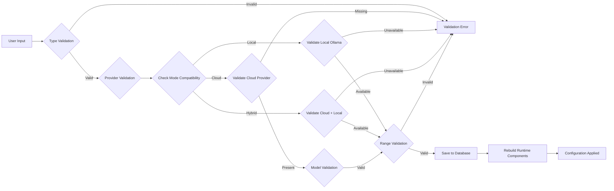

**Diagram sources**
- [admin_routes.py:958-1157](file://safe4ai-pilot/app/api/admin_routes.py#L958-L1157)

**Section sources**
- [admin_routes.py:958-1157](file://safe4ai-pilot/app/api/admin_routes.py#L958-L1157)

## Frontend Configuration Interface

The frontend provides an intuitive interface for managing runtime configurations with three-mode support:

### SettingsPage Architecture

The SettingsPage component implements a modular configuration interface with enhanced provider management and three-mode selection:

```mermaid
graph TB
SP[SettingsPage.tsx] --> Nav[Navigation Sidebar]
SP --> Provider[Provider Section]
SP --> Models[Models Section]
SP --> Retrieval[Retrieval Section]
SP --> Sources[Sources Section]
SP --> Security[Security Section]
SP --> Cost[Cost Section]
Provider --> ModeCards[Mode Cards]
ModeCards --> Local[Local Mode Card]
ModeCards --> Hybrid[Hybrid Mode Card]
ModeCards --> Cloud[Cloud Mode Card]
Provider --> LocalFields[Local Fields]
Provider --> HybridFields[Hybrid Fields]
Provider --> CloudFields[Cloud Fields]
Local --> LocalChat[Local Chat Model]
Local --> LocalEmbed[Local Embedding Model]
Local --> LocalVision[Local Vision Model]
Hybrid --> HybridChat[Cloud Chat Model]
Hybrid --> HybridEmbed[Local Embedding Model]
Hybrid --> HybridVision[Local Vision Model]
Cloud --> CloudChat[Cloud Chat Model]
Cloud --> CloudEmbed[Cloud Embedding Model]
Cloud --> CloudVision[Cloud Vision Model]
Models --> GM[Generation Model Input]
Models --> EF[Embedding Model Input]
Models --> VM[Vision Model Input]
Retrieval --> RK[Retrieval K Input]
Retrieval --> SF[Score Floor Input]
Retrieval --> CS[Chunk Size Input]
Retrieval --> CO[Chunk Overlap Input]
Security --> SO[SSO Only Toggle]
Security --> SH[Session Hours Input]
Security --> AR[Archive Retention Input]
Security --> PII[PII Redaction Toggle]
Cost --> DC[Daily Ceiling Input]
Cost --> MC[Monthly Ceiling Input]
```

**Diagram sources**
- [SettingsPage.tsx:517-559](file://safe4ai-pilot/frontend/src/pages/admin/SettingsPage.tsx#L517-L559)
- [SettingsPage.tsx:627-632](file://safe4ai-pilot/frontend/src/pages/admin/SettingsPage.tsx#L627-L632)
- [SettingsPage.tsx:667-743](file://safe4ai-pilot/frontend/src/pages/admin/SettingsPage.tsx#L667-L743)
- [settings.ts:4-7](file://safe4ai-pilot/frontend/src/api/settings.ts#L4-L7)

### Three-Mode Interface Design

The frontend presents three distinct configuration interfaces based on the selected mode:

#### Local Mode Interface
- **Chat Model**: Select from available Ollama models
- **Embedding Model**: Select from available Ollama models
- **Vision Model**: Select from available Ollama models (qwen3.5:9b as default)
- **Status**: Local Ollama - no API key required

#### Hybrid Mode Interface
- **API Base URL**: Configure cloud provider endpoint
- **API Key**: Required for cloud provider access
- **Chat Model**: Select from cloud provider models
- **Embedding Model**: Local Ollama embedding model (nomic-embed-text)
- **Vision Model**: Local Ollama vision model (qwen3.5:9b)
- **Status**: Cloud chat + local embeddings

#### Cloud Mode Interface
- **API Base URL**: Configure cloud provider endpoint
- **API Key**: Required for cloud provider access
- **Chat Model**: Select from cloud provider models
- **Embedding Model**: Select from cloud provider models
- **Vision Model**: Select from cloud provider models (qwen3.5:9b)
- **Status**: Fully cloud provider

**Section sources**
- [SettingsPage.tsx:517-559](file://safe4ai-pilot/frontend/src/pages/admin/SettingsPage.tsx#L517-L559)
- [SettingsPage.tsx:627-632](file://safe4ai-pilot/frontend/src/pages/admin/SettingsPage.tsx#L627-L632)
- [SettingsPage.tsx:667-743](file://safe4ai-pilot/frontend/src/pages/admin/SettingsPage.tsx#L667-L743)
- [settings.ts:4-7](file://safe4ai-pilot/frontend/src/api/settings.ts#L4-L7)

## Data Persistence Layer

The configuration persistence system utilizes a dedicated database table with JSON storage and enhanced security:

### AppConfig Schema

| Column | Type | Description | Constraints |
|--------|------|-------------|-------------|
| `key` | String | Configuration parameter identifier | Primary Key |
| `value` | JSON | Stored configuration value | Not Null |
| `updated_at` | DateTime | Last modification timestamp | Automatic |

### Sensitive Data Encryption

**Updated** The system now encrypts sensitive configuration values using Fernet encryption:

- **Encrypted Keys**: `openai_api_key`, `anthropic_api_key`, `api_key`, `provider_api_key`
- **Encryption Method**: Fernet symmetric encryption derived from SECRET_KEY
- **Storage Format**: Encrypted values prefixed with `enc:`

### Storage Operations

The system provides efficient CRUD operations for configuration management:

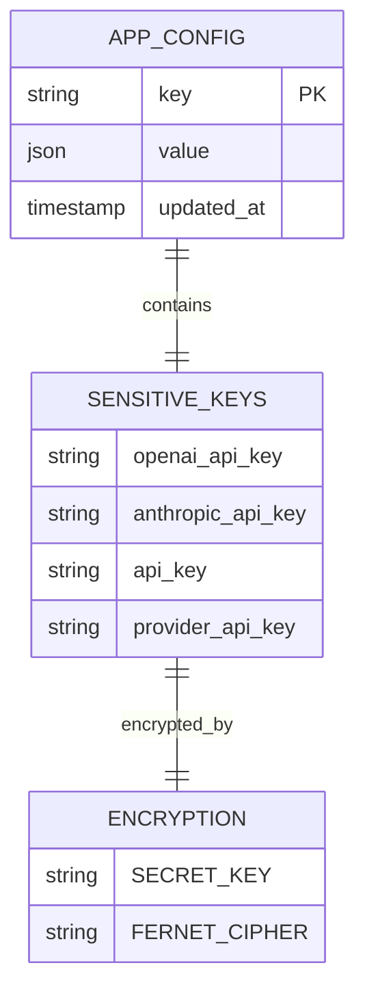

**Diagram sources**
- [models.py:204-210](file://safe4ai-pilot/app/db/models.py#L204-L210)
- [app_config_store.py:12-17](file://safe4ai-pilot/app/services/app_config_store.py#L12-L17)
- [app_config_store.py:22-38](file://safe4ai-pilot/app/services/app_config_store.py#L22-L38)

**Section sources**
- [models.py:204-210](file://safe4ai-pilot/app/db/models.py#L204-L210)
- [app_config_store.py:12-17](file://safe4ai-pilot/app/services/app_config_store.py#L12-L17)
- [app_config_store.py:22-38](file://safe4ai-pilot/app/services/app_config_store.py#L22-L38)

## Scoring and Routing System

**New** The system now implements a deterministic scoring and routing system that works seamlessly with the three-mode architecture:

### Score-Based Document Filtering

The document grading system uses a simple threshold-based approach instead of LLM calls:

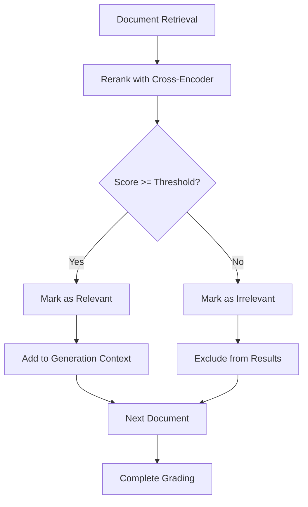

**Diagram sources**
- [document_grader.py:15-24](file://safe4ai-pilot/app/agents/document_grader.py#L15-L24)
- [graph.py:131-148](file://safe4ai-pilot/app/agents/graph.py#L131-L148)

### Deterministic Routing Logic

The routing system uses simple, predictable rules instead of LLM-based decisions:

```mermaid
flowchart TD
Start[Graded Chunks] --> Count{Count Relevant Chunks}
Count --> |>= 2| Generate[Generate Answer]
Count --> |< 2| Decompose[Decompose Query]
Generate --> QualityGate[Quality Gate Check]
Decompose --> Retrieve[Retrieve More Chunks]
Retrieve --> GradeAgain[Grade Again]
GradeAgain --> Count
QualityGate --> Grounded{Answer Grounded?}
Grounded --> |Yes| Respond[Respond to User]
Grounded --> |No| Fallback[Fallback to "I don't know"]
Respond --> End[End]
Fallback --> End
```

**Diagram sources**
- [adaptive_router.py:12-23](file://safe4ai-pilot/app/agents/adaptive_router.py#L12-L23)
- [graph.py:264-289](file://safe4ai-pilot/app/agents/graph.py#L264-L289)

### Configuration Integration

The score_floor configuration is passed through the entire pipeline as rerank_threshold:

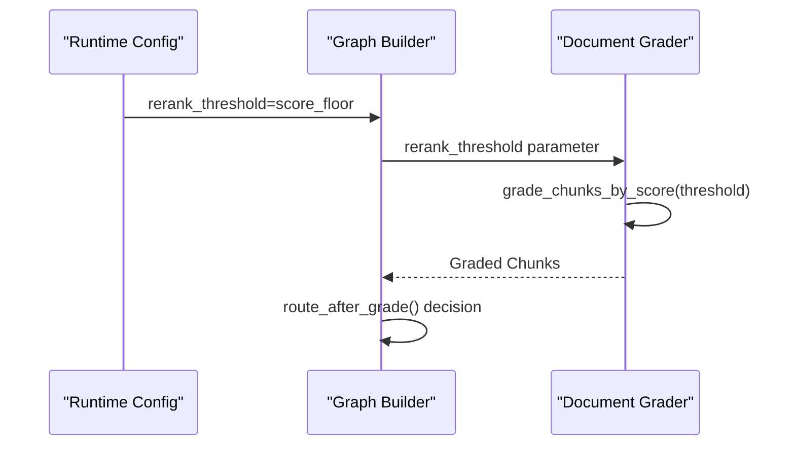

**Diagram sources**
- [runtime_config.py:170](file://safe4ai-pilot/app/services/runtime_config.py#L170)
- [graph.py:141](file://safe4ai-pilot/app/agents/graph.py#L141)
- [document_grader.py:40-41](file://safe4ai-pilot/app/agents/document_grader.py#L40-L41)

**Section sources**
- [document_grader.py:15-24](file://safe4ai-pilot/app/agents/document_grader.py#L15-L24)
- [adaptive_router.py:12-23](file://safe4ai-pilot/app/agents/adaptive_router.py#L12-L23)
- [graph.py:131-148](file://safe4ai-pilot/app/agents/graph.py#L131-L148)
- [runtime_config.py:170](file://safe4ai-pilot/app/services/runtime_config.py#L170)

## Error Handling and Validation

The system implements comprehensive error handling and validation mechanisms with three-mode awareness:

### Enhanced Environment Variable Handling

**New** The system now includes robust environment variable handling with the extra='ignore' configuration:

The Pydantic Settings class includes the model_config with extra='ignore', which allows the application to gracefully handle environment variables that are defined in Docker Compose but not used by the application. This prevents startup failures when Docker Compose defines variables like POSTGRES_HOST_PORT that are not part of the application's Settings model.

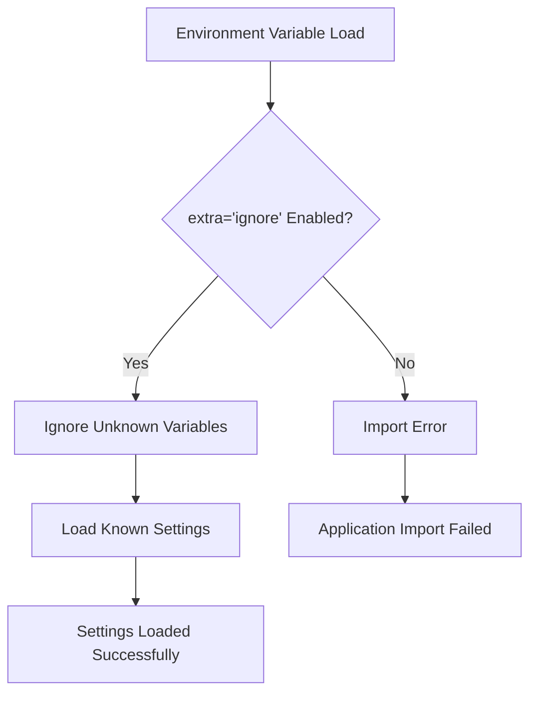

**Diagram sources**
- [config.py:45-52](file://safe4ai-pilot/app/config.py#L45-L52)

### Type Coercion Functions

The configuration system includes robust type coercion with fallback mechanisms:

| Function | Purpose | Fallback Behavior |
|----------|---------|-------------------|
| `_coerce_bool` | Convert various boolean representations | Returns default boolean value |
| `_coerce_int` | Convert numeric strings to integers | Returns default integer value |
| `_coerce_float` | Convert numeric strings to floats | Returns default float value |

### Provider-Specific Validation Rules

**Updated** The system implements enhanced validation for provider configurations with improved embedding model resolution and three-mode compatibility:

- **Provider Type**: Must be `ollama` or `openai_compatible`
- **API Key Requirement**: Required for `openai_compatible` provider
- **Base URL Formatting**: Trailing slashes are automatically removed
- **Model Validation**: Provider-specific model existence checks
- **SSE Mode**: Must be `strict` or `async`
- **Vector Dimension Validation**: Startup validation ensures embedding model compatibility
- **Mode Compatibility**: Validates that selected mode is compatible with provider configuration

### Enhanced Startup Validation

**New** The system now includes comprehensive startup validation for embedding model configurations across all three modes:

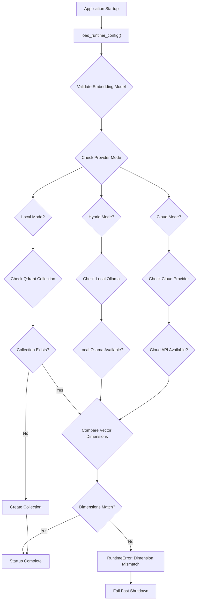

**Diagram sources**
- [main.py:198-245](file://safe4ai-pilot/app/main.py#L198-L245)
- [runtime_config.py:32-34](file://safe4ai-pilot/app/services/runtime_config.py#L32-L34)
- [admin_routes.py:1086-1111](file://safe4ai-pilot/app/api/admin_routes.py#L1086-L1111)

### Enhanced Configuration Validation Flow

**Updated** The system now includes comprehensive rollback functionality in the configuration validation flow with three-mode support:

```mermaid
flowchart TD
Start[Configuration Update] --> ValidateProvider{Validate Provider Type}
ValidateProvider --> |Invalid| Error1[Invalid Provider Type]
ValidateProvider --> |Valid| CheckMode{Check Mode Compatibility}
CheckMode --> |Local| ValidateLocal{Validate Local Ollama}
CheckMode --> |Hybrid| ValidateHybrid{Validate Cloud + Local}
CheckMode --> |Cloud| ValidateCloud{Validate Cloud Provider}
ValidateCloud --> |Missing| Error2[API Key Required]
ValidateCloud --> |Present| ValidateModels{Validate Model Names}
ValidateLocal --> |Available| ValidateRanges{Validate Parameter Ranges}
ValidateLocal --> |Unavailable| Error3[Local Ollama Unavailable]
ValidateHybrid --> |Available| ValidateRanges
ValidateHybrid --> |Unavailable| Error4[Hybrid Mode Requires Local Ollama]
ValidateModels --> |Invalid| Error5[Invalid Model Name]
ValidateModels --> |Valid| ValidateRanges
ValidateRanges --> |Invalid| Error6[Parameter Out of Range]
ValidateRanges --> |Valid| EncryptSensitive{Encrypt Sensitive Data}
EncryptSensitive --> |Success| UpsertConfig[upsert_app_config - commit=False]
EncryptSensitive --> |Failure| Error7[Encryption Failed]
UpsertConfig --> BuildComponents[build_runtime_components]
BuildComponents --> |Success| Commit[db.commit()]
BuildComponents --> |Failure| Rollback[db.rollback()]
Rollback --> Error[HTTPException: Configuration Invalid]
Commit --> ReplaceState[Replace app.state Components]
ReplaceState --> Success[Configuration Applied]
```

### Three-Mode Specific Validation

**New** The system includes mode-specific validation rules:

- **Local Mode**: Validates that local Ollama is available and all models are accessible
- **Hybrid Mode**: Validates that cloud provider is reachable and local Ollama is available for embeddings
- **Cloud Mode**: Validates that cloud provider supports embeddings API and all models are available

**Section sources**
- [config.py:45-52](file://safe4ai-pilot/app/config.py#L45-L52)
- [runtime_config.py:57-87](file://safe4ai-pilot/app/services/runtime_config.py#L57-L87)
- [admin_routes.py:1045-1081](file://safe4ai-pilot/app/api/admin_routes.py#L1045-L1081)
- [main.py:198-245](file://safe4ai-pilot/app/main.py#L198-L245)

## Performance Considerations

The Runtime Configuration System is designed for optimal performance and reliability with three-mode support:

### Caching Strategy

- **Configuration Cache**: Loaded once per application lifecycle using load_runtime_config()
- **Component Reuse**: Runtime components are reused until configuration changes
- **Database Optimization**: Efficient query patterns for configuration retrieval
- **Provider Connection Pooling**: Reused HTTP client connections for external APIs

### Memory Management

- **Immutable Configuration**: RuntimeConfig objects are frozen dataclasses
- **Thread Safety**: Configuration loading is thread-safe
- **Resource Cleanup**: Proper cleanup of external service connections
- **Encryption Caching**: Fernet cipher instances are cached for performance

### Scalability Features

- **Hot Reloading**: Configuration changes apply without restarts
- **Graceful Degradation**: Fallback to defaults during validation failures
- **Asynchronous Operations**: Non-blocking configuration updates
- **Provider Connection Resilience**: Fallback mechanisms for external API failures

### Three-Mode Performance Benefits

**New** The three-mode architecture provides several performance improvements:

- **Local Mode**: Eliminates network latency for all operations
- **Hybrid Mode**: Reduces cloud costs by keeping embeddings local
- **Cloud Mode**: Leverages cloud provider optimization for chat operations
- **Flexible Scaling**: Allows administrators to optimize for cost, performance, or privacy

### Enhanced Transaction Management

**New** The system now includes robust transaction management for configuration updates:

- **Atomic Operations**: Configuration changes are committed as atomic transactions
- **Automatic Rollback**: Failed component rebuilds trigger automatic database rollback
- **Consistent State**: Prevents partial configuration updates that could cause system instability
- **Error Recovery**: Clear error messages and rollback ensure system recovery

### Enhanced Environment Variable Performance

**New** The extra='ignore' configuration improves performance by:

- **Reduced Import Time**: No need to validate every environment variable during import
- **Improved Development Experience**: Environment variable conflicts no longer cause startup failures
- **Better Docker Integration**: Seamless integration with Docker Compose environment variables
- **Future-Proof Configuration**: Ability to add new environment variables without breaking changes

## Troubleshooting Guide

### Common Issues and Solutions

**Updated** The system now includes enhanced troubleshooting guidance for three-mode configuration issues, embedding model configuration problems, scoring system problems, rollback functionality, and environment variable conflicts:

| Issue | Symptoms | Solution |
|-------|----------|----------|
| **Provider Connection Failure** | "Provider not reachable" or "Connection failed" | Verify base URL, network connectivity, and API key for OpenAI-compatible providers |
| **API Key Authentication Error** | "providerApiKey is required for openai_compatible" | Provide valid API key for OpenAI-compatible provider mode |
| **Model Validation Failures** | Error: Model not available in provider | Check provider service status and model availability |
| **Configuration Not Applying** | Changes have no effect | Verify database connectivity and permissions |
| **Range Validation Errors** | Error: Parameter out of range | Adjust parameter values within allowed ranges |
| **Component Build Failures** | Runtime errors after configuration change | Check external service connectivity (Ollama, OpenAI-compatible API, Qdrant) |
| **Vector Dimension Mismatch** | "Qdrant collection has vector size X but embedding model requires Y" | Drop and recreate Qdrant collection with correct vector size |
| **Score Threshold Too High/Low** | Unexpected fallbacks or no fallbacks | Adjust score_floor configuration in 0.05 increments |
| **Transaction Rollback Errors** | Configuration changes appear to fail silently | Check database logs for rollback events and underlying component build errors |
| **Three-Mode Configuration Issues** | Mode-specific errors or unexpected behavior | Verify mode compatibility and required services are available |
| **Hybrid Mode Problems** | "Hybrid mode requires local Ollama for embeddings" | Start local Ollama instance and ensure embedding model is available |
| **Vision Model Issues** | "qwen3.5:9b not available" | Ensure qwen3.5:9b is pulled in Ollama and available for vision tasks |
| **Environment Variable Conflicts** | "Import failed" or startup errors with Docker Compose variables | Verify extra='ignore' configuration is active and environment variables are properly formatted |
| **Development Environment Instability** | Frequent import failures or configuration loading issues | Check that Docker Compose environment variables are compatible with application settings |

### Debugging Steps

1. **Verify Database Connection**: Ensure PostgreSQL is accessible
2. **Test Provider Connectivity**: Use `/settings/provider/test` endpoint to validate provider configuration
3. **Check External Services**: Confirm Ollama or OpenAI-compatible API is running
4. **Validate Configuration Syntax**: Use API endpoints to test configuration values
5. **Monitor Logs**: Check application logs for detailed error messages and rollback events
6. **Check Embedding Model Compatibility**: Verify vector dimensions match Qdrant collection configuration
7. **Test Scoring Threshold**: Use test queries to verify score_floor effectiveness
8. **Examine Transaction State**: Verify that failed updates trigger automatic rollback
9. **Validate Three-Mode Compatibility**: Ensure selected mode is compatible with provider configuration
10. **Check Service Dependencies**: Verify all required services are available for selected mode
11. **Verify Vision Model Availability**: Ensure qwen3.5:9b is properly pulled and available in Ollama
12. **Environment Variable Debugging**: Check that extra='ignore' is properly configured and Docker Compose variables are compatible

### Recovery Procedures

- **Rollback Configuration**: Restore previous working configuration from audit logs
- **Reset to Defaults**: Remove problematic configuration entries
- **Provider Health Check**: Use test endpoint to validate provider connectivity
- **Vector Dimension Reset**: Drop and recreate Qdrant collection with correct embedding model
- **Score Threshold Adjustment**: Fine-tune score_floor value based on performance metrics
- **Service Restart**: As last resort, restart application services
- **Transaction Recovery**: Monitor database for rolled back transactions and retry failed updates
- **Mode Switching**: Temporarily switch to a different mode to isolate configuration issues
- **Dependency Validation**: Verify all required services are available for selected three-mode
- **Vision Model Verification**: Ensure qwen3.5:9b is properly pulled and available in Ollama
- **Environment Variable Resolution**: Remove conflicting Docker Compose variables or adjust application settings
- **Development Environment Fix**: Ensure Docker Compose environment variables are compatible with application Settings model

## Conclusion

The Runtime Configuration System provides a robust, flexible foundation for managing AI application configurations with unprecedented three-mode provider support. Its hierarchical approach to configuration management, combined with comprehensive validation and hot-reloading capabilities, enables administrators to optimize AI performance and user experience in real-time across three distinct operational modes.

**Updated** The revolutionary three-mode provider architecture introduces a paradigm shift in AI deployment flexibility. The new embedding_source field and provider_mode property replace single-provider configuration with three distinct modes: Local (everything on Ollama), Hybrid (cloud LLM with local embeddings), and Cloud (everything on cloud provider). This system provides administrators with unprecedented control over privacy, performance, and cost optimization.

The system operates on a hierarchical configuration model where environment variables serve as defaults, database-stored overrides provide persistent settings, and runtime components are rebuilt automatically when changes occur. This architecture supports dynamic scaling, A/B testing capabilities, and operational flexibility for AI-powered applications.

**Enhanced** The system now features improved embedding model resolution with startup validation processes that use load_runtime_config() instead of the deprecated load_app_config(). This change ensures correct embedding model selection during application startup and prevents silent failures with incorrect model configurations through comprehensive vector dimension validation.

**New** The integration of the deterministic scoring system represents a significant architectural improvement. By passing the score_floor value from runtime configuration as rerank_threshold and implementing score-based document filtering, the system achieves predictable performance while reducing computational overhead. The simplified routing logic with synchronous fallback rules eliminates the complexity of LLM-based adaptive routing, resulting in more reliable and faster responses.

**Enhanced** The comprehensive rollback functionality ensures system reliability by automatically handling database transaction rollback when runtime component rebuilding fails. This enhancement prevents partial configuration updates and maintains system consistency, providing administrators with confidence that configuration changes are either fully applied or completely reverted.

**Updated** The system has undergone a major model standardization effort replacing qwen2.5vl:7b with qwen3.5:9b throughout the system. This change affects runtime configuration, settings service, provider clients, and documentation files. The new qwen3.5:9b model provides improved performance and capabilities, requiring updated hardware requirements and deployment considerations. All references to the old vision model have been systematically updated to reflect the new qwen3.5:9b standard.

**Enhanced** The addition of extra='ignore' configuration in the Pydantic Settings model significantly improves development environment stability by resolving conflicts between application settings and Docker Compose environment variables. This enhancement prevents import failures and startup errors that could occur when Docker Compose defines variables not used by the application, making the development experience more reliable and predictable.

The system's modular architecture supports future enhancements, including advanced A/B testing capabilities, automated configuration management, and integration with external configuration management systems. The comprehensive error handling and validation mechanisms ensure system stability while maintaining operational flexibility across all three modes.

Through careful design and implementation, this system delivers the operational excellence required for production AI applications while maintaining ease of use for administrators and developers alike. The three-mode architecture provides the ultimate balance between privacy, performance, and cost-effectiveness in AI-powered applications.