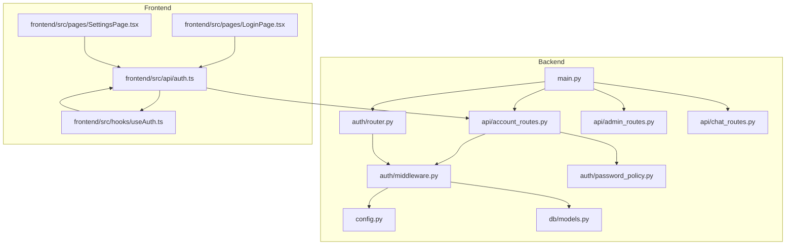
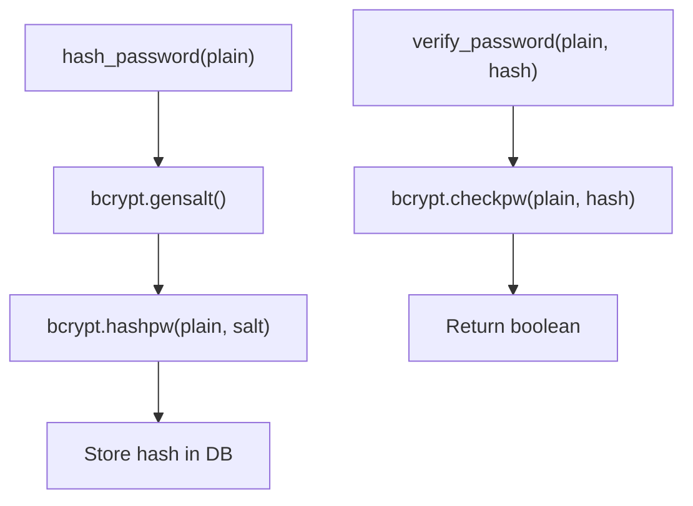
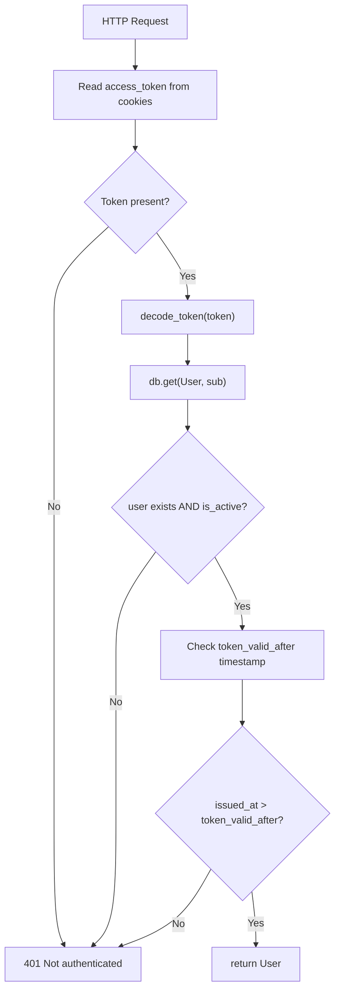
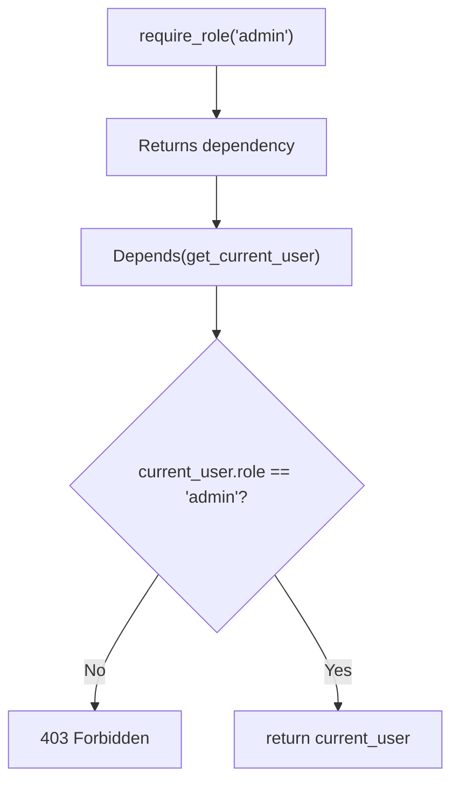
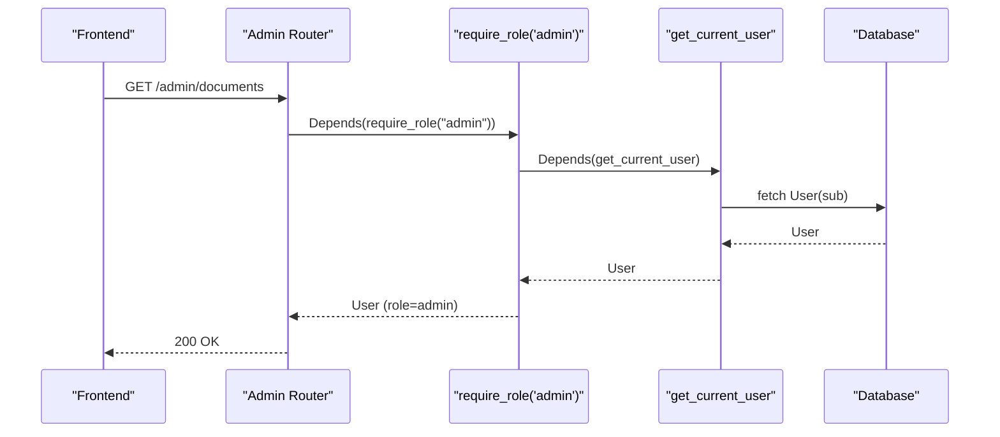
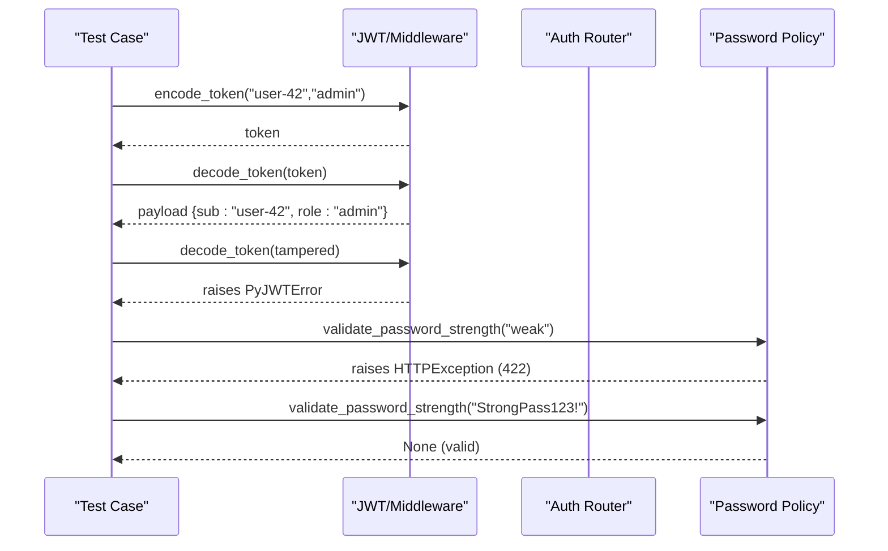
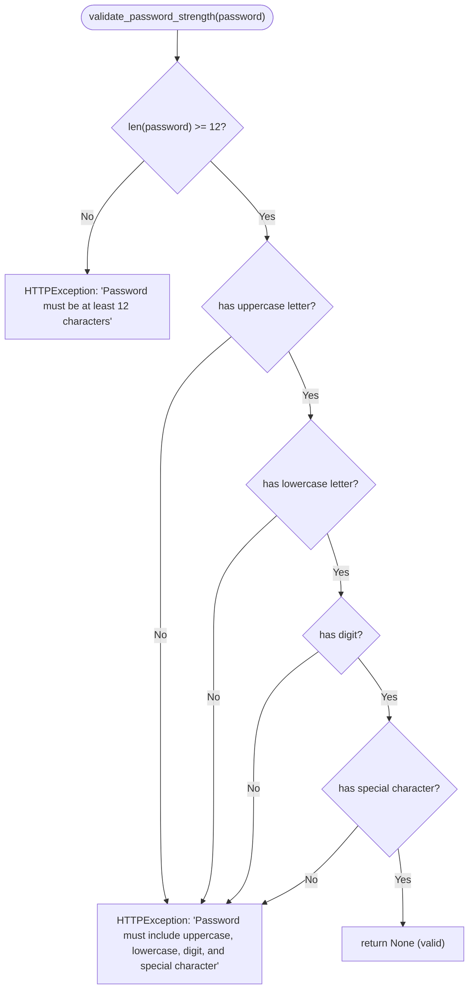
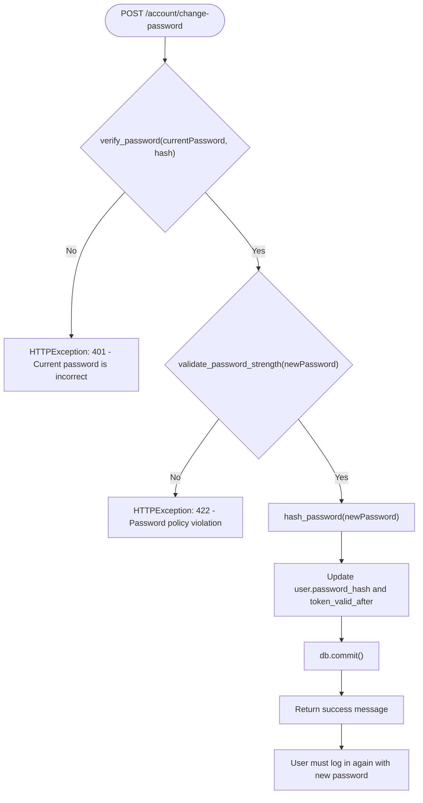
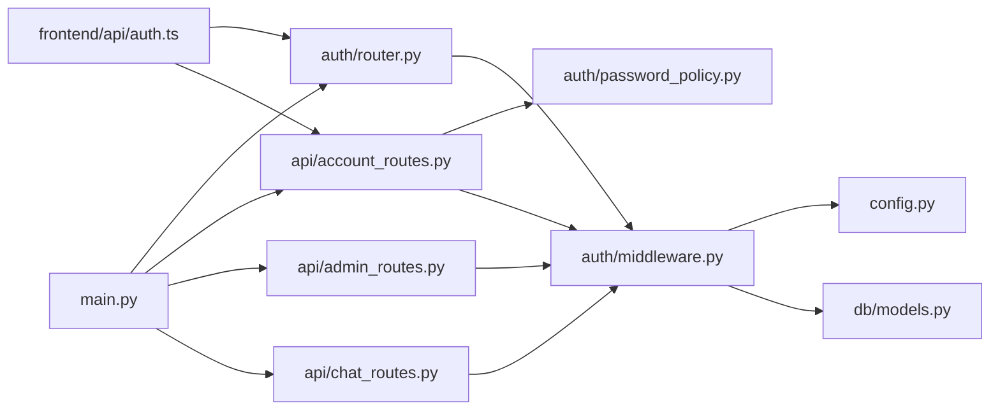

# Authentication Middleware

<cite>
**Referenced Files in This Document**
- [middleware.py](file://safe4ai-pilot/app/auth/middleware.py)
- [router.py](file://safe4ai-pilot/app/auth/router.py)
- [password_policy.py](file://safe4ai-pilot/app/auth/password_policy.py)
- [models.py](file://safe4ai-pilot/app/db/models.py)
- [config.py](file://safe4ai-pilot/app/config.py)
- [main.py](file://safe4ai-pilot/app/main.py)
- [admin_routes.py](file://safe4ai-pilot/app/api/admin_routes.py)
- [chat_routes.py](file://safe4ai-pilot/app/api/chat_routes.py)
- [account_routes.py](file://safe4ai-pilot/app/api/account_routes.py)
- [auth.ts](file://safe4ai-pilot/frontend/src/api/auth.ts)
- [useAuth.ts](file://safe4ai-pilot/frontend/src/hooks/useAuth.ts)
- [LoginPage.tsx](file://safe4ai-pilot/frontend/src/pages/LoginPage.tsx)
- [SettingsPage.tsx](file://safe4ai-pilot/frontend/src/pages/SettingsPage.tsx)
- [test_auth.py](file://safe4ai-pilot/tests/test_auth.py)
- [test_account.py](file://safe4ai-pilot/tests/test_account.py)
</cite>

## Update Summary
**Changes Made**
- Added password policy enforcement module with strict 12-character requirements
- Enhanced session management with token invalidation after password changes
- Integrated password policy validation into account settings functionality
- Updated middleware to handle token revocation based on token_valid_after timestamps
- Added comprehensive password validation for both login and account management flows

## Table of Contents
1. [Introduction](#introduction)
2. [Project Structure](#project-structure)
3. [Core Components](#core-components)
4. [Architecture Overview](#architecture-overview)
5. [Detailed Component Analysis](#detailed-component-analysis)
6. [Password Policy Enforcement](#password-policy-enforcement)
7. [Enhanced Session Management](#enhanced-session-management)
8. [Dependency Analysis](#dependency-analysis)
9. [Performance Considerations](#performance-considerations)
10. [Troubleshooting Guide](#troubleshooting-guide)
11. [Conclusion](#conclusion)

## Introduction
This document explains the authentication middleware system, focusing on JWT token creation and validation, password hashing with bcrypt, cookie-based session management, and role-based access control (RBAC). The system now includes enhanced password policy enforcement with strict requirements (minimum 12 characters with uppercase, lowercase, digit, and special character) and improved session management with token invalidation after password changes. It also covers the get_current_user dependency injection pattern, require_role decorator, and practical examples with security considerations such as token storage, refresh mechanisms, and logout procedures.

## Project Structure
The authentication system spans backend Python modules and frontend React hooks:
- Backend: JWT utilities, login/logout router, password policy enforcement, user roles, configuration, and FastAPI integration
- Frontend: Login page, authentication hooks, Settings page with password validation, and API clients for authentication and account management



**Diagram sources**
- [middleware.py:1-110](file://safe4ai-pilot/app/auth/middleware.py#L1-L110)
- [router.py:1-181](file://safe4ai-pilot/app/auth/router.py#L1-L181)
- [password_policy.py:1-18](file://safe4ai-pilot/app/auth/password_policy.py#L1-L18)
- [account_routes.py:1-142](file://safe4ai-pilot/app/api/account_routes.py#L1-L142)
- [config.py:1-48](file://safe4ai-pilot/app/config.py#L1-L48)
- [models.py:52-64](file://safe4ai-pilot/app/db/models.py#L52-L64)
- [main.py:1-154](file://safe4ai-pilot/app/main.py#L1-L154)
- [admin_routes.py:1-200](file://safe4ai-pilot/app/api/admin_routes.py#L1-L200)
- [chat_routes.py:1-200](file://safe4ai-pilot/app/api/chat_routes.py#L1-L200)
- [auth.ts:1-17](file://safe4ai-pilot/frontend/src/api/auth.ts#L1-L17)
- [useAuth.ts:1-28](file://safe4ai-pilot/frontend/src/hooks/useAuth.ts#L1-L28)
- [LoginPage.tsx:1-165](file://safe4ai-pilot/frontend/src/pages/LoginPage.tsx#L1-L165)
- [SettingsPage.tsx:664-672](file://safe4ai-pilot/frontend/src/pages/SettingsPage.tsx#L664-L672)

**Section sources**
- [main.py:98-101](file://safe4ai-pilot/app/main.py#L98-L101)
- [router.py:24-33](file://safe4ai-pilot/app/auth/router.py#L24-L33)
- [models.py:52-64](file://safe4ai-pilot/app/db/models.py#L52-L64)

## Core Components
- JWT utilities: encode/decode tokens, bcrypt password hashing/verification
- Authentication router: login (cookie-based), logout (clear cookie)
- Password policy enforcement: strict validation with 12+ character requirements
- Enhanced session management: token invalidation after password changes
- RBAC: require_role decorator and get_current_user dependency
- User model: roles, activity flag, lockout fields, and token_valid_after timestamp
- Configuration: secret key and HTTPS enforcement
- Frontend integration: login flow, Settings page with password validation, and user session state

**Section sources**
- [middleware.py:25-48](file://safe4ai-pilot/app/auth/middleware.py#L25-L48)
- [router.py:39-105](file://safe4ai-pilot/app/auth/router.py#L39-L105)
- [password_policy.py:6-18](file://safe4ai-pilot/app/auth/password_policy.py#L6-L18)
- [models.py:21-24](file://safe4ai-pilot/app/db/models.py#L21-L24)
- [models.py:52-64](file://safe4ai-pilot/app/db/models.py#L52-L64)
- [config.py:13-15](file://safe4ai-pilot/app/config.py#L13-L15)

## Architecture Overview
The system uses HTTP-only cookies to store JWTs, enforcing SameSite strict and optional secure transport. Tokens carry user_id and role claims, validated centrally via middleware with enhanced security features including token revocation after password changes. Password policy enforcement ensures strong credentials, while RBAC is enforced per-route using a decorator that depends on get_current_user.

```mermaid
sequenceDiagram
participant FE as "Frontend"
participant API as "Auth Router (/auth)"
participant ACC as "Account Router (/account)"
participant PP as "Password Policy"
participant MW as "JWT/Middleware"
participant DB as "Database"
participant CFG as "Config"
FE->>API : POST /auth/login {email,password}
API->>CFG : read secret_key
API->>DB : lookup user by email
API->>MW : verify_password(password, hash)
API->>MW : encode_token(user_id, role)
MW-->>API : signed JWT
API->>FE : Set-Cookie access_token=JWT; HttpOnly; SameSite=Strict; Secure=settings.enforce_https
FE->>ACC : POST /account/change-password {currentPassword,newPassword}
ACC->>PP : validate_password_strength(newPassword)
PP-->>ACC : validation result
ACC->>DB : verify current password
ACC->>DB : update password_hash
ACC->>DB : set token_valid_after
ACC-->>FE : success message
FE->>API : GET /me or protected route
API->>MW : get_current_user()
MW->>FE : Cookie access_token
MW->>MW : decode_token(JWT)
MW->>DB : fetch User by sub
MW->>MW : check token_valid_after timestamp
MW-->>API : User (or 401 if revoked)
API-->>FE : 200 OK or 401/403
```

**Diagram sources**
- [router.py:70-148](file://safe4ai-pilot/app/auth/router.py#L70-L148)
- [account_routes.py:125-141](file://safe4ai-pilot/app/api/account_routes.py#L125-L141)
- [password_policy.py:6-18](file://safe4ai-pilot/app/auth/password_policy.py#L6-L18)
- [middleware.py:52-96](file://safe4ai-pilot/app/auth/middleware.py#L52-L96)
- [config.py:13-15](file://safe4ai-pilot/app/config.py#L13-L15)
- [models.py:52-64](file://safe4ai-pilot/app/db/models.py#L52-L64)

## Detailed Component Analysis

### JWT Token Creation and Validation
- Payload includes subject (user_id), role, issued-at, and expiration (configurable hours).
- Signing uses HS256 with a secret key from configuration.
- Decoding validates signature and algorithm; invalid tokens raise an error handled as unauthorized.


**Diagram sources**
- [middleware.py:35-48](file://safe4ai-pilot/app/auth/middleware.py#L35-L48)
- [config.py:13-15](file://safe4ai-pilot/app/config.py#L13-L15)

**Section sources**
- [middleware.py:35-48](file://safe4ai-pilot/app/auth/middleware.py#L35-L48)

### Password Hashing with bcrypt
- Plain passwords are hashed using bcrypt salt generation.
- Verification compares plain input against stored hash using bcrypt check.



**Diagram sources**
- [middleware.py:25-32](file://safe4ai-pilot/app/auth/middleware.py#L25-L32)

**Section sources**
- [middleware.py:25-32](file://safe4ai-pilot/app/auth/middleware.py#L25-L32)

### Cookie-Based Authentication Flow
- Login sets an HTTP-only, SameSite=Strict cookie named access_token with configurable max age.
- Logout clears the cookie by setting max-age=0.
- The cookie is automatically sent with subsequent requests to protected endpoints.

```mermaid
sequenceDiagram
participant FE as "Frontend"
participant API as "Auth Router"
participant CFG as "Config"
FE->>API : POST /auth/login
API->>CFG : read enforce_https
API-->>FE : Set-Cookie : access_token=JWT; HttpOnly; SameSite=Strict; Secure=enforce_https
FE->>API : Subsequent requests
API-->>FE : 200 OK (authenticated)
FE->>API : POST /auth/logout
API-->>FE : Set-Cookie : access_token=; Max-Age=0
```

**Diagram sources**
- [router.py:151-180](file://safe4ai-pilot/app/auth/router.py#L151-L180)
- [config.py:15-15](file://safe4ai-pilot/app/config.py#L15-L15)

**Section sources**
- [router.py:151-180](file://safe4ai-pilot/app/auth/router.py#L151-L180)

### get_current_user Dependency Injection Pattern
- Extracts access_token from cookies.
- Validates token signature and decodes payload.
- Loads User by sub (user_id) from DB and ensures is_active.
- **Updated**: Checks token_valid_after timestamp to prevent token reuse after password changes.



**Diagram sources**
- [middleware.py:52-96](file://safe4ai-pilot/app/auth/middleware.py#L52-L96)

**Section sources**
- [middleware.py:52-96](file://safe4ai-pilot/app/auth/middleware.py#L52-L96)

### require_role Decorator for RBAC
- Returns a dependency that enforces a specific role.
- Internally depends on get_current_user; denies access if roles differ.



**Diagram sources**
- [middleware.py:99-110](file://safe4ai-pilot/app/auth/middleware.py#L99-L110)

**Section sources**
- [middleware.py:99-110](file://safe4ai-pilot/app/auth/middleware.py#L99-L110)

### Protected Routes Using RBAC
- Admin-only endpoints depend on require_role("admin").
- Chat endpoints depend on get_current_user for basic auth.



**Diagram sources**
- [admin_routes.py:123-129](file://safe4ai-pilot/app/api/admin_routes.py#L123-L129)
- [middleware.py:99-110](file://safe4ai-pilot/app/auth/middleware.py#L99-L110)
- [middleware.py:52-96](file://safe4ai-pilot/app/auth/middleware.py#L52-L96)

**Section sources**
- [admin_routes.py:123-129](file://safe4ai-pilot/app/api/admin_routes.py#L123-L129)
- [chat_routes.py:115-122](file://safe4ai-pilot/app/api/chat_routes.py#L115-L122)

### Practical Examples and Usage Patterns
- Token encode/decode: see unit tests for payload assertions and tampering rejection.
- User session management: login sets cookie; logout clears cookie; frontend hooks invalidate queries after logout.
- Authentication error handling: unauthorized on missing/invalid token; forbidden on insufficient role.
- Password policy validation: see unit tests for password strength requirements.



**Diagram sources**
- [test_auth.py:199-213](file://safe4ai-pilot/tests/test_auth.py#L199-L213)
- [password_policy.py:6-18](file://safe4ai-pilot/app/auth/password_policy.py#L6-L18)
- [middleware.py:35-48](file://safe4ai-pilot/app/auth/middleware.py#L35-L48)

**Section sources**
- [test_auth.py:67-86](file://safe4ai-pilot/tests/test_auth.py#L67-L86)
- [test_auth.py:149-156](file://safe4ai-pilot/tests/test_auth.py#L149-L156)
- [test_auth.py:199-213](file://safe4ai-pilot/tests/test_auth.py#L199-L213)
- [test_account.py:173-190](file://safe4ai-pilot/tests/test_account.py#L173-L190)

## Password Policy Enforcement

### Password Strength Requirements
The system now enforces strict password policies through the `validate_password_strength()` function:

- **Minimum Length**: 12 characters (enforced via `_MIN_PASSWORD_LENGTH = 12`)
- **Complexity Requirements**: Must contain uppercase, lowercase, digit, and special character
- **Validation Logic**: Checks each requirement individually and raises HTTPException with specific error messages



**Diagram sources**
- [password_policy.py:6-18](file://safe4ai-pilot/app/auth/password_policy.py#L6-L18)

**Section sources**
- [password_policy.py:6-18](file://safe4ai-pilot/app/auth/password_policy.py#L6-L18)
- [router.py:32-32](file://safe4ai-pilot/app/auth/router.py#L32-L32)

### Integration Points
Password policy enforcement is integrated at multiple points:

1. **Login Endpoint**: Uses `_MIN_PASSWORD_LENGTH` constant for initial validation
2. **Account Settings**: Validates new passwords during change-password operations
3. **Admin User Creation**: Enforces password policy when creating new users

**Section sources**
- [router.py:32-32](file://safe4ai-pilot/app/auth/router.py#L32-L32)
- [account_routes.py:137-137](file://safe4ai-pilot/app/api/account_routes.py#L137-L137)

## Enhanced Session Management

### Token Invalidation After Password Changes
The system now implements enhanced session management with automatic token invalidation:

- **token_valid_after Field**: Added to User model to track when tokens become invalid
- **Password Change Process**: Updates token_valid_after timestamp upon successful password change
- **Token Validation**: get_current_user checks if token was issued after token_valid_after



**Diagram sources**
- [account_routes.py:125-141](file://safe4ai-pilot/app/api/account_routes.py#L125-L141)

**Section sources**
- [account_routes.py:125-141](file://safe4ai-pilot/app/api/account_routes.py#L125-L141)
- [models.py:63-63](file://safe4ai-pilot/app/db/models.py#L63-L63)
- [middleware.py:82-96](file://safe4ai-pilot/app/auth/middleware.py#L82-L96)

### Token Revocation Mechanism
The middleware implements a sophisticated token revocation system:

- **Timestamp Comparison**: Compares token issuance time with user's token_valid_after timestamp
- **Time Zone Handling**: Properly handles timezone-aware timestamps
- **Security Enhancement**: Prevents token reuse after password changes or security events

**Section sources**
- [middleware.py:82-96](file://safe4ai-pilot/app/auth/middleware.py#L82-L96)
- [models.py:63-63](file://safe4ai-pilot/app/db/models.py#L63-L63)

## Dependency Analysis
- Auth router depends on middleware for token encoding/verification and bcrypt.
- Password policy module provides centralized validation logic for all password operations.
- Account routes integrate password policy validation and token invalidation.
- Middleware depends on configuration for secret key and DB session for user lookup.
- API routers depend on middleware for RBAC and user extraction.
- Frontend depends on auth router endpoints and exposes hooks to manage session state.



**Diagram sources**
- [router.py:14-17](file://safe4ai-pilot/app/auth/router.py#L14-L17)
- [password_policy.py:1-18](file://safe4ai-pilot/app/auth/password_policy.py#L1-L18)
- [account_routes.py:11-12](file://safe4ai-pilot/app/api/account_routes.py#L11-L12)
- [middleware.py:15-17](file://safe4ai-pilot/app/auth/middleware.py#L15-L17)
- [models.py:52-64](file://safe4ai-pilot/app/db/models.py#L52-L64)
- [main.py:98-101](file://safe4ai-pilot/app/main.py#L98-L101)
- [admin_routes.py:20-21](file://safe4ai-pilot/app/api/admin_routes.py#L20-L21)
- [chat_routes.py:19-22](file://safe4ai-pilot/app/api/chat_routes.py#L19-L22)

**Section sources**
- [main.py:98-101](file://safe4ai-pilot/app/main.py#L98-L101)
- [router.py:14-17](file://safe4ai-pilot/app/auth/router.py#L14-L17)
- [password_policy.py:1-18](file://safe4ai-pilot/app/auth/password_policy.py#L1-L18)
- [account_routes.py:11-12](file://safe4ai-pilot/app/api/account_routes.py#L11-L12)
- [middleware.py:15-17](file://safe4ai-pilot/app/auth/middleware.py#L15-L17)

## Performance Considerations
- Token lifetime: Configurable hours provide flexible session duration with periodic re-authentication.
- Rate limiting: Login endpoint is rate-limited to reduce brute-force attempts.
- Password hashing: bcrypt cost is implicit in gensalt/checkpw; acceptable for server-side hashing.
- Password policy validation: Minimal computational overhead with early exit conditions.
- Token invalidation: Efficient timestamp comparison prevents unnecessary database queries.
- Cookie attributes: HttpOnly and SameSite=Strict mitigate XSS and CSRF risks.

## Troubleshooting Guide
Common issues and resolutions:
- Invalid credentials: short passwords (< 12 characters) are rejected server-side; ensure client respects the minimum.
- Password policy violations: new passwords must meet complexity requirements; check frontend validation matches backend.
- Account locked: excessive failed attempts lock the account for a period; wait or contact support.
- Not authenticated: missing or invalid access_token leads to 401; verify cookie presence and validity.
- Token revoked: if password changed recently, old tokens are automatically invalidated; user must log in again.
- Forbidden: insufficient role leads to 403; ensure user has required role.
- Logout not clearing session: confirm cookie is cleared by checking Set-Cookie header in response.

**Section sources**
- [router.py:48-49](file://safe4ai-pilot/app/auth/router.py#L48-L49)
- [router.py:53-66](file://safe4ai-pilot/app/auth/router.py#L53-L66)
- [password_policy.py:7-17](file://safe4ai-pilot/app/auth/password_policy.py#L7-L17)
- [middleware.py:82-96](file://safe4ai-pilot/app/auth/middleware.py#L82-L96)
- [test_auth.py:119-141](file://safe4ai-pilot/tests/test_auth.py#L119-L141)
- [test_auth.py:149-156](file://safe4ai-pilot/tests/test_auth.py#L149-L156)
- [test_account.py:173-190](file://safe4ai-pilot/tests/test_account.py#L173-L190)

## Conclusion
The authentication middleware provides a robust, cookie-based JWT system with bcrypt password hashing, configurable token expiry, and enhanced security through password policy enforcement and token invalidation. The system now enforces strict password requirements (minimum 12 characters with uppercase, lowercase, digit, and special character) and automatically invalidates tokens after password changes. The get_current_user dependency and require_role decorator enable clean, reusable authentication and authorization patterns across routes. The frontend integrates seamlessly with login/logout endpoints, Settings page with password validation, and maintains session state via hooks. This enhanced system provides comprehensive security while maintaining usability and performance.