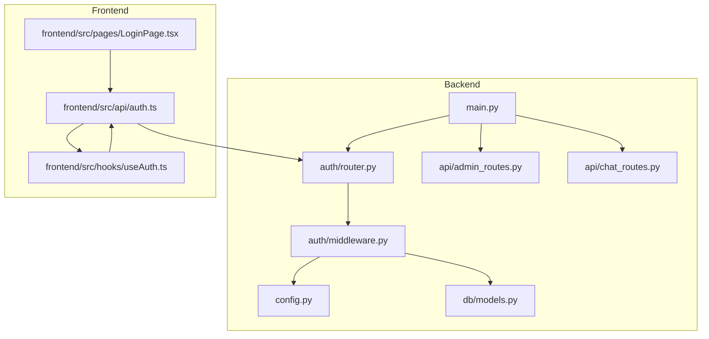
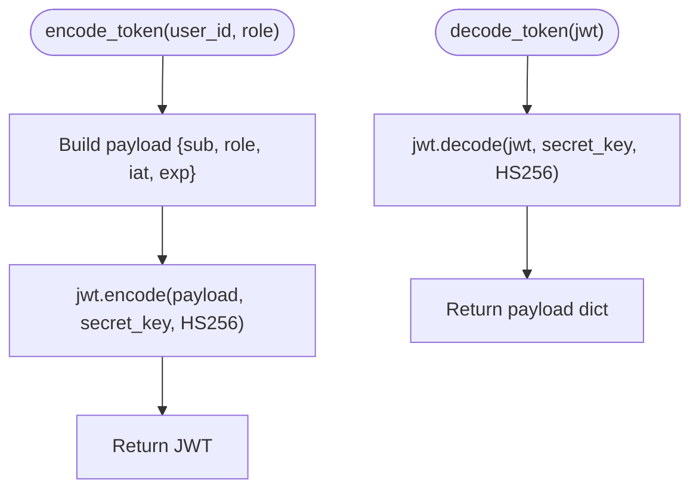
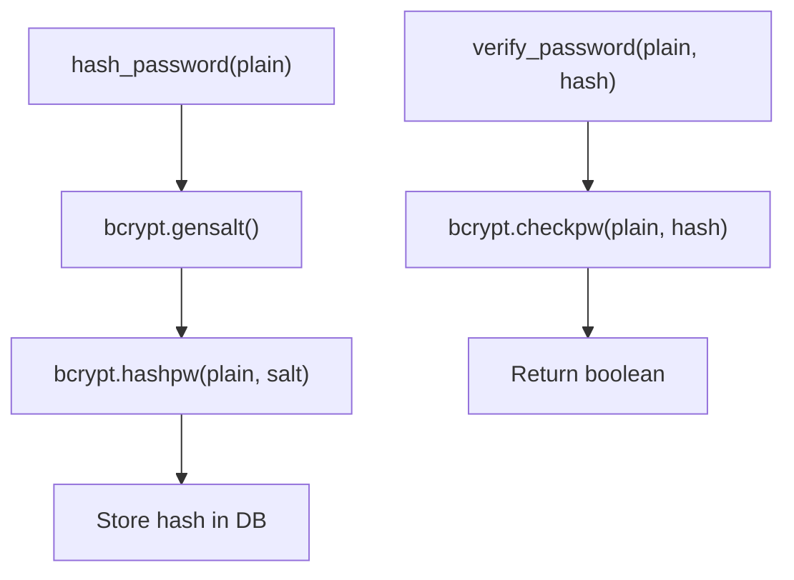
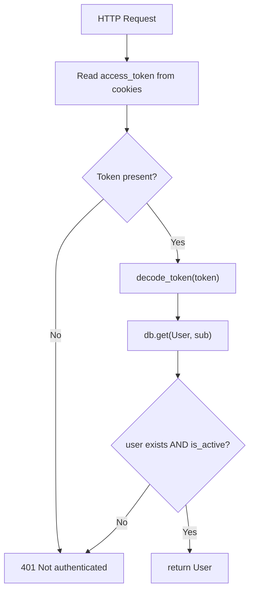
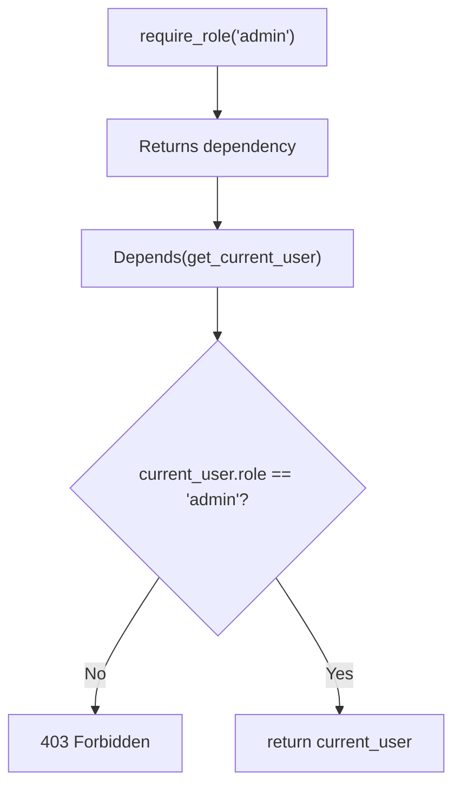
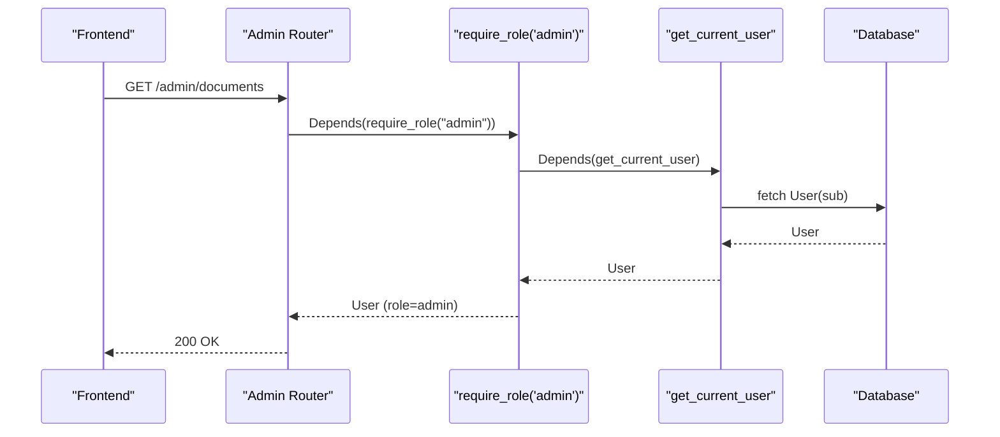
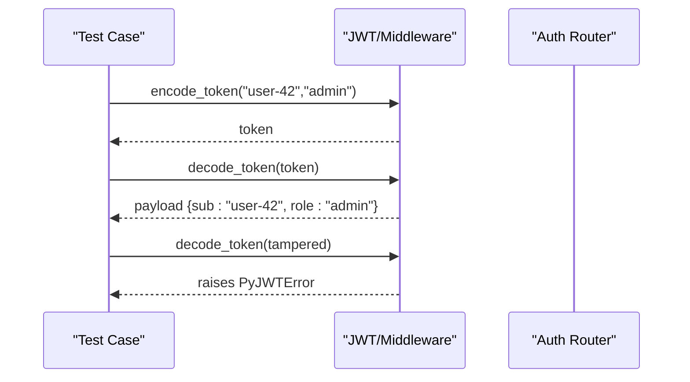
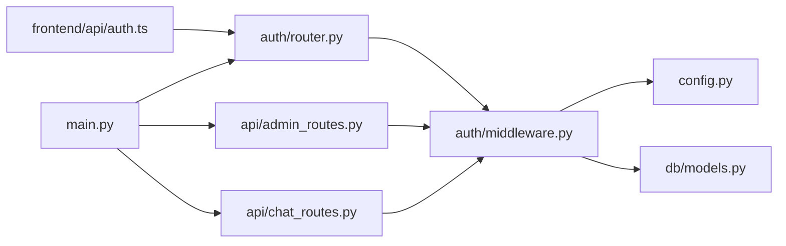

# Authentication Middleware

<cite>
**Referenced Files in This Document**
- [middleware.py](file://safe4ai-pilot/app/auth/middleware.py)
- [router.py](file://safe4ai-pilot/app/auth/router.py)
- [models.py](file://safe4ai-pilot/app/db/models.py)
- [config.py](file://safe4ai-pilot/app/config.py)
- [main.py](file://safe4ai-pilot/app/main.py)
- [admin_routes.py](file://safe4ai-pilot/app/api/admin_routes.py)
- [chat_routes.py](file://safe4ai-pilot/app/api/chat_routes.py)
- [auth.ts](file://safe4ai-pilot/frontend/src/api/auth.ts)
- [useAuth.ts](file://safe4ai-pilot/frontend/src/hooks/useAuth.ts)
- [LoginPage.tsx](file://safe4ai-pilot/frontend/src/pages/LoginPage.tsx)
- [test_auth.py](file://safe4ai-pilot/tests/test_auth.py)
</cite>

## Table of Contents
1. [Introduction](#introduction)
2. [Project Structure](#project-structure)
3. [Core Components](#core-components)
4. [Architecture Overview](#architecture-overview)
5. [Detailed Component Analysis](#detailed-component-analysis)
6. [Dependency Analysis](#dependency-analysis)
7. [Performance Considerations](#performance-considerations)
8. [Troubleshooting Guide](#troubleshooting-guide)
9. [Conclusion](#conclusion)

## Introduction
This document explains the authentication middleware system, focusing on JWT token creation and validation, password hashing with bcrypt, cookie-based session management, and role-based access control (RBAC). It also covers the get_current_user dependency injection pattern and the require_role decorator, along with practical examples and security considerations such as token storage, refresh mechanisms, and logout procedures.

## Project Structure
The authentication system spans backend Python modules and frontend React hooks:
- Backend: JWT utilities, login/logout router, user roles, configuration, and FastAPI integration
- Frontend: Login page, authentication hooks, and API clients for login/logout and user info



**Diagram sources**
- [middleware.py:1-83](file://safe4ai-pilot/app/auth/middleware.py#L1-L83)
- [router.py:1-125](file://safe4ai-pilot/app/auth/router.py#L1-L125)
- [config.py:1-48](file://safe4ai-pilot/app/config.py#L1-L48)
- [models.py:52-62](file://safe4ai-pilot/app/db/models.py#L52-L62)
- [main.py:1-154](file://safe4ai-pilot/app/main.py#L1-L154)
- [admin_routes.py:1-200](file://safe4ai-pilot/app/api/admin_routes.py#L1-L200)
- [chat_routes.py:1-200](file://safe4ai-pilot/app/api/chat_routes.py#L1-L200)
- [auth.ts:1-17](file://safe4ai-pilot/frontend/src/api/auth.ts#L1-L17)
- [useAuth.ts:1-28](file://safe4ai-pilot/frontend/src/hooks/useAuth.ts#L1-L28)
- [LoginPage.tsx:1-165](file://safe4ai-pilot/frontend/src/pages/LoginPage.tsx#L1-L165)

**Section sources**
- [main.py:98-101](file://safe4ai-pilot/app/main.py#L98-L101)
- [router.py:24-31](file://safe4ai-pilot/app/auth/router.py#L24-L31)
- [models.py:52-62](file://safe4ai-pilot/app/db/models.py#L52-L62)

## Core Components
- JWT utilities: encode/decode tokens, bcrypt password hashing/verification
- Authentication router: login (cookie-based), logout (clear cookie)
- RBAC: require_role decorator and get_current_user dependency
- User model: roles, activity flag, and lockout fields
- Configuration: secret key and HTTPS enforcement
- Frontend integration: login flow and user session state

**Section sources**
- [middleware.py:25-48](file://safe4ai-pilot/app/auth/middleware.py#L25-L48)
- [router.py:39-105](file://safe4ai-pilot/app/auth/router.py#L39-L105)
- [models.py:21-24](file://safe4ai-pilot/app/db/models.py#L21-L24)
- [models.py:52-62](file://safe4ai-pilot/app/db/models.py#L52-L62)
- [config.py:13-15](file://safe4ai-pilot/app/config.py#L13-L15)

## Architecture Overview
The system uses HTTP-only cookies to store JWTs, enforcing SameSite strict and optional secure transport. Tokens carry user_id and role claims, validated centrally via middleware. RBAC is enforced per-route using a decorator that depends on get_current_user.

```mermaid
sequenceDiagram
participant FE as "Frontend"
participant API as "Auth Router (/auth)"
participant MW as "JWT/Middleware"
participant DB as "Database"
participant CFG as "Config"
FE->>API : POST /auth/login {email,password}
API->>CFG : read secret_key
API->>DB : lookup user by email
API->>MW : verify_password(password, hash)
API->>MW : encode_token(user_id, role)
MW-->>API : signed JWT
API->>FE : Set-Cookie access_token=JWT; HttpOnly; SameSite=Strict; Secure=settings.enforce_https
FE->>API : GET /me or protected route
API->>MW : get_current_user()
MW->>FE : Cookie access_token
MW->>MW : decode_token(JWT)
MW->>DB : fetch User by sub
MW-->>API : User
API-->>FE : 200 OK or 401/403
```

**Diagram sources**
- [router.py:39-105](file://safe4ai-pilot/app/auth/router.py#L39-L105)
- [middleware.py:51-71](file://safe4ai-pilot/app/auth/middleware.py#L51-L71)
- [config.py:13-15](file://safe4ai-pilot/app/config.py#L13-L15)
- [models.py:52-62](file://safe4ai-pilot/app/db/models.py#L52-L62)

## Detailed Component Analysis

### JWT Token Creation and Validation
- Payload includes subject (user_id), role, issued-at, and expiration (8 hours).
- Signing uses HS256 with a secret key from configuration.
- Decoding validates signature and algorithm; invalid tokens raise an error handled as unauthorized.



**Diagram sources**
- [middleware.py:35-48](file://safe4ai-pilot/app/auth/middleware.py#L35-L48)
- [config.py:13-15](file://safe4ai-pilot/app/config.py#L13-L15)

**Section sources**
- [middleware.py:35-48](file://safe4ai-pilot/app/auth/middleware.py#L35-L48)

### Password Hashing with bcrypt
- Plain passwords are hashed using bcrypt salt generation.
- Verification compares plain input against stored hash using bcrypt check.



**Diagram sources**
- [middleware.py:25-32](file://safe4ai-pilot/app/auth/middleware.py#L25-L32)

**Section sources**
- [middleware.py:25-32](file://safe4ai-pilot/app/auth/middleware.py#L25-L32)

### Cookie-Based Authentication Flow
- Login sets an HTTP-only, SameSite=Strict cookie named access_token with 8-hour max age.
- Logout clears the cookie by setting max-age=0.
- The cookie is automatically sent with subsequent requests to protected endpoints.

```mermaid
sequenceDiagram
participant FE as "Frontend"
participant API as "Auth Router"
participant CFG as "Config"
FE->>API : POST /auth/login
API->>CFG : read enforce_https
API-->>FE : Set-Cookie : access_token=JWT; HttpOnly; SameSite=Strict; Secure=enforce_https
FE->>API : Subsequent requests
API-->>FE : 200 OK (authenticated)
FE->>API : POST /auth/logout
API-->>FE : Set-Cookie : access_token=; Max-Age=0
```

**Diagram sources**
- [router.py:91-105](file://safe4ai-pilot/app/auth/router.py#L91-L105)
- [router.py:108-124](file://safe4ai-pilot/app/auth/router.py#L108-L124)
- [config.py:15-15](file://safe4ai-pilot/app/config.py#L15-L15)

**Section sources**
- [router.py:91-105](file://safe4ai-pilot/app/auth/router.py#L91-L105)
- [router.py:108-124](file://safe4ai-pilot/app/auth/router.py#L108-L124)

### get_current_user Dependency Injection Pattern
- Extracts access_token from cookies.
- Validates token signature and decodes payload.
- Loads User by sub (user_id) from DB and ensures is_active.



**Diagram sources**
- [middleware.py:51-71](file://safe4ai-pilot/app/auth/middleware.py#L51-L71)

**Section sources**
- [middleware.py:51-71](file://safe4ai-pilot/app/auth/middleware.py#L51-L71)

### require_role Decorator for RBAC
- Returns a dependency that enforces a specific role.
- Internally depends on get_current_user; denies access if roles differ.



**Diagram sources**
- [middleware.py:74-82](file://safe4ai-pilot/app/auth/middleware.py#L74-L82)

**Section sources**
- [middleware.py:74-82](file://safe4ai-pilot/app/auth/middleware.py#L74-L82)

### Protected Routes Using RBAC
- Admin-only endpoints depend on require_role("admin").
- Chat endpoints depend on get_current_user for basic auth.



**Diagram sources**
- [admin_routes.py:123-129](file://safe4ai-pilot/app/api/admin_routes.py#L123-L129)
- [middleware.py:74-82](file://safe4ai-pilot/app/auth/middleware.py#L74-L82)
- [middleware.py:51-71](file://safe4ai-pilot/app/auth/middleware.py#L51-L71)

**Section sources**
- [admin_routes.py:123-129](file://safe4ai-pilot/app/api/admin_routes.py#L123-L129)
- [chat_routes.py:115-122](file://safe4ai-pilot/app/api/chat_routes.py#L115-L122)

### Practical Examples and Usage Patterns
- Token encode/decode: see unit tests for payload assertions and tampering rejection.
- User session management: login sets cookie; logout clears cookie; frontend hooks invalidate queries after logout.
- Authentication error handling: unauthorized on missing/invalid token; forbidden on insufficient role.



**Diagram sources**
- [test_auth.py:199-213](file://safe4ai-pilot/tests/test_auth.py#L199-L213)
- [middleware.py:35-48](file://safe4ai-pilot/app/auth/middleware.py#L35-L48)

**Section sources**
- [test_auth.py:67-86](file://safe4ai-pilot/tests/test_auth.py#L67-L86)
- [test_auth.py:149-156](file://safe4ai-pilot/tests/test_auth.py#L149-L156)
- [test_auth.py:199-213](file://safe4ai-pilot/tests/test_auth.py#L199-L213)

## Dependency Analysis
- Auth router depends on middleware for token encoding/verification and bcrypt.
- Middleware depends on configuration for secret key and DB session for user lookup.
- API routers depend on middleware for RBAC and user extraction.
- Frontend depends on auth router endpoints and exposes a hook to manage session state.



**Diagram sources**
- [router.py:14-17](file://safe4ai-pilot/app/auth/router.py#L14-L17)
- [middleware.py:15-17](file://safe4ai-pilot/app/auth/middleware.py#L15-L17)
- [models.py:52-62](file://safe4ai-pilot/app/db/models.py#L52-L62)
- [main.py:98-101](file://safe4ai-pilot/app/main.py#L98-L101)
- [admin_routes.py:20-21](file://safe4ai-pilot/app/api/admin_routes.py#L20-L21)
- [chat_routes.py:19-22](file://safe4ai-pilot/app/api/chat_routes.py#L19-L22)

**Section sources**
- [main.py:98-101](file://safe4ai-pilot/app/main.py#L98-L101)
- [router.py:14-17](file://safe4ai-pilot/app/auth/router.py#L14-L17)
- [middleware.py:15-17](file://safe4ai-pilot/app/auth/middleware.py#L15-L17)

## Performance Considerations
- Token lifetime: 8 hours provides reasonable session duration with periodic re-authentication.
- Rate limiting: Login endpoint is rate-limited to reduce brute-force attempts.
- Password hashing: bcrypt cost is implicit in gensalt/checkpw; acceptable for server-side hashing.
- Cookie attributes: HttpOnly and SameSite=Strict mitigate XSS and CSRF risks.

[No sources needed since this section provides general guidance]

## Troubleshooting Guide
Common issues and resolutions:
- Invalid credentials: short passwords (< minimum length) are rejected server-side; ensure client respects the minimum.
- Account locked: excessive failed attempts lock the account for a period; wait or contact support.
- Not authenticated: missing or invalid access_token leads to 401; verify cookie presence and validity.
- Forbidden: insufficient role leads to 403; ensure user has required role.
- Logout not clearing session: confirm cookie is cleared by checking Set-Cookie header in response.

**Section sources**
- [router.py:48-49](file://safe4ai-pilot/app/auth/router.py#L48-L49)
- [router.py:53-66](file://safe4ai-pilot/app/auth/router.py#L53-L66)
- [middleware.py:56-64](file://safe4ai-pilot/app/auth/middleware.py#L56-L64)
- [test_auth.py:119-141](file://safe4ai-pilot/tests/test_auth.py#L119-L141)
- [test_auth.py:149-156](file://safe4ai-pilot/tests/test_auth.py#L149-L156)

## Conclusion
The authentication middleware provides a robust, cookie-based JWT system with bcrypt password hashing, 8-hour token expiry, and role-based access control. The get_current_user dependency and require_role decorator enable clean, reusable authentication and authorization patterns across routes. The frontend integrates seamlessly with login/logout endpoints and maintains session state via hooks.