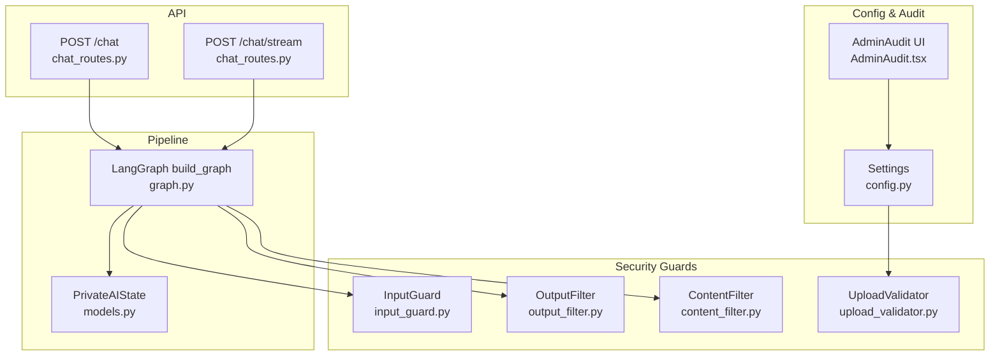
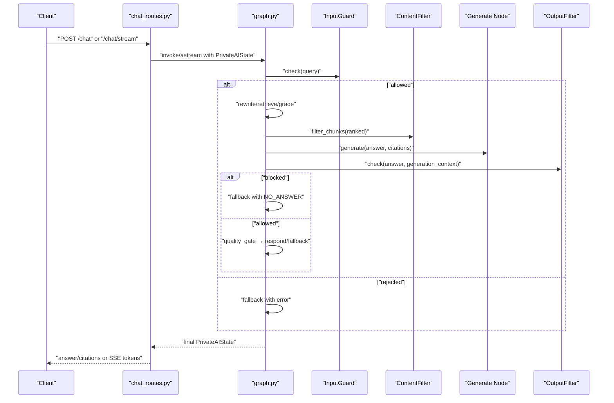
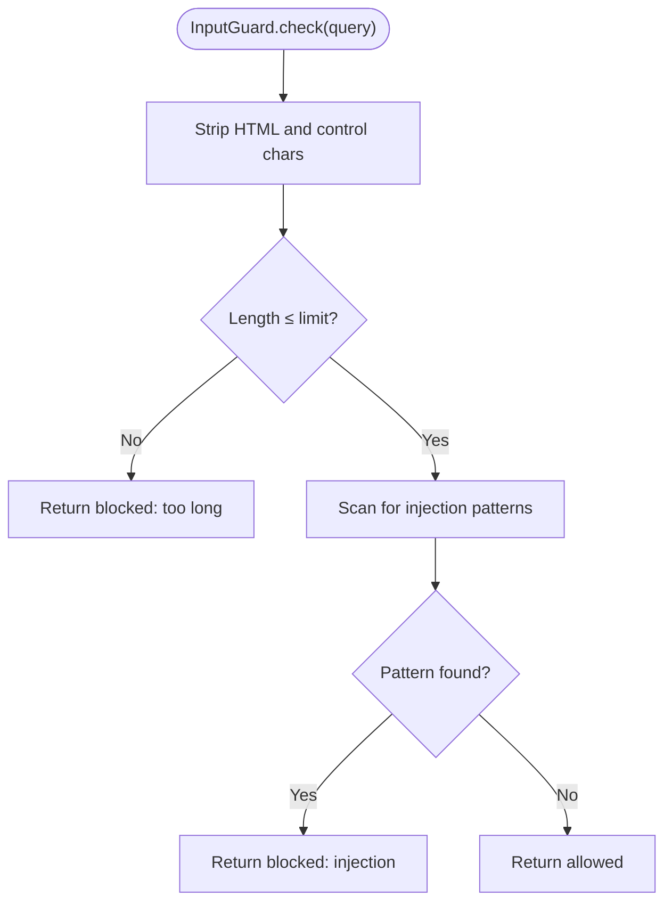
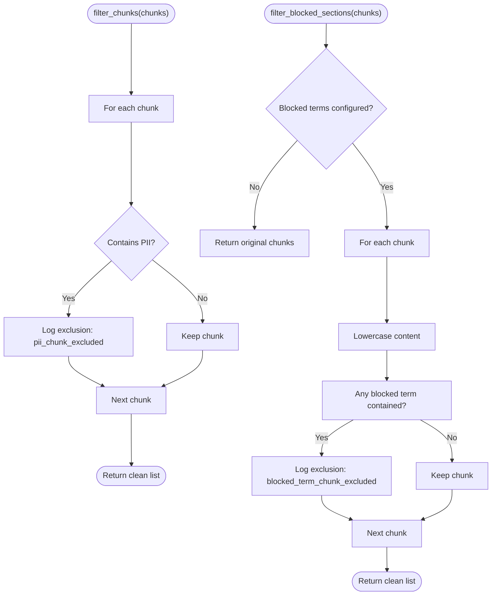
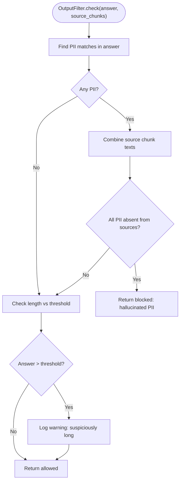
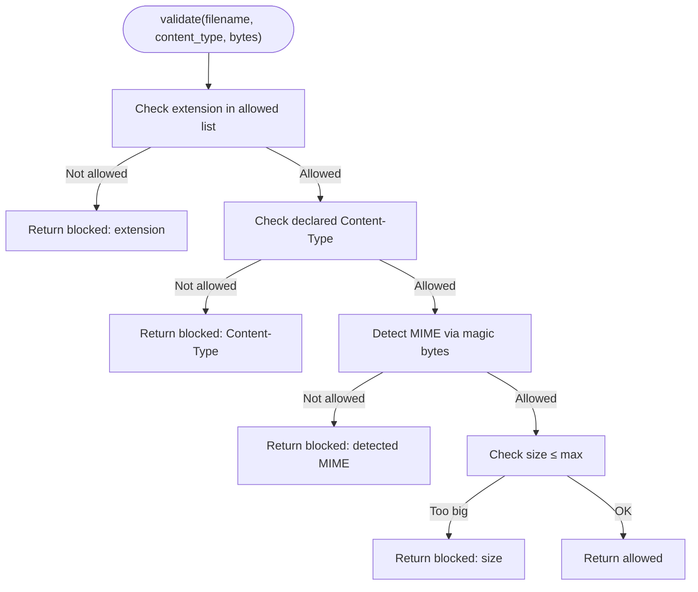
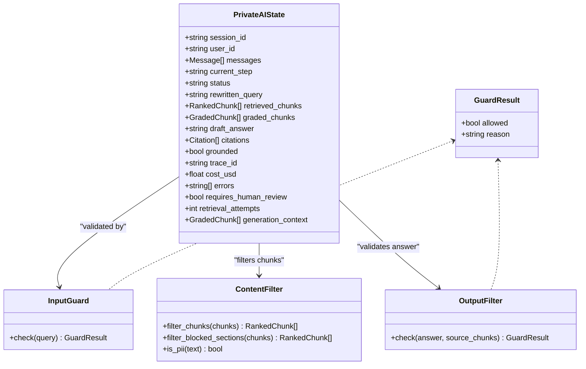
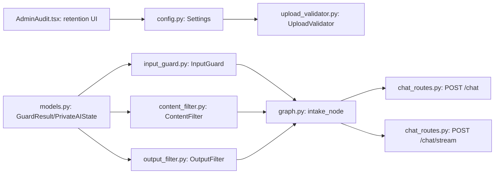

# Content Filtering

<cite>
**Referenced Files in This Document**
- [content_filter.py](file://safe4ai-pilot/app/security/content_filter.py)
- [input_guard.py](file://safe4ai-pilot/app/security/input_guard.py)
- [output_filter.py](file://safe4ai-pilot/app/security/output_filter.py)
- [upload_validator.py](file://safe4ai-pilot/app/security/upload_validator.py)
- [graph.py](file://safe4ai-pilot/app/agents/graph.py)
- [models.py](file://safe4ai-pilot/app/models.py)
- [chat_routes.py](file://safe4ai-pilot/app/api/chat_routes.py)
- [config.py](file://safe4ai-pilot/app/config.py)
- [AdminAudit.tsx](file://safe4ai-pilot/design/components/AdminAudit.tsx)
- [test_security_guards.py](file://safe4ai-pilot/tests/test_security_guards.py)
</cite>

## Table of Contents
1. [Introduction](#introduction)
2. [Project Structure](#project-structure)
3. [Core Components](#core-components)
4. [Architecture Overview](#architecture-overview)
5. [Detailed Component Analysis](#detailed-component-analysis)
6. [Dependency Analysis](#dependency-analysis)
7. [Performance Considerations](#performance-considerations)
8. [Troubleshooting Guide](#troubleshooting-guide)
9. [Conclusion](#conclusion)
10. [Appendices](#appendices)

## Introduction
This document describes the content filtering system used to monitor and block inappropriate or sensitive content across ingestion, retrieval, generation, and output stages. It explains filtering criteria, keyword detection, and contextual analysis approaches, and documents how the system integrates with AI response generation to intercept and modify content before delivery. It also covers filter configuration, policy enforcement, bypass mechanisms, and the relationship between content filtering and audit logging for compliance.

## Project Structure
The content filtering system spans several modules:
- Security guards: input validation, output verification, content filtering for retrieved chunks, and upload validation.
- Pipeline orchestration: LangGraph nodes that invoke guards during chat processing.
- Data models: shared types used across guards and pipeline nodes.
- API endpoints: chat endpoints that trigger the pipeline and stream results.
- Configuration: global settings such as retention and upload limits.
- Frontend admin: audit visualization indicating retention policies.

**Diagram sources**
- [graph.py:43-352](file://safe4ai-pilot/app/agents/graph.py#L43-L352)
- [input_guard.py:24-49](file://safe4ai-pilot/app/security/input_guard.py#L24-L49)
- [output_filter.py:31-61](file://safe4ai-pilot/app/security/output_filter.py#L31-L61)
- [content_filter.py:25-64](file://safe4ai-pilot/app/security/content_filter.py#L25-L64)
- [upload_validator.py:24-73](file://safe4ai-pilot/app/security/upload_validator.py#L24-L73)
- [models.py:38-95](file://safe4ai-pilot/app/models.py#L38-L95)
- [chat_routes.py:115-251](file://safe4ai-pilot/app/api/chat_routes.py#L115-L251)
- [config.py:7-48](file://safe4ai-pilot/app/config.py#L7-L48)
- [AdminAudit.tsx:1-115](file://safe4ai-pilot/design/components/AdminAudit.tsx#L1-L115)

**Section sources**
- [graph.py:43-352](file://safe4ai-pilot/app/agents/graph.py#L43-L352)
- [models.py:38-95](file://safe4ai-pilot/app/models.py#L38-L95)
- [chat_routes.py:115-251](file://safe4ai-pilot/app/api/chat_routes.py#L115-L251)
- [config.py:7-48](file://safe4ai-pilot/app/config.py#L7-L48)
- [AdminAudit.tsx:1-115](file://safe4ai-pilot/design/components/AdminAudit.tsx#L1-L115)

## Core Components
- InputGuard: Validates and sanitizes user queries before they enter the retrieval phase. It strips HTML and control characters, enforces a maximum length, and detects prompt-injection patterns.
- ContentFilter: Filters out retrieved document chunks containing PII and optionally blocks chunks matching configured terms. It logs exclusions for auditability.
- OutputFilter: Verifies generated answers for PII hallucinations (PII present in the answer but not in the source chunks) and suspiciously long outputs.
- UploadValidator: Enforces allowed file extensions, declared and detected MIME types, and file size limits to prevent risky uploads.

These components integrate with the LangGraph pipeline to enforce safety at each stage.

**Section sources**
- [input_guard.py:24-49](file://safe4ai-pilot/app/security/input_guard.py#L24-L49)
- [content_filter.py:25-64](file://safe4ai-pilot/app/security/content_filter.py#L25-L64)
- [output_filter.py:31-61](file://safe4ai-pilot/app/security/output_filter.py#L31-L61)
- [upload_validator.py:24-73](file://safe4ai-pilot/app/security/upload_validator.py#L24-L73)

## Architecture Overview
The chat pipeline invokes guards at strategic points to ensure content safety:
- Intake: InputGuard checks the incoming query.
- Retrieve: ContentFilter removes PII-containing chunks from the ranked results.
- Generate: Produces an answer grounded in filtered, relevant chunks.
- Output Filter: Blocks answers with hallucinated PII or warns on excessive length.
- Quality Gate: Routes to respond or fallback based on grounding and policy decisions.

**Diagram sources**
- [chat_routes.py:115-251](file://safe4ai-pilot/app/api/chat_routes.py#L115-L251)
- [graph.py:56-352](file://safe4ai-pilot/app/agents/graph.py#L56-L352)
- [input_guard.py:27-49](file://safe4ai-pilot/app/security/input_guard.py#L27-L49)
- [content_filter.py:29-64](file://safe4ai-pilot/app/security/content_filter.py#L29-L64)
- [output_filter.py:32-61](file://safe4ai-pilot/app/security/output_filter.py#L32-L61)

## Detailed Component Analysis

### InputGuard
- Purpose: Prevent prompt injection and excessive input length.
- Mechanism:
  - Strips HTML tags and non-printable characters.
  - Enforces a maximum character count.
  - Detects injection patterns (e.g., instructions to ignore prior constraints, system prompt mentions, special tokens).
- Decision: Returns a guard result indicating allowed or blocked with a reason.

**Diagram sources**
- [input_guard.py:27-49](file://safe4ai-pilot/app/security/input_guard.py#L27-L49)

**Section sources**
- [input_guard.py:24-49](file://safe4ai-pilot/app/security/input_guard.py#L24-L49)

### ContentFilter
- Purpose: Remove retrieved chunks containing PII and optionally block chunks matching configured terms.
- Mechanism:
  - PII detection via compiled regular expressions for SSNs, credit cards, and passports.
  - Optional blocked terms list (case-insensitive substring matching).
  - Logs warnings for each excluded chunk with identifiers for auditability.
- Decision: Returns a filtered list of chunks.

**Diagram sources**
- [content_filter.py:29-64](file://safe4ai-pilot/app/security/content_filter.py#L29-L64)

**Section sources**
- [content_filter.py:25-64](file://safe4ai-pilot/app/security/content_filter.py#L25-L64)

### OutputFilter
- Purpose: Verify generated answers before delivery.
- Mechanism:
  - Detects PII in the answer using the same patterns as ContentFilter.
  - Blocks answers containing PII not present in the source chunks (hallucination detection).
  - Warns on answers exceeding a configured length threshold.
- Decision: Returns a guard result indicating allowed or blocked with a reason.

**Diagram sources**
- [output_filter.py:32-61](file://safe4ai-pilot/app/security/output_filter.py#L32-L61)

**Section sources**
- [output_filter.py:31-61](file://safe4ai-pilot/app/security/output_filter.py#L31-L61)

### UploadValidator
- Purpose: Enforce safe file ingestion at upload time.
- Mechanism:
  - Allowed extensions and MIME types lists.
  - Declared Content-Type validation.
  - Magic-byte detection for actual MIME type.
  - Size enforcement based on settings.
- Decision: Returns a guard result indicating allowed or blocked with a reason.

**Diagram sources**
- [upload_validator.py:25-73](file://safe4ai-pilot/app/security/upload_validator.py#L25-L73)

**Section sources**
- [upload_validator.py:24-73](file://safe4ai-pilot/app/security/upload_validator.py#L24-L73)

### Integration with AI Response Generation
- The pipeline builds guards and invokes them at each node:
  - intake_node calls InputGuard.
  - retrieve_node applies ContentFilter to ranked chunks.
  - generate_node produces the answer and citations.
  - output_filter_node calls OutputFilter and may route to fallback.
- The generation_context snapshot ensures the output filter validates against the exact chunks supplied to generation, preventing dynamic changes from bypassing checks.

**Diagram sources**
- [models.py:38-95](file://safe4ai-pilot/app/models.py#L38-L95)
- [input_guard.py:27-49](file://safe4ai-pilot/app/security/input_guard.py#L27-L49)
- [content_filter.py:29-64](file://safe4ai-pilot/app/security/content_filter.py#L29-L64)
- [output_filter.py:32-61](file://safe4ai-pilot/app/security/output_filter.py#L32-L61)

**Section sources**
- [graph.py:56-352](file://safe4ai-pilot/app/agents/graph.py#L56-L352)
- [models.py:38-95](file://safe4ai-pilot/app/models.py#L38-L95)

## Dependency Analysis
- Guards depend on:
  - Regular expressions for pattern matching.
  - Structlog for logging.
  - Pydantic models for typed results and state.
- Pipeline depends on guards and orchestrates their invocation.
- Configuration influences upload size limits and retention.
- Audit UI reflects retention policies.

**Diagram sources**
- [config.py:7-48](file://safe4ai-pilot/app/config.py#L7-L48)
- [upload_validator.py:24-73](file://safe4ai-pilot/app/security/upload_validator.py#L24-L73)
- [input_guard.py:24-49](file://safe4ai-pilot/app/security/input_guard.py#L24-L49)
- [content_filter.py:25-64](file://safe4ai-pilot/app/security/content_filter.py#L25-L64)
- [output_filter.py:31-61](file://safe4ai-pilot/app/security/output_filter.py#L31-L61)
- [models.py:38-95](file://safe4ai-pilot/app/models.py#L38-L95)
- [chat_routes.py:115-251](file://safe4ai-pilot/app/api/chat_routes.py#L115-L251)
- [AdminAudit.tsx:1-115](file://safe4ai-pilot/design/components/AdminAudit.tsx#L1-L115)

**Section sources**
- [config.py:7-48](file://safe4ai-pilot/app/config.py#L7-L48)
- [models.py:38-95](file://safe4ai-pilot/app/models.py#L38-L95)
- [chat_routes.py:115-251](file://safe4ai-pilot/app/api/chat_routes.py#L115-L251)
- [AdminAudit.tsx:1-115](file://safe4ai-pilot/design/components/AdminAudit.tsx#L1-L115)

## Performance Considerations
- Regex scanning scales linearly with text length; keep patterns minimal and specific.
- PII detection in output filtering scans the answer and concatenates source texts; avoid extremely large contexts to reduce overhead.
- GuardResult short-circuits after the first violation, minimizing unnecessary work.
- Streaming responses mitigate latency while maintaining safety checks at the end of the pipeline.

## Troubleshooting Guide
Common issues and resolutions:
- Queries rejected at intake:
  - Cause: Exceeds maximum length or contains injection patterns.
  - Resolution: Shorten the query or rephrase to avoid directive-like phrasing.
- Retrieval yields no relevant chunks:
  - Cause: All chunks filtered due to PII or blocked terms.
  - Resolution: Adjust blocked terms or reprocess documents; verify ContentFilter configuration.
- Generated answer blocked:
  - Cause: Hallucinated PII not present in source chunks.
  - Resolution: Improve retrieval grounding or adjust prompts to avoid generating unsupported claims.
- Upload rejected:
  - Cause: Disallowed extension/type or size exceeded.
  - Resolution: Use allowed formats and sizes; verify declared Content-Type and file integrity.

Evidence and logging:
- Guards emit warnings for excluded chunks and suspicious outputs.
- Chat endpoints capture trace IDs and node states for diagnostics.

**Section sources**
- [input_guard.py:27-49](file://safe4ai-pilot/app/security/input_guard.py#L27-L49)
- [content_filter.py:32-41](file://safe4ai-pilot/app/security/content_filter.py#L32-L41)
- [output_filter.py:42-50](file://safe4ai-pilot/app/security/output_filter.py#L42-L50)
- [upload_validator.py:39-68](file://safe4ai-pilot/app/security/upload_validator.py#L39-L68)
- [chat_routes.py:176-242](file://safe4ai-pilot/app/api/chat_routes.py#L176-L242)

## Conclusion
The content filtering system enforces safety across ingestion, retrieval, generation, and output stages using targeted guards. InputGuard prevents harmful prompts, ContentFilter removes sensitive chunks, OutputFilter blocks hallucinated PII and warns on excessive length, and UploadValidator ensures safe ingestion. Together with structured logging and audit UI, the system supports compliance and operational visibility.

## Appendices

### Filter Configuration Examples
- Blocked terms:
  - Configure a list of terms to block in ContentFilter initialization. Tests demonstrate behavior when terms are present.
- Upload limits:
  - Adjust maximum upload size via settings; validators enforce declared and detected MIME types and file size.
- Retention:
  - Audit events are retained per configuration; admin UI indicates retention and archival policies.

**Section sources**
- [test_security_guards.py:132-166](file://safe4ai-pilot/tests/test_security_guards.py#L132-L166)
- [config.py:16-20](file://safe4ai-pilot/app/config.py#L16-L20)
- [AdminAudit.tsx:110-113](file://safe4ai-pilot/design/components/AdminAudit.tsx#L110-L113)