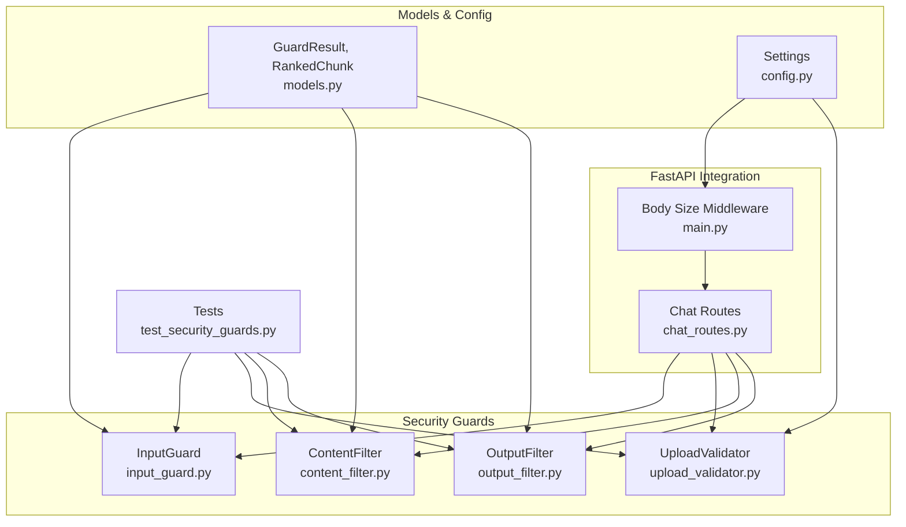
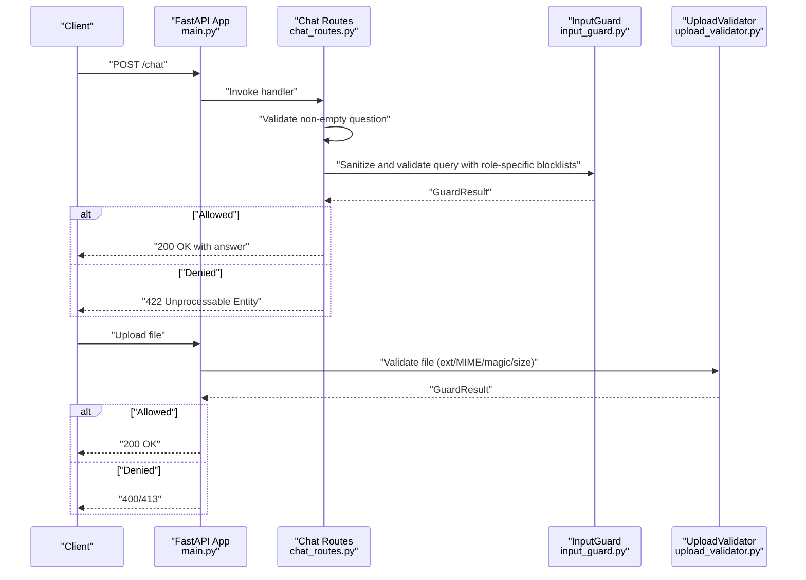
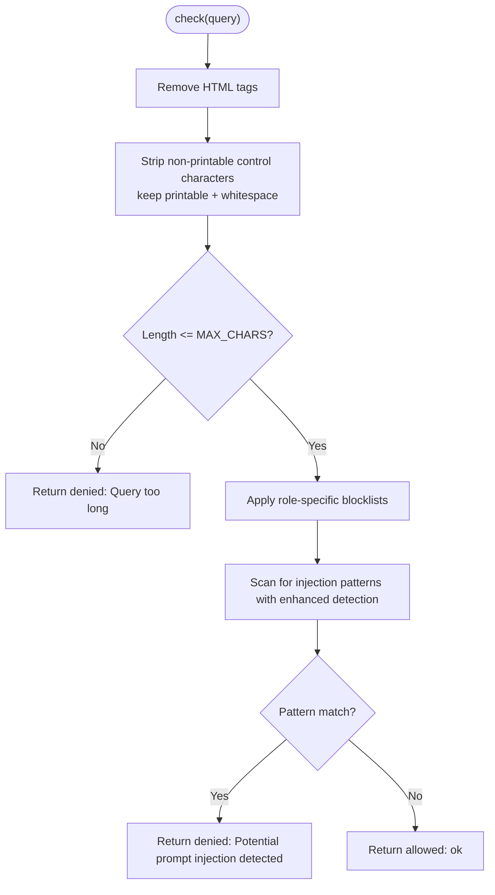
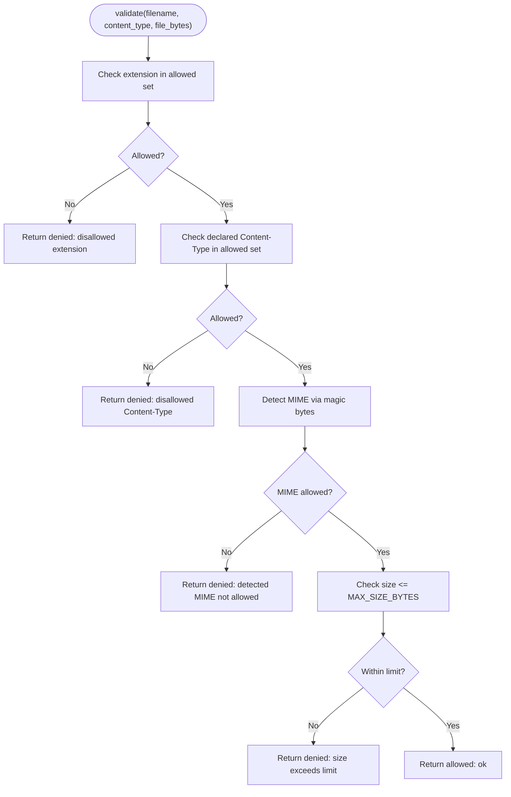
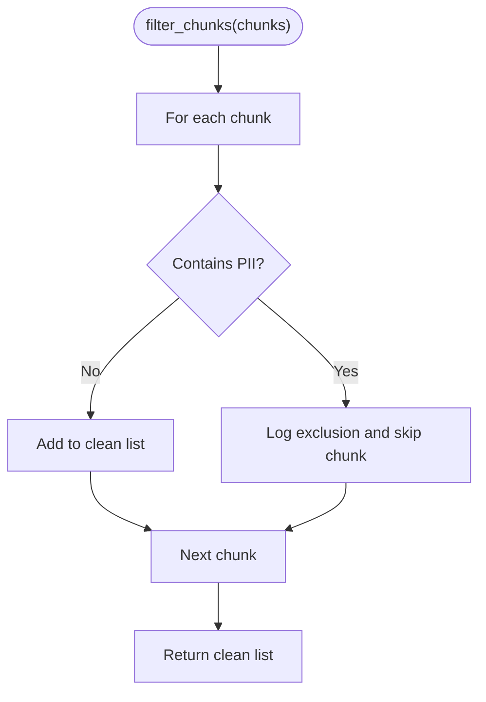
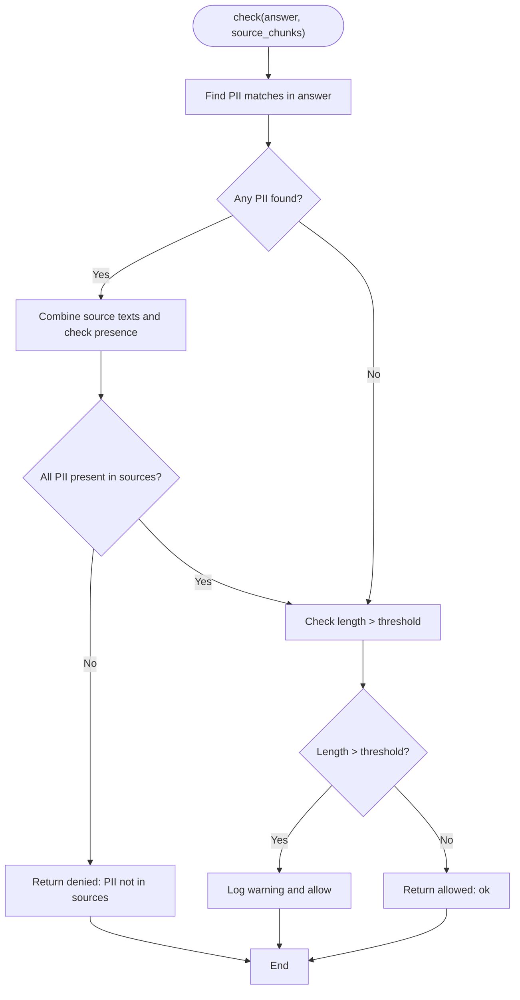
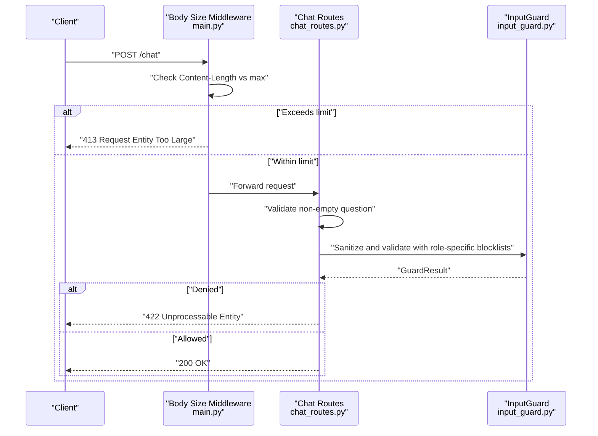
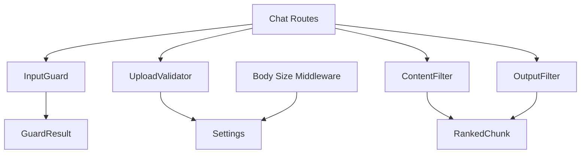

# Input Validation System

<cite>
**Referenced Files in This Document**
- [input_guard.py](file://safe4ai-pilot/app/security/input_guard.py)
- [upload_validator.py](file://safe4ai-pilot/app/security/upload_validator.py)
- [content_filter.py](file://safe4ai-pilot/app/security/content_filter.py)
- [output_filter.py](file://safe4ai-pilot/app/security/output_filter.py)
- [models.py](file://safe4ai-pilot/app/models.py)
- [config.py](file://safe4ai-pilot/app/config.py)
- [main.py](file://safe4ai-pilot/app/main.py)
- [chat_routes.py](file://safe4ai-pilot/app/api/chat_routes.py)
- [test_security_guards.py](file://safe4ai-pilot/tests/test_security_guards.py)
- [codebase-summary.md](file://safe4ai-pilot/docs/codebase-summary.md)
</cite>

## Update Summary
**Changes Made**
- Enhanced InputGuard injection pattern detection with role-specific blocklists
- Added `_ROLE_SUBSTITUTION_WORDS` and `_MALICIOUS_ROLE_WORDS` for nuanced role-based filtering
- Improved injection detection to reduce false positives on legitimate user queries
- Updated validation rules to differentiate between benign and malicious role references

## Table of Contents
1. [Introduction](#introduction)
2. [Project Structure](#project-structure)
3. [Core Components](#core-components)
4. [Architecture Overview](#architecture-overview)
5. [Detailed Component Analysis](#detailed-component-analysis)
6. [Dependency Analysis](#dependency-analysis)
7. [Performance Considerations](#performance-considerations)
8. [Troubleshooting Guide](#troubleshooting-guide)
9. [Conclusion](#conclusion)

## Introduction
This document describes the input validation system used to sanitize user inputs, prevent injection attacks, and validate data formats across the application. It focuses on:
- Text query validation and sanitization
- File upload validation and safe storage
- Content filtering for sensitive information
- Output filtering to prevent leakage of hallucinated sensitive data
- Integration with FastAPI request handling and error response formatting

The system ensures robustness against prompt injection, oversized payloads, and sensitive data exposure while maintaining a clear separation of concerns across guard components.

**Updated** Enhanced with role-specific blocklists that differentiate between benign role references and malicious injection attempts, reducing false positives on legitimate user queries.

## Project Structure
The input validation system spans several modules:
- Security guards: input sanitization, upload validation, content filtering, and output filtering
- Data models: shared result and data structures used by guards
- Configuration: global settings such as maximum upload size
- FastAPI integration: middleware for body size limiting and route-level validation
- Tests: unit tests verifying guard behavior and error responses

**Diagram sources**
- [input_guard.py:1-61](file://safe4ai-pilot/app/security/input_guard.py#L1-L61)
- [upload_validator.py:1-73](file://safe4ai-pilot/app/security/upload_validator.py#L1-L73)
- [content_filter.py:1-64](file://safe4ai-pilot/app/security/content_filter.py#L1-L64)
- [output_filter.py:1-61](file://safe4ai-pilot/app/security/output_filter.py#L1-L61)
- [models.py:38-41](file://safe4ai-pilot/app/models.py#L38-L41)
- [config.py:20-21](file://safe4ai-pilot/app/config.py#L20-L21)
- [main.py:87-95](file://safe4ai-pilot/app/main.py#L87-L95)
- [chat_routes.py:115-148](file://safe4ai-pilot/app/api/chat_routes.py#L115-L148)
- [test_security_guards.py:1-306](file://safe4ai-pilot/tests/test_security_guards.py#L1-L306)

**Section sources**
- [input_guard.py:1-61](file://safe4ai-pilot/app/security/input_guard.py#L1-L61)
- [upload_validator.py:1-73](file://safe4ai-pilot/app/security/upload_validator.py#L1-L73)
- [content_filter.py:1-64](file://safe4ai-pilot/app/security/content_filter.py#L1-L64)
- [output_filter.py:1-61](file://safe4ai-pilot/app/security/output_filter.py#L1-L61)
- [models.py:38-41](file://safe4ai-pilot/app/models.py#L38-L41)
- [config.py:20-21](file://safe4ai-pilot/app/config.py#L20-L21)
- [main.py:87-95](file://safe4ai-pilot/app/main.py#L87-L95)
- [chat_routes.py:115-148](file://safe4ai-pilot/app/api/chat_routes.py#L115-L148)
- [test_security_guards.py:1-306](file://safe4ai-pilot/tests/test_security_guards.py#L1-L306)

## Core Components
- InputGuard: Sanitizes user queries by removing HTML tags and non-printable characters, enforcing a maximum length, and detecting prompt injection patterns using enhanced role-specific blocklists.
- UploadValidator: Validates file extensions, declared MIME types, actual MIME types (via magic bytes), and file size; generates safe filenames.
- ContentFilter: Detects and filters out document chunks containing sensitive information (PII) and optional blocked terms.
- OutputFilter: Verifies generated answers for hallucinated PII not present in source chunks and logs suspiciously long outputs.
- GuardResult: Standardized result structure returned by all guards indicating whether an input is allowed and the reason.
- Settings: Centralized configuration including maximum upload size.

**Updated** Enhanced InputGuard now uses role-specific blocklists for more nuanced injection detection.

**Section sources**
- [input_guard.py:11-18](file://safe4ai-pilot/app/security/input_guard.py#L11-L18)
- [input_guard.py:20-34](file://safe4ai-pilot/app/security/input_guard.py#L20-L34)
- [upload_validator.py:24-72](file://safe4ai-pilot/app/security/upload_validator.py#L24-L72)
- [content_filter.py:25-63](file://safe4ai-pilot/app/security/content_filter.py#L25-L63)
- [output_filter.py:31-60](file://safe4ai-pilot/app/security/output_filter.py#L31-L60)
- [models.py:38-41](file://safe4ai-pilot/app/models.py#L38-L41)
- [config.py:20-21](file://safe4ai-pilot/app/config.py#L20-L21)

## Architecture Overview
The input validation system integrates with FastAPI through:
- A body-size middleware that enforces a global maximum request body size
- Route-level validation for text queries and empty submissions
- Guard components invoked during chat processing and document ingestion

**Diagram sources**
- [main.py:87-95](file://safe4ai-pilot/app/main.py#L87-L95)
- [chat_routes.py:115-148](file://safe4ai-pilot/app/api/chat_routes.py#L115-L148)
- [input_guard.py:27-61](file://safe4ai-pilot/app/security/input_guard.py#L27-L61)
- [upload_validator.py:25-72](file://safe4ai-pilot/app/security/upload_validator.py#L25-L72)

## Detailed Component Analysis

### InputGuard: Text Query Sanitization and Injection Prevention
InputGuard performs three steps:
1. Strip HTML tags and non-printable control characters, keeping printable characters and whitespace.
2. Enforce a maximum character limit (~512 tokens at 4 chars/token).
3. Detect potential prompt injection patterns using enhanced role-specific blocklists.

**Updated** Enhanced with role-specific blocklists that differentiate between benign role substitutions and malicious injection attempts.

**Diagram sources**
- [input_guard.py:27-61](file://safe4ai-pilot/app/security/input_guard.py#L27-L61)

Validation rules and behaviors:
- Allowed character set: printable characters plus whitespace characters.
- Length restriction: maximum 2048 characters.
- Enhanced injection patterns: designed to detect attempts to override system behavior or exploit special tokens, with role-specific blocklists for nuanced detection.

**Updated** Role-specific blocklists:
- `_ROLE_SUBSTITUTION_WORDS`: Benign role substitutions like "different assistant", "new bot", "unfiltered ai"
- `_MALICIOUS_ROLE_WORDS`: Malicious role references like "hacker", "cracker", "evil assistant"
- Differentiates between legitimate role changes and malicious injection attempts

Integration with FastAPI:
- Chat routes enforce non-empty questions and rely on InputGuard for further sanitization.

Examples of filtering techniques:
- Regex-based stripping of HTML tags.
- Regex-based detection of injection phrases with role-specific patterns.
- Character-by-character filtering to retain only printable and whitespace characters.

Custom validation rules:
- Extendable pattern list for injection detection.
- Configurable maximum length.
- Role-specific blocklists can be customized for different deployment contexts.

**Section sources**
- [input_guard.py:11-18](file://safe4ai-pilot/app/security/input_guard.py#L11-L18)
- [input_guard.py:20-34](file://safe4ai-pilot/app/security/input_guard.py#L20-L34)
- [input_guard.py:42-61](file://safe4ai-pilot/app/security/input_guard.py#L42-L61)
- [chat_routes.py:123-124](file://safe4ai-pilot/app/api/chat_routes.py#L123-L124)
- [test_security_guards.py:51-83](file://safe4ai-pilot/tests/test_security_guards.py#L51-L83)

### UploadValidator: File Upload Validation and Safe Storage
UploadValidator enforces:
- Allowed file extensions (.pdf, .docx, .xlsx, .txt)
- Allowed MIME types (declared and detected via magic bytes)
- Maximum file size derived from configuration
- Safe filename generation using UUID

**Diagram sources**
- [upload_validator.py:25-72](file://safe4ai-pilot/app/security/upload_validator.py#L25-L72)
- [config.py:20-21](file://safe4ai-pilot/app/config.py#L20-L21)

Validation rules and behaviors:
- Extensions and MIME types are validated against predefined allowed sets.
- Magic-byte detection prevents spoofing of file types.
- Safe filename generation avoids collisions and preserves client privacy.

Integration with FastAPI:
- Body size middleware enforces a global cap on request body size.
- Tests confirm strict enforcement of the configured maximum.

Examples of validation techniques:
- File extension parsing and lowercasing.
- MIME type detection using magic library.
- Size comparison against computed maximum.

Custom validation rules:
- Expand allowed_extensions and allowed_mime_types as needed.
- Adjust max_upload_size_mb via settings.

**Section sources**
- [upload_validator.py:13-19](file://safe4ai-pilot/app/security/upload_validator.py#L13-L19)
- [upload_validator.py:24-72](file://safe4ai-pilot/app/security/upload_validator.py#L24-L72)
- [config.py:20-21](file://safe4ai-pilot/app/config.py#L20-L21)
- [main.py:87-95](file://safe4ai-pilot/app/main.py#L87-L95)
- [test_security_guards.py:216-293](file://safe4ai-pilot/tests/test_security_guards.py#L216-L293)

### ContentFilter: PII and Blocked Terms Filtering
ContentFilter removes document chunks containing sensitive information (PII) and optionally blocks sections matching configured terms. It also exposes a predicate to check for PII presence.

**Diagram sources**
- [content_filter.py:29-41](file://safe4ai-pilot/app/security/content_filter.py#L29-L41)

Validation rules and behaviors:
- PII patterns include SSNs, credit cards, and passport numbers.
- Optional blocked terms list allows site-specific restrictions.
- Logging tracks excluded chunks for auditability.

Integration with FastAPI:
- Used during document ingestion and retrieval to filter out sensitive content.

Examples of filtering techniques:
- Precompiled regex patterns for efficient matching.
- Case-insensitive matching for blocked terms.

Custom validation rules:
- Add or modify PII patterns.
- Configure blocked terms per deployment.

**Section sources**
- [content_filter.py:13-18](file://safe4ai-pilot/app/security/content_filter.py#L13-L18)
- [content_filter.py:25-63](file://safe4ai-pilot/app/security/content_filter.py#L25-L63)
- [test_security_guards.py:90-158](file://safe4ai-pilot/tests/test_security_guards.py#L90-L158)

### OutputFilter: Hallucinated PII Detection and Long Answer Heuristic
OutputFilter verifies that generated answers do not contain PII not present in the source chunks and logs warnings for suspiciously long outputs.

**Diagram sources**
- [output_filter.py:32-60](file://safe4ai-pilot/app/security/output_filter.py#L32-L60)

Validation rules and behaviors:
- PII detection mirrors content filtering patterns.
- Strict rule: any hallucinated PII leads to rejection.
- Heuristic warning for long outputs to flag potential abuse.

Integration with FastAPI:
- Applied during the output filtering stage of the chat pipeline.

Examples of filtering techniques:
- Aggregation of source content for cross-reference.
- Iterative matching with precompiled patterns.

Custom validation rules:
- Adjust PII patterns and the length threshold as needed.

**Section sources**
- [output_filter.py:13-18](file://safe4ai-pilot/app/security/output_filter.py#L13-L18)
- [output_filter.py:23-28](file://safe4ai-pilot/app/security/output_filter.py#L23-L28)
- [output_filter.py:31-60](file://safe4ai-pilot/app/security/output_filter.py#L31-L60)
- [test_security_guards.py:165-209](file://safe4ai-pilot/tests/test_security_guards.py#L165-L209)

### Integration with FastAPI Request Handling and Error Responses
- Body size middleware enforces a global maximum request body size based on configuration.
- Chat routes validate that the question is non-empty and delegate further sanitization to InputGuard.
- Tests demonstrate that oversized requests receive a 413 response and empty questions receive 422.

**Diagram sources**
- [main.py:87-95](file://safe4ai-pilot/app/main.py#L87-L95)
- [chat_routes.py:115-148](file://safe4ai-pilot/app/api/chat_routes.py#L115-L148)
- [input_guard.py:27-61](file://safe4ai-pilot/app/security/input_guard.py#L27-L61)

**Section sources**
- [main.py:87-95](file://safe4ai-pilot/app/main.py#L87-L95)
- [chat_routes.py:115-148](file://safe4ai-pilot/app/api/chat_routes.py#L115-L148)
- [codebase-summary.md:277-278](file://safe4ai-pilot/docs/codebase-summary.md#L277-L278)
- [test_security_guards.py:89-104](file://safe4ai-pilot/tests/test_security_guards.py#L89-L104)

## Dependency Analysis
The guards depend on shared models and configuration, while FastAPI routes orchestrate their usage.

**Diagram sources**
- [input_guard.py:7](file://safe4ai-pilot/app/security/input_guard.py#L7)
- [upload_validator.py:10](file://safe4ai-pilot/app/security/upload_validator.py#L10)
- [content_filter.py:9](file://safe4ai-pilot/app/security/content_filter.py#L9)
- [output_filter.py:9](file://safe4ai-pilot/app/security/output_filter.py#L9)
- [models.py:38-41](file://safe4ai-pilot/app/models.py#L38-L41)
- [config.py:20-21](file://safe4ai-pilot/app/config.py#L20-L21)
- [main.py:87-95](file://safe4ai-pilot/app/main.py#L87-L95)
- [chat_routes.py:115-148](file://safe4ai-pilot/app/api/chat_routes.py#L115-L148)

**Section sources**
- [models.py:38-41](file://safe4ai-pilot/app/models.py#L38-L41)
- [config.py:20-21](file://safe4ai-pilot/app/config.py#L20-L21)
- [main.py:87-95](file://safe4ai-pilot/app/main.py#L87-L95)
- [chat_routes.py:115-148](file://safe4ai-pilot/app/api/chat_routes.py#L115-L148)

## Performance Considerations
- Regex compilation: Patterns are compiled once at module level for reuse.
- Early exits: Guards return immediately upon detection of violations to minimize processing.
- Lightweight filtering: Character filtering and simple regex scans keep overhead low.
- Logging: Structured logging is used for audit trails without blocking the main path.
- Role-specific optimization: Separate blocklists allow for more efficient pattern matching and reduced false positives.

**Updated** Role-specific blocklists improve performance by allowing more precise pattern matching and reducing unnecessary rejections of legitimate queries.

## Troubleshooting Guide
Common issues and resolutions:
- Oversized uploads: Ensure the request body does not exceed the configured maximum; the middleware returns 413 when exceeded.
- Empty or whitespace-only questions: Chat routes reject empty submissions with 422.
- Disallowed file types: UploadValidator rejects unknown extensions or mismatched MIME types; verify allowed lists and magic-byte detection.
- Prompt injection flagged: Review query content for injection patterns; the enhanced role-specific blocklists help reduce false positives on legitimate role references.
- Hallucinated PII in outputs: Confirm that sensitive information originates from source chunks; refine retrieval or reranking if necessary.

Evidence from tests:
- Body size enforcement and empty-question rejection are verified by tests.
- UploadValidator behavior for extensions, MIME types, magic bytes, and size is covered by unit tests.
- InputGuard tests demonstrate proper handling of injection patterns and role-specific references.

**Updated** Enhanced role-specific blocklists reduce false positives on legitimate user queries while maintaining strong injection detection capabilities.

**Section sources**
- [test_security_guards.py:89-104](file://safe4ai-pilot/tests/test_security_guards.py#L89-L104)
- [test_security_guards.py:100-109](file://safe4ai-pilot/tests/test_security_guards.py#L100-L109)
- [test_security_guards.py:216-293](file://safe4ai-pilot/tests/test_security_guards.py#L216-L293)

## Conclusion
The input validation system provides layered protection:
- InputGuard defends against prompt injection and enforces length limits, with enhanced role-specific blocklists that reduce false positives on legitimate user queries.
- UploadValidator ensures safe, correctly typed file uploads with strict size checks.
- ContentFilter and OutputFilter mitigate risks of sensitive data exposure.
- FastAPI middleware and route-level checks integrate these guards seamlessly, returning clear error responses for invalid inputs.

**Updated** The enhanced injection pattern detection with role-specific blocklists provides improved accuracy in distinguishing between benign role references and malicious injection attempts, resulting in better user experience while maintaining strong security guarantees.