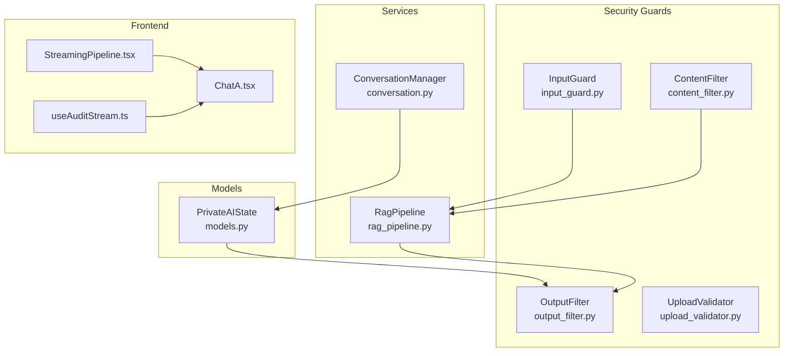
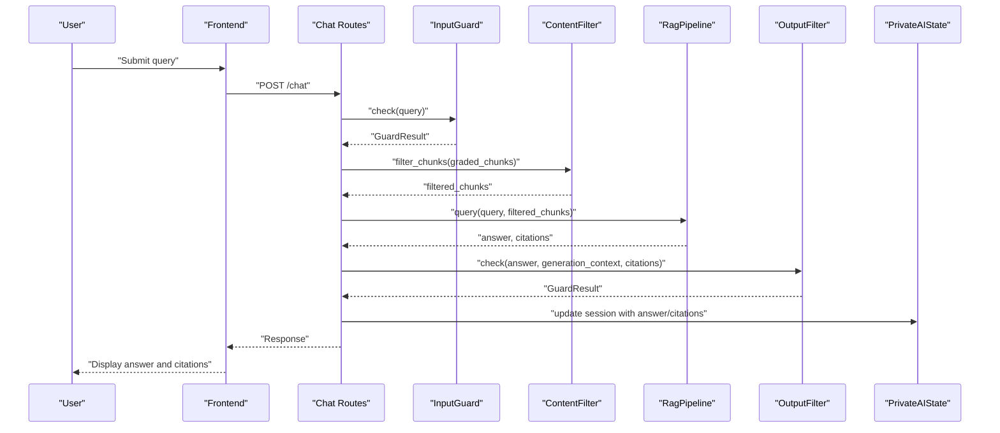
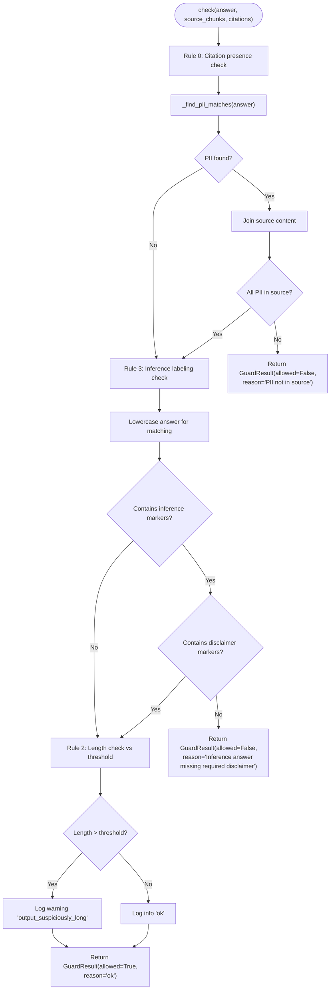
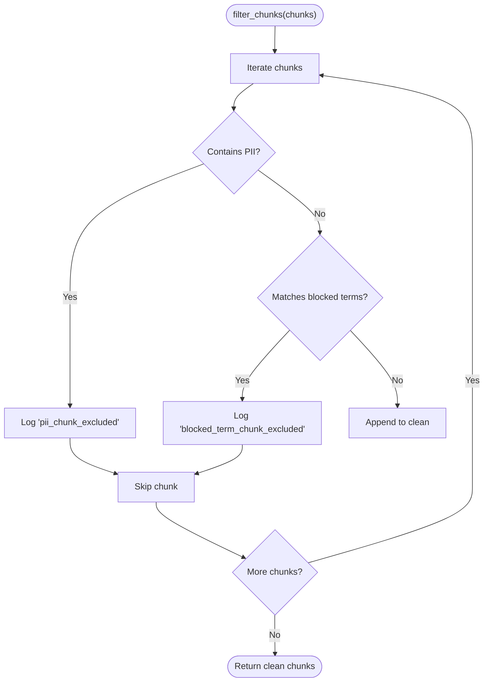
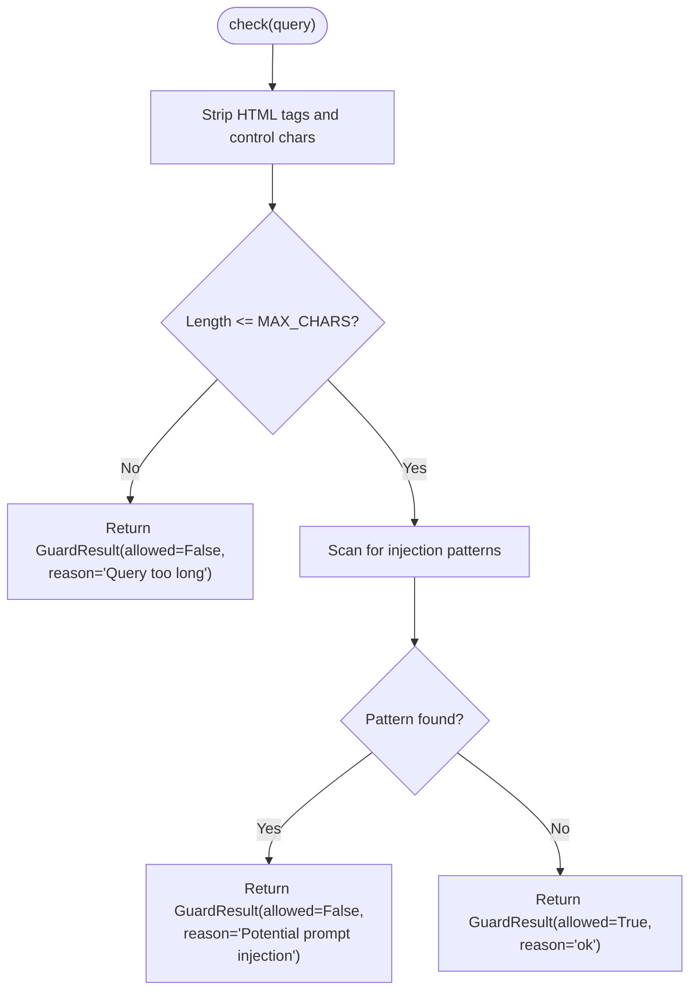
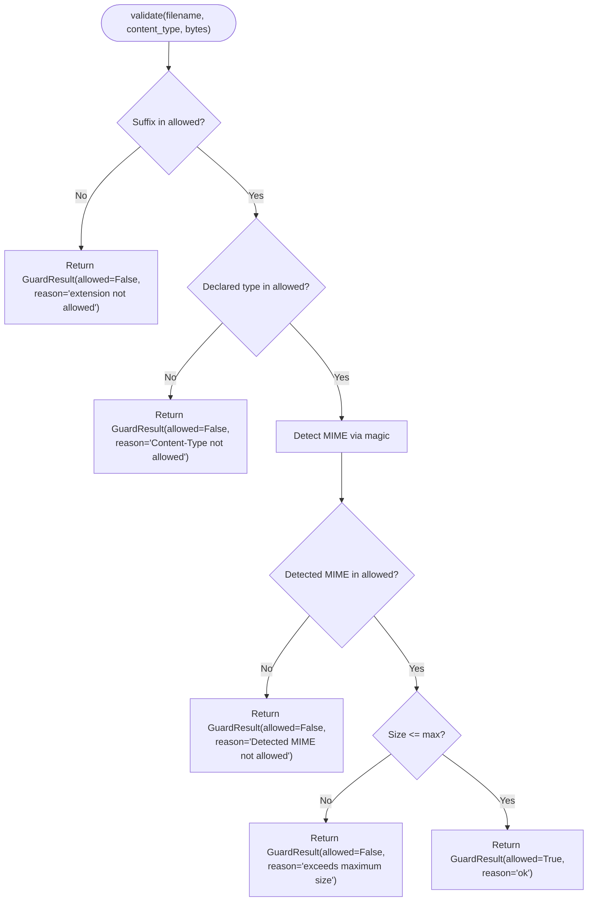
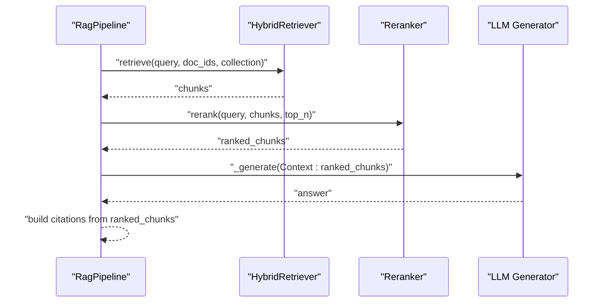
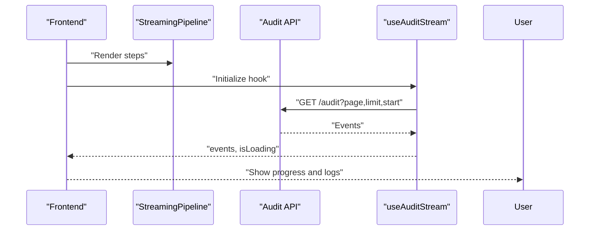
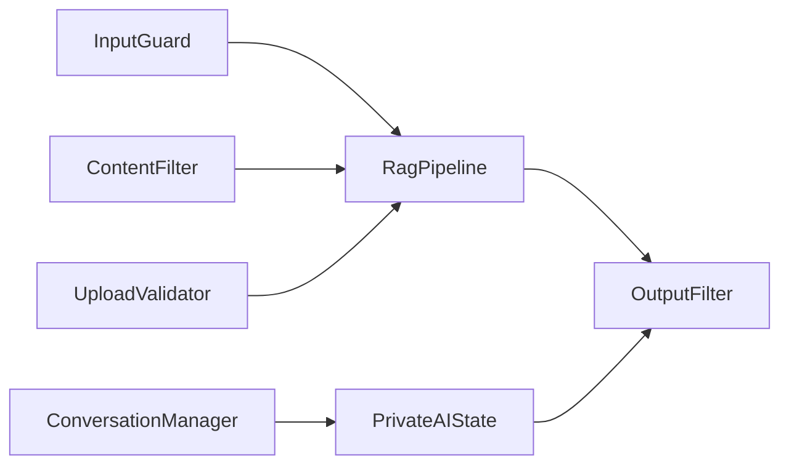
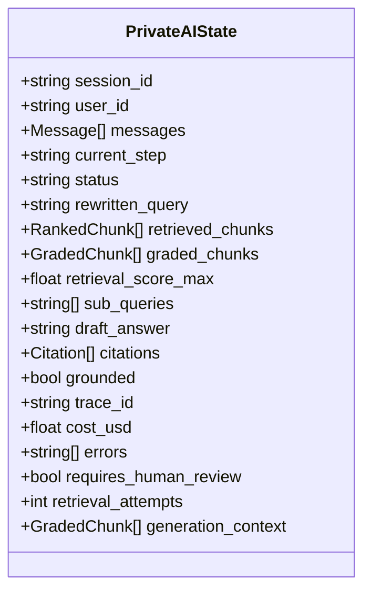

# Output Validation

<cite>
**Referenced Files in This Document**
- [output_filter.py](file://safe4ai-pilot/app/security/output_filter.py)
- [content_filter.py](file://safe4ai-pilot/app/security/content_filter.py)
- [input_guard.py](file://safe4ai-pilot/app/security/input_guard.py)
- [upload_validator.py](file://safe4ai-pilot/app/security/upload_validator.py)
- [models.py](file://safe4ai-pilot/app/models.py)
- [rag_pipeline.py](file://safe4ai-pilot/app/services/rag_pipeline.py)
- [conversation.py](file://safe4ai-pilot/app/services/conversation.py)
- [chat.tsx](file://safe4ai-pilot/frontend/src/components/chat/ChatA.tsx)
- [StreamingPipeline.tsx](file://safe4ai-pilot/frontend/src/components/chat/StreamingPipeline.tsx)
- [useAuditStream.ts](file://safe4ai-pilot/frontend/src/hooks/useAuditStream.ts)
</cite>

## Update Summary
**Changes Made**
- Enhanced OutputFilter with new Rule 3 inference labeling guard for transparency and accountability
- Added sophisticated detection of general inference language patterns and required disclaimer phrases
- Updated validation rules to include inference labeling compliance checking
- Revised troubleshooting guidance to address inference labeling failures

## Table of Contents
1. [Introduction](#introduction)
2. [Project Structure](#project-structure)
3. [Core Components](#core-components)
4. [Architecture Overview](#architecture-overview)
5. [Detailed Component Analysis](#detailed-component-analysis)
6. [Dependency Analysis](#dependency-analysis)
7. [Performance Considerations](#performance-considerations)
8. [Troubleshooting Guide](#troubleshooting-guide)
9. [Conclusion](#conclusion)
10. [Appendices](#appendices)

## Introduction
This document describes the output validation system that ensures generated AI responses are safe, accurate, and compliant before being returned to users. It covers:
- Post-processing mechanisms for generated answers, including content sanitization, format validation, and safety checks
- Validation rules for response content, citations, and source attribution
- Integration with streaming and real-time validation during content generation
- Examples of filtering scenarios, validation failures, and fallback mechanisms
- Relationship with content filtering and audit trail generation for monitored outputs

**Updated** Enhanced with new Rule 3 inference labeling guard that detects general inference language and requires appropriate disclaimer phrases for transparency and accountability.

## Project Structure
The output validation system spans backend security guards, stateful conversation orchestration, and frontend streaming indicators. The relevant modules are:
- Security guards: input sanitization, content filtering, output filtering, and upload validation
- State model: tracks generation context and validation outcomes
- RAG pipeline: constructs prompts and generates answers
- Conversation manager: persists and summarizes sessions
- Frontend: streams step progress and displays audit logs

**Diagram sources**
- [input_guard.py:24-49](file://safe4ai-pilot/app/security/input_guard.py#L24-L49)
- [content_filter.py:25-64](file://safe4ai-pilot/app/security/content_filter.py#L25-L64)
- [output_filter.py:31-61](file://safe4ai-pilot/app/security/output_filter.py#L31-L61)
- [upload_validator.py:24-73](file://safe4ai-pilot/app/security/upload_validator.py#L24-L73)
- [rag_pipeline.py:34-313](file://safe4ai-pilot/app/services/rag_pipeline.py#L34-L313)
- [conversation.py:26-117](file://safe4ai-pilot/app/services/conversation.py#L26-L117)
- [models.py:38-95](file://safe4ai-pilot/app/models.py#L38-L95)
- [StreamingPipeline.tsx:13-30](file://safe4ai-pilot/frontend/src/components/chat/StreamingPipeline.tsx#L13-L30)
- [chat.tsx](file://safe4ai-pilot/frontend/src/components/chat/ChatA.tsx)
- [useAuditStream.ts:5-17](file://safe4ai-pilot/frontend/src/hooks/useAuditStream.ts#L5-L17)

**Section sources**
- [output_filter.py:1-61](file://safe4ai-pilot/app/security/output_filter.py#L1-L61)
- [content_filter.py:1-64](file://safe4ai-pilot/app/security/content_filter.py#L1-L64)
- [input_guard.py:1-49](file://safe4ai-pilot/app/security/input_guard.py#L1-L49)
- [upload_validator.py:1-73](file://safe4ai-pilot/app/security/upload_validator.py#L1-L73)
- [models.py:1-95](file://safe4ai-pilot/app/models.py#L1-L95)
- [rag_pipeline.py:1-313](file://safe4ai-pilot/app/services/rag_pipeline.py#L1-L313)
- [conversation.py:1-117](file://safe4ai-pilot/app/services/conversation.py#L1-L117)
- [StreamingPipeline.tsx:1-30](file://safe4ai-pilot/frontend/src/components/chat/StreamingPipeline.tsx#L1-L30)
- [useAuditStream.ts:1-17](file://safe4ai-pilot/frontend/src/hooks/useAuditStream.ts#L1-L17)

## Core Components
- OutputFilter: Validates generated answers for PII hallucinations, inference labeling compliance, and suspicious length; blocks answers containing synthetic PII not present in source chunks; enforces disclaimer requirements for inference language; logs warnings for long answers.
- ContentFilter: Removes source chunks containing PII or blocked terms prior to retrieval; logs exclusions.
- InputGuard: Sanitizes and validates user queries; rejects overly long or potentially malicious inputs.
- UploadValidator: Enforces allowed extensions, declared and detected MIME types, and file size limits.
- PrivateAIState: Tracks generation context, draft answers, citations, grounding, and observability metadata.
- RagPipeline: Builds prompts from ranked chunks, invokes the generator, and returns answers with citations.
- ConversationManager: Persists session state, cleans control characters, and optionally summarizes long histories.

**Updated** Enhanced OutputFilter now includes sophisticated inference labeling detection with dedicated markers for general inference language and required disclaimer phrases.

**Section sources**
- [output_filter.py:31-61](file://safe4ai-pilot/app/security/output_filter.py#L31-L61)
- [content_filter.py:25-64](file://safe4ai-pilot/app/security/content_filter.py#L25-L64)
- [input_guard.py:24-49](file://safe4ai-pilot/app/security/input_guard.py#L24-L49)
- [upload_validator.py:24-73](file://safe4ai-pilot/app/security/upload_validator.py#L24-L73)
- [models.py:38-95](file://safe4ai-pilot/app/models.py#L38-L95)
- [rag_pipeline.py:151-182](file://safe4ai-pilot/app/services/rag_pipeline.py#L151-L182)
- [conversation.py:26-117](file://safe4ai-pilot/app/services/conversation.py#L26-L117)

## Architecture Overview
The output validation lifecycle integrates input guards, content filtering, generation, and output filtering. Citations are derived from the ranked chunks used to build the generation context. The state snapshot of generation context is validated after generation to prevent PII hallucinations and ensure proper inference labeling compliance.

**Diagram sources**
- [input_guard.py:27-49](file://safe4ai-pilot/app/security/input_guard.py#L27-L49)
- [content_filter.py:29-41](file://safe4ai-pilot/app/security/content_filter.py#L29-L41)
- [rag_pipeline.py:151-182](file://safe4ai-pilot/app/services/rag_pipeline.py#L151-L182)
- [output_filter.py:32-61](file://safe4ai-pilot/app/security/output_filter.py#L32-L61)
- [models.py:49-95](file://safe4ai-pilot/app/models.py#L49-L95)

## Detailed Component Analysis

### OutputFilter
- Purpose: Post-generate validation to prevent synthetic PII in answers, ensure inference labeling compliance, and flag unusually long responses.
- PII detection: Scans the answer for known patterns (SSN, credit cards, passports) and compares against the combined source content to detect hallucinated PII.
- Inference labeling detection: Identifies general inference language patterns and requires appropriate disclaimer phrases for transparency and accountability.
- Threshold-based warning: Emits a warning when the answer exceeds a configured character threshold without blocking.
- Outcome: Returns a GuardResult indicating whether the answer is allowed and the reason.

**Updated** Enhanced with Rule 3 inference labeling guard that detects general inference language and requires clear disclaimers.

**Diagram sources**
- [output_filter.py:23-61](file://safe4ai-pilot/app/security/output_filter.py#L23-L61)

**Section sources**
- [output_filter.py:31-61](file://safe4ai-pilot/app/security/output_filter.py#L31-L61)

### ContentFilter
- Purpose: Pre-retrieval filtering of source chunks to remove those containing PII or blocked terms.
- Methods:
  - filter_chunks: Excludes chunks with PII and logs reasons.
  - filter_blocked_sections: Excludes chunks matching blocked terms and logs reasons.
  - is_pii: Lightweight predicate for PII presence.
- Impact: Reduces risk of hallucinated PII by limiting the context used for generation.

**Diagram sources**
- [content_filter.py:29-41](file://safe4ai-pilot/app/security/content_filter.py#L29-L41)

**Section sources**
- [content_filter.py:25-64](file://safe4ai-pilot/app/security/content_filter.py#L25-L64)

### InputGuard
- Purpose: Protects the system from malicious or oversized inputs.
- Steps:
  - Strip HTML tags and non-printable characters.
  - Enforce maximum length.
  - Detect injection patterns (e.g., directive to ignore instructions, special tokens).
- Outcome: GuardResult blocks or allows the query.

**Diagram sources**
- [input_guard.py:27-49](file://safe4ai-pilot/app/security/input_guard.py#L27-L49)

**Section sources**
- [input_guard.py:24-49](file://safe4ai-pilot/app/security/input_guard.py#L24-L49)

### UploadValidator
- Purpose: Ensures uploaded files meet allowed formats, declared and detected MIME types, and size constraints.
- Checks:
  - Allowed extensions
  - Declared Content-Type
  - Detected MIME via magic bytes
  - File size limit
- Outcome: GuardResult blocks or allows the upload.

**Diagram sources**
- [upload_validator.py:25-68](file://safe4ai-pilot/app/security/upload_validator.py#L25-L68)

**Section sources**
- [upload_validator.py:24-73](file://safe4ai-pilot/app/security/upload_validator.py#L24-L73)

### Generation and Citation Construction
- The RAG pipeline retrieves and ranks chunks, constructs a prompt using only those chunks, and generates an answer.
- Citations are built from the ranked chunks used in the prompt, preserving filename, page number, excerpt, and score.
- The generation context snapshot is stored in state to enable post-generation validation.

**Diagram sources**
- [rag_pipeline.py:151-182](file://safe4ai-pilot/app/services/rag_pipeline.py#L151-L182)

**Section sources**
- [rag_pipeline.py:151-182](file://safe4ai-pilot/app/services/rag_pipeline.py#L151-L182)

### Streaming Responses and Real-Time Validation
- Frontend components visualize pipeline steps and fetch audit logs periodically for monitoring.
- StreamingPipeline renders step states (pending, active, done) to reflect retrieval, reranking, and generation progress.
- useAuditStream polls audit logs to keep administrators informed of monitored outputs.

**Diagram sources**
- [StreamingPipeline.tsx:13-30](file://safe4ai-pilot/frontend/src/components/chat/StreamingPipeline.tsx#L13-L30)
- [useAuditStream.ts:9-13](file://safe4ai-pilot/frontend/src/hooks/useAuditStream.ts#L9-L13)

**Section sources**
- [StreamingPipeline.tsx:1-30](file://safe4ai-pilot/frontend/src/components/chat/StreamingPipeline.tsx#L1-L30)
- [useAuditStream.ts:1-17](file://safe4ai-pilot/frontend/src/hooks/useAuditStream.ts#L1-L17)

## Dependency Analysis
- OutputFilter depends on:
  - GuardResult for outcomes
  - RankedChunk for source context
  - Structlog for logging
- ContentFilter depends on:
  - RankedChunk for chunk content
  - Structlog for logging
- InputGuard depends on:
  - GuardResult for outcomes
- UploadValidator depends on:
  - Settings for max upload size
  - GuardResult for outcomes
- RagPipeline composes filters and builds prompts; relies on state snapshots for validation.
- ConversationManager persists state and cleans content.

**Diagram sources**
- [input_guard.py:24-49](file://safe4ai-pilot/app/security/input_guard.py#L24-L49)
- [content_filter.py:25-64](file://safe4ai-pilot/app/security/content_filter.py#L25-L64)
- [output_filter.py:31-61](file://safe4ai-pilot/app/security/output_filter.py#L31-L61)
- [upload_validator.py:24-73](file://safe4ai-pilot/app/security/upload_validator.py#L24-L73)
- [rag_pipeline.py:34-313](file://safe4ai-pilot/app/services/rag_pipeline.py#L34-L313)
- [conversation.py:26-117](file://safe4ai-pilot/app/services/conversation.py#L26-L117)
- [models.py:38-95](file://safe4ai-pilot/app/models.py#L38-L95)

**Section sources**
- [models.py:38-95](file://safe4ai-pilot/app/models.py#L38-L95)
- [rag_pipeline.py:34-313](file://safe4ai-pilot/app/services/rag_pipeline.py#L34-L313)

## Performance Considerations
- OutputFilter scans the answer for PII patterns and then concatenates all source content; for very large source sets, consider indexing or pre-filtering to reduce join costs.
- ContentFilter iterates chunks linearly; batching and early exits improve throughput.
- InputGuard performs regex scanning and length checks; keep patterns minimal and compile once.
- UploadValidator uses magic library; cache detections per file if uploading many duplicates.
- RagPipeline's embedding and OCR steps are asynchronous; ensure timeouts and backpressure to avoid resource exhaustion.

## Troubleshooting Guide
Common validation failures and fallback mechanisms:
- PII hallucination detected:
  - Symptom: OutputFilter blocks the answer with a reason indicating synthetic PII.
  - Action: Review generation context; ensure only trusted chunks are used; re-run with stricter ContentFilter.
  - Reference: [output_filter.py:47-50](file://safe4ai-pilot/app/security/output_filter.py#L47-L50)
- Inference labeling failure:
  - Symptom: OutputFilter blocks the answer with reason "Inference answer missing required disclaimer".
  - Action: Ensure generated answers using general inference language include appropriate disclaimer phrases such as "not stated directly in the documents" or "not found in the documents".
  - Reference: [output_filter.py:93-99](file://safe4ai-pilot/app/security/output_filter.py#L93-L99)
- Suspiciously long answer:
  - Symptom: Warning logged for excessive length; answer still returned.
  - Action: Investigate prompt construction; consider summarizing context or reducing top_k.
  - Reference: [output_filter.py:54-58](file://safe4ai-pilot/app/security/output_filter.py#L54-L58)
- Blocked chunk excluded:
  - Symptom: ContentFilter logs exclusion for PII or blocked terms.
  - Action: Remove sensitive documents or adjust blocked terms; re-ingest.
  - Reference: [content_filter.py:34-38](file://safe4ai-pilot/app/security/content_filter.py#L34-L38)
- Query rejected:
  - Symptom: InputGuard blocks query due to length or injection patterns.
  - Action: Shorten query or sanitize; avoid directives that bypass instructions.
  - Reference: [input_guard.py:40-46](file://safe4ai-pilot/app/security/input_guard.py#L40-L46)
- Upload rejected:
  - Symptom: UploadValidator blocks due to extension, MIME mismatch, or size.
  - Action: Verify file type and size; ensure correct Content-Type; retry with allowed formats.
  - Reference: [upload_validator.py:41-66](file://safe4ai-pilot/app/security/upload_validator.py#L41-L66)

**Updated** Added inference labeling failure scenario with specific guidance for handling general inference language requirements.

**Section sources**
- [output_filter.py:32-61](file://safe4ai-pilot/app/security/output_filter.py#L32-L61)
- [content_filter.py:29-59](file://safe4ai-pilot/app/security/content_filter.py#L29-L59)
- [input_guard.py:27-49](file://safe4ai-pilot/app/security/input_guard.py#L27-L49)
- [upload_validator.py:25-68](file://safe4ai-pilot/app/security/upload_validator.py#L25-L68)

## Conclusion
The output validation system enforces safety and accuracy by combining input sanitization, pre-retrieval content filtering, generation with strict context, and post-generation validation. It logs warnings and blocks for synthetic PII while ensuring inference language compliance for transparency and accountability. The system now includes sophisticated detection of general inference patterns and requires appropriate disclaimer phrases. The state model preserves generation context for validation, and the frontend provides visibility into pipeline steps and audit trails.

## Appendices

### Data Model: PrivateAIState
- Tracks session, retrieval, decomposition, generation, and output stages.
- Stores generation_context snapshot used by OutputFilter to validate answers against the exact chunks supplied to the generator.

**Diagram sources**
- [models.py:49-95](file://safe4ai-pilot/app/models.py#L49-L95)

**Section sources**
- [models.py:38-95](file://safe4ai-pilot/app/models.py#L38-L95)