# Security and Middleware

<cite>
**Referenced Files in This Document**
- [main.py](file://safe4ai-pilot/app/main.py)
- [config.py](file://safe4ai-pilot/app/config.py)
- [middleware.py](file://safe4ai-pilot/app/auth/middleware.py)
- [router.py](file://safe4ai-pilot/app/auth/router.py)
- [models.py](file://safe4ai-pilot/app/models.py)
- [input_guard.py](file://safe4ai-pilot/app/security/input_guard.py)
- [content_filter.py](file://safe4ai-pilot/app/security/content_filter.py)
- [output_filter.py](file://safe4ai-pilot/app/security/output_filter.py)
- [upload_validator.py](file://safe4ai-pilot/app/security/upload_validator.py)
- [url_validator.py](file://safe4ai-pilot/app/security/url_validator.py)
- [chat_routes.py](file://safe4ai-pilot/app/api/chat_routes.py)
- [admin_routes.py](file://safe4ai-pilot/app/api/admin_routes.py)
- [observability_routes.py](file://safe4ai-pilot/app/api/observability_routes.py)
- [models.py (db)](file://safe4ai-pilot/app/db/models.py)
- [app_config_store.py](file://safe4ai-pilot/app/services/app_config_store.py)
- [client.ts](file://safe4ai-pilot/frontend/src/api/client.ts)
- [test_security_headers.py](file://safe4ai-pilot/tests/test_security_headers.py)
- [test_auth.py](file://safe4ai-pilot/tests/test_auth.py)
- [test_security_audit.py](file://safe4ai-pilot/tests/test_security_audit.py)
- [safe4ai-implementation-plan.md](file://safe4ai-implementation-plan.md)
</cite>

## Update Summary
**Changes Made**
- Enhanced CSRF protection now mandatory for all unsafe HTTP methods with comprehensive double-submit verification
- Added new SSRF protection system with URL validator for provider base URLs implementing comprehensive IP range blocking
- Strengthened HTTP request parsing against ambiguous body framing attacks with explicit CL/TE conflict detection
- Improved information disclosure controls with enhanced security headers and health endpoint sanitization
- Added new security middleware components including URL validator for provider base URLs
- Updated CSRF protection logic to always require CSRF tokens for unsafe methods regardless of authentication state

## Table of Contents
1. [Introduction](#introduction)
2. [Project Structure](#project-structure)
3. [Core Components](#core-components)
4. [Architecture Overview](#architecture-overview)
5. [Detailed Component Analysis](#detailed-component-analysis)
6. [Dependency Analysis](#dependency-analysis)
7. [Performance Considerations](#performance-considerations)
8. [Troubleshooting Guide](#troubleshooting-guide)
9. [Conclusion](#conclusion)
10. [Appendices](#appendices)

## Introduction
This document provides comprehensive security documentation for the Private AI pilot application. It focuses on middleware implementation, authentication and session management, input validation, content filtering, output filtering, upload validation, security headers, CORS policies, rate limiting, and enhanced CSRF protection. The system now features comprehensive CSRF protection with mandatory double-submit verification for all unsafe HTTP methods, new SSRF protection system with URL validation for provider base URLs, strengthened HTTP request parsing against ambiguous body framing attacks, and improved information disclosure controls. Practical configuration examples, threat mitigation strategies, and compliance-relevant controls are included to help operators deploy and operate the system securely.

## Project Structure
Security-related components are organized across middleware, authentication, API routes, and security utilities:
- Authentication middleware and routers manage JWT-based sessions and enforce roles.
- Security guards implement input sanitization, content filtering for PII, and output validation.
- Application-wide middleware sets security headers, enforces CORS, and limits request body size with enhanced chunked processing.
- CSRF protection middleware implements comprehensive double-submit verification with secure token comparison for all unsafe methods.
- SSRF protection system validates provider base URLs against private/reserved IP ranges.
- Enhanced HTTP request parsing prevents ambiguous body framing attacks with explicit CL/TE conflict detection.
- Information disclosure controls sanitize health endpoint responses and error messages.
- Rate limiting is applied at route level using a shared limiter.
- Configuration centralizes secrets, origins, and thresholds with configurable upload size limits.
- Upload validation works seamlessly with both traditional and chunked request processing.

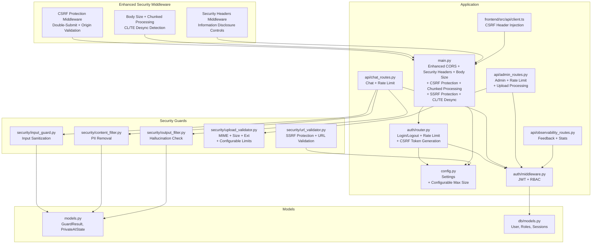

**Diagram sources**
- [main.py:63-167](file://safe4ai-pilot/app/main.py#L63-L167)
- [config.py:7-48](file://safe4ai-pilot/app/config.py#L7-L48)
- [middleware.py:51-82](file://safe4ai-pilot/app/auth/middleware.py#L51-L82)
- [router.py:39-133](file://safe4ai-pilot/app/auth/router.py#L39-L133)
- [chat_routes.py:115-148](file://safe4ai-pilot/app/api/chat_routes.py#L115-L148)
- [admin_routes.py:67-120](file://safe4ai-pilot/app/api/admin_routes.py#L67-L120)
- [observability_routes.py:26-45](file://safe4ai-pilot/app/api/observability_routes.py#L26-L45)
- [input_guard.py:24-48](file://safe4ai-pilot/app/security/input_guard.py#L24-L48)
- [content_filter.py:25-63](file://safe4ai-pilot/app/security/content_filter.py#L25-L63)
- [output_filter.py:31-60](file://safe4ai-pilot/app/security/output_filter.py#L31-L60)
- [upload_validator.py:24-72](file://safe4ai-pilot/app/security/upload_validator.py#L24-L72)
- [url_validator.py:26-55](file://safe4ai-pilot/app/security/url_validator.py#L26-L55)
- [client.ts:26-37](file://safe4ai-pilot/frontend/src/api/client.ts#L26-L37)
- [models.py:38-95](file://safe4ai-pilot/app/models.py#L38-L95)
- [models.py (db):52-72](file://safe4ai-pilot/app/db/models.py#L52-L72)

**Section sources**
- [main.py:63-167](file://safe4ai-pilot/app/main.py#L63-L167)
- [config.py:7-48](file://safe4ai-pilot/app/config.py#L7-L48)

## Core Components
- Authentication middleware: JWT encoding/decoding, user extraction, role enforcement.
- Authentication router: login/logout with brute-force protection, cookie policy, rate limiting, and CSRF token generation.
- CSRF protection middleware: comprehensive double-submit verification with secure token comparison for all unsafe HTTP methods (POST, PUT, PATCH, DELETE), origin validation, and mandatory CSRF token requirement.
- SSRF protection system: URL validator that blocks private/reserved IP ranges and validates provider base URLs against comprehensive network restrictions.
- Enhanced HTTP request parsing: explicit detection and rejection of ambiguous body framing attacks with CL/TE header conflicts.
- Input guard: HTML tag stripping, printable character normalization, length cap, prompt injection detection.
- Content filter: PII detection and removal from document chunks; optional blocked terms filtering.
- Output filter: PII hallucination detection against source chunks; long-answer warning.
- Upload validator: extension whitelist, declared and magic-byte MIME checks, size enforcement with configurable limits, safe filenames.
- Enhanced security headers: comprehensive information disclosure controls and sanitized health endpoint responses.
- Application middleware: CORS, security headers, request body size limit with enhanced chunked processing using SpooledTemporaryFile.
- Rate limiting: module-level limiter reused across routes.

**Updated** Enhanced CSRF protection now mandates CSRF tokens for all unsafe methods regardless of authentication state, SSRF protection system provides comprehensive URL validation, HTTP request parsing prevents ambiguous body framing attacks, and information disclosure controls sanitize responses.

**Section sources**
- [middleware.py:25-82](file://safe4ai-pilot/app/auth/middleware.py#L25-L82)
- [router.py:39-133](file://safe4ai-pilot/app/auth/router.py#L39-L133)
- [main.py:142-167](file://safe4ai-pilot/app/main.py#L142-L167)
- [url_validator.py:26-55](file://safe4ai-pilot/app/security/url_validator.py#L26-L55)
- [main.py:121-167](file://safe4ai-pilot/app/main.py#L121-L167)
- [input_guard.py:24-48](file://safe4ai-pilot/app/security/input_guard.py#L24-L48)
- [content_filter.py:25-63](file://safe4ai-pilot/app/security/content_filter.py#L25-L63)
- [output_filter.py:31-60](file://safe4ai-pilot/app/security/output_filter.py#L31-L60)
- [upload_validator.py:24-72](file://safe4ai-pilot/app/security/upload_validator.py#L24-L72)
- [app_config_store.py:12-76](file://safe4ai-pilot/app/services/app_config_store.py#L12-L76)
- [main.py:69-136](file://safe4ai-pilot/app/main.py#L69-L136)
- [chat_routes.py:115-148](file://safe4ai-pilot/app/api/chat_routes.py#L115-L148)
- [admin_routes.py:67-120](file://safe4ai-pilot/app/api/admin_routes.py#L67-L120)

## Architecture Overview
The system enforces authentication via HTTP-only cookies and JWTs, applies CORS and security headers globally, and protects endpoints with rate limits and comprehensive CSRF protection. Enhanced request handling now supports chunked processing for large uploads using SpooledTemporaryFile to prevent memory exhaustion while maintaining streaming capabilities. The CSRF protection middleware implements mandatory double-submit verification with secure token comparison for all unsafe HTTP methods, requiring both access_token and csrf_token cookies. The new SSRF protection system validates provider base URLs against private/reserved IP ranges to prevent server-side request forgery attacks. Enhanced HTTP request parsing prevents ambiguous body framing attacks by explicitly detecting CL/TE header conflicts. Information disclosure controls sanitize health endpoint responses and error messages to prevent sensitive data leakage.

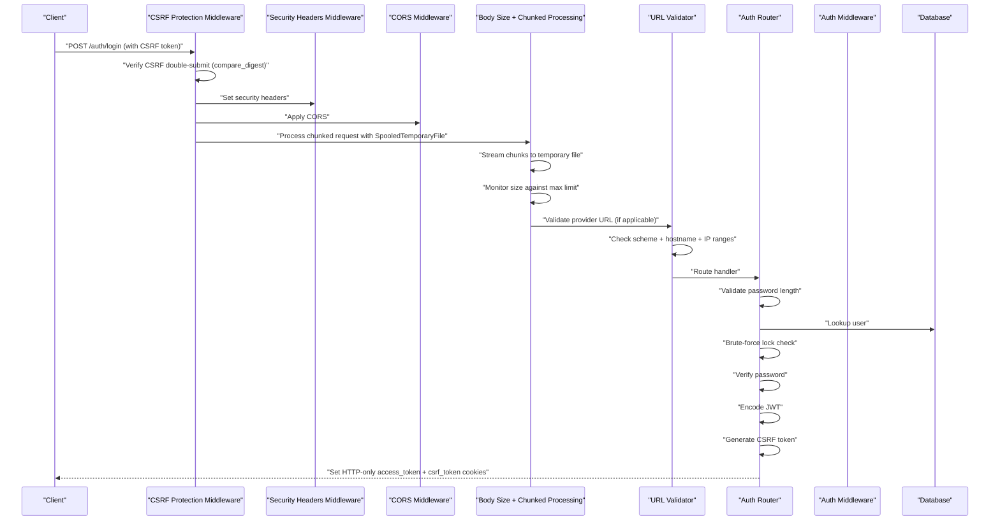

**Diagram sources**
- [main.py:142-167](file://safe4ai-pilot/app/main.py#L142-L167)
- [router.py:39-133](file://safe4ai-pilot/app/auth/router.py#L39-L133)
- [middleware.py:51-71](file://safe4ai-pilot/app/auth/middleware.py#L51-L71)
- [url_validator.py:26-55](file://safe4ai-pilot/app/security/url_validator.py#L26-L55)
- [models.py (db):52-62](file://safe4ai-pilot/app/db/models.py#L52-L62)

## Detailed Component Analysis

### Enhanced CSRF Protection: Mandatory Double-Submit Verification
- Implements comprehensive CSRF protection with mandatory double-submit token verification for all unsafe HTTP methods.
- Requires both access_token and csrf_token cookies for POST, PUT, PATCH, and DELETE methods regardless of authentication state.
- Uses secure constant-time comparison (`compare_digest`) to prevent timing attacks.
- Validates origin headers for login endpoint to prevent cross-origin CSRF attacks.
- Frontend automatically injects CSRF tokens for non-safe HTTP methods.
- **Updated** CSRF protection now applies to all unsafe methods, not just authenticated endpoints.

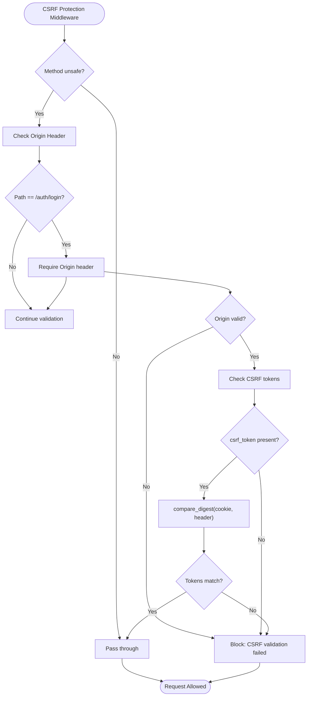

**Diagram sources**
- [main.py:94-118](file://safe4ai-pilot/app/main.py#L94-L118)
- [client.ts:31-37](file://safe4ai-pilot/frontend/src/api/client.ts#L31-L37)

**Section sources**
- [main.py:94-118](file://safe4ai-pilot/app/main.py#L94-L118)
- [router.py:108-133](file://safe4ai-pilot/app/auth/router.py#L108-L133)
- [client.ts:26-37](file://safe4ai-pilot/frontend/src/api/client.ts#L26-L37)

### CSRF Token Generation Endpoint
- New GET /auth/csrf endpoint generates pre-login CSRF tokens with 5-minute TTL.
- Tokens are stored in csrf_token cookies with httponly=False for frontend access.
- Used before login to establish CSRF protection for authentication flows.
- Supports cross-origin validation for login requests.

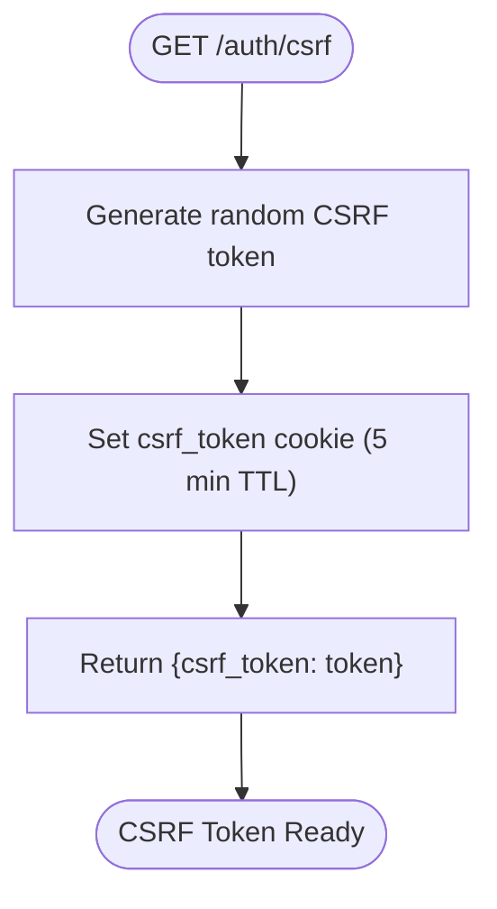

**Diagram sources**
- [router.py:55-67](file://safe4ai-pilot/app/auth/router.py#L55-L67)

**Section sources**
- [router.py:55-67](file://safe4ai-pilot/app/auth/router.py#L55-L67)
- [test_auth.py:279-286](file://safe4ai-pilot/tests/test_auth.py#L279-L286)

### SSRF Protection System: Comprehensive URL Validation
- New SSRF protection system validates provider base URLs against comprehensive IP range blocking.
- Blocks private/reserved IP ranges including 10.0.0.0/8, 172.16.0.0/12, 192.168.0.0/16, 127.0.0.0/8, 169.254.0.0/16, 0.0.0.0/8, ::1/128, fc00::/7, fe80::/10.
- Validates URL schemes to allow only http and https.
- Resolves hostnames and checks against blocked networks to prevent SSRF attacks.
- Returns cleaned URL without trailing slash on successful validation.
- **New** Provides comprehensive protection against server-side request forgery attacks.

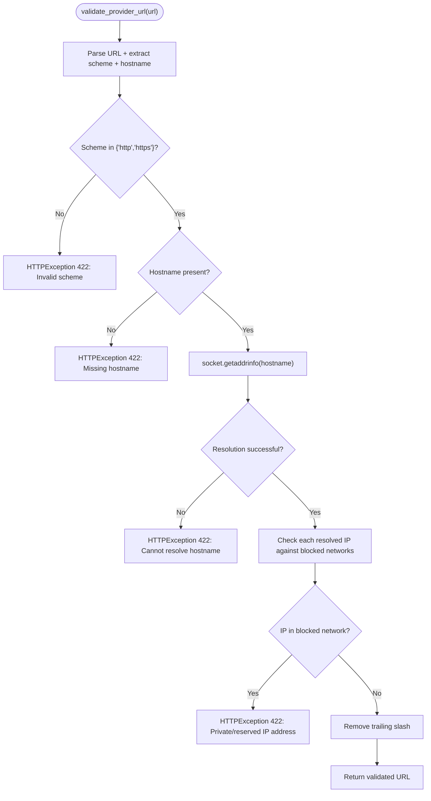

**Diagram sources**
- [url_validator.py:26-55](file://safe4ai-pilot/app/security/url_validator.py#L26-L55)

**Section sources**
- [url_validator.py:26-55](file://safe4ai-pilot/app/security/url_validator.py#L26-L55)
- [test_security_audit.py:269-363](file://safe4ai-pilot/tests/test_security_audit.py#L269-L363)

### Enhanced HTTP Request Parsing: Ambiguous Body Framing Attack Prevention
- **F-01**: Explicitly rejects ambiguous requests with both Content-Length and Transfer-Encoding headers.
- **F-02**: All endpoints including /chat and /chat/stream are now checked for body size limits.
- **F-05**: Sets request._body directly to enable safe replay without monkey-patching _receive.
- **F-06**: Health endpoint sanitizes responses to prevent information disclosure.
- **F-07**: SSE error messages are sanitized to prevent internal error leakage.
- **F-08**: Nginx configuration is hardened with proper header scrubbing and body size limits.

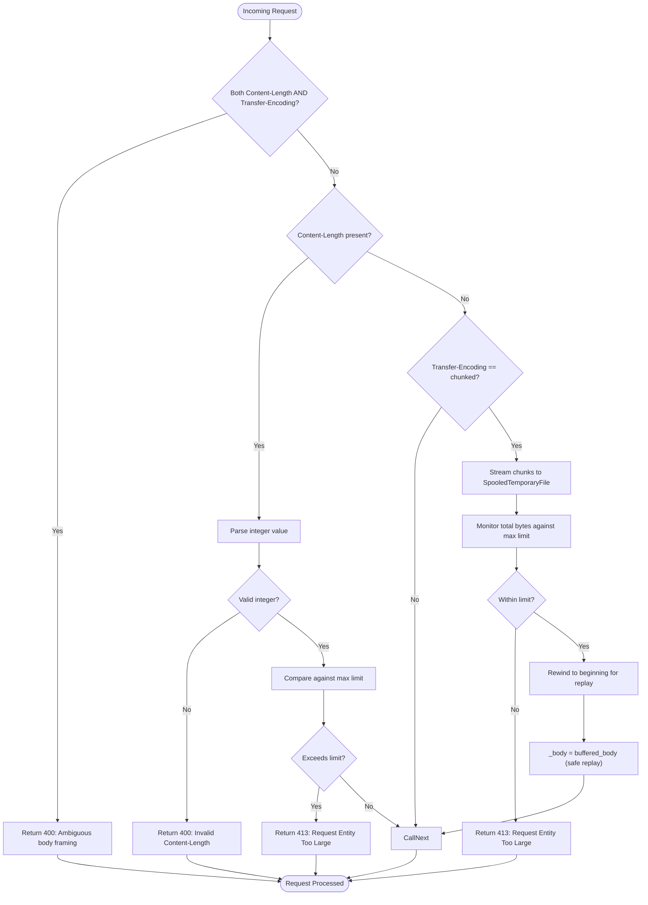

**Diagram sources**
- [main.py:121-167](file://safe4ai-pilot/app/main.py#L121-L167)
- [config.py:20-21](file://safe4ai-pilot/app/config.py#L20-L21)

**Section sources**
- [main.py:121-167](file://safe4ai-pilot/app/main.py#L121-L167)
- [config.py:20-21](file://safe4ai-pilot/app/config.py#L20-L21)
- [test_security_headers.py:113-179](file://safe4ai-pilot/tests/test_security_headers.py#L113-L179)
- [test_security_audit.py:75-102](file://safe4ai-pilot/tests/test_security_audit.py#L75-L102)

### Authentication Middleware and Session Management
- JWT encoding/decoding with HS256 and fixed expiry window.
- Extracts token from cookie and validates user existence and activity.
- Role-based access control via dependency that raises forbidden when mismatched.
- Password hashing and verification use bcrypt.

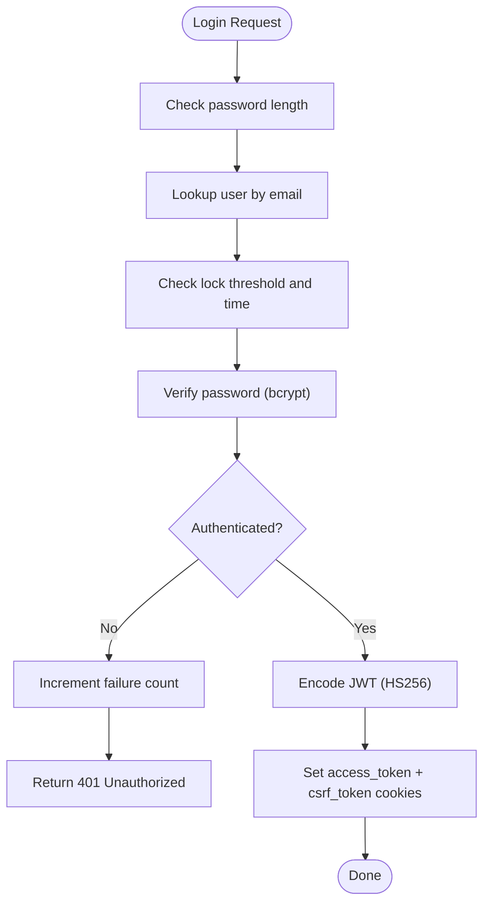

**Diagram sources**
- [router.py:39-133](file://safe4ai-pilot/app/auth/router.py#L39-L133)
- [middleware.py:25-48](file://safe4ai-pilot/app/auth/middleware.py#L25-L48)

**Section sources**
- [middleware.py:25-82](file://safe4ai-pilot/app/auth/middleware.py#L25-L82)
- [router.py:39-133](file://safe4ai-pilot/app/auth/router.py#L39-L133)
- [models.py (db):52-62](file://safe4ai-pilot/app/db/models.py#L52-L62)
- [test_auth.py:119-141](file://safe4ai-pilot/tests/test_auth.py#L119-L141)

### Provider API Key Encryption: Fernet Cryptographic Primitives
- Integrates Fernet encryption for sensitive configuration values at rest.
- Protects API keys including openai_api_key, anthropic_api_key, api_key, and provider_api_key.
- Uses SHA-256 hash of SECRET_KEY to derive encryption key.
- Transparent encryption/decryption with prefix-based detection.
- Prevents plaintext exposure in database storage.

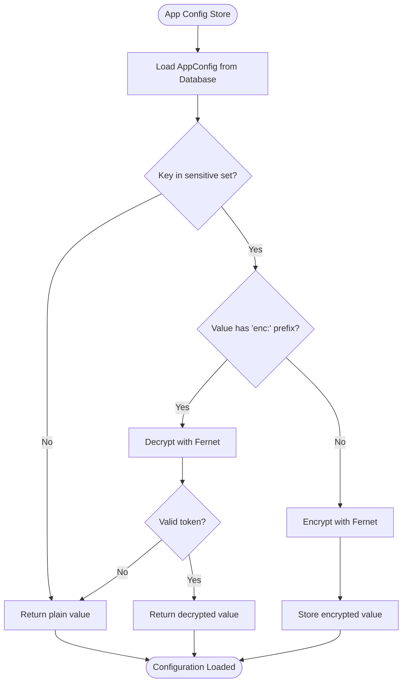

**Diagram sources**
- [app_config_store.py:12-76](file://safe4ai-pilot/app/services/app_config_store.py#L12-L76)

**Section sources**
- [app_config_store.py:12-76](file://safe4ai-pilot/app/services/app_config_store.py#L12-L76)

### Input Guard: Sanitization and Validation
- Strips HTML tags and non-printable characters, normalizes whitespace.
- Enforces maximum length to bound prompt size.
- Detects prompt-injection patterns (e.g., instructions to override behavior).
- Returns a guard result indicating allowed/denied with reason.

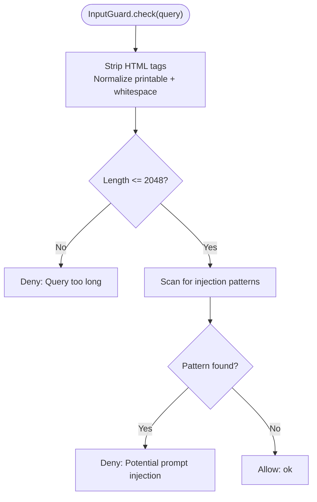

**Diagram sources**
- [input_guard.py:24-48](file://safe4ai-pilot/app/security/input_guard.py#L24-L48)

**Section sources**
- [input_guard.py:24-48](file://safe4ai-pilot/app/security/input_guard.py#L24-L48)
- [models.py:38-40](file://safe4ai-pilot/app/models.py#L38-L40)

### Content Filter: PII and Blocked Terms
- Detects PII patterns (SSN, credit cards, passports) in document chunks.
- Filters out chunks containing PII and logs exclusions.
- Optional blocked terms list to exclude specific content sections.
- Utility to quickly check if text contains PII.

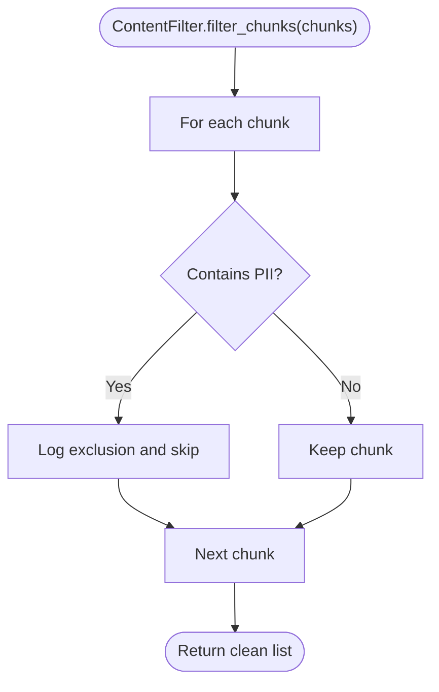

**Diagram sources**
- [content_filter.py:25-63](file://safe4ai-pilot/app/security/content_filter.py#L25-L63)

**Section sources**
- [content_filter.py:25-63](file://safe4ai-pilot/app/security/content_filter.py#L25-L63)

### Output Filter: Hallucination and Length Heuristics
- Scans generated answer for PII not present in source chunks; blocks if found.
- Warns on suspiciously long outputs exceeding a threshold.
- Uses combined source text to verify PII provenance.

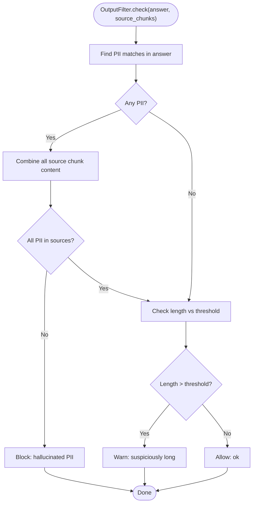

**Diagram sources**
- [output_filter.py:31-60](file://safe4ai-pilot/app/security/output_filter.py#L31-L60)

**Section sources**
- [output_filter.py:31-60](file://safe4ai-pilot/app/security/output_filter.py#L31-L60)

### Upload Validator: MIME, Size, and Safety
- Validates file extension against allowed set.
- Validates declared Content-Type against allowed set.
- Validates actual MIME type via magic bytes.
- Enforces maximum file size from configuration with configurable limits.
- Generates a UUID-based storage filename to avoid relying on client-provided names.

**Updated** Now works seamlessly with both traditional and chunked request processing, utilizing the same configurable size limits.

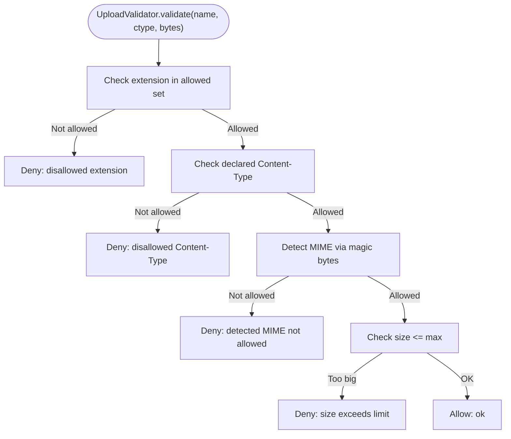

**Diagram sources**
- [upload_validator.py:24-72](file://safe4ai-pilot/app/security/upload_validator.py#L24-L72)
- [config.py:20-21](file://safe4ai-pilot/app/config.py#L20-L21)

**Section sources**
- [upload_validator.py:24-72](file://safe4ai-pilot/app/security/upload_validator.py#L24-L72)
- [config.py:20-21](file://safe4ai-pilot/app/config.py#L20-L21)

### Enhanced Request Processing: Chunked Uploads and Memory Management
- **SpooledTemporaryFile**: Uses memory-mapped temporary files that spill to disk when exceeding configured size limits.
- **Streaming Processing**: Maintains streaming capabilities while preventing memory exhaustion through chunked processing.
- **Configurable Limits**: Default maximum upload size is 50MB, configurable via environment settings.
- **Memory Efficiency**: Automatically manages memory vs disk storage based on size thresholds.
- **Replay Capability**: Preserves request body for downstream handlers after processing.

**Updated** Enhanced request handling now supports chunked processing with automatic memory management using SpooledTemporaryFile.

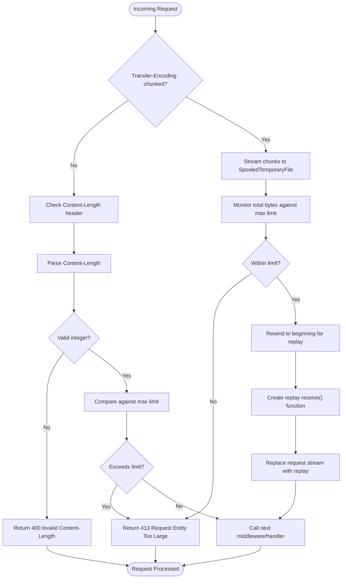

**Diagram sources**
- [main.py:89-136](file://safe4ai-pilot/app/main.py#L89-L136)
- [config.py:20-21](file://safe4ai-pilot/app/config.py#L20-L21)

**Section sources**
- [main.py:89-136](file://safe4ai-pilot/app/main.py#L89-L136)
- [config.py:20-21](file://safe4ai-pilot/app/config.py#L20-L21)
- [test_security_headers.py:113-179](file://safe4ai-pilot/tests/test_security_headers.py#L113-L179)

### Security Headers and CORS
- Global HTTP middleware sets security headers on every response.
- CORS configured with allowed origins from environment, credentials enabled for cookie support, and restricted methods/headers.
- Body size middleware rejects requests exceeding configured maximum with enhanced chunked processing support.
- CSRF protection middleware validates tokens for unsafe methods and performs origin checking.
- Enhanced security headers prevent information disclosure and sanitize responses.

**Updated** Enhanced body size middleware now supports chunked requests with automatic memory management and size monitoring.

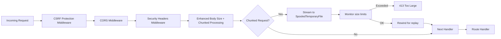

**Diagram sources**
- [main.py:69-167](file://safe4ai-pilot/app/main.py#L69-L167)
- [config.py:14-15](file://safe4ai-pilot/app/config.py#L14-L15)
- [safe4ai-implementation-plan.md:485-502](file://safe4ai-implementation-plan.md#L485-L502)

**Section sources**
- [main.py:69-167](file://safe4ai-pilot/app/main.py#L69-L167)
- [config.py:14-15](file://safe4ai-pilot/app/config.py#L14-L15)
- [test_security_headers.py:89-104](file://safe4ai-pilot/tests/test_security_headers.py#L89-L104)
- [safe4ai-implementation-plan.md:485-502](file://safe4ai-implementation-plan.md#L485-L502)

### Rate Limiting
- A shared limiter is registered at app state and reused across routes.
- Login: 5 per minute.
- Chat: 30 per minute.
- Admin document upload: 10 per hour.
- Admin endpoints: 100 per minute.

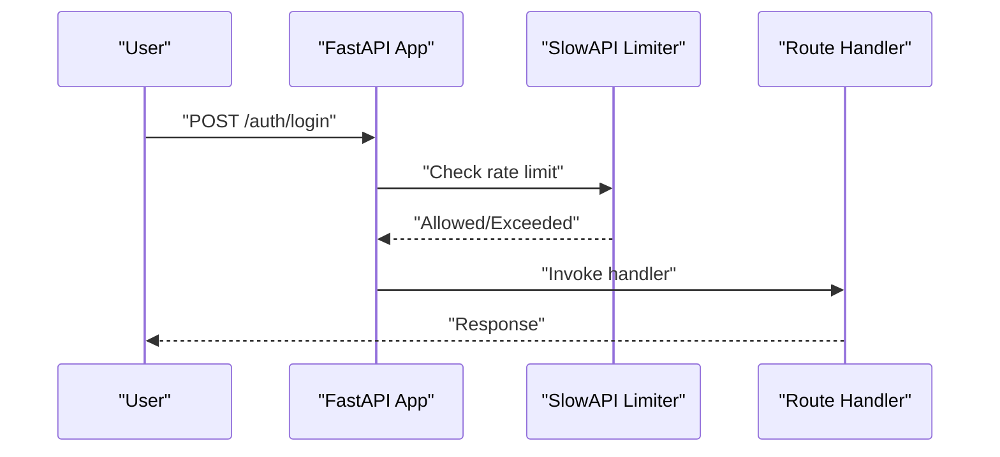

**Diagram sources**
- [main.py:63-67](file://safe4ai-pilot/app/main.py#L63-L67)
- [router.py:40-40](file://safe4ai-pilot/app/auth/router.py#L40-L40)
- [chat_routes.py:116-116](file://safe4ai-pilot/app/api/chat_routes.py#L116-L116)
- [admin_routes.py:68-68](file://safe4ai-pilot/app/api/admin_routes.py#L68-L68)
- [safe4ai-implementation-plan.md:504-510](file://safe4ai-implementation-plan.md#L504-L510)

**Section sources**
- [main.py:63-67](file://safe4ai-pilot/app/main.py#L63-L67)
- [router.py:40-40](file://safe4ai-pilot/app/auth/router.py#L40-L40)
- [chat_routes.py:116-116](file://safe4ai-pilot/app/api/chat_routes.py#L116-L116)
- [admin_routes.py:68-68](file://safe4ai-pilot/app/api/admin_routes.py#L68-L68)
- [safe4ai-implementation-plan.md:504-510](file://safe4ai-implementation-plan.md#L504-L510)

## Dependency Analysis
- Routes depend on authentication middleware for user identity and role checks.
- Chat pipeline integrates input guard, content filter, and output filter via the state machine.
- Admin routes depend on upload validator and enforce admin role, working seamlessly with enhanced chunked processing.
- Observability routes depend on current user for feedback submission.
- CSRF protection middleware depends on authentication cookies and secure comparison functions.
- Provider API key encryption depends on Fernet cryptographic primitives and SECRET_KEY derivation.
- URL validator depends on socket resolution and ipaddress validation for SSRF protection.
- Enhanced HTTP request parsing depends on secure headers and body size validation.
- Configuration drives secrets, allowed origins, HTTPS enforcement, and upload size limits with enhanced memory management.

**Updated** Enhanced dependency relationships now include CSRF protection middleware, provider API key encryption, URL validator for SSRF protection, and secure HTTP request parsing.

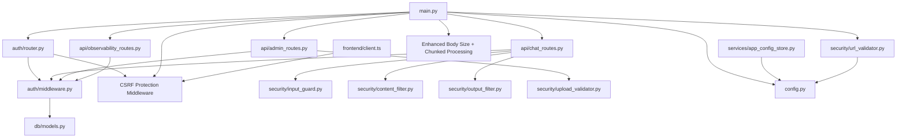

**Diagram sources**
- [router.py:39-133](file://safe4ai-pilot/app/auth/router.py#L39-L133)
- [middleware.py:51-82](file://safe4ai-pilot/app/auth/middleware.py#L51-L82)
- [chat_routes.py:115-148](file://safe4ai-pilot/app/api/chat_routes.py#L115-L148)
- [admin_routes.py:67-120](file://safe4ai-pilot/app/api/admin_routes.py#L67-L120)
- [observability_routes.py:26-45](file://safe4ai-pilot/app/api/observability_routes.py#L26-L45)
- [input_guard.py:24-48](file://safe4ai-pilot/app/security/input_guard.py#L24-L48)
- [content_filter.py:25-63](file://safe4ai-pilot/app/security/content_filter.py#L25-L63)
- [output_filter.py:31-60](file://safe4ai-pilot/app/security/output_filter.py#L31-L60)
- [upload_validator.py:24-72](file://safe4ai-pilot/app/security/upload_validator.py#L24-L72)
- [url_validator.py:26-55](file://safe4ai-pilot/app/security/url_validator.py#L26-L55)
- [main.py:63-167](file://safe4ai-pilot/app/main.py#L63-L167)
- [config.py:7-48](file://safe4ai-pilot/app/config.py#L7-L48)
- [models.py (db):52-72](file://safe4ai-pilot/app/db/models.py#L52-L72)
- [app_config_store.py:12-76](file://safe4ai-pilot/app/services/app_config_store.py#L12-L76)
- [client.ts:26-37](file://safe4ai-pilot/frontend/src/api/client.ts#L26-L37)

**Section sources**
- [router.py:39-133](file://safe4ai-pilot/app/auth/router.py#L39-L133)
- [middleware.py:51-82](file://safe4ai-pilot/app/auth/middleware.py#L51-L82)
- [chat_routes.py:115-148](file://safe4ai-pilot/app/api/chat_routes.py#L115-L148)
- [admin_routes.py:67-120](file://safe4ai-pilot/app/api/admin_routes.py#L67-L120)
- [observability_routes.py:26-45](file://safe4ai-pilot/app/api/observability_routes.py#L26-L45)
- [input_guard.py:24-48](file://safe4ai-pilot/app/security/input_guard.py#L24-L48)
- [content_filter.py:25-63](file://safe4ai-pilot/app/security/content_filter.py#L25-L63)
- [output_filter.py:31-60](file://safe4ai-pilot/app/security/output_filter.py#L31-L60)
- [upload_validator.py:24-72](file://safe4ai-pilot/app/security/upload_validator.py#L24-L72)
- [url_validator.py:26-55](file://safe4ai-pilot/app/security/url_validator.py#L26-L55)
- [main.py:63-167](file://safe4ai-pilot/app/main.py#L63-L167)
- [config.py:7-48](file://safe4ai-pilot/app/config.py#L7-L48)
- [models.py (db):52-72](file://safe4ai-pilot/app/db/models.py#L52-L72)
- [app_config_store.py:12-76](file://safe4ai-pilot/app/services/app_config_store.py#L12-L76)
- [client.ts:26-37](file://safe4ai-pilot/frontend/src/api/client.ts#L26-L37)

## Performance Considerations
- Rate limiting reduces load spikes and deters abuse; tune limits per environment.
- Enhanced body size middleware with SpooledTemporaryFile prevents memory exhaustion while maintaining streaming capabilities.
- Memory-efficient chunked processing automatically spills to disk when approaching size limits.
- Configurable maximum upload size (default 50MB) allows tuning based on deployment requirements.
- PII detection uses precompiled regular expressions; keep patterns minimal and targeted.
- Output filter combines source chunks once to reduce repeated scans.
- Fernet encryption adds minimal overhead for sensitive configuration values.
- CSRF protection middleware performs lightweight token validation with constant-time comparison.
- **Updated** SSRF protection adds minimal overhead with DNS resolution caching and efficient IP range checking.
- **Updated** Enhanced HTTP request parsing prevents ambiguous body framing attacks with minimal performance impact.

## Troubleshooting Guide
- Authentication failures:
  - Ensure SECRET_KEY is strong and not in the list of weak values.
  - Confirm HTTPS enforcement aligns with deployment (affects secure cookie flag).
  - Verify allowed origins list includes frontend origin.
- Brute force lockout:
  - Accounts with repeated failed attempts are locked for a fixed period.
  - Check user records for failure counters and lock timestamps.
- CSRF validation failures:
  - Ensure csrf_token cookie is present for all unsafe HTTP methods (POST, PUT, PATCH, DELETE).
  - Verify frontend is injecting X-CSRF-Token header for non-safe HTTP methods.
  - Check that CSRF tokens match exactly (case-sensitive) using secure comparison.
  - Confirm origin header validation for login endpoint.
  - For pre-login flows, ensure GET /auth/csrf is called to establish csrf_token cookie.
  - **Updated** CSRF protection now applies to all unsafe methods regardless of authentication state.
- SSRF protection failures:
  - Verify provider base URLs use http or https schemes only.
  - Ensure hostnames resolve to public IP addresses outside blocked ranges.
  - Check that URLs do not point to private networks (10.0.0.0/8, 172.16.0.0/12, 192.168.0.0/16, etc.).
  - **New** URL validation blocks cloud metadata endpoints and loopback addresses.
- HTTP request parsing errors:
  - Remove conflicting Content-Length and Transfer-Encoding headers.
  - Ensure chunked requests use proper Transfer-Encoding: chunked header.
  - Verify request body size does not exceed configured maximum (default 50MB).
  - **Updated** Enhanced parsing prevents ambiguous body framing attacks with explicit error messages.
- Provider API key encryption issues:
  - Verify SECRET_KEY is properly configured and not empty.
  - Check that encrypted values have 'enc:' prefix.
  - Ensure Fernet decryption handles InvalidToken gracefully.
- Upload rejections:
  - Confirm file extension, declared Content-Type, and actual MIME type meet allowed lists.
  - Ensure file size does not exceed configured maximum (default 50MB).
  - For chunked uploads, verify client sends proper Transfer-Encoding: chunked header.
- Security headers:
  - Validate presence of security headers on responses using test coverage.
- Chunked request processing:
  - Verify SpooledTemporaryFile is properly managing memory vs disk storage.
  - Check that replay mechanism preserves request body for downstream handlers.

**Updated** Added troubleshooting guidance for enhanced CSRF protection, SSRF protection, HTTP request parsing, and information disclosure controls.

**Section sources**
- [config.py:22-31](file://safe4ai-pilot/app/config.py#L22-L31)
- [router.py:53-82](file://safe4ai-pilot/app/auth/router.py#L53-L82)
- [main.py:142-167](file://safe4ai-pilot/app/main.py#L142-L167)
- [url_validator.py:26-55](file://safe4ai-pilot/app/security/url_validator.py#L26-L55)
- [app_config_store.py:32-38](file://safe4ai-pilot/app/services/app_config_store.py#L32-L38)
- [test_auth.py:119-141](file://safe4ai-pilot/tests/test_auth.py#L119-L141)
- [upload_validator.py:39-68](file://safe4ai-pilot/app/security/upload_validator.py#L39-L68)
- [test_security_headers.py:85-87](file://safe4ai-pilot/tests/test_security_headers.py#L85-L87)
- [test_security_headers.py:113-179](file://safe4ai-pilot/tests/test_security_headers.py#L113-L179)

## Conclusion
The system implements layered security through robust authentication, input/output safeguards, upload validation, global security headers, CORS, rate limiting, and comprehensive CSRF protection. The enhanced request handling now features chunked processing with SpooledTemporaryFile for large uploads, providing memory-efficient processing while preserving streaming capabilities. The new CSRF protection middleware implements mandatory double-submit verification with secure token comparison for all unsafe HTTP methods, requiring csrf_token cookies regardless of authentication state. The new SSRF protection system validates provider base URLs against comprehensive IP range blocking, preventing server-side request forgery attacks. Enhanced HTTP request parsing prevents ambiguous body framing attacks by explicitly detecting CL/TE header conflicts. Information disclosure controls sanitize health endpoint responses and error messages to prevent sensitive data leakage. Operators should configure secrets and origins carefully, monitor audit logs, adjust rate limits according to deployment needs, and tune upload size limits based on system capacity. These controls collectively mitigate common threats such as credential theft, prompt injection, hallucinated PII, excessive resource consumption, memory exhaustion during large file uploads, cross-site request forgery, unauthorized access to sensitive configuration data, server-side request forgery attacks, and information disclosure vulnerabilities.

**Updated** Enhanced conclusion reflects the new CSRF protection capabilities for all unsafe methods, comprehensive SSRF protection system, HTTP request parsing improvements, and information disclosure controls.

## Appendices

### Security Configuration Examples
- Environment variables and defaults:
  - SECRET_KEY: must be at least 16 characters and not weak.
  - ALLOWED_ORIGINS: comma-separated list; never use wildcard in production.
  - ENFORCE_HTTPS: toggles secure flag on cookies and HSTS behavior.
  - MAX_UPLOAD_SIZE_MB: maximum file size in megabytes (default 50MB).
- Cookie policy:
  - access_token is HTTP-only, strict SameSite, and secure when HTTPS is enforced.
  - csrf_token is accessible to frontend JavaScript for CSRF protection.
- Enhanced request processing:
  - SpooledTemporaryFile automatically manages memory vs disk storage.
  - Default maximum upload size is 50MB, configurable via environment settings.
- CSRF protection:
  - Double-submit verification requires csrf_token cookie for all unsafe methods.
  - Secure constant-time comparison prevents timing attacks.
  - Origin validation for login endpoint prevents cross-origin CSRF.
  - Pre-login CSRF tokens generated via GET /auth/csrf with 5-minute TTL.
- **Updated** SSRF protection:
  - Provider base URLs validated against private/reserved IP ranges.
  - Only http and https schemes allowed.
  - Hostname resolution verified before allowing connections.
- **Updated** HTTP request parsing:
  - Explicit rejection of ambiguous CL/TE header combinations.
  - Safe body replay prevents monkey-patching vulnerabilities.
  - Information disclosure controls sanitize responses.

**Updated** Added configuration examples for enhanced CSRF protection, SSRF protection, HTTP request parsing, and information disclosure controls.

**Section sources**
- [config.py:7-48](file://safe4ai-pilot/app/config.py#L7-L48)
- [router.py:96-133](file://safe4ai-pilot/app/auth/router.py#L96-L133)
- [main.py:105-115](file://safe4ai-pilot/app/main.py#L105-L115)
- [main.py:142-167](file://safe4ai-pilot/app/main.py#L142-L167)
- [url_validator.py:26-55](file://safe4ai-pilot/app/security/url_validator.py#L26-L55)
- [app_config_store.py:12-25](file://safe4ai-pilot/app/services/app_config_store.py#L12-L25)

### Compliance and Controls Checklist
- CORS: Origins list from environment, credentials enabled, restricted methods.
- Security headers: HSTS, CSP, XFO, XContentTypeOptions, Referrer-Policy, Permissions-Policy.
- Rate limiting: Login, chat, admin document upload, admin endpoints.
- Upload security: Extension whitelist, declared and magic-byte MIME checks, size limit, UUID-based filenames.
- Authentication: bcrypt password hashing, JWT HS256 with expiry, role-based access, brute-force protection.
- CSRF protection: Double-submit verification for all unsafe methods, secure token comparison, origin validation, pre-login token generation.
- **Updated** SSRF protection: URL validation against private/reserved IP ranges, scheme restriction, hostname resolution.
- **Updated** HTTP request parsing: CL/TE conflict detection, safe body replay, information disclosure controls.
- Provider API key encryption: Fernet cryptographic primitives, at-rest data protection.
- Enhanced request processing: Memory-efficient chunked uploads, automatic size monitoring, streaming preservation.

**Updated** Added compliance controls for enhanced CSRF protection, SSRF protection, HTTP request parsing, and information disclosure controls.

**Section sources**
- [safe4ai-implementation-plan.md:485-517](file://safe4ai-implementation-plan.md#L485-L517)
- [main.py:69-167](file://safe4ai-pilot/app/main.py#L69-L167)
- [router.py:40-40](file://safe4ai-pilot/app/auth/router.py#L40-L40)
- [admin_routes.py:68-68](file://safe4ai-pilot/app/api/admin_routes.py#L68-L68)
- [upload_validator.py:13-21](file://safe4ai-pilot/app/security/upload_validator.py#L13-L21)
- [url_validator.py:11-23](file://safe4ai-pilot/app/security/url_validator.py#L11-L23)
- [app_config_store.py:12-76](file://safe4ai-pilot/app/services/app_config_store.py#L12-L76)